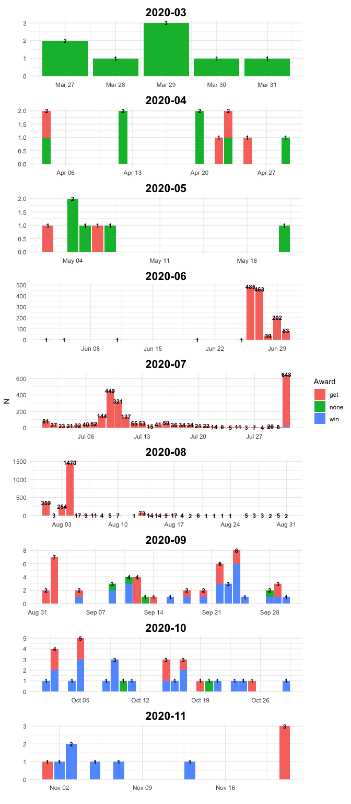
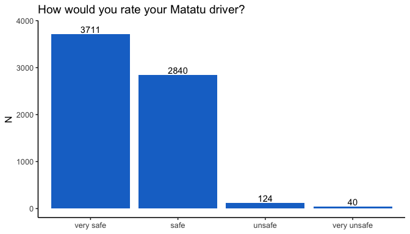
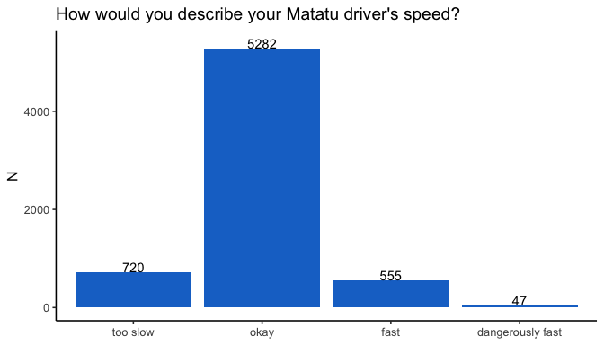
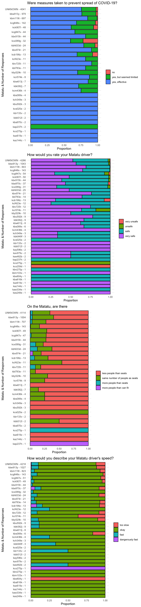

This document summarizes results from piloting the Matatu Rider Feedback project. So far, there have been 4 pilots:

__Pilot 1__

* __Number of Vehicles:__ 5
* __Start Date:__ March 27, 2020
* __Awards:__ None
* __QR/Shortcode On Sticker:__ Only QR
* __Other Details:__ Installed on long range Lothian buses

__Pilot 2__

* __Number of Vehicles:__ 15
* __Start Date:__ June 25, 2020
* __Awards:__ (1) 8 vehicles advertised that each user would get 200 KES after completing the survey; (2) 7 vehicles advertised that each user would get 100 KES after completing the survey. After an initial large response rate, the award was lowered to 50 KES. The stickers still advertised 100 and 200 KES; however, the survey notified the user that the award had been lowered.
* __QR/Shortcode On Sticker:__ Both
* __Other Details:__ 

__Pilot 3__

* __Number of Vehicles:__ 15
* __Start Date:__ July 29, 2020
* __Awards:__ (1) 9 vehicles advertised that riders would receive 50 KES after completing the survey; (2) 6 vehicles advertising that users could win 50 KES after completing the survey
* __QR/Shortcode On Sticker:__ (1) In 12 matatus, the stickers had both the shortcode and QR code; (2) in 3 matatus, the stickers just had the QR code.
* __Other Details:__


__Pilot 4__

* __Number of Vehicles:__ 21
* __Start Date:__ September 5, 2020
* __Awards:__ For all vehicles, stickers advertised that users could win 100 KES after completing the survey.
* __QR/Shortcode On Sticker:__ In 11 matatus, the stickers had both the shortcode and QR code; in 10 matatus the stickers just had the QR code.
* __Other Details:__ In the design of the sticker the QR code was made larger to make it easier to scan


# Number of Responses

## Daily - By Posted Award Type

```r
data_award <- data %>%
  filter(!is.na(complete_date)) %>%
  group_by(date, award_type, month) %>%
  dplyr::summarise(N = n()) 
```

```
## `summarise()` has grouped output by 'date', 'award_type'. You can override
## using the `.groups` argument.
```

```r
data_total <- data %>%
  filter(!is.na(complete_date)) %>%
  group_by(date, month) %>%
  dplyr::summarise(N_total = n()) %>%
  ungroup() 
```

```
## `summarise()` has grouped output by 'date'. You can override using the
## `.groups` argument.
```

```r
ggplot() +
  geom_col(data = data_award, 
           aes(x=date, y=N,
               fill = award_type,
               group = award_type)) +
  geom_text(data = data_total,
            aes(x=date, y=N_total,
                label = N_total), 
            color = "black", 
            fontface = "bold",
            size=3) +
  #geom_vline(xintercept = as.Date(PILOT_2_DATE),
  #           color = "red") +
  labs(fill = "Award",
       x = "") +
  theme_minimal() +
  facet_wrap(~month,
             ncol = 1,
             scales ="free") +
  theme(strip.text = element_text(face = "bold", size=16, color = "black", hjust = 0.5))
```

<!-- -->

## By Matatu

```r
data %>%
  filter(!is.na(complete_date)) %>%
  group_by(reg_no, pilot_number) %>%
  dplyr::summarise(N = n(),
                   date = max(date),
                   "Prop Use Shortcode" = mean(response_method %in% "shortcode") %>% 
                     round(2)) %>%
  mutate(pilot_number = pilot_number %>% as.character()) %>%
  dplyr::rename("Reg Number" = reg_no,
                "Pilot Number" = pilot_number,
                "Latest Entry" = date) %>%
  datatable(filter = 'top')
```

```
## `summarise()` has grouped output by 'reg_no'. You can override using the
## `.groups` argument.
```

```{=html}
<div id="htmlwidget-a702094d9c29fded1dee" style="width:100%;height:auto;" class="datatables html-widget"></div>
<script type="application/json" data-for="htmlwidget-a702094d9c29fded1dee">{"x":{"filter":"top","vertical":false,"filterHTML":"<tr>\n  <td><\/td>\n  <td data-type=\"character\" style=\"vertical-align: top;\">\n    <div class=\"form-group has-feedback\" style=\"margin-bottom: auto;\">\n      <input type=\"search\" placeholder=\"All\" class=\"form-control\" style=\"width: 100%;\"/>\n      <span class=\"glyphicon glyphicon-remove-circle form-control-feedback\"><\/span>\n    <\/div>\n  <\/td>\n  <td data-type=\"character\" style=\"vertical-align: top;\">\n    <div class=\"form-group has-feedback\" style=\"margin-bottom: auto;\">\n      <input type=\"search\" placeholder=\"All\" class=\"form-control\" style=\"width: 100%;\"/>\n      <span class=\"glyphicon glyphicon-remove-circle form-control-feedback\"><\/span>\n    <\/div>\n  <\/td>\n  <td data-type=\"integer\" style=\"vertical-align: top;\">\n    <div class=\"form-group has-feedback\" style=\"margin-bottom: auto;\">\n      <input type=\"search\" placeholder=\"All\" class=\"form-control\" style=\"width: 100%;\"/>\n      <span class=\"glyphicon glyphicon-remove-circle form-control-feedback\"><\/span>\n    <\/div>\n    <div style=\"display: none;position: absolute;width: 200px;opacity: 1\">\n      <div data-min=\"1\" data-max=\"3928\"><\/div>\n      <span style=\"float: left;\"><\/span>\n      <span style=\"float: right;\"><\/span>\n    <\/div>\n  <\/td>\n  <td data-type=\"date\" style=\"vertical-align: top;\">\n    <div class=\"form-group has-feedback\" style=\"margin-bottom: auto;\">\n      <input type=\"search\" placeholder=\"All\" class=\"form-control\" style=\"width: 100%;\"/>\n      <span class=\"glyphicon glyphicon-remove-circle form-control-feedback\"><\/span>\n    <\/div>\n    <div style=\"display: none;position: absolute;width: 200px;opacity: 1\">\n      <div data-min=\"1585353600000\" data-max=\"1605916800000\"><\/div>\n      <span style=\"float: left;\"><\/span>\n      <span style=\"float: right;\"><\/span>\n    <\/div>\n  <\/td>\n  <td data-type=\"number\" style=\"vertical-align: top;\">\n    <div class=\"form-group has-feedback\" style=\"margin-bottom: auto;\">\n      <input type=\"search\" placeholder=\"All\" class=\"form-control\" style=\"width: 100%;\"/>\n      <span class=\"glyphicon glyphicon-remove-circle form-control-feedback\"><\/span>\n    <\/div>\n    <div style=\"display: none;position: absolute;width: 200px;opacity: 1\">\n      <div data-min=\"0\" data-max=\"1\" data-scale=\"2\"><\/div>\n      <span style=\"float: left;\"><\/span>\n      <span style=\"float: right;\"><\/span>\n    <\/div>\n  <\/td>\n<\/tr>","data":[["1","2","3","4","5","6","7","8","9","10","11","12","13","14","15","16","17","18","19","20","21","22","23","24","25","26","27","28","29","30","31","32","33","34","35","36","37","38","39","40","41"],["kap237h","kas248e","kas482b","kav979v","kaw334e","kay596s","kaz144z","kaz619z","kba816k","kba970c","kbb512l","kbe804y","kbh633d","kbk582j","kbk949f","kbl783e","kbm103x","kbm119t","kbn275p","kbr133v","kbs089s","kbu592k","kbv725t","kbw613j","kbw913y","kbx915h","kbx974r","kby529k","kcb198z","kcf423e","kcg847s","kcg848s","kch349e","kck907l","kcm436k","kcr574k","kcs025e","kcx089g","kcx259d","kcx275p","UNKNOWN"],["1","4","4","4","4","4","4","3","4","4","3","4","2","3","4","3","4","3","4","3","3","3","2","3","2","2","2","2","2","2","2","2","3","2","3","3","2","1","1","1",null],[3,1,2,2,1,2,1,1,1,36,2,1,22,9,3,14,1,764,1,2,6,9,11,8,922,44,21,10,13,11,43,140,3,46,4,11,2,32,1,1,3928],["2020-03-28","2020-10-02","2020-10-17","2020-09-28","2020-10-16","2020-10-23","2020-08-04","2020-07-31","2020-10-04","2020-11-07","2020-08-03","2020-10-17","2020-07-22","2020-11-13","2020-09-29","2020-09-29","2020-09-23","2020-11-21","2020-09-24","2020-07-31","2020-09-30","2020-09-18","2020-07-25","2020-10-02","2020-09-02","2020-08-23","2020-07-22","2020-07-19","2020-07-19","2020-08-03","2020-09-14","2020-09-22","2020-07-31","2020-09-29","2020-07-31","2020-11-01","2020-07-20","2020-10-20","2020-03-29","2020-03-29","2020-09-02"],[0,0,0.5,1,0,0.5,1,1,0,1,1,0,1,1,1,1,1,1,1,1,1,1,1,1,1,0.98,1,0.9,1,0.91,1,0.98,1,0.91,1,1,1,0,0,0,1]],"container":"<table class=\"display\">\n  <thead>\n    <tr>\n      <th> <\/th>\n      <th>Reg Number<\/th>\n      <th>Pilot Number<\/th>\n      <th>N<\/th>\n      <th>Latest Entry<\/th>\n      <th>Prop Use Shortcode<\/th>\n    <\/tr>\n  <\/thead>\n<\/table>","options":{"columnDefs":[{"className":"dt-right","targets":[3,5]},{"orderable":false,"targets":0}],"order":[],"autoWidth":false,"orderClasses":false,"orderCellsTop":true}},"evals":[],"jsHooks":[]}</script>
```

## By Pilot Number

```r
# pilot_df_adj <- pilot_df %>%
#   mutate(pilot_number = pilot_number %>% as.character(),
#          start_date = start_date %>% ymd()) %>%
#   mutate(today_date = Sys.Date()) %>%
#   mutate(n_days = difftime(today_date, start_date, units = "days") %>% as.numeric()) %>%
#   dplyr::select(pilot_number, n_days, n_vehicles)

pilot_df_adj <- pilot_df %>%
  mutate(pilot_number = pilot_number %>% as.character())

data$subset_type <- paste(data$pilot_number, "-", data$award_type)

df_first30days <- lapply(unique(data$subset_type), function(subset_type){
  data_i <- data[data$subset_type %in% subset_type,]
  data_i <- data_i[!is.na(data_i$complete_date),]
  
  day_start <- data_i$date %>% min()
  day_end <- day_start + 30
  
  data_i <- data_i[data_i$date <= day_end,]
  
  return(data.frame(pilot_number = data_i$pilot_number[1],
                    award_type = data_i$award_type[1],
                    N_first_30_days = nrow(data_i)))
}) %>%
  bind_rows() %>%
  mutate(pilot_number = pilot_number %>% as.character()) %>%
  filter(!is.na(pilot_number))

data %>%
  dplyr::filter(!is.na(complete_date)) %>%
  dplyr::mutate(pilot_number = as.character(pilot_number),
                pilot_number = tidyr::replace_na(pilot_number, "Unknown - No Reg. No.")) %>%
  group_by(pilot_number, award_type) %>%
  dplyr::summarise(N = n()) %>%
  left_join(pilot_df_adj, by = c("pilot_number", "award_type")) %>%
  left_join(df_first30days, by = c("pilot_number", "award_type")) %>%
  mutate("Average Number of Responses Per Vehicle Per Day in First 30 Days of Pilot" = N_first_30_days/n_vehicles/30) %>%
  dplyr::rename("Pilot Number" = pilot_number,
                "N (first 30 days)" = N_first_30_days,
                "Award Type" = award_type) %>%
  dplyr::select("Pilot Number", 
                "Award Type",
                "N", 
                "N (first 30 days)",
                "Average Number of Responses Per Vehicle Per Day in First 30 Days of Pilot") %>%
  kable() %>%
  kable_styling(full_width = F)
```

```
## `summarise()` has grouped output by 'pilot_number'. You can override using the
## `.groups` argument.
```

<table class="table" style="width: auto !important; margin-left: auto; margin-right: auto;">
 <thead>
  <tr>
   <th style="text-align:left;"> Pilot Number </th>
   <th style="text-align:left;"> Award Type </th>
   <th style="text-align:right;"> N </th>
   <th style="text-align:right;"> N (first 30 days) </th>
   <th style="text-align:right;"> Average Number of Responses Per Vehicle Per Day in First 30 Days of Pilot </th>
  </tr>
 </thead>
<tbody>
  <tr>
   <td style="text-align:left;"> 1 </td>
   <td style="text-align:left;"> none </td>
   <td style="text-align:right;"> 37 </td>
   <td style="text-align:right;"> 14 </td>
   <td style="text-align:right;"> 0.0933333 </td>
  </tr>
  <tr>
   <td style="text-align:left;"> 2 </td>
   <td style="text-align:left;"> get </td>
   <td style="text-align:right;"> 1285 </td>
   <td style="text-align:right;"> 1238 </td>
   <td style="text-align:right;"> 2.7511111 </td>
  </tr>
  <tr>
   <td style="text-align:left;"> 3 </td>
   <td style="text-align:left;"> get </td>
   <td style="text-align:right;"> 811 </td>
   <td style="text-align:right;"> 782 </td>
   <td style="text-align:right;"> 2.8962963 </td>
  </tr>
  <tr>
   <td style="text-align:left;"> 3 </td>
   <td style="text-align:left;"> win </td>
   <td style="text-align:right;"> 22 </td>
   <td style="text-align:right;"> 20 </td>
   <td style="text-align:right;"> 0.1111111 </td>
  </tr>
  <tr>
   <td style="text-align:left;"> 4 </td>
   <td style="text-align:left;"> get </td>
   <td style="text-align:right;"> 3 </td>
   <td style="text-align:right;"> 3 </td>
   <td style="text-align:right;"> NA </td>
  </tr>
  <tr>
   <td style="text-align:left;"> 4 </td>
   <td style="text-align:left;"> win </td>
   <td style="text-align:right;"> 49 </td>
   <td style="text-align:right;"> 31 </td>
   <td style="text-align:right;"> 0.0492063 </td>
  </tr>
  <tr>
   <td style="text-align:left;"> Unknown - No Reg. No. </td>
   <td style="text-align:left;"> get </td>
   <td style="text-align:right;"> 3921 </td>
   <td style="text-align:right;"> NA </td>
   <td style="text-align:right;"> NA </td>
  </tr>
  <tr>
   <td style="text-align:left;"> Unknown - No Reg. No. </td>
   <td style="text-align:left;"> win </td>
   <td style="text-align:right;"> 7 </td>
   <td style="text-align:right;"> NA </td>
   <td style="text-align:right;"> NA </td>
  </tr>
</tbody>
</table>

# Feedback 

## Overall - All Vehicles

```r
data %>%
  dplyr::filter(!is.na(driver_rating)) %>%
  group_by(driver_rating) %>%
  dplyr::summarise(N = n()) %>%
  dplyr::mutate(driver_rating = driver_rating %>%
                  factor(levels = c("very safe",
                                    "safe",
                                    "unsafe",
                                    "very unsafe"))) %>%
  ggplot(aes(x = driver_rating,
             y = N)) +  geom_col(fill = "dodgerblue3") +
  geom_text(aes(label = N,
                y = N + 100),
            fill = "dodgerblue3") +
  theme_classic2() +
  labs(x = NULL,
       title = "How would you rate your Matatu driver?")
```

```
## Warning: Ignoring unknown parameters: fill
```

<!-- -->


```r
data %>%
  dplyr::filter(!is.na(speed_rating)) %>%
  group_by(speed_rating) %>%
  dplyr::summarise(N = n()) %>%
  dplyr::mutate(speed_rating = speed_rating %>%
                  factor(levels = c("too slow",
                                    "okay",
                                    "fast",
                                    "dangerously fast"))) %>%
  ggplot(aes(x = speed_rating,
             y = N)) +
  geom_col(fill = "dodgerblue3") +
  geom_text(aes(label = N,
                y = N + 100),
            fill = "dodgerblue3") +
  theme_classic2() +
  labs(x = NULL,
       title = "How would you describe your Matatu driver's speed?")
```

```
## Warning: Ignoring unknown parameters: fill
```

<!-- -->

## Questions by Vehicle

```r
data_long <- data %>%
  dplyr::select(reg_no, 
                driver_rating, speed_rating, occupancy, covid_measures) %>%
  pivot_longer(-reg_no) %>%
  
  filter(value != "",
         !is.na(value)) %>%
  
  # Number of responses per question, per vehicle
  group_by(reg_no, name) %>%
  mutate(N_veh = n()) %>%
  ungroup() %>%
  
  # Aggregate
  group_by(name, value, reg_no, N_veh) %>%
  summarise(N = n()) %>%
  ungroup()  %>%
  
  # Clean variables
  mutate(reg_no = paste0(reg_no, " - ", N_veh)) %>%
  mutate(N = N/N_veh)
```

```
## `summarise()` has grouped output by 'name', 'value', 'reg_no'. You can override
## using the `.groups` argument.
```

```r
data_long$name[data_long$name %in% "driver_rating"] <- "How would you rate your Matatu driver?"
data_long$name[data_long$name %in% "covid_measures"] <- "Were measures taken to prevent spread of COVID-19?"
data_long$name[data_long$name %in% "occupancy"] <- "On the Matatu, are there"
data_long$name[data_long$name %in% "speed_rating"] <- "How would you describe your Matatu driver's speed?"

data_long$value <- data_long$value %>% str_squish() %>% tolower()

data_long$value <- factor(data_long$value, levels = c("no",
                                                      "yes, but seemed limited",
                                                      "yes, effective",
                                                      
                                                      "very unsafe",
                                                      "unsafe",
                                                      "safe",
                                                      "very safe",
                                                      
                                                      "less people than seats",
                                                      "same number of people as seats",
                                                      "more people than seats",
                                                      "more people than can fit",
                                                      
                                                      "too slow",
                                                      "okay",
                                                      "fast",
                                                      "dangerously fast"))

out_plot <- lapply(data_long$name %>% unique, function(i){
  
  data_long %>%
    filter(name %in% i) %>%
    ggplot(aes(x = reorder(reg_no, N_veh), # 
               y = N, group=value, fill=value)) +
    geom_col(color="black") +
    labs(x="", y="",
         title = i) +
    theme_minimal() +
    coord_flip() +
    labs(x = "Matatu & Number of Responses", y = "Proportion", fill = "") 
  
}) 

do.call(grid.arrange, c(out_plot, ncol=1))
```

<!-- -->


## Feedback - Length of Text Response

```r
data$feedback_nwords_bin <- NA
data$feedback_nwords_bin[data$feedback_nwords %in% 1] <- "1"
data$feedback_nwords_bin[data$feedback_nwords %in% 2] <- "2"
data$feedback_nwords_bin[data$feedback_nwords %in% 3:5] <- "3 - 5"
data$feedback_nwords_bin[data$feedback_nwords %in% 6:10] <- "6 - 10"
data$feedback_nwords_bin[data$feedback_nwords %in% 11:20] <- "11 - 20"
data$feedback_nwords_bin[data$feedback_nwords %in% 21:9999] <- ">20"

data$feedback_nwords_bin <- data$feedback_nwords_bin %>%
  factor(levels = c("1", "2", "3 - 5", 
                    "6 - 10", "11 - 20", ">20"))

data %>%
  filter(feedback_nwords > 0) %>%
  group_by(feedback_nwords_bin) %>%
  dplyr::summarise(N = n()) %>%
  ungroup() %>%
  mutate(percent = (N/sum(N)*100) %>% round(1) %>% paste("%")) %>%
  ggplot(aes(x = feedback_nwords_bin,
             y = N)) +
  geom_col(fill = "dodgerblue", color = "black") +
  geom_text(aes(label = percent), nudge_y = 100) +
  labs(x = "N Words", 
       y = "N Responses") +
  theme_ipsum()
```

<!-- -->

## Feedback - Text Response

```r
data %>%
  filter(feedback_nwords > 0) %>%
  arrange(desc(feedback_nwords)) %>%
  dplyr::select(feedback, reg_no) %>%
  dplyr::rename("Matatu" = reg_no,
                Feedback = feedback) %>%
  paged_table()
```

<div data-pagedtable="false">
  <script data-pagedtable-source type="application/json">
{"columns":[{"label":["Feedback"],"name":[1],"type":["chr"],"align":["left"]},{"label":["Matatu"],"name":[2],"type":["chr"],"align":["left"]}],"data":[{"1":"our matatu system has really evolved over the years and we have experienced much since the commencement...i believe with the rapid changes we can improve even more...many policies put in place should be able to safeguard the driver, the passengers, the matatu and even the pedestrians...especially during this covid 19 pandemic we need to be very vigilant by following every government and moh guidelines...we ensure we stay safe to save lives...i believe matatu culture has more to offer to kenyans","2":"UNKNOWN"},{"1":"i was texting to report a psv vehicle under kenya mpya (bus number 53) using the thika route.they are not observing covid rules of sanitizers and carrying excess passengers..its worse during the evening hours because they observe the 60%rule but passengers even stand in the bus after the 60% are packed... due to lack of seats..","2":"UNKNOWN"},{"1":"yeah sure,all i wold recomend is the traffic police to b more keen on this route as there are no any health measures being taken....passangers are being mistreated .i suppose that the government b more keen on matatu people as they contribute much un the increase of the cases daily.thankyou","2":"UNKNOWN"},{"1":"1. due to the covid- 19 pandemic the matatu drivers shouldn't give up in providing the hand sanitizers to passengers so as to flatten the curve of this virus.2. matatu drivers are just okay, that's a good work3. loud music is not necessary to most of us","2":"UNKNOWN"},{"1":"maybe to the said about drivers who are corrupt giving bribes and using other routes,, to take caution and let them know they will suffer alot as the disease is spreading faster due to their ignorance,,, let them know that it time to be serious","2":"kbw913y"},{"1":"compliment my driver for taking the best measures that have been directed by ntsa & the ministry of health. 1. no excess passangers. 2. no overspeeding and reckless driving3. recomends all passangers sanitize and keep distance in the matatu before he sets to drive@qyvn_consta69ine","2":"UNKNOWN"},{"1":"i like my driver and the conductor for being on the first line in the fight against covid 19 by adhering to the moh directives, they do not exceed the 8 passengers in the 14 seater matatu and they dont carry people without masks.","2":"UNKNOWN"},{"1":"to the driver it's quite a trial with your team on measures you're supposed to take to control this corona pandemic. you ought to do more and be more strict on this . otherwise i enjoyed the drive...it's quite commendable","2":"UNKNOWN"},{"1":"well on my part i can say that the operators of the matatu took all the necessary measures to try and mitigate the spread of covid 19 as well as following the rules and regulations that guide road users.","2":"kbw913y"},{"1":"i appreciate the driver for making sure that all passengers are safe,partaining the current pandemic of covid_19 we are facing,for installing the preventive measures equipments in the matatu like sanitizers as well as social distances are adhered to.","2":"kbw913y"},{"1":"this driver drives okay,not fast but not too slow,,,passengers are seated as required by the social distance guide,as directed by govt but measures on sanitizing the passengers should be more enhanced,,stricter everyone with no exception should be sanized.","2":"kbw913y"},{"1":"i would like to tell the drivers of the matatu and also to all riders to observe the measure concerning dhi prenvention of the virus covid;they should keep distance,wear there masks always and sanitize wherever they are.","2":"UNKNOWN"},{"1":"i would like to complement the driver for driving at the expected speed not slowly and not fast and for making sure that the regulations given by the government on prevention of corona are adhered to strictly.","2":"UNKNOWN"},{"1":"i think the drivers applying route 46 (kawangware) have tried there best and i think that's the reason why the spread of covid_19 has gone down in the area and i'm very happy for that","2":"UNKNOWN"},{"1":"i would like to compliment the driver driving the matatu im using now because he is driving safely and thank him and the conductor for adhering to the rules set in the control of covid19","2":"UNKNOWN"},{"1":"the speed of the matatu is ok the driver and the conductor are good too they make sure every passenger is comfortable and obey the government restrictions of keeping social distance and wearing of masks.","2":"UNKNOWN"},{"1":"the most peaceful bus from the company. the driver dove safely no speeding . the conductor is the most polite conductor ever in the industry. hesbon is his name . i oaidhim through mpesa","2":"kcx089g"},{"1":"not to put loud music but cool ones because it help each a everyone passengers and it help each a everyone to link in they email free without been charge by using wifi","2":"kbw913y"},{"1":"the steps taken by the matatu industry ensuring that its passengers are treated right and protected during this high time we're all alert to the pandemic ....i congratulate them for the effort taken","2":"kcg847s"},{"1":"the management of lothian buses should take the case of covid19 seriously and sanitize each and every passager boarding the bus. and not to allow passangers without mask to get on board.","2":"UNKNOWN"},{"1":"i would love to board the matatu cause the driver was cautious when driving plus he made sure that the regulations by the healthy ministry were considered to the latter","2":"kbw913y"},{"1":"i would like to tell the driver to observe all the measures that have been put in place so as to be in the safe condition while on the road","2":"UNKNOWN"},{"1":"yes i will,,if it's unsafe i report or get out of that vehicle and take another,,, for my safety,,but am okay the driver is driving following the protocols for driving","2":"UNKNOWN"},{"1":"the drive was safe and the driver really tried to make sure we arrived on time and also provided us with some santiziers as we boarded he was okay average","2":"UNKNOWN"},{"1":"the matatu driver ensures all the measures to curb the spread of covid-19 is put in place, drives a a speed which is okay to all and that ensures safety","2":"UNKNOWN"},{"1":"this driver is fantastically safe, most concerned on the measures put across by the government to prevent the spread of covid-19. i would urge other drivers to follow the same.","2":"UNKNOWN"},{"1":"thanks to the driver.....hes following all the government initiatives because he understands a human life matters....stay safe n keep distance not forgetting.....to sanitize..for safety beings with you.....we shall overcome","2":"kbw913y"},{"1":"yes because my driver is very safe when driving he does not drive on a high speed and in terms of music he puts it in a low sound","2":"kbw913y"},{"1":"i would like to advice all the drivers that may take all the precaution and also to make sure that they follow the rules and regulations of the traffic.","2":"kbw913y"},{"1":"life of people matters so drivers should be very keen on the roads,and covid 19 is real let's do what the government tells us to do for our selfty","2":"UNKNOWN"},{"1":"i don't have any complain about matatu drivers for now but i think the government should provide sanitizers to matatus coz the sanizer are expensive to some of us","2":"UNKNOWN"},{"1":"he drives very carefully and with limited speed and he strictly makes sure that the measures taken to stop spread of covid 19 are followed by all passengers","2":"kbw913y"},{"1":"the matatu drivers should take the covid 19 precautions very seriously . disinfect door handles and areas that people get in contact with..and also maintain the social distance","2":"kbw913y"},{"1":"as one of the passengers i wish,you guys well and i enjoyed your services, i will consider you every time i will travel,if you are available, thank you.","2":"kbm119t"},{"1":"our driver is so good he is making sure everybody sanitizes before going into the car and maintaining social distance the vehicle is in a good condition too","2":"kbm119t"},{"1":"the driver was very kin on his job i don't see any unsafe condition and therefore i'd urge some of them to follow the rules of the ntsa","2":"UNKNOWN"},{"1":"the matatu is keenly undertaking the measures put up to prevent the spread of covid-19 and all matatus should do the same to protect lives of us all","2":"UNKNOWN"},{"1":"the matatu driver has put in place measures to curb the spread of covid 19 by providing sanitizers to passengers and carrying few passengers to enhance social distance","2":"UNKNOWN"},{"1":"the driver is clean,drives safely and he has taken all measure for covid 19 prevention also the matatu is in good state and social distance is maintained .","2":"UNKNOWN"},{"1":"the ride was just fine and the driver puts all the passengers at ease and comfortable by observing all the hygienic measures and driving at the right speed.","2":"UNKNOWN"},{"1":"yes,want to encourage the driver to continue driving slowly,carefully and not to overload passengers and follow government directives on covid 19 so as to prevent the virus","2":"kbm119t"},{"1":"i would like to tell the driver that he\\\\she is risking alot of lives and therefore should take all required measures for the good of them all","2":"kbm119t"},{"1":"the driver is cautious with a very commendable speed, except that the sanitization process and control of covid 19 is still limited due to lack of resources","2":"UNKNOWN"},{"1":"yes i think drivers should try to ensure that the passengers are safe in terms of avoiding road carnage as well as minimizing the spread of covid","2":"UNKNOWN"},{"1":"the ride was very safe , every sanitize before entering and we also observed one meter away rule. the vehicle speed was awesome. i enjoyed the travel","2":"UNKNOWN"},{"1":"i would like to compliment the driver. if everyone followed the rules like he did, we will be a long way in preventing the virus. good job.","2":"UNKNOWN"},{"1":"the driver is keen on the road, the speed is okay and social distancing is well managed. all measures to prevent the spread of covid19 are taken.","2":"UNKNOWN"},{"1":"i truly enjoyed the drive blessings to the driver for caring about his customers health and also respecting the governments regulations to control this pandemic. thank you","2":"UNKNOWN"},{"1":"grateful to the driver for observing the safe rules on the road and also putting sticks to educated the people boarding the matatu in matter concerning covid19","2":"UNKNOWN"},{"1":"the driver makes sure that the measures taken in the matatu to stop the spread of covid-19 are consindered such as the use of sanitizers .","2":"kbw913y"},{"1":"to all our drivers remember to ensure the safety of your passengers and remember to follow the rules in this time we are having a pandemic","2":"kbw913y"},{"1":"am so glad by the matatu industry operators for the masseurs taken during this time of the pandemic by ensuring that all its customers are safe","2":"kcg847s"},{"1":"yes,i would like to compliment the drive since he's observing road safety and is observing all the necessary measures to protect us passengers from contracting covid19","2":"kbm119t"},{"1":"drivers should learn how to obey traffic laws and driver carefully keeping in mind that they are entrusted with the life of their passengers. thank you.","2":"UNKNOWN"},{"1":"for this matatu its ok, the driver is driving well and the conductor is observing the number of passengers required unlike most of them. thank you","2":"UNKNOWN"},{"1":"thanks.. with the current situation in our country.. covid has made each and everyone one of us careful ..so people av trained to be self conscious","2":"UNKNOWN"},{"1":"i would like to to tell him to always sanitize and to carry the correct number of people required in the matatu also to drive safe","2":"UNKNOWN"},{"1":"the matatu is good and the rules and regulations given 4 covid 19 is strickly followed so i urge thm to remain with the same spirit","2":"UNKNOWN"},{"1":"what i would like to advice drivers is that they adjust to those rules so as to keep safe and pretend the spread of covid 19","2":"UNKNOWN"},{"1":"our police personnel are not taking good look on the reckless drivers and our drivers should also be given advice on the importance of good driving.","2":"UNKNOWN"},{"1":"am so careful when am driving cause i carried lives of my kanyans. and i need to those who drives roughly being held to the court","2":"UNKNOWN"},{"1":"the driver was careful ,safely driving ..there was the speed governor so he couldn't over speed...it was the tout who made everything about the ride unsafe","2":"UNKNOWN"},{"1":"what i would like to advice drivers is that they adjust to those rules so as to keep safe and pretend the spread of covid 19","2":"UNKNOWN"},{"1":"what i would like to advice drivers is that they adjust to those rules so as to keep safe and pretend the spread of covid 19","2":"UNKNOWN"},{"1":"i ask our drivers nt to over speed drive safely and adhere to covid 19 rules so that we can overcome this pandemic and accidents.","2":"kbw913y"},{"1":"it helps the passenger not to sleep in a matatu and it keeps then alacrity and some work on they way to work using wifi","2":"kbw913y"},{"1":"the speed is okay so am arguing the matatu driver to continue like that and also less passengers than seats is safe for the passengers","2":"kbm119t"},{"1":"i was measured my body temperature like other passengers and sanitized even after washing my hands and i just feel safe with other passengers here","2":"kbm119t"},{"1":"the government should look a way of improving the safe of passagers and the driver to ensure the spread of covid 19 is being limited","2":"kbm119t"},{"1":"in helping in the fight against the covid-19 kenyans are urged not to take government directives for granted so as to ensure a healthy kenya","2":"UNKNOWN"},{"1":"ensure cleanliness of the car (sanitization after all passenger alight at the matatu terminus, transport is now costly and advantage is taken sit to it","2":"UNKNOWN"},{"1":"i would like to complement the driver for driving safely and adhering to the regulations given by the government on the spread of corona virus","2":"UNKNOWN"},{"1":"i would like to complement the driver for driving safely and adhering to the regulations given by the government on the spread of corona virus","2":"UNKNOWN"},{"1":"i would like to complement the driver for driving safely and adhering to the regulations given by the government on the spread of corona virus","2":"UNKNOWN"},{"1":"i would like to complement the driver for driving safely and adhering to the regulationa given by the government on the spread of corona virus","2":"UNKNOWN"},{"1":"driver is very good due to his experience he acquired over some years and has a valid, he has never cause accident in his lifetime","2":"UNKNOWN"},{"1":"a very good and skilled driver. obeys road signs and speed limits. very good personalities when handling the clients and a very polite conductor too","2":"UNKNOWN"},{"1":"the travelling is good. the speed is well. we are sanitized before entering, social distance is looked into. people are wearing masks and it's mandatory","2":"UNKNOWN"},{"1":"this driver is indeed very keen on the measures put across to prevent spread of covid-19. i would advice other drivers to follow the same.","2":"UNKNOWN"},{"1":"today's driver was driving safely but for most experiences drivers are always driving carelessly and fast so as to get more squads per day.","2":"kbh633d"},{"1":"the driver was very fast because mostly they wanted to reach their destination putting passengers lives in danger mostly matatus from town to umoja","2":"kbw913y"},{"1":"ave been travelling to and from garden estate via bypass with same matatu and always driven carefully and has been always carrying 8 passengers","2":"kbw913y"},{"1":"some drivers are careful but other seem not to care at all, let all drivers always protect the life entrusted to them by passengers","2":"kbw913y"},{"1":"i'd like to let the driver know that it is good to always safe,and no matter the temptations during this period,just follow the rules","2":"kbm119t"},{"1":"the driver was very okay when driving the vehicle and there was no complains... measures taken to prevent covid 19 were also adhered to","2":"kbm119t"},{"1":"the matatu is well serviced and the driver is more vigillant and carefull as he drives he observe al the traffic and road signs","2":"kbm119t"},{"1":"i would like to congratulate the driver for ensuring all measures are put in place to combat covid-19 and safety of the passengers enhanced","2":"UNKNOWN"},{"1":"i think tge matatu system has much to offer to kenyans...i believe adherence to laws governing the sector should be followed to the latter...","2":"UNKNOWN"},{"1":"matatus should be kept in good condition , measures against covid 19 should be enforced, n road safety rules should be adhered to strictly","2":"UNKNOWN"},{"1":"i commented that the matatu is good and i urge thm to continue with the same spirit for the safety of the passenger s","2":"UNKNOWN"},{"1":"i've really enjoyed my trip so far and i trust to arrive safe sound more so the adherence to covid rules have been applied","2":"UNKNOWN"},{"1":"i would like to congratulate the matatu drivers for the safe measures they are taking truly we have seen a great change in them","2":"UNKNOWN"},{"1":"let the driver and the entire matatu management observe the measures put by the ministry of health to avoid the spread of the disease","2":"UNKNOWN"},{"1":"the driver is safely driving....having made sure ventilation of the car is okey so i consider my life safe with him behind the wheel","2":"UNKNOWN"},{"1":"i would like to complement the driver for driving safely and adhering to regulations given by the government on the spread of corona virus","2":"UNKNOWN"},{"1":"the driver drives careful to cab the spread of covid~19 ependemic that has affected various activities not only in kenya bt also world wide","2":"UNKNOWN"},{"1":"i would like to complement the driver's since they have complied with the covid 19 measures and they care the safety of their passengers","2":"UNKNOWN"},{"1":"the matatu is among the few safe matatus have borded lately. they are trying their levil best to control and care for their passangers","2":"UNKNOWN"},{"1":"the measures put to protect all passangers and ensure they all travel safely are all good and helps all passengers feel safe when travelling","2":"UNKNOWN"},{"1":"the matatu should use measures to avoid covid19, have social distance and use of sanitizers.in conclusion every matatu should obey government rules and measures","2":"UNKNOWN"},{"1":"the whole matatu team i. e driver and conductor adhere to who and ministry of health rules regarding covid-19 ... heko!!.. to the team","2":"UNKNOWN"},{"1":"he's a good driver and he has all measures set by the ministry of health to curb the spread of corona virus on check.","2":"UNKNOWN"},{"1":"would like to compliment the driver for adhering to road safety rules and also measures put in place to curb this corona virus","2":"kbw913y"},{"1":"i recommend that matatu drivers on their level best are effecting a positive effort on controlling and preventing the spread of covid-19 virus","2":"kbw913y"},{"1":"during this pandemic am so glad that the measures taken by matatu industry to ensure that all its customers are safe is beneficial","2":"kbw913y"},{"1":"passengers should report to the attached mobile numbers in the matatu should they find the ride unsafe or any misconduct from the driver.","2":"kbm119t"},{"1":"most of the time, the drivers follow the regulations but occasionally break them when the are confident that law enforcers are not keen","2":"UNKNOWN"},{"1":"i would love the body in charge to be able to regulate the commuter charges cause its absurd charging that is taking place","2":"UNKNOWN"},{"1":"the matatu is safe, and taking the prescribed measures to stop the spread of covid-19. the driver is driving at a safe speed","2":"UNKNOWN"},{"1":"i compliment the driver for driving safe but urge him to ensure ministry of health protocols on fight against covid 19 are followed","2":"UNKNOWN"},{"1":"i'd love to compliment the driver. you had to sanitize, have your mask on, then and only then were you allowed to board.","2":"UNKNOWN"},{"1":"safe drive, but the issue is corona, no sanitizers, no washing hands when boarding and all that. let that initiative be athered too!","2":"UNKNOWN"},{"1":"the driver is cautious and has obeyed all the rules concerning the pandemic the matatu is also safe as the windows are open","2":"UNKNOWN"},{"1":"the matatus is following rules and regulation hence aiding in preventing covid 19 as per the number of passengers nd sanitizing as required","2":"UNKNOWN"},{"1":"the drivers and the whole crew have really helped by following the provided guidelines to deal with covid-19 and i appreciate for that","2":"UNKNOWN"},{"1":"i would like to comend the matutu drivers and their stakeholders for their good work of try to curb the covid 19 virus","2":"UNKNOWN"},{"1":"driver of the matatu drives at a slower speed,and he has also limited the number of passengers per trip to enhance social distance","2":"UNKNOWN"},{"1":"the driver is driving safely and the passengers have maintained social distance.his speed is okay not so fast and not too slow","2":"kbw913y"},{"1":"the driver is always careful for the safety of his passengers and enables the passengers to reach their destination safe and sound","2":"kbw913y"},{"1":"i would like to appreciate my driver for safe-driving us and taking the effective measures to prevent the spread of the covid-19","2":"kbw913y"},{"1":"the driver is good and he is observing or measures for the prevention of covid 19 and the safety of each passenger","2":"kcg847s"},{"1":"i would like to urge the driver to adhere to the ministry of health on covid-19 spread prevention protocols. pamoja tutashinda corona.","2":"kbm119t"},{"1":"drivers should ensure that they follow each and everything that the government has put in place to prevent the spread of covid19","2":"kbm119t"},{"1":"i would like to compliment my driver for trying his best to drive safe and try to stop the spread of covid_19","2":"UNKNOWN"},{"1":"my matatu driver is observant on the road and he observes measure put in place to reduce the spread of covid 19","2":"UNKNOWN"},{"1":"ause he is driving safely and thank him and the conductor for adhering to the rules set in the control of covid19","2":"UNKNOWN"},{"1":"am pleased because am always safe to travel with matatu sector. the current rules make us enjoy and feel safe when travelling","2":"UNKNOWN"},{"1":"my matatu driver is pretty much old-school but make me feel safe on the road and that's all that matter, thank you.","2":"UNKNOWN"},{"1":"upto date with everything right in place ,i think if all matatus are like this then the rate of covid-19 would decline","2":"UNKNOWN"},{"1":"the driver is careful and is concerned about the passengers in that he makes sure all the rules concerning covid-19 are followed","2":"UNKNOWN"},{"1":"the driver have actually maintain the covid 19 safeties and with this we see a controling action bettering well being of travellers","2":"UNKNOWN"},{"1":"the car is very safe.. the driver is driving carefully and also they have observed all the measures to prevent covid 19","2":"UNKNOWN"},{"1":"i would like to compliment my driver for being careful and responsible when handling our lives on the road thank you","2":"kbw913y"},{"1":"the driver is always careful for the safety of all passengers which enables them to reach their destination safe and sound","2":"kbw913y"},{"1":"the driving is cool and the amenities are also okay.the measures are also taken into account to prevent the covid 19.","2":"kby529k"},{"1":"they should use safe sanitizers on people sometimes they use the sanitizer to drug people in the vehicles and rob them","2":"UNKNOWN"},{"1":"matatu should be given strong measures to follow so to prevent covid since most of the citizens use it to travel","2":"UNKNOWN"},{"1":"driver to take all measures provide by the ministry of health so as to reduce the chance of spreading the virus","2":"UNKNOWN"},{"1":"the ride was actually okay as the driver drove carefully and also the matatu was well maintained and fit for traveling","2":"UNKNOWN"},{"1":"i'd like to appreciate how the drivers have so tried to take the measures to curb the spread of corona virus","2":"UNKNOWN"},{"1":"i'd like to appreciate how the drivers have so tried to take the measures to curb the spread of corona virus","2":"UNKNOWN"},{"1":"the driver was cautious with the speed and also the number of passengers.also the providing of sanitizer made the ride awesome","2":"UNKNOWN"},{"1":"matatu driver to follow guidelines given by ministry of health to stop spread corona virus and to keep their passengers safe","2":"UNKNOWN"},{"1":"as passengers also we have to adhere to this rules to give the drivers easy time.drivers also continue wth the same","2":"UNKNOWN"},{"1":"i'd like to appreciate how the drivers have so tried to take the measures to curb the spread of corona virus","2":"UNKNOWN"},{"1":"i would just like to congratulate all those drivers who are very kin on their safety and that of the passengers","2":"UNKNOWN"},{"1":"driving is safe. and the required measures are moderately observed. i would recommend the driver to observe the measures more strictly","2":"UNKNOWN"},{"1":"the matatu should be well equiped to avoid spread of covid 19 and ensure every passenger wears a mask correctly","2":"kbw913y"},{"1":"yes. i'm so much glad to have such a driver and a convenient measures especially during this covid 19 pandemic.","2":"kbw913y"},{"1":"the matatu was is good condition plus the crew were really friendly and maintained the necessary measures to curb covid","2":"kck907l"},{"1":"drive is so good it ensure that every body wear amask probably and sanities before entering and ensure social distance","2":"kbm119t"},{"1":"the drive is really okay and the driver is taking precautions of the covid-19 rules and also the trafiice rules","2":"kbm119t"},{"1":"we all need to take part by talking our minds out if we feel its not safe during the ride","2":"UNKNOWN"},{"1":"drivers must wear masks, they must maintain social distance and ensure they follow rules to prevent spread of covid 19","2":"UNKNOWN"},{"1":"the drivers in my route are cautious especially because there's road construction, so they drive well and someone feels safe.","2":"UNKNOWN"},{"1":"the driver was good with following all the safety measures to prevent covid 19 and to also prevent reckless accidents","2":"UNKNOWN"},{"1":"matatus are really trying the level of best to implement set guidelines by ministry of health to curb covid 19","2":"UNKNOWN"},{"1":"i would like to say that the drivers should continue with doing the good job of keeping the passengers safe","2":"UNKNOWN"},{"1":"this is how all matatu drivers should be doing and even advance more to help in reducing covid 19 infections.","2":"UNKNOWN"},{"1":"the driver should seriously implement the safety measures on the vehicle and keep up for the far they have tried","2":"UNKNOWN"},{"1":"the drive who ara careless have to be reported to the police so that they can be careful wile driving","2":"UNKNOWN"},{"1":"the matatu driver is very keen on the road and follows the traffic rules in order to avoid accidents .","2":"UNKNOWN"},{"1":"the drivers should ensure that all passengers on board should follow the control measures to prevent spread of covid-19 worldwide.","2":"UNKNOWN"},{"1":"matatus nowadays are safe for use and should be congragratulated for emulating good conduct at this time of the pandemic","2":"UNKNOWN"},{"1":"the driver is okay but passengers themselves are not observing the social distance at the enterence or inside the matatu","2":"UNKNOWN"},{"1":"i would love other drivers too to adhere to precautions and measures like he is doing. good work to him","2":"UNKNOWN"},{"1":"the driver is driving well ensures keeps his lane all of us wearing seat belts and alights at right stage","2":"UNKNOWN"},{"1":"you maintained the measures and i hope you continue with the measures so that we can curb this pandemic.thank you","2":"UNKNOWN"},{"1":"the matatus and drivers are trying there level best to keep there passengers safe from the covid 19 pandemic","2":"kbw913y"},{"1":"should observe and follow the guidelines kept by the ministry of health by wearing mask even in the matatu","2":"kbw913y"},{"1":"the driver is always careful and has never oversped the matatu.he adheres to the rules provided by the government","2":"kbw913y"},{"1":"yes.. the matatu am using is following the regulations given by the moh... we sanitized and we have masks","2":"kbw913y"},{"1":"all driver to emulate what my driver for tonight was doing ...people's life is important and matters a lot","2":"kbm119t"},{"1":"i advocate for such kind of services or better in the near future,i enjoy my journey with you guys","2":"kbm119t"},{"1":"the driver is very good and follows all road guidelines and very safe about the pandemic, bravo to him","2":"kbm119t"},{"1":"for now i have no comments but ni any circumstance i come across an unsafe driving i will comment","2":"UNKNOWN"},{"1":"yes i would urge all the drivers to drive safely and take preventive measures to prevent spread of diseases","2":"UNKNOWN"},{"1":"driver has a license and has never caused any accident due to his experience and he likes his work","2":"UNKNOWN"},{"1":"yes,unsafe driving because we are way too many in a vehicle yet thats not ideal during this pandemic period","2":"UNKNOWN"},{"1":"the matatu was so safe and enjoyable, every one sanitized before entering and we sat one meter a way,","2":"UNKNOWN"},{"1":"i want to thank the driver for observing traffic rules and also for the compliance to kick out covid-19","2":"UNKNOWN"},{"1":"i would say its nice to know that the matatu is taking strict measures avoid to spread the virus","2":"UNKNOWN"},{"1":"the matatu is in good condition so passengers should not worry all measures regarding covid-19 have put in place","2":"UNKNOWN"},{"1":"the ride was safe and all measures to prevent the covid 19 pandemic from spreading were adhered to strictly","2":"UNKNOWN"},{"1":"it ride is awesome, keep on with the covid prevent measures by supplying the sufficient requirements. wish you well","2":"UNKNOWN"},{"1":"the driver is good at his work and drives safely moreover observes measures to prevent the spread of covid-19","2":"UNKNOWN"},{"1":"the driver has ensured that the number of passengers are limited to enhance social distance, providing alcohol based sanitizer","2":"UNKNOWN"},{"1":"the ride is safe and the matatu is strictly following the measures to reduce the spread of covid 19","2":"UNKNOWN"},{"1":"i would like to urge the driver to adhere to the ministry of health on covid-19 spread prevention protocols","2":"UNKNOWN"},{"1":"compliment the driver because he has followed the traffic rules and careful while driving,he cares for his fellow citizens","2":"UNKNOWN"},{"1":"the driver should keep upto the whole landline teamthank you for considering your customers healthpamoja tuzuiye kusambaa kwa corona","2":"UNKNOWN"},{"1":"the vehicle seems to be at a relatively good condition, but need more maintenance on seat and cleaning,","2":"kck907l"},{"1":"i would compliment the drivers, at least they are doing their part to prevent the spread of covid-19","2":"kbw913y"},{"1":"the matatu was safe and the driver was driving on the speed limit that is advised and safe","2":"kbw913y"},{"1":"i would love to compliment the drivers, they try their very best to ensure safty on their part.","2":"kbw913y"},{"1":"i would like to comment to the drivers to be very careful when they are on the road","2":"kbw913y"},{"1":"very safe driving, because the driver is keeping the measures provided by the government to prevent covid 19.","2":"kbw913y"},{"1":"the driver is driving well and observing all road signs. the other careless driver should follow his example","2":"kbw913y"},{"1":"will compliment all the drivers who are observing the rules and ensuring the safety first of their passengers","2":"kbw913y"},{"1":"the matatu is safe according to requirements of the pandemic unless otherwise i.e accidents and other inconvenience s.","2":"kbw913y"},{"1":"i would like all the matatu to have speed governors and to carry passengers according to its seats","2":"kbw913y"},{"1":"the driver was on speed limit and courteous. maintained the one meter rule as a covid preventive measure.","2":"kcg848s"},{"1":"the driver was driving at an acceptable speed and ensured to drive us to our destination. thank you","2":"kck907l"},{"1":"the driver was okay and there was no complain from any passenger covid 19 measures too were followed","2":"kbm119t"},{"1":"i would like to compliment the driver for driving safely and also by following the covid 19 measures","2":"kbm119t"},{"1":"social distance is well maintained but no sanitizer when entering the matatu. the management should improve on this","2":"kbm119t"},{"1":"the driver was okay and there was no complain from any passenger covid 19 measures too were followed","2":"kbm119t"},{"1":"the sacco should make an effort to have adequate sanitizers and also working thermal gun to avoid delays","2":"kcr574k"},{"1":"would like to appreciate my driver and his crew for customer service they offer me during my rides","2":"UNKNOWN"},{"1":"observe the health regulations to prevent corona spreadand also to to observe traffic rules to avoid unnecessary accidents","2":"UNKNOWN"},{"1":"the driver is a well experienced driver with a good conduct he is ensuring everything is done well","2":"UNKNOWN"},{"1":"the driver is kinda driving safe and am sure we'll be able to get to our destination safe","2":"UNKNOWN"},{"1":"it was a safe drive, the driver is cautious and all measures taken to curb covid-19 adhered to","2":"UNKNOWN"},{"1":"i recommend that passagers to raise their voices when they see the covid 19 rules are being broken.","2":"UNKNOWN"},{"1":"i recommend that passagers to raise their voices when they see the covid 19 rules are being broken.","2":"UNKNOWN"},{"1":"driver is calm and is quiet aware of the traffic rules and does his best to obey them.","2":"UNKNOWN"},{"1":"i'd like to appreciate the measures they have taken so far to curb the spread of the virus","2":"UNKNOWN"},{"1":"have to say that the driver is keen while driving and he cares about his passengers life ...","2":"UNKNOWN"},{"1":"thank you for the effectiveness of corona measures in this matatumay all our drivers and passengers keep safe.","2":"UNKNOWN"},{"1":"driver should ensure safety measures especially the rate of speed and also all rules on covid-19 be followed","2":"UNKNOWN"},{"1":"the ride is safe and the matatu is following the measures to reduce the spread of covid 19","2":"UNKNOWN"},{"1":"the journey was safe and we reached safe,the ride was awesome and all rules on travelling were followef","2":"UNKNOWN"},{"1":"yes. i thank the driver for at least driving at the required speed limit. i enjoy the ride","2":"UNKNOWN"},{"1":"the driver drove cautiously and limiting the number of passengers as a measure preventing spread of covid 19","2":"UNKNOWN"},{"1":"they should countinue limiting the passagers and keeping social distancing and most impotantly wearing the mask anf sanatizing","2":"UNKNOWN"},{"1":"the driver drove cautiously and limiting the number of passengers as a measure preventing spread of covid 19","2":"UNKNOWN"},{"1":"yes, i liked the driver so much he was so polite unlike other drivers i have met b4","2":"UNKNOWN"},{"1":"the driver was so good though he had so many stop overs very safe and i would recommend","2":"UNKNOWN"},{"1":"matatu is one of the best means of transport but careless drivers should be reported and action taken","2":"UNKNOWN"},{"1":"drivers and riders to stay by ensuring the recommended passengers as directed by moh sanitise wear masks always","2":"UNKNOWN"},{"1":"the ride is smooth and there was cool music that sooths my ears after along day of hustle","2":"UNKNOWN"},{"1":"driver has a valid license and quite safe to drive, has never caused accident due to his experience","2":"UNKNOWN"},{"1":"the driver is very keen on the road, observative on the covid measures and friendly to the passengers","2":"UNKNOWN"},{"1":"the law enforcement agencies should make sure the measures to be taken by riders and matatus are followed","2":"UNKNOWN"},{"1":"the driver and the conductor have tried by limiting the number of passengers during this time of covid-19","2":"UNKNOWN"},{"1":"i want to compliment the the driver for he is taking measures on the road and driving safely","2":"UNKNOWN"},{"1":"advise to be given to the matatu sector on healthy ways towards prevention of spread of the covid-19","2":"UNKNOWN"},{"1":"most matatu use highway hence making it hard to be left in muthaiga, making it dangerous for pedestrians","2":"UNKNOWN"},{"1":"consider sanitizing passengers before they board. though the speed is safe tull now.. kudos to the driver..","2":"kcx089g"},{"1":"he's a pro i driving and though running to beat time, he is a little bit fast","2":"kcx089g"},{"1":"i will make sure i report to the police once the driver drive at a higher speed","2":"kbw913y"},{"1":"driving is safe and rules and regulations are put in measure in adherance to ministry of health","2":"kbw913y"},{"1":"the driver is very efficient hence drivers should be paid well in order to boost their morale.","2":"kbw913y"},{"1":"i will make sure u report to the police once the driver drive at a higher speed","2":"kbw913y"},{"1":"the speed of the driver is okay and the people in the matatu have maintained the distance","2":"kbw913y"},{"1":"i request the matatu drivers to observe all the measures required to prevent the spread of covid-19","2":"kbw913y"},{"1":"it is nice ed safe travelling in matatu as all the covid 19 measures are being observed","2":"kbw913y"},{"1":"yes, i think matatu drivers should work in pairs inorder to avoid fatigue incase one becomes tired","2":"kbw913y"},{"1":"quality measures are being taken for the prevention of covid-19,and the drivers are to careful while driving","2":"kcg847s"},{"1":"the driver is good making sure everybody is safe though at some point he is very slow","2":"kbm119t"},{"1":"the matatu is in good state and has the covid rules and regulations...the driver is driving safely","2":"kbm119t"},{"1":"i will let the driver now that it is good to always safe no matter the temptations","2":"kbm119t"},{"1":"some people hack your personal stuff online if you use public wifi sometimes,so it's not that necessary","2":"UNKNOWN"},{"1":"am glad that drivers are taking precautions about covid 19 and against the spread of covid 19","2":"UNKNOWN"},{"1":"the driver is sober and maintains the required speed,therefore i reccomend him as a safe driver thanks","2":"UNKNOWN"},{"1":"for this pirod of covid 19 i wat the driver avoid carry man people in the matatu","2":"UNKNOWN"},{"1":"the driver is a person who minds safety of the passengers, he's a good driver. thank you","2":"UNKNOWN"},{"1":"the driver is okey and he's taking each and every precautions given by the ministry of health","2":"UNKNOWN"},{"1":"the driver is driving safely and also he has observed all the measures to prevent civid 19","2":"UNKNOWN"},{"1":"the drive has reduce the number of passengers to enhance social distance, provide alcohol based hand sanitizers","2":"UNKNOWN"},{"1":"yes , i would reccomend the matatu to any passenger, the driver is excellent at his job","2":"UNKNOWN"},{"1":"the driver is careful.. and the measures against covid19 are good though sanitisers need to be added..","2":"UNKNOWN"},{"1":"the drive was safe, though the matatu needs to be cushioned. their sanitizers and wipes looked limited","2":"UNKNOWN"},{"1":"the ride was fair. more measures to prevent the spread of covid 19 should be implemented .","2":"UNKNOWN"},{"1":"the matatu was very safe every one sanitize before entering and we sat one meter a way","2":"UNKNOWN"},{"1":"we are all working together to hinder the spread of covid 19 and the drivers drives safely","2":"UNKNOWN"},{"1":"i would like to thank him for following the guidelines as given by the ministry of health","2":"UNKNOWN"},{"1":"the driver is driving safely and also he has observed all the measures to prevent covid 19","2":"UNKNOWN"},{"1":"my driver takes proper precautions while driving,he takes note of every traffic notice putting passengers at risk.","2":"UNKNOWN"},{"1":"the matatu is following the covid-19 guidelines as per the ministry of health therefore i recommend it.","2":"UNKNOWN"},{"1":"the matatu drivers are observing the layed measures to ensure that they stop corona virus from spreading","2":"UNKNOWN"},{"1":"yes,would like to applause the drivers for the implemation of the safety measures during this corona period","2":"UNKNOWN"},{"1":"compilment the driver because he seems to be driving fast to reach the destination before the curfew","2":"UNKNOWN"},{"1":"i would like to leave a comment buy saying or matatu drivers to take care of passengers","2":"UNKNOWN"},{"1":"the driver cares about the lives of his passengers,no overspeeding and corona virus preventive measures are good","2":"UNKNOWN"},{"1":"the driver should continue the good work as he's holding alot of peoples lives in his hands","2":"UNKNOWN"},{"1":"matatu drivers have really tried in maintaining all measures set in preventing the spread of covid 19","2":"UNKNOWN"},{"1":"the matatu driver limited the numbers of passengers to enhance social distance, providing alcohol based hand sanitizer.","2":"UNKNOWN"},{"1":"i'll like to compliment the driver he is doing a nice job ensuring we are all safe","2":"UNKNOWN"},{"1":"the measures taken to prevent covid-19 worked out and we thank the driver even for the sanitizer","2":"UNKNOWN"},{"1":"matatu are in first line on ensuring covid 19 directives are followed to the later, quite commendable","2":"UNKNOWN"},{"1":"well i would advice that the government provides enough protective materials for the psv s especially sanitizers","2":"UNKNOWN"},{"1":"the matatu is safe because it carries less people and people sanitize before entering to the matatu","2":"UNKNOWN"},{"1":"the driver has ,made sure that the number of passengers are limited and provides sanitizers to passengers","2":"UNKNOWN"},{"1":"the ride was cool because the driving was safe and measures to prevent covid 19 was effective.","2":"UNKNOWN"},{"1":"there was no washing of hands or sanitizing. the conductor's face mask was for his chin.","2":"kcx089g"},{"1":"the matatu driver is carefully and has taken all measures to prevent the spread of covid-19","2":"kbw913y"},{"1":"i request our drivers and riders to be very careful and adhere to covid 19 rules","2":"kbw913y"},{"1":"the speed of the matatu is safe and the people in the matatu have kept distance","2":"kbw913y"},{"1":"yes. am glad that there are enough measures to prevent the spread of covid-19. safety first.","2":"kbw913y"},{"1":"drivers should be careful and make sure all passengers have mask and follow all the precaution","2":"kbw913y"},{"1":"drive is safe and the measures are put in place in adherence to the moh guidelines.","2":"kbw913y"},{"1":"the conductor did not make sure i got to the place i was supposed to alight.","2":"kcg848s"},{"1":"it was a safe ride and we thank you for the safety measures taken by drivers","2":"kck907l"},{"1":"the matatu is safe since social distance, use of sanitizers and wearing masks is strictly followed","2":"kbm119t"},{"1":"the matatu is safe as much as the driver adores the covid rules i like it","2":"kbm119t"},{"1":"don't drink and drive ensure you sanitize passenger before boarding the matatu keep people's life safe","2":"kbm119t"},{"1":"the matatu has complied with all measures and is effective in curbing the spread of covid-19","2":"kbm119t"},{"1":"i would like to compliment the driver for strictly following the government directives regarding public transport","2":"kbm119t"},{"1":"thanks for the driver because he's strict to those who goes against of the covid rules","2":"kbs089s"},{"1":"the drivers for our route are very cautious and the driver's speed is okay...one feels safe","2":"UNKNOWN"},{"1":"so far... as far as the covid is concerned, matatu saccos within my area are trying","2":"UNKNOWN"},{"1":"i would like to congratulate our drive for adhering to the necessary precautions to curb covid-19","2":"UNKNOWN"},{"1":"the ride is very safe. it adheres to rules that help prevent this disease, covid 19","2":"UNKNOWN"},{"1":"the driver is a good one and thw efforts to fight covid have taken off well","2":"UNKNOWN"},{"1":"the matatu us covid _19 safe and we urge all others to take this precaution measures","2":"UNKNOWN"},{"1":"measures taken to prevent covid 19 were good, though not satisfactory tight as supposed to be.","2":"UNKNOWN"},{"1":"matatu are in first line on ensuring covid 19 directives are followed to the later,quite commendable","2":"UNKNOWN"},{"1":"i would report any measures not adhered to by the driver for prevention of covid 19","2":"UNKNOWN"},{"1":"the services offered were the best and can't wait to travel with them again and again","2":"UNKNOWN"},{"1":"try as much as possible to keep social distance and ensure enough sanitizer for matatu users","2":"UNKNOWN"},{"1":"the driver is driving safe and follows all the measures to prevent spread of covid 19","2":"UNKNOWN"},{"1":"the driver wears the mask and make sure every passeger are sanitized and are wears mask","2":"UNKNOWN"},{"1":"the ride is safe and very effective measures are observed to prevent passengers from covid 19","2":"UNKNOWN"},{"1":"the ride is safe and the matatu following the measures to reduce the spread of covid19","2":"UNKNOWN"},{"1":"he is doing well in his job in which that is good in protecting the passengers","2":"UNKNOWN"},{"1":"all report any unsafe driving and always appreciate our drivers for keeping us safe all through","2":"UNKNOWN"},{"1":"thank you matatu drivers for following all the measures in ensuring the safety of passengers,,,asanti sana","2":"UNKNOWN"},{"1":"for me the drivers within my area are good and understanding thumbs up to them all","2":"UNKNOWN"},{"1":"the driver was in his full uniform and encouraging us to athere to the containment measures","2":"UNKNOWN"},{"1":"all report any unsafe driving and always appreciate our drivers for keeping us safe all through","2":"UNKNOWN"},{"1":"the driver is okay and the services in the matatu are towards minimising spread of corona","2":"UNKNOWN"},{"1":"the driver is okay and the services in the matatu are towards minimising spread of corona","2":"UNKNOWN"},{"1":"all report any unsafe driving and always appreciate our drivers for keeping us safe all through","2":"UNKNOWN"},{"1":"the matatu drivers and passengers in the stage should keep distance and wear their masks appropriately","2":"UNKNOWN"},{"1":"the matatus are safe for travels because the drivers are very keen on the measures outlined","2":"UNKNOWN"},{"1":"matatus are in first line on ensuring covid 19 directives are followed to the later,quite commendable","2":"UNKNOWN"},{"1":"we appreciate our driver because he follows all the measures given to control the covid 19","2":"UNKNOWN"},{"1":"am so grateful to the drivers for the good job ,, they are really staying safe","2":"UNKNOWN"},{"1":"the driver is driving safe the matatu is following all precautions for prevention of covid 19","2":"UNKNOWN"},{"1":"give adequate information to the driver about the safety measures to curb the spread of coronavirus","2":"UNKNOWN"},{"1":"yes i must ensure rules and regulations for public transport are followed to prevent our people","2":"UNKNOWN"},{"1":"i liked how the driver ensured all maesures were followed to keep us all safe","2":"kbh633d"},{"1":"matatu ride are safe now a days due to covid measures which are in place.","2":"kbw913y"},{"1":"our drivers are doing a good job but should be added more time to rest","2":"kbw913y"},{"1":"congrats to the drivers they're doing great job..... obeying rules and regulations to prevent covid","2":"kbw913y"},{"1":"the speed of the driver is okay and people in the matatu have keep distance","2":"kbw913y"},{"1":"i highly appreciate the driver of the matatu i ride on for driving me safely","2":"kbw913y"},{"1":"driving must always be careful because the life of human being needs to be protected","2":"kbw913y"},{"1":"my driver is good and he is loking foward to the saftey of every one","2":"kcg847s"},{"1":"my driver is fine and he is looking forward to the safety off every person","2":"kcg847s"},{"1":"i would like to complement the driver for following all the measures put on place","2":"kbm119t"},{"1":"the matatu is very safe and the regulations on covid 19 are being adhered to","2":"kbm119t"},{"1":"i would compliment the driver since he has adhered to covid 19 rules and regulations","2":"kbm119t"},{"1":"the driving was safe and all measures to prevent spread of the virus were taken","2":"kbm119t"},{"1":"the ride is safe but the matatu driver should be more careful and drive safer","2":"UNKNOWN"},{"1":"the drivers aren't taking covid 19 case seriously, traffic should be more keen on them","2":"UNKNOWN"},{"1":"the matatu company are doing a good job and also adhere to the covid rules..","2":"UNKNOWN"},{"1":"i compliment john kinyanjui as a good and careful driver working with northrift shuttle services","2":"UNKNOWN"},{"1":"matatu should obey government rules and regulations and take caution on measures given to them","2":"UNKNOWN"},{"1":"i would like drivers to be given a refresher course on safety during this season","2":"UNKNOWN"},{"1":"compliment the driver.great work he is doing. to curb the spread of covid 19.so responsible.","2":"UNKNOWN"},{"1":"the ride was safe and the speed was ok and measures of covid-19 were observed","2":"UNKNOWN"},{"1":"the driver is save and adheres to measures taken to curb the spread of covid-19.","2":"UNKNOWN"},{"1":"the matatu is safe bacause the driver takes all the precautions that helps fight covid-19","2":"UNKNOWN"},{"1":"this is the most safe matatu with a well trained driver i have ever met","2":"UNKNOWN"},{"1":"it was the best they observed covid 19 rules and he wasn't driving with speed","2":"UNKNOWN"},{"1":"rs to take the covid 19 precautions just as they did i arrived at ah","2":"UNKNOWN"},{"1":"the driver takes enough measures to ensure there's no way one can catch the virus","2":"UNKNOWN"},{"1":"i love it how the drivers been following and observing the measures put in place","2":"UNKNOWN"},{"1":"yes kudos to the driver have been driven safely and thanks for minding our safety","2":"UNKNOWN"},{"1":"safe driving the driver is okay the number of passengers are less than the seats","2":"UNKNOWN"},{"1":"the driver seems responsible amd is taking all the measures of preventing the pandemic seriously","2":"UNKNOWN"},{"1":"he drives well and the speed is quite good .he also adheres the measures well","2":"UNKNOWN"},{"1":"the driver is driving safely and follows measures given to prevent the spread of covid19","2":"UNKNOWN"},{"1":"safe driving and to the driver who is trying to keep everyone safe. thank you","2":"UNKNOWN"},{"1":"the ride was nice the speed was good no overloading of people en we sanitised","2":"UNKNOWN"},{"1":"the drivers deserve to be congratulate for joining kenyans in the fight against covid 19","2":"UNKNOWN"},{"1":"the drivers are cautious limiting the number of passengers help prevent spread of covid 19","2":"UNKNOWN"},{"1":"very hard working driver and one who is committed on the safety of his passengers","2":"UNKNOWN"},{"1":"lets be more careful and follow measures given to prevent the spread of covid 19.","2":"UNKNOWN"},{"1":"the driving is safe and the driver is following all regulations to prevent covid 19","2":"UNKNOWN"},{"1":"the matatu is safe and observing all the measures provided. the ride is also safe","2":"UNKNOWN"},{"1":"he is a good driver who loves his passengers and ensures safety of the people","2":"UNKNOWN"},{"1":"may almighty god eradicate this pandemic and may all our drivers and passengers keep safe.","2":"UNKNOWN"},{"1":"during this covid 19 session, matatu raised there transport fare and is now very expensive","2":"UNKNOWN"},{"1":"l congratulate the driver for observing safety for instance ensuring social distance among the passengers","2":"UNKNOWN"},{"1":"yes.the drive was very ok and safe and the driver was hospitable and well sanitised","2":"UNKNOWN"},{"1":"matatu driving is safe and the driver is driving us in a safe speed","2":"kbh633d"},{"1":"yes. i'm glad for a safe and convenient transport especially in this pandemic period","2":"kbw913y"},{"1":"the drivers are good since they have sanitizers to prevent people through this pandemic","2":"kbw913y"},{"1":"i would like passengers to where mask in the car and surnitice every time","2":"kbw913y"},{"1":"our matatu drives are very displined and conducters have cutesy, good language to customers.","2":"kbw913y"},{"1":"during this period we should follow the safety measures that the government has kept","2":"kbw913y"},{"1":"i urge all the matatu drivers to observe the measures required to prevent covid-19","2":"kbw913y"},{"1":"the drivers must be carefull while drriving becoz an accident can ocar any time","2":"kbw913y"},{"1":"am glad all the directions to prevent the spread of covid 19 are followed","2":"kbw913y"},{"1":"i would report her to the authorities to make sure he won't cause accidents","2":"kbw913y"},{"1":"to provide sanitirs to driver in order to prevent the spread of corrona virus","2":"kbw913y"},{"1":"most drivers and riders are keeping the rules on the fight of covid 19","2":"kbw913y"},{"1":"the driver is very keen while on the wheels obseeves rules on the road","2":"kcg847s"},{"1":"the drivers are disciplined and they follow the covid 19 rules from the government","2":"kcg847s"},{"1":"good safe ride and good hygiene of the matatu. driver and conductor have etiquette","2":"kck907l"},{"1":"my ride was okay but they should provide hand sanitizers or soap and water","2":"kbm119t"},{"1":"i think we are doing ok the measures are being followed to the latter","2":"kbm119t"},{"1":"thanks for the nice ride driver... you're one of a kind ... keep safe","2":"kbm119t"},{"1":"the driver is careful enough and i am sure i'll arrive my destination safely","2":"kbm119t"},{"1":"the ride as well as the driver was amazing ..covid-119 safety measures are effective","2":"kbm119t"},{"1":"the driver is nice but he needs to improve on listening to passengers requests","2":"kbm119t"},{"1":"the driver is so careful and good at observing all the covid 19 regulations","2":"kbm119t"},{"1":"good work to drivers and passangers for observing the rules to curb covid 19","2":"kbm119t"},{"1":"the driver is really good, hoping to get a ride from his vehicle again","2":"kbm119t"},{"1":"the drive is sober in his job and drove safely my trip was wonderful","2":"kbm119t"},{"1":"keep it up for the good job of ensuring the safety of our passengers","2":"UNKNOWN"},{"1":"i just like the service offered. and the love you show to the customers","2":"UNKNOWN"},{"1":"drivers in my route are very careful, cautious and polite too when spoken to","2":"UNKNOWN"},{"1":"i would like to say, matatus are just safe and comfortable means of transport.","2":"UNKNOWN"},{"1":"the driver is cool and speed is relatively fine,, as for me he's safe.","2":"UNKNOWN"},{"1":"it would be better and safer if they would concentrate on spacing between passengers,","2":"UNKNOWN"},{"1":"the drivers should continue making sure all passagers are following the precautions of covid-19","2":"UNKNOWN"},{"1":"yes, the driver was sober and the matatu observed all covid 19 prevention measures","2":"UNKNOWN"},{"1":"the ride was very safe so i request the driver to keep it up","2":"UNKNOWN"},{"1":"the ride was goood but there was soo much traffic jam on the road","2":"UNKNOWN"},{"1":"the driving is good and atleast safety measures regarding the covid 19 are taken","2":"UNKNOWN"},{"1":"the matatu are in good condition to facilitate day to day transport of people","2":"UNKNOWN"},{"1":"appreciating the measures the've so far taken to curb the spread of the virus","2":"UNKNOWN"},{"1":"the car is in a good condition the driver is observing the traffic rules","2":"UNKNOWN"},{"1":"the matatu condition and the level of preparedness on curbing covid 19 is satisfactory","2":"UNKNOWN"},{"1":"the matatu was in good condition and always the drivers are observing moh directives","2":"UNKNOWN"},{"1":"want to recommend the drivers for the good work,, they are really staying safe","2":"UNKNOWN"},{"1":"yes kindly advice the drivers to be more keen and cautious on matters covid19","2":"UNKNOWN"},{"1":"the driver is okay and abides by rule of traffic. the ride is steady","2":"UNKNOWN"},{"1":"the matatu was road worthy vehicle and the ride was actually good and safe","2":"UNKNOWN"},{"1":"the drive was good and they observed the rules it was a nice drive","2":"UNKNOWN"},{"1":"need more sanitizers and drivers to ensure all measures are kept in place always","2":"UNKNOWN"},{"1":"yes!my driver was fine iwould like to travel with him on my next journey","2":"UNKNOWN"},{"1":"the driver n the conductor are somehow cautious concerning the pandemic.big up to them","2":"UNKNOWN"},{"1":"during this corona period let them help us by keeping us safe..and drive carefully","2":"UNKNOWN"},{"1":"the driver is observing all the covid measure like sanitizing passenger and social distancing","2":"UNKNOWN"},{"1":"i want to encourage passengers to keep there safety from getting infected by corona.","2":"UNKNOWN"},{"1":"yes i would the drivers should be keen and try not to be greedy","2":"UNKNOWN"},{"1":"there is unsafe driving because they don't follow all measure given to prevent covid","2":"UNKNOWN"},{"1":"all matatu drivers should adhere to the measures taken to prevent spread of covid-19","2":"UNKNOWN"},{"1":"we shall respond well to the government rules and maintain them to our best","2":"UNKNOWN"},{"1":"i think the driver is trying given that he prefers to have no conductor","2":"UNKNOWN"},{"1":"the measures are cool .but its the high time every stakeholder takes eveeything seriously","2":"UNKNOWN"},{"1":"the ride seems very safe and assuringkudos to the driver for the good work!!","2":"UNKNOWN"},{"1":"the driver is very keen and has observed all the covid 19 preventive measures.","2":"UNKNOWN"},{"1":"the driver has got experience and licence,,cases of unsafe driving have ceased over years","2":"UNKNOWN"},{"1":"the driver is surely putting effort to fight covid 19 the use of sanitizer","2":"UNKNOWN"},{"1":"this guy is great, very concerned about the measures put against spread of covid-19","2":"UNKNOWN"},{"1":"not complying with the directive from the ministry of health, carrying excess passengers","2":"kcx089g"},{"1":"during this period we should follow the safety measures kept by the government","2":"kbw913y"},{"1":"matatu ride are safe nowadays due to clovis measures which are in place","2":"kbw913y"},{"1":"i like the way matatu treats people because their is no more overloading","2":"kbw913y"},{"1":"the ride is safe as well as the covid_19 preventive measures being taken.","2":"kbw913y"},{"1":"matatu drivers are staying safe and ensures passengers are meeting the required measures","2":"kbw913y"},{"1":"i will make sure i report all the drivers that break trafic rules","2":"kbw913y"},{"1":"should follow rules and regulations regarding matata to avoid accident on the road","2":"kbw913y"},{"1":"i will make sure i report all the drivers that break trafic rules","2":"kbw913y"},{"1":"drivers should be strict in following the set measures to combat covid 19","2":"kbw913y"},{"1":"during this period we should follow the safety measures kept by the government","2":"kbw913y"},{"1":"during this period we should follow the safety measures kept by the government","2":"kbw913y"},{"1":"everyone should ensure he or she puts on a mask in crowded area","2":"kbw913y"},{"1":"would like to congratulate them..for their safety especially this season of covid 19","2":"kbw913y"},{"1":"yes.matatu operators should be more serious with the current situation fighting the covid-19","2":"kbw913y"},{"1":"the speed of the driver is good and people in have kept distance","2":"kbw913y"},{"1":"during this period we should follow the safety measures kept by the government","2":"kbw913y"},{"1":"yes..my compliment is positive.. matatus are really trying to fight covid 19 pandemic","2":"kbw913y"},{"1":"psv 28 the best driver, competent and chap chap. he understands the road","2":"kba970c"},{"1":"i recomend the driver positivley.continue driving safely and we wil reduce road accidents","2":"kbm119t"},{"1":"i like the measures the driver has on the vehicle, bravo to him","2":"kbm119t"},{"1":"congrats to all drivers and passengers for putting more effort to prevent corona","2":"kbm119t"},{"1":"driver very strict and ensures everyone sanitizes before bordering. five star for him","2":"kbm119t"},{"1":"we are enjoying the ride. and he has adhered to covid preventive measures","2":"kbm119t"},{"1":"the matatu was well kept, again the covid 19 measures were adhered to.","2":"kbm119t"},{"1":"yes, services offered in there are the best, conductor speaks nice, thank you!","2":"kbm119t"},{"1":"bravo to all drivers and passengers for putting more efforts to prevent covid-19","2":"kbm119t"},{"1":"a responsible and caring driver who knows he has people's lives on hand","2":"kbm119t"},{"1":"atleast the driver is cautious and measures to curb covid19 have been implemented","2":"kbm119t"},{"1":"the matatu adheres to rules and regulation provided by the ministry of health","2":"kbm119t"},{"1":"yes.i would like to compliment the driver because he's observing all safety measures","2":"kbm119t"},{"1":"yes to drive safe and ensure all passengers have put on their masks","2":"UNKNOWN"},{"1":"it feels safe to use this matatu... moreso during this covid 19 periods","2":"UNKNOWN"},{"1":"they should continue to practice safe measures to avoid spread of covid 19","2":"UNKNOWN"},{"1":"would like to report the 105 route... they are not sanitizing passengers nowadays.","2":"UNKNOWN"},{"1":"they should atleast be polite to customers sometimes i find them very rude","2":"UNKNOWN"},{"1":"keep up with the good work of ensuring the safety of our passengers","2":"UNKNOWN"},{"1":"all matatu should adhear to all rules and avoid spread of covid 19","2":"UNKNOWN"},{"1":"drivers drive well when people in the car want to b driven well","2":"UNKNOWN"},{"1":"life of people people matters so driver should be keen on the road","2":"UNKNOWN"},{"1":"i compliment the drive for his effective safety measures on protecting the citizens","2":"UNKNOWN"},{"1":"yes, he is a nice driver,,takes good measures and i enjoyed the board,,,","2":"UNKNOWN"},{"1":"the driver should keep up his good and caring spirit during this pandemic","2":"UNKNOWN"},{"1":"i would like to compliment the driver he took all the necessary precaution","2":"UNKNOWN"},{"1":"the ride is awesome and the measures are taken seriosly..i think its gd","2":"UNKNOWN"},{"1":"i would like to thank the driver for taking effective measures of covid-19","2":"UNKNOWN"},{"1":"all drivers to ensure that passenger have mask and sanitize before boarding matatu","2":"UNKNOWN"},{"1":"i'd like to commend him he's taking this matter serious as it should","2":"UNKNOWN"},{"1":"a reckless driver must be reported so as to save other peoples lives","2":"UNKNOWN"},{"1":"the driver was okay, wish they would improve on safety measures concerning covid19","2":"UNKNOWN"},{"1":"other drivers should immitate this to help in prevent spread of covid 19","2":"UNKNOWN"},{"1":"provide enough sanitizers for passengers. the driver is so cautious. i love it.","2":"UNKNOWN"},{"1":"the matatu driver was composed and careful and was driving a recommended speed","2":"UNKNOWN"},{"1":"the matatu was so safe every one sanitize and sat one meter away","2":"UNKNOWN"},{"1":"report unsafe driving or tell the driver to be more careful while driving","2":"UNKNOWN"},{"1":"speed is fine,the matatu is well cleaned and all covid 19 restrictions observed","2":"UNKNOWN"},{"1":"the driver is so concern on fight against corona and it's so amazing","2":"UNKNOWN"},{"1":"compliment the drivers cause they have been taking good prevention measures against covid-19","2":"UNKNOWN"},{"1":"the matatu is safe and sound. the driver is observing the covid rules","2":"UNKNOWN"},{"1":"the driver is doing a good job....he should keep up the good service","2":"UNKNOWN"},{"1":"the driver was safe and knows how to deal with the road rules","2":"UNKNOWN"},{"1":"measures taken to prevent covid 19 are effectively followed by the matatu operators","2":"UNKNOWN"},{"1":"yessafe ride bring back ntsa not police on road block to reduce corruption","2":"UNKNOWN"},{"1":"the driver is a good one,speed was okay and customer relation was good","2":"UNKNOWN"},{"1":"the driver ensured followed all measures to prevent covid 19 before taking off","2":"UNKNOWN"},{"1":"the driver is very kind and makes sure all the measures are followed","2":"UNKNOWN"},{"1":"the driver is so efficient,, and careful,,we should have more drivers like him","2":"UNKNOWN"},{"1":"drivers sometimes need be foliowing the rules set aside on the guidance given","2":"UNKNOWN"},{"1":"drivers sometimes need be foliowing the rules set aside on the guidance given","2":"UNKNOWN"},{"1":"i would urge the driver to always be safe and take control measures","2":"UNKNOWN"},{"1":"the matatu drivers should be more cautious in order to curb covid 19","2":"UNKNOWN"},{"1":"the matatu are trying their level of best to observe covid 19 guidelines","2":"UNKNOWN"},{"1":"the containment of covid 19 is very limited,,,, something need to be done","2":"UNKNOWN"},{"1":"we should be careful and follow the measures to prevent spread of covid19","2":"UNKNOWN"},{"1":"the ride was just okay and its fine the drivers took all measures","2":"UNKNOWN"},{"1":"i would compliment the driver for putting into practice all the safe measures","2":"UNKNOWN"},{"1":"the journey is smooth now that there are few vehicles on the road","2":"UNKNOWN"},{"1":"the drive is akeen on road safety and i give him a +","2":"UNKNOWN"},{"1":"the matatu driver has provided water for washing hands,providing alcohol based hand sanitizers","2":"UNKNOWN"},{"1":"the ride was ok. i would recommend that the matatu finds more sanitizer.","2":"UNKNOWN"},{"1":"the matatua should practice safe driving and follow covid 19 rules and regulations","2":"UNKNOWN"},{"1":"we should follow the rules kept by the gavernment to stop this pandemic","2":"UNKNOWN"},{"1":"the matatu is adhering to covid 19 regulations.should sanitize people even when alighting","2":"UNKNOWN"},{"1":"the driver is very safe, this lothian bus is safe and clean.","2":"kcx089g"},{"1":"the matatu has taken the safety measures of the spread of covid-19","2":"kbw913y"},{"1":"the drivers always ensure the passengers reach their destination safe and sound","2":"kbw913y"},{"1":"the speed of the driver is safe and passangers have kept distance","2":"kbw913y"},{"1":"the ride is very safe as the covid_19 preventive measures are taken","2":"kbw913y"},{"1":"drivers should ensure that they keep travel rules and maximum road safety,","2":"kbw913y"},{"1":"they are safe and doing great to prevent spread of covid 19","2":"kbw913y"},{"1":"the drivers are obeying the roles thus reducing the number of accidents","2":"kbw913y"},{"1":"i compliment all drivers following the covid guidelinew to keep travellers safe","2":"kbw913y"},{"1":"the ride felt safe because the driver kinda followed the required rules","2":"kbw913y"},{"1":"drivers to carry the accepted number of passengers and follow trafic rules,","2":"kbw913y"},{"1":"yea to provide more sanitizers in order passanger to sanitize first before","2":"kbw913y"},{"1":"yes i would like to advise them to be safe at all.","2":"kbw913y"},{"1":"they are doing good work to ensure covid doesn't continue to spread","2":"kbw913y"},{"1":"i enjoyed the ride. the driver is responsible as well as respectful","2":"kbw913y"},{"1":"matatu drivers should take care while driving and also follow traffic rule","2":"kbw913y"},{"1":"my driver is very safe and keen when he's on the road","2":"kbw913y"},{"1":"yes...the driver is very careful and always follow the safety road rules","2":"kbw913y"},{"1":"they are very ok so i don't have any issue with them","2":"kbx915h"},{"1":"the ride is awesome and he's okay ....glad to have this ride","2":"kcg847s"},{"1":"i must say i really enjoyed the ride. thanks to the driver!","2":"kck907l"},{"1":"the driver is very compitent. he is up to thev ask. awesome","2":"kck907l"},{"1":"the driver is taken all measures to stop the spread of covid19","2":"kbl783e"},{"1":"yes.the control of the spread of covid 19 should be geard up.","2":"kbm119t"},{"1":"all measures have been taken and i hope we will arrive safe","2":"kbm119t"},{"1":"he seems to be the best and very careful...may he keep up","2":"kbm119t"},{"1":"along thika road, the matatu(s)ought to practice more and better hygiene measures","2":"kbm119t"},{"1":"thanks to him for following the covid 19 measures and driving safely","2":"kbm119t"},{"1":"the driver is quite learned and is taking good care while driving","2":"kbm119t"},{"1":"kbm 119t driver as well as the sacco are keeping it #safedriving","2":"kbm119t"},{"1":"the driver adhered to all the requirements to keep the passengers safe","2":"kbm119t"},{"1":"yes i would like to request them to keep the same measures","2":"kbm119t"},{"1":"the matatu and its attendants have adhered to covid 19 regulations. kudos","2":"kbm119t"},{"1":"good work to passengers and drivers for making efforts to curb corona","2":"kbm119t"},{"1":"the government did a good job on implying social distancing in matatus","2":"kbm119t"},{"1":"the matatu is well equipped with standard measures to fight covid 19","2":"kbm119t"},{"1":"the driving was very safe and all the measures were adhered to","2":"kbm119t"},{"1":"the driver is doing good because the lives of people matters most","2":"kbm119t"},{"1":"to ensure some restrictions during boarding...people tend to crowd at the door","2":"kbm119t"},{"1":"i want to congratulate my driver because he is doing a job","2":"UNKNOWN"},{"1":"considering the corona virus the drivers speed is very safe and calculating","2":"UNKNOWN"},{"1":"measures taken in the matatus are okay to prevent covid is oky","2":"UNKNOWN"},{"1":"okey i wanna congratilulate some of the serious drivers...and tell them kudos","2":"UNKNOWN"},{"1":"the ride was really nice...the matatu was very well taken care of","2":"UNKNOWN"},{"1":"it important on how matatus heads are taking precautions during pandemic state","2":"UNKNOWN"},{"1":"the ride was good.measures were taken to prevent spread of covid 19","2":"UNKNOWN"},{"1":"the drive is okay and the driver is observing all the rules","2":"UNKNOWN"},{"1":"all necessary measures were taken and i arrived safely to my destination","2":"UNKNOWN"},{"1":"yes it was very safe i hope all drivers be this cautious","2":"UNKNOWN"},{"1":"drive in a speed which is maximum. therefore ensuring safety of passengers","2":"UNKNOWN"},{"1":"the driver is doing a good job in keeping the passagers safe","2":"UNKNOWN"},{"1":"the driver is fine and steady and driving at a moderate speed","2":"UNKNOWN"},{"1":"driver is good all measures to covid 19 are up to date,weldone.","2":"UNKNOWN"},{"1":"the driver is driving very well and i will report unsafe driving","2":"UNKNOWN"},{"1":"yes, covid-19 measures a taken like wearing of masks and sanitising everywhere","2":"UNKNOWN"},{"1":"it is the best matatu because it takes care of people's welfare","2":"UNKNOWN"},{"1":"positively the covid measures have been adhered to and there is sanitization","2":"UNKNOWN"},{"1":"its safe travelling with him for i trust we shall arrive safe","2":"UNKNOWN"},{"1":"the drive is safe for all passengers travelling to and fro mshomoroni","2":"UNKNOWN"},{"1":"the driving is good but work on the safety precautions of covid-19","2":"UNKNOWN"},{"1":"he was the best and i wish all drivers be like him","2":"UNKNOWN"},{"1":"i appreciate measure taken by the matatu to curb spread of covid19","2":"UNKNOWN"},{"1":"please keep up the safety measures to prevent spread of corona virus","2":"UNKNOWN"},{"1":"the matatu drivers are safe and the chances off accident is limited","2":"UNKNOWN"},{"1":"it feels very safe travelling in this matatu and by this driver","2":"UNKNOWN"},{"1":"the driver is driving carefully and he has observed all the measures","2":"UNKNOWN"},{"1":"more measures to be put in place for the matatus and riders","2":"UNKNOWN"},{"1":"the driver is doing a great job in keeping the passagers safe","2":"UNKNOWN"},{"1":"the driver was good and i wish all drivers be the same.","2":"UNKNOWN"},{"1":"the ride is safe i am seeing everyone observing covid 19 rules","2":"UNKNOWN"},{"1":"the ride is safe. safety about covid has been taken into consideration","2":"UNKNOWN"},{"1":"the driver is nice,the tout is hospitable and the matatu is effective","2":"UNKNOWN"},{"1":"great to see that covid 19 measures were taken seriously. good job.","2":"UNKNOWN"},{"1":"the matatu is very safe and observes the ministry of health rules","2":"UNKNOWN"},{"1":"i like how the drive is driving. he is driving very safe.","2":"UNKNOWN"},{"1":"the drivers are perfect..we feel safe while using a matatu to travel","2":"UNKNOWN"},{"1":"the drivers are perfect..we feel safe while using a matatu to travel","2":"UNKNOWN"},{"1":"sometimes drivers should be cautious on the rules set to guide them.","2":"UNKNOWN"},{"1":"anyone in the matatu to wear mask and sanitize befor entering matatu","2":"UNKNOWN"},{"1":"we should not use matatus which are on bad condition or overloaded","2":"UNKNOWN"},{"1":"less passengers than the seats sanitizers and wearing of masks...was. adhered to","2":"UNKNOWN"},{"1":"yes my driver was so nice i would ride with another time","2":"UNKNOWN"},{"1":"they should make more effort to prevent the spreed....and ensure road safety","2":"UNKNOWN"},{"1":"it is good ...we are keeping safe and social distancing is observed","2":"UNKNOWN"},{"1":"i would complement the driver for safe driving and following the rules","2":"UNKNOWN"},{"1":"conductors should mind their language and also some drivers should not sped","2":"UNKNOWN"},{"1":"drive slowly and follow rules and regulations regarding matatu to save people","2":"UNKNOWN"},{"1":"there is conformity with laid measures in curbing spread of deadly covid-19","2":"UNKNOWN"},{"1":"lets be more careful and follow the measures to prevent the spread.","2":"UNKNOWN"},{"1":"the driver is always keen while driving and considering the covid-19 measures","2":"UNKNOWN"},{"1":"he ensures the safety of the people and good to his passagers","2":"UNKNOWN"},{"1":"they are trying. next let them be keen on maintaining physical distance","2":"UNKNOWN"},{"1":"roport unsafe driving and tell the driver to more caution while driving","2":"UNKNOWN"},{"1":"e the spread of corona virus which include ensuring that all passeng","2":"UNKNOWN"},{"1":"i compliment the driver.. he's so much experienced and keen.. good speed","2":"UNKNOWN"},{"1":"the drive was safe and all covid 19 hygienic measures were followed","2":"UNKNOWN"},{"1":"safe driving and continue implementing the instructions given of covid 19 protection","2":"UNKNOWN"},{"1":"the drive was safe and all covid 19 hygienic measures were followed","2":"UNKNOWN"},{"1":"this guy is fantastically great. he is conserned on the covid-19 measures","2":"UNKNOWN"},{"1":"every body should put on a mask in a crowded place","2":"kbw913y"},{"1":"the matatu are operating very well keep up the good job","2":"kbw913y"},{"1":"every body should put on a mask in a crowded place","2":"kbw913y"},{"1":"the drivers are doing a great job to fight covid 19","2":"kbw913y"},{"1":"every body should put on a mask in a crowded place","2":"kbw913y"},{"1":"the driver is always careful for the safety of the passangers","2":"kbw913y"},{"1":"i commend the matatu driver and the matatu crew at large","2":"kbw913y"},{"1":"there has been few cases of matatu accidents since corona started","2":"kbw913y"},{"1":"the speed of driver is safe and have put social distance","2":"kbw913y"},{"1":"the driver is very keen and the drive is very safe","2":"kbw913y"},{"1":"the driver is always careful for the safety of the passengers","2":"kbw913y"},{"1":"a good number of drivers are good, but some drive carelessly","2":"kbw913y"},{"1":"every body should put on a mask in a crowded places","2":"kbw913y"},{"1":"the driver was more concerned with the safety of the passenger","2":"kbw913y"},{"1":"every body should put on a mask in a crowded place","2":"kbw913y"},{"1":"the driver is always careful for the safety of the passengers","2":"kbw913y"},{"1":"matatu's play a big role for those who don't own cars","2":"kbw913y"},{"1":"a good number of drivers are good, but some drive carelessly","2":"kbw913y"},{"1":"driver's should follow the rules kept by the ministry of health","2":"kbw913y"},{"1":"yes, i'm so much grateful for the safe and convinient transport","2":"kbw913y"},{"1":"i would like tell all driver and riders to be carefull","2":"kbw913y"},{"1":"every body should put on a mask in a crowded place","2":"kbw913y"},{"1":"every body should put on a mask in a crowded place","2":"kbw913y"},{"1":"we should put on am a mask in a crowded place","2":"kbw913y"},{"1":"every body should put on a mask in a crowded place","2":"kbw913y"},{"1":"every body should put on a mask in a crowded place","2":"kbw913y"},{"1":"safe driving, tightening sit belt before departure, very observative when overtaking","2":"kbw913y"},{"1":"the ride was interesting coz the driver kept a low speed","2":"kbw913y"},{"1":"my is quite safe but no measures taken to curb covid-19","2":"kbw913y"},{"1":"everything is running smoothly according to the rules and driving safe","2":"kbw913y"},{"1":"the driver is always careful for the safety of the passengers","2":"kbw913y"},{"1":"the driver is always careful for the safety of all passengers","2":"kbw913y"},{"1":"psv drivers from kisumu to busia are very careful,thanks to them","2":"kcg847s"},{"1":"would like more measure to be taken ,there is no sanitizer","2":"kck907l"},{"1":"only that there is no use of sanitizer and passengers screening.","2":"kbk582j"},{"1":"the driver is keen,like the way he cares about the pandemic","2":"kbm119t"},{"1":"the service i got from travelling with the matati was amazing.","2":"kbm119t"},{"1":"they should follow the rules given by the ministry of health","2":"kbm119t"},{"1":"the driver ensured that everyone had sanitized their hands before boarding","2":"kbm119t"},{"1":"its safe to travel by this vehicle. the driver is great","2":"kbm119t"},{"1":"the driver is very cautious and take covid 19 measures strictly","2":"kbm119t"},{"1":"the driver is so punctual and atheres to road safety measures","2":"kbm119t"},{"1":"the laid covid regulations have been observed,the driver drives safe.i commend","2":"kbm119t"},{"1":"the driver seems to be following both traffic and health rules","2":"kbm119t"},{"1":"noo everything is just good the safety measures and everything else","2":"kbm119t"},{"1":"the ride is good and safe and the driver is awesome","2":"kbm119t"},{"1":"yes to tell the driver to ensure safety on the road","2":"UNKNOWN"},{"1":"to wear mask every time and sanitise their hands after 20min","2":"UNKNOWN"},{"1":"the driver was cautious but sometimes the conductor ignores covid-19 instructions","2":"UNKNOWN"},{"1":"i appreciate the measures our drivers take to fight this disease","2":"UNKNOWN"},{"1":"matatu should take all measures to stop spread of covid 19","2":"UNKNOWN"},{"1":"keep up with the good job of driving our passengers safe","2":"UNKNOWN"},{"1":"yes, , this matatu should have less people than the seats","2":"UNKNOWN"},{"1":"keep up with the good job of driving our passengers safe","2":"UNKNOWN"},{"1":"life of the people matters so drivers should be very keen","2":"UNKNOWN"},{"1":"lets be careful and follow measures to prevent spread of covid19.","2":"UNKNOWN"},{"1":"the ride was good.measures were taken to prevent spread of covid-19","2":"UNKNOWN"},{"1":"the drive is safe and the driver observing all the rules","2":"UNKNOWN"},{"1":"the driver was completely reckless and no covid measures were taken","2":"UNKNOWN"},{"1":"the driver was in uniform and well groom with mask on","2":"UNKNOWN"},{"1":"compliment by saying that drivers should not drive in high speed","2":"UNKNOWN"},{"1":"the ride is good and safe,and the driver is also okay","2":"UNKNOWN"},{"1":"the ride is safe since all the passangers are on masks","2":"UNKNOWN"},{"1":"driver is very keen on everything n saftey is the key","2":"UNKNOWN"},{"1":"it's a good drive with aliitle bit of good covid measures","2":"UNKNOWN"},{"1":"the matatu is well spaced and the speed is average ..kudos!","2":"UNKNOWN"},{"1":"the matatu is in good condition and the driver is cautious","2":"UNKNOWN"},{"1":"the matatu is in good condition and the speed is okay","2":"UNKNOWN"},{"1":"the matatu is in good condition and the speed is okay","2":"UNKNOWN"},{"1":"the matatu should get enough sanitizer and keep 1 metre rule","2":"UNKNOWN"},{"1":"the driver is keen on taking the effective measures of covid-19","2":"UNKNOWN"},{"1":"ask the public to adhere to the covid-19 rules and measures.","2":"UNKNOWN"},{"1":"the driver is very safe...seems super experienced. good job to him.","2":"UNKNOWN"},{"1":"the driver is making sure we all safe. congrats to him","2":"UNKNOWN"},{"1":"matatus are trying to observe the government directives on covid 19","2":"UNKNOWN"},{"1":"safe driving is well observed e.g social distancing in a matatu","2":"UNKNOWN"},{"1":"the ride was safe and driver was driving on required limit","2":"UNKNOWN"},{"1":"the driver is careful and observing the rules...he is driving safely..","2":"UNKNOWN"},{"1":"the dual, the conductor and the driver are obedient and respectful","2":"UNKNOWN"},{"1":"yes.there are some matutatus in mombasa exceeding passager this is dangerous","2":"UNKNOWN"},{"1":"the bus is safe for travelling during this covid 19 period","2":"UNKNOWN"},{"1":"the driver deserve credit for his marvelous work he is doing","2":"UNKNOWN"},{"1":"the driver is keen on every detail of the measures set","2":"UNKNOWN"},{"1":"good driving skills.thank youu for allowing me to reach my destination","2":"UNKNOWN"},{"1":"careful driver but ensure you observe all the covid-19 guidelines strictly","2":"UNKNOWN"},{"1":"the driver is okay,,,he's following the traffic rules to the latter","2":"UNKNOWN"},{"1":"i will report any reckless driving if the driver does so","2":"UNKNOWN"},{"1":"the driver is very careful and following the covid 19 measures","2":"UNKNOWN"},{"1":"i like the social distance thing,and the driver is soo professional","2":"UNKNOWN"},{"1":"keep up the safety measures to prevent spread of covid 19","2":"UNKNOWN"},{"1":"there should be some more measures to be put in place","2":"UNKNOWN"},{"1":"it's safe and they are trying alot to safeguard our lives","2":"UNKNOWN"},{"1":"the journey was safe, they should also provide sanitizers when alighting","2":"UNKNOWN"},{"1":"compliment the drivers because of taking good preventiue mearsures against covid_19","2":"UNKNOWN"},{"1":"the journey is safe and strictly adhering to covid 19 measures","2":"UNKNOWN"},{"1":"the speed of the vehicle is safe, measures are take,,can't complain","2":"UNKNOWN"},{"1":"the driver is observing the covid rules. i like his work","2":"UNKNOWN"},{"1":"it's a safe ride with all the covid 19 precautions observed","2":"UNKNOWN"},{"1":"the matatu operators are obeying protocols set by ministry of health","2":"UNKNOWN"},{"1":"the ride obeyed most regulations to prevent spread of covid 19","2":"UNKNOWN"},{"1":"the driver is a well trained one and drove us safely","2":"UNKNOWN"},{"1":"the driver is surely following all the rules put in place","2":"UNKNOWN"},{"1":"it is a safe ride.. all covid measures put in place","2":"UNKNOWN"},{"1":"safe driving and continue withdrew the measures to prevent covid 19","2":"UNKNOWN"},{"1":"i would thank the driver for taking care of the passengers","2":"UNKNOWN"},{"1":"the driver was driving well and also warm to the passengers","2":"UNKNOWN"},{"1":"safely drives and observes rules to avoid spread of covid 19","2":"UNKNOWN"},{"1":"great ride but people should be more vigilant in staying safe","2":"UNKNOWN"},{"1":"i would thank the driver for taking care of the passengers","2":"UNKNOWN"},{"1":"yes,if the conductor or the matutu drive doesn't wear the mask","2":"UNKNOWN"},{"1":"the matatu has followed all the measures to prevent covid 19.","2":"UNKNOWN"},{"1":"yes to reply reckless driving on the road to the authorities","2":"UNKNOWN"},{"1":"good work to the drive by being careful as he drives.","2":"UNKNOWN"},{"1":"the driver was safe in driving and strickly followed the rules","2":"UNKNOWN"},{"1":"the driver has taken good measures on how to stop covid","2":"UNKNOWN"},{"1":"the driver is cautious, he is trying to do everything right","2":"UNKNOWN"},{"1":"drivers should ensure maximum road safety and obey the travel rules","2":"UNKNOWN"},{"1":"the matatu is very safe and the driver is very careful","2":"UNKNOWN"},{"1":"the driver is trying to be keen on the road safety","2":"UNKNOWN"},{"1":"every body should put on a mask in a crowded places","2":"UNKNOWN"},{"1":"every body should put on a mask in a crowded place","2":"UNKNOWN"},{"1":"it has been safe using the public transport system. thank you.","2":"UNKNOWN"},{"1":"very efficient.. but was lacking in adherence tu covid 19 measures","2":"UNKNOWN"},{"1":"my driver should be awarded because he follows the government's directive","2":"UNKNOWN"},{"1":"keep the spirit of protecting fellow kenyans from this deadly disease.","2":"UNKNOWN"},{"1":"iam grateful for their safety measures and driver skills are recommendable","2":"UNKNOWN"},{"1":"its very smart by the way i don't have any compliments","2":"UNKNOWN"},{"1":"the driver has protective gears and his speed is so convincing.","2":"UNKNOWN"},{"1":"my experience was good. looking forward to more travels with them","2":"UNKNOWN"},{"1":"the ministry of transport to atleast give sanitizers to matatu owners","2":"UNKNOWN"},{"1":"i compliment the driver and advise him to keep it up","2":"UNKNOWN"},{"1":"yes reporting unsafe driving will keep our road and driving safe","2":"UNKNOWN"},{"1":"the driver was careful on the road, hence journey was safe","2":"UNKNOWN"},{"1":"pick and dropping on the highway.. reversing on the highway.","2":"kcx089g"},{"1":"driving recklessly becas he's in hurry to package more passenger.","2":"kbx915h"},{"1":"good work to him keeping his passengers safe heko kwako","2":"kbw913y"},{"1":"yes the matatu driver was very safe i would recommend","2":"kbw913y"},{"1":"every body should put on a mask in crowded areas","2":"kbw913y"},{"1":"everybody should put on a mask in a crowded place","2":"kbw913y"},{"1":"the conductors and drivers should treat passengers well not harassing","2":"kbw913y"},{"1":"my driver is very cautious and mantains the road regulations","2":"kbw913y"},{"1":"matatu drives should take note while draving to avoid accident","2":"kbw913y"},{"1":"every body should put a mask in a crowded place","2":"kbw913y"},{"1":"every body should put a mask in a crowded place","2":"kbw913y"},{"1":"some of the the matatu driver tend to be rude","2":"kbw913y"},{"1":"every body should put a mask in a crowded place","2":"kbw913y"},{"1":"matatu drivers are doing great work..keeping up with speed limits","2":"kbw913y"},{"1":"every body should put on a mask in crowded places","2":"kbw913y"},{"1":"compliment to those driver who respect us to keep safe","2":"kbw913y"},{"1":"every body should put a mask in a crowded place","2":"kbw913y"},{"1":"let's prevent the spreed of covid- 19 as psv 22","2":"kbw913y"},{"1":"the drivers are doing all they can to ensure safety","2":"kbw913y"},{"1":"drivers drive safely and everyone keep safe during this pandemic","2":"kbw913y"},{"1":"drivers should follow traffic rules and be cautious while driving","2":"kbw913y"},{"1":"everybody should put on a mask in a public placee","2":"kbw913y"},{"1":"actually yes, government and or saccos should provide more sanitizers.","2":"kbw913y"},{"1":"everybody should put on a mask in a public place","2":"kbw913y"},{"1":"every body should put a mask in a crowded place","2":"kbw913y"},{"1":"we should observe guidelines provided by the ministry of health","2":"kbw913y"},{"1":"the ride was good with all the effective measures taken","2":"kbw913y"},{"1":"every body should put a mask in a crowded place","2":"kbw913y"},{"1":"the driver should drive the matatu at a moderate speed","2":"kbw913y"},{"1":"in this pandemic the drivers are safe on the road","2":"kbw913y"},{"1":"the driver is keen an follows the rules and regulations","2":"kbw913y"},{"1":"i like driver he is very good and work respect","2":"kbw913y"},{"1":"matatus should be spacious with good windows for comfortability issues.","2":"kbw913y"},{"1":"every body should put on a mask in crowded places","2":"kbw913y"},{"1":"everyone should observe rules given by the ministry of health","2":"kbw913y"},{"1":"every body should put a mask in a crowded place","2":"kbw913y"},{"1":"the matatu drivers are taking good care of their passengers","2":"kbw913y"},{"1":"i huge matatu drivers to be very cautious while driving","2":"kbw913y"},{"1":"drivers should be responsible and follow up with government instructions","2":"kbw913y"},{"1":"the driver was good throught the journey and very understanding","2":"kcg847s"},{"1":"the matatu is well maintained and is being driven safely","2":"kcg847s"},{"1":"the driver was good, throughout the journey and very understanding","2":"kcg847s"},{"1":"the driver was good throught the jouney and very understanding","2":"kcg847s"},{"1":"the drivers are trying to keep us safe while driving","2":"kcg847s"},{"1":"i was well driven may the driver keep it up","2":"kcg848s"},{"1":"the driver is following all ruled and regulation of covid","2":"kbl783e"},{"1":"the vehicle is in a good condition and safe inside","2":"kbm119t"},{"1":"the drive is very careful and keen on the road","2":"kbm119t"},{"1":"good health condition concerning covid situtation and a safe driver.","2":"kbm119t"},{"1":"very safe and has met the covid rules and regulations","2":"kbm119t"},{"1":"he is responsible and would wish other drivers to emulate","2":"kbm119t"},{"1":"inform the driver that it's good to practice safety always.","2":"kbm119t"},{"1":"thanks for the nice ride driver.... remember to keep safw","2":"kbm119t"},{"1":"thank him for following the measures given and driving safely.","2":"kbm119t"},{"1":"the driver is nice we arrived safely at our destination","2":"kbm119t"},{"1":"the matatu drivers they should follow the road signs carefully","2":"UNKNOWN"},{"1":"yes, well organized and all precautions to prevent covid-19 taken","2":"UNKNOWN"},{"1":"matatus i've encountered are driving safe and follow government measures","2":"UNKNOWN"},{"1":"life of people matter and so the should be keen","2":"UNKNOWN"},{"1":"we are safe travellers during this period of covid 190","2":"UNKNOWN"},{"1":"people's lives are important so driver's should be very keen","2":"UNKNOWN"},{"1":"safety and social distancing should be effective near curfew hours","2":"UNKNOWN"},{"1":"life of people matters so the driver should be keen","2":"UNKNOWN"},{"1":"life of the people matters so driver should be keen","2":"UNKNOWN"},{"1":"life of our passengers matter so drivers should be keen","2":"UNKNOWN"},{"1":"the driver are following measures to curb covid 19 pandemic","2":"UNKNOWN"},{"1":"soo cool ride with safety measures all put in place","2":"UNKNOWN"},{"1":"the ride is unsafe some passangers are not on masks","2":"UNKNOWN"},{"1":"good driving by the driver, safety following covid-19 safety regulations","2":"UNKNOWN"},{"1":"compliment the driver but keep more sanitizer in your matatu","2":"UNKNOWN"},{"1":"safety health measures were adhered to and driving was okay","2":"UNKNOWN"},{"1":"the driver is perfectam glad he adheres to the rules","2":"UNKNOWN"},{"1":"he is a good driver ensuring we are all safe","2":"UNKNOWN"},{"1":"the matatu is superb ,all measures taken ,speed is okay,kudos","2":"UNKNOWN"},{"1":"there is distance in the seats and sanitizer is available","2":"UNKNOWN"},{"1":"unsafe driving and failure to comply with covid 19 guidelines","2":"UNKNOWN"},{"1":"he is driving carefully and taking precautions of covid 19","2":"UNKNOWN"},{"1":"the driving is safe and no compiment its just okey","2":"UNKNOWN"},{"1":"its safe and the driver is cautious and covid-19 aware","2":"UNKNOWN"},{"1":"the driver was driving very well,i realy enjoyed the jouney","2":"UNKNOWN"},{"1":"the ride is safe and the safety measures abided to","2":"UNKNOWN"},{"1":"the driver is keen, though fast but i feel safe.","2":"UNKNOWN"},{"1":"they should be very careful while driving to save lifes","2":"UNKNOWN"},{"1":"well driven.only spacing should be concerned during this corona period","2":"UNKNOWN"},{"1":"he is a good driver ensuring we are all safe","2":"UNKNOWN"},{"1":"he is a good driver ensuring we are all safe","2":"UNKNOWN"},{"1":"he is a good driver ensuring we are all safe","2":"UNKNOWN"},{"1":"he is a good driver ensuring we are all safe","2":"UNKNOWN"},{"1":"he is a good driver ensuring we are all safe","2":"UNKNOWN"},{"1":"the government should provide free sanitizers and masks to people","2":"UNKNOWN"},{"1":"am content with the joint efforts they are giving,feeling safe","2":"UNKNOWN"},{"1":"drivers and conductor are good an taking cashless fare. kudos","2":"UNKNOWN"},{"1":"the driving is safe and no compliment its just okey","2":"UNKNOWN"},{"1":"the driver is good, although he's slow in the road","2":"UNKNOWN"},{"1":"matatu rides nowadays are the best no overloading of passengers","2":"UNKNOWN"},{"1":"kindly take precautions to protect yourself and others from covid","2":"UNKNOWN"},{"1":"i prefer that police be more keen and avoid corruption","2":"UNKNOWN"},{"1":"yes..some drivers of trailers along kisumu busia highway drives carelessly","2":"UNKNOWN"},{"1":"safe driving and measures taken to prevent corona though limited","2":"UNKNOWN"},{"1":"the travel was safe and adhered to covid 19 measures","2":"UNKNOWN"},{"1":"the driver is following the covid 19 rules and regulations","2":"UNKNOWN"},{"1":"the ride was good and the measures were all observed","2":"UNKNOWN"},{"1":"the measures were effective in preventing covid 19 keep up","2":"UNKNOWN"},{"1":"some of our matatus are taking measure to prevent corona","2":"UNKNOWN"},{"1":"yes drivers should not exceed the recommended number of passengers","2":"UNKNOWN"},{"1":"the matatu ride was safe and civid regulations were met","2":"UNKNOWN"},{"1":"the driver has tried his best to keep passengers safe","2":"UNKNOWN"},{"1":"yes...some drivers have not yet adhered to the set rules","2":"UNKNOWN"},{"1":"keep up the good work.let's fight covid - 19 together.","2":"UNKNOWN"},{"1":"yes,,to reduce its speed and to emphasize on some measures","2":"UNKNOWN"},{"1":"should report the driver that are not maintaining any rules","2":"UNKNOWN"},{"1":"the driver was okay and covid19 prevention measures were effective","2":"UNKNOWN"},{"1":"the ride is absolutely good. keep on with the services.","2":"UNKNOWN"},{"1":"to continue observing traffic rules and covid 19 prevention measures","2":"UNKNOWN"},{"1":"yes..the driver is aware of measures and is more carefull","2":"UNKNOWN"},{"1":"i want to thank the driver for driving us safe....","2":"UNKNOWN"},{"1":"they are okey ,they should continue following rules and regulations","2":"UNKNOWN"},{"1":"the is safe and abiding by the anti covid regulations","2":"UNKNOWN"},{"1":"the matatu is following the covid 19 guidelines. quite commendable","2":"UNKNOWN"},{"1":"the driver was very gud responding to the passenger s","2":"UNKNOWN"},{"1":"speed is okay. measures taken into consideration with great effect","2":"UNKNOWN"},{"1":"safely driving and observes rules set to guide ones trip","2":"UNKNOWN"},{"1":"the driver was driving at the required speed,sanitization was effective","2":"UNKNOWN"},{"1":"drivers are taking the required precautions and are driving safely","2":"UNKNOWN"},{"1":"i like the driver, the driving skills are perfect thanks","2":"UNKNOWN"},{"1":"lets follow the measures and be careful to prevent covid19","2":"UNKNOWN"},{"1":"drivers should follow the safety rules kept by the government","2":"UNKNOWN"},{"1":"it is awesome,they should keep up with the same spirit","2":"UNKNOWN"},{"1":"fast and efficient on time and very safe on roads","2":"UNKNOWN"},{"1":"i would thank the drivers for a job well done","2":"UNKNOWN"},{"1":"the ride is very safe.i would recommend it for others","2":"UNKNOWN"},{"1":"every body should put on a mask in crowded places","2":"UNKNOWN"},{"1":"good driver indeed very carefull and handles the passengers well","2":"UNKNOWN"},{"1":"they should adhere to the covid 19 rules more strictly","2":"UNKNOWN"},{"1":"the driver drove safely but they should improve on sanitization","2":"UNKNOWN"},{"1":"the driver should be more careful while on the roads","2":"UNKNOWN"},{"1":"the driver is strictly following the guidelines which were given....","2":"UNKNOWN"},{"1":"matatus are ensuring covid 19 directives are followed quite commendable.","2":"UNKNOWN"},{"1":"the driver was too fast and ignored some trafic rules","2":"UNKNOWN"},{"1":"driving safely to machakos with the best and safe driver","2":"UNKNOWN"},{"1":"the driver is safe and driving at an okay speed.","2":"UNKNOWN"},{"1":"safe driving and good measures to prevent spread of covid-19","2":"UNKNOWN"},{"1":"the matatu is clean with physical distance between the seats","2":"UNKNOWN"},{"1":"the matatu is clean with physical distance between the seats","2":"UNKNOWN"},{"1":"safe driving... continue observing the measures to prevent covid 19","2":"UNKNOWN"},{"1":"the driver is strictly following the covid 19 control measures","2":"UNKNOWN"},{"1":"the driver has license and has never caused any accident","2":"UNKNOWN"},{"1":"lets take part in lowering covid19 and follow the measures.","2":"UNKNOWN"},{"1":"no complain i am well driven by a safe driver","2":"UNKNOWN"},{"1":"the change was great the bus is very confortable","2":"kcx089g"},{"1":"the change was great the bus is very confortable","2":"kcx089g"},{"1":"good service but not everyone listen to inooro fm","2":"kcx089g"},{"1":"i would compliment the drivers for keeping the rules","2":"kbh633d"},{"1":"we are proud of them..they do a great job","2":"kbw913y"},{"1":"the matatus are really trying during this tough times","2":"kbw913y"},{"1":"the driver ensures the passengers are safe and sound","2":"kbw913y"},{"1":"trying their best but more effort should be done","2":"kbw913y"},{"1":"the drivers should be keen while on the way","2":"kbw913y"},{"1":"the driver always ensure the safety of all passengers","2":"kbw913y"},{"1":"the ride is safe and driver is not reckless.","2":"kbw913y"},{"1":"the driver is driving safe,the people are keeping distance","2":"kbw913y"},{"1":"everybody should put a mask in a crowded place","2":"kbw913y"},{"1":"each person keep safe for this pandemic to end","2":"kbw913y"},{"1":"it was okay and safe, the driver is careful","2":"kbw913y"},{"1":"we enjoy their services.,.we do excellent work..god bless them","2":"kbw913y"},{"1":"driving is safe and measures are put in place.","2":"kbw913y"},{"1":"report any driver who is not taking covid19 measures","2":"kbw913y"},{"1":"my driver is very careful and obeys traffic rules","2":"kbw913y"},{"1":"matatu safety starts with you and me..driver plus passengers","2":"kbw913y"},{"1":"the ride was safe because rules were followed accordingly","2":"kbw913y"},{"1":"1.stop talking when they are driving,2:driver respect other drivers","2":"kbw913y"},{"1":"goverment to provide more effective measure to the drivers","2":"kbw913y"},{"1":"all drivers should follow the rules to avoid accdent","2":"kbw913y"},{"1":"driver to continue providing safetey mesures to the passangers","2":"kbw913y"},{"1":"everybody should put on mask in a public place","2":"kbw913y"},{"1":"the drivers are trying their best to drive safely","2":"kbw913y"},{"1":"the matatu drivers should continue with the same spirit","2":"kbw913y"},{"1":"everybody should put on mask in a public place","2":"kbw913y"},{"1":"the driver should ensure the safety of all passengers","2":"kbw913y"},{"1":"rides wash your hands and sanitize and keep distance","2":"kcg847s"},{"1":"the ride was awesome ....the driver polite and careful","2":"kbm119t"},{"1":"good bless the driver and reward him in abundance","2":"kbm119t"},{"1":"report drivers who are against the covid 19 rules","2":"kbm119t"},{"1":"the government should ensure the set rules are followed","2":"kbm119t"},{"1":"the government should continue ensuring all measures are followed","2":"kbm119t"},{"1":"the driver is effective and so is the matatu","2":"kbm119t"},{"1":"i commend the driver he is driving us safely","2":"kbm119t"},{"1":"according to my opinion,drivers are very cocern about covid19","2":"kbm119t"},{"1":"the driver is adhering to the rules and regulations","2":"kbm119t"},{"1":"the matatu is safe in all aspects for travel","2":"kbm119t"},{"1":"the ride was safe and comfortable....thenks to you guys","2":"kbm119t"},{"1":"the ride is good, the driver careful and polite","2":"kbm119t"},{"1":"i wish all drivers could drive like him! awesome","2":"kbm119t"},{"1":"keep up the good work...together we will defeat corona...shalom","2":"kbm119t"},{"1":"the matatu us safe for travel in all aspects","2":"kbm119t"},{"1":"thanks to the driver am having a safe trip","2":"kbm119t"},{"1":"very okay,proper measures taken and really enjoying the ride","2":"kbm119t"},{"1":"all road safety measures are observed by the driver","2":"kbm119t"},{"1":"the driver was keen enough and i say wow","2":"kbm119t"},{"1":"he is taking the measures to prevent covid 19","2":"kbu592k"},{"1":"the driver is reliable and conscious on the roads","2":"kbw613j"},{"1":"no, he is just driving with a good speed","2":"UNKNOWN"},{"1":"my driver is the best one he drives well","2":"UNKNOWN"},{"1":"to wear mask and sanitise their hands every 20min","2":"UNKNOWN"},{"1":"drivers are not keen, traffic police should be keen","2":"UNKNOWN"},{"1":"he is a good driver who drives very safe","2":"UNKNOWN"},{"1":"the ride is safe and the driver is careful","2":"UNKNOWN"},{"1":"yes... like to report the matatu with many passengers","2":"UNKNOWN"},{"1":"life of people matter so drivers should be keen","2":"UNKNOWN"},{"1":"life of people matters so drivers should be keen.","2":"UNKNOWN"},{"1":"people's life is important so drivers should be keen","2":"UNKNOWN"},{"1":"life of people matters so drivers should be keen","2":"UNKNOWN"},{"1":"life of people matters so drives should be keen","2":"UNKNOWN"},{"1":"lets all take part in preventing spread of covid19","2":"UNKNOWN"},{"1":"the driver was effective and the ride is good","2":"UNKNOWN"},{"1":"be more strict on enforcing covid 19 prevention measures","2":"UNKNOWN"},{"1":"thank you for observing measures to curb covid 19","2":"UNKNOWN"},{"1":"safe driving and tried keeping covid 19 regulations ...good","2":"UNKNOWN"},{"1":"the driver is observing most of the rules .","2":"UNKNOWN"},{"1":"he was speedy by still on the look out","2":"UNKNOWN"},{"1":"the matatu is safe, the driver is very great","2":"UNKNOWN"},{"1":"the driver is safe and the ride is nice","2":"UNKNOWN"},{"1":"this driver should be an exmaple to all others","2":"UNKNOWN"},{"1":"the driver us a bit fast he is responsible","2":"UNKNOWN"},{"1":"the driver was driving safe and the speed okay","2":"UNKNOWN"},{"1":"driver is driving safe, the ride is just okay","2":"UNKNOWN"},{"1":"the ride was safe, and the speed was okay","2":"UNKNOWN"},{"1":"yeah... the driver should ensure there is proper sanitisation","2":"UNKNOWN"},{"1":"yeah... nice driving but improve on the sanitization measures","2":"UNKNOWN"},{"1":"the driver is aware of all the safety measures","2":"UNKNOWN"},{"1":"the driver is okay and we are traveling safely,thanks.","2":"UNKNOWN"},{"1":"a good and very safe driver on the road","2":"UNKNOWN"},{"1":"the driver is doing a good job.keep it up","2":"UNKNOWN"},{"1":"the driver is very careful and disciplined, safe travel","2":"UNKNOWN"},{"1":"driver driving safe.and the ride was good and safe","2":"UNKNOWN"},{"1":"he's a safe driver ensuring we are all safe","2":"UNKNOWN"},{"1":"the driver is much carefull, i mean so cautious","2":"UNKNOWN"},{"1":"based on my location safe driving is well observed","2":"UNKNOWN"},{"1":"matatu drivers should strictly follow covid 19 control measures","2":"UNKNOWN"},{"1":"it was a good ride that kept us safe","2":"UNKNOWN"},{"1":"the matatu drivers should always adhare to moh guidelines","2":"UNKNOWN"},{"1":"the ride is just safe the driver is okay","2":"UNKNOWN"},{"1":"the driver is very observant to covid 19 regulations","2":"UNKNOWN"},{"1":"the driver is good,not over speeding or overtaking recklessly","2":"UNKNOWN"},{"1":"we are grateful to our drivers for staying safe","2":"UNKNOWN"},{"1":"the ride was good though they should provide sanitisers","2":"UNKNOWN"},{"1":"the driver is a bit fast which is risky","2":"UNKNOWN"},{"1":"the driver is careful and adheres to safety measures","2":"UNKNOWN"},{"1":"at least a good indication of life matter first","2":"UNKNOWN"},{"1":"driver's should not carry people who have no mask","2":"UNKNOWN"},{"1":"i reckon the matatu drivers to continue driving safe","2":"UNKNOWN"},{"1":"he is just ok,only to improve on some measures","2":"UNKNOWN"},{"1":"my driver is okay,he is not risking at all","2":"UNKNOWN"},{"1":"its safe and they have taken all measure needed","2":"UNKNOWN"},{"1":"we arrived safely and it was a good ride","2":"UNKNOWN"},{"1":"yes. he is observing all rules of the road","2":"UNKNOWN"},{"1":"the matatu is at standard and driver is good","2":"UNKNOWN"},{"1":"i would commend this driver for taking safety measures","2":"UNKNOWN"},{"1":"the car has sanitisers and is in good condition","2":"UNKNOWN"},{"1":"the matatu is safe. driver use relatively everage speed","2":"UNKNOWN"},{"1":"he is safely driving the car to our destination","2":"UNKNOWN"},{"1":"very safe and following the covid 19 guidelines well","2":"UNKNOWN"},{"1":"safe driving and covid 19 prevention measures adhered to.","2":"UNKNOWN"},{"1":"yes let's keep the measures to prevent covid 19","2":"UNKNOWN"},{"1":"let's keep the measures to prevent covid 19 .thanks","2":"UNKNOWN"},{"1":"nowadays they are very keen on the road, hongera","2":"UNKNOWN"},{"1":"the driver was friendly and the ride was okay","2":"UNKNOWN"},{"1":"yes, the driver was experienced indeed he drove smoothly","2":"UNKNOWN"},{"1":"i enjoyed the ride i felt safe and comfortable","2":"UNKNOWN"},{"1":"they are taking the prevention measures seriously keep up","2":"UNKNOWN"},{"1":"sanitizing myself and making sure i observe social distancing","2":"UNKNOWN"},{"1":"the driver is good not reckless conductor is polite","2":"UNKNOWN"},{"1":"with the measures in place the matatu is safe","2":"UNKNOWN"},{"1":"driver is very keen and observes road safety measures","2":"UNKNOWN"},{"1":"the driver drives with all cares to protect covid~19","2":"UNKNOWN"},{"1":"kudos for letting mih reach home safe and saound","2":"UNKNOWN"},{"1":"lets be careful and follow measures to prevent covid19","2":"UNKNOWN"},{"1":"lets be careful and follow measures to prevent covid19","2":"UNKNOWN"},{"1":"lets follow the measures to prevent spread of covid19","2":"UNKNOWN"},{"1":"lets all take part in preventing spread of covid19","2":"UNKNOWN"},{"1":"matatu was in good condition i enjoyed the ride","2":"UNKNOWN"},{"1":"there safe driving they follow all measure of covid","2":"UNKNOWN"},{"1":"is unsafe because there no sanitise at the stage","2":"UNKNOWN"},{"1":"precautions of covid-19 and traffic rules are being followed","2":"UNKNOWN"},{"1":"the driver should not risk on overtaking other vehicles","2":"UNKNOWN"},{"1":"the driver is very careful and observing the rules","2":"UNKNOWN"},{"1":"the driver seems to drive at a moderate speed","2":"UNKNOWN"},{"1":"okay fine we're safe and we shall cooperate always","2":"UNKNOWN"},{"1":"drivers to ensure all measures of covid-19 is.adhered to","2":"UNKNOWN"},{"1":"i will travel with the same driver in future","2":"UNKNOWN"},{"1":"to always sanitize the passengers before bonding the matatu","2":"UNKNOWN"},{"1":"the effective measures of preeventing covid 19 are taken","2":"UNKNOWN"},{"1":"reckless drivers must be reported to nearby police station","2":"UNKNOWN"},{"1":"yes to continue with the same measures of prevention","2":"UNKNOWN"},{"1":"the matatu have taken huge response to covid 19","2":"UNKNOWN"},{"1":"covid-19 measures were well taken care by the driver","2":"UNKNOWN"},{"1":"speak out against unsafe ride do not keep calm","2":"UNKNOWN"},{"1":"the matatu feels safe and roadworthythe driver is okay","2":"UNKNOWN"},{"1":"the matatu driver usually has etiquette to the passenger","2":"UNKNOWN"},{"1":"he is a very good driver observing traffic rules","2":"UNKNOWN"},{"1":"the matatu driver should check on brakes before bumbs","2":"UNKNOWN"},{"1":"the driving is safe and no compliment its okey","2":"UNKNOWN"},{"1":"yes some matatus are still not observing the rules","2":"UNKNOWN"},{"1":"compliment by saying drivers should observe rules for road","2":"UNKNOWN"},{"1":"the ride is sweet for a monday morning","2":"kcg848s"},{"1":"the driving was safe and okay...i enjoyed it.","2":"kbw913y"},{"1":"the driver ensures the safety of all passengers","2":"kbw913y"},{"1":"they are taking measures seriously and am happy","2":"kbw913y"},{"1":"i will report careless drivers to the authority","2":"kbw913y"},{"1":"it was ok enjoyed the ride n music","2":"kbw913y"},{"1":"the driver should ensure safety of all passengers","2":"kbw913y"},{"1":"speak out when the matatu driver is reckless","2":"kbw913y"},{"1":"caring driver, safe ride, considerate of his customers.","2":"kbw913y"},{"1":"the driver should ensure safety of all passengers","2":"kbw913y"},{"1":"i feel very safe.. i have no complains","2":"kbw913y"},{"1":"evey body should wea mask ni crouded place","2":"kbw913y"},{"1":"evey body should wea mask ni crouded place","2":"kbw913y"},{"1":"the driver ensure the safety of all passengers","2":"kbw913y"},{"1":"driving should be done carefully to ensure safety","2":"kbw913y"},{"1":"driving should be done carefully to ensure safety","2":"kbw913y"},{"1":"i will report the unsafe drivers to authorities","2":"kbw913y"},{"1":"the driver is safe taking all the precautions","2":"kbw913y"},{"1":"it was an overall good and safe journey","2":"kbw913y"},{"1":"the drive should ensure safety of all passengers","2":"kbw913y"},{"1":"the matatu is safe with measures adhered to.","2":"kbw913y"},{"1":"evey body should wea mask in crouded place","2":"kbw913y"},{"1":"the driver should ensure safety off all passengers","2":"kbw913y"},{"1":"always observe traffic rules while on the road.","2":"kbw913y"},{"1":"drivers are taking effective measures to control covid19","2":"kbw913y"},{"1":"they are responding positively to the directives given","2":"kbw913y"},{"1":"i will report careless drivers to the authority","2":"kbw913y"},{"1":"continue to prevent the spread of covid 19","2":"kbw913y"},{"1":"driving should be done carefully to ensure safety","2":"kbw913y"},{"1":"the ride is safe i therefore,appreciate the driver","2":"kbw913y"},{"1":"the driver is very keen and soo cautious","2":"kbw913y"},{"1":"i appreciate my driver for driving me safely","2":"kbw913y"},{"1":"so far,so good...i can't complain about the drivers","2":"kbw913y"},{"1":"to be more effective while handlng with passangers","2":"kbw913y"},{"1":"passangers should shout if the driver is carrless","2":"kbw913y"},{"1":"let the driver continue with same good spirit","2":"kbw913y"},{"1":"good job ... i always have safe travels","2":"kbw913y"},{"1":"continue to prevent the spread of covid 19","2":"kbw913y"},{"1":"i congratulate my driver for measures adhered to","2":"kbw913y"},{"1":"speak out when the matatu driver is reckless","2":"kbw913y"},{"1":"the driver should ensure safety of all passengers","2":"kbw913y"},{"1":"driving should be done carefully to ensure safety","2":"kbw913y"},{"1":"the driver should ensure safety of all passengers","2":"kbw913y"},{"1":"the mat at u drivers must follow instructions","2":"kbw913y"},{"1":"well driven, speed observed and customer descipline maintained!","2":"kbx974r"},{"1":"safe driver but not responding to covid 19","2":"kcb198z"},{"1":"it's ok limited speed it's clean n comfortable","2":"kcb198z"},{"1":"i just like your service its awesome. ..","2":"kcf423e"},{"1":"your services are efficient and i love them","2":"kcf423e"},{"1":"emali wote matatu drivers are disciplined,i like them","2":"kcg847s"},{"1":"may the drivers follow the instructions for safety","2":"kcg847s"},{"1":"i would like to commend our route drivers","2":"kcg847s"},{"1":"the driver is competent and skilled to perfection","2":"kcg848s"},{"1":"ensure the safe measures are intact next time","2":"kcg848s"},{"1":"matatu well driven safe and at moderate speed","2":"kck907l"},{"1":"the driver is observant and also drives safely","2":"kba970c"},{"1":"the drivers are following the covid 19 rules","2":"kbl783e"},{"1":"the matatu is safe,good and driving is good","2":"kbm119t"},{"1":"all the covid 19 measures were adhered to","2":"kbm119t"},{"1":"it was safe journey and a nice drive","2":"kbm119t"},{"1":"the ride is good, all measures are taken","2":"kbm119t"},{"1":"safe driver but not covid 19 fully compliant","2":"kbm119t"},{"1":"yes i would like to compliment the driver","2":"kbm119t"},{"1":"l had a good time and am glad","2":"kbm119t"},{"1":"my ride was safe and with much contentment","2":"kbm119t"},{"1":"that was a safe and good drive..thank you","2":"kbm119t"},{"1":"the ride is good,the driver careful and polite","2":"kbm119t"},{"1":"the driver is cautious about the passengers lives","2":"kbm119t"},{"1":"enjoying the ride and the driver is careful","2":"kbm119t"},{"1":"to matatu i am driving in is ok","2":"kbm119t"},{"1":"the matatu is just comfortable i like it","2":"kbm119t"},{"1":"the matatu was in good condition and safe","2":"kbm119t"},{"1":"the driver was good and he keep up","2":"kbm119t"},{"1":"the matatu is in good shape and safe","2":"kbm119t"},{"1":"yes i would report incase of unsafe driving","2":"kbm119t"},{"1":"the driver was adhering to the driving rules.","2":"kbm119t"},{"1":"the driver is driving very maturely good work","2":"kbm119t"},{"1":"safe driving careful and stikes to road measures","2":"kbm119t"},{"1":"the ride was good, everything was in order,kudos!","2":"kbs089s"},{"1":"teach on how to operate the temperature thing","2":"kbw613j"},{"1":"the ride was safe.. a very respectful driver","2":"kcr574k"},{"1":"the driver was taking all the traffic rules","2":"UNKNOWN"},{"1":"its very much impotant coz it gives entertainment","2":"UNKNOWN"},{"1":"can't complain they are doing a good work","2":"UNKNOWN"},{"1":"the driver is proffessionally fit for the job","2":"UNKNOWN"},{"1":"the driver is doing a good job..am happy","2":"UNKNOWN"},{"1":"i would urge all drivers to keep safe","2":"UNKNOWN"},{"1":"music is loud but driver is very concentrated","2":"UNKNOWN"},{"1":"i would like them yo keep it up","2":"UNKNOWN"},{"1":"safe riding though risk on health of passengers","2":"UNKNOWN"},{"1":"i appreciate that he is careful and concern","2":"UNKNOWN"},{"1":"report safe driving ..drivers should keep that spirit","2":"UNKNOWN"},{"1":"observe health regulations to prevent spread of corona","2":"UNKNOWN"},{"1":"the driver is good and safe driving us","2":"UNKNOWN"},{"1":"he should go on with the good work","2":"UNKNOWN"},{"1":"i enjoyed the trip but equip enough sanitizer","2":"UNKNOWN"},{"1":"precautions were met when traveling with the matatu","2":"UNKNOWN"},{"1":"the matatu is very okay, have no complements","2":"UNKNOWN"},{"1":"the ride was safe,, all measures were followed","2":"UNKNOWN"},{"1":"yes, the journey is awesome i can't complain","2":"UNKNOWN"},{"1":"yes,they should mind their speed and save lives","2":"UNKNOWN"},{"1":"the ride was safe and all measures observed","2":"UNKNOWN"},{"1":"careful driver though should avoid over speeding sometimes","2":"UNKNOWN"},{"1":"the driver is very safe to travel with","2":"UNKNOWN"},{"1":"i would thank the driver for safe driving","2":"UNKNOWN"},{"1":"kudos to the driver.always doing a recommendable work","2":"UNKNOWN"},{"1":"i would thank the driver for safe driving","2":"UNKNOWN"},{"1":"am safe with the matatu and the driver","2":"UNKNOWN"},{"1":"i would thank the driver for safe driving","2":"UNKNOWN"},{"1":"he is ensuring that the passengers are safe","2":"UNKNOWN"},{"1":"always drive safely to ensure people are safe","2":"UNKNOWN"},{"1":"the driver is a qualified for this job","2":"UNKNOWN"},{"1":"the driver is so good he deives carefully","2":"UNKNOWN"},{"1":"adhere to the guideline on the covid -19","2":"UNKNOWN"},{"1":"the driver and conductor have taken enough m2","2":"UNKNOWN"},{"1":"am proud of the measures that are taken","2":"UNKNOWN"},{"1":"the ride is under save control of speed","2":"UNKNOWN"},{"1":"affordable communication on reporting unsafety measures is needed","2":"UNKNOWN"},{"1":"driver is needed to be keen when driving","2":"UNKNOWN"},{"1":"thank you driver for we're almost there safe","2":"UNKNOWN"},{"1":"the driver is quite good at his job","2":"UNKNOWN"},{"1":"thanks for the safe journey and keeping safe","2":"UNKNOWN"},{"1":"the driver is a good and safe one","2":"UNKNOWN"},{"1":"the driver is actually the best driver ever","2":"UNKNOWN"},{"1":"it was okay i enjoyed their current services","2":"UNKNOWN"},{"1":"the driver should not continue risking on overtaking","2":"UNKNOWN"},{"1":"he was a good driver,had a safe journey","2":"UNKNOWN"},{"1":"continued sensitization on safety should be insisted on","2":"UNKNOWN"},{"1":"the driver is very ok and law abiding","2":"UNKNOWN"},{"1":"i have liked how safe my travel was","2":"UNKNOWN"},{"1":"it was safe. observed the covid containment measures","2":"UNKNOWN"},{"1":"the driver has a good driving speed skills","2":"UNKNOWN"},{"1":"i did he us doing a commendable job","2":"UNKNOWN"},{"1":"i appreciate the measures taken to combat covid-19","2":"UNKNOWN"},{"1":"matatu is a very safe mean of traveling","2":"UNKNOWN"},{"1":"the driving is safe thanks to our driver","2":"UNKNOWN"},{"1":"its a compliment for those who observe rules","2":"UNKNOWN"},{"1":"the driver is supper perfect and drive safely","2":"UNKNOWN"},{"1":"the driver was driving carefully and was nice","2":"UNKNOWN"},{"1":"i would thank the driver for safe driving","2":"UNKNOWN"},{"1":"drivers should ensure that they have a sanitizer","2":"UNKNOWN"},{"1":"the driver is observant and drives very safely","2":"UNKNOWN"},{"1":"drivers should follow the covid 19 control measures","2":"UNKNOWN"},{"1":"the driver was carefully on road measures rules","2":"UNKNOWN"},{"1":"i would thank the driver for safe driving","2":"UNKNOWN"},{"1":"i would thank the driver for safe driving","2":"UNKNOWN"},{"1":"drivers should take measures against covid 19 seriously","2":"UNKNOWN"},{"1":"i would thank the driver for safe driving","2":"UNKNOWN"},{"1":"i would thank the driver for safe driving","2":"UNKNOWN"},{"1":"i would thank the driver for safe driving","2":"UNKNOWN"},{"1":"i would thank the driver for safe driving","2":"UNKNOWN"},{"1":"i would thank the driver for safe driving","2":"UNKNOWN"},{"1":"i would thank the driver for safe driving","2":"UNKNOWN"},{"1":"i would thank the driver for safe driving","2":"UNKNOWN"},{"1":"i will thank the driver for safe drive","2":"UNKNOWN"},{"1":"i will thank the driver for safe drive","2":"UNKNOWN"},{"1":"i would thank the driver for safe driving","2":"UNKNOWN"},{"1":"drivers should not drive while they are drunk","2":"UNKNOWN"},{"1":"the driver has taken all the measures necessary","2":"UNKNOWN"},{"1":"i would thank the driver for safe driving","2":"UNKNOWN"},{"1":"i will thank the driver for safe driving","2":"UNKNOWN"},{"1":"let people comply with the moh guide lines","2":"UNKNOWN"},{"1":"my driver is qualified and he drivers well","2":"UNKNOWN"},{"1":"they suported to go to the police station","2":"UNKNOWN"},{"1":"safety of the matatu and driver was enhanced","2":"UNKNOWN"},{"1":"they supported to go to the police station","2":"UNKNOWN"},{"1":"the driver is competent enough, thanks to him","2":"UNKNOWN"},{"1":"lets follow measures to prevent spread of covid19","2":"UNKNOWN"},{"1":"some drivers in nakuru are drinking while driving","2":"UNKNOWN"},{"1":"drivers are good on the road and fast","2":"UNKNOWN"},{"1":"the diver did not do the right thing","2":"UNKNOWN"},{"1":"i recommend my driver for observing moh guidelines","2":"UNKNOWN"},{"1":"i will thank the driver for safe driving","2":"UNKNOWN"},{"1":"everybody should put mask in a crowded place","2":"UNKNOWN"},{"1":"the driving is safe and i feel comfortable","2":"UNKNOWN"},{"1":"we should be carefull to prevent covid 19","2":"UNKNOWN"},{"1":"the driver is following all directives by government","2":"UNKNOWN"},{"1":"drivers should be more careful on the roads","2":"UNKNOWN"},{"1":"the matatu is following all the regulations given","2":"UNKNOWN"},{"1":"my driver today morning was a bit good","2":"UNKNOWN"},{"1":"it is safe to be in this matatu","2":"UNKNOWN"},{"1":"compliment the driver for upholding the covid-19 measures","2":"UNKNOWN"},{"1":"it safe drive and measures taken are good","2":"UNKNOWN"},{"1":"the matatu was clean the driver driving safely","2":"UNKNOWN"},{"1":"yes. all the measures were taken and observed","2":"UNKNOWN"},{"1":"thanks to our driver iam enjoying the journey","2":"UNKNOWN"},{"1":"he's a good driver he's driving quite professionally","2":"UNKNOWN"},{"1":"it should ensure all safety measures are met.","2":"UNKNOWN"},{"1":"yes,the driver to continue with the good work","2":"UNKNOWN"},{"1":"speak up again careless driving to stay safe","2":"UNKNOWN"},{"1":"safety is ensured by passenger wearing a mask","2":"UNKNOWN"},{"1":"the driver is a keen and safe handler","2":"UNKNOWN"},{"1":"please remember the guidelines issued by the government","2":"UNKNOWN"},{"1":"the matutu is safe and precautionary measures taken","2":"UNKNOWN"},{"1":"drivers are trying their best during this pandemic","2":"UNKNOWN"},{"1":"covid 19 regulation observed.people fear getting the disease","2":"UNKNOWN"},{"1":"the driver to the matatu followed road safety","2":"UNKNOWN"},{"1":"the drive was safe. the driver is good","2":"UNKNOWN"},{"1":"the driver was very careful and didn't speed","2":"UNKNOWN"},{"1":"yes by reporting you make our road safe","2":"UNKNOWN"},{"1":"the driver can do better given enough resources","2":"UNKNOWN"},{"1":"driver is required to observe all the measures","2":"UNKNOWN"},{"1":"the drive was very nice and carefully","2":"kcx089g"},{"1":"the drive must be careful while driving","2":"kbw913y"},{"1":"the drivers must be carefull while driving","2":"kbw913y"},{"1":"they should be keen on the way","2":"kbw913y"},{"1":"drivers are effectively observing on covid19 measures.","2":"kbw913y"},{"1":"mine is just to congratulate the driver","2":"kbw913y"},{"1":"driving should done carefully to ensure safety","2":"kbw913y"},{"1":"the drivers must be carefull while driving","2":"kbw913y"},{"1":"driver very friendly...good speed n has courtesy....","2":"kbw913y"},{"1":"we trust drivers very much,we appreciate them","2":"kbw913y"},{"1":"report the ignorant unsafe drivers to authorities","2":"kbw913y"},{"1":"i recommend the driver is very safe","2":"kbw913y"},{"1":"kudos to drivers who adhere to rules","2":"kbw913y"},{"1":"driver should check on covid 19 measures","2":"kbw913y"},{"1":"he was ok and observed the rules","2":"kbw913y"},{"1":"the driver ensures all passengers are safe.","2":"kbw913y"},{"1":"the driver must be careful while driving","2":"kbw913y"},{"1":"drivers should be very careful while driving","2":"kbw913y"},{"1":"i think they're on the right track","2":"kbw913y"},{"1":"the drivers must be carefull while driving","2":"kbw913y"},{"1":"the driver ensure safety for all passengers","2":"kbw913y"},{"1":"driving should done carefully to ensure safety","2":"kbw913y"},{"1":"the drivers must be careful while driving","2":"kbw913y"},{"1":"the driver must be carefull while driving.","2":"kbw913y"},{"1":"driver very keen and drive very safe","2":"kbw913y"},{"1":"we should wash our hands every time","2":"kbw913y"},{"1":"rush hour some matatu carry excess passangers","2":"kbw913y"},{"1":"the driver must be carefull while driving","2":"kbw913y"},{"1":"drive very safe and driver very keen","2":"kbw913y"},{"1":"the speed of the driver is good","2":"kbw913y"},{"1":"the driver ensures all passengers are safe","2":"kbx915h"},{"1":"well driven but less measures against corona","2":"kcg847s"},{"1":"the driver is very safe and careful","2":"kcg848s"},{"1":"well driven and measures of covid observed.","2":"kcg848s"},{"1":"report the driver if he/she drive unsafe","2":"kck907l"},{"1":"the speed of the driver is good","2":"kba970c"},{"1":"from my perspective the driver drives safely","2":"kba970c"},{"1":"they suportend to go to police station","2":"kba970c"},{"1":"the driver and conductor are very good","2":"kbk582j"},{"1":"i felt safe travelling with that matatu","2":"kbm119t"},{"1":"to always be safe , practice caution","2":"kbm119t"},{"1":"safe driving by the driver. keeps safety.","2":"kbm119t"},{"1":"noo ever measure has been well taken","2":"kbm119t"},{"1":"the driver is observing all the guidelines","2":"kbm119t"},{"1":"it was nice traveling using the matatu","2":"kbm119t"},{"1":"my driver is safe and competent enough","2":"kbm119t"},{"1":"i commend the driver; he is great","2":"kbm119t"},{"1":"i commend the driver, he is great","2":"kbm119t"},{"1":"i commend the driver, he is great","2":"kbm119t"},{"1":"the driver is adhering to covid measures","2":"kbm119t"},{"1":"compliment the driver for job well done","2":"kbm119t"},{"1":"it was nice travelling with a matatu","2":"kbm119t"},{"1":"driver is careful and enjoying the ride","2":"kbm119t"},{"1":"the driver was so careful through out","2":"kbm119t"},{"1":"safe drive and the driver is careful","2":"kbm119t"},{"1":"thanks for the nice ride driver..stay safe","2":"kbm119t"},{"1":"it was nice traveling with the matatu","2":"kbm119t"},{"1":"it was safe travelling with tha matatu","2":"kbm119t"},{"1":"its fine there's good effort being put","2":"kbm119t"},{"1":"i feel safe travelling with the matatu","2":"kbm119t"},{"1":"the driver is adhering to covid measures","2":"kbm119t"},{"1":"it was nice travelling with the matatu","2":"kbm119t"},{"1":"this is a safe ride for me","2":"kbm119t"},{"1":"the matatu is okay,,, the driver too..","2":"kbm119t"},{"1":"my driver is safe and competent enough","2":"kbm119t"},{"1":"compliment the driver on applying safety measures","2":"kbs089s"},{"1":"the driver is so careful and respectful","2":"kcr574k"},{"1":"nop. the speed is good. well sanitized","2":"UNKNOWN"},{"1":"i need 2 hv a safe journey","2":"UNKNOWN"},{"1":"it was fast but you should improve","2":"UNKNOWN"},{"1":"ride is okay,but conductor unhealthy for duty","2":"UNKNOWN"},{"1":"the matatu observed all covid-19 preventive measure","2":"UNKNOWN"},{"1":"route 105 ain't sanitizing their passengers anymore.","2":"UNKNOWN"},{"1":"they should try and keep everyone safe","2":"UNKNOWN"},{"1":"i would say the ride was good","2":"UNKNOWN"},{"1":"yeah i would report to save lives","2":"UNKNOWN"},{"1":"the laws are being followed preventing corona","2":"UNKNOWN"},{"1":"am very happy with my ride today","2":"UNKNOWN"},{"1":"the driver observes the road safety rules","2":"UNKNOWN"},{"1":"well done driver. continue protecting your passangers","2":"UNKNOWN"},{"1":"appealing all drivers to observe all measures","2":"UNKNOWN"},{"1":"report unsafe driving or compliment the driver","2":"UNKNOWN"},{"1":"the matatu is at a good speed","2":"UNKNOWN"},{"1":"the driver is okay and also friendly","2":"UNKNOWN"},{"1":"the speed of the matutu is fine","2":"UNKNOWN"},{"1":"urging the passengers to maintain social distance","2":"UNKNOWN"},{"1":"the matatu is just safe...i like it","2":"UNKNOWN"},{"1":"the risk of infection is somewhat minimized","2":"UNKNOWN"},{"1":"the ride is goodcovid-19 measures being observed","2":"UNKNOWN"},{"1":"the driver has observed all the measures","2":"UNKNOWN"},{"1":"the driver is good and always vigilant","2":"UNKNOWN"},{"1":"yes i will report to the authorities","2":"UNKNOWN"},{"1":"the driver is safe and drives well","2":"UNKNOWN"},{"1":"thanks to the team and keep up","2":"UNKNOWN"},{"1":"ensure the required measures by the government","2":"UNKNOWN"},{"1":"the matatu ride was safe and careful","2":"UNKNOWN"},{"1":"urging the passengers to keep socia distance","2":"UNKNOWN"},{"1":"report unsafe driving or compliment the driver","2":"UNKNOWN"},{"1":"i would like to compliment the driver","2":"UNKNOWN"},{"1":"adhere to the guidelines on the covid-19","2":"UNKNOWN"},{"1":"the journey is safe, everything is fine","2":"UNKNOWN"},{"1":"his speed is moderate and very carefully","2":"UNKNOWN"},{"1":"good driving speed and effective corona measures","2":"UNKNOWN"},{"1":"good job, keep maintaining safety for all","2":"UNKNOWN"},{"1":"i will thank driver for safe driving","2":"UNKNOWN"},{"1":"very safe all measures are being followed","2":"UNKNOWN"},{"1":"adhere to the guideline on the covid_19","2":"UNKNOWN"},{"1":"adhere to the guideline on the covid-19","2":"UNKNOWN"},{"1":"adhere to the guideline on the covid-19","2":"UNKNOWN"},{"1":"adhere to the guideline on the covid-19","2":"UNKNOWN"},{"1":"i like the ride and i'm safe","2":"UNKNOWN"},{"1":"i like the ride and i'm safe","2":"UNKNOWN"},{"1":"he is driving carefully and taking precaution","2":"UNKNOWN"},{"1":"report unsafe driving or compliment the driver","2":"UNKNOWN"},{"1":"report unsafe driving or compliment the driver","2":"UNKNOWN"},{"1":"report unsafe driving or compliment the driver","2":"UNKNOWN"},{"1":"yes to continue with the good work","2":"UNKNOWN"},{"1":"covid-19 rules followed and also traffic rules","2":"UNKNOWN"},{"1":"good job driver i love the service","2":"UNKNOWN"},{"1":"drivers to drive safe and safe lives","2":"UNKNOWN"},{"1":"the driver was okay on the road","2":"UNKNOWN"},{"1":"the driver is observing road safety measures","2":"UNKNOWN"},{"1":"keep our lives safe for better tommorow","2":"UNKNOWN"},{"1":"the matatu is safe for all passengers","2":"UNKNOWN"},{"1":"the driver is good and driving safe","2":"UNKNOWN"},{"1":"he drives best....he complies with the rules","2":"UNKNOWN"},{"1":"to wear mask and sanitize their passengers","2":"UNKNOWN"},{"1":"yes, be your own doctor,covid-19 is real","2":"UNKNOWN"},{"1":"it should keep the covid 19 precautions","2":"UNKNOWN"},{"1":"it should keep the covid 19 measures","2":"UNKNOWN"},{"1":"the ride is good.the driver is cautious.bravo.","2":"UNKNOWN"},{"1":"safe drive. all covid measures in place","2":"UNKNOWN"},{"1":"no. comment. it is a safe drive","2":"UNKNOWN"},{"1":"report high speed of the matatu driver","2":"UNKNOWN"},{"1":"thanks to the driver enjoying the ride","2":"UNKNOWN"},{"1":"yes all drivers should wear protective gears","2":"UNKNOWN"},{"1":"yes,if the matatu drive doesn't wear mask","2":"UNKNOWN"},{"1":"it's safe and the driver is polite","2":"UNKNOWN"},{"1":"yes, the driver was driving well indeed","2":"UNKNOWN"},{"1":"yes .the driver was driving really well","2":"UNKNOWN"},{"1":"thank the driver for the safe drive","2":"UNKNOWN"},{"1":"the driver is doing a good job","2":"UNKNOWN"},{"1":"the driver is doing a great job","2":"UNKNOWN"},{"1":"no thank you.. i appreciate the services","2":"UNKNOWN"},{"1":"yes. the driver was driving well indeed","2":"UNKNOWN"},{"1":"i will report if i spot any","2":"UNKNOWN"},{"1":"yes the driver was driving well indeed","2":"UNKNOWN"},{"1":"yes the driver was driving well indeed","2":"UNKNOWN"},{"1":"yes the driver was driving well indeed","2":"UNKNOWN"},{"1":"drivers try but the economy ain't good","2":"UNKNOWN"},{"1":"thank the passengers for keepng social distance","2":"UNKNOWN"},{"1":"thank thank the driver for safe driving","2":"UNKNOWN"},{"1":"the ride is just pleasant and safe","2":"UNKNOWN"},{"1":"i want to have a safe jorney.","2":"UNKNOWN"},{"1":"so far its has been all good","2":"UNKNOWN"},{"1":"report unsafe driving or compliment the driver","2":"UNKNOWN"},{"1":"the driver was listerning to the passangers","2":"UNKNOWN"},{"1":"just driver to take care about covid","2":"UNKNOWN"},{"1":"let them continue with the good job","2":"UNKNOWN"},{"1":"i don't have what i can see","2":"UNKNOWN"},{"1":"the matatu is safe to ride on","2":"UNKNOWN"},{"1":"drive save and stop over loading passengers","2":"UNKNOWN"},{"1":"there safe and follow some measure given","2":"UNKNOWN"},{"1":"all drivers must drive safely and carefully","2":"UNKNOWN"},{"1":"the driver must be carefull while driving","2":"UNKNOWN"},{"1":"efficient on time and safe on drive","2":"UNKNOWN"},{"1":"it is too smart with no compliment","2":"UNKNOWN"},{"1":"its safe to travel by this vehicle.....","2":"UNKNOWN"},{"1":"drivers to drive safely all the time","2":"UNKNOWN"},{"1":"proper driving where safety has been prioritised","2":"UNKNOWN"},{"1":"to reduce number of people on matatus","2":"UNKNOWN"},{"1":"people should carefully drive on the road","2":"UNKNOWN"},{"1":"safe driving and he follow all measure","2":"UNKNOWN"},{"1":"safe and moving at the required speed.","2":"UNKNOWN"},{"1":"madereva muzingatie sheria za barabaran be safe","2":"UNKNOWN"},{"1":"safe driving and health measures adhered to","2":"UNKNOWN"},{"1":"compliment coz of the covid-19 measures taken","2":"UNKNOWN"},{"1":"all drivers to stay safe and sanitize","2":"UNKNOWN"},{"1":"the driver is careful on covid19 measures","2":"UNKNOWN"},{"1":"the precautions taken are ensuring our safety","2":"UNKNOWN"},{"1":"i am happy with the matatu's services.","2":"UNKNOWN"},{"1":"the crew are very good and gentle","2":"UNKNOWN"},{"1":"the matatu give safe and secure drive","2":"UNKNOWN"},{"1":"strick rules on matatu drivers be implemented","2":"UNKNOWN"},{"1":"its safe and observing covid 19 measures.","2":"UNKNOWN"},{"1":"the driver is caring and driving safely","2":"UNKNOWN"},{"1":"it was superb ride. driver is disciplined","2":"UNKNOWN"},{"1":"the ride was perfectly okay and safe","2":"UNKNOWN"},{"1":"safe .. continue observing covid 19 measures","2":"UNKNOWN"},{"1":"covid19 guidelines be followed throughout the journey","2":"UNKNOWN"},{"1":"matatus should consider the social distancing rules","2":"UNKNOWN"},{"1":"matatu operators should be given serious observation","2":"UNKNOWN"},{"1":"they are trying to prevent covid 19","2":"UNKNOWN"},{"1":"he does exemplary work in the road","2":"UNKNOWN"},{"1":"i like the matatu its has comfortability","2":"UNKNOWN"},{"1":"we are very safe nice driver","2":"kcx089g"},{"1":"not considering measures to stop covid19","2":"kcx089g"},{"1":"they respond positively to the directives","2":"kbh633d"},{"1":"good driving though too loud music","2":"kbh633d"},{"1":"they respond positively to the directives","2":"kbw913y"},{"1":"yes...they should take the measures seriously","2":"kbw913y"},{"1":"the driver is to be safe","2":"kbw913y"},{"1":"the matatu has helped very much","2":"kbw913y"},{"1":"all drivers to be given sanitizers","2":"kbw913y"},{"1":"we should follow the safety rules","2":"kbw913y"},{"1":"the driver was ok and observant","2":"kbw913y"},{"1":"the drivers should be very keen","2":"kbw913y"},{"1":"they r doing a great job","2":"kbw913y"},{"1":"the drivers should be very keen","2":"kbw913y"},{"1":"matatu is in a good condition","2":"kbw913y"},{"1":"the driver is careful while driving","2":"kbw913y"},{"1":"if i come across i will","2":"kbw913y"},{"1":"government to construct worth roads first","2":"kbw913y"},{"1":"matatus are becoming safer each day","2":"kbw913y"},{"1":"let us all observe traffic rules","2":"kbw913y"},{"1":"goverment to provide sanitizers to drivers","2":"kbw913y"},{"1":"thank you for the safe ride","2":"kbw913y"},{"1":"matatu drivers should be more careful","2":"kbw913y"},{"1":"drivers should be keen and careful","2":"kbw913y"},{"1":"the drive is safe and comfortable","2":"kbw913y"},{"1":"matatu drivers should be very careful","2":"kbw913y"},{"1":"the driver should be very keen","2":"kbw913y"},{"1":"report the driver for carelesly driving","2":"kbw913y"},{"1":"the driver should be very keen","2":"kbw913y"},{"1":"the matatu driver is very convinient","2":"kbw913y"},{"1":"the driver should be very keen","2":"kbw913y"},{"1":"we should report the careless drives","2":"kbw913y"},{"1":"we shoule report the careless drivers","2":"kbw913y"},{"1":"experienced driver. drives cautious ly, good.","2":"kbw913y"},{"1":"the ride was safe and enjoyable","2":"kbw913y"},{"1":"wil report any unsafe n riders","2":"kbw913y"},{"1":"there have done a good job","2":"kbw913y"},{"1":"report reckless drive to the police","2":"kbw913y"},{"1":"you should follow all the precaution","2":"kbw913y"},{"1":"i will report the unsefe driver","2":"kbw913y"},{"1":"compliment the driver, he is ok.","2":"kbw913y"},{"1":"the ride was safe and enjoyable","2":"kbw913y"},{"1":"the driver should be very keen","2":"kbw913y"},{"1":"they respond positively to the directives","2":"kbx974r"},{"1":"i just love the service offered.","2":"kcg847s"},{"1":"the driver is a safe driver","2":"kcg848s"},{"1":"the bus os safe ...hood work","2":"kcg848s"},{"1":"the ride is ok feeling safe","2":"kcg848s"},{"1":"the driver is a responsible one..","2":"kck907l"},{"1":"every matatu is now driving safely","2":"kba970c"},{"1":"arrogant language but okay in driving","2":"kba970c"},{"1":"the ride is effective and safe","2":"kbk582j"},{"1":"keep up with the good work","2":"kbm119t"},{"1":"all measures were taken. its safe","2":"kbm119t"},{"1":"the ride was good and comfotable","2":"kbm119t"},{"1":"the driver is a good one","2":"kbm119t"},{"1":"the driver is hospitable and careful.thanks.","2":"kbm119t"},{"1":"every passenger should have a mask","2":"kbm119t"},{"1":"safe and follows rules and regulations","2":"kbm119t"},{"1":"they follow instructions, rules and regulations","2":"kbm119t"},{"1":"safe drive and enjoyed the ride","2":"kbm119t"},{"1":"the ride is good and smooth","2":"kbm119t"},{"1":"the ride is good and safe","2":"kbm119t"},{"1":"no... appreciate the ride. thank you","2":"kbm119t"},{"1":"they should reduce on the speed","2":"kbm119t"},{"1":"the travel is safe and cautious","2":"kbm119t"},{"1":"all measures followed and safe driving","2":"kbm119t"},{"1":"safe driving and observing social distancing","2":"kbm119t"},{"1":"the driver complies to covid19 regulations","2":"kbm119t"},{"1":"ensure enough sanitizer for the passengers","2":"kbm119t"},{"1":"the ride is safe and comfortable","2":"kbm119t"},{"1":"the matatu is comfortable and safe","2":"kbm119t"},{"1":"the driver drives well and safely","2":"kbm119t"},{"1":"thank you for enhancing our safety","2":"kbm119t"},{"1":"i like travelling with the matatu","2":"kbm119t"},{"1":"the sacco is mentaining social distance","2":"kbr133v"},{"1":"compliment the driver he is great","2":"UNKNOWN"},{"1":"my driver is a nice one","2":"UNKNOWN"},{"1":"just be kin. and drive safe","2":"UNKNOWN"},{"1":"good drive who normally drives safe","2":"UNKNOWN"},{"1":"safety first before other things follow","2":"UNKNOWN"},{"1":"very safe driver and safe driving","2":"UNKNOWN"},{"1":"the drivers are good and kind","2":"UNKNOWN"},{"1":"drivers should be keen on roads","2":"UNKNOWN"},{"1":"the driver must be very careful","2":"UNKNOWN"},{"1":"the matatu drivers are very careful","2":"UNKNOWN"},{"1":"the company to employ young drivers","2":"UNKNOWN"},{"1":"driver should be careful while driving.","2":"UNKNOWN"},{"1":"they are on the save route","2":"UNKNOWN"},{"1":"let's follow measures to prevent covid19","2":"UNKNOWN"},{"1":"the driver is good at driving","2":"UNKNOWN"},{"1":"very happy travelling with this matatu","2":"UNKNOWN"},{"1":"i don't have anything to say","2":"UNKNOWN"},{"1":"the ride is fine and comfortable","2":"UNKNOWN"},{"1":"the matatu is safe and clean","2":"UNKNOWN"},{"1":"he is safely driving the car","2":"UNKNOWN"},{"1":"safe driving...drivers should keep that spirit","2":"UNKNOWN"},{"1":"well done driver. keep it up","2":"UNKNOWN"},{"1":"traveling with this matatu is safe","2":"UNKNOWN"},{"1":"we are safe at our roads","2":"UNKNOWN"},{"1":"the driver kept on a mask","2":"UNKNOWN"},{"1":"the matatu is in good condition","2":"UNKNOWN"},{"1":"the driver is safe and fast","2":"UNKNOWN"},{"1":"the driver is nice and respectful","2":"UNKNOWN"},{"1":"safe driving all rules in place","2":"UNKNOWN"},{"1":"our drivers are becoming quite cautious","2":"UNKNOWN"},{"1":"they are doing a comendable job","2":"UNKNOWN"},{"1":"the driver observed all the rules","2":"UNKNOWN"},{"1":"thank you for putting our safety","2":"UNKNOWN"},{"1":"he is good as per me","2":"UNKNOWN"},{"1":"the matatu driving is very safe","2":"UNKNOWN"},{"1":"drivers should sanitize any stay safe","2":"UNKNOWN"},{"1":"matatu drivers are following moh directives","2":"UNKNOWN"},{"1":"the driver is keen with rules","2":"UNKNOWN"},{"1":"the driver is driving very responsibly","2":"UNKNOWN"},{"1":"the driver should keep it up","2":"UNKNOWN"},{"1":"the ride was okey with precations","2":"UNKNOWN"},{"1":"very good journey and driver too","2":"UNKNOWN"},{"1":"its safe and measures taken seriously","2":"UNKNOWN"},{"1":"the journey is smooth..well done driver","2":"UNKNOWN"},{"1":"it was a very safe drive","2":"UNKNOWN"},{"1":"they have obeyed the government directives","2":"UNKNOWN"},{"1":"good. the bus is always safe","2":"UNKNOWN"},{"1":"the driver is cautious of covid19","2":"UNKNOWN"},{"1":"south rift drivers are the best","2":"UNKNOWN"},{"1":"thank the driver for safe drive","2":"UNKNOWN"},{"1":"the driver is doing amazing work","2":"UNKNOWN"},{"1":"the driving is not so bad","2":"UNKNOWN"},{"1":"the ride is unsafe,he's too fast","2":"UNKNOWN"},{"1":"the drive was safe and good","2":"UNKNOWN"},{"1":"the ride was good and safe","2":"UNKNOWN"},{"1":"the driver did his job well","2":"UNKNOWN"},{"1":"very safe, social distance is maintained","2":"UNKNOWN"},{"1":"the driver cares for his passengers","2":"UNKNOWN"},{"1":"stay safe and observe social distance","2":"UNKNOWN"},{"1":"the transportation was safe and secure","2":"UNKNOWN"},{"1":"im safe i like the ride","2":"UNKNOWN"},{"1":"needs improvement on covid 19 measures","2":"UNKNOWN"},{"1":"the driver was driving very carefully","2":"UNKNOWN"},{"1":"it was nice travelling with you","2":"UNKNOWN"},{"1":"i complement the driver he's good","2":"UNKNOWN"},{"1":"thank you for the good ride.","2":"UNKNOWN"},{"1":"the driver is doing it well","2":"UNKNOWN"},{"1":"very effective in covid 19 measures","2":"UNKNOWN"},{"1":"it was good travelling with you","2":"UNKNOWN"},{"1":"they are obeying the government directives","2":"UNKNOWN"},{"1":"give matatu drivers sanitizers in plenty","2":"UNKNOWN"},{"1":"the driver is progressional.candid and hospitable.","2":"UNKNOWN"},{"1":"i think we(passengers) are moderately safe","2":"UNKNOWN"},{"1":"most matatus are following government directives","2":"UNKNOWN"},{"1":"ride is okay,,,no complaints so far","2":"UNKNOWN"},{"1":"to the driver try keeping safe","2":"UNKNOWN"},{"1":"yes.the driver is aware of measures","2":"UNKNOWN"},{"1":"yes,the driver is keen and careful","2":"UNKNOWN"},{"1":"yes,the driver is keen en careful","2":"UNKNOWN"},{"1":"he is a very competent driver","2":"UNKNOWN"},{"1":"the music system should be minimized","2":"UNKNOWN"},{"1":"the driver is caring the passengers","2":"UNKNOWN"},{"1":"the driver is a professional one","2":"UNKNOWN"},{"1":"the driver is a safer rider","2":"UNKNOWN"},{"1":"the driver is driving very safely","2":"UNKNOWN"},{"1":"yes,the driver was driving well indeed","2":"UNKNOWN"},{"1":"matatu driving is safe for travelling","2":"UNKNOWN"},{"1":"drivers should follow covid 19 measures","2":"UNKNOWN"},{"1":"the driver did a good job","2":"UNKNOWN"},{"1":"i will report any unsafe driving","2":"UNKNOWN"},{"1":"thank the driver for safe driving","2":"UNKNOWN"},{"1":"thank the driver for safety drive","2":"UNKNOWN"},{"1":"thank the driver for safe driving","2":"UNKNOWN"},{"1":"thank you for keeping us safe..","2":"UNKNOWN"},{"1":"traffic rules should be followed well","2":"UNKNOWN"},{"1":"the driver should have a mask","2":"UNKNOWN"},{"1":"thank the driver for being careful","2":"UNKNOWN"},{"1":"the ride was good and safe","2":"UNKNOWN"},{"1":"the driver is careful & safe","2":"UNKNOWN"},{"1":"wear mask before entering the matatu","2":"UNKNOWN"},{"1":"drivers should be careful while driving,","2":"UNKNOWN"},{"1":"my driver is a great one","2":"UNKNOWN"},{"1":"the driver is driving very well","2":"UNKNOWN"},{"1":"compliment the driver he is great","2":"UNKNOWN"},{"1":"the driver is well and experienced","2":"UNKNOWN"},{"1":"evry driver to have a santiser","2":"UNKNOWN"},{"1":"hes careful while on the road","2":"UNKNOWN"},{"1":"matatu ride is safe for traveling","2":"UNKNOWN"},{"1":"yes if my driver behave bad","2":"UNKNOWN"},{"1":"drivers should follow the traffic rules","2":"UNKNOWN"},{"1":"the ride was safe and good","2":"UNKNOWN"},{"1":"the matatu is in good condition","2":"UNKNOWN"},{"1":"all measures we're strictly adhered to","2":"UNKNOWN"},{"1":"the drive is amazing and safe","2":"UNKNOWN"},{"1":"drive slowly and ensure more sanitizers","2":"UNKNOWN"},{"1":"it is safe and very effective","2":"UNKNOWN"},{"1":"traveling have been made safe recently.","2":"UNKNOWN"},{"1":"i want to commend his job","2":"UNKNOWN"},{"1":"safe driving and very clean inside","2":"UNKNOWN"},{"1":"well done for the good job","2":"UNKNOWN"},{"1":"the driver is a safe rider","2":"UNKNOWN"},{"1":"lets be carefull and follow measures","2":"UNKNOWN"},{"1":"drivers should be carefull while driving","2":"UNKNOWN"},{"1":"safe travels.. observe covid 19 measures","2":"UNKNOWN"},{"1":"the driver is a professional one","2":"UNKNOWN"},{"1":"the drivers speed is okay,safe driving","2":"UNKNOWN"},{"1":"in love with his services 100%","2":"UNKNOWN"},{"1":"congratulations driver you are the best","2":"UNKNOWN"},{"1":"am pleased with their safety measures","2":"UNKNOWN"},{"1":"safe travel i enjoyed a lot","2":"UNKNOWN"},{"1":"the ride is safe and worthy","2":"UNKNOWN"},{"1":"safety measures are taken care of","2":"UNKNOWN"},{"1":"more covid-19 compliance should be ensured","2":"UNKNOWN"},{"1":"the ride is okey and safe","2":"UNKNOWN"},{"1":"the ride was okay and safe","2":"UNKNOWN"},{"1":"he is just a great driver","2":"UNKNOWN"},{"1":"all shall be well. thank you","2":"UNKNOWN"},{"1":"the journey is a safe one","2":"UNKNOWN"},{"1":"good driver following covid 19 regulations","2":"UNKNOWN"},{"1":"the ride is not very safe","2":"UNKNOWN"},{"1":"the matatu should improve the services","2":"UNKNOWN"},{"1":"drive safely and ensure enough sanitizers","2":"UNKNOWN"},{"1":"iniative put in to use, kudos","2":"UNKNOWN"},{"1":"safe ride with extreme careful driver.","2":"UNKNOWN"},{"1":"i commend the driver,he is great","2":"UNKNOWN"},{"1":"i commend the driver is great","2":"UNKNOWN"},{"1":"safe but not covid 19 compliant","2":"UNKNOWN"},{"1":"the matatu met the government's directives.","2":"UNKNOWN"},{"1":"i commend the driver is great","2":"UNKNOWN"},{"1":"he is doing a nice job","2":"UNKNOWN"},{"1":"very safe to ride and comfortable","2":"UNKNOWN"},{"1":"good driving skills, happy client.","2":"kcf423e"},{"1":"i will report unsafe driver","2":"kbh633d"},{"1":"they respond to the directives","2":"kbh633d"},{"1":"they are driving very oky","2":"kbw913y"},{"1":"the driver must drive safely","2":"kbw913y"},{"1":"follow ruls and be safe.","2":"kbw913y"},{"1":"has corona got any vaccine","2":"kbw913y"},{"1":"we should report careless drivers","2":"kbw913y"},{"1":"keep up the good work","2":"kbw913y"},{"1":".i would report unsave driving.","2":"kbw913y"},{"1":"the driver is very convenient","2":"kbw913y"},{"1":"shouting to a careless driver","2":"kbw913y"},{"1":"be careful in the road","2":"kbw913y"},{"1":"shout for a careless driver","2":"kbw913y"},{"1":"matatu drives should be careful","2":"kbw913y"},{"1":"stay home and be safe.","2":"kbw913y"},{"1":"stay home and be safe.","2":"kbw913y"},{"1":"yes drivers should be keen","2":"kbw913y"},{"1":"follow ruls and be safe","2":"kbw913y"},{"1":"good job done so far","2":"kbw913y"},{"1":"to provide sanitizers to passangers","2":"kbw913y"},{"1":"you should follow the precaution","2":"kbw913y"},{"1":"the drivers must be careful","2":"kbw913y"},{"1":"be safe always tukomeshe corona","2":"kbw913y"},{"1":"nice job is done there","2":"kbw913y"},{"1":"my driver is so good","2":"kbw913y"},{"1":"the driver is very convenient","2":"kbw913y"},{"1":"thanks for the safe ride","2":"kbw913y"},{"1":"the driver is very important","2":"kbw913y"},{"1":"shouting to a careless driver.","2":"kbw913y"},{"1":"drivers keep safe during pandemic","2":"kbw913y"},{"1":"the driver is so careful","2":"kbw913y"},{"1":"my driver is super owsome","2":"kbw913y"},{"1":"may god bless our drivers","2":"kbw913y"},{"1":"be safe and save lives","2":"kbw913y"},{"1":"you should follow the precaution","2":"kbw913y"},{"1":"i will compliment the driver","2":"kbw913y"},{"1":"may god bless the driver","2":"kbw913y"},{"1":"safe and sound.. he's cautious","2":"kbw913y"},{"1":"the driver is very effective","2":"kbw913y"},{"1":"every driver should drive safely","2":"kbw913y"},{"1":"their services are very good","2":"kbw913y"},{"1":"the driver is very convinient","2":"kbw913y"},{"1":"all drives must follow rules","2":"kbw913y"},{"1":"passengers safety is the priority","2":"kbw913y"},{"1":"all drivers must follow rules","2":"kbw913y"},{"1":"let's prevent spread of corona","2":"kbw913y"},{"1":"i would recommend the driver","2":"kbw913y"},{"1":"he is a good driver","2":"kbx915h"},{"1":"he is a good driver","2":"kbx915h"},{"1":"he is a good driver","2":"kbx915h"},{"1":"safe drivers all the time","2":"kbx915h"},{"1":"less measures take against corona","2":"kbx915h"},{"1":"i'm satisfied with the ride","2":"kbx974r"},{"1":"conductor doing a great work","2":"kcb198z"},{"1":"am okay t the ride","2":"kcg847s"},{"1":"he is a gud driver","2":"kcg848s"},{"1":"the driver is driving safely.","2":"kcg848s"},{"1":"he is a good driver","2":"kcg848s"},{"1":"my voice, is my safety,","2":"kcg848s"},{"1":"he is a good driver","2":"kcg848s"},{"1":"the driver is not overspending","2":"kcg848s"},{"1":"he is a good driver","2":"kcg848s"},{"1":"they don't have a santizer","2":"kck907l"},{"1":"its quite safe out here","2":"kaz144z"},{"1":"soo send me some mbs","2":"kba970c"},{"1":"the driver is very safe","2":"kba970c"},{"1":"safe and sound for travel","2":"kbm119t"},{"1":"it was very nice...thank you","2":"kbm119t"},{"1":"the driver is doing good","2":"kbm119t"},{"1":"am satisfied with the ride","2":"kbm119t"},{"1":"right measures taken ,congratulations driver","2":"kbm119t"},{"1":"big up drivers and passengers","2":"kbm119t"},{"1":"they continue to drive safe","2":"kbm119t"},{"1":"keep up the good work","2":"kbm119t"},{"1":"the ride is always good","2":"kbm119t"},{"1":"he is a good driver","2":"kbm119t"},{"1":"safely driven to my destination","2":"kbm119t"},{"1":"the driver is always cautious","2":"kbm119t"},{"1":"all measures adhered to.good driver","2":"kbm119t"},{"1":"it was a nice drive..","2":"kbm119t"},{"1":"the ride was very safe","2":"kbm119t"},{"1":"the driver is very cautious","2":"kbm119t"},{"1":"safe driving by the driver","2":"kbm119t"},{"1":"very safe ,,im very comfortable","2":"kbm119t"},{"1":"the driver is so cautious","2":"kbm119t"},{"1":"road safety measures are observed","2":"kbm119t"},{"1":"it was a nice journey","2":"kbm119t"},{"1":"the driver is not temperamental","2":"kbm119t"},{"1":"covid19 regulations are adhered to","2":"kbm119t"},{"1":"at least measure are taken","2":"kbm119t"},{"1":"the driver is more cautious","2":"kbm119t"},{"1":"very efficient for fighting covid-19","2":"kbm119t"},{"1":"he is safe and recommended","2":"kbm119t"},{"1":"its just a safe ride","2":"kbm119t"},{"1":"keep up the good job","2":"kbm119t"},{"1":"very very okay,safe and secure","2":"kbm119t"},{"1":"the matatu is very okay","2":"kbm119t"},{"1":"no the driver is okey","2":"kbm119t"},{"1":"its is safe and recommended","2":"kbm119t"},{"1":"the driver was very cautious","2":"kbm119t"},{"1":"everything is good in here","2":"kbm119t"},{"1":"ride was nice and safe","2":"kbm119t"},{"1":"the driving is very safe","2":"kbm119t"},{"1":"drive safe,adhere to the regulations","2":"kbm119t"},{"1":"the matatu is well driven","2":"kbm119t"},{"1":"nice driver. keep it up","2":"kbm119t"},{"1":"i had a good time","2":"kbm119t"},{"1":"the sacco is very ok","2":"kcm436k"},{"1":"the driver was very respectful","2":"kcm436k"},{"1":"every driver to have santizer","2":"UNKNOWN"},{"1":"tight surveillance to be conducted","2":"UNKNOWN"},{"1":"all drivers should drive well","2":"UNKNOWN"},{"1":"measures to be taken seriously","2":"UNKNOWN"},{"1":"to ride unsafe slowfero k9","2":"UNKNOWN"},{"1":"the driver has insufficient sanitizers","2":"UNKNOWN"},{"1":"my driver is very good.","2":"UNKNOWN"},{"1":"the driver is safely driving","2":"UNKNOWN"},{"1":"i can compliment the driver","2":"UNKNOWN"},{"1":"no comment all is well","2":"UNKNOWN"},{"1":"they are taking safety measures","2":"UNKNOWN"},{"1":"i will report unsafe driver","2":"UNKNOWN"},{"1":"they should have enough sanitizers","2":"UNKNOWN"},{"1":"drivers should always take care","2":"UNKNOWN"},{"1":"the driver is driving safely","2":"UNKNOWN"},{"1":"the job is well done","2":"UNKNOWN"},{"1":"drivers should be more careful","2":"UNKNOWN"},{"1":"return balance without being remindes","2":"UNKNOWN"},{"1":"government measures are very effective","2":"UNKNOWN"},{"1":"the driver must be careful","2":"UNKNOWN"},{"1":"matatu drivers are very careful","2":"UNKNOWN"},{"1":"the matatu driver is regulatory","2":"UNKNOWN"},{"1":"yes the driver is expirienced","2":"UNKNOWN"},{"1":"the matatu's speed is welcoming","2":"UNKNOWN"},{"1":"the driver is driving safely","2":"UNKNOWN"},{"1":"the driver was careful,good job.","2":"UNKNOWN"},{"1":"i think it's quite safe","2":"UNKNOWN"},{"1":"safe driving of the matatu","2":"UNKNOWN"},{"1":"from ruiru to thika town","2":"UNKNOWN"},{"1":"he is an awesome driver","2":"UNKNOWN"},{"1":"he's doing a great job","2":"UNKNOWN"},{"1":"i would compliment the driver","2":"UNKNOWN"},{"1":"the driver is quite responsible","2":"UNKNOWN"},{"1":"he is taking all precautions","2":"UNKNOWN"},{"1":"the driver was very careful","2":"UNKNOWN"},{"1":"it was a good ride","2":"UNKNOWN"},{"1":"very safe and comfortable ride","2":"UNKNOWN"},{"1":"it was a safe ride","2":"UNKNOWN"},{"1":"yes.it was a safe drive","2":"UNKNOWN"},{"1":"report those breaking traffic rules","2":"UNKNOWN"},{"1":"hes a very good driver","2":"UNKNOWN"},{"1":"it was a nice ride","2":"UNKNOWN"},{"1":"thank for taking all precautions","2":"UNKNOWN"},{"1":"the driver is driving safely","2":"UNKNOWN"},{"1":"thank you to the team","2":"UNKNOWN"},{"1":"the drivers are the best","2":"UNKNOWN"},{"1":"a safe and comfortable driving","2":"UNKNOWN"},{"1":"the matau is very safe","2":"UNKNOWN"},{"1":"i will report unsafe driving","2":"UNKNOWN"},{"1":"the driver is so cautious","2":"UNKNOWN"},{"1":"they are obeying government directives","2":"UNKNOWN"},{"1":"safety measures and safe driving","2":"UNKNOWN"},{"1":"a good and experienced driver","2":"UNKNOWN"},{"1":"a good and experienced driver","2":"UNKNOWN"},{"1":"the ride is always safe","2":"UNKNOWN"},{"1":"it was a safe drive","2":"UNKNOWN"},{"1":"it was a safe drive","2":"UNKNOWN"},{"1":"it was a safe drive","2":"UNKNOWN"},{"1":"a good and experience driver","2":"UNKNOWN"},{"1":"a good and experienced driver","2":"UNKNOWN"},{"1":"the driver is very responsible","2":"UNKNOWN"},{"1":"all are keeping safe,good driver","2":"UNKNOWN"},{"1":"unsafe driving may cause accident","2":"UNKNOWN"},{"1":"we are observing moh directives","2":"UNKNOWN"},{"1":"it's been nice traveling safe","2":"UNKNOWN"},{"1":"the services are great..good environmentthankyou.","2":"UNKNOWN"},{"1":"the matatu is well driven","2":"UNKNOWN"},{"1":"the driver is so observant","2":"UNKNOWN"},{"1":"drivers to be more careful","2":"UNKNOWN"},{"1":"good job to the driver","2":"UNKNOWN"},{"1":"good work keeping us safe.","2":"UNKNOWN"},{"1":"yes we should stay safe","2":"UNKNOWN"},{"1":"the matatu is very safe","2":"UNKNOWN"},{"1":"the driver is the best","2":"UNKNOWN"},{"1":"yes incase i find one","2":"UNKNOWN"},{"1":"he is a good driver","2":"UNKNOWN"},{"1":"the driver is driving safely","2":"UNKNOWN"},{"1":"the matatu is very safe","2":"UNKNOWN"},{"1":"the ride is very safe","2":"UNKNOWN"},{"1":"good work to matatu riders","2":"UNKNOWN"},{"1":"thanks for he is good","2":"UNKNOWN"},{"1":"it was a good drive","2":"UNKNOWN"},{"1":"it was a good drive","2":"UNKNOWN"},{"1":"the driver was well labelled","2":"UNKNOWN"},{"1":"i compliment him so much","2":"UNKNOWN"},{"1":"i compliment him so much","2":"UNKNOWN"},{"1":"i complimemt him so much","2":"UNKNOWN"},{"1":"very cautious. keep it up","2":"UNKNOWN"},{"1":"very cautious. keep it up","2":"UNKNOWN"},{"1":"he should be more careful","2":"UNKNOWN"},{"1":"very cautious driver,keep it up","2":"UNKNOWN"},{"1":"very cautious. keep it up","2":"UNKNOWN"},{"1":"very cautious keep it up","2":"UNKNOWN"},{"1":"yes the driver is careful","2":"UNKNOWN"},{"1":"very cautious. keep it up","2":"UNKNOWN"},{"1":"very cautious. keep it up","2":"UNKNOWN"},{"1":"very cautious driver,keep it up","2":"UNKNOWN"},{"1":"it was a safe ride","2":"UNKNOWN"},{"1":"the ride is much okay...","2":"UNKNOWN"},{"1":"the ride is much okay","2":"UNKNOWN"},{"1":"very good keep it up","2":"UNKNOWN"},{"1":"the ride is much okay","2":"UNKNOWN"},{"1":"the driving is very safe","2":"UNKNOWN"},{"1":"the driving is very safe","2":"UNKNOWN"},{"1":"driver is driving very safe","2":"UNKNOWN"},{"1":"the ride is very good","2":"UNKNOWN"},{"1":"drivers should wear protective gears","2":"UNKNOWN"},{"1":"the driving is very safe","2":"UNKNOWN"},{"1":"the driver should slow down","2":"UNKNOWN"},{"1":"the driver is driving well","2":"UNKNOWN"},{"1":"it was a safe drive","2":"UNKNOWN"},{"1":"it was a safe drive","2":"UNKNOWN"},{"1":"it was a safe drive","2":"UNKNOWN"},{"1":"a good and experienced driver","2":"UNKNOWN"},{"1":"a good and experienced driver","2":"UNKNOWN"},{"1":"a good and experienced driver","2":"UNKNOWN"},{"1":"a good and experienced driver","2":"UNKNOWN"},{"1":"a good and experienced driver","2":"UNKNOWN"},{"1":"the matatu was well driven","2":"UNKNOWN"},{"1":"the matatu was well driven","2":"UNKNOWN"},{"1":"a good and experienced driver","2":"UNKNOWN"},{"1":"a good and experienced driver","2":"UNKNOWN"},{"1":"a good and experienced driver","2":"UNKNOWN"},{"1":"a good and experienced driver","2":"UNKNOWN"},{"1":"a good and experienced driver","2":"UNKNOWN"},{"1":"a good and experienced driver","2":"UNKNOWN"},{"1":"a good and experienced driver","2":"UNKNOWN"},{"1":"the matatu is well driven","2":"UNKNOWN"},{"1":"all drivers to carry santizer","2":"UNKNOWN"},{"1":"the driver drove very safe","2":"UNKNOWN"},{"1":"a good and experienced driver","2":"UNKNOWN"},{"1":"he's perfect in the field","2":"UNKNOWN"},{"1":"everything is good and perfect","2":"UNKNOWN"},{"1":"wanna congratulate all the drivers.","2":"UNKNOWN"},{"1":"safe driving and great driver","2":"UNKNOWN"},{"1":"my driver is the best","2":"UNKNOWN"},{"1":"the driver is well trained","2":"UNKNOWN"},{"1":"matatu driver always drives unsafely","2":"UNKNOWN"},{"1":"joseph mburu rt 160...safely driving","2":"UNKNOWN"},{"1":"matatu drivers are safe nowadays","2":"UNKNOWN"},{"1":"he is a safe driver","2":"UNKNOWN"},{"1":"a good and experienced driver","2":"UNKNOWN"},{"1":"my driver is very okay","2":"UNKNOWN"},{"1":"all drivers should be careful","2":"UNKNOWN"},{"1":"the drivers must be careful","2":"UNKNOWN"},{"1":"driver is cautious and safe","2":"UNKNOWN"},{"1":"he is a good driver","2":"UNKNOWN"},{"1":"he is a good driver","2":"UNKNOWN"},{"1":"he is a good driver","2":"UNKNOWN"},{"1":"he is a good driver","2":"UNKNOWN"},{"1":"he is a good driver","2":"UNKNOWN"},{"1":"he is a good driver","2":"UNKNOWN"},{"1":"all drivers should be careful","2":"UNKNOWN"},{"1":"he is a good driver","2":"UNKNOWN"},{"1":"matatus are doing great job","2":"UNKNOWN"},{"1":"drivers should follow traffics rules","2":"UNKNOWN"},{"1":"lately the speed is okay","2":"UNKNOWN"},{"1":"sufficient on roads and safe","2":"UNKNOWN"},{"1":"a good and experience driver","2":"UNKNOWN"},{"1":"i will report unsafe driver","2":"UNKNOWN"},{"1":"he is a good driver","2":"UNKNOWN"},{"1":"yes l would like to","2":"UNKNOWN"},{"1":"yes l would like to","2":"UNKNOWN"},{"1":"yes l would like to","2":"UNKNOWN"},{"1":"it was a great ride","2":"UNKNOWN"},{"1":"the driver drove very well.","2":"UNKNOWN"},{"1":"yes. i appreciate the driver.","2":"UNKNOWN"},{"1":"report him to the police","2":"UNKNOWN"},{"1":"he is a good driver","2":"UNKNOWN"},{"1":"the driver is very cautious","2":"UNKNOWN"},{"1":"the driver is well trained","2":"UNKNOWN"},{"1":"the driver was somewho speedy.....","2":"UNKNOWN"},{"1":"very good driver and conductor","2":"UNKNOWN"},{"1":"some matatus are unroad worthy","2":"UNKNOWN"},{"1":"to stay safe on roads","2":"UNKNOWN"},{"1":"the ride is well maintained","2":"UNKNOWN"},{"1":"let us all take precautions","2":"UNKNOWN"},{"1":"the driver observed safety rules","2":"UNKNOWN"},{"1":"it safe masks are weared","2":"UNKNOWN"},{"1":"safe travels..observe covid 19 measures","2":"UNKNOWN"},{"1":"safe.. observe covid 19 measures","2":"UNKNOWN"},{"1":"he is a good driver","2":"UNKNOWN"},{"1":"nice work keep it up","2":"UNKNOWN"},{"1":"continue observing all directives driver","2":"UNKNOWN"},{"1":"no, thank you. driven well.","2":"UNKNOWN"},{"1":"best and i congratulate him","2":"UNKNOWN"},{"1":"the driver is driving safely","2":"UNKNOWN"},{"1":"a good driver following instructions","2":"UNKNOWN"},{"1":"it gives a good ride","2":"UNKNOWN"},{"1":"very cautious keep it up","2":"UNKNOWN"},{"1":"very good,in following government directives","2":"UNKNOWN"},{"1":"he is fine on driving","2":"UNKNOWN"},{"1":"thank you to the team","2":"UNKNOWN"},{"1":"thank you to the team","2":"UNKNOWN"},{"1":"the ride is just safe","2":"UNKNOWN"},{"1":"the driver is driving safely","2":"UNKNOWN"},{"1":"yes...measures for corona are good","2":"UNKNOWN"},{"1":"pretty careful ride. we're safe.","2":"UNKNOWN"},{"1":"safe tick for the driver","2":"UNKNOWN"},{"1":"it very safe and good","2":"UNKNOWN"},{"1":"be safe frm covid 19","2":"UNKNOWN"},{"1":"the matatu is bery safe","2":"UNKNOWN"},{"1":"let us all stay safe","2":"UNKNOWN"},{"1":"travel have been made safe","2":"UNKNOWN"},{"1":"i would report unsafe driving","2":"UNKNOWN"},{"1":"the driver is very careful","2":"UNKNOWN"},{"1":"fairly good driver. nice ride","2":"UNKNOWN"},{"1":"the driving is very safe","2":"UNKNOWN"},{"1":"safe but can improve","2":"kcx089g"},{"1":"improve on your service","2":"kcx089g"},{"1":"couples should sit apart","2":"kcx089g"},{"1":"they are responding positively","2":"kbh633d"},{"1":"overspeeding kills drive appropriately","2":"kbh633d"},{"1":"positive comments good services","2":"kbh633d"},{"1":"the travel was awesome","2":"kbh633d"},{"1":"report the careless drivers","2":"kbw913y"},{"1":"matatus are now safe","2":"kbw913y"},{"1":"the drive was great","2":"kbw913y"},{"1":"some driver are safe","2":"kbw913y"},{"1":"the rides are safe","2":"kbw913y"},{"1":"drivers should be careful","2":"kbw913y"},{"1":"report the careless driver","2":"kbw913y"},{"1":"report the careless driver","2":"kbw913y"},{"1":"he was very good","2":"kbw913y"},{"1":"the ride is safe","2":"kbw913y"},{"1":"covid-19 measures taken accordingly.","2":"kbw913y"},{"1":"some driver are safe","2":"kbw913y"},{"1":"some drivers are safe","2":"kbw913y"},{"1":"driver is very careful","2":"kbw913y"},{"1":"driver is quite fine.","2":"kbw913y"},{"1":"drivers to drive well","2":"kbw913y"},{"1":"drivers should be careful","2":"kbw913y"},{"1":"tha journey was safe!","2":"kbw913y"},{"1":"the drivers are good","2":"kbw913y"},{"1":"respond with your comment","2":"kbw913y"},{"1":"a good is good","2":"kbw913y"},{"1":"report the careless drivers","2":"kbw913y"},{"1":"careful in the road","2":"kbw913y"},{"1":"the roads are safe","2":"kbw913y"},{"1":"have a safe journey","2":"kbw913y"},{"1":"the driver was good","2":"kbw913y"},{"1":"drive safely and responsibility","2":"kbw913y"},{"1":"i do compliment them","2":"kbw913y"},{"1":"the driver was great","2":"kbw913y"},{"1":"some drivers are fast","2":"kbw913y"},{"1":"2ts drivers are good","2":"kbw913y"},{"1":"the ride is safe","2":"kbw913y"},{"1":"some drivers are safe","2":"kbw913y"},{"1":"the drive was safe","2":"kbw913y"},{"1":"great work is done","2":"kbw913y"},{"1":"some driver are safe","2":"kbw913y"},{"1":"report un safe driving","2":"kbw913y"},{"1":"they are all awesome","2":"kbw913y"},{"1":"the ride was enjoyable","2":"kbw913y"},{"1":"they are doing great","2":"kbw913y"},{"1":"some drivers are safe","2":"kbw913y"},{"1":"some drivers are faster","2":"kbw913y"},{"1":"respond with your coment","2":"kbw913y"},{"1":"kudos to the driver","2":"kbw913y"},{"1":"the ride was safe","2":"kbw913y"},{"1":"we should observe roles","2":"kbw913y"},{"1":"police to enforce strictly","2":"kbw913y"},{"1":"drivers should drive well","2":"kbw913y"},{"1":"the ride was safe","2":"kbw913y"},{"1":"shout for acareless driver","2":"kbw913y"},{"1":"amazing experience.. no complaints","2":"kbw913y"},{"1":"the drivers are okey","2":"kbw913y"},{"1":"drivers should drive careful","2":"kbw913y"},{"1":"everything is going well","2":"kbw913y"},{"1":"driver must drive safely","2":"kbw913y"},{"1":"thanks for the ride","2":"kbw913y"},{"1":"the driver is good","2":"kbw913y"},{"1":"he is driving safely","2":"kbw913y"},{"1":"driver was very careful","2":"kbw913y"},{"1":"the ride was safe","2":"kbw913y"},{"1":"the ride was safe","2":"kcg847s"},{"1":"jus compliment the driver","2":"kcg847s"},{"1":"well and safe drive","2":"kcg847s"},{"1":"safe and carefull driver","2":"kcg848s"},{"1":"safe and careful driver","2":"kcg848s"},{"1":"he is very careful","2":"kcg848s"},{"1":"safe and careful driver","2":"kcg848s"},{"1":"he is driving safe","2":"kcg848s"},{"1":"safe and careful driver","2":"kcg848s"},{"1":"safe and careful driver","2":"kcg848s"},{"1":"don't drink and drive","2":"kck907l"},{"1":"the driver was good..","2":"kck907l"},{"1":"the driver is great","2":"kck907l"},{"1":"safe driving and effecient","2":"kck907l"},{"1":"its amazing.. covid complient","2":"kba970c"},{"1":"the driver is safe","2":"kba970c"},{"1":"the ride was safe","2":"kba970c"},{"1":"report to the police","2":"kba970c"},{"1":"driver is too good","2":"kbl783e"},{"1":"the driver was okey","2":"kbm119t"},{"1":"the drive is safe","2":"kbm119t"},{"1":"the ride is okay","2":"kbm119t"},{"1":"the ride is awesome","2":"kbm119t"},{"1":"it's safe and comfy","2":"kbm119t"},{"1":"thenks for the travel","2":"kbm119t"},{"1":"the ride is awesome","2":"kbm119t"},{"1":"the ride was safe","2":"kbm119t"},{"1":"nice and safe driving","2":"kbm119t"},{"1":"the driver is good.","2":"kbm119t"},{"1":"the ride is awesome","2":"kbm119t"},{"1":"my driver is excellent","2":"kbm119t"},{"1":"the drive was interesting","2":"kbm119t"},{"1":"no everything is fine","2":"kbm119t"},{"1":"to always practice safety","2":"kbm119t"},{"1":"the drive was safe","2":"kbm119t"},{"1":"the drive was safe","2":"kbm119t"},{"1":"the driving was safe","2":"kbm119t"},{"1":"safe and follows rules","2":"kbm119t"},{"1":"ride has been good","2":"kbm119t"},{"1":"the driver is great","2":"kbm119t"},{"1":"the ride is sweet","2":"kbm119t"},{"1":"good rides and safe","2":"kbm119t"},{"1":"the ride is okay.","2":"kbm119t"},{"1":"good rides and safe","2":"kbm119t"},{"1":"the travel is safe","2":"kbm119t"},{"1":"the drive was interesting","2":"kbm119t"},{"1":"the drive is safe","2":"kbm119t"},{"1":"nice and very safe","2":"kbm119t"},{"1":"compliment for good work","2":"kbm119t"},{"1":"there is safe driving","2":"kbm119t"},{"1":"the driver was wow","2":"kbm119t"},{"1":"the driver was good","2":"kbm119t"},{"1":"the ride was nice","2":"kbm119t"},{"1":"the drive was intresteing","2":"kbm119t"},{"1":"my drive is safe","2":"kbm119t"},{"1":"they are safe drivers","2":"kbm119t"},{"1":"to always practice safety","2":"kbm119t"},{"1":"the driver is good.","2":"kbm119t"},{"1":"the driving was safe","2":"kbm119t"},{"1":"the ride was good","2":"kbm119t"},{"1":"it was save travelling","2":"kbm119t"},{"1":"the ride is awesome","2":"kbm119t"},{"1":"the drive is okay","2":"kbm119t"},{"1":"the driver is okay","2":"kbm119t"},{"1":"the driver is okay","2":"kbm119t"},{"1":"the ride was nice","2":"kbm119t"},{"1":"they are safe drivers","2":"kbm119t"},{"1":"the driver is responsible","2":"kbm119t"},{"1":"the ride was safe","2":"kbm119t"},{"1":"they are safe drivers","2":"kbm119t"},{"1":"the driver is okay","2":"kbm119t"},{"1":"good driver .....keep up","2":"kbm119t"},{"1":"the driver is good.","2":"kbm119t"},{"1":"they are safe drivers","2":"kbm119t"},{"1":"the matatu is safe","2":"kbm119t"},{"1":"thnks for the travel","2":"kbm119t"},{"1":"the driver drives safely","2":"kbm119t"},{"1":"he is driving safely","2":"kbm119t"},{"1":"very safe,in very comfortable","2":"kbm119t"},{"1":"the driver was excellent","2":"kbm119t"},{"1":"matatu travelling is safe","2":"kbm119t"},{"1":"the driver was okey","2":"kbm119t"},{"1":"the driver is good","2":"kbm119t"},{"1":"the driver is competent.","2":"kbm119t"},{"1":"i commend the driver","2":"kbm119t"},{"1":"they are safe drivers","2":"kbm119t"},{"1":"the travel is safe","2":"kbm119t"},{"1":"good driver keep up","2":"kbm119t"},{"1":"the driver is good","2":"kbm119t"},{"1":"he's following traffic rules","2":"kbm119t"},{"1":"the driver drives safely","2":"kbm119t"},{"1":"the travel is safe","2":"kbm119t"},{"1":"they are safe drivers","2":"kbm119t"},{"1":"they are safe drivers","2":"kbm119t"},{"1":"the driver is responsible","2":"kbm119t"},{"1":"nice and safe journey","2":"kbm119t"},{"1":"driver is very careful","2":"kbm119t"},{"1":"the driver is reliable","2":"kbw613j"},{"1":"the driver is good","2":"kbw613j"},{"1":"the driver is ok","2":"kch349e"},{"1":"the driver is good","2":"kcr574k"},{"1":"the journy was safe","2":"UNKNOWN"},{"1":"psv service is satisfactory","2":"UNKNOWN"},{"1":"yes to drive safe","2":"UNKNOWN"},{"1":"he is doing well","2":"UNKNOWN"},{"1":"i report the driver","2":"UNKNOWN"},{"1":"the drive was safe","2":"UNKNOWN"},{"1":"i love my rider","2":"UNKNOWN"},{"1":"currently no unsafety driving","2":"UNKNOWN"},{"1":"they're doing very well","2":"UNKNOWN"},{"1":"he is driving safely","2":"UNKNOWN"},{"1":"safe ride, safe journey","2":"UNKNOWN"},{"1":"the ride was good","2":"UNKNOWN"},{"1":"drivers should keep safe","2":"UNKNOWN"},{"1":"the ride was safe","2":"UNKNOWN"},{"1":"government measures are effective","2":"UNKNOWN"},{"1":"safe ride, qualified driver","2":"UNKNOWN"},{"1":"sanitizers should be provided","2":"UNKNOWN"},{"1":"yes..... they are good","2":"UNKNOWN"},{"1":"the driver is cautious","2":"UNKNOWN"},{"1":"i want a credt","2":"UNKNOWN"},{"1":"i want a credt","2":"UNKNOWN"},{"1":"i want a credt","2":"UNKNOWN"},{"1":"i want a credt","2":"UNKNOWN"},{"1":"i want a credt","2":"UNKNOWN"},{"1":"i want a credt","2":"UNKNOWN"},{"1":"i want a credt","2":"UNKNOWN"},{"1":"i want a credt","2":"UNKNOWN"},{"1":"i want a credt","2":"UNKNOWN"},{"1":"i want a credt","2":"UNKNOWN"},{"1":"i want a credt","2":"UNKNOWN"},{"1":"i want a credt","2":"UNKNOWN"},{"1":"i want a credt","2":"UNKNOWN"},{"1":"i want a cradt","2":"UNKNOWN"},{"1":"i want a cradt.","2":"UNKNOWN"},{"1":"help me with credit","2":"UNKNOWN"},{"1":"i want a credt","2":"UNKNOWN"},{"1":"i want a credt","2":"UNKNOWN"},{"1":"i want a credit","2":"UNKNOWN"},{"1":"i want a credt","2":"UNKNOWN"},{"1":"i want a credt","2":"UNKNOWN"},{"1":"i want a credt","2":"UNKNOWN"},{"1":"i want a credt","2":"UNKNOWN"},{"1":"i need a credit","2":"UNKNOWN"},{"1":"report and safe driving","2":"UNKNOWN"},{"1":"matatu driver are carefull","2":"UNKNOWN"},{"1":"the driver well mannered","2":"UNKNOWN"},{"1":"yes report unsafe driving","2":"UNKNOWN"},{"1":"matatu driver are carefully","2":"UNKNOWN"},{"1":"matatu driver are carefully","2":"UNKNOWN"},{"1":"matatu drivers are responsible","2":"UNKNOWN"},{"1":"matatu driver be safe","2":"UNKNOWN"},{"1":"the crew takes caution","2":"UNKNOWN"},{"1":"no complains thank you","2":"UNKNOWN"},{"1":"no complains so far","2":"UNKNOWN"},{"1":"everything is going well","2":"UNKNOWN"},{"1":"they are really trying","2":"UNKNOWN"},{"1":"i love the ride","2":"UNKNOWN"},{"1":"respond with your comment","2":"UNKNOWN"},{"1":"i love the ride","2":"UNKNOWN"},{"1":"the journey is safe","2":"UNKNOWN"},{"1":"the journey is safe","2":"UNKNOWN"},{"1":"the journey is safe","2":"UNKNOWN"},{"1":"the journey is safe","2":"UNKNOWN"},{"1":"i compliment the driver","2":"UNKNOWN"},{"1":"be safe,corona is real","2":"UNKNOWN"},{"1":"the driver was exemplary","2":"UNKNOWN"},{"1":"safety measures are taken","2":"UNKNOWN"},{"1":"drivers should be cautious","2":"UNKNOWN"},{"1":"the matatu is safe","2":"UNKNOWN"},{"1":"the sacco is good","2":"UNKNOWN"},{"1":"the drive was safe","2":"UNKNOWN"},{"1":"the driver obeys rules","2":"UNKNOWN"},{"1":"i compliment the driver","2":"UNKNOWN"},{"1":"i compliment the driver","2":"UNKNOWN"},{"1":"i compliment the driver","2":"UNKNOWN"},{"1":"i compliment the driver","2":"UNKNOWN"},{"1":"i compliment the driver","2":"UNKNOWN"},{"1":"driver drives too slowly","2":"UNKNOWN"},{"1":"iam okay for now","2":"UNKNOWN"},{"1":"driver is perfectly careful","2":"UNKNOWN"},{"1":"no comment so far","2":"UNKNOWN"},{"1":"my journey was fine","2":"UNKNOWN"},{"1":"the driver is good","2":"UNKNOWN"},{"1":"was a safe ride","2":"UNKNOWN"},{"1":"no, all was well","2":"UNKNOWN"},{"1":"safe driving was enhanced","2":"UNKNOWN"},{"1":"the sacco is good","2":"UNKNOWN"},{"1":"the matatu is good","2":"UNKNOWN"},{"1":"i enjoyed the ride","2":"UNKNOWN"},{"1":"the driver was good","2":"UNKNOWN"},{"1":"good work.keep it up","2":"UNKNOWN"},{"1":"i enjoyed the ride","2":"UNKNOWN"},{"1":"the ride was safe","2":"UNKNOWN"},{"1":"driver is driving safe","2":"UNKNOWN"},{"1":"the driver is fine","2":"UNKNOWN"},{"1":"i compliment the driver","2":"UNKNOWN"},{"1":"i compliment the driver","2":"UNKNOWN"},{"1":"services offered were good","2":"UNKNOWN"},{"1":"the driver was careful","2":"UNKNOWN"},{"1":"the drive was okey","2":"UNKNOWN"},{"1":"i compliment the driver","2":"UNKNOWN"},{"1":"he is so safe","2":"UNKNOWN"},{"1":"the sacco is good","2":"UNKNOWN"},{"1":"drivers are driving safely","2":"UNKNOWN"},{"1":"the ride is safe","2":"UNKNOWN"},{"1":"yes good driving record","2":"UNKNOWN"},{"1":"soo carefull nd good","2":"UNKNOWN"},{"1":"the drive is okey","2":"UNKNOWN"},{"1":"safe and enjoyable ride","2":"UNKNOWN"},{"1":"drive safely..peoples lives matters","2":"UNKNOWN"},{"1":"adhere to covid-19 guidelines.","2":"UNKNOWN"},{"1":"am enjoying the ride","2":"UNKNOWN"},{"1":"so safe to travel","2":"UNKNOWN"},{"1":"the driver is good","2":"UNKNOWN"},{"1":"the driving was safe","2":"UNKNOWN"},{"1":"the matatu is safe","2":"UNKNOWN"},{"1":"i enjoyed the ride","2":"UNKNOWN"},{"1":"matatu should drive safely","2":"UNKNOWN"},{"1":"traveling has been safe","2":"UNKNOWN"},{"1":"smooth measures and cooperation","2":"UNKNOWN"},{"1":"the driver is cautious","2":"UNKNOWN"},{"1":"the driver is sexy","2":"UNKNOWN"},{"1":"the driver is irresponsible","2":"UNKNOWN"},{"1":"report reckless driving drivers","2":"UNKNOWN"},{"1":"social distance is maintained","2":"UNKNOWN"},{"1":"i liked the ride","2":"UNKNOWN"},{"1":"adhere to health directives","2":"UNKNOWN"},{"1":"the driver very careful","2":"UNKNOWN"},{"1":"drivers should drive carefully","2":"UNKNOWN"},{"1":"great measures keep up","2":"UNKNOWN"},{"1":"the ride was okay","2":"UNKNOWN"},{"1":"i compliment the driver","2":"UNKNOWN"},{"1":"safe,passangers are on mask","2":"UNKNOWN"},{"1":"he's a good driver","2":"UNKNOWN"},{"1":"he's a qualified driver","2":"UNKNOWN"},{"1":"i enjoyed the drive","2":"UNKNOWN"},{"1":"should be more enlightened","2":"UNKNOWN"},{"1":"b(yes but seemed limited)","2":"UNKNOWN"},{"1":"its enjoyable and safe","2":"UNKNOWN"},{"1":"it was very safe","2":"UNKNOWN"},{"1":"yes.the driver is okay","2":"UNKNOWN"},{"1":"the best ride ever","2":"UNKNOWN"},{"1":"excellent and safe driving","2":"UNKNOWN"},{"1":"yes,to maintain those standards","2":"UNKNOWN"},{"1":"the driver is good","2":"UNKNOWN"},{"1":"we follow covid19 guidelines","2":"UNKNOWN"},{"1":"the driving is good","2":"UNKNOWN"},{"1":"is a good driver","2":"UNKNOWN"},{"1":"the ride was okay","2":"UNKNOWN"},{"1":"the driving is safe","2":"UNKNOWN"},{"1":"the driving is okey","2":"UNKNOWN"},{"1":"yes,to maintain those measures","2":"UNKNOWN"},{"1":"the driver is aggressive","2":"UNKNOWN"},{"1":"the driver is okay","2":"UNKNOWN"},{"1":"thanks to the driver","2":"UNKNOWN"},{"1":"thannks to the driver","2":"UNKNOWN"},{"1":"the driver is safe","2":"UNKNOWN"},{"1":"driver was very keen","2":"UNKNOWN"},{"1":"very cautious.keep it up","2":"UNKNOWN"},{"1":"the ride was awesome","2":"UNKNOWN"},{"1":"the driver is neat","2":"UNKNOWN"},{"1":"the ride is okay","2":"UNKNOWN"},{"1":"it was safe driving","2":"UNKNOWN"},{"1":"the driver was good","2":"UNKNOWN"},{"1":"its safe and comfortable","2":"UNKNOWN"},{"1":"yes, compliment the driver","2":"UNKNOWN"},{"1":"very safe and secure","2":"UNKNOWN"},{"1":"safe driving is good","2":"UNKNOWN"},{"1":"they follow covid19 guidelines","2":"UNKNOWN"},{"1":"doing a great job","2":"UNKNOWN"},{"1":"big up team matatu","2":"UNKNOWN"},{"1":"the driving is safe","2":"UNKNOWN"},{"1":"driver is the best","2":"UNKNOWN"},{"1":"keep safe as usual.","2":"UNKNOWN"},{"1":"safe and sound driving","2":"UNKNOWN"},{"1":"driuers should have santizer","2":"UNKNOWN"},{"1":"the driver is professional","2":"UNKNOWN"},{"1":"the driver is great","2":"UNKNOWN"},{"1":"the driver is carefully","2":"UNKNOWN"},{"1":"matatu are well driven","2":"UNKNOWN"},{"1":"the driver is careful","2":"UNKNOWN"},{"1":"matatu are well drive","2":"UNKNOWN"},{"1":"the ride was cool","2":"UNKNOWN"},{"1":"the driver is careful","2":"UNKNOWN"},{"1":"experience and good driver","2":"UNKNOWN"},{"1":"the drive was safe","2":"UNKNOWN"},{"1":"the journey was safe","2":"UNKNOWN"},{"1":"the ride is safe","2":"UNKNOWN"},{"1":"not bad for now","2":"UNKNOWN"},{"1":"nice and experienced driver","2":"UNKNOWN"},{"1":"very good polite driver.","2":"UNKNOWN"},{"1":"matatu are well driven","2":"UNKNOWN"},{"1":"a very safe journey","2":"UNKNOWN"},{"1":"a very safe journey","2":"UNKNOWN"},{"1":"the ride was okay","2":"UNKNOWN"},{"1":"matatu is well driven","2":"UNKNOWN"},{"1":"the ride was awesome","2":"UNKNOWN"},{"1":"matatu is well driven","2":"UNKNOWN"},{"1":"matatu are well driven","2":"UNKNOWN"},{"1":"it was ever safe","2":"UNKNOWN"},{"1":"the driver drove safe","2":"UNKNOWN"},{"1":"yes,it was really safe","2":"UNKNOWN"},{"1":"the ride was ok","2":"UNKNOWN"},{"1":"more serious measures please","2":"UNKNOWN"},{"1":"the journey was safe.","2":"UNKNOWN"},{"1":"the journey was safe","2":"UNKNOWN"},{"1":"the journey was safe","2":"UNKNOWN"},{"1":"the journey was safe","2":"UNKNOWN"},{"1":"thd journey was safe","2":"UNKNOWN"},{"1":"the journey was safe","2":"UNKNOWN"},{"1":"the journey was safe","2":"UNKNOWN"},{"1":"the journey was safe","2":"UNKNOWN"},{"1":"the journey was safe","2":"UNKNOWN"},{"1":"the journey was safe","2":"UNKNOWN"},{"1":"the journey was safe","2":"UNKNOWN"},{"1":"the journey was safe","2":"UNKNOWN"},{"1":"the journey was safe","2":"UNKNOWN"},{"1":"the journey was safe","2":"UNKNOWN"},{"1":"the journey was safe","2":"UNKNOWN"},{"1":"the journey was safe","2":"UNKNOWN"},{"1":"very okay and safe","2":"UNKNOWN"},{"1":"the journey was safe","2":"UNKNOWN"},{"1":"the journey was safe","2":"UNKNOWN"},{"1":"the journey was xafe","2":"UNKNOWN"},{"1":"the journey was safe","2":"UNKNOWN"},{"1":"likana ua the best","2":"UNKNOWN"},{"1":"continue conducting covid19 test","2":"UNKNOWN"},{"1":"police to be active","2":"UNKNOWN"},{"1":"drivers must be discipline","2":"UNKNOWN"},{"1":"the driver is perfect","2":"UNKNOWN"},{"1":"no complain for now","2":"UNKNOWN"},{"1":"the driver is experienced","2":"UNKNOWN"},{"1":"the driver is good","2":"UNKNOWN"},{"1":"my driver is okay","2":"UNKNOWN"},{"1":"my driver is awesome","2":"UNKNOWN"},{"1":"drivers should be careful","2":"UNKNOWN"},{"1":"we should be safe","2":"UNKNOWN"},{"1":"yes report unsafe driver","2":"UNKNOWN"},{"1":"yes, report unsafe driver","2":"UNKNOWN"},{"1":"the matatu is safe","2":"UNKNOWN"},{"1":"driver well be safe","2":"UNKNOWN"},{"1":"excess carrying of passengers","2":"UNKNOWN"},{"1":"drivers should not overspeed","2":"UNKNOWN"},{"1":"the driver was okay","2":"UNKNOWN"},{"1":"matatu are well driven","2":"UNKNOWN"},{"1":"n pen hyo twenty","2":"UNKNOWN"},{"1":"absolutely good and safe","2":"UNKNOWN"},{"1":"the driver was okay.","2":"UNKNOWN"},{"1":"i do compliment them","2":"UNKNOWN"},{"1":"a very careful driver","2":"UNKNOWN"},{"1":"drivers should drive carefully","2":"UNKNOWN"},{"1":"..less sanitasation by touts","2":"UNKNOWN"},{"1":"the driving was safe","2":"UNKNOWN"},{"1":"the driver is fine","2":"UNKNOWN"},{"1":"the ride was safe","2":"UNKNOWN"},{"1":"i want a credt","2":"UNKNOWN"},{"1":"the driving is confotable","2":"UNKNOWN"},{"1":"my driver is good","2":"UNKNOWN"},{"1":"i want a credt","2":"UNKNOWN"},{"1":"location i'll get of","2":"UNKNOWN"},{"1":"careful driver and conductor","2":"UNKNOWN"},{"1":"they are doing well","2":"UNKNOWN"},{"1":"they are doing well","2":"UNKNOWN"},{"1":"it's okay for now","2":"UNKNOWN"},{"1":"the driver is amazing","2":"UNKNOWN"},{"1":"complies with covid rules","2":"UNKNOWN"},{"1":"your an amazing driver","2":"UNKNOWN"},{"1":"safe..observe covid 19 measures","2":"UNKNOWN"},{"1":"careful drive it was","2":"UNKNOWN"},{"1":"the driving is okay","2":"UNKNOWN"},{"1":"report the unsafe driving","2":"UNKNOWN"},{"1":"yes,the ride was comfortable","2":"UNKNOWN"},{"1":"the drive was careful","2":"UNKNOWN"},{"1":"the driver was careful","2":"UNKNOWN"},{"1":"the matatu is safe","2":"UNKNOWN"},{"1":"he was driving safely","2":"UNKNOWN"},{"1":"the ride was great","2":"UNKNOWN"},{"1":"a very good driver","2":"UNKNOWN"},{"1":"the ride was okay","2":"UNKNOWN"},{"1":"the driving is safe","2":"UNKNOWN"},{"1":"location i'll get off","2":"UNKNOWN"},{"1":"safe driving,effective covid management","2":"UNKNOWN"},{"1":"safe traveling in matatu","2":"UNKNOWN"},{"1":"he is so safe","2":"UNKNOWN"},{"1":"yes, compliment the driver","2":"UNKNOWN"},{"1":"i'm very safe here","2":"UNKNOWN"},{"1":"competent driver, safe travel","2":"UNKNOWN"},{"1":"no everything is fine","2":"UNKNOWN"},{"1":"the driver drove safe","2":"UNKNOWN"},{"1":"the driver was confident","2":"UNKNOWN"},{"1":"thanks for the services","2":"UNKNOWN"},{"1":"was comfortable and enjoyable","2":"UNKNOWN"},{"1":"the driver is okay","2":"UNKNOWN"},{"1":"nice and safe journey","2":"UNKNOWN"},{"1":"yes,the driver is excellent","2":"UNKNOWN"},{"1":"the ride was cool","2":"UNKNOWN"},{"1":"the driver is careless","2":"UNKNOWN"},{"1":"very safe and secure","2":"UNKNOWN"},{"1":"no comments so far","2":"UNKNOWN"},{"1":"the driving was safe","2":"UNKNOWN"},{"1":"less people than seats","2":"UNKNOWN"},{"1":"no compliment for now.","2":"UNKNOWN"},{"1":"very careful driver indeed","2":"UNKNOWN"},{"1":"no comments so far","2":"UNKNOWN"},{"1":"taking the rules seriously","2":"UNKNOWN"},{"1":"the ride is good","2":"UNKNOWN"},{"1":"the ride is good","2":"UNKNOWN"},{"1":"organised and follows rules","2":"UNKNOWN"},{"1":"safe and cafeful driving","2":"UNKNOWN"},{"1":"my ride was awesome","2":"UNKNOWN"},{"1":"i have no complain","2":"UNKNOWN"},{"1":"the ride was safe","2":"UNKNOWN"},{"1":"he values safety","2":"kaw334e"},{"1":"i want credt","2":"kbh633d"},{"1":"a good driver","2":"kbh633d"},{"1":"report unsafe driving","2":"kbw913y"},{"1":"report unsafe driving","2":"kbw913y"},{"1":"report usafe driver","2":"kbw913y"},{"1":"report unsafe driving","2":"kbw913y"},{"1":"complimenu the driver","2":"kbw913y"},{"1":"you are excellent","2":"kbw913y"},{"1":"compliment the driver","2":"kbw913y"},{"1":"report unsafe driving","2":"kbw913y"},{"1":"driver travel safely","2":"kbw913y"},{"1":"compliment the driver","2":"kbw913y"},{"1":"he is okay","2":"kbw913y"},{"1":"to drive safely","2":"kbw913y"},{"1":"report safe driving","2":"kbw913y"},{"1":"report unsafe driving","2":"kbw913y"},{"1":"complement the driver","2":"kbw913y"},{"1":"very comfortable drive","2":"kbw913y"},{"1":"report safe driving","2":"kbw913y"},{"1":"they're are responding","2":"kbw913y"},{"1":"driver is good","2":"kbw913y"},{"1":"report unsafe driving","2":"kbw913y"},{"1":"driving very safely","2":"kbw913y"},{"1":"compliment the driver","2":"kbw913y"},{"1":"work well done","2":"kbw913y"},{"1":"driver is good","2":"kbw913y"},{"1":"report unsafe driving","2":"kbw913y"},{"1":"report unsafe draving","2":"kbw913y"},{"1":"report safe driving","2":"kbw913y"},{"1":"report safe driving","2":"kbw913y"},{"1":"compliment the driver","2":"kbw913y"},{"1":"report safe driving","2":"kbw913y"},{"1":"report unsafe driving","2":"kbw913y"},{"1":"a. yes, effective","2":"kbw913y"},{"1":"driver is good","2":"kbw913y"},{"1":"some are friendly","2":"kbw913y"},{"1":"report unsafe driver","2":"kbw913y"},{"1":"report safe driving","2":"kbw913y"},{"1":"report unsafe driving","2":"kbw913y"},{"1":"report unsafe driving","2":"kbw913y"},{"1":"driver is good","2":"kbw913y"},{"1":"report safe driving","2":"kbw913y"},{"1":"he is fine","2":"kbw913y"},{"1":"driver is good","2":"kbw913y"},{"1":"compliment the driver","2":"kbw913y"},{"1":"safe drivers ...","2":"kbw913y"},{"1":"no am okey","2":"kbw913y"},{"1":"compliment the driver","2":"kbw913y"},{"1":"compliment the driver","2":"kbw913y"},{"1":"compliment the driver","2":"kbw913y"},{"1":"report unsafe driving","2":"kbw913y"},{"1":"to drive safely","2":"kbw913y"},{"1":"report unsafe driving","2":"kbw913y"},{"1":"report unsafe driving","2":"kbw913y"},{"1":"report unsafe driving","2":"kbw913y"},{"1":"report safe driving","2":"kbw913y"},{"1":"report unsafe driving","2":"kbw913y"},{"1":"compliment the driver","2":"kbw913y"},{"1":"to drive slowly","2":"kbw913y"},{"1":"driver was fair","2":"kbw913y"},{"1":"report unsafe driving","2":"kbw913y"},{"1":"compliment the driver","2":"kbw913y"},{"1":"report unsafe driving","2":"kbw913y"},{"1":"driver is good","2":"kbw913y"},{"1":"the best driver","2":"kbw913y"},{"1":"complement the driver","2":"kbw913y"},{"1":"compliment the driver,,,","2":"kbw913y"},{"1":"to complimet driver","2":"kbw913y"},{"1":"i never did","2":"kbw913y"},{"1":"driver is good","2":"kbw913y"},{"1":"report unsafe driving","2":"kbw913y"},{"1":"safe and cotious","2":"kbw913y"},{"1":"drivers are responsible","2":"kbw913y"},{"1":"to drive safely","2":"kbw913y"},{"1":"a good driver","2":"kbw913y"},{"1":"report unsafe driving","2":"kbw913y"},{"1":"complement the driver","2":"kbw913y"},{"1":"report unsafe driving","2":"kbw913y"},{"1":"ensure safety measures","2":"kbw913y"},{"1":"driver is good","2":"kbw913y"},{"1":"still needs improvement","2":"kbw913y"},{"1":"compliment the driver","2":"kbw913y"},{"1":"compliment the driver","2":"kbw913y"},{"1":"compliment the driver","2":"kbw913y"},{"1":"it is okey","2":"kbx915h"},{"1":"compliment the driver","2":"kbx915h"},{"1":"a good driver","2":"kbx915h"},{"1":"it's very ok","2":"kbx915h"},{"1":"speed is okay","2":"kcb198z"},{"1":"very safe ride","2":"kcb198z"},{"1":"service is good","2":"kcf423e"},{"1":"very safe ride","2":"kcg847s"},{"1":"compliment the driver","2":"kcg847s"},{"1":"compliment the driver","2":"kcg847s"},{"1":"good driving services","2":"kcg848s"},{"1":"compliment the drivers","2":"kcg848s"},{"1":"stop false advertisements","2":"kcg848s"},{"1":"very safe driver","2":"kcg848s"},{"1":"he is careful","2":"kcg848s"},{"1":"he is good","2":"kcg848s"},{"1":"very safe driver","2":"kcg848s"},{"1":"very careful driver","2":"kcg848s"},{"1":"he is good.","2":"kcg848s"},{"1":"very safe matatu","2":"kcg848s"},{"1":"very safe driver","2":"kcg848s"},{"1":"very safe driver","2":"kcg848s"},{"1":"very safe driver","2":"kcg848s"},{"1":"very safe driver","2":"kcg848s"},{"1":"very safe driver","2":"kcg848s"},{"1":"very safe driver","2":"kcg848s"},{"1":"he is careful","2":"kcg848s"},{"1":"he is good.","2":"kcg848s"},{"1":"he is good","2":"kcg848s"},{"1":"very bad ride","2":"kck907l"},{"1":"yes very effective","2":"kck907l"},{"1":"no it's okay","2":"kck907l"},{"1":"the driver okay","2":"kba970c"},{"1":"comment the driver","2":"kba970c"},{"1":"well behaved driver","2":"kba970c"},{"1":"comment the driver","2":"kba970c"},{"1":"driver is good","2":"kbk582j"},{"1":"driver is good","2":"kbk582j"},{"1":"safe and good","2":"kbl783e"},{"1":"thika to matuu","2":"kbl783e"},{"1":"all are okay","2":"kbm119t"},{"1":"safe and competent","2":"kbm119t"},{"1":"report unsafe driving","2":"kbm119t"},{"1":"thanks for travel","2":"kbm119t"},{"1":"it is good","2":"kbm119t"},{"1":"report unsafe driving","2":"kbm119t"},{"1":"all are lovely","2":"kbm119t"},{"1":"the is safe","2":"kbm119t"},{"1":"safe and comfortable","2":"kbm119t"},{"1":"it is good","2":"kbm119t"},{"1":"driver drives well","2":"kbm119t"},{"1":"driver is good","2":"kbm119t"},{"1":"kericho to kapsoit","2":"kbm119t"},{"1":"safe and competent","2":"kbm119t"},{"1":"kapsoit from kapsoit","2":"kbm119t"},{"1":"thanks for travel","2":"kbm119t"},{"1":"noi felt okay","2":"kbm119t"},{"1":"safe and competent","2":"kbm119t"},{"1":"stay safe always","2":"kbm119t"},{"1":"report unsafe driving","2":"kbm119t"},{"1":"safe and recommende","2":"kbm119t"},{"1":"kericho to kapsoit","2":"kbm119t"},{"1":"we are safe","2":"kbm119t"},{"1":"safe and competent","2":"kbm119t"},{"1":"kericho to kapsoit","2":"kbm119t"},{"1":"driving was safe","2":"kbm119t"},{"1":"safe and competent","2":"kbm119t"},{"1":"they are safe","2":"kbm119t"},{"1":"report unsafe driving","2":"kbm119t"},{"1":"safe and competent","2":"kbm119t"},{"1":"driver is safe","2":"kbm119t"},{"1":"could do better","2":"kbm119t"},{"1":"yes i will","2":"kbm119t"},{"1":"compliment the driver","2":"kbm119t"},{"1":"he safe people","2":"kbm119t"},{"1":"driver is okay","2":"kbm119t"},{"1":"thenks for travel","2":"kbm119t"},{"1":"a good driver","2":"kbm119t"},{"1":"compliment the driver","2":"kbm119t"},{"1":"report unsafe driving","2":"kbm119t"},{"1":"thanks for travel","2":"kbm119t"},{"1":"driving was safe","2":"kbm119t"},{"1":"report unsafe driving","2":"kbm119t"},{"1":"safe and competent","2":"kbm119t"},{"1":"safe and competent","2":"kbm119t"},{"1":"driving was safe","2":"kbm119t"},{"1":"noi felt okay","2":"kbm119t"},{"1":"thenks for travel","2":"kbm119t"},{"1":"the ride awesome","2":"kbm119t"},{"1":"ensure enough sanitizers","2":"kbm119t"},{"1":"yes. safe driving","2":"kbm119t"},{"1":"no am contented","2":"kbm119t"},{"1":"driver is alert","2":"kbm119t"},{"1":"no.i felt okay","2":"kbm119t"},{"1":"safe and competent","2":"kbm119t"},{"1":"driver is okay","2":"kbm119t"},{"1":"safe and competent","2":"kbm119t"},{"1":"everything is okay","2":"kbm119t"},{"1":"it is safe","2":"kbm119t"},{"1":"enjoyed the travel","2":"kbm119t"},{"1":"be extremely careful.","2":"kbm119t"},{"1":"not at all","2":"kbm119t"},{"1":"kericho to nairobi","2":"kbm119t"},{"1":"travelling is safe","2":"kbm119t"},{"1":"ensure enough sanitizers","2":"kbm119t"},{"1":"a safe driver","2":"kbm119t"},{"1":"driver is understandable","2":"kbm119t"},{"1":"safe and competent","2":"kbm119t"},{"1":"its very okay","2":"kbm119t"},{"1":"thanks for travel","2":"kbm119t"},{"1":"all is good","2":"kbm119t"},{"1":"compliment the driver","2":"kbm119t"},{"1":"report unsafe driving","2":"kbm119t"},{"1":"i liked it","2":"kbm119t"},{"1":"report unsafe driving","2":"kbm119t"},{"1":"thanks for travel","2":"kbm119t"},{"1":"compliment the driver","2":"kbm119t"},{"1":"compliment the driver","2":"kbm119t"},{"1":"keep it up","2":"kbm119t"},{"1":"take necessary precautions","2":"kbm119t"},{"1":"safe and competent","2":"kbm119t"},{"1":"safe and competent","2":"kbm119t"},{"1":"compliment the driver","2":"kbm119t"},{"1":"ensure enough sanitizers","2":"kbm119t"},{"1":"kericho to kapsoit","2":"kbm119t"},{"1":"safe and competent","2":"kbm119t"},{"1":"ride was good","2":"kbm119t"},{"1":"driver is good","2":"kcr574k"},{"1":"compliment the driver","2":"UNKNOWN"},{"1":"compliment the driver","2":"UNKNOWN"},{"1":"report unsafe driving","2":"UNKNOWN"},{"1":"he is great","2":"UNKNOWN"},{"1":"he is great","2":"UNKNOWN"},{"1":"all is well","2":"UNKNOWN"},{"1":"yes.to drive safe","2":"UNKNOWN"},{"1":"report unsafe driving","2":"UNKNOWN"},{"1":"report unsafe driving","2":"UNKNOWN"},{"1":"yes good driver","2":"UNKNOWN"},{"1":"yes good driver","2":"UNKNOWN"},{"1":"compliment the drive","2":"UNKNOWN"},{"1":"best driver ever","2":"UNKNOWN"},{"1":"report unsave driver","2":"UNKNOWN"},{"1":"they should improve","2":"UNKNOWN"},{"1":"embu to meru","2":"UNKNOWN"},{"1":"no am good","2":"UNKNOWN"},{"1":"report unsafe driving","2":"UNKNOWN"},{"1":"good work indeed","2":"UNKNOWN"},{"1":"i need crdit","2":"UNKNOWN"},{"1":"i want credt","2":"UNKNOWN"},{"1":"i want credt","2":"UNKNOWN"},{"1":"i want credt","2":"UNKNOWN"},{"1":"i want credt","2":"UNKNOWN"},{"1":"i want credt","2":"UNKNOWN"},{"1":"drivers always focus","2":"UNKNOWN"},{"1":"reporting the driver","2":"UNKNOWN"},{"1":"report unsafe driving","2":"UNKNOWN"},{"1":"report and save","2":"UNKNOWN"},{"1":"h' rpnil drivr","2":"UNKNOWN"},{"1":"a. yes, effective","2":"UNKNOWN"},{"1":"compliment the driver","2":"UNKNOWN"},{"1":"report unsafe driving","2":"UNKNOWN"},{"1":"report unsafe driving","2":"UNKNOWN"},{"1":"report unsafe driving","2":"UNKNOWN"},{"1":"compliment the driver","2":"UNKNOWN"},{"1":"report unsafe driving","2":"UNKNOWN"},{"1":"report unsafe driving","2":"UNKNOWN"},{"1":"report unsafe driving","2":"UNKNOWN"},{"1":"report unsafe driving","2":"UNKNOWN"},{"1":"report unsafe driving.","2":"UNKNOWN"},{"1":"report unsafe driving","2":"UNKNOWN"},{"1":"to report safe","2":"UNKNOWN"},{"1":"report unsafe driving","2":"UNKNOWN"},{"1":"report unsafe driving","2":"UNKNOWN"},{"1":"report unsafe driving","2":"UNKNOWN"},{"1":"everything is ok","2":"UNKNOWN"},{"1":"compliment the driver","2":"UNKNOWN"},{"1":"report unsafe driving","2":"UNKNOWN"},{"1":"compliment the driver","2":"UNKNOWN"},{"1":"compliment the driver","2":"UNKNOWN"},{"1":"compliment the driver","2":"UNKNOWN"},{"1":"compliment the driver","2":"UNKNOWN"},{"1":"compliment the driver","2":"UNKNOWN"},{"1":"comment the drive","2":"UNKNOWN"},{"1":"comment the driver","2":"UNKNOWN"},{"1":"compliment the driver","2":"UNKNOWN"},{"1":"commpliment the driver","2":"UNKNOWN"},{"1":"compliment the driver","2":"UNKNOWN"},{"1":"comment the driver.","2":"UNKNOWN"},{"1":"comment the driver.","2":"UNKNOWN"},{"1":"comment the driverl","2":"UNKNOWN"},{"1":"compliment the driver","2":"UNKNOWN"},{"1":"compliment the driver","2":"UNKNOWN"},{"1":"compliment the driver","2":"UNKNOWN"},{"1":"compliment the driver","2":"UNKNOWN"},{"1":"complent the driver","2":"UNKNOWN"},{"1":"compliment the driver","2":"UNKNOWN"},{"1":"compliment the driver","2":"UNKNOWN"},{"1":"compliment the driver","2":"UNKNOWN"},{"1":"compliment the driver","2":"UNKNOWN"},{"1":"compliment the driver","2":"UNKNOWN"},{"1":"compliment the driver","2":"UNKNOWN"},{"1":"compliment the driver","2":"UNKNOWN"},{"1":"compliment the driver","2":"UNKNOWN"},{"1":"compliment the driver","2":"UNKNOWN"},{"1":"compliment the driver","2":"UNKNOWN"},{"1":"compliment the driver","2":"UNKNOWN"},{"1":"complement the driver","2":"UNKNOWN"},{"1":"compliment the driver","2":"UNKNOWN"},{"1":"it is safe","2":"UNKNOWN"},{"1":"complement the driver","2":"UNKNOWN"},{"1":"it is saf","2":"UNKNOWN"},{"1":"compliment the driver","2":"UNKNOWN"},{"1":"i want credit","2":"UNKNOWN"},{"1":"he drives safely","2":"UNKNOWN"},{"1":"we are safe","2":"UNKNOWN"},{"1":"compliment the driver","2":"UNKNOWN"},{"1":"he drives safely","2":"UNKNOWN"},{"1":"he is safe","2":"UNKNOWN"},{"1":"he was good","2":"UNKNOWN"},{"1":"observe health directives","2":"UNKNOWN"},{"1":"compliment the driver","2":"UNKNOWN"},{"1":"everything was okay","2":"UNKNOWN"},{"1":"not at all","2":"UNKNOWN"},{"1":"driver was safe","2":"UNKNOWN"},{"1":"driver was careful","2":"UNKNOWN"},{"1":"driver was safe","2":"UNKNOWN"},{"1":"rules are followed","2":"UNKNOWN"},{"1":"they are fine","2":"UNKNOWN"},{"1":"there is sanitization","2":"UNKNOWN"},{"1":"report unsafe driving","2":"UNKNOWN"},{"1":"compliment.great work driver.","2":"UNKNOWN"},{"1":"safe and fast","2":"UNKNOWN"},{"1":"i like it","2":"UNKNOWN"},{"1":"we are safe","2":"UNKNOWN"},{"1":"compliment the driver","2":"UNKNOWN"},{"1":"i'm quite safe","2":"UNKNOWN"},{"1":"measures were taken","2":"UNKNOWN"},{"1":"compliment the driver","2":"UNKNOWN"},{"1":"questions to answer","2":"UNKNOWN"},{"1":"a safe driver","2":"UNKNOWN"},{"1":"very responsible driver","2":"UNKNOWN"},{"1":"a good driver","2":"UNKNOWN"},{"1":"compliment the driver","2":"UNKNOWN"},{"1":"a careful driver","2":"UNKNOWN"},{"1":"driver was good","2":"UNKNOWN"},{"1":"compliment the driver","2":"UNKNOWN"},{"1":"they are well","2":"UNKNOWN"},{"1":"compliment the driver.","2":"UNKNOWN"},{"1":"compliment the driver.","2":"UNKNOWN"},{"1":"just drive safe,,,","2":"UNKNOWN"},{"1":"yes i will","2":"UNKNOWN"},{"1":"he was good","2":"UNKNOWN"},{"1":"its just okay","2":"UNKNOWN"},{"1":"good driving skills","2":"UNKNOWN"},{"1":"reports unsafe driving","2":"UNKNOWN"},{"1":"it was safe","2":"UNKNOWN"},{"1":"matatu is safe","2":"UNKNOWN"},{"1":"get more sanitizers","2":"UNKNOWN"},{"1":"we'll behave driver","2":"UNKNOWN"},{"1":"driver..cares..about people's safety","2":"UNKNOWN"},{"1":"yes,to be care","2":"UNKNOWN"},{"1":"compliment the driver","2":"UNKNOWN"},{"1":"journey was safe","2":"UNKNOWN"},{"1":"compliment the driver","2":"UNKNOWN"},{"1":"not for now","2":"UNKNOWN"},{"1":"yes stay safe","2":"UNKNOWN"},{"1":"compliment the driver","2":"UNKNOWN"},{"1":"a good driver","2":"UNKNOWN"},{"1":"yes i would","2":"UNKNOWN"},{"1":"driver was careful","2":"UNKNOWN"},{"1":"driver was careful","2":"UNKNOWN"},{"1":"driver was safe","2":"UNKNOWN"},{"1":"driver was safe","2":"UNKNOWN"},{"1":"carelessness costs lives","2":"UNKNOWN"},{"1":"report unsafe driving","2":"UNKNOWN"},{"1":"report unsafe driving","2":"UNKNOWN"},{"1":"report unsafe driving","2":"UNKNOWN"},{"1":"report unsafe driving","2":"UNKNOWN"},{"1":"peport unsafe driving","2":"UNKNOWN"},{"1":"report unsafe driving","2":"UNKNOWN"},{"1":"report unsafe driving","2":"UNKNOWN"},{"1":"report unsafe driving","2":"UNKNOWN"},{"1":"compliment the driver","2":"UNKNOWN"},{"1":"report unsafe driving","2":"UNKNOWN"},{"1":"report unsafe driving","2":"UNKNOWN"},{"1":"report unsafe driving","2":"UNKNOWN"},{"1":"report unsafe driving","2":"UNKNOWN"},{"1":"report unsafe driving","2":"UNKNOWN"},{"1":"report unsafe driving","2":"UNKNOWN"},{"1":"report unsafe driving","2":"UNKNOWN"},{"1":"peport unsafe driving","2":"UNKNOWN"},{"1":"report unsafe driving","2":"UNKNOWN"},{"1":"report unsafe driving","2":"UNKNOWN"},{"1":"good job done","2":"UNKNOWN"},{"1":"safe ,cant complain","2":"UNKNOWN"},{"1":"compliment the driver","2":"UNKNOWN"},{"1":"all rules observed","2":"UNKNOWN"},{"1":"driver was safe","2":"UNKNOWN"},{"1":"no thank you","2":"UNKNOWN"},{"1":"report unsafe driving","2":"UNKNOWN"},{"1":"safe to travel","2":"UNKNOWN"},{"1":"compliment the driver","2":"UNKNOWN"},{"1":"compliment the driver","2":"UNKNOWN"},{"1":"it was okay","2":"UNKNOWN"},{"1":"report unsafe driving","2":"UNKNOWN"},{"1":"compliment the driver","2":"UNKNOWN"},{"1":"report unsafe driving","2":"UNKNOWN"},{"1":"i'm quite safe","2":"UNKNOWN"},{"1":"yes i would","2":"UNKNOWN"},{"1":"we're just okay","2":"UNKNOWN"},{"1":"job well done","2":"UNKNOWN"},{"1":"compliment the driver","2":"UNKNOWN"},{"1":"very good driver","2":"UNKNOWN"},{"1":"report unsafe driving","2":"UNKNOWN"},{"1":"report unsafe driving","2":"UNKNOWN"},{"1":"report unsafe driving","2":"UNKNOWN"},{"1":"report unsafe driving","2":"UNKNOWN"},{"1":"report unsafe driving","2":"UNKNOWN"},{"1":"report unsafe driving","2":"UNKNOWN"},{"1":"report unsafe driving","2":"UNKNOWN"},{"1":"report unsafe driving","2":"UNKNOWN"},{"1":"report unsafe driving","2":"UNKNOWN"},{"1":"report unsafe driving","2":"UNKNOWN"},{"1":"no i won't","2":"UNKNOWN"},{"1":"he is cool","2":"UNKNOWN"},{"1":"combating covid-19 driver","2":"UNKNOWN"},{"1":"compliment the driver","2":"UNKNOWN"},{"1":"it was awesome","2":"UNKNOWN"},{"1":"a good driver","2":"UNKNOWN"},{"1":"not very safe","2":"UNKNOWN"},{"1":"very good driving","2":"UNKNOWN"},{"1":"matatu are good","2":"UNKNOWN"},{"1":"driver is good","2":"UNKNOWN"},{"1":"yes i would","2":"UNKNOWN"},{"1":"report unsafe driving","2":"UNKNOWN"},{"1":"compliment the driver","2":"UNKNOWN"},{"1":"no am fine","2":"UNKNOWN"},{"1":"compliment the driver","2":"UNKNOWN"},{"1":"compliment the driver","2":"UNKNOWN"},{"1":"compliment the driver","2":"UNKNOWN"},{"1":"everything is okay","2":"UNKNOWN"},{"1":"no sanitizers anymore","2":"UNKNOWN"},{"1":"kericho for food","2":"UNKNOWN"},{"1":"no am good","2":"UNKNOWN"},{"1":"no am good","2":"UNKNOWN"},{"1":"complement the driver","2":"UNKNOWN"},{"1":"a safe travel","2":"UNKNOWN"},{"1":"report unsafe driving","2":"UNKNOWN"},{"1":"all is well","2":"UNKNOWN"},{"1":"driver very safe","2":"UNKNOWN"},{"1":"yeah, good driver","2":"UNKNOWN"},{"1":"he drives well","2":"UNKNOWN"},{"1":"he drives good","2":"UNKNOWN"},{"1":"everything is good","2":"UNKNOWN"},{"1":"thanks to driver","2":"UNKNOWN"},{"1":"yes very safe","2":"UNKNOWN"},{"1":"a good vehicle","2":"UNKNOWN"},{"1":"good driving skills","2":"UNKNOWN"},{"1":"it is great","2":"UNKNOWN"},{"1":"a keen driver","2":"UNKNOWN"},{"1":"a good driver","2":"UNKNOWN"},{"1":"very good driving","2":"UNKNOWN"},{"1":"a good driver","2":"UNKNOWN"},{"1":"no,, thank you","2":"UNKNOWN"},{"1":"a good driver","2":"UNKNOWN"},{"1":"a good driver","2":"UNKNOWN"},{"1":"keep driving safe","2":"UNKNOWN"},{"1":"a good driver","2":"UNKNOWN"},{"1":"a good driver","2":"UNKNOWN"},{"1":"matatu is safe","2":"UNKNOWN"},{"1":"compliment the driver","2":"UNKNOWN"},{"1":"yes i will","2":"UNKNOWN"},{"1":"good driver,very safe","2":"UNKNOWN"},{"1":"good work driver","2":"UNKNOWN"},{"1":"matatu is safe","2":"UNKNOWN"},{"1":"nice driver.well driven","2":"UNKNOWN"},{"1":"stay safe always","2":"UNKNOWN"},{"1":"he is good.","2":"UNKNOWN"},{"1":"he is good","2":"UNKNOWN"},{"1":"he is careful","2":"UNKNOWN"},{"1":"to have santizer","2":"UNKNOWN"},{"1":"compliment the driver","2":"UNKNOWN"},{"1":"it breaks mornotony","2":"UNKNOWN"},{"1":"repot unsafe driving","2":"UNKNOWN"},{"1":"report unsafe driving","2":"UNKNOWN"},{"1":"report unsafe driving","2":"UNKNOWN"},{"1":"report unsafe driving","2":"UNKNOWN"},{"1":"compliment the driver","2":"UNKNOWN"},{"1":"compliment the driver","2":"UNKNOWN"},{"1":"compliment the driver","2":"UNKNOWN"},{"1":"complement the driver","2":"UNKNOWN"},{"1":"an experienced driver..good","2":"UNKNOWN"},{"1":"very safe driving","2":"UNKNOWN"},{"1":"he drove safely","2":"UNKNOWN"},{"1":"no i dont","2":"UNKNOWN"},{"1":"report unsafe driver","2":"UNKNOWN"},{"1":"complement thd driver","2":"UNKNOWN"},{"1":"compliment the driver","2":"UNKNOWN"},{"1":"report unsafe driving","2":"UNKNOWN"},{"1":"compliment the driver","2":"UNKNOWN"},{"1":"compliment the driver","2":"UNKNOWN"},{"1":"compliment the driver","2":"UNKNOWN"},{"1":"he is careful","2":"UNKNOWN"},{"1":"everything is ok","2":"UNKNOWN"},{"1":"the journey was,safe","2":"UNKNOWN"},{"1":"compliment the driver","2":"UNKNOWN"},{"1":"compliment the driver","2":"UNKNOWN"},{"1":"compliment the driver","2":"UNKNOWN"},{"1":"compliment the driver","2":"UNKNOWN"},{"1":"compliment the driver","2":"UNKNOWN"},{"1":"comparement the driver","2":"UNKNOWN"},{"1":"compliment the drive","2":"UNKNOWN"},{"1":"complimen the driver","2":"UNKNOWN"},{"1":"compliment the driver","2":"UNKNOWN"},{"1":"compliment the driver","2":"UNKNOWN"},{"1":"compliment the driver","2":"UNKNOWN"},{"1":"compliment the driver","2":"UNKNOWN"},{"1":"compliment the driver","2":"UNKNOWN"},{"1":"compliment the driver","2":"UNKNOWN"},{"1":"compliment the driver","2":"UNKNOWN"},{"1":"compliment the driver","2":"UNKNOWN"},{"1":"compliment the driver","2":"UNKNOWN"},{"1":"compliment the driver","2":"UNKNOWN"},{"1":"where my 20","2":"UNKNOWN"},{"1":"he was neat","2":"UNKNOWN"},{"1":"compliment the driver","2":"UNKNOWN"},{"1":"report unsafe driving","2":"UNKNOWN"},{"1":"compliment the driver","2":"UNKNOWN"},{"1":"report unsafe driver's","2":"UNKNOWN"},{"1":"report unsafe driving","2":"UNKNOWN"},{"1":"report unsafe driving","2":"UNKNOWN"},{"1":"safety come first","2":"UNKNOWN"},{"1":"safety is good","2":"UNKNOWN"},{"1":"compliment the driver","2":"UNKNOWN"},{"1":"compliment the driver","2":"UNKNOWN"},{"1":"report unsafe driving","2":"UNKNOWN"},{"1":"not at all","2":"UNKNOWN"},{"1":"copriment the driver","2":"UNKNOWN"},{"1":"compliment the driver","2":"UNKNOWN"},{"1":"driver very okay","2":"UNKNOWN"},{"1":"very safe drivers","2":"UNKNOWN"},{"1":"safe while driving","2":"UNKNOWN"},{"1":"report unsafe driving","2":"UNKNOWN"},{"1":"report unsafe driver","2":"UNKNOWN"},{"1":"compliment the driver","2":"UNKNOWN"},{"1":"compliment the driver","2":"UNKNOWN"},{"1":"report unsafe driving","2":"UNKNOWN"},{"1":"compliment the driver","2":"UNKNOWN"},{"1":"report unsefe diriving","2":"UNKNOWN"},{"1":"he was cool","2":"UNKNOWN"},{"1":"compliment the driver","2":"UNKNOWN"},{"1":"compliment the driver","2":"UNKNOWN"},{"1":"report unsafe driving","2":"UNKNOWN"},{"1":"he was good","2":"UNKNOWN"},{"1":"no unsafe driving","2":"UNKNOWN"},{"1":"compliment the driver","2":"UNKNOWN"},{"1":"compliment the driver","2":"UNKNOWN"},{"1":"compliment the driver","2":"UNKNOWN"},{"1":"i never did","2":"UNKNOWN"},{"1":"compliment the driver","2":"UNKNOWN"},{"1":"he is good","2":"UNKNOWN"},{"1":"compliment the driver","2":"UNKNOWN"},{"1":"report unsafe driver","2":"UNKNOWN"},{"1":"a good travel","2":"UNKNOWN"},{"1":"compliment the driver","2":"UNKNOWN"},{"1":"report unsafe driving","2":"UNKNOWN"},{"1":"it was safe","2":"UNKNOWN"},{"1":"it was okay","2":"UNKNOWN"},{"1":"he drives well","2":"UNKNOWN"},{"1":"reckless driving experienced","2":"UNKNOWN"},{"1":"compliment the driver","2":"UNKNOWN"},{"1":"compliment the driver","2":"UNKNOWN"},{"1":"report unsafe driving","2":"UNKNOWN"},{"1":"somehow safe now","2":"UNKNOWN"},{"1":"compliment the driver","2":"UNKNOWN"},{"1":"yes i would","2":"UNKNOWN"},{"1":"very safe ...","2":"UNKNOWN"},{"1":"it's safe enough","2":"UNKNOWN"},{"1":"well behaved sacco","2":"UNKNOWN"},{"1":"unsafe.he is fast","2":"UNKNOWN"},{"1":"compliment the driver","2":"UNKNOWN"},{"1":"compliment the driver","2":"UNKNOWN"},{"1":"they are safe","2":"UNKNOWN"},{"1":"well driven matatu","2":"UNKNOWN"},{"1":"report unsafe diriving","2":"UNKNOWN"},{"1":"compliment the driver","2":"UNKNOWN"},{"1":"report unsafe driver","2":"UNKNOWN"},{"1":"yes l will","2":"UNKNOWN"},{"1":"yes, be carefull","2":"UNKNOWN"},{"1":"to drive safely","2":"UNKNOWN"},{"1":"compliment the driver","2":"UNKNOWN"},{"1":"safe traveling with","2":"UNKNOWN"},{"1":"very safe driving","2":"UNKNOWN"},{"1":"driver is qualified","2":"UNKNOWN"},{"1":"compliment the driver","2":"UNKNOWN"},{"1":"everything is fine","2":"UNKNOWN"},{"1":"very gentle driver","2":"UNKNOWN"},{"1":"report unsave driving","2":"UNKNOWN"},{"1":"report unsafe driving","2":"UNKNOWN"},{"1":"report unsafe driving","2":"UNKNOWN"},{"1":"report unsafe driving","2":"UNKNOWN"},{"1":"report unsafe driving","2":"UNKNOWN"},{"1":"careful not overspeeding","2":"UNKNOWN"},{"1":"report unsafe driving","2":"UNKNOWN"},{"1":"report unsafe driving","2":"UNKNOWN"},{"1":"report unsafe driving","2":"UNKNOWN"},{"1":"very safe driving","2":"UNKNOWN"},{"1":"ride was safe","2":"UNKNOWN"},{"1":"he is careful","2":"UNKNOWN"},{"1":"matatu was comfortable","2":"UNKNOWN"},{"1":"report unsafe driving","2":"UNKNOWN"},{"1":"report unsafe driving","2":"UNKNOWN"},{"1":"safe for traveling","2":"UNKNOWN"},{"1":"enjoyed the ride","2":"UNKNOWN"},{"1":"safety measures undertaken","2":"UNKNOWN"},{"1":"compliment the driver","2":"UNKNOWN"},{"1":"report unsafe driving","2":"UNKNOWN"},{"1":"driver drove safely","2":"UNKNOWN"},{"1":"driver drove safely","2":"UNKNOWN"},{"1":"safe for travelling","2":"UNKNOWN"},{"1":"everything is okay","2":"UNKNOWN"},{"1":"it is safe","2":"UNKNOWN"},{"1":"i will like","2":"UNKNOWN"},{"1":"nope i'm okay","2":"UNKNOWN"},{"1":"safety is ensures","2":"UNKNOWN"},{"1":"ride was good","2":"UNKNOWN"},{"1":"safety is ensured","2":"UNKNOWN"},{"1":"report unsafe drive","2":"UNKNOWN"},{"1":"compliment the driver","2":"UNKNOWN"},{"1":"report unsafe driving","2":"UNKNOWN"},{"1":"safe matatu driving","2":"UNKNOWN"},{"1":"driver so perfect","2":"UNKNOWN"},{"1":"driver so perfect","2":"UNKNOWN"},{"1":"it was safe","2":"UNKNOWN"},{"1":"safety is perfect","2":"UNKNOWN"},{"1":"journey was safe","2":"UNKNOWN"},{"1":"safety is ensured","2":"UNKNOWN"},{"1":"ride was safe","2":"UNKNOWN"},{"1":"good at work","2":"UNKNOWN"},{"1":"he drives safe","2":"UNKNOWN"},{"1":"compliment the driver","2":"UNKNOWN"},{"1":"compliment the driver","2":"UNKNOWN"},{"1":"very good driver","2":"UNKNOWN"},{"1":"a good driver","2":"UNKNOWN"},{"1":"a good driver","2":"UNKNOWN"},{"1":"a good driver","2":"UNKNOWN"},{"1":"a good driver","2":"UNKNOWN"},{"1":"compliment the driver","2":"UNKNOWN"},{"1":"he's much caring","2":"UNKNOWN"},{"1":"compliment the driver","2":"UNKNOWN"},{"1":"report unsarfe driving","2":"UNKNOWN"},{"1":"report unsafe driving","2":"UNKNOWN"},{"1":"yes,compliment the driver","2":"UNKNOWN"},{"1":"it was fine","2":"UNKNOWN"},{"1":"yes,compliment the driver","2":"UNKNOWN"},{"1":"i am contended","2":"UNKNOWN"},{"1":"careful driver.no overspeeding","2":"UNKNOWN"},{"1":"great, experience","2":"kcx089g"},{"1":"well driven","2":"kcx089g"},{"1":"very good","2":"kay596s"},{"1":"safe ride","2":"kbh633d"},{"1":"good job","2":"kbv725t"},{"1":"safe driving","2":"kbw913y"},{"1":"displined driver","2":"kbw913y"},{"1":"keep distance","2":"kbw913y"},{"1":"unsafe driving","2":"kbw913y"},{"1":"unsafe driving","2":"kbw913y"},{"1":"thank you","2":"kbw913y"},{"1":"good driver","2":"kbw913y"},{"1":"no comment","2":"kbw913y"},{"1":"no comment","2":"kbw913y"},{"1":"am okey","2":"kbw913y"},{"1":"driving safely","2":"kbw913y"},{"1":"unsafe driver","2":"kbw913y"},{"1":"good ride","2":"kbw913y"},{"1":"safe driving","2":"kbw913y"},{"1":"good driver","2":"kbw913y"},{"1":"very safe","2":"kbw913y"},{"1":"drive safe","2":"kbw913y"},{"1":"safe driving","2":"kbw913y"},{"1":"report safe","2":"kbw913y"},{"1":"drive safe","2":"kbw913y"},{"1":"safe ride","2":"kbw913y"},{"1":"keep distance","2":"kbw913y"},{"1":"safe driving","2":"kbw913y"},{"1":"safe driving","2":"kbw913y"},{"1":"average driver","2":"kbw913y"},{"1":"stay safe","2":"kbw913y"},{"1":"safe driving","2":"kbw913y"},{"1":"stay safe","2":"kbw913y"},{"1":"very safe","2":"kbw913y"},{"1":"stay safe","2":"kbw913y"},{"1":"safe driving","2":"kbw913y"},{"1":"stay safe","2":"kbw913y"},{"1":"good driver.","2":"kbw913y"},{"1":"iam okey","2":"kbw913y"},{"1":"compliment driver","2":"kbw913y"},{"1":"safe driving","2":"kbw913y"},{"1":"driver,driving safely","2":"kbw913y"},{"1":"its good","2":"kbw913y"},{"1":"safe driving","2":"kbw913y"},{"1":"a.not important","2":"kbw913y"},{"1":"safely driving","2":"kbw913y"},{"1":"safe driving","2":"kbw913y"},{"1":"drive safe","2":"kbw913y"},{"1":"no comment","2":"kbw913y"},{"1":"safe driving","2":"kbw913y"},{"1":"unsafe driving","2":"kbw913y"},{"1":"very safe","2":"kbw913y"},{"1":"keep distance","2":"kbw913y"},{"1":"safe driving","2":"kbw913y"},{"1":"good driver","2":"kbw913y"},{"1":"repost safe","2":"kbw913y"},{"1":"unsafe driving","2":"kbw913y"},{"1":"iam okey","2":"kbw913y"},{"1":"drive safe","2":"kbw913y"},{"1":"am okey","2":"kbw913y"},{"1":"iam okey","2":"kbw913y"},{"1":"unsafe driving","2":"kbw913y"},{"1":"unsafe driving","2":"kbw913y"},{"1":"very cool","2":"kbw913y"},{"1":"report safe","2":"kbw913y"},{"1":"quit fine","2":"kbw913y"},{"1":"can't complain","2":"kbw913y"},{"1":"safe driving","2":"kbw913y"},{"1":"unsafe driving","2":"kbw913y"},{"1":"follow instruction","2":"kbw913y"},{"1":"good driver","2":"kbw913y"},{"1":"good driver.","2":"kbw913y"},{"1":"very safe","2":"kbw913y"},{"1":"very safe","2":"kbw913y"},{"1":"safe driving","2":"kbw913y"},{"1":"stat safe","2":"kbw913y"},{"1":"report safe","2":"kbw913y"},{"1":"moderate driver","2":"kbw913y"},{"1":"am okay","2":"kbw913y"},{"1":"safety riding","2":"kbw913y"},{"1":"drive safe","2":"kbw913y"},{"1":"report safe","2":"kbw913y"},{"1":"very safe","2":"kbw913y"},{"1":"he's good","2":"kbw913y"},{"1":"best driver","2":"kbw913y"},{"1":"no thanks","2":"kbw913y"},{"1":"am okey","2":"kbw913y"},{"1":"compliment driver","2":"kbw913y"},{"1":"very nice","2":"kbw913y"},{"1":"safe driving","2":"kbw913y"},{"1":"very good","2":"kbw913y"},{"1":"is fine","2":"kbw913y"},{"1":"next time","2":"kbw913y"},{"1":"drive safe","2":"kbw913y"},{"1":"stay safe","2":"kbw913y"},{"1":"drive carefull","2":"kbw913y"},{"1":"keep distance","2":"kbw913y"},{"1":"drive safe","2":"kbw913y"},{"1":"safe driving","2":"kbw913y"},{"1":"stay safe","2":"kbw913y"},{"1":"very good","2":"kbw913y"},{"1":"reckless driving","2":"kbw913y"},{"1":"report safe","2":"kbw913y"},{"1":"safe driving","2":"kbw913y"},{"1":"unsafe driving","2":"kbw913y"},{"1":"stay safe","2":"kbw913y"},{"1":"very important","2":"kbw913y"},{"1":"keep distance","2":"kbw913y"},{"1":"safe driving","2":"kbw913y"},{"1":"no comment","2":"kbw913y"},{"1":"good service","2":"kbw913y"},{"1":"unsafe driving","2":"kbw913y"},{"1":"stay safe","2":"kbw913y"},{"1":"report safe","2":"kbw913y"},{"1":"safe driving","2":"kbw913y"},{"1":"quite safe","2":"kbw913y"},{"1":"compliment driver","2":"kbw913y"},{"1":"iam okey","2":"kbw913y"},{"1":"completement drive","2":"kbw913y"},{"1":"good services","2":"kbw913y"},{"1":"iam okey","2":"kbw913y"},{"1":"safe driving","2":"kbw913y"},{"1":"keep dstance","2":"kbw913y"},{"1":"good driver","2":"kbw913y"},{"1":"very good","2":"kbw913y"},{"1":"safe driving","2":"kbw913y"},{"1":"very safe","2":"kbx915h"},{"1":"safe driuers","2":"kbx915h"},{"1":"safe driving","2":"kbx915h"},{"1":"safe drivers","2":"kbx915h"},{"1":"safe drivers","2":"kbx915h"},{"1":"safe driving","2":"kbx915h"},{"1":"safe driver","2":"kbx915h"},{"1":"safe driver","2":"kbx915h"},{"1":"safe driving","2":"kbx915h"},{"1":"safe driving","2":"kbx915h"},{"1":"safe driving.","2":"kbx915h"},{"1":"safe drivers","2":"kbx915h"},{"1":"safe drivers","2":"kbx915h"},{"1":"safe driving","2":"kbx915h"},{"1":"safe driving","2":"kbx915h"},{"1":"safe drive","2":"kbx915h"},{"1":"safe drivers","2":"kbx915h"},{"1":"safe driving","2":"kbx915h"},{"1":"safe driving","2":"kbx915h"},{"1":"safe driver","2":"kbx915h"},{"1":"safe driving","2":"kbx915h"},{"1":"safe driving","2":"kbx915h"},{"1":"safe driving","2":"kbx915h"},{"1":"safe driving","2":"kbx915h"},{"1":"safe driving","2":"kbx915h"},{"1":"good wira","2":"kbx974r"},{"1":"good job","2":"kbx974r"},{"1":"excellent services","2":"kbx974r"},{"1":"good job","2":"kbx974r"},{"1":"good job","2":"kbx974r"},{"1":"good job","2":"kbx974r"},{"1":"good services","2":"kbx974r"},{"1":"good jod","2":"kbx974r"},{"1":"good job","2":"kbx974r"},{"1":"uery well","2":"kby529k"},{"1":"good job","2":"kby529k"},{"1":"very safe","2":"kby529k"},{"1":"very well","2":"kcb198z"},{"1":"ok driving","2":"kcb198z"},{"1":"very well","2":"kcb198z"},{"1":"very well","2":"kcg847s"},{"1":"safe driving","2":"kcg847s"},{"1":"very well","2":"kcg847s"},{"1":"very well","2":"kcg847s"},{"1":"no comment","2":"kcg848s"},{"1":"good service","2":"kcg848s"},{"1":"careful driver","2":"kcg848s"},{"1":"good driver","2":"kcg848s"},{"1":"very carefull","2":"kcg848s"},{"1":"very careful","2":"kcg848s"},{"1":"very well","2":"kcg848s"},{"1":"very well","2":"kcg848s"},{"1":"very careful","2":"kcg848s"},{"1":"average driver","2":"kcg848s"},{"1":"good rider","2":"kcg848s"},{"1":"well driven","2":"kck907l"},{"1":"friendly driver","2":"kck907l"},{"1":"very well","2":"kck907l"},{"1":"no comment","2":"kck907l"},{"1":"okey driver","2":"kck907l"},{"1":"am good","2":"kaz619z"},{"1":"safe driving","2":"kba970c"},{"1":"very safe","2":"kba970c"},{"1":"abit better","2":"kba970c"},{"1":"good drive","2":"kba970c"},{"1":"abit safe","2":"kba970c"},{"1":"safe driving","2":"kba970c"},{"1":"not really","2":"kba970c"},{"1":"well driven","2":"kba970c"},{"1":"safe driver","2":"kba970c"},{"1":"combitent driver","2":"kba970c"},{"1":"quite safe","2":"kba970c"},{"1":"good driver","2":"kbk582j"},{"1":"fair driving","2":"kbl783e"},{"1":"well driven","2":"kbl783e"},{"1":"very good","2":"kbl783e"},{"1":"well driven","2":"kbl783e"},{"1":"safe driving","2":"kbm119t"},{"1":"not really","2":"kbm119t"},{"1":"safe driving","2":"kbm119t"},{"1":"best ride.","2":"kbm119t"},{"1":"i enjoyed","2":"kbm119t"},{"1":"best ride","2":"kbm119t"},{"1":"absolutely safe","2":"kbm119t"},{"1":"good work","2":"kbm119t"},{"1":"safe driving","2":"kbm119t"},{"1":"good driver","2":"kbm119t"},{"1":"safe driving","2":"kbm119t"},{"1":"safe driving","2":"kbm119t"},{"1":"driving careful","2":"kbm119t"},{"1":"very safe","2":"kbm119t"},{"1":"safe driving","2":"kbm119t"},{"1":"good driver","2":"kbm119t"},{"1":"very good","2":"kbm119t"},{"1":"safe driving","2":"kbm119t"},{"1":"safe driving","2":"kbm119t"},{"1":"healthy ride","2":"kbm119t"},{"1":"safe journey","2":"kbm119t"},{"1":"no comments","2":"kbm119t"},{"1":"comfortable ride","2":"kbm119t"},{"1":"its awesome","2":"kbm119t"},{"1":"safe driving","2":"kbm119t"},{"1":"stay safe","2":"kbm119t"},{"1":"to kaplong","2":"kbm119t"},{"1":"not really","2":"kbm119t"},{"1":"not really","2":"kbm119t"},{"1":"safe driving","2":"kbm119t"},{"1":"safe travel","2":"kbm119t"},{"1":"good ride","2":"kbm119t"},{"1":"safe driving","2":"kbm119t"},{"1":"very safe","2":"kbm119t"},{"1":"driver safe","2":"kbm119t"},{"1":"safe driver","2":"kbm119t"},{"1":"safe travel","2":"kbm119t"},{"1":"not really","2":"kbm119t"},{"1":"safe driving","2":"kbm119t"},{"1":"safe driving","2":"kbm119t"},{"1":"start afresh","2":"kbm119t"},{"1":"good rides","2":"kbm119t"},{"1":"unsafe driving","2":"kbm119t"},{"1":"safe driving","2":"kbm119t"},{"1":"not really","2":"kbm119t"},{"1":"safe driving","2":"kbm119t"},{"1":"safe driving","2":"kbm119t"},{"1":"its safe","2":"kbm119t"},{"1":"safe driving","2":"kbm119t"},{"1":"safe driving","2":"kbm119t"},{"1":"very safe","2":"kbm119t"},{"1":"safe driving","2":"kbm119t"},{"1":"unsafe driving","2":"kbm119t"},{"1":"safe driving","2":"kbm119t"},{"1":"drive safe","2":"kbm119t"},{"1":"safe driver","2":"kbm119t"},{"1":"good driver","2":"kbm119t"},{"1":"very safe","2":"kbm119t"},{"1":"good driver","2":"kbm119t"},{"1":"safe driving","2":"kbm119t"},{"1":"not really","2":"kbm119t"},{"1":"safe driving","2":"kbm119t"},{"1":"safe driving","2":"kbm119t"},{"1":"very efficient","2":"kbm119t"},{"1":"yes affective","2":"kbm119t"},{"1":"amazing work","2":"kbm119t"},{"1":"very awesome","2":"kbm119t"},{"1":"not really","2":"kbm119t"},{"1":"good driver","2":"kbm119t"},{"1":"save drive","2":"kbm119t"},{"1":"safe driving","2":"kbm119t"},{"1":"safe driving","2":"kbm119t"},{"1":"safe driving","2":"kbm119t"},{"1":"very safe","2":"kbm119t"},{"1":"safe driving","2":"kbm119t"},{"1":"safe driving","2":"kbm119t"},{"1":"very nice","2":"kbm119t"},{"1":"good driver","2":"kbm119t"},{"1":"safe driving","2":"kbm119t"},{"1":"cautious driver","2":"kbm119t"},{"1":"not actually","2":"kbm119t"},{"1":"not actually","2":"kbm119t"},{"1":"driving unsafe","2":"kbm119t"},{"1":"very safe","2":"kbm119t"},{"1":"very safe","2":"kbm119t"},{"1":"very awesome","2":"kbm119t"},{"1":"very safe","2":"kbm119t"},{"1":"safe driving","2":"kbm119t"},{"1":"safe driving","2":"kbm119t"},{"1":"amazing job","2":"kbm119t"},{"1":"not really","2":"kbm119t"},{"1":"safe driving","2":"kbm119t"},{"1":"safe driving","2":"kbm119t"},{"1":"kbm 119t","2":"kbm119t"},{"1":"safe driving","2":"kbm119t"},{"1":"provide sanitizers","2":"kbm119t"},{"1":"nice ride","2":"kbm119t"},{"1":"good driver","2":"kbm119t"},{"1":"safe driving","2":"kbm119t"},{"1":"great driver","2":"kbm119t"},{"1":"great job","2":"kbm119t"},{"1":"safe driving","2":"kbm119t"},{"1":"safe driving","2":"kbm119t"},{"1":"safe driving","2":"kbm119t"},{"1":"good driver","2":"kbm119t"},{"1":"safe driving","2":"kbm119t"},{"1":"safe driving","2":"kbm119t"},{"1":"good driver","2":"kbm119t"},{"1":"safe driving","2":"kbm119t"},{"1":"very safe","2":"kbm119t"},{"1":"safe ride","2":"kbm119t"},{"1":"amazing job","2":"kbm119t"},{"1":"very safe","2":"kbm119t"},{"1":"safe driver","2":"kbm119t"},{"1":"safe driving","2":"kbm119t"},{"1":"safe travel","2":"kbm119t"},{"1":"safe driving","2":"kbm119t"},{"1":"safe driving","2":"kbm119t"},{"1":"safe driving","2":"kbm119t"},{"1":"safe travel","2":"kbm119t"},{"1":"safe driving","2":"kbm119t"},{"1":"am safe","2":"kbm119t"},{"1":"safe driver","2":"kbm119t"},{"1":"safe driving","2":"kbm119t"},{"1":"safe driving","2":"kbm119t"},{"1":"safe driving","2":"kbm119t"},{"1":"amazing job","2":"kbm119t"},{"1":"safe driving","2":"kbm119t"},{"1":"it's safe","2":"kbm119t"},{"1":"safe driver","2":"kbm119t"},{"1":"safe driving","2":"kbm119t"},{"1":"safe driver","2":"kbm119t"},{"1":"very safe","2":"kbm119t"},{"1":"safe travel","2":"kbm119t"},{"1":"safe driving","2":"kbm119t"},{"1":"good driver","2":"kbm119t"},{"1":"safe driving","2":"kbm119t"},{"1":"very safe","2":"kbm119t"},{"1":"safe driving","2":"kbm119t"},{"1":"good driver","2":"kbm119t"},{"1":"unsafe driving","2":"kbm119t"},{"1":"not really","2":"kbm119t"},{"1":"very safe","2":"kbm119t"},{"1":"safe driving","2":"kbm119t"},{"1":"to kericho","2":"kbm119t"},{"1":"safe driving","2":"kbm119t"},{"1":"not realy","2":"kbm119t"},{"1":"safe driving","2":"kbm119t"},{"1":"not really","2":"kbm119t"},{"1":"careful enough","2":"kbm119t"},{"1":"safe driving","2":"kbm119t"},{"1":"amazing job","2":"kbm119t"},{"1":"safe driving","2":"kbm119t"},{"1":"safe driving","2":"kbm119t"},{"1":"safe driving","2":"kbm119t"},{"1":"unsafe driving","2":"kbm119t"},{"1":"stay safe","2":"kbm119t"},{"1":"good ride","2":"kbm119t"},{"1":"it's safe","2":"kbm119t"},{"1":"not really","2":"kbm119t"},{"1":"amazing job","2":"kbm119t"},{"1":"safe driving","2":"kbm119t"},{"1":"nice ride","2":"kbr133v"},{"1":"well driven","2":"kbu592k"},{"1":"kbk 582j","2":"kbw613j"},{"1":"safe driving","2":"kch349e"},{"1":"competent driver","2":"kcm436k"},{"1":"driver.is good","2":"kcr574k"},{"1":"very safe","2":"UNKNOWN"},{"1":"great one","2":"UNKNOWN"},{"1":"nice one","2":"UNKNOWN"},{"1":"great one","2":"UNKNOWN"},{"1":"unsafe driving","2":"UNKNOWN"},{"1":"unsafe driving","2":"UNKNOWN"},{"1":"very safe","2":"UNKNOWN"},{"1":"very safe","2":"UNKNOWN"},{"1":"report unsafe","2":"UNKNOWN"},{"1":"good driver","2":"UNKNOWN"},{"1":"very safe","2":"UNKNOWN"},{"1":"report unsafe","2":"UNKNOWN"},{"1":"very cool","2":"UNKNOWN"},{"1":"unsafe driving","2":"UNKNOWN"},{"1":"unsafe driving","2":"UNKNOWN"},{"1":"very safe","2":"UNKNOWN"},{"1":"unsafe driving","2":"UNKNOWN"},{"1":"very nice","2":"UNKNOWN"},{"1":"unsafe driving","2":"UNKNOWN"},{"1":"very safe","2":"UNKNOWN"},{"1":"safe journey","2":"UNKNOWN"},{"1":"responsible driver","2":"UNKNOWN"},{"1":"moderate speed","2":"UNKNOWN"},{"1":"very safe","2":"UNKNOWN"},{"1":"very safe","2":"UNKNOWN"},{"1":"very safe","2":"UNKNOWN"},{"1":"safe driving","2":"UNKNOWN"},{"1":"very safe","2":"UNKNOWN"},{"1":"very safe","2":"UNKNOWN"},{"1":"safe driving","2":"UNKNOWN"},{"1":"unsafe driving","2":"UNKNOWN"},{"1":"report unsafe","2":"UNKNOWN"},{"1":"unsafe driving","2":"UNKNOWN"},{"1":"unsafe driver","2":"UNKNOWN"},{"1":"unsafe driving","2":"UNKNOWN"},{"1":"unsafe driving","2":"UNKNOWN"},{"1":"unsafe driving","2":"UNKNOWN"},{"1":"good driver","2":"UNKNOWN"},{"1":"am safe","2":"UNKNOWN"},{"1":"unsafe driver","2":"UNKNOWN"},{"1":"unsafe driver","2":"UNKNOWN"},{"1":"super driver","2":"UNKNOWN"},{"1":"good driver","2":"UNKNOWN"},{"1":"good driver","2":"UNKNOWN"},{"1":"not yet","2":"UNKNOWN"},{"1":"no --alekie","2":"UNKNOWN"},{"1":"driver safe","2":"UNKNOWN"},{"1":"its okey","2":"UNKNOWN"},{"1":"safe drivers","2":"UNKNOWN"},{"1":"safe driver","2":"UNKNOWN"},{"1":"safety first","2":"UNKNOWN"},{"1":"not really","2":"UNKNOWN"},{"1":"very well","2":"UNKNOWN"},{"1":"am fine","2":"UNKNOWN"},{"1":"very safe","2":"UNKNOWN"},{"1":"safe driving","2":"UNKNOWN"},{"1":"very safe","2":"UNKNOWN"},{"1":"safe drive","2":"UNKNOWN"},{"1":"nice driver","2":"UNKNOWN"},{"1":"yes excellent.","2":"UNKNOWN"},{"1":"no comment","2":"UNKNOWN"},{"1":"yes safe","2":"UNKNOWN"},{"1":"very good","2":"UNKNOWN"},{"1":"insufficient sanitizer","2":"UNKNOWN"},{"1":"insufficient sanitiser","2":"UNKNOWN"},{"1":"insuficient sanitizer","2":"UNKNOWN"},{"1":"insufficient sanitizer","2":"UNKNOWN"},{"1":"insufficient sanitizer","2":"UNKNOWN"},{"1":"insufient santizer","2":"UNKNOWN"},{"1":"insufficient sanitizer","2":"UNKNOWN"},{"1":"insufficient sanitizer","2":"UNKNOWN"},{"1":"insuffient sanitizers","2":"UNKNOWN"},{"1":"insufficient sanitizer","2":"UNKNOWN"},{"1":"insufficient sanitizers","2":"UNKNOWN"},{"1":"insufficient sanitizer","2":"UNKNOWN"},{"1":"insufficient sanitizer","2":"UNKNOWN"},{"1":"insufficient sanitizers","2":"UNKNOWN"},{"1":"safe drive","2":"UNKNOWN"},{"1":"eldoret town","2":"UNKNOWN"},{"1":"insufficient sanitizers","2":"UNKNOWN"},{"1":"insaficient sanitizer","2":"UNKNOWN"},{"1":"careless driving","2":"UNKNOWN"},{"1":"good services","2":"UNKNOWN"},{"1":"no comment","2":"UNKNOWN"},{"1":"safe driving","2":"UNKNOWN"},{"1":"no comment","2":"UNKNOWN"},{"1":"am okay","2":"UNKNOWN"},{"1":"careful driving","2":"UNKNOWN"},{"1":"measures effective","2":"UNKNOWN"},{"1":"carefull driving","2":"UNKNOWN"},{"1":"careful driving","2":"UNKNOWN"},{"1":"very safe","2":"UNKNOWN"},{"1":"good dritver","2":"UNKNOWN"},{"1":"careful driving","2":"UNKNOWN"},{"1":"carefull driving","2":"UNKNOWN"},{"1":"good driver","2":"UNKNOWN"},{"1":"safe drive","2":"UNKNOWN"},{"1":"safely driven","2":"UNKNOWN"},{"1":"safe driving","2":"UNKNOWN"},{"1":"cautious driver","2":"UNKNOWN"},{"1":"very good","2":"UNKNOWN"},{"1":"good driver","2":"UNKNOWN"},{"1":"nice driver","2":"UNKNOWN"},{"1":"very safe","2":"UNKNOWN"},{"1":"very good","2":"UNKNOWN"},{"1":"very good","2":"UNKNOWN"},{"1":"very good","2":"UNKNOWN"},{"1":"very perfect","2":"UNKNOWN"},{"1":"very good","2":"UNKNOWN"},{"1":"safe driver","2":"UNKNOWN"},{"1":"very nice","2":"UNKNOWN"},{"1":"keep safe","2":"UNKNOWN"},{"1":"great drive","2":"UNKNOWN"},{"1":"unasafe driving","2":"UNKNOWN"},{"1":"good service","2":"UNKNOWN"},{"1":"safe driver","2":"UNKNOWN"},{"1":"unsafe driver","2":"UNKNOWN"},{"1":"sometimes unsafe","2":"UNKNOWN"},{"1":"unsafe driver","2":"UNKNOWN"},{"1":"unsafe driver","2":"UNKNOWN"},{"1":"safe drivers","2":"UNKNOWN"},{"1":"safe driver","2":"UNKNOWN"},{"1":"unsafe driving","2":"UNKNOWN"},{"1":"save driver","2":"UNKNOWN"},{"1":"good driver","2":"UNKNOWN"},{"1":"unasafe driving","2":"UNKNOWN"},{"1":"nairobi cbd","2":"UNKNOWN"},{"1":"very safe","2":"UNKNOWN"},{"1":"report safe","2":"UNKNOWN"},{"1":"report safe","2":"UNKNOWN"},{"1":"very e","2":"UNKNOWN"},{"1":"report safe","2":"UNKNOWN"},{"1":"safe driving","2":"UNKNOWN"},{"1":"report safe","2":"UNKNOWN"},{"1":"report safe","2":"UNKNOWN"},{"1":"report safe","2":"UNKNOWN"},{"1":"report safe","2":"UNKNOWN"},{"1":"report safe","2":"UNKNOWN"},{"1":"good driver","2":"UNKNOWN"},{"1":"not really","2":"UNKNOWN"},{"1":"nice drive","2":"UNKNOWN"},{"1":"good driver","2":"UNKNOWN"},{"1":"kab 8765","2":"UNKNOWN"},{"1":"not really","2":"UNKNOWN"},{"1":"its careful","2":"UNKNOWN"},{"1":"careful driver","2":"UNKNOWN"},{"1":"wonderful driver","2":"UNKNOWN"},{"1":"kind, careful","2":"UNKNOWN"},{"1":"kericho town","2":"UNKNOWN"},{"1":"safe driving","2":"UNKNOWN"},{"1":"arrived safely","2":"UNKNOWN"},{"1":"safe driving","2":"UNKNOWN"},{"1":"very safe","2":"UNKNOWN"},{"1":"nakuru town","2":"UNKNOWN"},{"1":"stay safe!","2":"UNKNOWN"},{"1":"stay safe!","2":"UNKNOWN"},{"1":"it's safe","2":"UNKNOWN"},{"1":"good driving","2":"UNKNOWN"},{"1":"safe driving","2":"UNKNOWN"},{"1":"good driver","2":"UNKNOWN"},{"1":"nice drive","2":"UNKNOWN"},{"1":"it's safe","2":"UNKNOWN"},{"1":"safe ride","2":"UNKNOWN"},{"1":"good driuer","2":"UNKNOWN"},{"1":"good driver","2":"UNKNOWN"},{"1":"safe driving","2":"UNKNOWN"},{"1":"smooth travel","2":"UNKNOWN"},{"1":"very safe","2":"UNKNOWN"},{"1":"good job","2":"UNKNOWN"},{"1":"very fine","2":"UNKNOWN"},{"1":"good driver","2":"UNKNOWN"},{"1":"safe driving","2":"UNKNOWN"},{"1":"safe driving","2":"UNKNOWN"},{"1":"safe driving","2":"UNKNOWN"},{"1":"safe driving","2":"UNKNOWN"},{"1":"no comment","2":"UNKNOWN"},{"1":"very safe","2":"UNKNOWN"},{"1":"very safe","2":"UNKNOWN"},{"1":"good driver","2":"UNKNOWN"},{"1":"safe driving","2":"UNKNOWN"},{"1":"good driver","2":"UNKNOWN"},{"1":"very safe","2":"UNKNOWN"},{"1":"safe driving","2":"UNKNOWN"},{"1":"compliment driver","2":"UNKNOWN"},{"1":"very cautious","2":"UNKNOWN"},{"1":"good one","2":"UNKNOWN"},{"1":"be safe,","2":"UNKNOWN"},{"1":"keep safe","2":"UNKNOWN"},{"1":"good job","2":"UNKNOWN"},{"1":"safe ride","2":"UNKNOWN"},{"1":"safe driving","2":"UNKNOWN"},{"1":"no comment","2":"UNKNOWN"},{"1":"careful driver","2":"UNKNOWN"},{"1":"good driver","2":"UNKNOWN"},{"1":"i'm good","2":"UNKNOWN"},{"1":"good driving","2":"UNKNOWN"},{"1":"safe drive","2":"UNKNOWN"},{"1":"nanyuki town","2":"UNKNOWN"},{"1":"very good","2":"UNKNOWN"},{"1":"very fine","2":"UNKNOWN"},{"1":"so cautious","2":"UNKNOWN"},{"1":"good driver","2":"UNKNOWN"},{"1":"very fine","2":"UNKNOWN"},{"1":"good driver","2":"UNKNOWN"},{"1":"verr cautious","2":"UNKNOWN"},{"1":"its safe","2":"UNKNOWN"},{"1":"safe driving","2":"UNKNOWN"},{"1":"good services","2":"UNKNOWN"},{"1":"safe driving","2":"UNKNOWN"},{"1":"its safe","2":"UNKNOWN"},{"1":"good driver","2":"UNKNOWN"},{"1":"good work","2":"UNKNOWN"},{"1":"keep up","2":"UNKNOWN"},{"1":"safe driving","2":"UNKNOWN"},{"1":"arrived safely","2":"UNKNOWN"},{"1":"good job","2":"UNKNOWN"},{"1":"very safe","2":"UNKNOWN"},{"1":"good driver","2":"UNKNOWN"},{"1":"good driver","2":"UNKNOWN"},{"1":"good driving","2":"UNKNOWN"},{"1":"safe driver","2":"UNKNOWN"},{"1":"good driver","2":"UNKNOWN"},{"1":"safe driving","2":"UNKNOWN"},{"1":"great driver","2":"UNKNOWN"},{"1":"safe driving","2":"UNKNOWN"},{"1":"keep safe","2":"UNKNOWN"},{"1":"safe driving","2":"UNKNOWN"},{"1":"safe drive","2":"UNKNOWN"},{"1":"nice journey","2":"UNKNOWN"},{"1":"careful driver","2":"UNKNOWN"},{"1":"safe driving","2":"UNKNOWN"},{"1":"am safe","2":"UNKNOWN"},{"1":"fairly safe","2":"UNKNOWN"},{"1":"good driver","2":"UNKNOWN"},{"1":"drive safe","2":"UNKNOWN"},{"1":"good driving","2":"UNKNOWN"},{"1":"keep safe","2":"UNKNOWN"},{"1":"stay safe","2":"UNKNOWN"},{"1":"very accurate","2":"UNKNOWN"},{"1":"iam satisfied","2":"UNKNOWN"},{"1":"safe driving","2":"UNKNOWN"},{"1":"safe driving","2":"UNKNOWN"},{"1":"safe driving","2":"UNKNOWN"},{"1":"drives safely","2":"UNKNOWN"},{"1":"no comment","2":"UNKNOWN"},{"1":"not really","2":"UNKNOWN"},{"1":"driving safe","2":"UNKNOWN"},{"1":"drive safely","2":"UNKNOWN"},{"1":"kudos driver","2":"UNKNOWN"},{"1":"safe driving","2":"UNKNOWN"},{"1":"best driver","2":"UNKNOWN"},{"1":"no comment","2":"UNKNOWN"},{"1":"not really","2":"UNKNOWN"},{"1":"its safe","2":"UNKNOWN"},{"1":"perfect driver","2":"UNKNOWN"},{"1":"good driver","2":"UNKNOWN"},{"1":"wreckless driving","2":"UNKNOWN"},{"1":"driving swiftly","2":"UNKNOWN"},{"1":"wonderful job.","2":"UNKNOWN"},{"1":"good driver","2":"UNKNOWN"},{"1":"safe ride","2":"UNKNOWN"},{"1":"nice driver","2":"UNKNOWN"},{"1":"very safe","2":"UNKNOWN"},{"1":"excellent driver","2":"UNKNOWN"},{"1":"loud music","2":"UNKNOWN"},{"1":"great driver","2":"UNKNOWN"},{"1":"keep safe","2":"UNKNOWN"},{"1":"safe driver","2":"UNKNOWN"},{"1":"good job","2":"UNKNOWN"},{"1":"safe driving","2":"UNKNOWN"},{"1":"safe driving","2":"UNKNOWN"},{"1":"safe driving","2":"UNKNOWN"},{"1":"its okay","2":"UNKNOWN"},{"1":"very good","2":"UNKNOWN"},{"1":"safe driving","2":"UNKNOWN"},{"1":"very safe","2":"UNKNOWN"},{"1":"good driver","2":"UNKNOWN"},{"1":"good driver","2":"UNKNOWN"},{"1":"good driving","2":"UNKNOWN"},{"1":"driving safely","2":"UNKNOWN"},{"1":"good driver","2":"UNKNOWN"},{"1":"no comment","2":"UNKNOWN"},{"1":"very steady","2":"UNKNOWN"},{"1":"so stady","2":"UNKNOWN"},{"1":"be safe","2":"UNKNOWN"},{"1":"good driver","2":"UNKNOWN"},{"1":"good driver","2":"UNKNOWN"},{"1":"nice driver","2":"UNKNOWN"},{"1":"very careful","2":"UNKNOWN"},{"1":"safe driving","2":"UNKNOWN"},{"1":"safe driving","2":"UNKNOWN"},{"1":"makueni upcountry","2":"UNKNOWN"},{"1":"drive safe","2":"UNKNOWN"},{"1":"good driver","2":"UNKNOWN"},{"1":"good driver","2":"UNKNOWN"},{"1":"good job","2":"UNKNOWN"},{"1":"smooth drive","2":"UNKNOWN"},{"1":"safe driving","2":"UNKNOWN"},{"1":"safe driving","2":"UNKNOWN"},{"1":"report them","2":"UNKNOWN"},{"1":"exellent driver","2":"UNKNOWN"},{"1":"reliable driver","2":"UNKNOWN"},{"1":"complement driver","2":"UNKNOWN"},{"1":"driving safe","2":"UNKNOWN"},{"1":"perfect driver","2":"UNKNOWN"},{"1":"safe driver","2":"UNKNOWN"},{"1":"good drivers","2":"UNKNOWN"},{"1":"drive safe","2":"UNKNOWN"},{"1":"drive safe","2":"UNKNOWN"},{"1":"not really","2":"UNKNOWN"},{"1":"cool driver","2":"UNKNOWN"},{"1":"smart driver","2":"UNKNOWN"},{"1":"safe driving","2":"UNKNOWN"},{"1":"nice driver","2":"UNKNOWN"},{"1":"good driver","2":"UNKNOWN"},{"1":"was cool","2":"UNKNOWN"},{"1":"smooth ride","2":"UNKNOWN"},{"1":"safe driving","2":"UNKNOWN"},{"1":"no comment","2":"UNKNOWN"},{"1":"very safe","2":"UNKNOWN"},{"1":"safe driving","2":"UNKNOWN"},{"1":"my location","2":"UNKNOWN"},{"1":"safe drive","2":"UNKNOWN"},{"1":"driver good","2":"UNKNOWN"},{"1":"safe driving","2":"UNKNOWN"},{"1":"safest driving","2":"UNKNOWN"},{"1":"no comment","2":"UNKNOWN"},{"1":"keep up","2":"UNKNOWN"},{"1":"no comment","2":"UNKNOWN"},{"1":"safe driving","2":"UNKNOWN"},{"1":"driving safe","2":"UNKNOWN"},{"1":"safe driving","2":"UNKNOWN"},{"1":"safe driving","2":"UNKNOWN"},{"1":"safe driving","2":"UNKNOWN"},{"1":"safe driving","2":"UNKNOWN"},{"1":"safe driving","2":"UNKNOWN"},{"1":"good enough","2":"UNKNOWN"},{"1":"great driving","2":"UNKNOWN"},{"1":"very good","2":"UNKNOWN"},{"1":"unsafe driving","2":"UNKNOWN"},{"1":"safe driving","2":"UNKNOWN"},{"1":"safe driving","2":"UNKNOWN"},{"1":"save driving","2":"UNKNOWN"},{"1":"good driving","2":"UNKNOWN"},{"1":"very cautious","2":"UNKNOWN"},{"1":"unsafe driving","2":"UNKNOWN"},{"1":"compitent driver","2":"UNKNOWN"},{"1":"drives good","2":"UNKNOWN"},{"1":"take care","2":"UNKNOWN"},{"1":"very careful","2":"UNKNOWN"},{"1":"drive safe","2":"UNKNOWN"},{"1":"very careful","2":"UNKNOWN"},{"1":"good driver","2":"UNKNOWN"},{"1":"fighting covid-19","2":"UNKNOWN"},{"1":"safe drive","2":"UNKNOWN"},{"1":"keep up","2":"UNKNOWN"},{"1":"safe driving","2":"UNKNOWN"},{"1":"safe driving","2":"UNKNOWN"},{"1":"safe driving","2":"UNKNOWN"},{"1":"very safe","2":"UNKNOWN"},{"1":"very careful","2":"UNKNOWN"},{"1":"very careful","2":"UNKNOWN"},{"1":"good drive","2":"UNKNOWN"},{"1":"report safe","2":"UNKNOWN"},{"1":"very good","2":"UNKNOWN"},{"1":"great ride","2":"UNKNOWN"},{"1":"very safe","2":"UNKNOWN"},{"1":"very safe","2":"UNKNOWN"},{"1":"compliment driver","2":"UNKNOWN"},{"1":"no comment","2":"UNKNOWN"},{"1":"very safe","2":"UNKNOWN"},{"1":"safe drive","2":"UNKNOWN"},{"1":"save driving","2":"UNKNOWN"},{"1":"drives safely","2":"UNKNOWN"},{"1":"no comment","2":"UNKNOWN"},{"1":"good travel","2":"UNKNOWN"},{"1":"stay safe","2":"UNKNOWN"},{"1":"no comment","2":"UNKNOWN"},{"1":"no comment","2":"UNKNOWN"},{"1":"something positive","2":"UNKNOWN"},{"1":"safe driving.","2":"UNKNOWN"},{"1":"not safe","2":"UNKNOWN"},{"1":"safe driving","2":"UNKNOWN"},{"1":"safe driving","2":"UNKNOWN"},{"1":"safe driving","2":"UNKNOWN"},{"1":"safe driving","2":"UNKNOWN"},{"1":"safe driving","2":"UNKNOWN"},{"1":"safe driving","2":"UNKNOWN"},{"1":"its smart","2":"UNKNOWN"},{"1":"compliment driver","2":"UNKNOWN"},{"1":"great driver","2":"UNKNOWN"},{"1":"safe driving","2":"UNKNOWN"},{"1":"save driving","2":"UNKNOWN"},{"1":"safe driving","2":"UNKNOWN"},{"1":"safe driving","2":"UNKNOWN"},{"1":"its safe","2":"UNKNOWN"},{"1":"very safe","2":"UNKNOWN"},{"1":"very well","2":"UNKNOWN"},{"1":"unsafe driving","2":"UNKNOWN"},{"1":"unsafe driving","2":"UNKNOWN"},{"1":"unsafe driving","2":"UNKNOWN"},{"1":"unsafe driver","2":"UNKNOWN"},{"1":"unsafe driving","2":"UNKNOWN"},{"1":"unsafe driving","2":"UNKNOWN"},{"1":"unsafe driving","2":"UNKNOWN"},{"1":"unsafe driving","2":"UNKNOWN"},{"1":"unsefe driving","2":"UNKNOWN"},{"1":"unsefe driving","2":"UNKNOWN"},{"1":"unsafe driving","2":"UNKNOWN"},{"1":"unsefe driving","2":"UNKNOWN"},{"1":"unsafe driving","2":"UNKNOWN"},{"1":"unsafe driving","2":"UNKNOWN"},{"1":"unsafe driving","2":"UNKNOWN"},{"1":"unsafe driving","2":"UNKNOWN"},{"1":"unsafe driving","2":"UNKNOWN"},{"1":"unsafe driving","2":"UNKNOWN"},{"1":"unsafe driving","2":"UNKNOWN"},{"1":"unsafe driving","2":"UNKNOWN"},{"1":"unsafe driving","2":"UNKNOWN"},{"1":"unsafe driving","2":"UNKNOWN"},{"1":"unsafe driving","2":"UNKNOWN"},{"1":"drive safe","2":"UNKNOWN"},{"1":"unsafe driving","2":"UNKNOWN"},{"1":"very safe","2":"UNKNOWN"},{"1":"safe driving","2":"UNKNOWN"},{"1":"report unsafe","2":"UNKNOWN"},{"1":"compliment driver","2":"UNKNOWN"},{"1":"safe driving","2":"UNKNOWN"},{"1":"very safe","2":"UNKNOWN"},{"1":"very safe","2":"UNKNOWN"},{"1":"excellent driving","2":"UNKNOWN"},{"1":"unsafe driving","2":"UNKNOWN"},{"1":"unsafe driving","2":"UNKNOWN"},{"1":"unsafe driving","2":"UNKNOWN"},{"1":"unsafe driving","2":"UNKNOWN"},{"1":"unsafe driving","2":"UNKNOWN"},{"1":"repot unsef","2":"UNKNOWN"},{"1":"unsafe driver","2":"UNKNOWN"},{"1":"limitedly safe","2":"UNKNOWN"},{"1":"safe driving","2":"UNKNOWN"},{"1":"report unsafe","2":"UNKNOWN"},{"1":"safe journey","2":"UNKNOWN"},{"1":"very safe","2":"UNKNOWN"},{"1":"very safe","2":"UNKNOWN"},{"1":"good driver","2":"UNKNOWN"},{"1":"very safe","2":"UNKNOWN"},{"1":"unsafe driving","2":"UNKNOWN"},{"1":"very safe","2":"UNKNOWN"},{"1":"very safe","2":"UNKNOWN"},{"1":"unsafe driving","2":"UNKNOWN"},{"1":"unsafe driver","2":"UNKNOWN"},{"1":"unsafe driving","2":"UNKNOWN"},{"1":"safe driving","2":"UNKNOWN"},{"1":"safe journeys","2":"UNKNOWN"},{"1":"no comment","2":"UNKNOWN"},{"1":"safe drivers","2":"UNKNOWN"},{"1":"very safe","2":"UNKNOWN"},{"1":"safe driving","2":"UNKNOWN"},{"1":"no complain","2":"UNKNOWN"},{"1":"no comment","2":"UNKNOWN"},{"1":"unsafe driving","2":"UNKNOWN"},{"1":"very good","2":"UNKNOWN"},{"1":"safe driver","2":"UNKNOWN"},{"1":"unsafe driving","2":"UNKNOWN"},{"1":"safe drivers.","2":"UNKNOWN"},{"1":"safe drivers","2":"UNKNOWN"},{"1":"is good","2":"UNKNOWN"},{"1":"is safe","2":"UNKNOWN"},{"1":"very safe","2":"UNKNOWN"},{"1":"unsafe driving","2":"UNKNOWN"},{"1":"very good","2":"UNKNOWN"},{"1":"safe journey","2":"UNKNOWN"},{"1":"unsafe driving","2":"UNKNOWN"},{"1":"safe driving","2":"UNKNOWN"},{"1":"a.not important","2":"UNKNOWN"},{"1":"driving well","2":"UNKNOWN"},{"1":"safe journey","2":"UNKNOWN"},{"1":"better measures","2":"UNKNOWN"},{"1":"report safe","2":"UNKNOWN"},{"1":"very well","2":"UNKNOWN"},{"1":"safe driving","2":"UNKNOWN"},{"1":"safe drive","2":"UNKNOWN"},{"1":"drive safe","2":"UNKNOWN"},{"1":"safe driving","2":"UNKNOWN"},{"1":"uery safe","2":"UNKNOWN"},{"1":"drive safely","2":"UNKNOWN"},{"1":"measures takecarefully","2":"UNKNOWN"},{"1":"unsafe driver","2":"UNKNOWN"},{"1":"safe drive","2":"UNKNOWN"},{"1":"very safe","2":"UNKNOWN"},{"1":"very safe","2":"UNKNOWN"},{"1":"good driver","2":"UNKNOWN"},{"1":"good driving","2":"UNKNOWN"},{"1":"iam okey","2":"UNKNOWN"},{"1":"so safe","2":"UNKNOWN"},{"1":"very safe","2":"UNKNOWN"},{"1":"safe driver","2":"UNKNOWN"},{"1":"driving well","2":"UNKNOWN"},{"1":"good driver","2":"UNKNOWN"},{"1":"safe drive","2":"UNKNOWN"},{"1":"very safe","2":"UNKNOWN"},{"1":"psv no.22","2":"UNKNOWN"},{"1":"good driving","2":"UNKNOWN"},{"1":"keep distance","2":"UNKNOWN"},{"1":"safe driving","2":"UNKNOWN"},{"1":"safe driving","2":"UNKNOWN"},{"1":"very smart","2":"UNKNOWN"},{"1":"very important","2":"UNKNOWN"},{"1":"safe driving","2":"UNKNOWN"},{"1":"safe driving","2":"UNKNOWN"},{"1":"safe driving","2":"UNKNOWN"},{"1":"no comments","2":"UNKNOWN"},{"1":"very carefull","2":"UNKNOWN"},{"1":"it's comfortable","2":"UNKNOWN"},{"1":"awesome driving","2":"UNKNOWN"},{"1":"no comment","2":"UNKNOWN"},{"1":"no comment","2":"UNKNOWN"},{"1":"safe driving","2":"UNKNOWN"},{"1":"careful driver","2":"UNKNOWN"},{"1":"good driver","2":"UNKNOWN"},{"1":"driving safely","2":"UNKNOWN"},{"1":"nakuru town","2":"UNKNOWN"},{"1":"drive safe","2":"UNKNOWN"},{"1":"driving safe","2":"UNKNOWN"},{"1":"safe driving","2":"UNKNOWN"},{"1":"safe driving","2":"UNKNOWN"},{"1":"safe driving","2":"UNKNOWN"},{"1":"safe travels","2":"UNKNOWN"},{"1":"safe drive","2":"UNKNOWN"},{"1":"qualified driver","2":"UNKNOWN"},{"1":"safe ride","2":"UNKNOWN"},{"1":"safe drive","2":"UNKNOWN"},{"1":"driving safely","2":"UNKNOWN"},{"1":"unsafe driving","2":"UNKNOWN"},{"1":"safe drive","2":"UNKNOWN"},{"1":"safe driving","2":"UNKNOWN"},{"1":"safe drive","2":"UNKNOWN"},{"1":"nice ride","2":"UNKNOWN"},{"1":"safe driving","2":"UNKNOWN"},{"1":"very smart","2":"UNKNOWN"},{"1":"nice job","2":"UNKNOWN"},{"1":"not really","2":"UNKNOWN"},{"1":"careful driver","2":"UNKNOWN"},{"1":"not really","2":"UNKNOWN"},{"1":"safe drive","2":"UNKNOWN"},{"1":"very safe","2":"UNKNOWN"},{"1":"very safe","2":"UNKNOWN"},{"1":"safe driving","2":"UNKNOWN"},{"1":"arrived safely","2":"UNKNOWN"},{"1":"safe drive","2":"UNKNOWN"},{"1":"not really","2":"UNKNOWN"},{"1":"its okey","2":"UNKNOWN"},{"1":"smooth drive","2":"UNKNOWN"},{"1":"thanks team","2":"UNKNOWN"},{"1":"very safe","2":"UNKNOWN"},{"1":"its safe","2":"UNKNOWN"},{"1":"driving safely","2":"UNKNOWN"},{"1":"keep safe","2":"UNKNOWN"},{"1":"driving safely","2":"UNKNOWN"},{"1":"safe driving","2":"UNKNOWN"},{"1":"perfect drive.","2":"UNKNOWN"},{"1":"less safe","2":"UNKNOWN"},{"1":"driving safely","2":"UNKNOWN"},{"1":"it's fine","2":"UNKNOWN"},{"1":"safe driving","2":"UNKNOWN"},{"1":"kericho k","2":"UNKNOWN"},{"1":"very effective","2":"UNKNOWN"},{"1":"safe journey","2":"UNKNOWN"},{"1":"safe driving","2":"UNKNOWN"},{"1":"safe driving","2":"UNKNOWN"},{"1":"safe driving","2":"UNKNOWN"},{"1":"safe driving","2":"UNKNOWN"},{"1":"smart sana","2":"UNKNOWN"},{"1":"very smart","2":"UNKNOWN"},{"1":"very smart","2":"UNKNOWN"},{"1":"very smart","2":"UNKNOWN"},{"1":"safe driver","2":"UNKNOWN"},{"1":"safe driving","2":"UNKNOWN"},{"1":"long distance","2":"UNKNOWN"},{"1":"very satisfactory","2":"UNKNOWN"},{"1":"nice work","2":"UNKNOWN"},{"1":"nice job","2":"UNKNOWN"},{"1":"fairly safe","2":"UNKNOWN"},{"1":"safe driving","2":"UNKNOWN"},{"1":"safe driving","2":"UNKNOWN"},{"1":"safe driving","2":"UNKNOWN"},{"1":"safe driving","2":"UNKNOWN"},{"1":"stay safe","2":"UNKNOWN"},{"1":"safe driving","2":"UNKNOWN"},{"1":"keep safe","2":"UNKNOWN"},{"1":"good driver","2":"UNKNOWN"},{"1":"was good","2":"UNKNOWN"},{"1":"safe driving","2":"UNKNOWN"},{"1":"careful driver","2":"UNKNOWN"},{"1":"safe driving","2":"UNKNOWN"},{"1":"safe driving","2":"UNKNOWN"},{"1":"nice driver","2":"UNKNOWN"},{"1":"no thanks","2":"UNKNOWN"},{"1":"no comment","2":"UNKNOWN"},{"1":"very safe","2":"UNKNOWN"},{"1":"so safe","2":"UNKNOWN"},{"1":"feel safe","2":"UNKNOWN"},{"1":"perfect ride","2":"UNKNOWN"},{"1":"safe driving","2":"UNKNOWN"},{"1":"careful driver","2":"UNKNOWN"},{"1":"safe ride","2":"UNKNOWN"},{"1":"stay safe","2":"UNKNOWN"},{"1":"very satisfactory","2":"UNKNOWN"},{"1":"very good","2":"UNKNOWN"},{"1":"perfectly wonderdul","2":"UNKNOWN"},{"1":"no comment","2":"UNKNOWN"},{"1":"safe driving","2":"UNKNOWN"},{"1":"good driver","2":"UNKNOWN"},{"1":"very comfortable","2":"UNKNOWN"},{"1":"report unsafe","2":"UNKNOWN"},{"1":"no comment","2":"UNKNOWN"},{"1":"good driver","2":"UNKNOWN"},{"1":"no comment","2":"UNKNOWN"},{"1":"excellent ride","2":"UNKNOWN"},{"1":"driving safely","2":"UNKNOWN"},{"1":"safe driving","2":"UNKNOWN"},{"1":"safe, convinient","2":"UNKNOWN"},{"1":"safe drive","2":"UNKNOWN"},{"1":"fine","2":"kcx089g"},{"1":"moderate","2":"kcx089g"},{"1":"excellent","2":"kcx089g"},{"1":"good","2":"kcx089g"},{"1":"n/a","2":"kcx089g"},{"1":"great","2":"kby529k"},{"1":"safe","2":"kck907l"},{"1":"good","2":"kas482b"},{"1":"safe","2":"kas248e"},{"1":"exallent","2":"kbe804y"},{"1":"no","2":"kbh633d"},{"1":"town","2":"kbh633d"},{"1":"excellent","2":"kbh633d"},{"1":"great","2":"kbh633d"},{"1":"great","2":"kbh633d"},{"1":"psv","2":"kbh633d"},{"1":"safe","2":"kbh633d"},{"1":"b","2":"kbv725t"},{"1":"excellent","2":"kbv725t"},{"1":"excellent","2":"kbv725t"},{"1":"goodwork","2":"kbv725t"},{"1":"excellent","2":"kbv725t"},{"1":"safe","2":"kbv725t"},{"1":"goodwork","2":"kbv725t"},{"1":"goodwork","2":"kbv725t"},{"1":"goodwork","2":"kbv725t"},{"1":"no","2":"kbv725t"},{"1":"yes","2":"kbw913y"},{"1":"b","2":"kbw913y"},{"1":"okay","2":"kbw913y"},{"1":"psv","2":"kbw913y"},{"1":"yes","2":"kbw913y"},{"1":"thanks","2":"kbw913y"},{"1":"a","2":"kbw913y"},{"1":"thanks","2":"kbw913y"},{"1":"no","2":"kbw913y"},{"1":"psv","2":"kbw913y"},{"1":"compliment","2":"kbw913y"},{"1":"thanks","2":"kbw913y"},{"1":"thanks","2":"kbw913y"},{"1":"stage","2":"kbw913y"},{"1":"yea","2":"kbw913y"},{"1":"b","2":"kbw913y"},{"1":"k","2":"kbw913y"},{"1":"yea","2":"kbw913y"},{"1":"safe","2":"kbw913y"},{"1":"no","2":"kbw913y"},{"1":"no","2":"kbw913y"},{"1":"no","2":"kbw913y"},{"1":"thanks","2":"kbw913y"},{"1":"safr","2":"kbw913y"},{"1":"yes","2":"kbw913y"},{"1":"great","2":"kbw913y"},{"1":"safe","2":"kbw913y"},{"1":"yea","2":"kbw913y"},{"1":"a","2":"kbw913y"},{"1":"no","2":"kbw913y"},{"1":"no","2":"kbw913y"},{"1":"psv","2":"kbw913y"},{"1":"good","2":"kbw913y"},{"1":"well","2":"kbw913y"},{"1":"b","2":"kbw913y"},{"1":"thanks","2":"kbw913y"},{"1":"kilifi","2":"kbw913y"},{"1":"good","2":"kbw913y"},{"1":"yes","2":"kbw913y"},{"1":"1","2":"kbw913y"},{"1":"yes","2":"kbw913y"},{"1":"a","2":"kbw913y"},{"1":"no","2":"kbw913y"},{"1":"thanks.","2":"kbw913y"},{"1":"no","2":"kbw913y"},{"1":"home","2":"kbw913y"},{"1":"a","2":"kbw913y"},{"1":"no","2":"kbw913y"},{"1":"c","2":"kbw913y"},{"1":"psv","2":"kbw913y"},{"1":"no","2":"kbw913y"},{"1":"thanks","2":"kbw913y"},{"1":"kilifi","2":"kbw913y"},{"1":"yes","2":"kbw913y"},{"1":"no","2":"kbw913y"},{"1":"c","2":"kbw913y"},{"1":"no","2":"kbw913y"},{"1":"okey","2":"kbw913y"},{"1":"a","2":"kbw913y"},{"1":"b","2":"kbw913y"},{"1":"yea","2":"kbw913y"},{"1":"good","2":"kbw913y"},{"1":"yes","2":"kbw913y"},{"1":"thanks","2":"kbw913y"},{"1":"stage","2":"kbw913y"},{"1":"no","2":"kbw913y"},{"1":"yes","2":"kbw913y"},{"1":"yes","2":"kbw913y"},{"1":"no","2":"kbw913y"},{"1":"yes","2":"kbw913y"},{"1":"yes","2":"kbw913y"},{"1":"safe","2":"kbw913y"},{"1":"yea","2":"kbw913y"},{"1":"b","2":"kbw913y"},{"1":"psv","2":"kbw913y"},{"1":"a","2":"kbw913y"},{"1":"k","2":"kbw913y"},{"1":"a","2":"kbw913y"},{"1":"yes","2":"kbw913y"},{"1":"yes","2":"kbw913y"},{"1":"thanks","2":"kbw913y"},{"1":"yes","2":"kbw913y"},{"1":"a","2":"kbw913y"},{"1":"a","2":"kbw913y"},{"1":"no","2":"kbw913y"},{"1":"a","2":"kbw913y"},{"1":"no","2":"kbw913y"},{"1":"matatu","2":"kbw913y"},{"1":"b","2":"kbw913y"},{"1":"a","2":"kbw913y"},{"1":"safe","2":"kbw913y"},{"1":"no","2":"kbw913y"},{"1":"a","2":"kbw913y"},{"1":"stage","2":"kbw913y"},{"1":"good","2":"kbw913y"},{"1":"no","2":"kbw913y"},{"1":"thanks","2":"kbw913y"},{"1":"yes","2":"kbw913y"},{"1":"psv","2":"kbw913y"},{"1":"no","2":"kbw913y"},{"1":"yes","2":"kbw913y"},{"1":"good","2":"kbw913y"},{"1":"c","2":"kbw913y"},{"1":"yes","2":"kbw913y"},{"1":"psv","2":"kbw913y"},{"1":"no","2":"kbw913y"},{"1":"no","2":"kbw913y"},{"1":"psv","2":"kbw913y"},{"1":"well","2":"kbw913y"},{"1":"psv","2":"kbw913y"},{"1":"no","2":"kbw913y"},{"1":"thanks","2":"kbw913y"},{"1":"b","2":"kbw913y"},{"1":"no","2":"kbw913y"},{"1":"yes","2":"kbw913y"},{"1":"good","2":"kbw913y"},{"1":"no","2":"kbw913y"},{"1":"yes","2":"kbw913y"},{"1":"no","2":"kbw913y"},{"1":"ganze","2":"kbw913y"},{"1":"yes","2":"kbw913y"},{"1":"no","2":"kbw913y"},{"1":"b","2":"kbw913y"},{"1":"good","2":"kbw913y"},{"1":"a","2":"kbw913y"},{"1":"no","2":"kbw913y"},{"1":"thanks","2":"kbw913y"},{"1":"no","2":"kbw913y"},{"1":"thanks","2":"kbw913y"},{"1":"no","2":"kbw913y"},{"1":"no","2":"kbw913y"},{"1":"yes","2":"kbw913y"},{"1":"b","2":"kbw913y"},{"1":"a","2":"kbw913y"},{"1":"good","2":"kbw913y"},{"1":"good","2":"kbw913y"},{"1":"yes","2":"kbw913y"},{"1":"no","2":"kbw913y"},{"1":"yes","2":"kbw913y"},{"1":"aa","2":"kbw913y"},{"1":"b","2":"kbw913y"},{"1":"yes","2":"kbw913y"},{"1":"psv","2":"kbw913y"},{"1":"b","2":"kbw913y"},{"1":"psv","2":"kbw913y"},{"1":"yes","2":"kbw913y"},{"1":"thanks","2":"kbw913y"},{"1":"no","2":"kbw913y"},{"1":"no","2":"kbw913y"},{"1":"thanks","2":"kbw913y"},{"1":"c","2":"kbw913y"},{"1":"thankyou","2":"kbw913y"},{"1":"good","2":"kbw913y"},{"1":"no","2":"kbw913y"},{"1":"c","2":"kbw913y"},{"1":"1","2":"kbw913y"},{"1":"yes","2":"kbw913y"},{"1":"yes","2":"kbw913y"},{"1":"safe","2":"kbw913y"},{"1":"safe","2":"kbw913y"},{"1":"no","2":"kbw913y"},{"1":"kanyumbun","2":"kbw913y"},{"1":"yes","2":"kbw913y"},{"1":"no","2":"kbw913y"},{"1":"yes","2":"kbw913y"},{"1":"no","2":"kbw913y"},{"1":"yes","2":"kbw913y"},{"1":"no","2":"kbw913y"},{"1":"yes","2":"kbw913y"},{"1":"thanks","2":"kbw913y"},{"1":"no","2":"kbw913y"},{"1":"matatu","2":"kbw913y"},{"1":"b","2":"kbw913y"},{"1":"a","2":"kbw913y"},{"1":"no","2":"kbw913y"},{"1":"kilifi","2":"kbw913y"},{"1":"yes","2":"kbw913y"},{"1":"yes","2":"kbw913y"},{"1":"matatu","2":"kbw913y"},{"1":"repot","2":"kbw913y"},{"1":"b","2":"kbw913y"},{"1":"yes","2":"kbw913y"},{"1":"no","2":"kbw913y"},{"1":"no","2":"kbw913y"},{"1":"yea","2":"kbw913y"},{"1":"yes","2":"kbw913y"},{"1":"no","2":"kbw913y"},{"1":"matatu","2":"kbw913y"},{"1":"no","2":"kbw913y"},{"1":"no","2":"kbw913y"},{"1":"yes","2":"kbw913y"},{"1":"yes","2":"kbw913y"},{"1":"safe","2":"kbw913y"},{"1":"no","2":"kbw913y"},{"1":"no,thankyou","2":"kbw913y"},{"1":"no","2":"kbw913y"},{"1":"a","2":"kbw913y"},{"1":"no","2":"kbw913y"},{"1":"yes","2":"kbw913y"},{"1":"a","2":"kbw913y"},{"1":"matatu","2":"kbw913y"},{"1":"a","2":"kbw913y"},{"1":"thanks","2":"kbw913y"},{"1":"no","2":"kbw913y"},{"1":"nakuru","2":"kbw913y"},{"1":"yes","2":"kbw913y"},{"1":"yes","2":"kbw913y"},{"1":"matatu","2":"kbw913y"},{"1":"b","2":"kbw913y"},{"1":"b","2":"kbw913y"},{"1":"d","2":"kbw913y"},{"1":"yes","2":"kbw913y"},{"1":"a","2":"kbw913y"},{"1":"no","2":"kbw913y"},{"1":"a","2":"kbw913y"},{"1":"yes","2":"kbw913y"},{"1":"safe","2":"kbw913y"},{"1":"ma3","2":"kbw913y"},{"1":"thanks","2":"kbw913y"},{"1":"c","2":"kbw913y"},{"1":"b","2":"kbw913y"},{"1":"no","2":"kbw913y"},{"1":"good","2":"kbw913y"},{"1":"a","2":"kbw913y"},{"1":"thanks","2":"kbw913y"},{"1":"no","2":"kbw913y"},{"1":"no","2":"kbw913y"},{"1":"a","2":"kbw913y"},{"1":"no","2":"kbw913y"},{"1":"no","2":"kbw913y"},{"1":"yes","2":"kbw913y"},{"1":"good","2":"kbw913y"},{"1":"yes","2":"kbw913y"},{"1":"yes","2":"kbw913y"},{"1":"matatu","2":"kbw913y"},{"1":"compliment","2":"kbw913y"},{"1":"compliment","2":"kbw913y"},{"1":"a","2":"kbw913y"},{"1":"b","2":"kbw913y"},{"1":"yes","2":"kbw913y"},{"1":"yes","2":"kbw913y"},{"1":"okay","2":"kbw913y"},{"1":"yes","2":"kbw913y"},{"1":"no","2":"kbw913y"},{"1":"c","2":"kbw913y"},{"1":"no","2":"kbw913y"},{"1":"b","2":"kbw913y"},{"1":"no","2":"kbw913y"},{"1":"thanks","2":"kbw913y"},{"1":"no","2":"kbw913y"},{"1":"thanks","2":"kbw913y"},{"1":"owk","2":"kbw913y"},{"1":"no","2":"kbw913y"},{"1":"yes","2":"kbw913y"},{"1":"thanks","2":"kbw913y"},{"1":"a","2":"kbw913y"},{"1":"ok","2":"kbw913y"},{"1":"b","2":"kbw913y"},{"1":"matatu","2":"kbw913y"},{"1":"good","2":"kbw913y"},{"1":"thanks","2":"kbw913y"},{"1":"yea","2":"kbw913y"},{"1":"good","2":"kbw913y"},{"1":"thanks","2":"kbw913y"},{"1":"juja","2":"kbw913y"},{"1":"c","2":"kbw913y"},{"1":"yes","2":"kbw913y"},{"1":"c","2":"kbw913y"},{"1":"a","2":"kbw913y"},{"1":"thanks","2":"kbw913y"},{"1":"rider","2":"kbw913y"},{"1":"yes","2":"kbw913y"},{"1":"no","2":"kbw913y"},{"1":"no","2":"kbw913y"},{"1":"c","2":"kbw913y"},{"1":"no","2":"kbw913y"},{"1":"a","2":"kbw913y"},{"1":"thanks","2":"kbw913y"},{"1":"yes","2":"kbw913y"},{"1":"okay","2":"kbw913y"},{"1":"no","2":"kbw913y"},{"1":"great","2":"kbw913y"},{"1":"no","2":"kbw913y"},{"1":"good","2":"kbw913y"},{"1":"mombasa","2":"kbw913y"},{"1":"no","2":"kbw913y"},{"1":"good","2":"kbw913y"},{"1":"b","2":"kbw913y"},{"1":"thanks","2":"kbw913y"},{"1":"stage","2":"kbw913y"},{"1":"good","2":"kbw913y"},{"1":"b","2":"kbw913y"},{"1":"a","2":"kbw913y"},{"1":"no","2":"kbw913y"},{"1":"safe","2":"kbw913y"},{"1":"safe","2":"kbw913y"},{"1":"no","2":"kbw913y"},{"1":"okey","2":"kbw913y"},{"1":"c","2":"kbw913y"},{"1":"no","2":"kbw913y"},{"1":"a","2":"kbw913y"},{"1":"compliment","2":"kbw913y"},{"1":"safe","2":"kbx915h"},{"1":"excellent","2":"kbx915h"},{"1":"good","2":"kbx915h"},{"1":"great","2":"kbx915h"},{"1":"great","2":"kbx915h"},{"1":"good","2":"kbx915h"},{"1":"good","2":"kbx915h"},{"1":"yes","2":"kbx974r"},{"1":"good","2":"kbx974r"},{"1":"no","2":"kbx974r"},{"1":"good","2":"kbx974r"},{"1":"excellent","2":"kbx974r"},{"1":"excellent","2":"kbx974r"},{"1":"excellent","2":"kbx974r"},{"1":"home","2":"kbx974r"},{"1":"no","2":"kbx974r"},{"1":"good","2":"kby529k"},{"1":"superb","2":"kby529k"},{"1":"psv","2":"kby529k"},{"1":"great","2":"kby529k"},{"1":"b","2":"kby529k"},{"1":"happy","2":"kcb198z"},{"1":"great","2":"kcb198z"},{"1":"excellent","2":"kcb198z"},{"1":"excellent","2":"kcb198z"},{"1":"ok","2":"kcb198z"},{"1":"goodwork","2":"kcf423e"},{"1":"good","2":"kcf423e"},{"1":"no","2":"kcf423e"},{"1":"cool","2":"kcf423e"},{"1":"town","2":"kcf423e"},{"1":"xclusive","2":"kcf423e"},{"1":"good","2":"kcf423e"},{"1":"good","2":"kcg847s"},{"1":"c","2":"kcg847s"},{"1":"safe","2":"kcg847s"},{"1":"a","2":"kcg847s"},{"1":"b","2":"kcg847s"},{"1":"psv","2":"kcg847s"},{"1":"limuru","2":"kcg847s"},{"1":"no","2":"kcg847s"},{"1":"well","2":"kcg847s"},{"1":"a","2":"kcg847s"},{"1":"no","2":"kcg847s"},{"1":"careful","2":"kcg848s"},{"1":"careful","2":"kcg848s"},{"1":"careful","2":"kcg848s"},{"1":"competent","2":"kcg848s"},{"1":"good","2":"kcg848s"},{"1":"careful","2":"kcg848s"},{"1":"good","2":"kcg848s"},{"1":"goodwork","2":"kcg848s"},{"1":"stage","2":"kcg848s"},{"1":"good","2":"kcg848s"},{"1":"cool","2":"kcg848s"},{"1":"compliment","2":"kcg848s"},{"1":"good","2":"kcg848s"},{"1":"good","2":"kcg848s"},{"1":"b","2":"kcg848s"},{"1":"compliment","2":"kcg848s"},{"1":"good","2":"kcg848s"},{"1":"good","2":"kcg848s"},{"1":"compliment","2":"kcg848s"},{"1":"great","2":"kcg848s"},{"1":"amazing","2":"kcg848s"},{"1":"town","2":"kcg848s"},{"1":"good","2":"kcg848s"},{"1":"compliment","2":"kcg848s"},{"1":"compliment","2":"kcg848s"},{"1":"good","2":"kcg848s"},{"1":"compliment","2":"kcg848s"},{"1":"good","2":"kcg848s"},{"1":"good","2":"kcg848s"},{"1":"goodjob","2":"kcg848s"},{"1":"nairobi","2":"kcg848s"},{"1":"skillful","2":"kcg848s"},{"1":"clean","2":"kcg848s"},{"1":"good","2":"kcg848s"},{"1":"compliment","2":"kcg848s"},{"1":"good","2":"kcg848s"},{"1":"good","2":"kcg848s"},{"1":"keen","2":"kcg848s"},{"1":"keen","2":"kcg848s"},{"1":"careful","2":"kcg848s"},{"1":"good","2":"kcg848s"},{"1":"no","2":"kcg848s"},{"1":"compliment","2":"kcg848s"},{"1":"compliment","2":"kcg848s"},{"1":"good","2":"kcg848s"},{"1":"good","2":"kcg848s"},{"1":"careful","2":"kcg848s"},{"1":"good","2":"kcg848s"},{"1":"good","2":"kcg848s"},{"1":"good","2":"kcg848s"},{"1":"compliment","2":"kcg848s"},{"1":"good","2":"kcg848s"},{"1":"compliment","2":"kcg848s"},{"1":"good","2":"kcg848s"},{"1":"good","2":"kcg848s"},{"1":"great","2":"kcg848s"},{"1":"good","2":"kcg848s"},{"1":"good","2":"kcg848s"},{"1":"good","2":"kcg848s"},{"1":"good","2":"kcg848s"},{"1":"good","2":"kcg848s"},{"1":"good","2":"kcg848s"},{"1":"good","2":"kcg848s"},{"1":"no","2":"kcg848s"},{"1":"good","2":"kcg848s"},{"1":"comliment","2":"kcg848s"},{"1":"yes","2":"kcg848s"},{"1":"good","2":"kcg848s"},{"1":"town","2":"kcg848s"},{"1":"careful","2":"kcg848s"},{"1":"careful","2":"kcg848s"},{"1":"good","2":"kcg848s"},{"1":"compliment","2":"kcg848s"},{"1":"good","2":"kcg848s"},{"1":"great","2":"kcg848s"},{"1":"good","2":"kcg848s"},{"1":"good","2":"kcg848s"},{"1":"good","2":"kcg848s"},{"1":"good","2":"kcg848s"},{"1":"great","2":"kcg848s"},{"1":"careful","2":"kcg848s"},{"1":"compliment","2":"kcg848s"},{"1":"safe","2":"kcg848s"},{"1":"careful","2":"kck907l"},{"1":"keen","2":"kck907l"},{"1":"careful","2":"kck907l"},{"1":"good","2":"kck907l"},{"1":"cool","2":"kck907l"},{"1":"no","2":"kck907l"},{"1":"good","2":"kck907l"},{"1":"no","2":"kck907l"},{"1":"a","2":"kck907l"},{"1":"good","2":"kck907l"},{"1":"keen","2":"kck907l"},{"1":"safe","2":"kck907l"},{"1":"untidy","2":"kck907l"},{"1":"a","2":"kck907l"},{"1":"no","2":"kck907l"},{"1":"no","2":"kck907l"},{"1":"no","2":"kck907l"},{"1":"good","2":"kck907l"},{"1":"cool","2":"kck907l"},{"1":"good","2":"kcs025e"},{"1":"great","2":"kcs025e"},{"1":"c","2":"kba970c"},{"1":"psv","2":"kba970c"},{"1":"b","2":"kba970c"},{"1":"risky","2":"kba970c"},{"1":"thanks","2":"kba970c"},{"1":"compliment","2":"kba970c"},{"1":"risky","2":"kba970c"},{"1":"c","2":"kba970c"},{"1":"nairobi","2":"kbb512l"},{"1":"no","2":"kbb512l"},{"1":"responsible","2":"kbk582j"},{"1":"good","2":"kbl783e"},{"1":"nakuru","2":"kbm119t"},{"1":"safe","2":"kbm119t"},{"1":"best","2":"kbm119t"},{"1":"yes","2":"kbm119t"},{"1":"thika","2":"kbm119t"},{"1":"kbm119t","2":"kbm119t"},{"1":"ogembo","2":"kbm119t"},{"1":"no","2":"kbm119t"},{"1":"b","2":"kbm119t"},{"1":"safe","2":"kbm119t"},{"1":"safe","2":"kbm119t"},{"1":"nakuru","2":"kbm119t"},{"1":"yes","2":"kbm119t"},{"1":"nakuru","2":"kbm119t"},{"1":"1","2":"kbm119t"},{"1":"good","2":"kbm119t"},{"1":"a","2":"kbm119t"},{"1":"kerugoya","2":"kbm119t"},{"1":"yes","2":"kbm119t"},{"1":"stage","2":"kbm119t"},{"1":"a","2":"kbm119t"},{"1":"yes","2":"kbm119t"},{"1":"a","2":"kbm119t"},{"1":"safe","2":"kbm119t"},{"1":"fair","2":"kbm119t"},{"1":"no","2":"kbm119t"},{"1":"safe","2":"kbm119t"},{"1":"awesome","2":"kbm119t"},{"1":"yes","2":"kbm119t"},{"1":"nakuru","2":"kbm119t"},{"1":"awesome","2":"kbm119t"},{"1":"nairobi","2":"kbm119t"},{"1":"a","2":"kbm119t"},{"1":"comfortable","2":"kbm119t"},{"1":"yes","2":"kbm119t"},{"1":"safe","2":"kbm119t"},{"1":"safe","2":"kbm119t"},{"1":"no","2":"kbm119t"},{"1":"excellent","2":"kbm119t"},{"1":"thika","2":"kbm119t"},{"1":"safe","2":"kbm119t"},{"1":"safe","2":"kbm119t"},{"1":"nakuru","2":"kbm119t"},{"1":"safe","2":"kbm119t"},{"1":"no","2":"kbm119t"},{"1":"nakuru","2":"kbm119t"},{"1":"yes","2":"kbm119t"},{"1":"no","2":"kbm119t"},{"1":"no","2":"kbm119t"},{"1":"nakuru","2":"kbm119t"},{"1":"1","2":"kbm119t"},{"1":"yes","2":"kbm119t"},{"1":"safer","2":"kbm119t"},{"1":"no","2":"kbm119t"},{"1":"machakos","2":"kbm119t"},{"1":"no","2":"kbm119t"},{"1":"nairobi","2":"kbm119t"},{"1":"a","2":"kbm119t"},{"1":"nakuru","2":"kbm119t"},{"1":"report","2":"kbm119t"},{"1":"safe","2":"kbm119t"},{"1":"report","2":"kbm119t"},{"1":"report","2":"kbm119t"},{"1":"safe","2":"kbm119t"},{"1":"yes","2":"kbm119t"},{"1":"kesses","2":"kbm119t"},{"1":"a","2":"kbm119t"},{"1":"stage","2":"kbm119t"},{"1":"no","2":"kbm119t"},{"1":"stage","2":"kbm119t"},{"1":"safe","2":"kbm119t"},{"1":"b","2":"kbm119t"},{"1":"yes","2":"kbm119t"},{"1":"awesome","2":"kbm119t"},{"1":"awsome","2":"kbm119t"},{"1":"comfortable","2":"kbm119t"},{"1":"good","2":"kbm119t"},{"1":"safe","2":"kbm119t"},{"1":"no","2":"kbm119t"},{"1":"good","2":"kbm119t"},{"1":"safe","2":"kbm119t"},{"1":"safe","2":"kbm119t"},{"1":"safe","2":"kbm119t"},{"1":"stage","2":"kbm119t"},{"1":"no","2":"kbm119t"},{"1":"nakuru","2":"kbm119t"},{"1":"no","2":"kbm119t"},{"1":"no","2":"kbm119t"},{"1":"no","2":"kbm119t"},{"1":"good","2":"kbm119t"},{"1":"safe","2":"kbm119t"},{"1":"thika","2":"kbm119t"},{"1":"yes","2":"kbm119t"},{"1":"splendit","2":"kbm119t"},{"1":"nakuru","2":"kbm119t"},{"1":"safe","2":"kbm119t"},{"1":"yes","2":"kbm119t"},{"1":"safe","2":"kbm119t"},{"1":"no","2":"kbm119t"},{"1":"safe","2":"kbm119t"},{"1":"safe","2":"kbm119t"},{"1":"kisumu","2":"kbm119t"},{"1":"thenks","2":"kbm119t"},{"1":"yes","2":"kbm119t"},{"1":"no","2":"kbm119t"},{"1":"a","2":"kbm119t"},{"1":"awesome","2":"kbm119t"},{"1":"safe","2":"kbm119t"},{"1":"nakuru","2":"kbm119t"},{"1":"nyahururu","2":"kbm119t"},{"1":"kerugoya","2":"kbm119t"},{"1":"yes","2":"kbm119t"},{"1":"yes","2":"kbm119t"},{"1":"comfortable","2":"kbm119t"},{"1":"safe","2":"kbm119t"},{"1":"okay","2":"kbm119t"},{"1":"thika","2":"kbs089s"},{"1":"yes","2":"kbu592k"},{"1":"no","2":"kbw613j"},{"1":"stage","2":"kbw613j"},{"1":"saue","2":"kch349e"},{"1":"good","2":"kcm436k"},{"1":"a","2":"kcr574k"},{"1":"good","2":"kcr574k"},{"1":"report","2":"UNKNOWN"},{"1":"stage","2":"UNKNOWN"},{"1":"yeah","2":"UNKNOWN"},{"1":"b","2":"UNKNOWN"},{"1":"kamwosor","2":"UNKNOWN"},{"1":"psv","2":"UNKNOWN"},{"1":"effective","2":"UNKNOWN"},{"1":"a","2":"UNKNOWN"},{"1":"a","2":"UNKNOWN"},{"1":"malanga","2":"UNKNOWN"},{"1":"no","2":"UNKNOWN"},{"1":"nop","2":"UNKNOWN"},{"1":"yes","2":"UNKNOWN"},{"1":"no","2":"UNKNOWN"},{"1":"no","2":"UNKNOWN"},{"1":"yes","2":"UNKNOWN"},{"1":"no","2":"UNKNOWN"},{"1":"no","2":"UNKNOWN"},{"1":"no","2":"UNKNOWN"},{"1":"no","2":"UNKNOWN"},{"1":"a","2":"UNKNOWN"},{"1":"safe","2":"UNKNOWN"},{"1":"cool","2":"UNKNOWN"},{"1":"safe","2":"UNKNOWN"},{"1":"no","2":"UNKNOWN"},{"1":"safe","2":"UNKNOWN"},{"1":"stage","2":"UNKNOWN"},{"1":"no","2":"UNKNOWN"},{"1":"no","2":"UNKNOWN"},{"1":"a","2":"UNKNOWN"},{"1":"kilifi","2":"UNKNOWN"},{"1":"no","2":"UNKNOWN"},{"1":"no","2":"UNKNOWN"},{"1":"lamu","2":"UNKNOWN"},{"1":"no","2":"UNKNOWN"},{"1":"ok","2":"UNKNOWN"},{"1":"yes","2":"UNKNOWN"},{"1":"ok","2":"UNKNOWN"},{"1":"ok","2":"UNKNOWN"},{"1":"ok","2":"UNKNOWN"},{"1":"safe","2":"UNKNOWN"},{"1":"a","2":"UNKNOWN"},{"1":"nop","2":"UNKNOWN"},{"1":"no","2":"UNKNOWN"},{"1":"b","2":"UNKNOWN"},{"1":"great","2":"UNKNOWN"},{"1":"good","2":"UNKNOWN"},{"1":"emali","2":"UNKNOWN"},{"1":"b","2":"UNKNOWN"},{"1":"good","2":"UNKNOWN"},{"1":"good","2":"UNKNOWN"},{"1":"excellent","2":"UNKNOWN"},{"1":"good","2":"UNKNOWN"},{"1":"good","2":"UNKNOWN"},{"1":"good","2":"UNKNOWN"},{"1":"good","2":"UNKNOWN"},{"1":"good","2":"UNKNOWN"},{"1":"good","2":"UNKNOWN"},{"1":"excellent","2":"UNKNOWN"},{"1":"good","2":"UNKNOWN"},{"1":"good","2":"UNKNOWN"},{"1":"good","2":"UNKNOWN"},{"1":"gjob","2":"UNKNOWN"},{"1":"good","2":"UNKNOWN"},{"1":"good","2":"UNKNOWN"},{"1":"good","2":"UNKNOWN"},{"1":"good","2":"UNKNOWN"},{"1":"great","2":"UNKNOWN"},{"1":"good","2":"UNKNOWN"},{"1":"safe","2":"UNKNOWN"},{"1":"good","2":"UNKNOWN"},{"1":"good","2":"UNKNOWN"},{"1":"great","2":"UNKNOWN"},{"1":"good","2":"UNKNOWN"},{"1":"good","2":"UNKNOWN"},{"1":"b","2":"UNKNOWN"},{"1":"psv","2":"UNKNOWN"},{"1":"b","2":"UNKNOWN"},{"1":"excellent","2":"UNKNOWN"},{"1":"c","2":"UNKNOWN"},{"1":"yes","2":"UNKNOWN"},{"1":"good","2":"UNKNOWN"},{"1":"good","2":"UNKNOWN"},{"1":"good","2":"UNKNOWN"},{"1":"rongai","2":"UNKNOWN"},{"1":"good","2":"UNKNOWN"},{"1":"good","2":"UNKNOWN"},{"1":"good","2":"UNKNOWN"},{"1":"good","2":"UNKNOWN"},{"1":"good","2":"UNKNOWN"},{"1":"excellent","2":"UNKNOWN"},{"1":"good","2":"UNKNOWN"},{"1":"safe","2":"UNKNOWN"},{"1":"safe","2":"UNKNOWN"},{"1":"great","2":"UNKNOWN"},{"1":"great","2":"UNKNOWN"},{"1":"good","2":"UNKNOWN"},{"1":"great","2":"UNKNOWN"},{"1":"good","2":"UNKNOWN"},{"1":"b","2":"UNKNOWN"},{"1":"great","2":"UNKNOWN"},{"1":"good","2":"UNKNOWN"},{"1":"good","2":"UNKNOWN"},{"1":"good","2":"UNKNOWN"},{"1":"good","2":"UNKNOWN"},{"1":"no","2":"UNKNOWN"},{"1":"c","2":"UNKNOWN"},{"1":"safe","2":"UNKNOWN"},{"1":"no","2":"UNKNOWN"},{"1":"good","2":"UNKNOWN"},{"1":"safe","2":"UNKNOWN"},{"1":"b","2":"UNKNOWN"},{"1":"good","2":"UNKNOWN"},{"1":"yes","2":"UNKNOWN"},{"1":"no","2":"UNKNOWN"},{"1":"yeah","2":"UNKNOWN"},{"1":"no","2":"UNKNOWN"},{"1":"no","2":"UNKNOWN"},{"1":"yeah","2":"UNKNOWN"},{"1":"safe","2":"UNKNOWN"},{"1":"yeah","2":"UNKNOWN"},{"1":"yes","2":"UNKNOWN"},{"1":"good","2":"UNKNOWN"},{"1":"safe","2":"UNKNOWN"},{"1":"no","2":"UNKNOWN"},{"1":"good","2":"UNKNOWN"},{"1":"super","2":"UNKNOWN"},{"1":"yes","2":"UNKNOWN"},{"1":"no","2":"UNKNOWN"},{"1":"no","2":"UNKNOWN"},{"1":"effective","2":"UNKNOWN"},{"1":"yes","2":"UNKNOWN"},{"1":"kisii","2":"UNKNOWN"},{"1":"safe","2":"UNKNOWN"},{"1":"kisii","2":"UNKNOWN"},{"1":"safe","2":"UNKNOWN"},{"1":"safe","2":"UNKNOWN"},{"1":"safe","2":"UNKNOWN"},{"1":"safe","2":"UNKNOWN"},{"1":"safe","2":"UNKNOWN"},{"1":"safe","2":"UNKNOWN"},{"1":"safe","2":"UNKNOWN"},{"1":"kisii","2":"UNKNOWN"},{"1":"location","2":"UNKNOWN"},{"1":"verygood","2":"UNKNOWN"},{"1":"yes","2":"UNKNOWN"},{"1":"safe","2":"UNKNOWN"},{"1":"psv","2":"UNKNOWN"},{"1":"no","2":"UNKNOWN"},{"1":"c","2":"UNKNOWN"},{"1":"great","2":"UNKNOWN"},{"1":"safe","2":"UNKNOWN"},{"1":"good","2":"UNKNOWN"},{"1":"good","2":"UNKNOWN"},{"1":"good","2":"UNKNOWN"},{"1":"good","2":"UNKNOWN"},{"1":"good","2":"UNKNOWN"},{"1":"stage","2":"UNKNOWN"},{"1":"stage","2":"UNKNOWN"},{"1":"bravo","2":"UNKNOWN"},{"1":"bravo","2":"UNKNOWN"},{"1":"no","2":"UNKNOWN"},{"1":"bravo","2":"UNKNOWN"},{"1":"safe","2":"UNKNOWN"},{"1":"bravo","2":"UNKNOWN"},{"1":"good","2":"UNKNOWN"},{"1":"compliment","2":"UNKNOWN"},{"1":"bravo","2":"UNKNOWN"},{"1":"yes","2":"UNKNOWN"},{"1":"psv","2":"UNKNOWN"},{"1":"a","2":"UNKNOWN"},{"1":"a","2":"UNKNOWN"},{"1":"yes","2":"UNKNOWN"},{"1":"no","2":"UNKNOWN"},{"1":"b","2":"UNKNOWN"},{"1":"b","2":"UNKNOWN"},{"1":"stage","2":"UNKNOWN"},{"1":"a","2":"UNKNOWN"},{"1":"maua","2":"UNKNOWN"},{"1":"safe","2":"UNKNOWN"},{"1":"safe","2":"UNKNOWN"},{"1":"yes","2":"UNKNOWN"},{"1":"bravo","2":"UNKNOWN"},{"1":"bravo","2":"UNKNOWN"},{"1":"safe","2":"UNKNOWN"},{"1":"safe","2":"UNKNOWN"},{"1":"safe","2":"UNKNOWN"},{"1":"safe","2":"UNKNOWN"},{"1":"safe","2":"UNKNOWN"},{"1":"safe","2":"UNKNOWN"},{"1":"safe","2":"UNKNOWN"},{"1":"safe","2":"UNKNOWN"},{"1":"safe","2":"UNKNOWN"},{"1":"safe","2":"UNKNOWN"},{"1":"okey","2":"UNKNOWN"},{"1":"malindi","2":"UNKNOWN"},{"1":"thanks","2":"UNKNOWN"},{"1":"thanks","2":"UNKNOWN"},{"1":"thanks","2":"UNKNOWN"},{"1":"28","2":"UNKNOWN"},{"1":"stage","2":"UNKNOWN"},{"1":"mombasa","2":"UNKNOWN"},{"1":"nairobi","2":"UNKNOWN"},{"1":"thankx","2":"UNKNOWN"},{"1":"safe","2":"UNKNOWN"},{"1":"yes","2":"UNKNOWN"},{"1":"a","2":"UNKNOWN"},{"1":"reportsafe","2":"UNKNOWN"},{"1":"a","2":"UNKNOWN"},{"1":"report","2":"UNKNOWN"},{"1":"report","2":"UNKNOWN"},{"1":"thanks","2":"UNKNOWN"},{"1":"report","2":"UNKNOWN"},{"1":"report","2":"UNKNOWN"},{"1":"gicini","2":"UNKNOWN"},{"1":"no","2":"UNKNOWN"},{"1":"a","2":"UNKNOWN"},{"1":"a","2":"UNKNOWN"},{"1":"1","2":"UNKNOWN"},{"1":"no","2":"UNKNOWN"},{"1":"a","2":"UNKNOWN"},{"1":"a","2":"UNKNOWN"},{"1":"a","2":"UNKNOWN"},{"1":"no","2":"UNKNOWN"},{"1":"no","2":"UNKNOWN"},{"1":"stage","2":"UNKNOWN"},{"1":"a","2":"UNKNOWN"},{"1":"a","2":"UNKNOWN"},{"1":"a","2":"UNKNOWN"},{"1":"a","2":"UNKNOWN"},{"1":"a","2":"UNKNOWN"},{"1":"no","2":"UNKNOWN"},{"1":"no","2":"UNKNOWN"},{"1":"a","2":"UNKNOWN"},{"1":"stage","2":"UNKNOWN"},{"1":"a","2":"UNKNOWN"},{"1":"no","2":"UNKNOWN"},{"1":"a","2":"UNKNOWN"},{"1":"a","2":"UNKNOWN"},{"1":"a","2":"UNKNOWN"},{"1":"a","2":"UNKNOWN"},{"1":"a","2":"UNKNOWN"},{"1":"stage","2":"UNKNOWN"},{"1":"a","2":"UNKNOWN"},{"1":"no","2":"UNKNOWN"},{"1":"c","2":"UNKNOWN"},{"1":"no","2":"UNKNOWN"},{"1":"thika","2":"UNKNOWN"},{"1":"b","2":"UNKNOWN"},{"1":"c","2":"UNKNOWN"},{"1":"yes","2":"UNKNOWN"},{"1":"b","2":"UNKNOWN"},{"1":"no","2":"UNKNOWN"},{"1":"no","2":"UNKNOWN"},{"1":"yes","2":"UNKNOWN"},{"1":"ukunda","2":"UNKNOWN"},{"1":"c","2":"UNKNOWN"},{"1":"a","2":"UNKNOWN"},{"1":"c","2":"UNKNOWN"},{"1":"b","2":"UNKNOWN"},{"1":"a","2":"UNKNOWN"},{"1":"a","2":"UNKNOWN"},{"1":"a","2":"UNKNOWN"},{"1":"a","2":"UNKNOWN"},{"1":"a","2":"UNKNOWN"},{"1":"a","2":"UNKNOWN"},{"1":"a","2":"UNKNOWN"},{"1":"a","2":"UNKNOWN"},{"1":"a","2":"UNKNOWN"},{"1":"a","2":"UNKNOWN"},{"1":"a","2":"UNKNOWN"},{"1":"no","2":"UNKNOWN"},{"1":"yes","2":"UNKNOWN"},{"1":"a","2":"UNKNOWN"},{"1":"safe","2":"UNKNOWN"},{"1":"kitengela","2":"UNKNOWN"},{"1":"no","2":"UNKNOWN"},{"1":"yes","2":"UNKNOWN"},{"1":"kapsuser","2":"UNKNOWN"},{"1":"responsible","2":"UNKNOWN"},{"1":"no","2":"UNKNOWN"},{"1":"good","2":"UNKNOWN"},{"1":"compliment","2":"UNKNOWN"},{"1":"safe","2":"UNKNOWN"},{"1":"no","2":"UNKNOWN"},{"1":"no","2":"UNKNOWN"},{"1":"no","2":"UNKNOWN"},{"1":"no","2":"UNKNOWN"},{"1":"no","2":"UNKNOWN"},{"1":"no","2":"UNKNOWN"},{"1":"no","2":"UNKNOWN"},{"1":"improved","2":"UNKNOWN"},{"1":"improved","2":"UNKNOWN"},{"1":"safe","2":"UNKNOWN"},{"1":"safe","2":"UNKNOWN"},{"1":"perfect","2":"UNKNOWN"},{"1":"no","2":"UNKNOWN"},{"1":"no","2":"UNKNOWN"},{"1":"dukaa","2":"UNKNOWN"},{"1":"a","2":"UNKNOWN"},{"1":"no","2":"UNKNOWN"},{"1":"tulwet","2":"UNKNOWN"},{"1":"no","2":"UNKNOWN"},{"1":"no","2":"UNKNOWN"},{"1":"no","2":"UNKNOWN"},{"1":"no","2":"UNKNOWN"},{"1":"no","2":"UNKNOWN"},{"1":"no","2":"UNKNOWN"},{"1":"no","2":"UNKNOWN"},{"1":"no","2":"UNKNOWN"},{"1":"no","2":"UNKNOWN"},{"1":"no","2":"UNKNOWN"},{"1":"no","2":"UNKNOWN"},{"1":"no","2":"UNKNOWN"},{"1":"no","2":"UNKNOWN"},{"1":"no","2":"UNKNOWN"},{"1":"kapsoit","2":"UNKNOWN"},{"1":"safe","2":"UNKNOWN"},{"1":"location","2":"UNKNOWN"},{"1":"no","2":"UNKNOWN"},{"1":"complishment","2":"UNKNOWN"},{"1":"stage","2":"UNKNOWN"},{"1":"no","2":"UNKNOWN"},{"1":"c","2":"UNKNOWN"},{"1":"kapsoit","2":"UNKNOWN"},{"1":"safe","2":"UNKNOWN"},{"1":"a","2":"UNKNOWN"},{"1":"b","2":"UNKNOWN"},{"1":"leleshwa","2":"UNKNOWN"},{"1":"no","2":"UNKNOWN"},{"1":"good","2":"UNKNOWN"},{"1":"a","2":"UNKNOWN"},{"1":"kiptere","2":"UNKNOWN"},{"1":"no","2":"UNKNOWN"},{"1":"report","2":"UNKNOWN"},{"1":"psv","2":"UNKNOWN"},{"1":"a","2":"UNKNOWN"},{"1":"no","2":"UNKNOWN"},{"1":"no","2":"UNKNOWN"},{"1":"good","2":"UNKNOWN"},{"1":"safe","2":"UNKNOWN"},{"1":"no","2":"UNKNOWN"},{"1":"yes","2":"UNKNOWN"},{"1":"meru","2":"UNKNOWN"},{"1":"complishment","2":"UNKNOWN"},{"1":"yes","2":"UNKNOWN"},{"1":"yes","2":"UNKNOWN"},{"1":"matatu","2":"UNKNOWN"},{"1":"meru","2":"UNKNOWN"},{"1":"unsafe","2":"UNKNOWN"},{"1":"safe","2":"UNKNOWN"},{"1":"good","2":"UNKNOWN"},{"1":"a","2":"UNKNOWN"},{"1":"yes","2":"UNKNOWN"},{"1":"safe","2":"UNKNOWN"},{"1":"no","2":"UNKNOWN"},{"1":"no","2":"UNKNOWN"},{"1":"safe","2":"UNKNOWN"},{"1":"safe","2":"UNKNOWN"},{"1":"safe","2":"UNKNOWN"},{"1":"no","2":"UNKNOWN"},{"1":"safe","2":"UNKNOWN"},{"1":"safe","2":"UNKNOWN"},{"1":"safe","2":"UNKNOWN"},{"1":"c","2":"UNKNOWN"},{"1":"nice","2":"UNKNOWN"},{"1":"stage","2":"UNKNOWN"},{"1":"a","2":"UNKNOWN"},{"1":"no","2":"UNKNOWN"},{"1":"no","2":"UNKNOWN"},{"1":"safe","2":"UNKNOWN"},{"1":"yes","2":"UNKNOWN"},{"1":"safe","2":"UNKNOWN"},{"1":"machakos","2":"UNKNOWN"},{"1":"careless","2":"UNKNOWN"},{"1":"no","2":"UNKNOWN"},{"1":"safe","2":"UNKNOWN"},{"1":"report","2":"UNKNOWN"},{"1":"no","2":"UNKNOWN"},{"1":"c","2":"UNKNOWN"},{"1":"c","2":"UNKNOWN"},{"1":"c","2":"UNKNOWN"},{"1":"c","2":"UNKNOWN"},{"1":"c","2":"UNKNOWN"},{"1":"c","2":"UNKNOWN"},{"1":"fine","2":"UNKNOWN"},{"1":"good","2":"UNKNOWN"},{"1":"nice","2":"UNKNOWN"},{"1":"no","2":"UNKNOWN"},{"1":"good","2":"UNKNOWN"},{"1":"no","2":"UNKNOWN"},{"1":"tezo","2":"UNKNOWN"},{"1":"thika","2":"UNKNOWN"},{"1":"yes","2":"UNKNOWN"},{"1":"yes","2":"UNKNOWN"},{"1":"complishment","2":"UNKNOWN"},{"1":"a","2":"UNKNOWN"},{"1":"good","2":"UNKNOWN"},{"1":"cool","2":"UNKNOWN"},{"1":"good","2":"UNKNOWN"},{"1":"nice","2":"UNKNOWN"},{"1":"good","2":"UNKNOWN"},{"1":"kitui","2":"UNKNOWN"},{"1":"nakuru","2":"UNKNOWN"},{"1":"safe","2":"UNKNOWN"},{"1":"safe","2":"UNKNOWN"},{"1":"no","2":"UNKNOWN"},{"1":"safe","2":"UNKNOWN"},{"1":"kericho","2":"UNKNOWN"},{"1":"a","2":"UNKNOWN"},{"1":"lungalunga","2":"UNKNOWN"},{"1":"nairobi","2":"UNKNOWN"},{"1":"safe","2":"UNKNOWN"},{"1":"no","2":"UNKNOWN"},{"1":"safe","2":"UNKNOWN"},{"1":"no","2":"UNKNOWN"},{"1":"b","2":"UNKNOWN"},{"1":"safe","2":"UNKNOWN"},{"1":"no","2":"UNKNOWN"},{"1":"good","2":"UNKNOWN"},{"1":"nice","2":"UNKNOWN"},{"1":"a","2":"UNKNOWN"},{"1":"no","2":"UNKNOWN"},{"1":"no","2":"UNKNOWN"},{"1":"no","2":"UNKNOWN"},{"1":"no","2":"UNKNOWN"},{"1":"nairobi","2":"UNKNOWN"},{"1":"no","2":"UNKNOWN"},{"1":"no","2":"UNKNOWN"},{"1":"no","2":"UNKNOWN"},{"1":"perfect","2":"UNKNOWN"},{"1":"yah","2":"UNKNOWN"},{"1":"ok","2":"UNKNOWN"},{"1":"kilifi","2":"UNKNOWN"},{"1":"phenomenal","2":"UNKNOWN"},{"1":"yes","2":"UNKNOWN"},{"1":"safe","2":"UNKNOWN"},{"1":"cool","2":"UNKNOWN"},{"1":"better","2":"UNKNOWN"},{"1":"yahmydriverisokay","2":"UNKNOWN"},{"1":"good","2":"UNKNOWN"},{"1":"best","2":"UNKNOWN"},{"1":"better","2":"UNKNOWN"},{"1":"litein","2":"UNKNOWN"},{"1":"2","2":"UNKNOWN"},{"1":"no","2":"UNKNOWN"},{"1":"c","2":"UNKNOWN"},{"1":"b","2":"UNKNOWN"},{"1":"a","2":"UNKNOWN"},{"1":"yes","2":"UNKNOWN"},{"1":"safe","2":"UNKNOWN"},{"1":"c","2":"UNKNOWN"},{"1":"mombasa","2":"UNKNOWN"},{"1":"no","2":"UNKNOWN"},{"1":"a","2":"UNKNOWN"},{"1":"yes","2":"UNKNOWN"},{"1":"c","2":"UNKNOWN"},{"1":"a","2":"UNKNOWN"},{"1":"a","2":"UNKNOWN"},{"1":"a","2":"UNKNOWN"},{"1":"safe","2":"UNKNOWN"},{"1":"report","2":"UNKNOWN"},{"1":"good","2":"UNKNOWN"},{"1":"migadini","2":"UNKNOWN"},{"1":"mbale","2":"UNKNOWN"},{"1":"best","2":"UNKNOWN"},{"1":"()()()","2":"UNKNOWN"},{"1":"yes","2":"UNKNOWN"},{"1":"yes","2":"UNKNOWN"},{"1":"yes","2":"UNKNOWN"},{"1":"homabay","2":"UNKNOWN"},{"1":"good","2":"UNKNOWN"},{"1":"good","2":"UNKNOWN"},{"1":"stubborn","2":"UNKNOWN"},{"1":"yes","2":"UNKNOWN"},{"1":"good","2":"UNKNOWN"},{"1":"good","2":"UNKNOWN"},{"1":"safe","2":"UNKNOWN"},{"1":"c","2":"UNKNOWN"},{"1":"good","2":"UNKNOWN"},{"1":"good","2":"UNKNOWN"},{"1":"best","2":"UNKNOWN"},{"1":"good","2":"UNKNOWN"},{"1":"yes","2":"UNKNOWN"},{"1":"safe","2":"UNKNOWN"},{"1":"best","2":"UNKNOWN"},{"1":"safe","2":"UNKNOWN"},{"1":"good","2":"UNKNOWN"},{"1":"stage","2":"UNKNOWN"},{"1":"yes","2":"UNKNOWN"},{"1":"mbale","2":"UNKNOWN"},{"1":"b","2":"UNKNOWN"},{"1":"no","2":"UNKNOWN"},{"1":"no","2":"UNKNOWN"},{"1":"mombasa","2":"UNKNOWN"},{"1":"perfect","2":"UNKNOWN"},{"1":"safe","2":"UNKNOWN"},{"1":"safe","2":"UNKNOWN"},{"1":"stady","2":"UNKNOWN"},{"1":"safe","2":"UNKNOWN"},{"1":"safe","2":"UNKNOWN"},{"1":"nairobi","2":"UNKNOWN"},{"1":"safe","2":"UNKNOWN"},{"1":"safe","2":"UNKNOWN"},{"1":"no","2":"UNKNOWN"},{"1":"no.","2":"UNKNOWN"},{"1":"no","2":"UNKNOWN"},{"1":"no","2":"UNKNOWN"},{"1":"yes","2":"UNKNOWN"},{"1":"nyeri","2":"UNKNOWN"},{"1":"stage","2":"UNKNOWN"},{"1":"yes","2":"UNKNOWN"},{"1":"no","2":"UNKNOWN"},{"1":"yes","2":"UNKNOWN"},{"1":"reporting","2":"UNKNOWN"},{"1":"kangundo","2":"UNKNOWN"},{"1":"no","2":"UNKNOWN"},{"1":"no","2":"UNKNOWN"},{"1":"complishment","2":"UNKNOWN"},{"1":"no","2":"UNKNOWN"},{"1":"no","2":"UNKNOWN"},{"1":"no","2":"UNKNOWN"},{"1":"safe","2":"UNKNOWN"},{"1":"report","2":"UNKNOWN"},{"1":"report","2":"UNKNOWN"},{"1":"kericho","2":"UNKNOWN"},{"1":"safe","2":"UNKNOWN"},{"1":"yes","2":"UNKNOWN"},{"1":"yes","2":"UNKNOWN"},{"1":"machakos","2":"UNKNOWN"},{"1":"no","2":"UNKNOWN"},{"1":"stage","2":"UNKNOWN"},{"1":"safe","2":"UNKNOWN"},{"1":"a","2":"UNKNOWN"},{"1":"b","2":"UNKNOWN"},{"1":"no","2":"UNKNOWN"},{"1":"safe","2":"UNKNOWN"},{"1":"good","2":"UNKNOWN"},{"1":"koiwa","2":"UNKNOWN"},{"1":"b","2":"UNKNOWN"},{"1":"no","2":"UNKNOWN"},{"1":"no","2":"UNKNOWN"},{"1":"yes","2":"UNKNOWN"},{"1":"bomet","2":"UNKNOWN"},{"1":"yes","2":"UNKNOWN"},{"1":"no","2":"UNKNOWN"},{"1":"no","2":"UNKNOWN"},{"1":"yes","2":"UNKNOWN"},{"1":"a","2":"UNKNOWN"},{"1":"a","2":"UNKNOWN"},{"1":"safe","2":"UNKNOWN"},{"1":"safe","2":"UNKNOWN"},{"1":"no","2":"UNKNOWN"},{"1":"ravin","2":"UNKNOWN"},{"1":"narok","2":"UNKNOWN"},{"1":"yes","2":"UNKNOWN"},{"1":"safe","2":"UNKNOWN"},{"1":"a","2":"UNKNOWN"},{"1":"yes","2":"UNKNOWN"},{"1":"yes","2":"UNKNOWN"},{"1":"b","2":"UNKNOWN"},{"1":"yes","2":"UNKNOWN"},{"1":"kiambu","2":"UNKNOWN"},{"1":"kericho","2":"UNKNOWN"},{"1":"okay","2":"UNKNOWN"},{"1":"msabweni","2":"UNKNOWN"},{"1":"no","2":"UNKNOWN"},{"1":"c","2":"UNKNOWN"},{"1":"no","2":"UNKNOWN"},{"1":"yes","2":"UNKNOWN"},{"1":"bungoma","2":"UNKNOWN"},{"1":"yes","2":"UNKNOWN"},{"1":"yes","2":"UNKNOWN"},{"1":"migori","2":"UNKNOWN"},{"1":"yes","2":"UNKNOWN"},{"1":"okay","2":"UNKNOWN"},{"1":"yes","2":"UNKNOWN"},{"1":"no","2":"UNKNOWN"},{"1":"no","2":"UNKNOWN"},{"1":"yes","2":"UNKNOWN"},{"1":"kapsabet","2":"UNKNOWN"},{"1":"no","2":"UNKNOWN"},{"1":"safe","2":"UNKNOWN"},{"1":"no","2":"UNKNOWN"},{"1":"okay","2":"UNKNOWN"},{"1":"safe","2":"UNKNOWN"},{"1":"no","2":"UNKNOWN"},{"1":"no","2":"UNKNOWN"},{"1":"a","2":"UNKNOWN"},{"1":"yes","2":"UNKNOWN"},{"1":"no","2":"UNKNOWN"},{"1":"a","2":"UNKNOWN"},{"1":"no","2":"UNKNOWN"},{"1":"no","2":"UNKNOWN"},{"1":"stage","2":"UNKNOWN"},{"1":"yes","2":"UNKNOWN"},{"1":"a","2":"UNKNOWN"},{"1":"n/a","2":"UNKNOWN"},{"1":"yes","2":"UNKNOWN"},{"1":"kitale","2":"UNKNOWN"},{"1":"no","2":"UNKNOWN"},{"1":"no","2":"UNKNOWN"},{"1":"yes","2":"UNKNOWN"},{"1":"complishment","2":"UNKNOWN"},{"1":"safe","2":"UNKNOWN"},{"1":"no","2":"UNKNOWN"},{"1":"no","2":"UNKNOWN"},{"1":"excellent","2":"UNKNOWN"},{"1":"nairobi","2":"UNKNOWN"},{"1":"no","2":"UNKNOWN"},{"1":"yes","2":"UNKNOWN"},{"1":"a","2":"UNKNOWN"},{"1":"sotik","2":"UNKNOWN"},{"1":"yeah","2":"UNKNOWN"},{"1":"no","2":"UNKNOWN"},{"1":"good","2":"UNKNOWN"},{"1":"safe","2":"UNKNOWN"},{"1":"safe","2":"UNKNOWN"},{"1":"yes","2":"UNKNOWN"},{"1":"very","2":"UNKNOWN"},{"1":"d","2":"UNKNOWN"},{"1":"safe","2":"UNKNOWN"},{"1":"safe","2":"UNKNOWN"},{"1":"a","2":"UNKNOWN"},{"1":"safe","2":"UNKNOWN"},{"1":"yes","2":"UNKNOWN"},{"1":"yes","2":"UNKNOWN"},{"1":"yes","2":"UNKNOWN"},{"1":"yes","2":"UNKNOWN"},{"1":"yes","2":"UNKNOWN"},{"1":"yes","2":"UNKNOWN"},{"1":"yex","2":"UNKNOWN"},{"1":"no","2":"UNKNOWN"},{"1":"no","2":"UNKNOWN"},{"1":"psv","2":"UNKNOWN"},{"1":"d","2":"UNKNOWN"},{"1":"safe","2":"UNKNOWN"},{"1":"safe","2":"UNKNOWN"},{"1":"safe","2":"UNKNOWN"},{"1":"comfortable","2":"UNKNOWN"},{"1":"c","2":"UNKNOWN"},{"1":"great","2":"UNKNOWN"},{"1":"a","2":"UNKNOWN"},{"1":"no","2":"UNKNOWN"},{"1":"no","2":"UNKNOWN"},{"1":"no","2":"UNKNOWN"},{"1":"great","2":"UNKNOWN"},{"1":"excellent","2":"UNKNOWN"},{"1":"good","2":"UNKNOWN"},{"1":"comliment","2":"UNKNOWN"},{"1":"good","2":"UNKNOWN"},{"1":"great","2":"UNKNOWN"},{"1":"good","2":"UNKNOWN"},{"1":"kakamega","2":"UNKNOWN"},{"1":"good","2":"UNKNOWN"},{"1":"b","2":"UNKNOWN"},{"1":"unsafe","2":"UNKNOWN"},{"1":"kakamega","2":"UNKNOWN"},{"1":"a","2":"UNKNOWN"},{"1":"migadini","2":"UNKNOWN"},{"1":"psv","2":"UNKNOWN"},{"1":"safe","2":"UNKNOWN"},{"1":"a","2":"UNKNOWN"},{"1":"a","2":"UNKNOWN"},{"1":"yes","2":"UNKNOWN"},{"1":"thanks","2":"UNKNOWN"},{"1":"stage","2":"UNKNOWN"},{"1":"b","2":"UNKNOWN"},{"1":"no","2":"UNKNOWN"},{"1":"no","2":"UNKNOWN"},{"1":"thanks","2":"UNKNOWN"},{"1":"excellent","2":"UNKNOWN"},{"1":"migadini","2":"UNKNOWN"},{"1":"no","2":"UNKNOWN"},{"1":"no","2":"UNKNOWN"},{"1":"no","2":"UNKNOWN"},{"1":"no","2":"UNKNOWN"},{"1":"mavueni","2":"UNKNOWN"},{"1":"ok","2":"UNKNOWN"},{"1":"nice","2":"UNKNOWN"},{"1":"yes","2":"UNKNOWN"},{"1":"ok","2":"UNKNOWN"},{"1":"nice","2":"UNKNOWN"},{"1":"no","2":"UNKNOWN"},{"1":"safe","2":"UNKNOWN"},{"1":"safe","2":"UNKNOWN"},{"1":"town","2":"UNKNOWN"},{"1":"nice","2":"UNKNOWN"},{"1":"kaembeni","2":"UNKNOWN"},{"1":"perfect","2":"UNKNOWN"},{"1":"a","2":"UNKNOWN"},{"1":"migadini","2":"UNKNOWN"},{"1":"no","2":"UNKNOWN"},{"1":"migadini","2":"UNKNOWN"},{"1":"a","2":"UNKNOWN"},{"1":"migadini","2":"UNKNOWN"},{"1":"migadini","2":"UNKNOWN"},{"1":"migadini","2":"UNKNOWN"},{"1":"a","2":"UNKNOWN"},{"1":"a","2":"UNKNOWN"},{"1":"no","2":"UNKNOWN"},{"1":"no","2":"UNKNOWN"},{"1":"perfect","2":"UNKNOWN"},{"1":"good","2":"UNKNOWN"},{"1":"nice","2":"UNKNOWN"},{"1":"psv","2":"UNKNOWN"},{"1":"migadini","2":"UNKNOWN"},{"1":"safe","2":"UNKNOWN"},{"1":"no","2":"UNKNOWN"},{"1":"cool","2":"UNKNOWN"},{"1":"safe","2":"UNKNOWN"},{"1":"safe","2":"UNKNOWN"},{"1":"meru","2":"UNKNOWN"},{"1":"yes","2":"UNKNOWN"},{"1":"yes","2":"UNKNOWN"},{"1":"safe","2":"UNKNOWN"},{"1":"home","2":"UNKNOWN"},{"1":"good","2":"UNKNOWN"},{"1":"safe","2":"UNKNOWN"},{"1":"sokoke","2":"UNKNOWN"},{"1":"good","2":"UNKNOWN"},{"1":"good","2":"UNKNOWN"},{"1":"excellent","2":"UNKNOWN"},{"1":"great","2":"UNKNOWN"},{"1":"good","2":"UNKNOWN"},{"1":"great","2":"UNKNOWN"},{"1":"no","2":"UNKNOWN"},{"1":"no","2":"UNKNOWN"},{"1":"no","2":"UNKNOWN"},{"1":"no","2":"UNKNOWN"},{"1":"good","2":"UNKNOWN"},{"1":"c","2":"UNKNOWN"},{"1":"b","2":"UNKNOWN"},{"1":"good","2":"UNKNOWN"},{"1":"a","2":"UNKNOWN"},{"1":"yes","2":"UNKNOWN"},{"1":"b","2":"UNKNOWN"},{"1":"yes","2":"UNKNOWN"},{"1":"mwangea","2":"UNKNOWN"},{"1":"no","2":"UNKNOWN"},{"1":"c","2":"UNKNOWN"},{"1":"b","2":"UNKNOWN"},{"1":"yes","2":"UNKNOWN"},{"1":"great","2":"UNKNOWN"},{"1":"yes","2":"UNKNOWN"},{"1":"no","2":"UNKNOWN"},{"1":"no","2":"UNKNOWN"},{"1":"none","2":"UNKNOWN"},{"1":"safe","2":"UNKNOWN"},{"1":"yes","2":"UNKNOWN"},{"1":"safe","2":"UNKNOWN"},{"1":"stage","2":"UNKNOWN"},{"1":"no","2":"UNKNOWN"},{"1":"safe","2":"UNKNOWN"},{"1":"b","2":"UNKNOWN"},{"1":"none","2":"UNKNOWN"},{"1":"likana","2":"UNKNOWN"},{"1":"no","2":"UNKNOWN"},{"1":"safe","2":"UNKNOWN"},{"1":"safe","2":"UNKNOWN"},{"1":"safe","2":"UNKNOWN"},{"1":"safe","2":"UNKNOWN"},{"1":"psv","2":"UNKNOWN"},{"1":"safe","2":"UNKNOWN"},{"1":"cool","2":"UNKNOWN"},{"1":"cool","2":"UNKNOWN"},{"1":"safe","2":"UNKNOWN"},{"1":"ride","2":"UNKNOWN"},{"1":"yes","2":"UNKNOWN"},{"1":"no","2":"UNKNOWN"},{"1":"no","2":"UNKNOWN"},{"1":"gede","2":"UNKNOWN"},{"1":"makupa","2":"UNKNOWN"},{"1":"no","2":"UNKNOWN"},{"1":"a","2":"UNKNOWN"},{"1":"nop","2":"UNKNOWN"},{"1":"psv","2":"UNKNOWN"},{"1":"yes","2":"UNKNOWN"},{"1":"c","2":"UNKNOWN"},{"1":"no","2":"UNKNOWN"},{"1":"no","2":"UNKNOWN"},{"1":"no","2":"UNKNOWN"},{"1":"yes","2":"UNKNOWN"},{"1":"no","2":"UNKNOWN"},{"1":"yes","2":"UNKNOWN"},{"1":"no","2":"UNKNOWN"},{"1":"no","2":"UNKNOWN"},{"1":"no","2":"UNKNOWN"},{"1":"no","2":"UNKNOWN"},{"1":"no","2":"UNKNOWN"},{"1":"a","2":"UNKNOWN"},{"1":"psv","2":"UNKNOWN"},{"1":"no","2":"UNKNOWN"},{"1":"no","2":"UNKNOWN"},{"1":"no","2":"UNKNOWN"},{"1":"a","2":"UNKNOWN"},{"1":"stage","2":"UNKNOWN"},{"1":"psv","2":"UNKNOWN"},{"1":"safe","2":"UNKNOWN"},{"1":"no","2":"UNKNOWN"},{"1":"no","2":"UNKNOWN"},{"1":"no","2":"UNKNOWN"},{"1":"report","2":"UNKNOWN"},{"1":"no","2":"UNKNOWN"},{"1":"no","2":"UNKNOWN"},{"1":"no","2":"UNKNOWN"},{"1":"a","2":"UNKNOWN"},{"1":"no","2":"UNKNOWN"},{"1":"yes","2":"UNKNOWN"},{"1":"no","2":"UNKNOWN"},{"1":"a","2":"UNKNOWN"},{"1":"no","2":"UNKNOWN"},{"1":"no","2":"UNKNOWN"},{"1":"no","2":"UNKNOWN"},{"1":"safe","2":"UNKNOWN"},{"1":"no","2":"UNKNOWN"},{"1":"no","2":"UNKNOWN"},{"1":"no","2":"UNKNOWN"},{"1":"yes","2":"UNKNOWN"},{"1":"yes","2":"UNKNOWN"},{"1":"no","2":"UNKNOWN"},{"1":"no","2":"UNKNOWN"},{"1":"no","2":"UNKNOWN"},{"1":"no","2":"UNKNOWN"},{"1":"c","2":"UNKNOWN"},{"1":"no","2":"UNKNOWN"},{"1":"accommodating","2":"UNKNOWN"},{"1":"b","2":"UNKNOWN"},{"1":"yes","2":"UNKNOWN"},{"1":"no","2":"UNKNOWN"},{"1":"no","2":"UNKNOWN"},{"1":"b","2":"UNKNOWN"},{"1":"no","2":"UNKNOWN"},{"1":"no","2":"UNKNOWN"},{"1":"no","2":"UNKNOWN"},{"1":"no","2":"UNKNOWN"},{"1":"no","2":"UNKNOWN"},{"1":"no","2":"UNKNOWN"},{"1":"no","2":"UNKNOWN"},{"1":"no","2":"UNKNOWN"},{"1":"a","2":"UNKNOWN"},{"1":"no","2":"UNKNOWN"},{"1":"safe","2":"UNKNOWN"},{"1":"a","2":"UNKNOWN"},{"1":"no","2":"UNKNOWN"},{"1":"no","2":"UNKNOWN"},{"1":"no","2":"UNKNOWN"},{"1":"accomodating","2":"UNKNOWN"},{"1":"no","2":"UNKNOWN"},{"1":"malindi","2":"UNKNOWN"},{"1":"kilifi","2":"UNKNOWN"},{"1":"no","2":"UNKNOWN"},{"1":"no","2":"UNKNOWN"},{"1":"a","2":"UNKNOWN"},{"1":"no","2":"UNKNOWN"},{"1":"a","2":"UNKNOWN"},{"1":"no","2":"UNKNOWN"},{"1":"stage","2":"UNKNOWN"},{"1":"no","2":"UNKNOWN"},{"1":"no","2":"UNKNOWN"},{"1":"no","2":"UNKNOWN"},{"1":"base","2":"UNKNOWN"},{"1":"a","2":"UNKNOWN"},{"1":"psv","2":"UNKNOWN"},{"1":"a","2":"UNKNOWN"},{"1":"a","2":"UNKNOWN"},{"1":"yes","2":"UNKNOWN"},{"1":"ok","2":"UNKNOWN"},{"1":"sasedrivers","2":"UNKNOWN"},{"1":"ok","2":"UNKNOWN"},{"1":"c","2":"UNKNOWN"},{"1":"ok","2":"UNKNOWN"},{"1":"psv","2":"UNKNOWN"},{"1":"a","2":"UNKNOWN"},{"1":"yes","2":"UNKNOWN"},{"1":"b","2":"UNKNOWN"},{"1":"a","2":"UNKNOWN"},{"1":"stage","2":"UNKNOWN"},{"1":"stage","2":"UNKNOWN"},{"1":"ma3","2":"UNKNOWN"},{"1":"kilifi","2":"UNKNOWN"},{"1":"journey","2":"UNKNOWN"},{"1":"no","2":"UNKNOWN"},{"1":"a","2":"UNKNOWN"},{"1":"ab","2":"UNKNOWN"},{"1":"stage","2":"UNKNOWN"},{"1":"a","2":"UNKNOWN"},{"1":"report","2":"UNKNOWN"},{"1":"stage","2":"UNKNOWN"},{"1":"report","2":"UNKNOWN"},{"1":"great","2":"UNKNOWN"},{"1":"no","2":"UNKNOWN"},{"1":"report","2":"UNKNOWN"},{"1":"jogoo","2":"UNKNOWN"},{"1":"jogoo","2":"UNKNOWN"},{"1":"no","2":"UNKNOWN"},{"1":"no","2":"UNKNOWN"},{"1":"a","2":"UNKNOWN"},{"1":"no","2":"UNKNOWN"},{"1":"a","2":"UNKNOWN"},{"1":"mombasa","2":"UNKNOWN"},{"1":"mombasa","2":"UNKNOWN"},{"1":"a","2":"UNKNOWN"},{"1":"a","2":"UNKNOWN"},{"1":"no","2":"UNKNOWN"},{"1":"no","2":"UNKNOWN"},{"1":"no","2":"UNKNOWN"},{"1":"b","2":"UNKNOWN"},{"1":"thanks","2":"UNKNOWN"},{"1":"stage","2":"UNKNOWN"},{"1":"thanks","2":"UNKNOWN"},{"1":"a","2":"UNKNOWN"},{"1":"a","2":"UNKNOWN"},{"1":"a","2":"UNKNOWN"},{"1":"yes","2":"UNKNOWN"},{"1":"yes","2":"UNKNOWN"},{"1":"yes","2":"UNKNOWN"},{"1":"perfect","2":"UNKNOWN"},{"1":"a","2":"UNKNOWN"},{"1":"safe","2":"UNKNOWN"},{"1":"repopt","2":"UNKNOWN"},{"1":"matatu","2":"UNKNOWN"},{"1":"a","2":"UNKNOWN"},{"1":"b","2":"UNKNOWN"},{"1":"yea","2":"UNKNOWN"},{"1":"a","2":"UNKNOWN"},{"1":"a","2":"UNKNOWN"},{"1":"a","2":"UNKNOWN"},{"1":"report","2":"UNKNOWN"},{"1":"b","2":"UNKNOWN"},{"1":"no","2":"UNKNOWN"},{"1":"safe","2":"UNKNOWN"},{"1":"yes","2":"UNKNOWN"},{"1":"no","2":"UNKNOWN"},{"1":"psv","2":"UNKNOWN"},{"1":"yeah","2":"UNKNOWN"},{"1":"yeah","2":"UNKNOWN"},{"1":"yeah","2":"UNKNOWN"},{"1":"kericho","2":"UNKNOWN"},{"1":"a","2":"UNKNOWN"},{"1":"a","2":"UNKNOWN"},{"1":"a","2":"UNKNOWN"},{"1":"kisauni","2":"UNKNOWN"},{"1":"yes","2":"UNKNOWN"},{"1":"no","2":"UNKNOWN"},{"1":"safe","2":"UNKNOWN"},{"1":"no","2":"UNKNOWN"},{"1":"a","2":"UNKNOWN"},{"1":"thanks","2":"UNKNOWN"},{"1":"safe","2":"UNKNOWN"},{"1":"stage","2":"UNKNOWN"},{"1":"report","2":"UNKNOWN"},{"1":"support","2":"UNKNOWN"},{"1":"no","2":"UNKNOWN"},{"1":"no","2":"UNKNOWN"},{"1":"a","2":"UNKNOWN"},{"1":"c","2":"UNKNOWN"},{"1":"yes","2":"UNKNOWN"},{"1":"a","2":"UNKNOWN"},{"1":"a","2":"UNKNOWN"},{"1":"a","2":"UNKNOWN"},{"1":"town","2":"UNKNOWN"},{"1":"a","2":"UNKNOWN"},{"1":"report","2":"UNKNOWN"},{"1":"report","2":"UNKNOWN"},{"1":"briantly","2":"UNKNOWN"},{"1":"yes","2":"UNKNOWN"},{"1":"report","2":"UNKNOWN"},{"1":"stage","2":"UNKNOWN"},{"1":"no","2":"UNKNOWN"},{"1":"no","2":"UNKNOWN"},{"1":"no","2":"UNKNOWN"},{"1":"b","2":"UNKNOWN"},{"1":"yes","2":"UNKNOWN"},{"1":"a","2":"UNKNOWN"},{"1":"a","2":"UNKNOWN"},{"1":"safe","2":"UNKNOWN"},{"1":"good","2":"UNKNOWN"},{"1":"kisii","2":"UNKNOWN"},{"1":"complishment","2":"UNKNOWN"},{"1":"embu","2":"UNKNOWN"},{"1":"safe","2":"UNKNOWN"},{"1":"22","2":"UNKNOWN"},{"1":"psv","2":"UNKNOWN"},{"1":"stage","2":"UNKNOWN"},{"1":"b","2":"UNKNOWN"},{"1":"report","2":"UNKNOWN"},{"1":"ride","2":"UNKNOWN"},{"1":"stage","2":"UNKNOWN"},{"1":"safe","2":"UNKNOWN"},{"1":"ride","2":"UNKNOWN"},{"1":"safe","2":"UNKNOWN"},{"1":"c","2":"UNKNOWN"},{"1":"no","2":"UNKNOWN"},{"1":"yes","2":"UNKNOWN"},{"1":"a","2":"UNKNOWN"},{"1":"awesome","2":"UNKNOWN"},{"1":"no","2":"UNKNOWN"},{"1":"kericho","2":"UNKNOWN"},{"1":"home","2":"UNKNOWN"},{"1":"bravo","2":"UNKNOWN"},{"1":"yes","2":"UNKNOWN"},{"1":"no","2":"UNKNOWN"},{"1":"yes","2":"UNKNOWN"},{"1":"yes","2":"UNKNOWN"},{"1":"yes","2":"UNKNOWN"},{"1":"yes","2":"UNKNOWN"},{"1":"yes","2":"UNKNOWN"},{"1":"b","2":"UNKNOWN"},{"1":"ride","2":"UNKNOWN"},{"1":"ride","2":"UNKNOWN"},{"1":"ride","2":"UNKNOWN"},{"1":"ride","2":"UNKNOWN"},{"1":"ride","2":"UNKNOWN"},{"1":"safe","2":"UNKNOWN"},{"1":"stage","2":"UNKNOWN"},{"1":"legit","2":"UNKNOWN"},{"1":"lit","2":"UNKNOWN"},{"1":"no","2":"UNKNOWN"},{"1":"lit","2":"UNKNOWN"},{"1":"lit","2":"UNKNOWN"},{"1":"nice","2":"UNKNOWN"},{"1":"legit","2":"UNKNOWN"},{"1":"no","2":"UNKNOWN"},{"1":"no","2":"UNKNOWN"},{"1":"report","2":"UNKNOWN"},{"1":"comment","2":"UNKNOWN"},{"1":"comment","2":"UNKNOWN"},{"1":"yes","2":"UNKNOWN"},{"1":"commentdan","2":"UNKNOWN"},{"1":"no","2":"UNKNOWN"},{"1":"a","2":"UNKNOWN"},{"1":"no","2":"UNKNOWN"},{"1":"stage","2":"UNKNOWN"},{"1":"b","2":"UNKNOWN"},{"1":"ok","2":"UNKNOWN"},{"1":"n\\\\a","2":"UNKNOWN"},{"1":"safe","2":"UNKNOWN"},{"1":"kilifi","2":"UNKNOWN"},{"1":"safety","2":"UNKNOWN"},{"1":"no","2":"UNKNOWN"},{"1":"1","2":"UNKNOWN"},{"1":"2","2":"UNKNOWN"},{"1":"safe","2":"UNKNOWN"},{"1":"good","2":"UNKNOWN"},{"1":"safe","2":"UNKNOWN"},{"1":"safe","2":"UNKNOWN"},{"1":"safe","2":"UNKNOWN"},{"1":"safe","2":"UNKNOWN"},{"1":"sot","2":"UNKNOWN"},{"1":"safe","2":"UNKNOWN"},{"1":"safe","2":"UNKNOWN"},{"1":"yes","2":"UNKNOWN"},{"1":"safe","2":"UNKNOWN"},{"1":"kericho","2":"UNKNOWN"},{"1":"safe","2":"UNKNOWN"},{"1":"safe","2":"UNKNOWN"},{"1":"safe","2":"UNKNOWN"},{"1":"safe","2":"UNKNOWN"},{"1":"safe","2":"UNKNOWN"},{"1":"safe","2":"UNKNOWN"},{"1":"safe","2":"UNKNOWN"},{"1":"safe","2":"UNKNOWN"},{"1":"safe","2":"UNKNOWN"},{"1":"safe","2":"UNKNOWN"},{"1":"kericho","2":"UNKNOWN"},{"1":"kericho","2":"UNKNOWN"},{"1":"safe","2":"UNKNOWN"},{"1":"safe","2":"UNKNOWN"},{"1":"kericho","2":"UNKNOWN"},{"1":"kericho","2":"UNKNOWN"},{"1":"safe","2":"UNKNOWN"},{"1":"safe","2":"UNKNOWN"},{"1":"safe","2":"UNKNOWN"},{"1":"good.","2":"UNKNOWN"},{"1":"no","2":"UNKNOWN"},{"1":"safe","2":"UNKNOWN"},{"1":"good","2":"UNKNOWN"},{"1":"no","2":"UNKNOWN"},{"1":"no","2":"UNKNOWN"},{"1":"kahak","2":"UNKNOWN"},{"1":"kisumu","2":"UNKNOWN"},{"1":"no","2":"UNKNOWN"},{"1":"no","2":"UNKNOWN"},{"1":"no","2":"UNKNOWN"},{"1":"no","2":"UNKNOWN"},{"1":"town","2":"UNKNOWN"},{"1":"b","2":"UNKNOWN"},{"1":"location","2":"UNKNOWN"},{"1":"a","2":"UNKNOWN"},{"1":"location","2":"UNKNOWN"},{"1":"careful","2":"UNKNOWN"},{"1":"yes","2":"UNKNOWN"},{"1":"safe","2":"UNKNOWN"},{"1":"chimoi","2":"UNKNOWN"},{"1":"yes","2":"UNKNOWN"},{"1":"no","2":"UNKNOWN"},{"1":"no","2":"UNKNOWN"},{"1":"no","2":"UNKNOWN"},{"1":"yes","2":"UNKNOWN"},{"1":"smart","2":"UNKNOWN"},{"1":"kisii","2":"UNKNOWN"},{"1":"wote","2":"UNKNOWN"},{"1":"stage","2":"UNKNOWN"},{"1":"no","2":"UNKNOWN"},{"1":"no","2":"UNKNOWN"},{"1":"stage","2":"UNKNOWN"},{"1":"no","2":"UNKNOWN"},{"1":"no","2":"UNKNOWN"},{"1":"c","2":"UNKNOWN"},{"1":"good","2":"UNKNOWN"},{"1":"safe","2":"UNKNOWN"},{"1":"yes","2":"UNKNOWN"},{"1":"meru","2":"UNKNOWN"},{"1":"yes","2":"UNKNOWN"},{"1":"kilifi","2":"UNKNOWN"},{"1":"narok","2":"UNKNOWN"},{"1":"no","2":"UNKNOWN"},{"1":"nice","2":"UNKNOWN"},{"1":"c","2":"UNKNOWN"},{"1":"kericho","2":"UNKNOWN"},{"1":"no","2":"UNKNOWN"},{"1":"safe","2":"UNKNOWN"},{"1":"nice","2":"UNKNOWN"},{"1":"yes","2":"UNKNOWN"},{"1":"a","2":"UNKNOWN"},{"1":"a","2":"UNKNOWN"},{"1":"no","2":"UNKNOWN"},{"1":"yes","2":"UNKNOWN"},{"1":"nice","2":"UNKNOWN"},{"1":"safe","2":"UNKNOWN"},{"1":"good","2":"UNKNOWN"},{"1":"a","2":"UNKNOWN"},{"1":"stage","2":"UNKNOWN"},{"1":"no","2":"UNKNOWN"},{"1":"no","2":"UNKNOWN"},{"1":"yes","2":"UNKNOWN"},{"1":"location","2":"UNKNOWN"},{"1":"congrats","2":"UNKNOWN"},{"1":"no","2":"UNKNOWN"},{"1":"yes","2":"UNKNOWN"},{"1":"safe","2":"UNKNOWN"},{"1":"safe","2":"UNKNOWN"},{"1":"a","2":"UNKNOWN"},{"1":"safe","2":"UNKNOWN"},{"1":"report","2":"UNKNOWN"},{"1":"stage","2":"UNKNOWN"},{"1":"safe","2":"UNKNOWN"},{"1":"b","2":"UNKNOWN"},{"1":"no","2":"UNKNOWN"},{"1":"no","2":"UNKNOWN"},{"1":"safe","2":"UNKNOWN"},{"1":"no","2":"UNKNOWN"},{"1":"stage","2":"UNKNOWN"},{"1":"safe","2":"UNKNOWN"},{"1":"a","2":"UNKNOWN"},{"1":"a","2":"UNKNOWN"},{"1":"a","2":"UNKNOWN"},{"1":"a","2":"UNKNOWN"},{"1":"safe","2":"UNKNOWN"},{"1":"smart","2":"UNKNOWN"},{"1":"yeah","2":"UNKNOWN"},{"1":"yeah","2":"UNKNOWN"},{"1":"yes","2":"UNKNOWN"},{"1":"no","2":"UNKNOWN"},{"1":"mombasa","2":"UNKNOWN"},{"1":"no","2":"UNKNOWN"},{"1":"safe","2":"UNKNOWN"},{"1":"safe","2":"UNKNOWN"},{"1":"a","2":"UNKNOWN"},{"1":"kisumu","2":"UNKNOWN"},{"1":"yes","2":"UNKNOWN"},{"1":"verycomfortablegoodcovid1measures","2":"UNKNOWN"},{"1":"best","2":"UNKNOWN"},{"1":"kericho","2":"UNKNOWN"},{"1":"perfect","2":"UNKNOWN"},{"1":"best","2":"UNKNOWN"},{"1":"safe","2":"UNKNOWN"},{"1":"safe","2":"UNKNOWN"},{"1":"safe","2":"UNKNOWN"},{"1":"nice","2":"UNKNOWN"},{"1":"safe","2":"UNKNOWN"},{"1":"nice","2":"UNKNOWN"},{"1":"b","2":"UNKNOWN"},{"1":"no","2":"UNKNOWN"},{"1":"safe","2":"UNKNOWN"},{"1":"kapsoit","2":"UNKNOWN"},{"1":"no","2":"UNKNOWN"},{"1":"meru","2":"UNKNOWN"},{"1":"a","2":"UNKNOWN"},{"1":"safe","2":"UNKNOWN"},{"1":"meru","2":"UNKNOWN"},{"1":"compliment","2":"UNKNOWN"},{"1":"stage","2":"UNKNOWN"},{"1":"yes","2":"UNKNOWN"},{"1":"no","2":"UNKNOWN"},{"1":"nakuru","2":"UNKNOWN"},{"1":"cool","2":"UNKNOWN"},{"1":"b","2":"UNKNOWN"},{"1":"safe","2":"UNKNOWN"},{"1":"safe","2":"UNKNOWN"},{"1":"safe","2":"UNKNOWN"},{"1":"goodjob","2":"UNKNOWN"},{"1":"compliment","2":"UNKNOWN"},{"1":"complishment","2":"UNKNOWN"},{"1":"safe","2":"UNKNOWN"},{"1":"good","2":"UNKNOWN"},{"1":"safe","2":"UNKNOWN"},{"1":"safe","2":"UNKNOWN"},{"1":"excellent","2":"UNKNOWN"},{"1":"safe","2":"UNKNOWN"},{"1":"safe","2":"UNKNOWN"},{"1":"site","2":"UNKNOWN"},{"1":"excellent","2":"UNKNOWN"},{"1":"safe","2":"UNKNOWN"},{"1":"safe","2":"UNKNOWN"},{"1":"complishment","2":"UNKNOWN"},{"1":"safe","2":"UNKNOWN"},{"1":"safe","2":"UNKNOWN"},{"1":"complishment","2":"UNKNOWN"},{"1":"complishment","2":"UNKNOWN"},{"1":"rongai","2":"UNKNOWN"},{"1":"no","2":"UNKNOWN"},{"1":"careful","2":"UNKNOWN"},{"1":"complishment","2":"UNKNOWN"}],"options":{"columns":{"min":{},"max":[10]},"rows":{"min":[10],"max":[10]},"pages":{}}}
  </script>
</div>

# Survey Completion Rate: Shortcode

```r
data %>%
  filter(response_method %in% "shortcode") %>%
  mutate(pilot_number = pilot_number %>% as.character(),
         pilot_number = replace_na(pilot_number, "UNKNOWN - No Reg. No.")) %>%
  group_by(pilot_number) %>%
  summarise("Completed Survey: Yes" = sum(completed_survey),
            "Completed Survey: No" = sum(completed_survey %in% F),
            "Completed Survey Proportion" = mean(completed_survey) %>% round(2)) %>%
  ungroup() %>%
  dplyr::rename("Pilot Number" = pilot_number) %>%
  kable() %>%
  kable_styling(full_width = F)
```

<table class="table" style="width: auto !important; margin-left: auto; margin-right: auto;">
 <thead>
  <tr>
   <th style="text-align:left;"> Pilot Number </th>
   <th style="text-align:right;"> Completed Survey: Yes </th>
   <th style="text-align:right;"> Completed Survey: No </th>
   <th style="text-align:right;"> Completed Survey Proportion </th>
  </tr>
 </thead>
<tbody>
  <tr>
   <td style="text-align:left;"> 2 </td>
   <td style="text-align:right;"> 1275 </td>
   <td style="text-align:right;"> 252 </td>
   <td style="text-align:right;"> 0.83 </td>
  </tr>
  <tr>
   <td style="text-align:left;"> 3 </td>
   <td style="text-align:right;"> 833 </td>
   <td style="text-align:right;"> 119 </td>
   <td style="text-align:right;"> 0.88 </td>
  </tr>
  <tr>
   <td style="text-align:left;"> 4 </td>
   <td style="text-align:right;"> 46 </td>
   <td style="text-align:right;"> 27 </td>
   <td style="text-align:right;"> 0.63 </td>
  </tr>
  <tr>
   <td style="text-align:left;"> UNKNOWN - No Reg. No. </td>
   <td style="text-align:right;"> 3928 </td>
   <td style="text-align:right;"> 4490 </td>
   <td style="text-align:right;"> 0.47 </td>
  </tr>
</tbody>
</table>

# Reponse Type - By Pilot Number

```r
data %>%
  filter(!is.na(complete_date)) %>%
  mutate(pilot_number = pilot_number %>% as.character(),
         pilot_number = replace_na(pilot_number, "UNKNOWN - No Reg. No.")) %>%
  group_by(pilot_number) %>%
  summarise("Shortcode" = sum(response_method %in% "shortcode"),
            "QR Code" = sum(response_method %in% "qr code"),
            "Prop. Shortcode" = mean(response_method %in% "shortcode") %>% round(2)) %>%
  ungroup() %>%
  dplyr::rename("Pilot Number" = pilot_number) %>%
  kable() %>%
  kable_styling(full_width = F)
```

<table class="table" style="width: auto !important; margin-left: auto; margin-right: auto;">
 <thead>
  <tr>
   <th style="text-align:left;"> Pilot Number </th>
   <th style="text-align:right;"> Shortcode </th>
   <th style="text-align:right;"> QR Code </th>
   <th style="text-align:right;"> Prop. Shortcode </th>
  </tr>
 </thead>
<tbody>
  <tr>
   <td style="text-align:left;"> 1 </td>
   <td style="text-align:right;"> 0 </td>
   <td style="text-align:right;"> 37 </td>
   <td style="text-align:right;"> 0.00 </td>
  </tr>
  <tr>
   <td style="text-align:left;"> 2 </td>
   <td style="text-align:right;"> 1275 </td>
   <td style="text-align:right;"> 10 </td>
   <td style="text-align:right;"> 0.99 </td>
  </tr>
  <tr>
   <td style="text-align:left;"> 3 </td>
   <td style="text-align:right;"> 833 </td>
   <td style="text-align:right;"> 0 </td>
   <td style="text-align:right;"> 1.00 </td>
  </tr>
  <tr>
   <td style="text-align:left;"> 4 </td>
   <td style="text-align:right;"> 46 </td>
   <td style="text-align:right;"> 6 </td>
   <td style="text-align:right;"> 0.88 </td>
  </tr>
  <tr>
   <td style="text-align:left;"> UNKNOWN - No Reg. No. </td>
   <td style="text-align:right;"> 3928 </td>
   <td style="text-align:right;"> 0 </td>
   <td style="text-align:right;"> 1.00 </td>
  </tr>
</tbody>
</table>

# Shortcode vs QR Code
## By Pilot

```r
data %>%
  filter(!is.na(complete_date)) %>%
  group_by(pilot_number, shortcode) %>%
  dplyr::summarise(qr_N = sum(response_method %in% "qr code"),
                   sr_N = sum(response_method %in% "shortcode")) %>%
  ungroup() %>%
  mutate(pilot_number = pilot_number %>% as.character(),
         pilot_number = replace_na(pilot_number, "Unknown")) %>%
  mutate(shortcode    = replace_na(shortcode, "Unknown")) %>%
  dplyr::rename("Pilot" = pilot_number,
                "Shortcode on Sticker?" = shortcode,
                "QR Responses" = qr_N,
                "Shortcode Responses" = sr_N) %>%
  kable() %>%
  kable_styling(full_width = F)
```

```
## `summarise()` has grouped output by 'pilot_number'. You can override using the
## `.groups` argument.
```

<table class="table" style="width: auto !important; margin-left: auto; margin-right: auto;">
 <thead>
  <tr>
   <th style="text-align:left;"> Pilot </th>
   <th style="text-align:left;"> Shortcode on Sticker? </th>
   <th style="text-align:right;"> QR Responses </th>
   <th style="text-align:right;"> Shortcode Responses </th>
  </tr>
 </thead>
<tbody>
  <tr>
   <td style="text-align:left;"> 1 </td>
   <td style="text-align:left;"> no </td>
   <td style="text-align:right;"> 37 </td>
   <td style="text-align:right;"> 0 </td>
  </tr>
  <tr>
   <td style="text-align:left;"> 2 </td>
   <td style="text-align:left;"> yes </td>
   <td style="text-align:right;"> 10 </td>
   <td style="text-align:right;"> 1275 </td>
  </tr>
  <tr>
   <td style="text-align:left;"> 3 </td>
   <td style="text-align:left;"> yes </td>
   <td style="text-align:right;"> 0 </td>
   <td style="text-align:right;"> 833 </td>
  </tr>
  <tr>
   <td style="text-align:left;"> 4 </td>
   <td style="text-align:left;"> no </td>
   <td style="text-align:right;"> 4 </td>
   <td style="text-align:right;"> 9 </td>
  </tr>
  <tr>
   <td style="text-align:left;"> 4 </td>
   <td style="text-align:left;"> yes </td>
   <td style="text-align:right;"> 2 </td>
   <td style="text-align:right;"> 37 </td>
  </tr>
  <tr>
   <td style="text-align:left;"> Unknown </td>
   <td style="text-align:left;"> Unknown </td>
   <td style="text-align:right;"> 0 </td>
   <td style="text-align:right;"> 3928 </td>
  </tr>
</tbody>
</table>

## By Vehicle
Only showing vehicles where at least one QR code response

```r
data_temp <- data %>%
  filter(!is.na(complete_date)) %>%
  group_by(reg_no, pilot_number, shortcode) %>%
  dplyr::summarise(qr_N = sum(response_method %in% "qr code"),
                   sr_N = sum(response_method %in% "shortcode")) %>%
  ungroup() %>%
  mutate(reg_no = replace_na(reg_no, "Unknown")) %>%
  mutate(shortcode    = replace_na(shortcode, "Unknown")) %>%
  filter(qr_N > 0) %>%
  dplyr::rename("Matatu" = reg_no,
                "Pilot" = pilot_number,
                "QR Responses" = qr_N,
                "Shortcode Responses" = sr_N) 
```

```
## `summarise()` has grouped output by 'reg_no', 'pilot_number'. You can override
## using the `.groups` argument.
```

```r
## Check why positive values here
data_temp$`Shortcode Responses`[data_temp$shortcode %in% "no"] <- 0

data_temp %>%
  datatable(filter = 'top')
```

```{=html}
<div id="htmlwidget-5f8591347d662500aef4" style="width:100%;height:auto;" class="datatables html-widget"></div>
<script type="application/json" data-for="htmlwidget-5f8591347d662500aef4">{"x":{"filter":"top","vertical":false,"filterHTML":"<tr>\n  <td><\/td>\n  <td data-type=\"character\" style=\"vertical-align: top;\">\n    <div class=\"form-group has-feedback\" style=\"margin-bottom: auto;\">\n      <input type=\"search\" placeholder=\"All\" class=\"form-control\" style=\"width: 100%;\"/>\n      <span class=\"glyphicon glyphicon-remove-circle form-control-feedback\"><\/span>\n    <\/div>\n  <\/td>\n  <td data-type=\"number\" style=\"vertical-align: top;\">\n    <div class=\"form-group has-feedback\" style=\"margin-bottom: auto;\">\n      <input type=\"search\" placeholder=\"All\" class=\"form-control\" style=\"width: 100%;\"/>\n      <span class=\"glyphicon glyphicon-remove-circle form-control-feedback\"><\/span>\n    <\/div>\n    <div style=\"display: none;position: absolute;width: 200px;opacity: 1\">\n      <div data-min=\"1\" data-max=\"4\"><\/div>\n      <span style=\"float: left;\"><\/span>\n      <span style=\"float: right;\"><\/span>\n    <\/div>\n  <\/td>\n  <td data-type=\"character\" style=\"vertical-align: top;\">\n    <div class=\"form-group has-feedback\" style=\"margin-bottom: auto;\">\n      <input type=\"search\" placeholder=\"All\" class=\"form-control\" style=\"width: 100%;\"/>\n      <span class=\"glyphicon glyphicon-remove-circle form-control-feedback\"><\/span>\n    <\/div>\n  <\/td>\n  <td data-type=\"integer\" style=\"vertical-align: top;\">\n    <div class=\"form-group has-feedback\" style=\"margin-bottom: auto;\">\n      <input type=\"search\" placeholder=\"All\" class=\"form-control\" style=\"width: 100%;\"/>\n      <span class=\"glyphicon glyphicon-remove-circle form-control-feedback\"><\/span>\n    <\/div>\n    <div style=\"display: none;position: absolute;width: 200px;opacity: 1\">\n      <div data-min=\"1\" data-max=\"32\"><\/div>\n      <span style=\"float: left;\"><\/span>\n      <span style=\"float: right;\"><\/span>\n    <\/div>\n  <\/td>\n  <td data-type=\"number\" style=\"vertical-align: top;\">\n    <div class=\"form-group has-feedback\" style=\"margin-bottom: auto;\">\n      <input type=\"search\" placeholder=\"All\" class=\"form-control\" style=\"width: 100%;\"/>\n      <span class=\"glyphicon glyphicon-remove-circle form-control-feedback\"><\/span>\n    <\/div>\n    <div style=\"display: none;position: absolute;width: 200px;opacity: 1\">\n      <div data-min=\"0\" data-max=\"137\"><\/div>\n      <span style=\"float: left;\"><\/span>\n      <span style=\"float: right;\"><\/span>\n    <\/div>\n  <\/td>\n<\/tr>","data":[["1","2","3","4","5","6","7","8","9","10","11","12","13","14","15"],["kap237h","kas248e","kas482b","kaw334e","kay596s","kba816k","kbe804y","kbx915h","kby529k","kcf423e","kcg848s","kck907l","kcx089g","kcx259d","kcx275p"],[1,4,4,4,4,4,4,2,2,2,2,2,1,1,1],["no","yes","no","yes","no","no","no","yes","yes","yes","yes","yes","no","no","no"],[3,1,1,1,1,1,1,1,1,1,3,4,32,1,1],[0,0,0,0,0,0,0,43,9,10,137,42,0,0,0]],"container":"<table class=\"display\">\n  <thead>\n    <tr>\n      <th> <\/th>\n      <th>Matatu<\/th>\n      <th>Pilot<\/th>\n      <th>shortcode<\/th>\n      <th>QR Responses<\/th>\n      <th>Shortcode Responses<\/th>\n    <\/tr>\n  <\/thead>\n<\/table>","options":{"columnDefs":[{"className":"dt-right","targets":[2,4,5]},{"orderable":false,"targets":0}],"order":[],"autoWidth":false,"orderClasses":false,"orderCellsTop":true}},"evals":[],"jsHooks":[]}</script>
```


