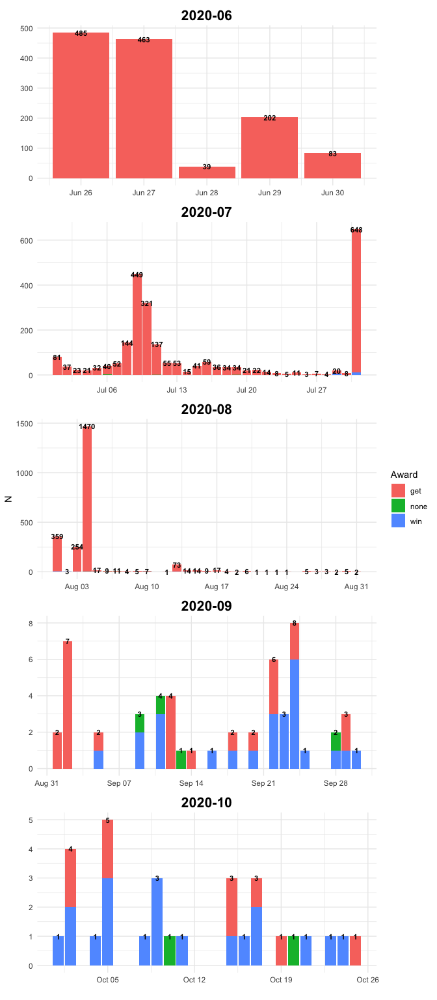
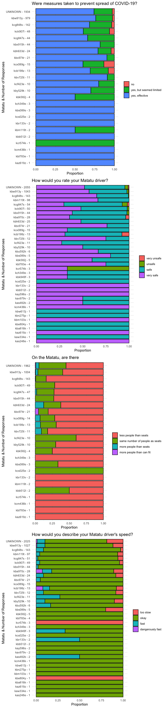
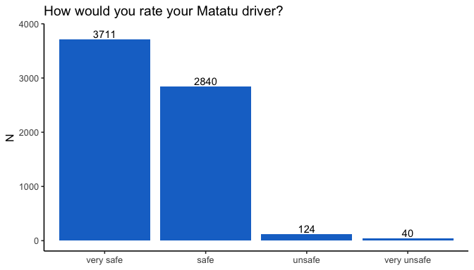

This document summarizes results from piloting the Matatu Rider Feedback project. So far, there have been 4 pilots:

* __Pilot 0__
* Stickers with just QR codes installed on 5 Lothian buses

* __Pilot 1__ 
* 15 Vehicles involved. 
* 8 vehicles had stickers advertising that riders receive 200 KES after completing the survey 
* 7 vehicles advertised receiving 100 KES after completing the survey.
* We received a large number of responses after only a couple days of running the pilot. Consequently, we lowered the award for types to 20 KES. The lower award was advertised in the survey. 
* In the shortcode, to identify the vehicle, users entered a 2 digit number that was put on the stickers. 
* The pilot started on June 28, and the stickers indicated that the award expired on July 20.

* __Pilot 2__ 
* 15 vehicles involved. 
* 9 vehicles had stickers advertising that riders received 50 KES after completing the survey (6 had both the shortcode and QR code, while 3 only had the QR code)  
* 6 vehicles advertised winning 50 KES in airtime. 
* Instead of a two digit number, the licence plate was put on the sticker and riders entered the plate number in the shortcode survey.
* As with the previous pilot, we received a large number of responses in the first couple days. We paused the shortcode survey where a rider automatically recieved the 50 KES award due to large costs. 
* On August 12, we restarted the survey -- only asking 3 questions and lowered the award to 10 KES.
* The stickers were installedon July 28 and the stickers indicate that the award offer expires on August 31.

* __Pilot 3__ 
* 20 vehicles involved
* 10 vehicles had both QR and shortcode, 10 only had QR
* Those giving feedback could win 100 KES. No expirtation date.


# Number of Responses

## Daily - By Posted Award Type

```r
data_award <- data %>%
  filter(!is.na(complete_date)) %>%
  group_by(date, award_type, month) %>%
  dplyr::summarise(N = n()) 

data_total <- data %>%
  filter(!is.na(complete_date)) %>%
  group_by(date, month) %>%
  dplyr::summarise(N_total = n()) %>%
  ungroup() 

ggplot() +
  geom_col(data = data_award, 
           aes(x=date, y=N,
               fill = award_type,
               group = award_type)) +
  geom_text(data = data_total,
            aes(x=date, y=N_total,
                label = N_total), 
            color = "black", 
            fontface = "bold",
            size=3) +
  #geom_vline(xintercept = as.Date(PILOT_2_DATE),
  #           color = "red") +
  labs(fill = "Award",
       x = "") +
  theme_minimal() +
  facet_wrap(~month,
             ncol = 1,
             scales ="free") +
  theme(strip.text = element_text(face = "bold", size=16, color = "black", hjust = 0.5))
```

<!-- -->

## By Matatu

```r
data %>%
  filter(!is.na(complete_date)) %>%
  group_by(reg_no, pilot_number) %>%
  dplyr::summarise(N = n(),
                   date = max(date),
                   "Prop Use Shortcode" = mean(response_method %in% "shortcode") %>% 
                     round(2)) %>%
  mutate(pilot_number = pilot_number %>% as.character()) %>%
  dplyr::rename("Reg Number" = reg_no,
                "Pilot Number" = pilot_number,
                "Latest Entry" = date) %>%
  datatable(filter = 'top')
```

<!--html_preserve--><div id="htmlwidget-e700ea3df11a700237ce" style="width:100%;height:auto;" class="datatables html-widget"></div>
<script type="application/json" data-for="htmlwidget-e700ea3df11a700237ce">{"x":{"filter":"top","filterHTML":"<tr>\n  <td><\/td>\n  <td data-type=\"character\" style=\"vertical-align: top;\">\n    <div class=\"form-group has-feedback\" style=\"margin-bottom: auto;\">\n      <input type=\"search\" placeholder=\"All\" class=\"form-control\" style=\"width: 100%;\"/>\n      <span class=\"glyphicon glyphicon-remove-circle form-control-feedback\"><\/span>\n    <\/div>\n  <\/td>\n  <td data-type=\"character\" style=\"vertical-align: top;\">\n    <div class=\"form-group has-feedback\" style=\"margin-bottom: auto;\">\n      <input type=\"search\" placeholder=\"All\" class=\"form-control\" style=\"width: 100%;\"/>\n      <span class=\"glyphicon glyphicon-remove-circle form-control-feedback\"><\/span>\n    <\/div>\n  <\/td>\n  <td data-type=\"integer\" style=\"vertical-align: top;\">\n    <div class=\"form-group has-feedback\" style=\"margin-bottom: auto;\">\n      <input type=\"search\" placeholder=\"All\" class=\"form-control\" style=\"width: 100%;\"/>\n      <span class=\"glyphicon glyphicon-remove-circle form-control-feedback\"><\/span>\n    <\/div>\n    <div style=\"display: none; position: absolute; width: 200px;\">\n      <div data-min=\"1\" data-max=\"4621\"><\/div>\n      <span style=\"float: left;\"><\/span>\n      <span style=\"float: right;\"><\/span>\n    <\/div>\n  <\/td>\n  <td data-type=\"date\" style=\"vertical-align: top;\">\n    <div class=\"form-group has-feedback\" style=\"margin-bottom: auto;\">\n      <input type=\"search\" placeholder=\"All\" class=\"form-control\" style=\"width: 100%;\"/>\n      <span class=\"glyphicon glyphicon-remove-circle form-control-feedback\"><\/span>\n    <\/div>\n    <div style=\"display: none; position: absolute; width: 200px;\">\n      <div data-min=\"1595116800000\" data-max=\"1.603584e+12\"><\/div>\n      <span style=\"float: left;\"><\/span>\n      <span style=\"float: right;\"><\/span>\n    <\/div>\n  <\/td>\n  <td data-type=\"number\" style=\"vertical-align: top;\">\n    <div class=\"form-group has-feedback\" style=\"margin-bottom: auto;\">\n      <input type=\"search\" placeholder=\"All\" class=\"form-control\" style=\"width: 100%;\"/>\n      <span class=\"glyphicon glyphicon-remove-circle form-control-feedback\"><\/span>\n    <\/div>\n    <div style=\"display: none; position: absolute; width: 200px;\">\n      <div data-min=\"0\" data-max=\"1\" data-scale=\"2\"><\/div>\n      <span style=\"float: left;\"><\/span>\n      <span style=\"float: right;\"><\/span>\n    <\/div>\n  <\/td>\n<\/tr>","data":[["1","2","3","4","5","6","7","8","9","10","11","12","13","14","15","16","17","18","19","20","21","22","23","24","25","26","27","28","29","30","31","32","33","34","35","36","37"],["kas248e","kas482b","kav979v","kaw334e","kay596s","kaz619z","kba816k","kba970c","kbb512l","kbe804y","kbh633d","kbk582j","kbk949f","kbl783e","kbm103x","kbm119t","kbn275p","kbr133v","kbs089s","kbu592k","kbv725t","kbw613j","kbw913y","kbx915h","kbx974r","kby529k","kcb198z","kcf423e","kcg847s","kcg848s","kch349e","kck907l","kcm436k","kcr574k","kcs025e","kcx089g","UNKNOWN"],["3","3","3","3","3","2","3","3","2","3","1","2","3","2","3","2","3","2","2","2","1","2","1","1","1","1","1","1","1","1","2","1","2","2","1","0",null],[1,2,2,1,2,1,1,28,2,1,22,5,3,4,1,97,1,2,5,6,11,1,922,44,21,10,13,10,43,140,3,46,1,3,2,15,4621],["2020-10-02","2020-10-17","2020-09-28","2020-10-16","2020-10-23","2020-07-31","2020-10-04","2020-10-24","2020-08-03","2020-10-17","2020-07-22","2020-08-13","2020-09-29","2020-09-29","2020-09-23","2020-10-25","2020-09-24","2020-07-31","2020-09-30","2020-09-18","2020-07-25","2020-10-02","2020-09-02","2020-08-23","2020-07-22","2020-07-19","2020-07-19","2020-08-03","2020-09-14","2020-09-22","2020-07-31","2020-09-29","2020-07-29","2020-08-26","2020-07-20","2020-10-20","2020-09-02"],[0,0.5,1,0,0.5,1,0,1,1,0,1,1,1,1,1,1,1,1,1,1,1,1,1,0.98,1,0.9,1,1,1,0.98,1,0.91,1,1,1,0,1]],"container":"<table class=\"display\">\n  <thead>\n    <tr>\n      <th> <\/th>\n      <th>Reg Number<\/th>\n      <th>Pilot Number<\/th>\n      <th>N<\/th>\n      <th>Latest Entry<\/th>\n      <th>Prop Use Shortcode<\/th>\n    <\/tr>\n  <\/thead>\n<\/table>","options":{"columnDefs":[{"className":"dt-right","targets":[3,5]},{"orderable":false,"targets":0}],"order":[],"autoWidth":false,"orderClasses":false,"orderCellsTop":true}},"evals":[],"jsHooks":[]}</script><!--/html_preserve-->

## By Pilot Number

```r
data %>%
  filter(!is.na(complete_date)) %>%
  mutate(pilot_number = replace_na(pilot_number, "Unknown - No Reg. No.")) %>%
  group_by(pilot_number) %>%
  dplyr::summarise(N = n()) %>%
  dplyr::rename("Pilot Number" = pilot_number) %>%
  kable() %>%
  kable_styling(full_width = F)
```

<table class="table" style="width: auto !important; margin-left: auto; margin-right: auto;">
 <thead>
  <tr>
   <th style="text-align:left;"> Pilot Number </th>
   <th style="text-align:right;"> N </th>
  </tr>
 </thead>
<tbody>
  <tr>
   <td style="text-align:left;"> 0 </td>
   <td style="text-align:right;"> 15 </td>
  </tr>
  <tr>
   <td style="text-align:left;"> 1 </td>
   <td style="text-align:right;"> 1284 </td>
  </tr>
  <tr>
   <td style="text-align:left;"> 2 </td>
   <td style="text-align:right;"> 130 </td>
  </tr>
  <tr>
   <td style="text-align:left;"> 3 </td>
   <td style="text-align:right;"> 43 </td>
  </tr>
  <tr>
   <td style="text-align:left;"> Unknown - No Reg. No. </td>
   <td style="text-align:right;"> 4621 </td>
  </tr>
</tbody>
</table>

# Feedback 

## Questions by Vehicle

```r
data_long <- data %>%
  dplyr::select(reg_no, 
                driver_rating, speed_rating, occupancy, covid_measures) %>%
  pivot_longer(-reg_no) %>%
  
  filter(value != "",
         !is.na(value)) %>%
  
  # Number of responses per question, per vehicle
  group_by(reg_no, name) %>%
  mutate(N_veh = n()) %>%
  ungroup() %>%
  
  # Aggregate
  group_by(name, value, reg_no, N_veh) %>%
  summarise(N = n()) %>%
  ungroup()  %>%
  
  # Clean variables
  mutate(reg_no = paste0(reg_no, " - ", N_veh)) %>%
  mutate(N = N/N_veh)

data_long$name[data_long$name %in% "driver_rating"] <- "How would you rate your Matatu driver?"
data_long$name[data_long$name %in% "covid_measures"] <- "Were measures taken to prevent spread of COVID-19?"
data_long$name[data_long$name %in% "occupancy"] <- "On the Matatu, are there"
data_long$name[data_long$name %in% "speed_rating"] <- "How would you describe your Matatu driver's speed?"

data_long$value <- data_long$value %>% str_squish() %>% tolower()

data_long$value <- factor(data_long$value, levels = c("no",
                                                      "yes, but seemed limited",
                                                      "yes, effective",
                                                      
                                                      "very unsafe",
                                                      "unsafe",
                                                      "safe",
                                                      "very safe",
                                                      
                                                      "less people than seats",
                                                      "same number of people as seats",
                                                      "more people than seats",
                                                      "more people than can fit",
                                                      
                                                      "too slow",
                                                      "okay",
                                                      "fast",
                                                      "dangerously fast"))

out_plot <- lapply(data_long$name %>% unique, function(i){
  
  data_long %>%
    filter(name %in% i) %>%
    ggplot(aes(x = reorder(reg_no, N_veh), # 
               y = N, group=value, fill=value)) +
    geom_col(color="black") +
    labs(x="", y="",
         title = i) +
    theme_minimal() +
    coord_flip() +
    labs(x = "Matatu & Number of Responses", y = "Proportion", fill = "") 
  
}) 

do.call(grid.arrange, c(out_plot, ncol=1))
```

<!-- -->


## Feedback - Length of Text Response

```r
data$feedback_nwords_bin <- NA
data$feedback_nwords_bin[data$feedback_nwords %in% 1] <- "1"
data$feedback_nwords_bin[data$feedback_nwords %in% 2] <- "2"
data$feedback_nwords_bin[data$feedback_nwords %in% 3:5] <- "3 - 5"
data$feedback_nwords_bin[data$feedback_nwords %in% 6:10] <- "6 - 10"
data$feedback_nwords_bin[data$feedback_nwords %in% 11:20] <- "11 - 20"
data$feedback_nwords_bin[data$feedback_nwords %in% 21:9999] <- ">20"

data$feedback_nwords_bin <- data$feedback_nwords_bin %>%
  factor(levels = c("1", "2", "3 - 5", 
                    "6 - 10", "11 - 20", ">20"))

data %>%
  filter(feedback_nwords > 0) %>%
  group_by(feedback_nwords_bin) %>%
  dplyr::summarise(N = n()) %>%
  ungroup() %>%
  mutate(percent = (N/sum(N)*100) %>% round(1) %>% paste("%")) %>%
  ggplot(aes(x = feedback_nwords_bin,
             y = N)) +
  geom_col(fill = "dodgerblue", color = "black") +
  geom_text(aes(label = percent), nudge_y = 100) +
  labs(x = "N Words", 
       y = "N Responses") +
  theme_ipsum()
```

<!-- -->

## Feedback - Text Response

```r
data %>%
  filter(feedback_nwords > 0) %>%
  arrange(desc(feedback_nwords)) %>%
  dplyr::select(feedback, reg_no) %>%
  dplyr::rename("Matatu" = reg_no,
                Feedback = feedback) %>%
  paged_table()
```

<div data-pagedtable="false">
  <script data-pagedtable-source type="application/json">
{"columns":[{"label":["Feedback"],"name":[1],"type":["chr"],"align":["left"]},{"label":["Matatu"],"name":[2],"type":["chr"],"align":["left"]}],"data":[{"1":"our matatu system has really evolved over the years and we have experienced much since the commencement...i believe with the rapid changes we can improve even more...many policies put in place should be able to safeguard the driver, the passengers, the matatu and even the pedestrians...especially during this covid 19 pandemic we need to be very vigilant by following every government and moh guidelines...we ensure we stay safe to save lives...i believe matatu culture has more to offer to kenyans","2":"UNKNOWN"},{"1":"1. due to the covid- 19 pandemic the matatu drivers shouldn't give up in providing the hand sanitizers to passengers so as to flatten the curve of this virus.2. matatu drivers are just okay, that's a good work3. loud music is not necessary to most of us","2":"UNKNOWN"},{"1":"maybe to the said about drivers who are corrupt giving bribes and using other routes,, to take caution and let them know they will suffer alot as the disease is spreading faster due to their ignorance,,, let them know that it time to be serious","2":"kbw913y"},{"1":"i like my driver and the conductor for being on the first line in the fight against covid 19 by adhering to the moh directives, they do not exceed the 8 passengers in the 14 seater matatu and they dont carry people without masks.","2":"UNKNOWN"},{"1":"compliment my driver for taking the best measures that have been directed by ntsa & the ministry of health. 1. no excess passangers. 2. no overspeeding and reckless driving3. recomends all passangers sanitize and keep distance in the matatu before he sets to drive@qyvn_consta69ine","2":"UNKNOWN"},{"1":"well on my part i can say that the operators of the matatu took all the necessary measures to try and mitigate the spread of covid 19 as well as following the rules and regulations that guide road users.","2":"kbw913y"},{"1":"i appreciate the driver for making sure that all passengers are safe,partaining the current pandemic of covid_19 we are facing,for installing the preventive measures equipments in the matatu like sanitizers as well as social distances are adhered to.","2":"kbw913y"},{"1":"this driver drives okay,not fast but not too slow,,,passengers are seated as required by the social distance guide,as directed by govt but measures on sanitizing the passengers should be more enhanced,,stricter everyone with no exception should be sanized.","2":"kbw913y"},{"1":"the speed of the matatu is ok the driver and the conductor are good too they make sure every passenger is comfortable and obey the government restrictions of keeping social distance and wearing of masks.","2":"UNKNOWN"},{"1":"i would like to compliment the driver driving the matatu im using now because he is driving safely and thank him and the conductor for adhering to the rules set in the control of covid19","2":"UNKNOWN"},{"1":"i think the drivers applying route 46 (kawangware) have tried there best and i think that's the reason why the spread of covid_19 has gone down in the area and i'm very happy for that","2":"UNKNOWN"},{"1":"the most peaceful bus from the company. the driver dove safely no speeding . the conductor is the most polite conductor ever in the industry. hesbon is his name . i oaidhim through mpesa","2":"kcx089g"},{"1":"not to put loud music but cool ones because it help each a everyone passengers and it help each a everyone to link in they email free without been charge by using wifi","2":"kbw913y"},{"1":"the steps taken by the matatu industry ensuring that its passengers are treated right and protected during this high time we're all alert to the pandemic ....i congratulate them for the effort taken","2":"kcg847s"},{"1":"the management of lothian buses should take the case of covid19 seriously and sanitize each and every passager boarding the bus. and not to allow passangers without mask to get on board.","2":"UNKNOWN"},{"1":"i would love to board the matatu cause the driver was cautious when driving plus he made sure that the regulations by the healthy ministry were considered to the latter","2":"kbw913y"},{"1":"the drive was safe and the driver really tried to make sure we arrived on time and also provided us with some santiziers as we boarded he was okay average","2":"UNKNOWN"},{"1":"the matatu driver ensures all the measures to curb the spread of covid-19 is put in place, drives a a speed which is okay to all and that ensures safety","2":"UNKNOWN"},{"1":"thanks to the driver.....hes following all the government initiatives because he understands a human life matters....stay safe n keep distance not forgetting.....to sanitize..for safety beings with you.....we shall overcome","2":"kbw913y"},{"1":"i would like to advice all the drivers that may take all the precaution and also to make sure that they follow the rules and regulations of the traffic.","2":"kbw913y"},{"1":"yes because my driver is very safe when driving he does not drive on a high speed and in terms of music he puts it in a low sound","2":"kbw913y"},{"1":"life of people matters so drivers should be very keen on the roads,and covid 19 is real let's do what the government tells us to do for our selfty","2":"UNKNOWN"},{"1":"i don't have any complain about matatu drivers for now but i think the government should provide sanitizers to matatus coz the sanizer are expensive to some of us","2":"UNKNOWN"},{"1":"he drives very carefully and with limited speed and he strictly makes sure that the measures taken to stop spread of covid 19 are followed by all passengers","2":"kbw913y"},{"1":"the matatu drivers should take the covid 19 precautions very seriously . disinfect door handles and areas that people get in contact with..and also maintain the social distance","2":"kbw913y"},{"1":"the driver was very kin on his job i don't see any unsafe condition and therefore i'd urge some of them to follow the rules of the ntsa","2":"UNKNOWN"},{"1":"the driver makes sure that the measures taken in the matatu to stop the spread of covid-19 are consindered such as the use of sanitizers .","2":"kbw913y"},{"1":"to all our drivers remember to ensure the safety of your passengers and remember to follow the rules in this time we are having a pandemic","2":"kbw913y"},{"1":"am so glad by the matatu industry operators for the masseurs taken during this time of the pandemic by ensuring that all its customers are safe","2":"kcg847s"},{"1":"our police personnel are not taking good look on the reckless drivers and our drivers should also be given advice on the importance of good driving.","2":"UNKNOWN"},{"1":"drivers should learn how to obey traffic laws and driver carefully keeping in mind that they are entrusted with the life of their passengers. thank you.","2":"UNKNOWN"},{"1":"am so careful when am driving cause i carried lives of my kanyans. and i need to those who drives roughly being held to the court","2":"UNKNOWN"},{"1":"i ask our drivers nt to over speed drive safely and adhere to covid 19 rules so that we can overcome this pandemic and accidents.","2":"kbw913y"},{"1":"it helps the passenger not to sleep in a matatu and it keeps then alacrity and some work on they way to work using wifi","2":"kbw913y"},{"1":"a very good and skilled driver. obeys road signs and speed limits. very good personalities when handling the clients and a very polite conductor too","2":"UNKNOWN"},{"1":"in helping in the fight against the covid-19 kenyans are urged not to take government directives for granted so as to ensure a healthy kenya","2":"UNKNOWN"},{"1":"ensure cleanliness of the car (sanitization after all passenger alight at the matatu terminus, transport is now costly and advantage is taken sit to it","2":"UNKNOWN"},{"1":"today's driver was driving safely but for most experiences drivers are always driving carelessly and fast so as to get more squads per day.","2":"kbh633d"},{"1":"the driver was very fast because mostly they wanted to reach their destination putting passengers lives in danger mostly matatus from town to umoja","2":"kbw913y"},{"1":"some drivers are careful but other seem not to care at all, let all drivers always protect the life entrusted to them by passengers","2":"kbw913y"},{"1":"ave been travelling to and from garden estate via bypass with same matatu and always driven carefully and has been always carrying 8 passengers","2":"kbw913y"},{"1":"the driver drives careful to cab the spread of covid~19 ependemic that has affected various activities not only in kenya bt also world wide","2":"UNKNOWN"},{"1":"i think tge matatu system has much to offer to kenyans...i believe adherence to laws governing the sector should be followed to the latter...","2":"UNKNOWN"},{"1":"i would like to congratulate the driver for ensuring all measures are put in place to combat covid-19 and safety of the passengers enhanced","2":"UNKNOWN"},{"1":"the measures put to protect all passangers and ensure they all travel safely are all good and helps all passengers feel safe when travelling","2":"UNKNOWN"},{"1":"matatus should be kept in good condition , measures against covid 19 should be enforced, n road safety rules should be adhered to strictly","2":"UNKNOWN"},{"1":"the matatu should use measures to avoid covid19, have social distance and use of sanitizers.in conclusion every matatu should obey government rules and measures","2":"UNKNOWN"},{"1":"would like to compliment the driver for adhering to road safety rules and also measures put in place to curb this corona virus","2":"kbw913y"},{"1":"i recommend that matatu drivers on their level best are effecting a positive effort on controlling and preventing the spread of covid-19 virus","2":"kbw913y"},{"1":"during this pandemic am so glad that the measures taken by matatu industry to ensure that all its customers are safe is beneficial","2":"kbw913y"},{"1":"the driver is cautious and has obeyed all the rules concerning the pandemic the matatu is also safe as the windows are open","2":"UNKNOWN"},{"1":"the matatus is following rules and regulation hence aiding in preventing covid 19 as per the number of passengers nd sanitizing as required","2":"UNKNOWN"},{"1":"i would love the body in charge to be able to regulate the commuter charges cause its absurd charging that is taking place","2":"UNKNOWN"},{"1":"safe drive, but the issue is corona, no sanitizers, no washing hands when boarding and all that. let that initiative be athered too!","2":"UNKNOWN"},{"1":"most of the time, the drivers follow the regulations but occasionally break them when the are confident that law enforcers are not keen","2":"UNKNOWN"},{"1":"the drivers and the whole crew have really helped by following the provided guidelines to deal with covid-19 and i appreciate for that","2":"UNKNOWN"},{"1":"i would like to comend the matutu drivers and their stakeholders for their good work of try to curb the covid 19 virus","2":"UNKNOWN"},{"1":"i would like to appreciate my driver for safe-driving us and taking the effective measures to prevent the spread of the covid-19","2":"kbw913y"},{"1":"the driver is always careful for the safety of his passengers and enables the passengers to reach their destination safe and sound","2":"kbw913y"},{"1":"the driver is driving safely and the passengers have maintained social distance.his speed is okay not so fast and not too slow","2":"kbw913y"},{"1":"the driver is good and he is observing or measures for the prevention of covid 19 and the safety of each passenger","2":"kcg847s"},{"1":"the driver is careful and is concerned about the passengers in that he makes sure all the rules concerning covid-19 are followed","2":"UNKNOWN"},{"1":"ause he is driving safely and thank him and the conductor for adhering to the rules set in the control of covid19","2":"UNKNOWN"},{"1":"am pleased because am always safe to travel with matatu sector. the current rules make us enjoy and feel safe when travelling","2":"UNKNOWN"},{"1":"my matatu driver is pretty much old-school but make me feel safe on the road and that's all that matter, thank you.","2":"UNKNOWN"},{"1":"i would like to compliment my driver for trying his best to drive safe and try to stop the spread of covid_19","2":"UNKNOWN"},{"1":"my matatu driver is observant on the road and he observes measure put in place to reduce the spread of covid 19","2":"UNKNOWN"},{"1":"the driver have actually maintain the covid 19 safeties and with this we see a controling action bettering well being of travellers","2":"UNKNOWN"},{"1":"i would like to compliment my driver for being careful and responsible when handling our lives on the road thank you","2":"kbw913y"},{"1":"the driver is always careful for the safety of all passengers which enables them to reach their destination safe and sound","2":"kbw913y"},{"1":"the driving is cool and the amenities are also okay.the measures are also taken into account to prevent the covid 19.","2":"kby529k"},{"1":"i'd like to appreciate how the drivers have so tried to take the measures to curb the spread of corona virus","2":"UNKNOWN"},{"1":"i'd like to appreciate how the drivers have so tried to take the measures to curb the spread of corona virus","2":"UNKNOWN"},{"1":"the driver was cautious with the speed and also the number of passengers.also the providing of sanitizer made the ride awesome","2":"UNKNOWN"},{"1":"matatu driver to follow guidelines given by ministry of health to stop spread corona virus and to keep their passengers safe","2":"UNKNOWN"},{"1":"i would just like to congratulate all those drivers who are very kin on their safety and that of the passengers","2":"UNKNOWN"},{"1":"i'd like to appreciate how the drivers have so tried to take the measures to curb the spread of corona virus","2":"UNKNOWN"},{"1":"yes. i'm so much glad to have such a driver and a convenient measures especially during this covid 19 pandemic.","2":"kbw913y"},{"1":"the matatu should be well equiped to avoid spread of covid 19 and ensure every passenger wears a mask correctly","2":"kbw913y"},{"1":"the matatu was is good condition plus the crew were really friendly and maintained the necessary measures to curb covid","2":"kck907l"},{"1":"the drivers in my route are cautious especially because there's road construction, so they drive well and someone feels safe.","2":"UNKNOWN"},{"1":"the driver was good with following all the safety measures to prevent covid 19 and to also prevent reckless accidents","2":"UNKNOWN"},{"1":"we all need to take part by talking our minds out if we feel its not safe during the ride","2":"UNKNOWN"},{"1":"drivers must wear masks, they must maintain social distance and ensure they follow rules to prevent spread of covid 19","2":"UNKNOWN"},{"1":"the matatu driver is very keen on the road and follows the traffic rules in order to avoid accidents .","2":"UNKNOWN"},{"1":"matatus nowadays are safe for use and should be congragratulated for emulating good conduct at this time of the pandemic","2":"UNKNOWN"},{"1":"the drivers should ensure that all passengers on board should follow the control measures to prevent spread of covid-19 worldwide.","2":"UNKNOWN"},{"1":"the matatus and drivers are trying there level best to keep there passengers safe from the covid 19 pandemic","2":"kbw913y"},{"1":"should observe and follow the guidelines kept by the ministry of health by wearing mask even in the matatu","2":"kbw913y"},{"1":"yes.. the matatu am using is following the regulations given by the moh... we sanitized and we have masks","2":"kbw913y"},{"1":"the driver is always careful and has never oversped the matatu.he adheres to the rules provided by the government","2":"kbw913y"},{"1":"the driver is good at his work and drives safely moreover observes measures to prevent the spread of covid-19","2":"UNKNOWN"},{"1":"the matatu is in good condition so passengers should not worry all measures regarding covid-19 have put in place","2":"UNKNOWN"},{"1":"for now i have no comments but ni any circumstance i come across an unsafe driving i will comment","2":"UNKNOWN"},{"1":"yes i would urge all the drivers to drive safely and take preventive measures to prevent spread of diseases","2":"UNKNOWN"},{"1":"the vehicle seems to be at a relatively good condition, but need more maintenance on seat and cleaning,","2":"kck907l"},{"1":"i would like to comment to the drivers to be very careful when they are on the road","2":"kbw913y"},{"1":"the driver is driving well and observing all road signs. the other careless driver should follow his example","2":"kbw913y"},{"1":"i would like all the matatu to have speed governors and to carry passengers according to its seats","2":"kbw913y"},{"1":"i would compliment the drivers, at least they are doing their part to prevent the spread of covid-19","2":"kbw913y"},{"1":"the matatu is safe according to requirements of the pandemic unless otherwise i.e accidents and other inconvenience s.","2":"kbw913y"},{"1":"will compliment all the drivers who are observing the rules and ensuring the safety first of their passengers","2":"kbw913y"},{"1":"i would love to compliment the drivers, they try their very best to ensure safty on their part.","2":"kbw913y"},{"1":"very safe driving, because the driver is keeping the measures provided by the government to prevent covid 19.","2":"kbw913y"},{"1":"the matatu was safe and the driver was driving on the speed limit that is advised and safe","2":"kbw913y"},{"1":"the driver was on speed limit and courteous. maintained the one meter rule as a covid preventive measure.","2":"kcg848s"},{"1":"the driver was driving at an acceptable speed and ensured to drive us to our destination. thank you","2":"kck907l"},{"1":"the sacco should make an effort to have adequate sanitizers and also working thermal gun to avoid delays","2":"kcr574k"},{"1":"i'd like to appreciate the measures they have taken so far to curb the spread of the virus","2":"UNKNOWN"},{"1":"yes, i liked the driver so much he was so polite unlike other drivers i have met b4","2":"UNKNOWN"},{"1":"driver is calm and is quiet aware of the traffic rules and does his best to obey them.","2":"UNKNOWN"},{"1":"they should countinue limiting the passagers and keeping social distancing and most impotantly wearing the mask anf sanatizing","2":"UNKNOWN"},{"1":"the driver drove cautiously and limiting the number of passengers as a measure preventing spread of covid 19","2":"UNKNOWN"},{"1":"the driver drove cautiously and limiting the number of passengers as a measure preventing spread of covid 19","2":"UNKNOWN"},{"1":"would like to appreciate my driver and his crew for customer service they offer me during my rides","2":"UNKNOWN"},{"1":"matatu is one of the best means of transport but careless drivers should be reported and action taken","2":"UNKNOWN"},{"1":"the driver was so good though he had so many stop overs very safe and i would recommend","2":"UNKNOWN"},{"1":"the speed of the driver is okay and the people in the matatu have maintained the distance","2":"kbw913y"},{"1":"driving is safe and rules and regulations are put in measure in adherance to ministry of health","2":"kbw913y"},{"1":"i will make sure u report to the police once the driver drive at a higher speed","2":"kbw913y"},{"1":"i request the matatu drivers to observe all the measures required to prevent the spread of covid-19","2":"kbw913y"},{"1":"the driver is very efficient hence drivers should be paid well in order to boost their morale.","2":"kbw913y"},{"1":"yes, i think matatu drivers should work in pairs inorder to avoid fatigue incase one becomes tired","2":"kbw913y"},{"1":"i will make sure i report to the police once the driver drive at a higher speed","2":"kbw913y"},{"1":"it is nice ed safe travelling in matatu as all the covid 19 measures are being observed","2":"kbw913y"},{"1":"quality measures are being taken for the prevention of covid-19,and the drivers are to careful while driving","2":"kcg847s"},{"1":"yes,would like to applause the drivers for the implemation of the safety measures during this corona period","2":"UNKNOWN"},{"1":"the matatu drivers are observing the layed measures to ensure that they stop corona virus from spreading","2":"UNKNOWN"},{"1":"the driver is sober and maintains the required speed,therefore i reccomend him as a safe driver thanks","2":"UNKNOWN"},{"1":"for this pirod of covid 19 i wat the driver avoid carry man people in the matatu","2":"UNKNOWN"},{"1":"i would like to leave a comment buy saying or matatu drivers to take care of passengers","2":"UNKNOWN"},{"1":"matatu drivers have really tried in maintaining all measures set in preventing the spread of covid 19","2":"UNKNOWN"},{"1":"compilment the driver because he seems to be driving fast to reach the destination before the curfew","2":"UNKNOWN"},{"1":"some people hack your personal stuff online if you use public wifi sometimes,so it's not that necessary","2":"UNKNOWN"},{"1":"am glad that drivers are taking precautions about covid 19 and against the spread of covid 19","2":"UNKNOWN"},{"1":"the driver should continue the good work as he's holding alot of peoples lives in his hands","2":"UNKNOWN"},{"1":"there was no washing of hands or sanitizing. the conductor's face mask was for his chin.","2":"kcx089g"},{"1":"the speed of the matatu is safe and the people in the matatu have kept distance","2":"kbw913y"},{"1":"drivers should be careful and make sure all passengers have mask and follow all the precaution","2":"kbw913y"},{"1":"drive is safe and the measures are put in place in adherence to the moh guidelines.","2":"kbw913y"},{"1":"the matatu driver is carefully and has taken all measures to prevent the spread of covid-19","2":"kbw913y"},{"1":"yes. am glad that there are enough measures to prevent the spread of covid-19. safety first.","2":"kbw913y"},{"1":"i request our drivers and riders to be very careful and adhere to covid 19 rules","2":"kbw913y"},{"1":"the conductor did not make sure i got to the place i was supposed to alight.","2":"kcg848s"},{"1":"it was a safe ride and we thank you for the safety measures taken by drivers","2":"kck907l"},{"1":"thanks for the driver because he's strict to those who goes against of the covid rules","2":"kbs089s"},{"1":"thank you matatu drivers for following all the measures in ensuring the safety of passengers,,,asanti sana","2":"UNKNOWN"},{"1":"for me the drivers within my area are good and understanding thumbs up to them all","2":"UNKNOWN"},{"1":"he is doing well in his job in which that is good in protecting the passengers","2":"UNKNOWN"},{"1":"the drivers for our route are very cautious and the driver's speed is okay...one feels safe","2":"UNKNOWN"},{"1":"the driver was in his full uniform and encouraging us to athere to the containment measures","2":"UNKNOWN"},{"1":"all report any unsafe driving and always appreciate our drivers for keeping us safe all through","2":"UNKNOWN"},{"1":"the matatu drivers and passengers in the stage should keep distance and wear their masks appropriately","2":"UNKNOWN"},{"1":"all report any unsafe driving and always appreciate our drivers for keeping us safe all through","2":"UNKNOWN"},{"1":"the matatus are safe for travels because the drivers are very keen on the measures outlined","2":"UNKNOWN"},{"1":"all report any unsafe driving and always appreciate our drivers for keeping us safe all through","2":"UNKNOWN"},{"1":"i liked how the driver ensured all maesures were followed to keep us all safe","2":"kbh633d"},{"1":"the speed of the driver is okay and people in the matatu have keep distance","2":"kbw913y"},{"1":"i highly appreciate the driver of the matatu i ride on for driving me safely","2":"kbw913y"},{"1":"congrats to the drivers they're doing great job..... obeying rules and regulations to prevent covid","2":"kbw913y"},{"1":"matatu ride are safe now a days due to covid measures which are in place.","2":"kbw913y"},{"1":"driving must always be careful because the life of human being needs to be protected","2":"kbw913y"},{"1":"our drivers are doing a good job but should be added more time to rest","2":"kbw913y"},{"1":"my driver is good and he is loking foward to the saftey of every one","2":"kcg847s"},{"1":"my driver is fine and he is looking forward to the safety off every person","2":"kcg847s"},{"1":"the ride was nice the speed was good no overloading of people en we sanitised","2":"UNKNOWN"},{"1":"i love it how the drivers been following and observing the measures put in place","2":"UNKNOWN"},{"1":"the drivers deserve to be congratulate for joining kenyans in the fight against covid 19","2":"UNKNOWN"},{"1":"the ride is safe but the matatu driver should be more careful and drive safer","2":"UNKNOWN"},{"1":"the drivers aren't taking covid 19 case seriously, traffic should be more keen on them","2":"UNKNOWN"},{"1":"matatu should obey government rules and regulations and take caution on measures given to them","2":"UNKNOWN"},{"1":"during this covid 19 session, matatu raised there transport fare and is now very expensive","2":"UNKNOWN"},{"1":"the drivers are cautious limiting the number of passengers help prevent spread of covid 19","2":"UNKNOWN"},{"1":"the matatu company are doing a good job and also adhere to the covid rules..","2":"UNKNOWN"},{"1":"i compliment john kinyanjui as a good and careful driver working with northrift shuttle services","2":"UNKNOWN"},{"1":"lets be more careful and follow measures given to prevent the spread of covid 19.","2":"UNKNOWN"},{"1":"matatu driving is safe and the driver is driving us in a safe speed","2":"kbh633d"},{"1":"the drivers must be carefull while drriving becoz an accident can ocar any time","2":"kbw913y"},{"1":"i would like passengers to where mask in the car and surnitice every time","2":"kbw913y"},{"1":"to provide sanitirs to driver in order to prevent the spread of corrona virus","2":"kbw913y"},{"1":"most drivers and riders are keeping the rules on the fight of covid 19","2":"kbw913y"},{"1":"the drivers are good since they have sanitizers to prevent people through this pandemic","2":"kbw913y"},{"1":"am glad all the directions to prevent the spread of covid 19 are followed","2":"kbw913y"},{"1":"during this period we should follow the safety measures that the government has kept","2":"kbw913y"},{"1":"our matatu drives are very displined and conducters have cutesy, good language to customers.","2":"kbw913y"},{"1":"yes. i'm glad for a safe and convenient transport especially in this pandemic period","2":"kbw913y"},{"1":"i urge all the matatu drivers to observe the measures required to prevent covid-19","2":"kbw913y"},{"1":"i would report her to the authorities to make sure he won't cause accidents","2":"kbw913y"},{"1":"the driver is very keen while on the wheels obseeves rules on the road","2":"kcg847s"},{"1":"the drivers are disciplined and they follow the covid 19 rules from the government","2":"kcg847s"},{"1":"good safe ride and good hygiene of the matatu. driver and conductor have etiquette","2":"kck907l"},{"1":"my ride was okay but they should provide hand sanitizers or soap and water","2":"kbm119t"},{"1":"need more sanitizers and drivers to ensure all measures are kept in place always","2":"UNKNOWN"},{"1":"the matatu are in good condition to facilitate day to day transport of people","2":"UNKNOWN"},{"1":"yes!my driver was fine iwould like to travel with him on my next journey","2":"UNKNOWN"},{"1":"appreciating the measures the've so far taken to curb the spread of the virus","2":"UNKNOWN"},{"1":"i just like the service offered. and the love you show to the customers","2":"UNKNOWN"},{"1":"drivers in my route are very careful, cautious and polite too when spoken to","2":"UNKNOWN"},{"1":"i would like to say, matatus are just safe and comfortable means of transport.","2":"UNKNOWN"},{"1":"during this corona period let them help us by keeping us safe..and drive carefully","2":"UNKNOWN"},{"1":"the driver n the conductor are somehow cautious concerning the pandemic.big up to them","2":"UNKNOWN"},{"1":"keep it up for the good job of ensuring the safety of our passengers","2":"UNKNOWN"},{"1":"yes i would the drivers should be keen and try not to be greedy","2":"UNKNOWN"},{"1":"there is unsafe driving because they don't follow all measure given to prevent covid","2":"UNKNOWN"},{"1":"all matatu drivers should adhere to the measures taken to prevent spread of covid-19","2":"UNKNOWN"},{"1":"the ride is safe as well as the covid_19 preventive measures being taken.","2":"kbw913y"},{"1":"matatu drivers are staying safe and ensures passengers are meeting the required measures","2":"kbw913y"},{"1":"everyone should ensure he or she puts on a mask in crowded area","2":"kbw913y"},{"1":"yes.matatu operators should be more serious with the current situation fighting the covid-19","2":"kbw913y"},{"1":"should follow rules and regulations regarding matata to avoid accident on the road","2":"kbw913y"},{"1":"i like the way matatu treats people because their is no more overloading","2":"kbw913y"},{"1":"during this period we should follow the safety measures kept by the government","2":"kbw913y"},{"1":"drivers should be strict in following the set measures to combat covid 19","2":"kbw913y"},{"1":"i will make sure i report all the drivers that break trafic rules","2":"kbw913y"},{"1":"would like to congratulate them..for their safety especially this season of covid 19","2":"kbw913y"},{"1":"during this period we should follow the safety measures kept by the government","2":"kbw913y"},{"1":"i will make sure i report all the drivers that break trafic rules","2":"kbw913y"},{"1":"yes..my compliment is positive.. matatus are really trying to fight covid 19 pandemic","2":"kbw913y"},{"1":"the speed of the driver is good and people in have kept distance","2":"kbw913y"},{"1":"matatu ride are safe nowadays due to clovis measures which are in place","2":"kbw913y"},{"1":"during this period we should follow the safety measures kept by the government","2":"kbw913y"},{"1":"during this period we should follow the safety measures kept by the government","2":"kbw913y"},{"1":"psv 28 the best driver, competent and chap chap. he understands the road","2":"kba970c"},{"1":"drivers sometimes need be foliowing the rules set aside on the guidance given","2":"UNKNOWN"},{"1":"drivers sometimes need be foliowing the rules set aside on the guidance given","2":"UNKNOWN"},{"1":"keep up with the good work of ensuring the safety of our passengers","2":"UNKNOWN"},{"1":"drivers drive well when people in the car want to b driven well","2":"UNKNOWN"},{"1":"life of people people matters so driver should be keen on the road","2":"UNKNOWN"},{"1":"report unsafe driving or tell the driver to be more careful while driving","2":"UNKNOWN"},{"1":"we should follow the rules kept by the gavernment to stop this pandemic","2":"UNKNOWN"},{"1":"yes to drive safe and ensure all passengers have put on their masks","2":"UNKNOWN"},{"1":"it feels safe to use this matatu... moreso during this covid 19 periods","2":"UNKNOWN"},{"1":"would like to report the 105 route... they are not sanitizing passengers nowadays.","2":"UNKNOWN"},{"1":"they should continue to practice safe measures to avoid spread of covid 19","2":"UNKNOWN"},{"1":"they should atleast be polite to customers sometimes i find them very rude","2":"UNKNOWN"},{"1":"all matatu should adhear to all rules and avoid spread of covid 19","2":"UNKNOWN"},{"1":"the containment of covid 19 is very limited,,,, something need to be done","2":"UNKNOWN"},{"1":"we should be careful and follow the measures to prevent spread of covid19","2":"UNKNOWN"},{"1":"the speed of the driver is safe and passangers have kept distance","2":"kbw913y"},{"1":"yea to provide more sanitizers in order passanger to sanitize first before","2":"kbw913y"},{"1":"i enjoyed the ride. the driver is responsible as well as respectful","2":"kbw913y"},{"1":"they are safe and doing great to prevent spread of covid 19","2":"kbw913y"},{"1":"the ride felt safe because the driver kinda followed the required rules","2":"kbw913y"},{"1":"i compliment all drivers following the covid guidelinew to keep travellers safe","2":"kbw913y"},{"1":"my driver is very safe and keen when he's on the road","2":"kbw913y"},{"1":"the matatu has taken the safety measures of the spread of covid-19","2":"kbw913y"},{"1":"the drivers are obeying the roles thus reducing the number of accidents","2":"kbw913y"},{"1":"matatu drivers should take care while driving and also follow traffic rule","2":"kbw913y"},{"1":"the drivers always ensure the passengers reach their destination safe and sound","2":"kbw913y"},{"1":"drivers to carry the accepted number of passengers and follow trafic rules,","2":"kbw913y"},{"1":"drivers should ensure that they keep travel rules and maximum road safety,","2":"kbw913y"},{"1":"the ride is very safe as the covid_19 preventive measures are taken","2":"kbw913y"},{"1":"yes...the driver is very careful and always follow the safety road rules","2":"kbw913y"},{"1":"yes i would like to advise them to be safe at all.","2":"kbw913y"},{"1":"they are doing good work to ensure covid doesn't continue to spread","2":"kbw913y"},{"1":"they are very ok so i don't have any issue with them","2":"kbx915h"},{"1":"the ride is awesome and he's okay ....glad to have this ride","2":"kcg847s"},{"1":"i must say i really enjoyed the ride. thanks to the driver!","2":"kck907l"},{"1":"the driver is very compitent. he is up to thev ask. awesome","2":"kck907l"},{"1":"i appreciate measure taken by the matatu to curb spread of covid19","2":"UNKNOWN"},{"1":"the drive is safe for all passengers travelling to and fro mshomoroni","2":"UNKNOWN"},{"1":"the drivers are perfect..we feel safe while using a matatu to travel","2":"UNKNOWN"},{"1":"the drivers are perfect..we feel safe while using a matatu to travel","2":"UNKNOWN"},{"1":"sometimes drivers should be cautious on the rules set to guide them.","2":"UNKNOWN"},{"1":"anyone in the matatu to wear mask and sanitize befor entering matatu","2":"UNKNOWN"},{"1":"we should not use matatus which are on bad condition or overloaded","2":"UNKNOWN"},{"1":"less passengers than the seats sanitizers and wearing of masks...was. adhered to","2":"UNKNOWN"},{"1":"i want to congratulate my driver because he is doing a job","2":"UNKNOWN"},{"1":"it important on how matatus heads are taking precautions during pandemic state","2":"UNKNOWN"},{"1":"the drive is okay and the driver is observing all the rules","2":"UNKNOWN"},{"1":"the ride was good.measures were taken to prevent spread of covid 19","2":"UNKNOWN"},{"1":"roport unsafe driving and tell the driver to more caution while driving","2":"UNKNOWN"},{"1":"they should make more effort to prevent the spreed....and ensure road safety","2":"UNKNOWN"},{"1":"yes my driver was so nice i would ride with another time","2":"UNKNOWN"},{"1":"measures taken in the matatus are okay to prevent covid is oky","2":"UNKNOWN"},{"1":"okey i wanna congratilulate some of the serious drivers...and tell them kudos","2":"UNKNOWN"},{"1":"the ride was really nice...the matatu was very well taken care of","2":"UNKNOWN"},{"1":"conductors should mind their language and also some drivers should not sped","2":"UNKNOWN"},{"1":"drive slowly and follow rules and regulations regarding matatu to save people","2":"UNKNOWN"},{"1":"lets be more careful and follow the measures to prevent the spread.","2":"UNKNOWN"},{"1":"everything is running smoothly according to the rules and driving safe","2":"kbw913y"},{"1":"every body should put on a mask in a crowded place","2":"kbw913y"},{"1":"the driver was more concerned with the safety of the passenger","2":"kbw913y"},{"1":"i would like tell all driver and riders to be carefull","2":"kbw913y"},{"1":"every body should put on a mask in a crowded place","2":"kbw913y"},{"1":"every body should put on a mask in a crowded place","2":"kbw913y"},{"1":"every body should put on a mask in a crowded place","2":"kbw913y"},{"1":"every body should put on a mask in a crowded place","2":"kbw913y"},{"1":"there has been few cases of matatu accidents since corona started","2":"kbw913y"},{"1":"the driver is always careful for the safety of the passengers","2":"kbw913y"},{"1":"my is quite safe but no measures taken to curb covid-19","2":"kbw913y"},{"1":"every body should put on a mask in a crowded places","2":"kbw913y"},{"1":"we should put on am a mask in a crowded place","2":"kbw913y"},{"1":"i commend the matatu driver and the matatu crew at large","2":"kbw913y"},{"1":"every body should put on a mask in a crowded place","2":"kbw913y"},{"1":"every body should put on a mask in a crowded place","2":"kbw913y"},{"1":"the driver is always careful for the safety of the passengers","2":"kbw913y"},{"1":"the driver is always careful for the safety of the passengers","2":"kbw913y"},{"1":"safe driving, tightening sit belt before departure, very observative when overtaking","2":"kbw913y"},{"1":"the drivers are doing a great job to fight covid 19","2":"kbw913y"},{"1":"matatu's play a big role for those who don't own cars","2":"kbw913y"},{"1":"driver's should follow the rules kept by the ministry of health","2":"kbw913y"},{"1":"the speed of driver is safe and have put social distance","2":"kbw913y"},{"1":"every body should put on a mask in a crowded place","2":"kbw913y"},{"1":"a good number of drivers are good, but some drive carelessly","2":"kbw913y"},{"1":"the matatu are operating very well keep up the good job","2":"kbw913y"},{"1":"a good number of drivers are good, but some drive carelessly","2":"kbw913y"},{"1":"yes, i'm so much grateful for the safe and convinient transport","2":"kbw913y"},{"1":"the driver is always careful for the safety of all passengers","2":"kbw913y"},{"1":"the ride was interesting coz the driver kept a low speed","2":"kbw913y"},{"1":"the driver is very keen and the drive is very safe","2":"kbw913y"},{"1":"the driver is always careful for the safety of the passangers","2":"kbw913y"},{"1":"psv drivers from kisumu to busia are very careful,thanks to them","2":"kcg847s"},{"1":"would like more measure to be taken ,there is no sanitizer","2":"kck907l"},{"1":"only that there is no use of sanitizer and passengers screening.","2":"kbk582j"},{"1":"great ride but people should be more vigilant in staying safe","2":"UNKNOWN"},{"1":"good driving skills.thank youu for allowing me to reach my destination","2":"UNKNOWN"},{"1":"the driver was driving well and also warm to the passengers","2":"UNKNOWN"},{"1":"safely drives and observes rules to avoid spread of covid 19","2":"UNKNOWN"},{"1":"i would thank the driver for taking care of the passengers","2":"UNKNOWN"},{"1":"i would thank the driver for taking care of the passengers","2":"UNKNOWN"},{"1":"yes,if the conductor or the matutu drive doesn't wear the mask","2":"UNKNOWN"},{"1":"the matatu has followed all the measures to prevent covid 19.","2":"UNKNOWN"},{"1":"the driver was safe in driving and strickly followed the rules","2":"UNKNOWN"},{"1":"good work to the drive by being careful as he drives.","2":"UNKNOWN"},{"1":"yes to tell the driver to ensure safety on the road","2":"UNKNOWN"},{"1":"the driver is keen on every detail of the measures set","2":"UNKNOWN"},{"1":"life of the people matters so drivers should be very keen","2":"UNKNOWN"},{"1":"lets be careful and follow measures to prevent spread of covid19.","2":"UNKNOWN"},{"1":"the ride was good.measures were taken to prevent spread of covid-19","2":"UNKNOWN"},{"1":"the drive is safe and the driver observing all the rules","2":"UNKNOWN"},{"1":"the ride is good and safe,and the driver is also okay","2":"UNKNOWN"},{"1":"the dual, the conductor and the driver are obedient and respectful","2":"UNKNOWN"},{"1":"yes reporting unsafe driving will keep our road and driving safe","2":"UNKNOWN"},{"1":"the driver has taken good measures on how to stop covid","2":"UNKNOWN"},{"1":"to wear mask every time and sanitise their hands after 20min","2":"UNKNOWN"},{"1":"yes to reply reckless driving on the road to the authorities","2":"UNKNOWN"},{"1":"the driver was cautious but sometimes the conductor ignores covid-19 instructions","2":"UNKNOWN"},{"1":"i appreciate the measures our drivers take to fight this disease","2":"UNKNOWN"},{"1":"keep up with the good job of driving our passengers safe","2":"UNKNOWN"},{"1":"matatu should take all measures to stop spread of covid 19","2":"UNKNOWN"},{"1":"yes, , this matatu should have less people than the seats","2":"UNKNOWN"},{"1":"keep up with the good job of driving our passengers safe","2":"UNKNOWN"},{"1":"every body should put on a mask in a crowded places","2":"UNKNOWN"},{"1":"every body should put on a mask in a crowded place","2":"UNKNOWN"},{"1":"very efficient.. but was lacking in adherence tu covid 19 measures","2":"UNKNOWN"},{"1":"drivers should ensure maximum road safety and obey the travel rules","2":"UNKNOWN"},{"1":"driving recklessly becas he's in hurry to package more passenger.","2":"kbx915h"},{"1":"everyone should observe rules given by the ministry of health","2":"kbw913y"},{"1":"everybody should put on a mask in a public place","2":"kbw913y"},{"1":"we should observe guidelines provided by the ministry of health","2":"kbw913y"},{"1":"let's prevent the spreed of covid- 19 as psv 22","2":"kbw913y"},{"1":"everybody should put on a mask in a public placee","2":"kbw913y"},{"1":"some of the the matatu driver tend to be rude","2":"kbw913y"},{"1":"my driver is very cautious and mantains the road regulations","2":"kbw913y"},{"1":"every body should put a mask in a crowded place","2":"kbw913y"},{"1":"every body should put on a mask in crowded places","2":"kbw913y"},{"1":"every body should put a mask in a crowded place","2":"kbw913y"},{"1":"every body should put a mask in a crowded place","2":"kbw913y"},{"1":"everybody should put on a mask in a crowded place","2":"kbw913y"},{"1":"compliment to those driver who respect us to keep safe","2":"kbw913y"},{"1":"actually yes, government and or saccos should provide more sanitizers.","2":"kbw913y"},{"1":"every body should put a mask in a crowded place","2":"kbw913y"},{"1":"the driver is keen an follows the rules and regulations","2":"kbw913y"},{"1":"every body should put a mask in a crowded place","2":"kbw913y"},{"1":"matatu drivers are doing great work..keeping up with speed limits","2":"kbw913y"},{"1":"the ride was good with all the effective measures taken","2":"kbw913y"},{"1":"i like driver he is very good and work respect","2":"kbw913y"},{"1":"the drivers are doing all they can to ensure safety","2":"kbw913y"},{"1":"every body should put a mask in a crowded place","2":"kbw913y"},{"1":"drivers should be responsible and follow up with government instructions","2":"kbw913y"},{"1":"good work to him keeping his passengers safe heko kwako","2":"kbw913y"},{"1":"the driver should drive the matatu at a moderate speed","2":"kbw913y"},{"1":"matatus should be spacious with good windows for comfortability issues.","2":"kbw913y"},{"1":"in this pandemic the drivers are safe on the road","2":"kbw913y"},{"1":"the conductors and drivers should treat passengers well not harassing","2":"kbw913y"},{"1":"every body should put on a mask in crowded areas","2":"kbw913y"},{"1":"i huge matatu drivers to be very cautious while driving","2":"kbw913y"},{"1":"matatu drives should take note while draving to avoid accident","2":"kbw913y"},{"1":"every body should put on a mask in crowded places","2":"kbw913y"},{"1":"every body should put a mask in a crowded place","2":"kbw913y"},{"1":"drivers should follow traffic rules and be cautious while driving","2":"kbw913y"},{"1":"yes the matatu driver was very safe i would recommend","2":"kbw913y"},{"1":"drivers drive safely and everyone keep safe during this pandemic","2":"kbw913y"},{"1":"the matatu drivers are taking good care of their passengers","2":"kbw913y"},{"1":"the drivers are trying to keep us safe while driving","2":"kcg847s"},{"1":"the matatu is well maintained and is being driven safely","2":"kcg847s"},{"1":"the driver was good throught the jouney and very understanding","2":"kcg847s"},{"1":"the driver was good, throughout the journey and very understanding","2":"kcg847s"},{"1":"the driver was good throught the journey and very understanding","2":"kcg847s"},{"1":"i was well driven may the driver keep it up","2":"kcg848s"},{"1":"the driver is following all ruled and regulation of covid","2":"kbl783e"},{"1":"speed is okay. measures taken into consideration with great effect","2":"UNKNOWN"},{"1":"safe driving and measures taken to prevent corona though limited","2":"UNKNOWN"},{"1":"the driver was very gud responding to the passenger s","2":"UNKNOWN"},{"1":"safely driving and observes rules set to guide ones trip","2":"UNKNOWN"},{"1":"drivers are taking the required precautions and are driving safely","2":"UNKNOWN"},{"1":"the matatu drivers they should follow the road signs carefully","2":"UNKNOWN"},{"1":"life of our passengers matter so drivers should be keen","2":"UNKNOWN"},{"1":"people's lives are important so driver's should be very keen","2":"UNKNOWN"},{"1":"life of people matters so the driver should be keen","2":"UNKNOWN"},{"1":"safety and social distancing should be effective near curfew hours","2":"UNKNOWN"},{"1":"we are safe travellers during this period of covid 190","2":"UNKNOWN"},{"1":"life of the people matters so driver should be keen","2":"UNKNOWN"},{"1":"life of people matter and so the should be keen","2":"UNKNOWN"},{"1":"the driver are following measures to curb covid 19 pandemic","2":"UNKNOWN"},{"1":"soo cool ride with safety measures all put in place","2":"UNKNOWN"},{"1":"he is driving carefully and taking precautions of covid 19","2":"UNKNOWN"},{"1":"matatu rides nowadays are the best no overloading of passengers","2":"UNKNOWN"},{"1":"lets take part in lowering covid19 and follow the measures.","2":"UNKNOWN"},{"1":"no complain i am well driven by a safe driver","2":"UNKNOWN"},{"1":"i like the driver, the driving skills are perfect thanks","2":"UNKNOWN"},{"1":"lets follow the measures and be careful to prevent covid19","2":"UNKNOWN"},{"1":"the driver was driving at the required speed,sanitization was effective","2":"UNKNOWN"},{"1":"yes, well organized and all precautions to prevent covid-19 taken","2":"UNKNOWN"},{"1":"matatus i've encountered are driving safe and follow government measures","2":"UNKNOWN"},{"1":"fast and efficient on time and very safe on roads","2":"UNKNOWN"},{"1":"i would thank the drivers for a job well done","2":"UNKNOWN"},{"1":"good driver indeed very carefull and handles the passengers well","2":"UNKNOWN"},{"1":"they should adhere to the covid 19 rules more strictly","2":"UNKNOWN"},{"1":"the driver should be more careful while on the roads","2":"UNKNOWN"},{"1":"the driver is strictly following the guidelines which were given....","2":"UNKNOWN"},{"1":"the driver drove safely but they should improve on sanitization","2":"UNKNOWN"},{"1":"drivers should follow the safety rules kept by the government","2":"UNKNOWN"},{"1":"every body should put on a mask in crowded places","2":"UNKNOWN"},{"1":"the change was great the bus is very confortable","2":"kcx089g"},{"1":"the change was great the bus is very confortable","2":"kcx089g"},{"1":"i would compliment the drivers for keeping the rules","2":"kbh633d"},{"1":"the matatus are really trying during this tough times","2":"kbw913y"},{"1":"everybody should put on mask in a public place","2":"kbw913y"},{"1":"my driver is very careful and obeys traffic rules","2":"kbw913y"},{"1":"goverment to provide more effective measure to the drivers","2":"kbw913y"},{"1":"the driver is driving safe,the people are keeping distance","2":"kbw913y"},{"1":"each person keep safe for this pandemic to end","2":"kbw913y"},{"1":"all drivers should follow the rules to avoid accdent","2":"kbw913y"},{"1":"the ride is safe and driver is not reckless.","2":"kbw913y"},{"1":"driving is safe and measures are put in place.","2":"kbw913y"},{"1":"trying their best but more effort should be done","2":"kbw913y"},{"1":"it was okay and safe, the driver is careful","2":"kbw913y"},{"1":"everybody should put a mask in a crowded place","2":"kbw913y"},{"1":"the driver should ensure the safety of all passengers","2":"kbw913y"},{"1":"the driver always ensure the safety of all passengers","2":"kbw913y"},{"1":"driver to continue providing safetey mesures to the passangers","2":"kbw913y"},{"1":"everybody should put on mask in a public place","2":"kbw913y"},{"1":"we are proud of them..they do a great job","2":"kbw913y"},{"1":"the driver ensures the passengers are safe and sound","2":"kbw913y"},{"1":"the matatu drivers should continue with the same spirit","2":"kbw913y"},{"1":"the drivers are trying their best to drive safely","2":"kbw913y"},{"1":"matatu safety starts with you and me..driver plus passengers","2":"kbw913y"},{"1":"1.stop talking when they are driving,2:driver respect other drivers","2":"kbw913y"},{"1":"report any driver who is not taking covid19 measures","2":"kbw913y"},{"1":"we enjoy their services.,.we do excellent work..god bless them","2":"kbw913y"},{"1":"the ride was safe because rules were followed accordingly","2":"kbw913y"},{"1":"the drivers should be keen while on the way","2":"kbw913y"},{"1":"rides wash your hands and sanitize and keep distance","2":"kcg847s"},{"1":"matatu drivers should strictly follow covid 19 control measures","2":"UNKNOWN"},{"1":"yes, the driver was experienced indeed he drove smoothly","2":"UNKNOWN"},{"1":"i enjoyed the ride i felt safe and comfortable","2":"UNKNOWN"},{"1":"they are taking the prevention measures seriously keep up","2":"UNKNOWN"},{"1":"sanitizing myself and making sure i observe social distancing","2":"UNKNOWN"},{"1":"the driver is good not reckless conductor is polite","2":"UNKNOWN"},{"1":"he is a good driver who drives very safe","2":"UNKNOWN"},{"1":"the driver drives with all cares to protect covid~19","2":"UNKNOWN"},{"1":"drivers are not keen, traffic police should be keen","2":"UNKNOWN"},{"1":"driver is very keen and observes road safety measures","2":"UNKNOWN"},{"1":"no, he is just driving with a good speed","2":"UNKNOWN"},{"1":"to wear mask and sanitise their hands every 20min","2":"UNKNOWN"},{"1":"the driver is doing a good job.keep it up","2":"UNKNOWN"},{"1":"nowadays they are very keen on the road, hongera","2":"UNKNOWN"},{"1":"the driver was friendly and the ride was okay","2":"UNKNOWN"},{"1":"life of people matter so drivers should be keen","2":"UNKNOWN"},{"1":"life of people matters so drivers should be keen.","2":"UNKNOWN"},{"1":"people's life is important so drivers should be keen","2":"UNKNOWN"},{"1":"life of people matters so drivers should be keen","2":"UNKNOWN"},{"1":"life of people matters so drives should be keen","2":"UNKNOWN"},{"1":"lets all take part in preventing spread of covid19","2":"UNKNOWN"},{"1":"drivers to ensure all measures of covid-19 is.adhered to","2":"UNKNOWN"},{"1":"lets be careful and follow measures to prevent covid19","2":"UNKNOWN"},{"1":"lets be careful and follow measures to prevent covid19","2":"UNKNOWN"},{"1":"lets follow the measures to prevent spread of covid19","2":"UNKNOWN"},{"1":"my driver is the best one he drives well","2":"UNKNOWN"},{"1":"with the measures in place the matatu is safe","2":"UNKNOWN"},{"1":"kudos for letting mih reach home safe and saound","2":"UNKNOWN"},{"1":"the ride is safe and the driver is careful","2":"UNKNOWN"},{"1":"yes... like to report the matatu with many passengers","2":"UNKNOWN"},{"1":"matatu was in good condition i enjoyed the ride","2":"UNKNOWN"},{"1":"there safe driving they follow all measure of covid","2":"UNKNOWN"},{"1":"is unsafe because there no sanitise at the stage","2":"UNKNOWN"},{"1":"lets all take part in preventing spread of covid19","2":"UNKNOWN"},{"1":"the ride is sweet for a monday morning","2":"kcg848s"},{"1":"the driver is safe taking all the precautions","2":"kbw913y"},{"1":"i will report the unsafe drivers to authorities","2":"kbw913y"},{"1":"continue to prevent the spread of covid 19","2":"kbw913y"},{"1":"the ride is safe i therefore,appreciate the driver","2":"kbw913y"},{"1":"the driver ensure the safety of all passengers","2":"kbw913y"},{"1":"the driver should ensure safety of all passengers","2":"kbw913y"},{"1":"so far,so good...i can't complain about the drivers","2":"kbw913y"},{"1":"i congratulate my driver for measures adhered to","2":"kbw913y"},{"1":"i feel very safe.. i have no complains","2":"kbw913y"},{"1":"the driver is very keen and soo cautious","2":"kbw913y"},{"1":"drivers are taking effective measures to control covid19","2":"kbw913y"},{"1":"the drive should ensure safety of all passengers","2":"kbw913y"},{"1":"the driver should ensure safety of all passengers","2":"kbw913y"},{"1":"the driver should ensure safety off all passengers","2":"kbw913y"},{"1":"they are taking measures seriously and am happy","2":"kbw913y"},{"1":"driving should be done carefully to ensure safety","2":"kbw913y"},{"1":"the matatu is safe with measures adhered to.","2":"kbw913y"},{"1":"speak out when the matatu driver is reckless","2":"kbw913y"},{"1":"the mat at u drivers must follow instructions","2":"kbw913y"},{"1":"i will report careless drivers to the authority","2":"kbw913y"},{"1":"continue to prevent the spread of covid 19","2":"kbw913y"},{"1":"always observe traffic rules while on the road.","2":"kbw913y"},{"1":"the driving was safe and okay...i enjoyed it.","2":"kbw913y"},{"1":"evey body should wea mask in crouded place","2":"kbw913y"},{"1":"evey body should wea mask ni crouded place","2":"kbw913y"},{"1":"the driver should ensure safety of all passengers","2":"kbw913y"},{"1":"good job ... i always have safe travels","2":"kbw913y"},{"1":"driving should be done carefully to ensure safety","2":"kbw913y"},{"1":"driving should be done carefully to ensure safety","2":"kbw913y"},{"1":"let the driver continue with same good spirit","2":"kbw913y"},{"1":"evey body should wea mask ni crouded place","2":"kbw913y"},{"1":"i appreciate my driver for driving me safely","2":"kbw913y"},{"1":"it was ok enjoyed the ride n music","2":"kbw913y"},{"1":"they are responding positively to the directives given","2":"kbw913y"},{"1":"i will report careless drivers to the authority","2":"kbw913y"},{"1":"speak out when the matatu driver is reckless","2":"kbw913y"},{"1":"passangers should shout if the driver is carrless","2":"kbw913y"},{"1":"driving should be done carefully to ensure safety","2":"kbw913y"},{"1":"the driver should ensure safety of all passengers","2":"kbw913y"},{"1":"the driver ensures the safety of all passengers","2":"kbw913y"},{"1":"caring driver, safe ride, considerate of his customers.","2":"kbw913y"},{"1":"it was an overall good and safe journey","2":"kbw913y"},{"1":"to be more effective while handlng with passangers","2":"kbw913y"},{"1":"well driven, speed observed and customer descipline maintained!","2":"kbx974r"},{"1":"it's ok limited speed it's clean n comfortable","2":"kcb198z"},{"1":"safe driver but not responding to covid 19","2":"kcb198z"},{"1":"your services are efficient and i love them","2":"kcf423e"},{"1":"i just like your service its awesome. ..","2":"kcf423e"},{"1":"i would like to commend our route drivers","2":"kcg847s"},{"1":"may the drivers follow the instructions for safety","2":"kcg847s"},{"1":"emali wote matatu drivers are disciplined,i like them","2":"kcg847s"},{"1":"ensure the safe measures are intact next time","2":"kcg848s"},{"1":"the driver is competent and skilled to perfection","2":"kcg848s"},{"1":"matatu well driven safe and at moderate speed","2":"kck907l"},{"1":"the driver is observant and also drives safely","2":"kba970c"},{"1":"the ride was good, everything was in order,kudos!","2":"kbs089s"},{"1":"drivers should ensure that they have a sanitizer","2":"UNKNOWN"},{"1":"drivers should follow the covid 19 control measures","2":"UNKNOWN"},{"1":"i would thank the driver for safe driving","2":"UNKNOWN"},{"1":"i would thank the driver for safe driving","2":"UNKNOWN"},{"1":"i will thank the driver for safe drive","2":"UNKNOWN"},{"1":"i will thank the driver for safe drive","2":"UNKNOWN"},{"1":"the ride is under save control of speed","2":"UNKNOWN"},{"1":"affordable communication on reporting unsafety measures is needed","2":"UNKNOWN"},{"1":"the driver has taken all the measures necessary","2":"UNKNOWN"},{"1":"i would thank the driver for safe driving","2":"UNKNOWN"},{"1":"i would thank the driver for safe driving","2":"UNKNOWN"},{"1":"i would thank the driver for safe driving","2":"UNKNOWN"},{"1":"i would thank the driver for safe driving","2":"UNKNOWN"},{"1":"i would thank the driver for safe driving","2":"UNKNOWN"},{"1":"i would thank the driver for safe driving","2":"UNKNOWN"},{"1":"i would thank the driver for safe driving","2":"UNKNOWN"},{"1":"i would thank the driver for safe driving","2":"UNKNOWN"},{"1":"i would thank the driver for safe driving","2":"UNKNOWN"},{"1":"i would thank the driver for safe driving","2":"UNKNOWN"},{"1":"drivers should take measures against covid 19 seriously","2":"UNKNOWN"},{"1":"i would thank the driver for safe driving","2":"UNKNOWN"},{"1":"i would thank the driver for safe driving","2":"UNKNOWN"},{"1":"i would thank the driver for safe driving","2":"UNKNOWN"},{"1":"i will thank the driver for safe driving","2":"UNKNOWN"},{"1":"let people comply with the moh guide lines","2":"UNKNOWN"},{"1":"my driver is qualified and he drivers well","2":"UNKNOWN"},{"1":"they suported to go to the police station","2":"UNKNOWN"},{"1":"safety of the matatu and driver was enhanced","2":"UNKNOWN"},{"1":"its a compliment for those who observe rules","2":"UNKNOWN"},{"1":"the driver is supper perfect and drive safely","2":"UNKNOWN"},{"1":"the driver was driving carefully and was nice","2":"UNKNOWN"},{"1":"the driver is observant and drives very safely","2":"UNKNOWN"},{"1":"drivers should not drive while they are drunk","2":"UNKNOWN"},{"1":"i would like them yo keep it up","2":"UNKNOWN"},{"1":"safe riding though risk on health of passengers","2":"UNKNOWN"},{"1":"yes by reporting you make our road safe","2":"UNKNOWN"},{"1":"the driver to the matatu followed road safety","2":"UNKNOWN"},{"1":"the driver is competent enough, thanks to him","2":"UNKNOWN"},{"1":"lets follow measures to prevent spread of covid19","2":"UNKNOWN"},{"1":"the driver was taking all the traffic rules","2":"UNKNOWN"},{"1":"they supported to go to the police station","2":"UNKNOWN"},{"1":"its very much impotant coz it gives entertainment","2":"UNKNOWN"},{"1":"can't complain they are doing a good work","2":"UNKNOWN"},{"1":"the driver is doing a good job..am happy","2":"UNKNOWN"},{"1":"i would urge all drivers to keep safe","2":"UNKNOWN"},{"1":"music is loud but driver is very concentrated","2":"UNKNOWN"},{"1":"drivers are good on the road and fast","2":"UNKNOWN"},{"1":"the driving is safe and i feel comfortable","2":"UNKNOWN"},{"1":"we should be carefull to prevent covid 19","2":"UNKNOWN"},{"1":"the driver is following all directives by government","2":"UNKNOWN"},{"1":"drivers should be more careful on the roads","2":"UNKNOWN"},{"1":"the matatu is following all the regulations given","2":"UNKNOWN"},{"1":"some drivers in nakuru are drinking while driving","2":"UNKNOWN"},{"1":"i will thank the driver for safe driving","2":"UNKNOWN"},{"1":"the diver did not do the right thing","2":"UNKNOWN"},{"1":"everybody should put mask in a crowded place","2":"UNKNOWN"},{"1":"the driver was carefully on road measures rules","2":"UNKNOWN"},{"1":"the driver must be careful while driving","2":"kbw913y"},{"1":"driver very friendly...good speed n has courtesy....","2":"kbw913y"},{"1":"we should wash our hands every time","2":"kbw913y"},{"1":"the speed of the driver is good","2":"kbw913y"},{"1":"driving should done carefully to ensure safety","2":"kbw913y"},{"1":"we trust drivers very much,we appreciate them","2":"kbw913y"},{"1":"i recommend the driver is very safe","2":"kbw913y"},{"1":"i think they're on the right track","2":"kbw913y"},{"1":"driver should check on covid 19 measures","2":"kbw913y"},{"1":"mine is just to congratulate the driver","2":"kbw913y"},{"1":"the drivers must be carefull while driving","2":"kbw913y"},{"1":"rush hour some matatu carry excess passangers","2":"kbw913y"},{"1":"kudos to drivers who adhere to rules","2":"kbw913y"},{"1":"drivers should be very careful while driving","2":"kbw913y"},{"1":"the driver ensure safety for all passengers","2":"kbw913y"},{"1":"the drivers must be careful while driving","2":"kbw913y"},{"1":"he was ok and observed the rules","2":"kbw913y"},{"1":"the driver must be carefull while driving","2":"kbw913y"},{"1":"the driver must be carefull while driving.","2":"kbw913y"},{"1":"driver very keen and drive very safe","2":"kbw913y"},{"1":"drive very safe and driver very keen","2":"kbw913y"},{"1":"drivers are effectively observing on covid19 measures.","2":"kbw913y"},{"1":"the drivers must be carefull while driving","2":"kbw913y"},{"1":"the driver ensures all passengers are safe.","2":"kbw913y"},{"1":"they should be keen on the way","2":"kbw913y"},{"1":"report the ignorant unsafe drivers to authorities","2":"kbw913y"},{"1":"the drive must be careful while driving","2":"kbw913y"},{"1":"driving should done carefully to ensure safety","2":"kbw913y"},{"1":"the drivers must be carefull while driving","2":"kbw913y"},{"1":"the driver ensures all passengers are safe","2":"kbx915h"},{"1":"well driven but less measures against corona","2":"kcg847s"},{"1":"the driver is very safe and careful","2":"kcg848s"},{"1":"well driven and measures of covid observed.","2":"kcg848s"},{"1":"report the driver if he/she drive unsafe","2":"kck907l"},{"1":"they suportend to go to police station","2":"kba970c"},{"1":"the speed of the driver is good","2":"kba970c"},{"1":"from my perspective the driver drives safely","2":"kba970c"},{"1":"the driver and conductor are very good","2":"kbk582j"},{"1":"i would like to compliment the driver","2":"UNKNOWN"},{"1":"yes the driver was driving well indeed","2":"UNKNOWN"},{"1":"yes the driver was driving well indeed","2":"UNKNOWN"},{"1":"yes, the driver was driving well indeed","2":"UNKNOWN"},{"1":"yes .the driver was driving really well","2":"UNKNOWN"},{"1":"no thank you.. i appreciate the services","2":"UNKNOWN"},{"1":"thank the driver for the safe drive","2":"UNKNOWN"},{"1":"the driver is doing a good job","2":"UNKNOWN"},{"1":"the driver is doing a great job","2":"UNKNOWN"},{"1":"i will thank driver for safe driving","2":"UNKNOWN"},{"1":"i will report if i spot any","2":"UNKNOWN"},{"1":"yes. the driver was driving well indeed","2":"UNKNOWN"},{"1":"yes,if the matatu drive doesn't wear mask","2":"UNKNOWN"},{"1":"yes the driver was driving well indeed","2":"UNKNOWN"},{"1":"thank the passengers for keepng social distance","2":"UNKNOWN"},{"1":"thank thank the driver for safe driving","2":"UNKNOWN"},{"1":"the ride is just pleasant and safe","2":"UNKNOWN"},{"1":"i need 2 hv a safe journey","2":"UNKNOWN"},{"1":"i want to have a safe jorney.","2":"UNKNOWN"},{"1":"so far its has been all good","2":"UNKNOWN"},{"1":"nop. the speed is good. well sanitized","2":"UNKNOWN"},{"1":"the driver was listerning to the passangers","2":"UNKNOWN"},{"1":"it's safe and the driver is polite","2":"UNKNOWN"},{"1":"the laws are being followed preventing corona","2":"UNKNOWN"},{"1":"am very happy with my ride today","2":"UNKNOWN"},{"1":"the driver observes the road safety rules","2":"UNKNOWN"},{"1":"the driver is okay and also friendly","2":"UNKNOWN"},{"1":"he is driving carefully and taking precaution","2":"UNKNOWN"},{"1":"i am happy with the matatu's services.","2":"UNKNOWN"},{"1":"the crew are very good and gentle","2":"UNKNOWN"},{"1":"just driver to take care about covid","2":"UNKNOWN"},{"1":"let them continue with the good job","2":"UNKNOWN"},{"1":"i don't have what i can see","2":"UNKNOWN"},{"1":"report unsafe driving or compliment the driver","2":"UNKNOWN"},{"1":"it was fast but you should improve","2":"UNKNOWN"},{"1":"the matatu observed all covid-19 preventive measure","2":"UNKNOWN"},{"1":"they should try and keep everyone safe","2":"UNKNOWN"},{"1":"route 105 ain't sanitizing their passengers anymore.","2":"UNKNOWN"},{"1":"yeah i would report to save lives","2":"UNKNOWN"},{"1":"i would say the ride was good","2":"UNKNOWN"},{"1":"drivers try but the economy ain't good","2":"UNKNOWN"},{"1":"people should carefully drive on the road","2":"UNKNOWN"},{"1":"to reduce number of people on matatus","2":"UNKNOWN"},{"1":"safe driving and he follow all measure","2":"UNKNOWN"},{"1":"madereva muzingatie sheria za barabaran be safe","2":"UNKNOWN"},{"1":"drive save and stop over loading passengers","2":"UNKNOWN"},{"1":"the driver must be carefull while driving","2":"UNKNOWN"},{"1":"efficient on time and safe on drive","2":"UNKNOWN"},{"1":"all drivers must drive safely and carefully","2":"UNKNOWN"},{"1":"there safe and follow some measure given","2":"UNKNOWN"},{"1":"we are very safe nice driver","2":"kcx089g"},{"1":"they respond positively to the directives","2":"kbh633d"},{"1":"good driving though too loud music","2":"kbh633d"},{"1":"goverment to provide sanitizers to drivers","2":"kbw913y"},{"1":"we should follow the safety rules","2":"kbw913y"},{"1":"wil report any unsafe n riders","2":"kbw913y"},{"1":"the ride was safe and enjoyable","2":"kbw913y"},{"1":"the driver should be very keen","2":"kbw913y"},{"1":"government to construct worth roads first","2":"kbw913y"},{"1":"compliment the driver, he is ok.","2":"kbw913y"},{"1":"report reckless drive to the police","2":"kbw913y"},{"1":"all drivers to be given sanitizers","2":"kbw913y"},{"1":"drivers should be keen and careful","2":"kbw913y"},{"1":"the driver was ok and observant","2":"kbw913y"},{"1":"the drivers should be very keen","2":"kbw913y"},{"1":"matatu drivers should be very careful","2":"kbw913y"},{"1":"matatus are becoming safer each day","2":"kbw913y"},{"1":"the driver is to be safe","2":"kbw913y"},{"1":"the driver is careful while driving","2":"kbw913y"},{"1":"matatu drivers should be more careful","2":"kbw913y"},{"1":"if i come across i will","2":"kbw913y"},{"1":"you should follow all the precaution","2":"kbw913y"},{"1":"the driver should be very keen","2":"kbw913y"},{"1":"the driver should be very keen","2":"kbw913y"},{"1":"we should report the careless drives","2":"kbw913y"},{"1":"the driver should be very keen","2":"kbw913y"},{"1":"the drivers should be very keen","2":"kbw913y"},{"1":"let us all observe traffic rules","2":"kbw913y"},{"1":"report the driver for carelesly driving","2":"kbw913y"},{"1":"matatu is in a good condition","2":"kbw913y"},{"1":"there have done a good job","2":"kbw913y"},{"1":"they r doing a great job","2":"kbw913y"},{"1":"thank you for the safe ride","2":"kbw913y"},{"1":"they respond positively to the directives","2":"kbw913y"},{"1":"experienced driver. drives cautious ly, good.","2":"kbw913y"},{"1":"the drive is safe and comfortable","2":"kbw913y"},{"1":"yes...they should take the measures seriously","2":"kbw913y"},{"1":"the matatu has helped very much","2":"kbw913y"},{"1":"the matatu driver is very convinient","2":"kbw913y"},{"1":"the ride was safe and enjoyable","2":"kbw913y"},{"1":"we shoule report the careless drivers","2":"kbw913y"},{"1":"i will report the unsefe driver","2":"kbw913y"},{"1":"they respond positively to the directives","2":"kbx974r"},{"1":"i just love the service offered.","2":"kcg847s"},{"1":"the ride is ok feeling safe","2":"kcg848s"},{"1":"the bus os safe ...hood work","2":"kcg848s"},{"1":"the driver is a safe driver","2":"kcg848s"},{"1":"the driver is a responsible one..","2":"kck907l"},{"1":"arrogant language but okay in driving","2":"kba970c"},{"1":"every matatu is now driving safely","2":"kba970c"},{"1":"the ride is effective and safe","2":"kbk582j"},{"1":"the sacco is mentaining social distance","2":"kbr133v"},{"1":"drivers should follow covid 19 measures","2":"UNKNOWN"},{"1":"yes,the driver was driving well indeed","2":"UNKNOWN"},{"1":"thank the driver for safe drive","2":"UNKNOWN"},{"1":"the driver is doing amazing work","2":"UNKNOWN"},{"1":"the driving is not so bad","2":"UNKNOWN"},{"1":"the driver did a good job","2":"UNKNOWN"},{"1":"thank the driver for safety drive","2":"UNKNOWN"},{"1":"thank the driver for safe driving","2":"UNKNOWN"},{"1":"i will report any unsafe driving","2":"UNKNOWN"},{"1":"the drive was safe and good","2":"UNKNOWN"},{"1":"thank the driver for safe driving","2":"UNKNOWN"},{"1":"matatu driving is safe for travelling","2":"UNKNOWN"},{"1":"thank you for keeping us safe..","2":"UNKNOWN"},{"1":"traffic rules should be followed well","2":"UNKNOWN"},{"1":"the driver should have a mask","2":"UNKNOWN"},{"1":"thank the driver for being careful","2":"UNKNOWN"},{"1":"the ride was good and safe","2":"UNKNOWN"},{"1":"the driver is careful & safe","2":"UNKNOWN"},{"1":"wear mask before entering the matatu","2":"UNKNOWN"},{"1":"drivers should be careful while driving,","2":"UNKNOWN"},{"1":"my driver is a great one","2":"UNKNOWN"},{"1":"good drive who normally drives safe","2":"UNKNOWN"},{"1":"just be kin. and drive safe","2":"UNKNOWN"},{"1":"my driver is a nice one","2":"UNKNOWN"},{"1":"compliment the driver he is great","2":"UNKNOWN"},{"1":"compliment the driver he is great","2":"UNKNOWN"},{"1":"the driver is driving very well","2":"UNKNOWN"},{"1":"the driver is a safer rider","2":"UNKNOWN"},{"1":"the driver is driving very safely","2":"UNKNOWN"},{"1":"the transportation was safe and secure","2":"UNKNOWN"},{"1":"the driver must be very careful","2":"UNKNOWN"},{"1":"the matatu drivers are very careful","2":"UNKNOWN"},{"1":"the company to employ young drivers","2":"UNKNOWN"},{"1":"they are on the save route","2":"UNKNOWN"},{"1":"driver should be careful while driving.","2":"UNKNOWN"},{"1":"let's follow measures to prevent covid19","2":"UNKNOWN"},{"1":"the driver is good at driving","2":"UNKNOWN"},{"1":"very happy travelling with this matatu","2":"UNKNOWN"},{"1":"i don't have anything to say","2":"UNKNOWN"},{"1":"the ride is fine and comfortable","2":"UNKNOWN"},{"1":"the matatu is safe and clean","2":"UNKNOWN"},{"1":"they are doing a comendable job","2":"UNKNOWN"},{"1":"all shall be well. thank you","2":"UNKNOWN"},{"1":"the matatu is in good condition","2":"UNKNOWN"},{"1":"the ride was okay and safe","2":"UNKNOWN"},{"1":"the driver is well and experienced","2":"UNKNOWN"},{"1":"evry driver to have a santiser","2":"UNKNOWN"},{"1":"yes if my driver behave bad","2":"UNKNOWN"},{"1":"very safe driver and safe driving","2":"UNKNOWN"},{"1":"safety first before other things follow","2":"UNKNOWN"},{"1":"the drivers are good and kind","2":"UNKNOWN"},{"1":"drivers should be keen on roads","2":"UNKNOWN"},{"1":"drivers should follow the traffic rules","2":"UNKNOWN"},{"1":"i want to commend his job","2":"UNKNOWN"},{"1":"safe driving and very clean inside","2":"UNKNOWN"},{"1":"well done for the good job","2":"UNKNOWN"},{"1":"the driver is a safe rider","2":"UNKNOWN"},{"1":"lets be carefull and follow measures","2":"UNKNOWN"},{"1":"drivers should be carefull while driving","2":"UNKNOWN"},{"1":"matatu ride is safe for traveling","2":"UNKNOWN"},{"1":"hes careful while on the road","2":"UNKNOWN"},{"1":"the ride was safe and good","2":"UNKNOWN"},{"1":"i will report unsafe driver","2":"kbh633d"},{"1":"they respond to the directives","2":"kbh633d"},{"1":"you should follow the precaution","2":"kbw913y"},{"1":"the drivers must be careful","2":"kbw913y"},{"1":"stay home and be safe.","2":"kbw913y"},{"1":"the driver is very effective","2":"kbw913y"},{"1":"their services are very good","2":"kbw913y"},{"1":"the driver is very important","2":"kbw913y"},{"1":"every driver should drive safely","2":"kbw913y"},{"1":"the driver must drive safely","2":"kbw913y"},{"1":"the driver is very convinient","2":"kbw913y"},{"1":"you should follow the precaution","2":"kbw913y"},{"1":"we should report careless drivers","2":"kbw913y"},{"1":"they are driving very oky","2":"kbw913y"},{"1":"my driver is super owsome","2":"kbw913y"},{"1":"shouting to a careless driver.","2":"kbw913y"},{"1":"the driver is very convenient","2":"kbw913y"},{"1":"shout for a careless driver","2":"kbw913y"},{"1":"be careful in the road","2":"kbw913y"},{"1":"be safe always tukomeshe corona","2":"kbw913y"},{"1":"may god bless the driver","2":"kbw913y"},{"1":"stay home and be safe.","2":"kbw913y"},{"1":"to provide sanitizers to passangers","2":"kbw913y"},{"1":"follow ruls and be safe","2":"kbw913y"},{"1":"shouting to a careless driver","2":"kbw913y"},{"1":".i would report unsave driving.","2":"kbw913y"},{"1":"nice job is done there","2":"kbw913y"},{"1":"keep up the good work","2":"kbw913y"},{"1":"my driver is so good","2":"kbw913y"},{"1":"good job done so far","2":"kbw913y"},{"1":"let's prevent spread of corona","2":"kbw913y"},{"1":"yes drivers should be keen","2":"kbw913y"},{"1":"follow ruls and be safe.","2":"kbw913y"},{"1":"the driver is very convenient","2":"kbw913y"},{"1":"has corona got any vaccine","2":"kbw913y"},{"1":"be safe and save lives","2":"kbw913y"},{"1":"the driver is so careful","2":"kbw913y"},{"1":"passengers safety is the priority","2":"kbw913y"},{"1":"i will compliment the driver","2":"kbw913y"},{"1":"drivers keep safe during pandemic","2":"kbw913y"},{"1":"all drives must follow rules","2":"kbw913y"},{"1":"safe and sound.. he's cautious","2":"kbw913y"},{"1":"i would recommend the driver","2":"kbw913y"},{"1":"all drivers must follow rules","2":"kbw913y"},{"1":"matatu drives should be careful","2":"kbw913y"},{"1":"thanks for the safe ride","2":"kbw913y"},{"1":"may god bless our drivers","2":"kbw913y"},{"1":"he is a good driver","2":"kbx915h"},{"1":"safe drivers all the time","2":"kbx915h"},{"1":"less measures take against corona","2":"kbx915h"},{"1":"he is a good driver","2":"kbx915h"},{"1":"he is a good driver","2":"kbx915h"},{"1":"i'm satisfied with the ride","2":"kbx974r"},{"1":"conductor doing a great work","2":"kcb198z"},{"1":"am okay t the ride","2":"kcg847s"},{"1":"he is a gud driver","2":"kcg848s"},{"1":"he is a good driver","2":"kcg848s"},{"1":"the driver is driving safely.","2":"kcg848s"},{"1":"my voice, is my safety,","2":"kcg848s"},{"1":"the driver is not overspending","2":"kcg848s"},{"1":"he is a good driver","2":"kcg848s"},{"1":"he is a good driver","2":"kcg848s"},{"1":"they don't have a santizer","2":"kck907l"},{"1":"the driver is very safe","2":"kba970c"},{"1":"the driver drove very safe","2":"UNKNOWN"},{"1":"a good and experienced driver","2":"UNKNOWN"},{"1":"it was a safe drive","2":"UNKNOWN"},{"1":"it was a safe drive","2":"UNKNOWN"},{"1":"it was a safe drive","2":"UNKNOWN"},{"1":"a good and experienced driver","2":"UNKNOWN"},{"1":"the matatu is well driven","2":"UNKNOWN"},{"1":"a good and experience driver","2":"UNKNOWN"},{"1":"a good and experienced driver","2":"UNKNOWN"},{"1":"it was a safe drive","2":"UNKNOWN"},{"1":"it was a safe drive","2":"UNKNOWN"},{"1":"a good and experienced driver","2":"UNKNOWN"},{"1":"a good and experienced driver","2":"UNKNOWN"},{"1":"a good and experienced driver","2":"UNKNOWN"},{"1":"it was a safe drive","2":"UNKNOWN"},{"1":"a good and experienced driver","2":"UNKNOWN"},{"1":"the driver is very responsible","2":"UNKNOWN"},{"1":"a good and experienced driver","2":"UNKNOWN"},{"1":"unsafe driving may cause accident","2":"UNKNOWN"},{"1":"a good and experienced driver","2":"UNKNOWN"},{"1":"the ride is always safe","2":"UNKNOWN"},{"1":"a good and experienced driver","2":"UNKNOWN"},{"1":"everything is good and perfect","2":"UNKNOWN"},{"1":"safe driving and great driver","2":"UNKNOWN"},{"1":"wanna congratulate all the drivers.","2":"UNKNOWN"},{"1":"my driver is the best","2":"UNKNOWN"},{"1":"matatu drivers are safe nowadays","2":"UNKNOWN"},{"1":"measures to be taken seriously","2":"UNKNOWN"},{"1":"tight surveillance to be conducted","2":"UNKNOWN"},{"1":"all drivers should drive well","2":"UNKNOWN"},{"1":"the driver is well trained","2":"UNKNOWN"},{"1":"every driver to have santizer","2":"UNKNOWN"},{"1":"a good and experienced driver","2":"UNKNOWN"},{"1":"the matatu is well driven","2":"UNKNOWN"},{"1":"a good and experienced driver","2":"UNKNOWN"},{"1":"a good and experienced driver","2":"UNKNOWN"},{"1":"the matatu was well driven","2":"UNKNOWN"},{"1":"the matatu was well driven","2":"UNKNOWN"},{"1":"a good and experienced driver","2":"UNKNOWN"},{"1":"the driver is driving well","2":"UNKNOWN"},{"1":"a good and experienced driver","2":"UNKNOWN"},{"1":"all drivers to carry santizer","2":"UNKNOWN"},{"1":"a good and experienced driver","2":"UNKNOWN"},{"1":"the driver should slow down","2":"UNKNOWN"},{"1":"government measures are very effective","2":"UNKNOWN"},{"1":"the driver must be careful","2":"UNKNOWN"},{"1":"matatu drivers are very careful","2":"UNKNOWN"},{"1":"the matatu driver is regulatory","2":"UNKNOWN"},{"1":"i will report unsafe driving","2":"UNKNOWN"},{"1":"the driver was somewho speedy.....","2":"UNKNOWN"},{"1":"i would report unsafe driving","2":"UNKNOWN"},{"1":"a good and experienced driver","2":"UNKNOWN"},{"1":"my driver is very okay","2":"UNKNOWN"},{"1":"all drivers should be careful","2":"UNKNOWN"},{"1":"the drivers must be careful","2":"UNKNOWN"},{"1":"driver is cautious and safe","2":"UNKNOWN"},{"1":"he is a good driver","2":"UNKNOWN"},{"1":"he is a good driver","2":"UNKNOWN"},{"1":"he is a good driver","2":"UNKNOWN"},{"1":"he is a good driver","2":"UNKNOWN"},{"1":"he is a good driver","2":"UNKNOWN"},{"1":"he is a good driver","2":"UNKNOWN"},{"1":"all drivers should be careful","2":"UNKNOWN"},{"1":"he is a good driver","2":"UNKNOWN"},{"1":"he is a safe driver","2":"UNKNOWN"},{"1":"matatu driver always drives unsafely","2":"UNKNOWN"},{"1":"joseph mburu rt 160...safely driving","2":"UNKNOWN"},{"1":"to ride unsafe slowfero k9","2":"UNKNOWN"},{"1":"the driver has insufficient sanitizers","2":"UNKNOWN"},{"1":"the driver is safely driving","2":"UNKNOWN"},{"1":"my driver is very good.","2":"UNKNOWN"},{"1":"i can compliment the driver","2":"UNKNOWN"},{"1":"no comment all is well","2":"UNKNOWN"},{"1":"they are taking safety measures","2":"UNKNOWN"},{"1":"i will report unsafe driver","2":"UNKNOWN"},{"1":"they should have enough sanitizers","2":"UNKNOWN"},{"1":"drivers should always take care","2":"UNKNOWN"},{"1":"the driver is driving safely","2":"UNKNOWN"},{"1":"the job is well done","2":"UNKNOWN"},{"1":"drivers should be more careful","2":"UNKNOWN"},{"1":"return balance without being remindes","2":"UNKNOWN"},{"1":"lately the speed is okay","2":"UNKNOWN"},{"1":"a good and experience driver","2":"UNKNOWN"},{"1":"sufficient on roads and safe","2":"UNKNOWN"},{"1":"very good driver and conductor","2":"UNKNOWN"},{"1":"some matatus are unroad worthy","2":"UNKNOWN"},{"1":"to stay safe on roads","2":"UNKNOWN"},{"1":"the ride is well maintained","2":"UNKNOWN"},{"1":"matatus are doing great job","2":"UNKNOWN"},{"1":"drivers should follow traffics rules","2":"UNKNOWN"},{"1":"the driver is well trained","2":"UNKNOWN"},{"1":"i will report unsafe driver","2":"UNKNOWN"},{"1":"report him to the police","2":"UNKNOWN"},{"1":"safe but can improve","2":"kcx089g"},{"1":"improve on your service","2":"kcx089g"},{"1":"overspeeding kills drive appropriately","2":"kbh633d"},{"1":"positive comments good services","2":"kbh633d"},{"1":"the travel was awesome","2":"kbh633d"},{"1":"they are responding positively","2":"kbh633d"},{"1":"matatus are now safe","2":"kbw913y"},{"1":"i do compliment them","2":"kbw913y"},{"1":"respond with your comment","2":"kbw913y"},{"1":"police to enforce strictly","2":"kbw913y"},{"1":"everything is going well","2":"kbw913y"},{"1":"drivers should be careful","2":"kbw913y"},{"1":"the driver is good","2":"kbw913y"},{"1":"amazing experience.. no complaints","2":"kbw913y"},{"1":"thanks for the ride","2":"kbw913y"},{"1":"drivers should be careful","2":"kbw913y"},{"1":"we should observe roles","2":"kbw913y"},{"1":"the ride was safe","2":"kbw913y"},{"1":"the ride is safe","2":"kbw913y"},{"1":"the drivers are okey","2":"kbw913y"},{"1":"driver was very careful","2":"kbw913y"},{"1":"the ride was enjoyable","2":"kbw913y"},{"1":"covid-19 measures taken accordingly.","2":"kbw913y"},{"1":"a good is good","2":"kbw913y"},{"1":"they are doing great","2":"kbw913y"},{"1":"2ts drivers are good","2":"kbw913y"},{"1":"he is driving safely","2":"kbw913y"},{"1":"some drivers are safe","2":"kbw913y"},{"1":"kudos to the driver","2":"kbw913y"},{"1":"driver must drive safely","2":"kbw913y"},{"1":"the ride is safe","2":"kbw913y"},{"1":"shout for acareless driver","2":"kbw913y"},{"1":"report the careless drivers","2":"kbw913y"},{"1":"the roads are safe","2":"kbw913y"},{"1":"the drive was great","2":"kbw913y"},{"1":"drivers should drive well","2":"kbw913y"},{"1":"report the careless driver","2":"kbw913y"},{"1":"they are all awesome","2":"kbw913y"},{"1":"careful in the road","2":"kbw913y"},{"1":"great work is done","2":"kbw913y"},{"1":"respond with your coment","2":"kbw913y"},{"1":"drivers should drive careful","2":"kbw913y"},{"1":"some driver are safe","2":"kbw913y"},{"1":"some drivers are fast","2":"kbw913y"},{"1":"the drivers are good","2":"kbw913y"},{"1":"some driver are safe","2":"kbw913y"},{"1":"some driver are safe","2":"kbw913y"},{"1":"the ride was safe","2":"kbw913y"},{"1":"tha journey was safe!","2":"kbw913y"},{"1":"report un safe driving","2":"kbw913y"},{"1":"the drive was safe","2":"kbw913y"},{"1":"the ride was safe","2":"kbw913y"},{"1":"the driver was great","2":"kbw913y"},{"1":"the rides are safe","2":"kbw913y"},{"1":"report the careless driver","2":"kbw913y"},{"1":"some drivers are safe","2":"kbw913y"},{"1":"drivers to drive well","2":"kbw913y"},{"1":"he was very good","2":"kbw913y"},{"1":"driver is quite fine.","2":"kbw913y"},{"1":"some drivers are safe","2":"kbw913y"},{"1":"some drivers are faster","2":"kbw913y"},{"1":"the driver was good","2":"kbw913y"},{"1":"report the careless drivers","2":"kbw913y"},{"1":"driver is very careful","2":"kbw913y"},{"1":"drive safely and responsibility","2":"kbw913y"},{"1":"have a safe journey","2":"kbw913y"},{"1":"the ride was safe","2":"kcg847s"},{"1":"well and safe drive","2":"kcg847s"},{"1":"jus compliment the driver","2":"kcg847s"},{"1":"he is driving safe","2":"kcg848s"},{"1":"safe and carefull driver","2":"kcg848s"},{"1":"safe and careful driver","2":"kcg848s"},{"1":"safe and careful driver","2":"kcg848s"},{"1":"safe and careful driver","2":"kcg848s"},{"1":"he is very careful","2":"kcg848s"},{"1":"safe and careful driver","2":"kcg848s"},{"1":"the driver was good..","2":"kck907l"},{"1":"safe driving and effecient","2":"kck907l"},{"1":"the driver is great","2":"kck907l"},{"1":"don't drink and drive","2":"kck907l"},{"1":"the driver is safe","2":"kba970c"},{"1":"the ride was safe","2":"kba970c"},{"1":"report to the police","2":"kba970c"},{"1":"the drive was interesting","2":"kbm119t"},{"1":"the driver is ok","2":"kch349e"},{"1":"yes,it was really safe","2":"UNKNOWN"},{"1":"not bad for now","2":"UNKNOWN"},{"1":"the ride was cool","2":"UNKNOWN"},{"1":"i enjoyed the ride","2":"UNKNOWN"},{"1":"the ride was okay","2":"UNKNOWN"},{"1":"driuers should have santizer","2":"UNKNOWN"},{"1":"matatu is well driven","2":"UNKNOWN"},{"1":"it was ever safe","2":"UNKNOWN"},{"1":"the driver drove safe","2":"UNKNOWN"},{"1":"a very safe journey","2":"UNKNOWN"},{"1":"the driver is carefully","2":"UNKNOWN"},{"1":"matatu are well driven","2":"UNKNOWN"},{"1":"the driver is careful","2":"UNKNOWN"},{"1":"matatu are well drive","2":"UNKNOWN"},{"1":"the ride is safe","2":"UNKNOWN"},{"1":"nice and experienced driver","2":"UNKNOWN"},{"1":"matatu should drive safely","2":"UNKNOWN"},{"1":"the driver is careful","2":"UNKNOWN"},{"1":"experience and good driver","2":"UNKNOWN"},{"1":"the drive was safe","2":"UNKNOWN"},{"1":"the driver is great","2":"UNKNOWN"},{"1":"the journey was safe","2":"UNKNOWN"},{"1":"very good polite driver.","2":"UNKNOWN"},{"1":"the driver very careful","2":"UNKNOWN"},{"1":"drivers should drive carefully","2":"UNKNOWN"},{"1":"the ride was ok","2":"UNKNOWN"},{"1":"more serious measures please","2":"UNKNOWN"},{"1":"thd journey was safe","2":"UNKNOWN"},{"1":"the journey was safe","2":"UNKNOWN"},{"1":"the journey was safe","2":"UNKNOWN"},{"1":"the journey was safe","2":"UNKNOWN"},{"1":"the journey was safe","2":"UNKNOWN"},{"1":"very okay and safe","2":"UNKNOWN"},{"1":"the journey was safe","2":"UNKNOWN"},{"1":"the journey was safe","2":"UNKNOWN"},{"1":"the journey was safe.","2":"UNKNOWN"},{"1":"the journey was safe","2":"UNKNOWN"},{"1":"the journey was safe","2":"UNKNOWN"},{"1":"the journey was safe","2":"UNKNOWN"},{"1":"the journey was safe","2":"UNKNOWN"},{"1":"the journey was safe","2":"UNKNOWN"},{"1":"the journey was safe","2":"UNKNOWN"},{"1":"the journey was safe","2":"UNKNOWN"},{"1":"the journey was safe","2":"UNKNOWN"},{"1":"the journey was xafe","2":"UNKNOWN"},{"1":"the journey was safe","2":"UNKNOWN"},{"1":"the journey was safe","2":"UNKNOWN"},{"1":"the journey was safe","2":"UNKNOWN"},{"1":"likana ua the best","2":"UNKNOWN"},{"1":"psv service is satisfactory","2":"UNKNOWN"},{"1":"the driver is perfect","2":"UNKNOWN"},{"1":"continue conducting covid19 test","2":"UNKNOWN"},{"1":"police to be active","2":"UNKNOWN"},{"1":"yes to drive safe","2":"UNKNOWN"},{"1":"the drive was safe","2":"UNKNOWN"},{"1":"he is doing well","2":"UNKNOWN"},{"1":"the journy was safe","2":"UNKNOWN"},{"1":"safe and sound driving","2":"UNKNOWN"},{"1":"the ride was awesome","2":"UNKNOWN"},{"1":"a very safe journey","2":"UNKNOWN"},{"1":"matatu are well driven","2":"UNKNOWN"},{"1":"matatu is well driven","2":"UNKNOWN"},{"1":"the driver is professional","2":"UNKNOWN"},{"1":"matatu are well driven","2":"UNKNOWN"},{"1":"matatu driver be safe","2":"UNKNOWN"},{"1":"the driver well mannered","2":"UNKNOWN"},{"1":"matatu driver are carefully","2":"UNKNOWN"},{"1":"matatu drivers are responsible","2":"UNKNOWN"},{"1":"matatu driver are carefully","2":"UNKNOWN"},{"1":"yes report unsafe driving","2":"UNKNOWN"},{"1":"report and safe driving","2":"UNKNOWN"},{"1":"matatu driver are carefull","2":"UNKNOWN"},{"1":"the crew takes caution","2":"UNKNOWN"},{"1":"no complains thank you","2":"UNKNOWN"},{"1":"no complains so far","2":"UNKNOWN"},{"1":"everything is going well","2":"UNKNOWN"},{"1":"they are really trying","2":"UNKNOWN"},{"1":"i love the ride","2":"UNKNOWN"},{"1":"respond with your comment","2":"UNKNOWN"},{"1":"my journey was fine","2":"UNKNOWN"},{"1":"the driver is good","2":"UNKNOWN"},{"1":"the driver is careless","2":"UNKNOWN"},{"1":"i'm very safe here","2":"UNKNOWN"},{"1":"the ride was safe","2":"UNKNOWN"},{"1":"less people than seats","2":"UNKNOWN"},{"1":"no compliment for now.","2":"UNKNOWN"},{"1":"no complain for now","2":"UNKNOWN"},{"1":"the driver is experienced","2":"UNKNOWN"},{"1":"the driver is good","2":"UNKNOWN"},{"1":"my driver is okay","2":"UNKNOWN"},{"1":"my driver is awesome","2":"UNKNOWN"},{"1":"drivers should be careful","2":"UNKNOWN"},{"1":"we should be safe","2":"UNKNOWN"},{"1":"yes report unsafe driver","2":"UNKNOWN"},{"1":"yes, report unsafe driver","2":"UNKNOWN"},{"1":"the matatu is safe","2":"UNKNOWN"},{"1":"driver well be safe","2":"UNKNOWN"},{"1":"excess carrying of passengers","2":"UNKNOWN"},{"1":"drivers should not overspeed","2":"UNKNOWN"},{"1":"drivers must be discipline","2":"UNKNOWN"},{"1":"i report the driver","2":"UNKNOWN"},{"1":"i love my rider","2":"UNKNOWN"},{"1":"currently no unsafety driving","2":"UNKNOWN"},{"1":"they're doing very well","2":"UNKNOWN"},{"1":"he is driving safely","2":"UNKNOWN"},{"1":"the ride was good","2":"UNKNOWN"},{"1":"sanitizers should be provided","2":"UNKNOWN"},{"1":"drivers should keep safe","2":"UNKNOWN"},{"1":"safe ride, qualified driver","2":"UNKNOWN"},{"1":"government measures are effective","2":"UNKNOWN"},{"1":"the ride was safe","2":"UNKNOWN"},{"1":"yes..... they are good","2":"UNKNOWN"},{"1":"the driver is cautious","2":"UNKNOWN"},{"1":"i want a credt","2":"UNKNOWN"},{"1":"i want a credt","2":"UNKNOWN"},{"1":"help me with credit","2":"UNKNOWN"},{"1":"i want a credt","2":"UNKNOWN"},{"1":"i want a credt","2":"UNKNOWN"},{"1":"i want a credt","2":"UNKNOWN"},{"1":"i want a credit","2":"UNKNOWN"},{"1":"i want a credt","2":"UNKNOWN"},{"1":"i want a credt","2":"UNKNOWN"},{"1":"i want a credt","2":"UNKNOWN"},{"1":"i want a credt","2":"UNKNOWN"},{"1":"i want a credt","2":"UNKNOWN"},{"1":"i want a credt","2":"UNKNOWN"},{"1":"i want a credt","2":"UNKNOWN"},{"1":"i want a cradt","2":"UNKNOWN"},{"1":"i want a cradt.","2":"UNKNOWN"},{"1":"i want a credt","2":"UNKNOWN"},{"1":"i want a credt","2":"UNKNOWN"},{"1":"i want a credt","2":"UNKNOWN"},{"1":"i want a credt","2":"UNKNOWN"},{"1":"i want a credt","2":"UNKNOWN"},{"1":"i want a credt","2":"UNKNOWN"},{"1":"i want a credt","2":"UNKNOWN"},{"1":"i need a credit","2":"UNKNOWN"},{"1":"a very careful driver","2":"UNKNOWN"},{"1":"absolutely good and safe","2":"UNKNOWN"},{"1":"n pen hyo twenty","2":"UNKNOWN"},{"1":"the driver is fine","2":"UNKNOWN"},{"1":"drivers should drive carefully","2":"UNKNOWN"},{"1":"..less sanitasation by touts","2":"UNKNOWN"},{"1":"careful driver and conductor","2":"UNKNOWN"},{"1":"they are doing well","2":"UNKNOWN"},{"1":"they are doing well","2":"UNKNOWN"},{"1":"it's okay for now","2":"UNKNOWN"},{"1":"the driver is amazing","2":"UNKNOWN"},{"1":"matatu are well driven","2":"UNKNOWN"},{"1":"i do compliment them","2":"UNKNOWN"},{"1":"my driver is good","2":"UNKNOWN"},{"1":"i want a credt","2":"UNKNOWN"},{"1":"i want a credt","2":"UNKNOWN"},{"1":"the driving is confotable","2":"UNKNOWN"},{"1":"he values safety","2":"kaw334e"},{"1":"a good driver","2":"kbh633d"},{"1":"i want credt","2":"kbh633d"},{"1":"work well done","2":"kbw913y"},{"1":"driver is good","2":"kbw913y"},{"1":"report unsafe driving","2":"kbw913y"},{"1":"compliment the driver","2":"kbw913y"},{"1":"report safe driving","2":"kbw913y"},{"1":"report safe driving","2":"kbw913y"},{"1":"safe drivers ...","2":"kbw913y"},{"1":"a good driver","2":"kbw913y"},{"1":"compliment the driver","2":"kbw913y"},{"1":"to drive safely","2":"kbw913y"},{"1":"report unsafe driving","2":"kbw913y"},{"1":"report unsafe driving","2":"kbw913y"},{"1":"report unsafe driving","2":"kbw913y"},{"1":"a. yes, effective","2":"kbw913y"},{"1":"report unsafe driving","2":"kbw913y"},{"1":"compliment the driver","2":"kbw913y"},{"1":"compliment the driver","2":"kbw913y"},{"1":"compliment the driver,,,","2":"kbw913y"},{"1":"driver is good","2":"kbw913y"},{"1":"driving very safely","2":"kbw913y"},{"1":"report unsafe driving","2":"kbw913y"},{"1":"driver is good","2":"kbw913y"},{"1":"driver is good","2":"kbw913y"},{"1":"report unsafe driving","2":"kbw913y"},{"1":"driver is good","2":"kbw913y"},{"1":"very comfortable drive","2":"kbw913y"},{"1":"report unsafe driving","2":"kbw913y"},{"1":"report unsafe driving","2":"kbw913y"},{"1":"complement the driver","2":"kbw913y"},{"1":"compliment the driver","2":"kbw913y"},{"1":"complimenu the driver","2":"kbw913y"},{"1":"report unsafe driving","2":"kbw913y"},{"1":"driver travel safely","2":"kbw913y"},{"1":"no am okey","2":"kbw913y"},{"1":"report unsafe driver","2":"kbw913y"},{"1":"report usafe driver","2":"kbw913y"},{"1":"report unsafe draving","2":"kbw913y"},{"1":"report unsafe driving","2":"kbw913y"},{"1":"compliment the driver","2":"kbw913y"},{"1":"compliment the driver","2":"kbw913y"},{"1":"report unsafe driving","2":"kbw913y"},{"1":"report unsafe driving","2":"kbw913y"},{"1":"compliment the driver","2":"kbw913y"},{"1":"you are excellent","2":"kbw913y"},{"1":"report safe driving","2":"kbw913y"},{"1":"report safe driving","2":"kbw913y"},{"1":"report unsafe driving","2":"kbw913y"},{"1":"safe and cotious","2":"kbw913y"},{"1":"compliment the driver","2":"kbw913y"},{"1":"compliment the driver","2":"kbw913y"},{"1":"complement the driver","2":"kbw913y"},{"1":"report safe driving","2":"kbw913y"},{"1":"the best driver","2":"kbw913y"},{"1":"report unsafe driving","2":"kbw913y"},{"1":"report unsafe driving","2":"kbw913y"},{"1":"report safe driving","2":"kbw913y"},{"1":"drivers are responsible","2":"kbw913y"},{"1":"i never did","2":"kbw913y"},{"1":"driver was fair","2":"kbw913y"},{"1":"they're are responding","2":"kbw913y"},{"1":"he is okay","2":"kbw913y"},{"1":"to drive safely","2":"kbw913y"},{"1":"compliment the driver","2":"kbw913y"},{"1":"report unsafe driving","2":"kbw913y"},{"1":"to complimet driver","2":"kbw913y"},{"1":"some are friendly","2":"kbw913y"},{"1":"report unsafe driving","2":"kbw913y"},{"1":"driver is good","2":"kbw913y"},{"1":"to drive safely","2":"kbw913y"},{"1":"ensure safety measures","2":"kbw913y"},{"1":"driver is good","2":"kbw913y"},{"1":"still needs improvement","2":"kbw913y"},{"1":"report safe driving","2":"kbw913y"},{"1":"driver is good","2":"kbw913y"},{"1":"report unsafe driving","2":"kbw913y"},{"1":"report safe driving","2":"kbw913y"},{"1":"he is fine","2":"kbw913y"},{"1":"to drive slowly","2":"kbw913y"},{"1":"compliment the driver","2":"kbw913y"},{"1":"complement the driver","2":"kbw913y"},{"1":"report unsafe driving","2":"kbw913y"},{"1":"compliment the driver","2":"kbw913y"},{"1":"it is okey","2":"kbx915h"},{"1":"a good driver","2":"kbx915h"},{"1":"it's very ok","2":"kbx915h"},{"1":"compliment the driver","2":"kbx915h"},{"1":"speed is okay","2":"kcb198z"},{"1":"very safe ride","2":"kcb198z"},{"1":"service is good","2":"kcf423e"},{"1":"very safe ride","2":"kcg847s"},{"1":"compliment the driver","2":"kcg847s"},{"1":"compliment the driver","2":"kcg847s"},{"1":"very safe driver","2":"kcg848s"},{"1":"very safe driver","2":"kcg848s"},{"1":"very safe matatu","2":"kcg848s"},{"1":"he is careful","2":"kcg848s"},{"1":"stop false advertisements","2":"kcg848s"},{"1":"very safe driver","2":"kcg848s"},{"1":"very safe driver","2":"kcg848s"},{"1":"very safe driver","2":"kcg848s"},{"1":"very safe driver","2":"kcg848s"},{"1":"very careful driver","2":"kcg848s"},{"1":"he is good.","2":"kcg848s"},{"1":"very safe driver","2":"kcg848s"},{"1":"he is careful","2":"kcg848s"},{"1":"good driving services","2":"kcg848s"},{"1":"he is good","2":"kcg848s"},{"1":"he is good.","2":"kcg848s"},{"1":"compliment the drivers","2":"kcg848s"},{"1":"very safe driver","2":"kcg848s"},{"1":"he is good","2":"kcg848s"},{"1":"very bad ride","2":"kck907l"},{"1":"no it's okay","2":"kck907l"},{"1":"yes very effective","2":"kck907l"},{"1":"comment the driver","2":"kba970c"},{"1":"comment the driver","2":"kba970c"},{"1":"report unsafe driving","2":"UNKNOWN"},{"1":"to have santizer","2":"UNKNOWN"},{"1":"complement thd driver","2":"UNKNOWN"},{"1":"compliment the driver","2":"UNKNOWN"},{"1":"very safe driving","2":"UNKNOWN"},{"1":"no i won't","2":"UNKNOWN"},{"1":"compliment the driver","2":"UNKNOWN"},{"1":"compliment the driver","2":"UNKNOWN"},{"1":"complement the driver","2":"UNKNOWN"},{"1":"an experienced driver..good","2":"UNKNOWN"},{"1":"report unsafe driving","2":"UNKNOWN"},{"1":"report unsafe driving","2":"UNKNOWN"},{"1":"report unsafe driving","2":"UNKNOWN"},{"1":"report unsafe driving","2":"UNKNOWN"},{"1":"no i dont","2":"UNKNOWN"},{"1":"report unsafe driver","2":"UNKNOWN"},{"1":"it was okay","2":"UNKNOWN"},{"1":"report unsafe driving","2":"UNKNOWN"},{"1":"compliment the driver","2":"UNKNOWN"},{"1":"he is careful","2":"UNKNOWN"},{"1":"everything is ok","2":"UNKNOWN"},{"1":"the journey was,safe","2":"UNKNOWN"},{"1":"compliment the driver","2":"UNKNOWN"},{"1":"compliment the driver","2":"UNKNOWN"},{"1":"yes good driver","2":"UNKNOWN"},{"1":"yes good driver","2":"UNKNOWN"},{"1":"report unsafe driving","2":"UNKNOWN"},{"1":"compliment the driver","2":"UNKNOWN"},{"1":"compliment the drive","2":"UNKNOWN"},{"1":"he was neat","2":"UNKNOWN"},{"1":"report unsafe driving","2":"UNKNOWN"},{"1":"report unsafe driving","2":"UNKNOWN"},{"1":"report unsafe driving","2":"UNKNOWN"},{"1":"safety is good","2":"UNKNOWN"},{"1":"not at all","2":"UNKNOWN"},{"1":"yes.to drive safe","2":"UNKNOWN"},{"1":"compliment the driver","2":"UNKNOWN"},{"1":"report unsafe driving","2":"UNKNOWN"},{"1":"compliment the driver","2":"UNKNOWN"},{"1":"compliment the driver","2":"UNKNOWN"},{"1":"compliment the driver","2":"UNKNOWN"},{"1":"he is great","2":"UNKNOWN"},{"1":"he is great","2":"UNKNOWN"},{"1":"best driver ever","2":"UNKNOWN"},{"1":"compliment the driver","2":"UNKNOWN"},{"1":"compliment the driver","2":"UNKNOWN"},{"1":"compliment the driver","2":"UNKNOWN"},{"1":"compliment the driver","2":"UNKNOWN"},{"1":"compliment the driver","2":"UNKNOWN"},{"1":"report unsafe driving","2":"UNKNOWN"},{"1":"stay safe always","2":"UNKNOWN"},{"1":"report unsafe driving","2":"UNKNOWN"},{"1":"he is good.","2":"UNKNOWN"},{"1":"he is good","2":"UNKNOWN"},{"1":"he is careful","2":"UNKNOWN"},{"1":"compliment the driver","2":"UNKNOWN"},{"1":"report unsafe driving","2":"UNKNOWN"},{"1":"report unsafe driving","2":"UNKNOWN"},{"1":"report unsafe driving","2":"UNKNOWN"},{"1":"report unsafe driving","2":"UNKNOWN"},{"1":"he drove safely","2":"UNKNOWN"},{"1":"compliment the driver","2":"UNKNOWN"},{"1":"drivers always focus","2":"UNKNOWN"},{"1":"report unsafe driving.","2":"UNKNOWN"},{"1":"report unsafe driving","2":"UNKNOWN"},{"1":"report unsafe driving","2":"UNKNOWN"},{"1":"report unsafe driving","2":"UNKNOWN"},{"1":"report unsafe driving","2":"UNKNOWN"},{"1":"compliment the driver","2":"UNKNOWN"},{"1":"reporting the driver","2":"UNKNOWN"},{"1":"report unsafe driving","2":"UNKNOWN"},{"1":"report unsafe driving","2":"UNKNOWN"},{"1":"a. yes, effective","2":"UNKNOWN"},{"1":"report unsafe driving","2":"UNKNOWN"},{"1":"report unsafe driving","2":"UNKNOWN"},{"1":"report and save","2":"UNKNOWN"},{"1":"report unsafe driving","2":"UNKNOWN"},{"1":"compliment the driver","2":"UNKNOWN"},{"1":"h' rpnil drivr","2":"UNKNOWN"},{"1":"report unsafe driving","2":"UNKNOWN"},{"1":"report unsafe driving","2":"UNKNOWN"},{"1":"to report safe","2":"UNKNOWN"},{"1":"everything is ok","2":"UNKNOWN"},{"1":"report unsafe driving","2":"UNKNOWN"},{"1":"compliment the driver","2":"UNKNOWN"},{"1":"report unsafe driving","2":"UNKNOWN"},{"1":"comment the drive","2":"UNKNOWN"},{"1":"comment the driver.","2":"UNKNOWN"},{"1":"comment the driver.","2":"UNKNOWN"},{"1":"comment the driverl","2":"UNKNOWN"},{"1":"compliment the driver","2":"UNKNOWN"},{"1":"compliment the driver","2":"UNKNOWN"},{"1":"compliment the driver","2":"UNKNOWN"},{"1":"compliment the driver","2":"UNKNOWN"},{"1":"compliment the driver","2":"UNKNOWN"},{"1":"complent the driver","2":"UNKNOWN"},{"1":"compliment the driver","2":"UNKNOWN"},{"1":"compliment the driver","2":"UNKNOWN"},{"1":"compliment the driver","2":"UNKNOWN"},{"1":"compliment the driver","2":"UNKNOWN"},{"1":"commpliment the driver","2":"UNKNOWN"},{"1":"compliment the driver","2":"UNKNOWN"},{"1":"comment the driver","2":"UNKNOWN"},{"1":"compliment the driver","2":"UNKNOWN"},{"1":"compliment the driver","2":"UNKNOWN"},{"1":"compliment the driver","2":"UNKNOWN"},{"1":"compliment the driver","2":"UNKNOWN"},{"1":"compliment the driver","2":"UNKNOWN"},{"1":"compliment the driver","2":"UNKNOWN"},{"1":"compliment the driver","2":"UNKNOWN"},{"1":"compliment the driver","2":"UNKNOWN"},{"1":"compliment the driver","2":"UNKNOWN"},{"1":"compliment the driver","2":"UNKNOWN"},{"1":"compliment the driver","2":"UNKNOWN"},{"1":"compliment the driver","2":"UNKNOWN"},{"1":"compliment the driver","2":"UNKNOWN"},{"1":"complement the driver","2":"UNKNOWN"},{"1":"it is safe","2":"UNKNOWN"},{"1":"complement the driver","2":"UNKNOWN"},{"1":"it is saf","2":"UNKNOWN"},{"1":"compliment the driver","2":"UNKNOWN"},{"1":"i want credit","2":"UNKNOWN"},{"1":"we'll behave driver","2":"UNKNOWN"},{"1":"journey was safe","2":"UNKNOWN"},{"1":"no sanitizers anymore","2":"UNKNOWN"},{"1":"all is well","2":"UNKNOWN"},{"1":"report unsafe driving","2":"UNKNOWN"},{"1":"report unsafe driving","2":"UNKNOWN"},{"1":"journey was safe","2":"UNKNOWN"},{"1":"well behaved sacco","2":"UNKNOWN"},{"1":"compliment the driver","2":"UNKNOWN"},{"1":"driver very okay","2":"UNKNOWN"},{"1":"very safe drivers","2":"UNKNOWN"},{"1":"safe while driving","2":"UNKNOWN"},{"1":"report unsafe driving","2":"UNKNOWN"},{"1":"report unsafe driver","2":"UNKNOWN"},{"1":"copriment the driver","2":"UNKNOWN"},{"1":"compliment the driver","2":"UNKNOWN"},{"1":"report unsafe driving","2":"UNKNOWN"},{"1":"report unsafe driver's","2":"UNKNOWN"},{"1":"compliment the driver","2":"UNKNOWN"},{"1":"compliment the driver","2":"UNKNOWN"},{"1":"where my 20","2":"UNKNOWN"},{"1":"comparement the driver","2":"UNKNOWN"},{"1":"compliment the drive","2":"UNKNOWN"},{"1":"complimen the driver","2":"UNKNOWN"},{"1":"compliment the driver","2":"UNKNOWN"},{"1":"compliment the driver","2":"UNKNOWN"},{"1":"compliment the driver","2":"UNKNOWN"},{"1":"compliment the driver","2":"UNKNOWN"},{"1":"compliment the driver","2":"UNKNOWN"},{"1":"safety come first","2":"UNKNOWN"},{"1":"all is well","2":"UNKNOWN"},{"1":"compliment the driver","2":"UNKNOWN"},{"1":"compliment the driver","2":"UNKNOWN"},{"1":"they should improve","2":"UNKNOWN"},{"1":"embu to meru","2":"UNKNOWN"},{"1":"good work indeed","2":"UNKNOWN"},{"1":"i need crdit","2":"UNKNOWN"},{"1":"i want credt","2":"UNKNOWN"},{"1":"i want credt","2":"UNKNOWN"},{"1":"i want credt","2":"UNKNOWN"},{"1":"i want credt","2":"UNKNOWN"},{"1":"i want credt","2":"UNKNOWN"},{"1":"somehow safe now","2":"UNKNOWN"},{"1":"compliment the driver","2":"UNKNOWN"},{"1":"compliment the driver","2":"UNKNOWN"},{"1":"report unsafe driving","2":"UNKNOWN"},{"1":"repot unsafe driving","2":"UNKNOWN"},{"1":"report unsafe driving","2":"UNKNOWN"},{"1":"report unsefe diriving","2":"UNKNOWN"},{"1":"report unsafe driver","2":"UNKNOWN"},{"1":"compliment the driver","2":"UNKNOWN"},{"1":"report unsafe driving","2":"UNKNOWN"},{"1":"he is good","2":"UNKNOWN"},{"1":"he was good","2":"UNKNOWN"},{"1":"they are safe","2":"UNKNOWN"},{"1":"compliment the driver","2":"UNKNOWN"},{"1":"report unsafe driving","2":"UNKNOWN"},{"1":"report unsafe driver","2":"UNKNOWN"},{"1":"yes l will","2":"UNKNOWN"},{"1":"yes, be carefull","2":"UNKNOWN"},{"1":"to drive safely","2":"UNKNOWN"},{"1":"compliment the driver","2":"UNKNOWN"},{"1":"compliment the driver","2":"UNKNOWN"},{"1":"well driven matatu","2":"UNKNOWN"},{"1":"he was cool","2":"UNKNOWN"},{"1":"compliment the driver","2":"UNKNOWN"},{"1":"compliment the driver","2":"UNKNOWN"},{"1":"compliment the driver","2":"UNKNOWN"},{"1":"report unsafe diriving","2":"UNKNOWN"},{"1":"i never did","2":"UNKNOWN"},{"1":"compliment the driver","2":"UNKNOWN"},{"1":"report unsafe driving","2":"UNKNOWN"},{"1":"no unsafe driving","2":"UNKNOWN"},{"1":"it breaks mornotony","2":"UNKNOWN"},{"1":"compliment the driver","2":"UNKNOWN"},{"1":"compliment the driver","2":"UNKNOWN"},{"1":"compliment the driver","2":"UNKNOWN"},{"1":"compliment the driver","2":"UNKNOWN"},{"1":"compliment the driver","2":"UNKNOWN"},{"1":"compliment the driver","2":"UNKNOWN"},{"1":"compliment the driver","2":"UNKNOWN"},{"1":"compliment the driver","2":"UNKNOWN"},{"1":"compliment the driver","2":"UNKNOWN"},{"1":"compliment the driver","2":"UNKNOWN"},{"1":"great, experience","2":"kcx089g"},{"1":"very good","2":"kay596s"},{"1":"safe ride","2":"kbh633d"},{"1":"good job","2":"kbv725t"},{"1":"drive safe","2":"kbw913y"},{"1":"drive safe","2":"kbw913y"},{"1":"good driver","2":"kbw913y"},{"1":"drive safe","2":"kbw913y"},{"1":"safe driving","2":"kbw913y"},{"1":"compliment driver","2":"kbw913y"},{"1":"safe driving","2":"kbw913y"},{"1":"good driver","2":"kbw913y"},{"1":"no comment","2":"kbw913y"},{"1":"safe driving","2":"kbw913y"},{"1":"safety riding","2":"kbw913y"},{"1":"average driver","2":"kbw913y"},{"1":"very good","2":"kbw913y"},{"1":"stay safe","2":"kbw913y"},{"1":"iam okey","2":"kbw913y"},{"1":"safe driving","2":"kbw913y"},{"1":"am okey","2":"kbw913y"},{"1":"iam okey","2":"kbw913y"},{"1":"am okey","2":"kbw913y"},{"1":"keep distance","2":"kbw913y"},{"1":"good driver","2":"kbw913y"},{"1":"safe driving","2":"kbw913y"},{"1":"good driver.","2":"kbw913y"},{"1":"good service","2":"kbw913y"},{"1":"follow instruction","2":"kbw913y"},{"1":"keep distance","2":"kbw913y"},{"1":"iam okey","2":"kbw913y"},{"1":"no thanks","2":"kbw913y"},{"1":"very safe","2":"kbw913y"},{"1":"keep dstance","2":"kbw913y"},{"1":"safe driving","2":"kbw913y"},{"1":"safe driving","2":"kbw913y"},{"1":"safe driving","2":"kbw913y"},{"1":"stay safe","2":"kbw913y"},{"1":"unsafe driving","2":"kbw913y"},{"1":"safe driving","2":"kbw913y"},{"1":"stay safe","2":"kbw913y"},{"1":"report safe","2":"kbw913y"},{"1":"safe driving","2":"kbw913y"},{"1":"report safe","2":"kbw913y"},{"1":"unsafe driving","2":"kbw913y"},{"1":"very safe","2":"kbw913y"},{"1":"report safe","2":"kbw913y"},{"1":"thank you","2":"kbw913y"},{"1":"unsafe driving","2":"kbw913y"},{"1":"unsafe driving","2":"kbw913y"},{"1":"safe driving","2":"kbw913y"},{"1":"drive carefull","2":"kbw913y"},{"1":"compliment driver","2":"kbw913y"},{"1":"keep distance","2":"kbw913y"},{"1":"good driver.","2":"kbw913y"},{"1":"stay safe","2":"kbw913y"},{"1":"iam okey","2":"kbw913y"},{"1":"safe ride","2":"kbw913y"},{"1":"drive safe","2":"kbw913y"},{"1":"unsafe driving","2":"kbw913y"},{"1":"unsafe driving","2":"kbw913y"},{"1":"very safe","2":"kbw913y"},{"1":"drive safe","2":"kbw913y"},{"1":"unsafe driver","2":"kbw913y"},{"1":"safe driving","2":"kbw913y"},{"1":"safe driving","2":"kbw913y"},{"1":"good ride","2":"kbw913y"},{"1":"good driver","2":"kbw913y"},{"1":"good services","2":"kbw913y"},{"1":"driver,driving safely","2":"kbw913y"},{"1":"no comment","2":"kbw913y"},{"1":"iam okey","2":"kbw913y"},{"1":"quite safe","2":"kbw913y"},{"1":"reckless driving","2":"kbw913y"},{"1":"safe driving","2":"kbw913y"},{"1":"stay safe","2":"kbw913y"},{"1":"stat safe","2":"kbw913y"},{"1":"compliment driver","2":"kbw913y"},{"1":"stay safe","2":"kbw913y"},{"1":"good driver","2":"kbw913y"},{"1":"very important","2":"kbw913y"},{"1":"very safe","2":"kbw913y"},{"1":"safely driving","2":"kbw913y"},{"1":"displined driver","2":"kbw913y"},{"1":"very nice","2":"kbw913y"},{"1":"am okey","2":"kbw913y"},{"1":"its good","2":"kbw913y"},{"1":"unsafe driving","2":"kbw913y"},{"1":"safe driving","2":"kbw913y"},{"1":"driving safely","2":"kbw913y"},{"1":"safe driving","2":"kbw913y"},{"1":"very good","2":"kbw913y"},{"1":"keep distance","2":"kbw913y"},{"1":"report safe","2":"kbw913y"},{"1":"safe driving","2":"kbw913y"},{"1":"quit fine","2":"kbw913y"},{"1":"am okay","2":"kbw913y"},{"1":"he's good","2":"kbw913y"},{"1":"safe driving","2":"kbw913y"},{"1":"drive safe","2":"kbw913y"},{"1":"very good","2":"kbw913y"},{"1":"very safe","2":"kbw913y"},{"1":"stay safe","2":"kbw913y"},{"1":"report safe","2":"kbw913y"},{"1":"next time","2":"kbw913y"},{"1":"repost safe","2":"kbw913y"},{"1":"unsafe driving","2":"kbw913y"},{"1":"moderate driver","2":"kbw913y"},{"1":"keep distance","2":"kbw913y"},{"1":"completement drive","2":"kbw913y"},{"1":"safe driving","2":"kbw913y"},{"1":"a.not important","2":"kbw913y"},{"1":"drive safe","2":"kbw913y"},{"1":"can't complain","2":"kbw913y"},{"1":"best driver","2":"kbw913y"},{"1":"safe driving","2":"kbw913y"},{"1":"no comment","2":"kbw913y"},{"1":"safe driving","2":"kbw913y"},{"1":"unsafe driving","2":"kbw913y"},{"1":"stay safe","2":"kbw913y"},{"1":"very safe","2":"kbw913y"},{"1":"no comment","2":"kbw913y"},{"1":"is fine","2":"kbw913y"},{"1":"report safe","2":"kbw913y"},{"1":"very cool","2":"kbw913y"},{"1":"safe driving","2":"kbx915h"},{"1":"safe drivers","2":"kbx915h"},{"1":"safe drivers","2":"kbx915h"},{"1":"safe driving","2":"kbx915h"},{"1":"safe driver","2":"kbx915h"},{"1":"safe driver","2":"kbx915h"},{"1":"safe driving","2":"kbx915h"},{"1":"safe driving","2":"kbx915h"},{"1":"safe driving","2":"kbx915h"},{"1":"safe drivers","2":"kbx915h"},{"1":"safe driuers","2":"kbx915h"},{"1":"safe driving","2":"kbx915h"},{"1":"safe driving","2":"kbx915h"},{"1":"safe driver","2":"kbx915h"},{"1":"safe driving","2":"kbx915h"},{"1":"safe driving","2":"kbx915h"},{"1":"safe drivers","2":"kbx915h"},{"1":"safe driving","2":"kbx915h"},{"1":"safe driving","2":"kbx915h"},{"1":"very safe","2":"kbx915h"},{"1":"safe drivers","2":"kbx915h"},{"1":"safe driving","2":"kbx915h"},{"1":"safe driving","2":"kbx915h"},{"1":"safe driving.","2":"kbx915h"},{"1":"safe drive","2":"kbx915h"},{"1":"excellent services","2":"kbx974r"},{"1":"good job","2":"kbx974r"},{"1":"good services","2":"kbx974r"},{"1":"good job","2":"kbx974r"},{"1":"good job","2":"kbx974r"},{"1":"good wira","2":"kbx974r"},{"1":"good jod","2":"kbx974r"},{"1":"good job","2":"kbx974r"},{"1":"good job","2":"kbx974r"},{"1":"good job","2":"kby529k"},{"1":"very safe","2":"kby529k"},{"1":"uery well","2":"kby529k"},{"1":"very well","2":"kcb198z"},{"1":"very well","2":"kcb198z"},{"1":"ok driving","2":"kcb198z"},{"1":"very well","2":"kcg847s"},{"1":"very well","2":"kcg847s"},{"1":"safe driving","2":"kcg847s"},{"1":"very well","2":"kcg847s"},{"1":"average driver","2":"kcg848s"},{"1":"very careful","2":"kcg848s"},{"1":"very well","2":"kcg848s"},{"1":"good driver","2":"kcg848s"},{"1":"good rider","2":"kcg848s"},{"1":"good service","2":"kcg848s"},{"1":"very careful","2":"kcg848s"},{"1":"very well","2":"kcg848s"},{"1":"very carefull","2":"kcg848s"},{"1":"careful driver","2":"kcg848s"},{"1":"no comment","2":"kcg848s"},{"1":"well driven","2":"kck907l"},{"1":"very well","2":"kck907l"},{"1":"no comment","2":"kck907l"},{"1":"friendly driver","2":"kck907l"},{"1":"okey driver","2":"kck907l"},{"1":"am good","2":"kaz619z"},{"1":"combitent driver","2":"kba970c"},{"1":"very safe","2":"kba970c"},{"1":"well driven","2":"kba970c"},{"1":"safe driving","2":"kba970c"},{"1":"safe driving","2":"kba970c"},{"1":"quite safe","2":"kba970c"},{"1":"abit safe","2":"kba970c"},{"1":"safe driver","2":"kba970c"},{"1":"nice ride","2":"kbr133v"},{"1":"safe driving","2":"kch349e"},{"1":"safe driving","2":"UNKNOWN"},{"1":"save driving","2":"UNKNOWN"},{"1":"safe driving","2":"UNKNOWN"},{"1":"safe driving.","2":"UNKNOWN"},{"1":"safe driving","2":"UNKNOWN"},{"1":"drive safely","2":"UNKNOWN"},{"1":"kudos driver","2":"UNKNOWN"},{"1":"safe driving","2":"UNKNOWN"},{"1":"no comment","2":"UNKNOWN"},{"1":"safe driving","2":"UNKNOWN"},{"1":"very good","2":"UNKNOWN"},{"1":"safe driving","2":"UNKNOWN"},{"1":"safe driving","2":"UNKNOWN"},{"1":"safe driving","2":"UNKNOWN"},{"1":"safe driving","2":"UNKNOWN"},{"1":"best driver","2":"UNKNOWN"},{"1":"no comment","2":"UNKNOWN"},{"1":"save driving","2":"UNKNOWN"},{"1":"drives safely","2":"UNKNOWN"},{"1":"good travel","2":"UNKNOWN"},{"1":"stay safe","2":"UNKNOWN"},{"1":"no comment","2":"UNKNOWN"},{"1":"drives safely","2":"UNKNOWN"},{"1":"compliment driver","2":"UNKNOWN"},{"1":"its okay","2":"UNKNOWN"},{"1":"no comment","2":"UNKNOWN"},{"1":"something positive","2":"UNKNOWN"},{"1":"safe driving","2":"UNKNOWN"},{"1":"safe driving","2":"UNKNOWN"},{"1":"safe driving","2":"UNKNOWN"},{"1":"very safe","2":"UNKNOWN"},{"1":"very well","2":"UNKNOWN"},{"1":"unsafe driving","2":"UNKNOWN"},{"1":"unsafe driving","2":"UNKNOWN"},{"1":"unsafe driving","2":"UNKNOWN"},{"1":"unsafe driving","2":"UNKNOWN"},{"1":"unsafe driving","2":"UNKNOWN"},{"1":"unsafe driving","2":"UNKNOWN"},{"1":"unsafe driving","2":"UNKNOWN"},{"1":"unsafe driving","2":"UNKNOWN"},{"1":"unsafe driving","2":"UNKNOWN"},{"1":"unsafe driving","2":"UNKNOWN"},{"1":"unsafe driving","2":"UNKNOWN"},{"1":"unsafe driving","2":"UNKNOWN"},{"1":"unsafe driving","2":"UNKNOWN"},{"1":"unsafe driver","2":"UNKNOWN"},{"1":"unsafe driving","2":"UNKNOWN"},{"1":"unsafe driving","2":"UNKNOWN"},{"1":"unsefe driving","2":"UNKNOWN"},{"1":"unsafe driving","2":"UNKNOWN"},{"1":"unsefe driving","2":"UNKNOWN"},{"1":"unsafe driving","2":"UNKNOWN"},{"1":"unsefe driving","2":"UNKNOWN"},{"1":"unsafe driving","2":"UNKNOWN"},{"1":"unsafe driving","2":"UNKNOWN"},{"1":"safe driving","2":"UNKNOWN"},{"1":"report unsafe","2":"UNKNOWN"},{"1":"unsafe driver","2":"UNKNOWN"},{"1":"super driver","2":"UNKNOWN"},{"1":"good driver","2":"UNKNOWN"},{"1":"good driver","2":"UNKNOWN"},{"1":"good driver","2":"UNKNOWN"},{"1":"unsafe driving","2":"UNKNOWN"},{"1":"safe driving","2":"UNKNOWN"},{"1":"safe journeys","2":"UNKNOWN"},{"1":"very safe","2":"UNKNOWN"},{"1":"safe journey","2":"UNKNOWN"},{"1":"responsible driver","2":"UNKNOWN"},{"1":"very safe","2":"UNKNOWN"},{"1":"moderate speed","2":"UNKNOWN"},{"1":"very safe","2":"UNKNOWN"},{"1":"very safe","2":"UNKNOWN"},{"1":"very safe","2":"UNKNOWN"},{"1":"safe driving","2":"UNKNOWN"},{"1":"very safe","2":"UNKNOWN"},{"1":"very safe","2":"UNKNOWN"},{"1":"safe driving","2":"UNKNOWN"},{"1":"unsafe driving","2":"UNKNOWN"},{"1":"report unsafe","2":"UNKNOWN"},{"1":"unsafe driving","2":"UNKNOWN"},{"1":"unsafe driving","2":"UNKNOWN"},{"1":"unsafe driving","2":"UNKNOWN"},{"1":"unsafe driving","2":"UNKNOWN"},{"1":"limitedly safe","2":"UNKNOWN"},{"1":"safe driving","2":"UNKNOWN"},{"1":"good driver","2":"UNKNOWN"},{"1":"very safe","2":"UNKNOWN"},{"1":"report unsafe","2":"UNKNOWN"},{"1":"report unsafe","2":"UNKNOWN"},{"1":"safe journey","2":"UNKNOWN"},{"1":"repot unsef","2":"UNKNOWN"},{"1":"very safe","2":"UNKNOWN"},{"1":"unsafe driving","2":"UNKNOWN"},{"1":"unsafe driving","2":"UNKNOWN"},{"1":"very safe","2":"UNKNOWN"},{"1":"unsafe driver","2":"UNKNOWN"},{"1":"unsafe driving","2":"UNKNOWN"},{"1":"unsafe driving","2":"UNKNOWN"},{"1":"unsafe driving","2":"UNKNOWN"},{"1":"unsafe driving","2":"UNKNOWN"},{"1":"unsafe driving","2":"UNKNOWN"},{"1":"unsafe driver","2":"UNKNOWN"},{"1":"unsafe driver","2":"UNKNOWN"},{"1":"good driver","2":"UNKNOWN"},{"1":"compliment driver","2":"UNKNOWN"},{"1":"nice one","2":"UNKNOWN"},{"1":"very safe","2":"UNKNOWN"},{"1":"great one","2":"UNKNOWN"},{"1":"great one","2":"UNKNOWN"},{"1":"safe driving","2":"UNKNOWN"},{"1":"safe driving","2":"UNKNOWN"},{"1":"safe driving","2":"UNKNOWN"},{"1":"very careful","2":"UNKNOWN"},{"1":"very safe","2":"UNKNOWN"},{"1":"very careful","2":"UNKNOWN"},{"1":"report safe","2":"UNKNOWN"},{"1":"very good","2":"UNKNOWN"},{"1":"great ride","2":"UNKNOWN"},{"1":"very safe","2":"UNKNOWN"},{"1":"safe driving","2":"UNKNOWN"},{"1":"very safe","2":"UNKNOWN"},{"1":"great driver","2":"UNKNOWN"},{"1":"safe driving","2":"UNKNOWN"},{"1":"not safe","2":"UNKNOWN"},{"1":"safe driving","2":"UNKNOWN"},{"1":"compliment driver","2":"UNKNOWN"},{"1":"safe driving","2":"UNKNOWN"},{"1":"safe driving","2":"UNKNOWN"},{"1":"no comment","2":"UNKNOWN"},{"1":"no comment","2":"UNKNOWN"},{"1":"very nice","2":"UNKNOWN"},{"1":"keep safe","2":"UNKNOWN"},{"1":"great drive","2":"UNKNOWN"},{"1":"save driver","2":"UNKNOWN"},{"1":"safe driver","2":"UNKNOWN"},{"1":"unsafe driver","2":"UNKNOWN"},{"1":"safe drivers","2":"UNKNOWN"},{"1":"unasafe driving","2":"UNKNOWN"},{"1":"sometimes unsafe","2":"UNKNOWN"},{"1":"unsafe driver","2":"UNKNOWN"},{"1":"safe driver","2":"UNKNOWN"},{"1":"unsafe driving","2":"UNKNOWN"},{"1":"good service","2":"UNKNOWN"},{"1":"unasafe driving","2":"UNKNOWN"},{"1":"unsafe driver","2":"UNKNOWN"},{"1":"good driver","2":"UNKNOWN"},{"1":"nairobi cbd","2":"UNKNOWN"},{"1":"very safe","2":"UNKNOWN"},{"1":"very e","2":"UNKNOWN"},{"1":"report safe","2":"UNKNOWN"},{"1":"report safe","2":"UNKNOWN"},{"1":"safe driving","2":"UNKNOWN"},{"1":"report safe","2":"UNKNOWN"},{"1":"report safe","2":"UNKNOWN"},{"1":"report safe","2":"UNKNOWN"},{"1":"report safe","2":"UNKNOWN"},{"1":"report safe","2":"UNKNOWN"},{"1":"report safe","2":"UNKNOWN"},{"1":"good driver","2":"UNKNOWN"},{"1":"good driver","2":"UNKNOWN"},{"1":"no comment","2":"UNKNOWN"},{"1":"safe driving","2":"UNKNOWN"},{"1":"very safe","2":"UNKNOWN"},{"1":"no comment","2":"UNKNOWN"},{"1":"report them","2":"UNKNOWN"},{"1":"no comment","2":"UNKNOWN"},{"1":"driving safe","2":"UNKNOWN"},{"1":"unsafe driving","2":"UNKNOWN"},{"1":"unsafe driver","2":"UNKNOWN"},{"1":"driving well","2":"UNKNOWN"},{"1":"long distance","2":"UNKNOWN"},{"1":"safe driving","2":"UNKNOWN"},{"1":"no comment","2":"UNKNOWN"},{"1":"no comment","2":"UNKNOWN"},{"1":"perfect ride","2":"UNKNOWN"},{"1":"no comment","2":"UNKNOWN"},{"1":"no comment","2":"UNKNOWN"},{"1":"no comment","2":"UNKNOWN"},{"1":"safe drivers","2":"UNKNOWN"},{"1":"no comment","2":"UNKNOWN"},{"1":"no complain","2":"UNKNOWN"},{"1":"very safe","2":"UNKNOWN"},{"1":"safe driving","2":"UNKNOWN"},{"1":"unsafe driving","2":"UNKNOWN"},{"1":"very good","2":"UNKNOWN"},{"1":"safe drivers","2":"UNKNOWN"},{"1":"unsafe driving","2":"UNKNOWN"},{"1":"safe driver","2":"UNKNOWN"},{"1":"safe drivers.","2":"UNKNOWN"},{"1":"is safe","2":"UNKNOWN"},{"1":"is good","2":"UNKNOWN"},{"1":"very safe","2":"UNKNOWN"},{"1":"unsafe driving","2":"UNKNOWN"},{"1":"very safe","2":"UNKNOWN"},{"1":"am safe","2":"UNKNOWN"},{"1":"unsafe driver","2":"UNKNOWN"},{"1":"very safe","2":"UNKNOWN"},{"1":"unsafe driving","2":"UNKNOWN"},{"1":"very safe","2":"UNKNOWN"},{"1":"unsafe driving","2":"UNKNOWN"},{"1":"unsafe driving","2":"UNKNOWN"},{"1":"very safe","2":"UNKNOWN"},{"1":"unsafe driving","2":"UNKNOWN"},{"1":"drive safe","2":"UNKNOWN"},{"1":"report unsafe","2":"UNKNOWN"},{"1":"unsafe driving","2":"UNKNOWN"},{"1":"very safe","2":"UNKNOWN"},{"1":"very safe","2":"UNKNOWN"},{"1":"very safe","2":"UNKNOWN"},{"1":"safe driving","2":"UNKNOWN"},{"1":"very safe","2":"UNKNOWN"},{"1":"very cool","2":"UNKNOWN"},{"1":"unsafe driving","2":"UNKNOWN"},{"1":"very nice","2":"UNKNOWN"},{"1":"unsafe driving","2":"UNKNOWN"},{"1":"excellent driving","2":"UNKNOWN"},{"1":"not yet","2":"UNKNOWN"},{"1":"no --alekie","2":"UNKNOWN"},{"1":"safe drivers","2":"UNKNOWN"},{"1":"safe driver","2":"UNKNOWN"},{"1":"safety first","2":"UNKNOWN"},{"1":"not really","2":"UNKNOWN"},{"1":"very well","2":"UNKNOWN"},{"1":"very safe","2":"UNKNOWN"},{"1":"safe driving","2":"UNKNOWN"},{"1":"nice driver","2":"UNKNOWN"},{"1":"safe drive","2":"UNKNOWN"},{"1":"no comment","2":"UNKNOWN"},{"1":"yes safe","2":"UNKNOWN"},{"1":"very good","2":"UNKNOWN"},{"1":"insufficient sanitizer","2":"UNKNOWN"},{"1":"insufficient sanitizers","2":"UNKNOWN"},{"1":"insufficient sanitizer","2":"UNKNOWN"},{"1":"insufficient sanitizers","2":"UNKNOWN"},{"1":"insufficient sanitizer","2":"UNKNOWN"},{"1":"eldoret town","2":"UNKNOWN"},{"1":"insufficient sanitizers","2":"UNKNOWN"},{"1":"insaficient sanitizer","2":"UNKNOWN"},{"1":"safe drive","2":"UNKNOWN"},{"1":"insufficient sanitizer","2":"UNKNOWN"},{"1":"insufficient sanitizer","2":"UNKNOWN"},{"1":"insufficient sanitiser","2":"UNKNOWN"},{"1":"insuficient sanitizer","2":"UNKNOWN"},{"1":"insufficient sanitizer","2":"UNKNOWN"},{"1":"insufficient sanitizer","2":"UNKNOWN"},{"1":"insufient santizer","2":"UNKNOWN"},{"1":"insufficient sanitizer","2":"UNKNOWN"},{"1":"insuffient sanitizers","2":"UNKNOWN"},{"1":"careless driving","2":"UNKNOWN"},{"1":"safe driving","2":"UNKNOWN"},{"1":"no comment","2":"UNKNOWN"},{"1":"no comment","2":"UNKNOWN"},{"1":"good services","2":"UNKNOWN"},{"1":"careful driving","2":"UNKNOWN"},{"1":"measures effective","2":"UNKNOWN"},{"1":"carefull driving","2":"UNKNOWN"},{"1":"careful driving","2":"UNKNOWN"},{"1":"good dritver","2":"UNKNOWN"},{"1":"carefull driving","2":"UNKNOWN"},{"1":"careful driving","2":"UNKNOWN"},{"1":"good driver","2":"UNKNOWN"},{"1":"safe drive","2":"UNKNOWN"},{"1":"safely driven","2":"UNKNOWN"},{"1":"cautious driver","2":"UNKNOWN"},{"1":"safe driving","2":"UNKNOWN"},{"1":"very good","2":"UNKNOWN"},{"1":"nice driver","2":"UNKNOWN"},{"1":"very safe","2":"UNKNOWN"},{"1":"very good","2":"UNKNOWN"},{"1":"good driver","2":"UNKNOWN"},{"1":"very good","2":"UNKNOWN"},{"1":"very good","2":"UNKNOWN"},{"1":"very good","2":"UNKNOWN"},{"1":"very perfect","2":"UNKNOWN"},{"1":"safe driver","2":"UNKNOWN"},{"1":"very safe","2":"UNKNOWN"},{"1":"safe driver","2":"UNKNOWN"},{"1":"safe driving","2":"UNKNOWN"},{"1":"safe driving","2":"UNKNOWN"},{"1":"very safe","2":"UNKNOWN"},{"1":"unsafe driving","2":"UNKNOWN"},{"1":"keep distance","2":"UNKNOWN"},{"1":"better measures","2":"UNKNOWN"},{"1":"iam okey","2":"UNKNOWN"},{"1":"very well","2":"UNKNOWN"},{"1":"very important","2":"UNKNOWN"},{"1":"safe driving","2":"UNKNOWN"},{"1":"safe driving","2":"UNKNOWN"},{"1":"safe driving","2":"UNKNOWN"},{"1":"awesome driving","2":"UNKNOWN"},{"1":"no comments","2":"UNKNOWN"},{"1":"no comment","2":"UNKNOWN"},{"1":"no comment","2":"UNKNOWN"},{"1":"very carefull","2":"UNKNOWN"},{"1":"it's comfortable","2":"UNKNOWN"},{"1":"safe driving","2":"UNKNOWN"},{"1":"safe journey","2":"UNKNOWN"},{"1":"very good","2":"UNKNOWN"},{"1":"very safe","2":"UNKNOWN"},{"1":"very safe","2":"UNKNOWN"},{"1":"drive safe","2":"UNKNOWN"},{"1":"its safe","2":"UNKNOWN"},{"1":"a.not important","2":"UNKNOWN"},{"1":"psv no.22","2":"UNKNOWN"},{"1":"driving well","2":"UNKNOWN"},{"1":"safe journey","2":"UNKNOWN"},{"1":"safe driving","2":"UNKNOWN"},{"1":"report safe","2":"UNKNOWN"},{"1":"very safe","2":"UNKNOWN"},{"1":"very safe","2":"UNKNOWN"},{"1":"uery safe","2":"UNKNOWN"},{"1":"safe drive","2":"UNKNOWN"},{"1":"fine","2":"kcx089g"},{"1":"moderate","2":"kcx089g"},{"1":"excellent","2":"kcx089g"},{"1":"great","2":"kby529k"},{"1":"safe","2":"kck907l"},{"1":"good","2":"kas482b"},{"1":"safe","2":"kas248e"},{"1":"exallent","2":"kbe804y"},{"1":"safe","2":"kbh633d"},{"1":"no","2":"kbh633d"},{"1":"psv","2":"kbh633d"},{"1":"excellent","2":"kbh633d"},{"1":"great","2":"kbh633d"},{"1":"town","2":"kbh633d"},{"1":"great","2":"kbh633d"},{"1":"goodwork","2":"kbv725t"},{"1":"goodwork","2":"kbv725t"},{"1":"safe","2":"kbv725t"},{"1":"excellent","2":"kbv725t"},{"1":"excellent","2":"kbv725t"},{"1":"goodwork","2":"kbv725t"},{"1":"excellent","2":"kbv725t"},{"1":"goodwork","2":"kbv725t"},{"1":"b","2":"kbv725t"},{"1":"no","2":"kbv725t"},{"1":"yes","2":"kbw913y"},{"1":"b","2":"kbw913y"},{"1":"a","2":"kbw913y"},{"1":"yes","2":"kbw913y"},{"1":"no","2":"kbw913y"},{"1":"yes","2":"kbw913y"},{"1":"a","2":"kbw913y"},{"1":"psv","2":"kbw913y"},{"1":"yes","2":"kbw913y"},{"1":"yes","2":"kbw913y"},{"1":"thanks.","2":"kbw913y"},{"1":"no","2":"kbw913y"},{"1":"yes","2":"kbw913y"},{"1":"a","2":"kbw913y"},{"1":"thanks","2":"kbw913y"},{"1":"no","2":"kbw913y"},{"1":"no","2":"kbw913y"},{"1":"yes","2":"kbw913y"},{"1":"yes","2":"kbw913y"},{"1":"a","2":"kbw913y"},{"1":"matatu","2":"kbw913y"},{"1":"1","2":"kbw913y"},{"1":"repot","2":"kbw913y"},{"1":"psv","2":"kbw913y"},{"1":"yea","2":"kbw913y"},{"1":"yes","2":"kbw913y"},{"1":"yes","2":"kbw913y"},{"1":"b","2":"kbw913y"},{"1":"thanks","2":"kbw913y"},{"1":"a","2":"kbw913y"},{"1":"a","2":"kbw913y"},{"1":"aa","2":"kbw913y"},{"1":"yes","2":"kbw913y"},{"1":"psv","2":"kbw913y"},{"1":"no","2":"kbw913y"},{"1":"c","2":"kbw913y"},{"1":"no","2":"kbw913y"},{"1":"psv","2":"kbw913y"},{"1":"yes","2":"kbw913y"},{"1":"stage","2":"kbw913y"},{"1":"k","2":"kbw913y"},{"1":"thanks","2":"kbw913y"},{"1":"a","2":"kbw913y"},{"1":"no","2":"kbw913y"},{"1":"yes","2":"kbw913y"},{"1":"c","2":"kbw913y"},{"1":"good","2":"kbw913y"},{"1":"ma3","2":"kbw913y"},{"1":"yes","2":"kbw913y"},{"1":"no","2":"kbw913y"},{"1":"no","2":"kbw913y"},{"1":"rider","2":"kbw913y"},{"1":"matatu","2":"kbw913y"},{"1":"no","2":"kbw913y"},{"1":"no","2":"kbw913y"},{"1":"kilifi","2":"kbw913y"},{"1":"b","2":"kbw913y"},{"1":"thanks","2":"kbw913y"},{"1":"safe","2":"kbw913y"},{"1":"okey","2":"kbw913y"},{"1":"no","2":"kbw913y"},{"1":"nakuru","2":"kbw913y"},{"1":"yea","2":"kbw913y"},{"1":"safe","2":"kbw913y"},{"1":"b","2":"kbw913y"},{"1":"yes","2":"kbw913y"},{"1":"safe","2":"kbw913y"},{"1":"great","2":"kbw913y"},{"1":"a","2":"kbw913y"},{"1":"a","2":"kbw913y"},{"1":"safe","2":"kbw913y"},{"1":"no","2":"kbw913y"},{"1":"yes","2":"kbw913y"},{"1":"matatu","2":"kbw913y"},{"1":"psv","2":"kbw913y"},{"1":"yes","2":"kbw913y"},{"1":"thanks","2":"kbw913y"},{"1":"good","2":"kbw913y"},{"1":"a","2":"kbw913y"},{"1":"good","2":"kbw913y"},{"1":"no","2":"kbw913y"},{"1":"thanks","2":"kbw913y"},{"1":"psv","2":"kbw913y"},{"1":"matatu","2":"kbw913y"},{"1":"c","2":"kbw913y"},{"1":"no","2":"kbw913y"},{"1":"no","2":"kbw913y"},{"1":"thanks","2":"kbw913y"},{"1":"b","2":"kbw913y"},{"1":"b","2":"kbw913y"},{"1":"yes","2":"kbw913y"},{"1":"no","2":"kbw913y"},{"1":"thankyou","2":"kbw913y"},{"1":"well","2":"kbw913y"},{"1":"no","2":"kbw913y"},{"1":"yes","2":"kbw913y"},{"1":"kanyumbun","2":"kbw913y"},{"1":"psv","2":"kbw913y"},{"1":"good","2":"kbw913y"},{"1":"thanks","2":"kbw913y"},{"1":"a","2":"kbw913y"},{"1":"no","2":"kbw913y"},{"1":"yes","2":"kbw913y"},{"1":"b","2":"kbw913y"},{"1":"compliment","2":"kbw913y"},{"1":"yes","2":"kbw913y"},{"1":"good","2":"kbw913y"},{"1":"thanks","2":"kbw913y"},{"1":"b","2":"kbw913y"},{"1":"c","2":"kbw913y"},{"1":"yes","2":"kbw913y"},{"1":"no","2":"kbw913y"},{"1":"thanks","2":"kbw913y"},{"1":"no","2":"kbw913y"},{"1":"good","2":"kbw913y"},{"1":"psv","2":"kbw913y"},{"1":"c","2":"kbw913y"},{"1":"no","2":"kbw913y"},{"1":"no","2":"kbw913y"},{"1":"no","2":"kbw913y"},{"1":"yes","2":"kbw913y"},{"1":"no","2":"kbw913y"},{"1":"no","2":"kbw913y"},{"1":"good","2":"kbw913y"},{"1":"c","2":"kbw913y"},{"1":"safe","2":"kbw913y"},{"1":"safe","2":"kbw913y"},{"1":"no","2":"kbw913y"},{"1":"stage","2":"kbw913y"},{"1":"b","2":"kbw913y"},{"1":"yes","2":"kbw913y"},{"1":"thanks","2":"kbw913y"},{"1":"safe","2":"kbw913y"},{"1":"home","2":"kbw913y"},{"1":"owk","2":"kbw913y"},{"1":"yea","2":"kbw913y"},{"1":"thanks","2":"kbw913y"},{"1":"yea","2":"kbw913y"},{"1":"a","2":"kbw913y"},{"1":"good","2":"kbw913y"},{"1":"yes","2":"kbw913y"},{"1":"a","2":"kbw913y"},{"1":"thanks","2":"kbw913y"},{"1":"thanks","2":"kbw913y"},{"1":"b","2":"kbw913y"},{"1":"thanks","2":"kbw913y"},{"1":"no","2":"kbw913y"},{"1":"yea","2":"kbw913y"},{"1":"no","2":"kbw913y"},{"1":"compliment","2":"kbw913y"},{"1":"no","2":"kbw913y"},{"1":"matatu","2":"kbw913y"},{"1":"well","2":"kbw913y"},{"1":"no","2":"kbw913y"},{"1":"safe","2":"kbw913y"},{"1":"okay","2":"kbw913y"},{"1":"no","2":"kbw913y"},{"1":"no,thankyou","2":"kbw913y"},{"1":"yes","2":"kbw913y"},{"1":"no","2":"kbw913y"},{"1":"juja","2":"kbw913y"},{"1":"no","2":"kbw913y"},{"1":"safe","2":"kbw913y"},{"1":"no","2":"kbw913y"},{"1":"yes","2":"kbw913y"},{"1":"yes","2":"kbw913y"},{"1":"no","2":"kbw913y"},{"1":"thanks","2":"kbw913y"},{"1":"yes","2":"kbw913y"},{"1":"no","2":"kbw913y"},{"1":"no","2":"kbw913y"},{"1":"yes","2":"kbw913y"},{"1":"thanks","2":"kbw913y"},{"1":"no","2":"kbw913y"},{"1":"yes","2":"kbw913y"},{"1":"no","2":"kbw913y"},{"1":"a","2":"kbw913y"},{"1":"psv","2":"kbw913y"},{"1":"yes","2":"kbw913y"},{"1":"thanks","2":"kbw913y"},{"1":"no","2":"kbw913y"},{"1":"thanks","2":"kbw913y"},{"1":"no","2":"kbw913y"},{"1":"no","2":"kbw913y"},{"1":"a","2":"kbw913y"},{"1":"a","2":"kbw913y"},{"1":"thanks","2":"kbw913y"},{"1":"no","2":"kbw913y"},{"1":"b","2":"kbw913y"},{"1":"thanks","2":"kbw913y"},{"1":"a","2":"kbw913y"},{"1":"a","2":"kbw913y"},{"1":"okay","2":"kbw913y"},{"1":"yes","2":"kbw913y"},{"1":"1","2":"kbw913y"},{"1":"b","2":"kbw913y"},{"1":"thanks","2":"kbw913y"},{"1":"good","2":"kbw913y"},{"1":"no","2":"kbw913y"},{"1":"c","2":"kbw913y"},{"1":"yes","2":"kbw913y"},{"1":"b","2":"kbw913y"},{"1":"b","2":"kbw913y"},{"1":"ok","2":"kbw913y"},{"1":"a","2":"kbw913y"},{"1":"compliment","2":"kbw913y"},{"1":"good","2":"kbw913y"},{"1":"okey","2":"kbw913y"},{"1":"thanks","2":"kbw913y"},{"1":"matatu","2":"kbw913y"},{"1":"no","2":"kbw913y"},{"1":"ganze","2":"kbw913y"},{"1":"no","2":"kbw913y"},{"1":"no","2":"kbw913y"},{"1":"no","2":"kbw913y"},{"1":"a","2":"kbw913y"},{"1":"kilifi","2":"kbw913y"},{"1":"yes","2":"kbw913y"},{"1":"b","2":"kbw913y"},{"1":"matatu","2":"kbw913y"},{"1":"mombasa","2":"kbw913y"},{"1":"good","2":"kbw913y"},{"1":"safe","2":"kbw913y"},{"1":"no","2":"kbw913y"},{"1":"yes","2":"kbw913y"},{"1":"psv","2":"kbw913y"},{"1":"no","2":"kbw913y"},{"1":"no","2":"kbw913y"},{"1":"okay","2":"kbw913y"},{"1":"c","2":"kbw913y"},{"1":"no","2":"kbw913y"},{"1":"no","2":"kbw913y"},{"1":"no","2":"kbw913y"},{"1":"great","2":"kbw913y"},{"1":"yes","2":"kbw913y"},{"1":"good","2":"kbw913y"},{"1":"c","2":"kbw913y"},{"1":"safr","2":"kbw913y"},{"1":"good","2":"kbw913y"},{"1":"good","2":"kbw913y"},{"1":"no","2":"kbw913y"},{"1":"a","2":"kbw913y"},{"1":"yes","2":"kbw913y"},{"1":"b","2":"kbw913y"},{"1":"stage","2":"kbw913y"},{"1":"b","2":"kbw913y"},{"1":"no","2":"kbw913y"},{"1":"b","2":"kbw913y"},{"1":"yes","2":"kbw913y"},{"1":"yes","2":"kbw913y"},{"1":"yes","2":"kbw913y"},{"1":"compliment","2":"kbw913y"},{"1":"no","2":"kbw913y"},{"1":"no","2":"kbw913y"},{"1":"c","2":"kbw913y"},{"1":"no","2":"kbw913y"},{"1":"yes","2":"kbw913y"},{"1":"yes","2":"kbw913y"},{"1":"b","2":"kbw913y"},{"1":"a","2":"kbw913y"},{"1":"kilifi","2":"kbw913y"},{"1":"b","2":"kbw913y"},{"1":"thanks","2":"kbw913y"},{"1":"yes","2":"kbw913y"},{"1":"a","2":"kbw913y"},{"1":"no","2":"kbw913y"},{"1":"thanks","2":"kbw913y"},{"1":"yea","2":"kbw913y"},{"1":"yes","2":"kbw913y"},{"1":"yea","2":"kbw913y"},{"1":"psv","2":"kbw913y"},{"1":"no","2":"kbw913y"},{"1":"c","2":"kbw913y"},{"1":"thanks","2":"kbw913y"},{"1":"a","2":"kbw913y"},{"1":"no","2":"kbw913y"},{"1":"yes","2":"kbw913y"},{"1":"a","2":"kbw913y"},{"1":"no","2":"kbw913y"},{"1":"yes","2":"kbw913y"},{"1":"yes","2":"kbw913y"},{"1":"no","2":"kbw913y"},{"1":"no","2":"kbw913y"},{"1":"yes","2":"kbw913y"},{"1":"yes","2":"kbw913y"},{"1":"no","2":"kbw913y"},{"1":"no","2":"kbw913y"},{"1":"yes","2":"kbw913y"},{"1":"good","2":"kbw913y"},{"1":"a","2":"kbw913y"},{"1":"good","2":"kbw913y"},{"1":"k","2":"kbw913y"},{"1":"yes","2":"kbw913y"},{"1":"good","2":"kbw913y"},{"1":"matatu","2":"kbw913y"},{"1":"b","2":"kbw913y"},{"1":"no","2":"kbw913y"},{"1":"a","2":"kbw913y"},{"1":"stage","2":"kbw913y"},{"1":"thanks","2":"kbw913y"},{"1":"a","2":"kbw913y"},{"1":"d","2":"kbw913y"},{"1":"good","2":"kbx915h"},{"1":"great","2":"kbx915h"},{"1":"good","2":"kbx915h"},{"1":"good","2":"kbx915h"},{"1":"great","2":"kbx915h"},{"1":"safe","2":"kbx915h"},{"1":"excellent","2":"kbx915h"},{"1":"no","2":"kbx974r"},{"1":"good","2":"kbx974r"},{"1":"good","2":"kbx974r"},{"1":"excellent","2":"kbx974r"},{"1":"excellent","2":"kbx974r"},{"1":"home","2":"kbx974r"},{"1":"excellent","2":"kbx974r"},{"1":"no","2":"kbx974r"},{"1":"yes","2":"kbx974r"},{"1":"superb","2":"kby529k"},{"1":"great","2":"kby529k"},{"1":"psv","2":"kby529k"},{"1":"good","2":"kby529k"},{"1":"b","2":"kby529k"},{"1":"great","2":"kcb198z"},{"1":"excellent","2":"kcb198z"},{"1":"excellent","2":"kcb198z"},{"1":"happy","2":"kcb198z"},{"1":"ok","2":"kcb198z"},{"1":"goodwork","2":"kcf423e"},{"1":"good","2":"kcf423e"},{"1":"cool","2":"kcf423e"},{"1":"no","2":"kcf423e"},{"1":"good","2":"kcf423e"},{"1":"town","2":"kcf423e"},{"1":"xclusive","2":"kcf423e"},{"1":"psv","2":"kcg847s"},{"1":"limuru","2":"kcg847s"},{"1":"no","2":"kcg847s"},{"1":"no","2":"kcg847s"},{"1":"a","2":"kcg847s"},{"1":"safe","2":"kcg847s"},{"1":"b","2":"kcg847s"},{"1":"a","2":"kcg847s"},{"1":"c","2":"kcg847s"},{"1":"good","2":"kcg847s"},{"1":"well","2":"kcg847s"},{"1":"amazing","2":"kcg848s"},{"1":"good","2":"kcg848s"},{"1":"good","2":"kcg848s"},{"1":"good","2":"kcg848s"},{"1":"yes","2":"kcg848s"},{"1":"careful","2":"kcg848s"},{"1":"compliment","2":"kcg848s"},{"1":"good","2":"kcg848s"},{"1":"good","2":"kcg848s"},{"1":"cool","2":"kcg848s"},{"1":"good","2":"kcg848s"},{"1":"compliment","2":"kcg848s"},{"1":"great","2":"kcg848s"},{"1":"good","2":"kcg848s"},{"1":"good","2":"kcg848s"},{"1":"good","2":"kcg848s"},{"1":"good","2":"kcg848s"},{"1":"good","2":"kcg848s"},{"1":"careful","2":"kcg848s"},{"1":"good","2":"kcg848s"},{"1":"careful","2":"kcg848s"},{"1":"no","2":"kcg848s"},{"1":"good","2":"kcg848s"},{"1":"goodwork","2":"kcg848s"},{"1":"good","2":"kcg848s"},{"1":"good","2":"kcg848s"},{"1":"good","2":"kcg848s"},{"1":"compliment","2":"kcg848s"},{"1":"good","2":"kcg848s"},{"1":"good","2":"kcg848s"},{"1":"good","2":"kcg848s"},{"1":"comliment","2":"kcg848s"},{"1":"great","2":"kcg848s"},{"1":"compliment","2":"kcg848s"},{"1":"nairobi","2":"kcg848s"},{"1":"no","2":"kcg848s"},{"1":"careful","2":"kcg848s"},{"1":"good","2":"kcg848s"},{"1":"town","2":"kcg848s"},{"1":"careful","2":"kcg848s"},{"1":"good","2":"kcg848s"},{"1":"good","2":"kcg848s"},{"1":"good","2":"kcg848s"},{"1":"good","2":"kcg848s"},{"1":"compliment","2":"kcg848s"},{"1":"clean","2":"kcg848s"},{"1":"good","2":"kcg848s"},{"1":"compliment","2":"kcg848s"},{"1":"stage","2":"kcg848s"},{"1":"good","2":"kcg848s"},{"1":"good","2":"kcg848s"},{"1":"good","2":"kcg848s"},{"1":"careful","2":"kcg848s"},{"1":"good","2":"kcg848s"},{"1":"competent","2":"kcg848s"},{"1":"compliment","2":"kcg848s"},{"1":"b","2":"kcg848s"},{"1":"good","2":"kcg848s"},{"1":"safe","2":"kcg848s"},{"1":"careful","2":"kcg848s"},{"1":"good","2":"kcg848s"},{"1":"great","2":"kcg848s"},{"1":"town","2":"kcg848s"},{"1":"careful","2":"kcg848s"},{"1":"good","2":"kcg848s"},{"1":"good","2":"kcg848s"},{"1":"good","2":"kcg848s"},{"1":"skillful","2":"kcg848s"},{"1":"compliment","2":"kcg848s"},{"1":"keen","2":"kcg848s"},{"1":"good","2":"kcg848s"},{"1":"compliment","2":"kcg848s"},{"1":"great","2":"kcg848s"},{"1":"compliment","2":"kcg848s"},{"1":"careful","2":"kcg848s"},{"1":"keen","2":"kcg848s"},{"1":"good","2":"kcg848s"},{"1":"good","2":"kcg848s"},{"1":"good","2":"kcg848s"},{"1":"goodjob","2":"kcg848s"},{"1":"compliment","2":"kcg848s"},{"1":"compliment","2":"kcg848s"},{"1":"compliment","2":"kcg848s"},{"1":"cool","2":"kck907l"},{"1":"no","2":"kck907l"},{"1":"a","2":"kck907l"},{"1":"good","2":"kck907l"},{"1":"cool","2":"kck907l"},{"1":"keen","2":"kck907l"},{"1":"careful","2":"kck907l"},{"1":"good","2":"kck907l"},{"1":"keen","2":"kck907l"},{"1":"a","2":"kck907l"},{"1":"no","2":"kck907l"},{"1":"untidy","2":"kck907l"},{"1":"good","2":"kck907l"},{"1":"no","2":"kck907l"},{"1":"good","2":"kck907l"},{"1":"safe","2":"kck907l"},{"1":"careful","2":"kck907l"},{"1":"no","2":"kck907l"},{"1":"no","2":"kck907l"},{"1":"good","2":"kcs025e"},{"1":"great","2":"kcs025e"},{"1":"risky","2":"kba970c"},{"1":"c","2":"kba970c"},{"1":"b","2":"kba970c"},{"1":"risky","2":"kba970c"},{"1":"thanks","2":"kba970c"},{"1":"psv","2":"kba970c"},{"1":"c","2":"kba970c"},{"1":"no","2":"kbb512l"},{"1":"nairobi","2":"kbb512l"},{"1":"responsible","2":"kbk582j"},{"1":"thika","2":"kbs089s"},{"1":"saue","2":"kch349e"},{"1":"good","2":"kcm436k"},{"1":"unsafe","2":"UNKNOWN"},{"1":"safe","2":"UNKNOWN"},{"1":"no","2":"UNKNOWN"},{"1":"no","2":"UNKNOWN"},{"1":"no","2":"UNKNOWN"},{"1":"cool","2":"UNKNOWN"},{"1":"stubborn","2":"UNKNOWN"},{"1":"ok","2":"UNKNOWN"},{"1":"kilifi","2":"UNKNOWN"},{"1":"phenomenal","2":"UNKNOWN"},{"1":"yes","2":"UNKNOWN"},{"1":"nice","2":"UNKNOWN"},{"1":"kaembeni","2":"UNKNOWN"},{"1":"migadini","2":"UNKNOWN"},{"1":"migadini","2":"UNKNOWN"},{"1":"migadini","2":"UNKNOWN"},{"1":"a","2":"UNKNOWN"},{"1":"psv","2":"UNKNOWN"},{"1":"yah","2":"UNKNOWN"},{"1":"yes","2":"UNKNOWN"},{"1":"safe","2":"UNKNOWN"},{"1":"psv","2":"UNKNOWN"},{"1":"no","2":"UNKNOWN"},{"1":"no","2":"UNKNOWN"},{"1":"perfect","2":"UNKNOWN"},{"1":"perfect","2":"UNKNOWN"},{"1":"yes","2":"UNKNOWN"},{"1":"good","2":"UNKNOWN"},{"1":"good","2":"UNKNOWN"},{"1":"good","2":"UNKNOWN"},{"1":"good","2":"UNKNOWN"},{"1":"excellent","2":"UNKNOWN"},{"1":"migadini","2":"UNKNOWN"},{"1":"no","2":"UNKNOWN"},{"1":"a","2":"UNKNOWN"},{"1":"no","2":"UNKNOWN"},{"1":"no","2":"UNKNOWN"},{"1":"migadini","2":"UNKNOWN"},{"1":"a","2":"UNKNOWN"},{"1":"perfect","2":"UNKNOWN"},{"1":"nice","2":"UNKNOWN"},{"1":"ok","2":"UNKNOWN"},{"1":"no","2":"UNKNOWN"},{"1":"yes","2":"UNKNOWN"},{"1":"mavueni","2":"UNKNOWN"},{"1":"migadini","2":"UNKNOWN"},{"1":"migadini","2":"UNKNOWN"},{"1":"ok","2":"UNKNOWN"},{"1":"nice","2":"UNKNOWN"},{"1":"safe","2":"UNKNOWN"},{"1":"c","2":"UNKNOWN"},{"1":"meru","2":"UNKNOWN"},{"1":"yes","2":"UNKNOWN"},{"1":"home","2":"UNKNOWN"},{"1":"good","2":"UNKNOWN"},{"1":"safe","2":"UNKNOWN"},{"1":"safe","2":"UNKNOWN"},{"1":"sokoke","2":"UNKNOWN"},{"1":"good","2":"UNKNOWN"},{"1":"good","2":"UNKNOWN"},{"1":"excellent","2":"UNKNOWN"},{"1":"great","2":"UNKNOWN"},{"1":"good","2":"UNKNOWN"},{"1":"great","2":"UNKNOWN"},{"1":"no","2":"UNKNOWN"},{"1":"no","2":"UNKNOWN"},{"1":"no","2":"UNKNOWN"},{"1":"no","2":"UNKNOWN"},{"1":"good","2":"UNKNOWN"},{"1":"c","2":"UNKNOWN"},{"1":"b","2":"UNKNOWN"},{"1":"good","2":"UNKNOWN"},{"1":"mwangea","2":"UNKNOWN"},{"1":"c","2":"UNKNOWN"},{"1":"a","2":"UNKNOWN"},{"1":"b","2":"UNKNOWN"},{"1":"b","2":"UNKNOWN"},{"1":"yes","2":"UNKNOWN"},{"1":"yes","2":"UNKNOWN"},{"1":"no","2":"UNKNOWN"},{"1":"yes","2":"UNKNOWN"},{"1":"great","2":"UNKNOWN"},{"1":"none","2":"UNKNOWN"},{"1":"none","2":"UNKNOWN"},{"1":"no","2":"UNKNOWN"},{"1":"no","2":"UNKNOWN"},{"1":"a","2":"UNKNOWN"},{"1":"no","2":"UNKNOWN"},{"1":"no","2":"UNKNOWN"},{"1":"likana","2":"UNKNOWN"},{"1":"accommodating","2":"UNKNOWN"},{"1":"no","2":"UNKNOWN"},{"1":"no","2":"UNKNOWN"},{"1":"no","2":"UNKNOWN"},{"1":"no","2":"UNKNOWN"},{"1":"stage","2":"UNKNOWN"},{"1":"ride","2":"UNKNOWN"},{"1":"makupa","2":"UNKNOWN"},{"1":"no","2":"UNKNOWN"},{"1":"safe","2":"UNKNOWN"},{"1":"no","2":"UNKNOWN"},{"1":"no","2":"UNKNOWN"},{"1":"kilifi","2":"UNKNOWN"},{"1":"b","2":"UNKNOWN"},{"1":"no","2":"UNKNOWN"},{"1":"a","2":"UNKNOWN"},{"1":"no","2":"UNKNOWN"},{"1":"safe","2":"UNKNOWN"},{"1":"a","2":"UNKNOWN"},{"1":"no","2":"UNKNOWN"},{"1":"safe","2":"UNKNOWN"},{"1":"safe","2":"UNKNOWN"},{"1":"stage","2":"UNKNOWN"},{"1":"no","2":"UNKNOWN"},{"1":"no","2":"UNKNOWN"},{"1":"no","2":"UNKNOWN"},{"1":"no","2":"UNKNOWN"},{"1":"no","2":"UNKNOWN"},{"1":"no","2":"UNKNOWN"},{"1":"yes","2":"UNKNOWN"},{"1":"no","2":"UNKNOWN"},{"1":"b","2":"UNKNOWN"},{"1":"accomodating","2":"UNKNOWN"},{"1":"a","2":"UNKNOWN"},{"1":"psv","2":"UNKNOWN"},{"1":"yes","2":"UNKNOWN"},{"1":"no","2":"UNKNOWN"},{"1":"report","2":"UNKNOWN"},{"1":"no","2":"UNKNOWN"},{"1":"no","2":"UNKNOWN"},{"1":"no","2":"UNKNOWN"},{"1":"a","2":"UNKNOWN"},{"1":"safe","2":"UNKNOWN"},{"1":"no","2":"UNKNOWN"},{"1":"no","2":"UNKNOWN"},{"1":"malindi","2":"UNKNOWN"},{"1":"kilifi","2":"UNKNOWN"},{"1":"no","2":"UNKNOWN"},{"1":"a","2":"UNKNOWN"},{"1":"no","2":"UNKNOWN"},{"1":"no","2":"UNKNOWN"},{"1":"no","2":"UNKNOWN"},{"1":"no","2":"UNKNOWN"},{"1":"no","2":"UNKNOWN"},{"1":"no","2":"UNKNOWN"},{"1":"gede","2":"UNKNOWN"},{"1":"no","2":"UNKNOWN"},{"1":"no","2":"UNKNOWN"},{"1":"a","2":"UNKNOWN"},{"1":"no","2":"UNKNOWN"},{"1":"nop","2":"UNKNOWN"},{"1":"no","2":"UNKNOWN"},{"1":"no","2":"UNKNOWN"},{"1":"no","2":"UNKNOWN"},{"1":"no","2":"UNKNOWN"},{"1":"safe","2":"UNKNOWN"},{"1":"a","2":"UNKNOWN"},{"1":"no","2":"UNKNOWN"},{"1":"no","2":"UNKNOWN"},{"1":"no","2":"UNKNOWN"},{"1":"no","2":"UNKNOWN"},{"1":"no","2":"UNKNOWN"},{"1":"no","2":"UNKNOWN"},{"1":"no","2":"UNKNOWN"},{"1":"b","2":"UNKNOWN"},{"1":"report","2":"UNKNOWN"},{"1":"malanga","2":"UNKNOWN"},{"1":"psv","2":"UNKNOWN"},{"1":"a","2":"UNKNOWN"},{"1":"stage","2":"UNKNOWN"},{"1":"no","2":"UNKNOWN"},{"1":"kamwosor","2":"UNKNOWN"},{"1":"yeah","2":"UNKNOWN"},{"1":"effective","2":"UNKNOWN"},{"1":"a","2":"UNKNOWN"},{"1":"safe","2":"UNKNOWN"},{"1":"yes","2":"UNKNOWN"},{"1":"very","2":"UNKNOWN"},{"1":"d","2":"UNKNOWN"},{"1":"safe","2":"UNKNOWN"},{"1":"safe","2":"UNKNOWN"},{"1":"a","2":"UNKNOWN"},{"1":"yes","2":"UNKNOWN"},{"1":"yes","2":"UNKNOWN"},{"1":"yes","2":"UNKNOWN"},{"1":"yes","2":"UNKNOWN"},{"1":"yes","2":"UNKNOWN"},{"1":"no","2":"UNKNOWN"},{"1":"yes","2":"UNKNOWN"},{"1":"yex","2":"UNKNOWN"},{"1":"safe","2":"UNKNOWN"},{"1":"location","2":"UNKNOWN"},{"1":"psv","2":"UNKNOWN"},{"1":"no","2":"UNKNOWN"},{"1":"comfortable","2":"UNKNOWN"},{"1":"d","2":"UNKNOWN"},{"1":"safe","2":"UNKNOWN"},{"1":"safe","2":"UNKNOWN"},{"1":"safe","2":"UNKNOWN"},{"1":"c","2":"UNKNOWN"},{"1":"great","2":"UNKNOWN"},{"1":"a","2":"UNKNOWN"},{"1":"no","2":"UNKNOWN"},{"1":"great","2":"UNKNOWN"},{"1":"excellent","2":"UNKNOWN"},{"1":"good","2":"UNKNOWN"},{"1":"comliment","2":"UNKNOWN"},{"1":"good","2":"UNKNOWN"},{"1":"great","2":"UNKNOWN"},{"1":"good","2":"UNKNOWN"},{"1":"good","2":"UNKNOWN"},{"1":"town","2":"UNKNOWN"},{"1":"kakamega","2":"UNKNOWN"},{"1":"safe","2":"UNKNOWN"},{"1":"no","2":"UNKNOWN"},{"1":"nice","2":"UNKNOWN"},{"1":"migadini","2":"UNKNOWN"},{"1":"migadini","2":"UNKNOWN"},{"1":"safe","2":"UNKNOWN"},{"1":"a","2":"UNKNOWN"},{"1":"kakamega","2":"UNKNOWN"},{"1":"b","2":"UNKNOWN"},{"1":"a","2":"UNKNOWN"},{"1":"bravo","2":"UNKNOWN"},{"1":"yes","2":"UNKNOWN"},{"1":"psv","2":"UNKNOWN"},{"1":"a","2":"UNKNOWN"},{"1":"yes","2":"UNKNOWN"},{"1":"a","2":"UNKNOWN"},{"1":"no","2":"UNKNOWN"},{"1":"b","2":"UNKNOWN"},{"1":"b","2":"UNKNOWN"},{"1":"stage","2":"UNKNOWN"},{"1":"a","2":"UNKNOWN"},{"1":"maua","2":"UNKNOWN"},{"1":"safe","2":"UNKNOWN"},{"1":"safe","2":"UNKNOWN"},{"1":"yes","2":"UNKNOWN"},{"1":"bravo","2":"UNKNOWN"},{"1":"bravo","2":"UNKNOWN"},{"1":"safe","2":"UNKNOWN"},{"1":"safe","2":"UNKNOWN"},{"1":"safe","2":"UNKNOWN"},{"1":"safe","2":"UNKNOWN"},{"1":"safe","2":"UNKNOWN"},{"1":"safe","2":"UNKNOWN"},{"1":"safe","2":"UNKNOWN"},{"1":"safe","2":"UNKNOWN"},{"1":"safe","2":"UNKNOWN"},{"1":"safe","2":"UNKNOWN"},{"1":"thanks","2":"UNKNOWN"},{"1":"malindi","2":"UNKNOWN"},{"1":"thanks","2":"UNKNOWN"},{"1":"thanks","2":"UNKNOWN"},{"1":"stage","2":"UNKNOWN"},{"1":"a","2":"UNKNOWN"},{"1":"safe","2":"UNKNOWN"},{"1":"thankx","2":"UNKNOWN"},{"1":"reportsafe","2":"UNKNOWN"},{"1":"yes","2":"UNKNOWN"},{"1":"mombasa","2":"UNKNOWN"},{"1":"stage","2":"UNKNOWN"},{"1":"a","2":"UNKNOWN"},{"1":"nairobi","2":"UNKNOWN"},{"1":"a","2":"UNKNOWN"},{"1":"report","2":"UNKNOWN"},{"1":"report","2":"UNKNOWN"},{"1":"report","2":"UNKNOWN"},{"1":"report","2":"UNKNOWN"},{"1":"thanks","2":"UNKNOWN"},{"1":"gicini","2":"UNKNOWN"},{"1":"a","2":"UNKNOWN"},{"1":"a","2":"UNKNOWN"},{"1":"a","2":"UNKNOWN"},{"1":"a","2":"UNKNOWN"},{"1":"no","2":"UNKNOWN"},{"1":"no","2":"UNKNOWN"},{"1":"a","2":"UNKNOWN"},{"1":"a","2":"UNKNOWN"},{"1":"a","2":"UNKNOWN"},{"1":"a","2":"UNKNOWN"},{"1":"stage","2":"UNKNOWN"},{"1":"a","2":"UNKNOWN"},{"1":"a","2":"UNKNOWN"},{"1":"stage","2":"UNKNOWN"},{"1":"no","2":"UNKNOWN"},{"1":"no","2":"UNKNOWN"},{"1":"a","2":"UNKNOWN"},{"1":"no","2":"UNKNOWN"},{"1":"1","2":"UNKNOWN"},{"1":"a","2":"UNKNOWN"},{"1":"stage","2":"UNKNOWN"},{"1":"a","2":"UNKNOWN"},{"1":"a","2":"UNKNOWN"},{"1":"no","2":"UNKNOWN"},{"1":"a","2":"UNKNOWN"},{"1":"a","2":"UNKNOWN"},{"1":"a","2":"UNKNOWN"},{"1":"no","2":"UNKNOWN"},{"1":"a","2":"UNKNOWN"},{"1":"no","2":"UNKNOWN"},{"1":"c","2":"UNKNOWN"},{"1":"no","2":"UNKNOWN"},{"1":"thika","2":"UNKNOWN"},{"1":"b","2":"UNKNOWN"},{"1":"c","2":"UNKNOWN"},{"1":"no","2":"UNKNOWN"},{"1":"no","2":"UNKNOWN"},{"1":"b","2":"UNKNOWN"},{"1":"yes","2":"UNKNOWN"},{"1":"ukunda","2":"UNKNOWN"},{"1":"c","2":"UNKNOWN"},{"1":"a","2":"UNKNOWN"},{"1":"c","2":"UNKNOWN"},{"1":"b","2":"UNKNOWN"},{"1":"a","2":"UNKNOWN"},{"1":"a","2":"UNKNOWN"},{"1":"a","2":"UNKNOWN"},{"1":"a","2":"UNKNOWN"},{"1":"a","2":"UNKNOWN"},{"1":"a","2":"UNKNOWN"},{"1":"a","2":"UNKNOWN"},{"1":"a","2":"UNKNOWN"},{"1":"a","2":"UNKNOWN"},{"1":"a","2":"UNKNOWN"},{"1":"a","2":"UNKNOWN"},{"1":"no","2":"UNKNOWN"},{"1":"no","2":"UNKNOWN"},{"1":"no","2":"UNKNOWN"},{"1":"no","2":"UNKNOWN"},{"1":"no","2":"UNKNOWN"},{"1":"no","2":"UNKNOWN"},{"1":"no","2":"UNKNOWN"},{"1":"no","2":"UNKNOWN"},{"1":"no","2":"UNKNOWN"},{"1":"no","2":"UNKNOWN"},{"1":"no","2":"UNKNOWN"},{"1":"no","2":"UNKNOWN"},{"1":"no","2":"UNKNOWN"},{"1":"no","2":"UNKNOWN"},{"1":"report","2":"UNKNOWN"},{"1":"matatu","2":"UNKNOWN"},{"1":"safe","2":"UNKNOWN"},{"1":"no","2":"UNKNOWN"},{"1":"report","2":"UNKNOWN"},{"1":"2","2":"UNKNOWN"},{"1":"report","2":"UNKNOWN"},{"1":"good","2":"UNKNOWN"},{"1":"safe","2":"UNKNOWN"},{"1":"reporting","2":"UNKNOWN"},{"1":"report","2":"UNKNOWN"},{"1":"report","2":"UNKNOWN"},{"1":"c","2":"UNKNOWN"},{"1":"c","2":"UNKNOWN"},{"1":"safe","2":"UNKNOWN"},{"1":"2","2":"UNKNOWN"},{"1":"1","2":"UNKNOWN"},{"1":"kericho","2":"UNKNOWN"},{"1":"no","2":"UNKNOWN"},{"1":"yes","2":"UNKNOWN"},{"1":"a","2":"UNKNOWN"},{"1":"report","2":"UNKNOWN"},{"1":"goodjob","2":"UNKNOWN"},{"1":"compliment","2":"UNKNOWN"},{"1":"site","2":"UNKNOWN"},{"1":"excellent","2":"UNKNOWN"},{"1":"base","2":"UNKNOWN"},{"1":"a","2":"UNKNOWN"},{"1":"a","2":"UNKNOWN"},{"1":"a","2":"UNKNOWN"},{"1":"psv","2":"UNKNOWN"},{"1":"yes","2":"UNKNOWN"},{"1":"sasedrivers","2":"UNKNOWN"},{"1":"c","2":"UNKNOWN"},{"1":"ok","2":"UNKNOWN"},{"1":"ok","2":"UNKNOWN"},{"1":"ok","2":"UNKNOWN"},{"1":"psv","2":"UNKNOWN"},{"1":"a","2":"UNKNOWN"},{"1":"yes","2":"UNKNOWN"},{"1":"b","2":"UNKNOWN"},{"1":"a","2":"UNKNOWN"},{"1":"stage","2":"UNKNOWN"},{"1":"stage","2":"UNKNOWN"},{"1":"ma3","2":"UNKNOWN"},{"1":"c","2":"UNKNOWN"},{"1":"no","2":"UNKNOWN"},{"1":"b","2":"UNKNOWN"},{"1":"c","2":"UNKNOWN"},{"1":"no","2":"UNKNOWN"},{"1":"psv","2":"UNKNOWN"},{"1":"c","2":"UNKNOWN"},{"1":"no","2":"UNKNOWN"},{"1":"no","2":"UNKNOWN"},{"1":"no","2":"UNKNOWN"},{"1":"yes","2":"UNKNOWN"},{"1":"yes","2":"UNKNOWN"},{"1":"no","2":"UNKNOWN"},{"1":"no","2":"UNKNOWN"},{"1":"no","2":"UNKNOWN"},{"1":"no","2":"UNKNOWN"},{"1":"a","2":"UNKNOWN"},{"1":"no","2":"UNKNOWN"},{"1":"no","2":"UNKNOWN"},{"1":"yes","2":"UNKNOWN"},{"1":"yes","2":"UNKNOWN"},{"1":"yes","2":"UNKNOWN"},{"1":"no","2":"UNKNOWN"},{"1":"safe","2":"UNKNOWN"},{"1":"safe","2":"UNKNOWN"},{"1":"no","2":"UNKNOWN"},{"1":"no","2":"UNKNOWN"},{"1":"yes","2":"UNKNOWN"},{"1":"yes","2":"UNKNOWN"},{"1":"safe","2":"UNKNOWN"},{"1":"yes","2":"UNKNOWN"},{"1":"safe","2":"UNKNOWN"},{"1":"stage","2":"UNKNOWN"},{"1":"no","2":"UNKNOWN"},{"1":"safe","2":"UNKNOWN"},{"1":"safe","2":"UNKNOWN"},{"1":"safe","2":"UNKNOWN"},{"1":"yes","2":"UNKNOWN"},{"1":"safe","2":"UNKNOWN"},{"1":"no","2":"UNKNOWN"},{"1":"no","2":"UNKNOWN"},{"1":"no","2":"UNKNOWN"},{"1":"no","2":"UNKNOWN"},{"1":"yes","2":"UNKNOWN"},{"1":"no","2":"UNKNOWN"},{"1":"no","2":"UNKNOWN"},{"1":"no","2":"UNKNOWN"},{"1":"a","2":"UNKNOWN"},{"1":"psv","2":"UNKNOWN"},{"1":"cool","2":"UNKNOWN"},{"1":"cool","2":"UNKNOWN"},{"1":"no","2":"UNKNOWN"},{"1":"a","2":"UNKNOWN"},{"1":"safe","2":"UNKNOWN"},{"1":"cool","2":"UNKNOWN"},{"1":"stage","2":"UNKNOWN"},{"1":"psv","2":"UNKNOWN"},{"1":"no","2":"UNKNOWN"},{"1":"nop","2":"UNKNOWN"},{"1":"lamu","2":"UNKNOWN"},{"1":"no","2":"UNKNOWN"},{"1":"ok","2":"UNKNOWN"},{"1":"yes","2":"UNKNOWN"},{"1":"ok","2":"UNKNOWN"},{"1":"ok","2":"UNKNOWN"},{"1":"ok","2":"UNKNOWN"},{"1":"safe","2":"UNKNOWN"},{"1":"nop","2":"UNKNOWN"},{"1":"no","2":"UNKNOWN"},{"1":"b","2":"UNKNOWN"},{"1":"a","2":"UNKNOWN"},{"1":"great","2":"UNKNOWN"},{"1":"good","2":"UNKNOWN"},{"1":"emali","2":"UNKNOWN"},{"1":"b","2":"UNKNOWN"},{"1":"good","2":"UNKNOWN"},{"1":"good","2":"UNKNOWN"},{"1":"excellent","2":"UNKNOWN"},{"1":"good","2":"UNKNOWN"},{"1":"good","2":"UNKNOWN"},{"1":"good","2":"UNKNOWN"},{"1":"good","2":"UNKNOWN"},{"1":"good","2":"UNKNOWN"},{"1":"good","2":"UNKNOWN"},{"1":"excellent","2":"UNKNOWN"},{"1":"good","2":"UNKNOWN"},{"1":"good","2":"UNKNOWN"},{"1":"good","2":"UNKNOWN"},{"1":"gjob","2":"UNKNOWN"},{"1":"good","2":"UNKNOWN"},{"1":"good","2":"UNKNOWN"},{"1":"good","2":"UNKNOWN"},{"1":"good","2":"UNKNOWN"},{"1":"great","2":"UNKNOWN"},{"1":"good","2":"UNKNOWN"},{"1":"safe","2":"UNKNOWN"},{"1":"good","2":"UNKNOWN"},{"1":"good","2":"UNKNOWN"},{"1":"great","2":"UNKNOWN"},{"1":"good","2":"UNKNOWN"},{"1":"good","2":"UNKNOWN"},{"1":"excellent","2":"UNKNOWN"},{"1":"yes","2":"UNKNOWN"},{"1":"c","2":"UNKNOWN"},{"1":"good","2":"UNKNOWN"},{"1":"good","2":"UNKNOWN"},{"1":"good","2":"UNKNOWN"},{"1":"rongai","2":"UNKNOWN"},{"1":"good","2":"UNKNOWN"},{"1":"good","2":"UNKNOWN"},{"1":"good","2":"UNKNOWN"},{"1":"good","2":"UNKNOWN"},{"1":"good","2":"UNKNOWN"},{"1":"excellent","2":"UNKNOWN"},{"1":"good","2":"UNKNOWN"},{"1":"safe","2":"UNKNOWN"},{"1":"safe","2":"UNKNOWN"},{"1":"great","2":"UNKNOWN"},{"1":"great","2":"UNKNOWN"},{"1":"good","2":"UNKNOWN"},{"1":"great","2":"UNKNOWN"},{"1":"good","2":"UNKNOWN"},{"1":"b","2":"UNKNOWN"},{"1":"great","2":"UNKNOWN"},{"1":"good","2":"UNKNOWN"},{"1":"good","2":"UNKNOWN"},{"1":"good","2":"UNKNOWN"},{"1":"good","2":"UNKNOWN"},{"1":"no","2":"UNKNOWN"},{"1":"safe","2":"UNKNOWN"},{"1":"c","2":"UNKNOWN"},{"1":"good","2":"UNKNOWN"},{"1":"safe","2":"UNKNOWN"},{"1":"b","2":"UNKNOWN"},{"1":"good","2":"UNKNOWN"},{"1":"yeah","2":"UNKNOWN"},{"1":"yeah","2":"UNKNOWN"},{"1":"safe","2":"UNKNOWN"},{"1":"yes","2":"UNKNOWN"},{"1":"yeah","2":"UNKNOWN"},{"1":"yes","2":"UNKNOWN"},{"1":"no","2":"UNKNOWN"},{"1":"no","2":"UNKNOWN"},{"1":"no","2":"UNKNOWN"},{"1":"report","2":"UNKNOWN"},{"1":"good","2":"UNKNOWN"},{"1":"safe","2":"UNKNOWN"},{"1":"good","2":"UNKNOWN"},{"1":"super","2":"UNKNOWN"},{"1":"no","2":"UNKNOWN"},{"1":"effective","2":"UNKNOWN"},{"1":"a","2":"UNKNOWN"},{"1":"yes","2":"UNKNOWN"},{"1":"no","2":"UNKNOWN"},{"1":"yes","2":"UNKNOWN"},{"1":"verygood","2":"UNKNOWN"},{"1":"yes","2":"UNKNOWN"},{"1":"safe","2":"UNKNOWN"},{"1":"no","2":"UNKNOWN"},{"1":"psv","2":"UNKNOWN"},{"1":"c","2":"UNKNOWN"},{"1":"great","2":"UNKNOWN"},{"1":"safe","2":"UNKNOWN"},{"1":"good","2":"UNKNOWN"},{"1":"good","2":"UNKNOWN"},{"1":"good","2":"UNKNOWN"},{"1":"good","2":"UNKNOWN"},{"1":"good","2":"UNKNOWN"},{"1":"stage","2":"UNKNOWN"},{"1":"no","2":"UNKNOWN"},{"1":"bravo","2":"UNKNOWN"},{"1":"safe","2":"UNKNOWN"},{"1":"bravo","2":"UNKNOWN"},{"1":"bravo","2":"UNKNOWN"},{"1":"stage","2":"UNKNOWN"},{"1":"bravo","2":"UNKNOWN"},{"1":"good","2":"UNKNOWN"},{"1":"compliment","2":"UNKNOWN"},{"1":"a","2":"UNKNOWN"},{"1":"a","2":"UNKNOWN"},{"1":"a","2":"UNKNOWN"},{"1":"yes","2":"UNKNOWN"},{"1":"yes","2":"UNKNOWN"},{"1":"22","2":"UNKNOWN"},{"1":"28","2":"UNKNOWN"},{"1":"b","2":"UNKNOWN"},{"1":"a","2":"UNKNOWN"},{"1":"no","2":"UNKNOWN"},{"1":"report","2":"UNKNOWN"},{"1":"safe","2":"UNKNOWN"},{"1":"report","2":"UNKNOWN"},{"1":"ride","2":"UNKNOWN"},{"1":"safe","2":"UNKNOWN"},{"1":"thanks","2":"UNKNOWN"},{"1":"a","2":"UNKNOWN"},{"1":"stage","2":"UNKNOWN"},{"1":"matatu","2":"UNKNOWN"},{"1":"a","2":"UNKNOWN"},{"1":"a","2":"UNKNOWN"},{"1":"no","2":"UNKNOWN"},{"1":"no","2":"UNKNOWN"},{"1":"great","2":"UNKNOWN"},{"1":"mombasa","2":"UNKNOWN"},{"1":"mombasa","2":"UNKNOWN"},{"1":"a","2":"UNKNOWN"},{"1":"kisauni","2":"UNKNOWN"},{"1":"no","2":"UNKNOWN"},{"1":"yes","2":"UNKNOWN"},{"1":"a","2":"UNKNOWN"},{"1":"yes","2":"UNKNOWN"},{"1":"a","2":"UNKNOWN"},{"1":"no","2":"UNKNOWN"},{"1":"report","2":"UNKNOWN"},{"1":"c","2":"UNKNOWN"},{"1":"b","2":"UNKNOWN"},{"1":"thanks","2":"UNKNOWN"},{"1":"stage","2":"UNKNOWN"},{"1":"a","2":"UNKNOWN"},{"1":"no","2":"UNKNOWN"},{"1":"yes","2":"UNKNOWN"},{"1":"yes","2":"UNKNOWN"},{"1":"yes","2":"UNKNOWN"},{"1":"yes","2":"UNKNOWN"},{"1":"b","2":"UNKNOWN"},{"1":"ride","2":"UNKNOWN"},{"1":"ride","2":"UNKNOWN"},{"1":"ride","2":"UNKNOWN"},{"1":"ride","2":"UNKNOWN"},{"1":"ride","2":"UNKNOWN"},{"1":"safe","2":"UNKNOWN"},{"1":"nice","2":"UNKNOWN"},{"1":"stage","2":"UNKNOWN"},{"1":"legit","2":"UNKNOWN"},{"1":"lit","2":"UNKNOWN"},{"1":"no","2":"UNKNOWN"},{"1":"lit","2":"UNKNOWN"},{"1":"lit","2":"UNKNOWN"},{"1":"legit","2":"UNKNOWN"},{"1":"no","2":"UNKNOWN"},{"1":"no","2":"UNKNOWN"},{"1":"report","2":"UNKNOWN"},{"1":"comment","2":"UNKNOWN"},{"1":"comment","2":"UNKNOWN"},{"1":"psv","2":"UNKNOWN"},{"1":"commentdan","2":"UNKNOWN"},{"1":"no","2":"UNKNOWN"},{"1":"no","2":"UNKNOWN"},{"1":"a","2":"UNKNOWN"},{"1":"yes","2":"UNKNOWN"},{"1":"b","2":"UNKNOWN"},{"1":"a","2":"UNKNOWN"},{"1":"perfect","2":"UNKNOWN"},{"1":"bravo","2":"UNKNOWN"},{"1":"a","2":"UNKNOWN"},{"1":"town","2":"UNKNOWN"},{"1":"no","2":"UNKNOWN"},{"1":"a","2":"UNKNOWN"},{"1":"jogoo","2":"UNKNOWN"},{"1":"no","2":"UNKNOWN"},{"1":"stage","2":"UNKNOWN"},{"1":"ab","2":"UNKNOWN"},{"1":"report","2":"UNKNOWN"},{"1":"a","2":"UNKNOWN"},{"1":"thanks","2":"UNKNOWN"},{"1":"stage","2":"UNKNOWN"},{"1":"b","2":"UNKNOWN"},{"1":"journey","2":"UNKNOWN"},{"1":"report","2":"UNKNOWN"},{"1":"no","2":"UNKNOWN"},{"1":"support","2":"UNKNOWN"},{"1":"a","2":"UNKNOWN"},{"1":"safe","2":"UNKNOWN"},{"1":"a","2":"UNKNOWN"},{"1":"awesome","2":"UNKNOWN"},{"1":"thanks","2":"UNKNOWN"},{"1":"no","2":"UNKNOWN"},{"1":"a","2":"UNKNOWN"},{"1":"b","2":"UNKNOWN"},{"1":"yea","2":"UNKNOWN"},{"1":"b","2":"UNKNOWN"},{"1":"b","2":"UNKNOWN"},{"1":"safe","2":"UNKNOWN"},{"1":"a","2":"UNKNOWN"},{"1":"a","2":"UNKNOWN"},{"1":"a","2":"UNKNOWN"},{"1":"b","2":"UNKNOWN"},{"1":"psv","2":"UNKNOWN"},{"1":"no","2":"UNKNOWN"},{"1":"yes","2":"UNKNOWN"},{"1":"a","2":"UNKNOWN"},{"1":"yes","2":"UNKNOWN"},{"1":"psv","2":"UNKNOWN"},{"1":"no","2":"UNKNOWN"},{"1":"no","2":"UNKNOWN"},{"1":"thanks","2":"UNKNOWN"},{"1":"safe","2":"UNKNOWN"},{"1":"jogoo","2":"UNKNOWN"},{"1":"stage","2":"UNKNOWN"},{"1":"a","2":"UNKNOWN"},{"1":"no","2":"UNKNOWN"},{"1":"report","2":"UNKNOWN"},{"1":"ride","2":"UNKNOWN"},{"1":"stage","2":"UNKNOWN"},{"1":"kilifi","2":"UNKNOWN"},{"1":"no","2":"UNKNOWN"},{"1":"safe","2":"UNKNOWN"},{"1":"repopt","2":"UNKNOWN"},{"1":"report","2":"UNKNOWN"},{"1":"briantly","2":"UNKNOWN"},{"1":"yes","2":"UNKNOWN"},{"1":"report","2":"UNKNOWN"},{"1":"stage","2":"UNKNOWN"},{"1":"psv","2":"UNKNOWN"},{"1":"no","2":"UNKNOWN"},{"1":"no","2":"UNKNOWN"},{"1":"a","2":"UNKNOWN"},{"1":"no","2":"UNKNOWN"},{"1":"a","2":"UNKNOWN"}],"options":{"columns":{"min":{},"max":[10]},"rows":{"min":[10],"max":[10]},"pages":{}}}
  </script>
</div>

# Survey Completion Rate

```r
data %>%
  mutate(pilot_number = replace_na(pilot_number, "UNKNOWN - No Reg. No.")) %>%
  group_by(pilot_number) %>%
  summarise("Completed Survey: Yes" = sum(completed_survey),
            "Completed Survey: No" = sum(completed_survey %in% F),
            "Completed Survey Proportion" = mean(completed_survey) %>% round(2)) %>%
  ungroup() %>%
  dplyr::rename("Pilot Number" = pilot_number) %>%
  kable() %>%
  kable_styling(full_width = F)
```

<table class="table" style="width: auto !important; margin-left: auto; margin-right: auto;">
 <thead>
  <tr>
   <th style="text-align:left;"> Pilot Number </th>
   <th style="text-align:right;"> Completed Survey: Yes </th>
   <th style="text-align:right;"> Completed Survey: No </th>
   <th style="text-align:right;"> Completed Survey Proportion </th>
  </tr>
 </thead>
<tbody>
  <tr>
   <td style="text-align:left;"> 0 </td>
   <td style="text-align:right;"> 15 </td>
   <td style="text-align:right;"> 0 </td>
   <td style="text-align:right;"> 1.00 </td>
  </tr>
  <tr>
   <td style="text-align:left;"> 1 </td>
   <td style="text-align:right;"> 1284 </td>
   <td style="text-align:right;"> 252 </td>
   <td style="text-align:right;"> 0.84 </td>
  </tr>
  <tr>
   <td style="text-align:left;"> 2 </td>
   <td style="text-align:right;"> 130 </td>
   <td style="text-align:right;"> 4 </td>
   <td style="text-align:right;"> 0.97 </td>
  </tr>
  <tr>
   <td style="text-align:left;"> 3 </td>
   <td style="text-align:right;"> 43 </td>
   <td style="text-align:right;"> 17 </td>
   <td style="text-align:right;"> 0.72 </td>
  </tr>
  <tr>
   <td style="text-align:left;"> UNKNOWN - No Reg. No. </td>
   <td style="text-align:right;"> 4621 </td>
   <td style="text-align:right;"> 2101 </td>
   <td style="text-align:right;"> 0.69 </td>
  </tr>
</tbody>
</table>

# Reponse Type - By Pilot Number

```r
data %>%
  mutate(pilot_number = replace_na(pilot_number, "UNKNOWN - No Reg. No.")) %>%
  group_by(pilot_number) %>%
  summarise("Shortcode" = sum(response_method %in% "shortcode"),
            "QR Code" = sum(response_method %in% "qr code"),
            "Prop. Shortcode" = mean(response_method %in% "shortcode") %>% round(2)) %>%
  ungroup() %>%
  dplyr::rename("Pilot Number" = pilot_number) %>%
  kable() %>%
  kable_styling(full_width = F)
```

<table class="table" style="width: auto !important; margin-left: auto; margin-right: auto;">
 <thead>
  <tr>
   <th style="text-align:left;"> Pilot Number </th>
   <th style="text-align:right;"> Shortcode </th>
   <th style="text-align:right;"> QR Code </th>
   <th style="text-align:right;"> Prop. Shortcode </th>
  </tr>
 </thead>
<tbody>
  <tr>
   <td style="text-align:left;"> 0 </td>
   <td style="text-align:right;"> 0 </td>
   <td style="text-align:right;"> 15 </td>
   <td style="text-align:right;"> 0.00 </td>
  </tr>
  <tr>
   <td style="text-align:left;"> 1 </td>
   <td style="text-align:right;"> 1527 </td>
   <td style="text-align:right;"> 9 </td>
   <td style="text-align:right;"> 0.99 </td>
  </tr>
  <tr>
   <td style="text-align:left;"> 2 </td>
   <td style="text-align:right;"> 134 </td>
   <td style="text-align:right;"> 0 </td>
   <td style="text-align:right;"> 1.00 </td>
  </tr>
  <tr>
   <td style="text-align:left;"> 3 </td>
   <td style="text-align:right;"> 54 </td>
   <td style="text-align:right;"> 6 </td>
   <td style="text-align:right;"> 0.90 </td>
  </tr>
  <tr>
   <td style="text-align:left;"> UNKNOWN - No Reg. No. </td>
   <td style="text-align:right;"> 6722 </td>
   <td style="text-align:right;"> 0 </td>
   <td style="text-align:right;"> 1.00 </td>
  </tr>
</tbody>
</table>

# Reponse Type - By Shortcode On Sticker
Some stickers only had the QR code, and not a shortcode

```r
data %>%
  filter(!is.na(shortcode)) %>%
  group_by(shortcode) %>%
  summarise("N Responses using QR Code" = sum(response_method %in% "qr code")) %>%
  ungroup() %>%
  dplyr::rename("Shortcode On Sticker" = shortcode) %>%
  kable() %>%
  kable_styling(full_width = F)
```

<table class="table" style="width: auto !important; margin-left: auto; margin-right: auto;">
 <thead>
  <tr>
   <th style="text-align:left;"> Shortcode On Sticker </th>
   <th style="text-align:right;"> N Responses using QR Code </th>
  </tr>
 </thead>
<tbody>
  <tr>
   <td style="text-align:left;"> no </td>
   <td style="text-align:right;"> 19 </td>
  </tr>
  <tr>
   <td style="text-align:left;"> yes </td>
   <td style="text-align:right;"> 11 </td>
  </tr>
</tbody>
</table>


