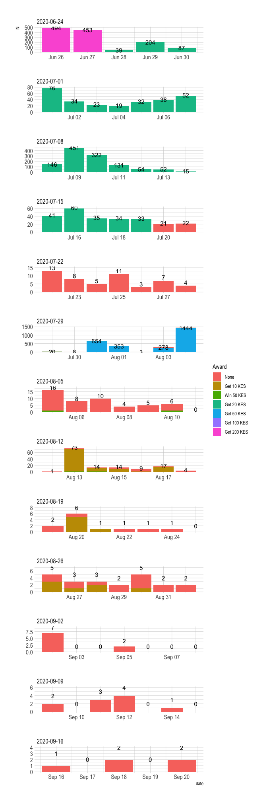
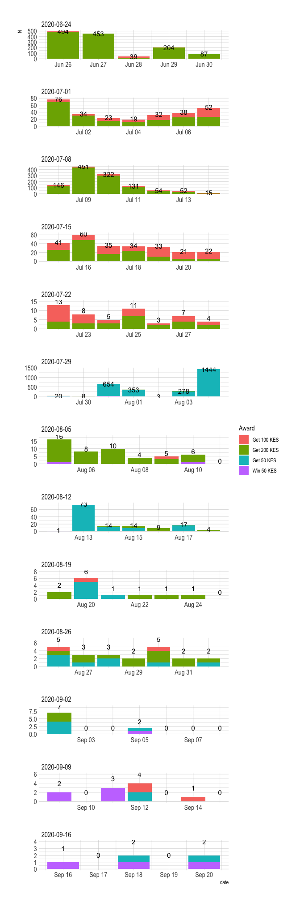
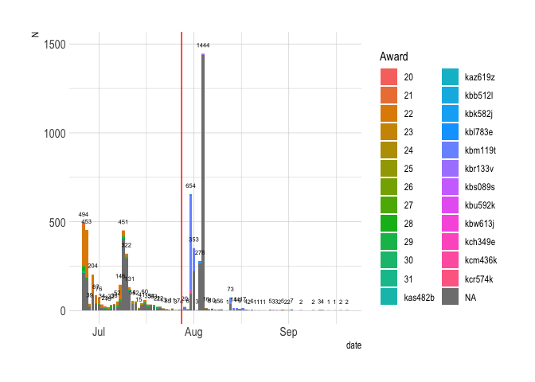
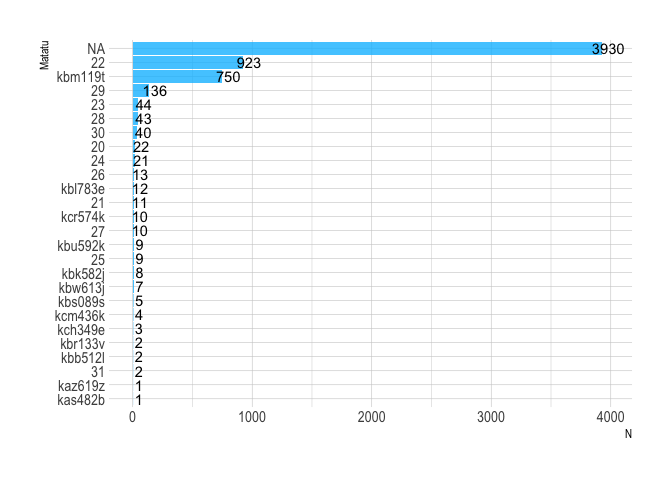

# Number of Responses

```r
data %>%
  group_by(date) %>%
  dplyr::summarise(N = n()) %>%
  ggplot(aes(x=date, y=N)) +
  geom_col(fill = "dodgerblue4") +
  geom_text(aes(label=N), nudge_y = 50, color = "black", size=2) +
  geom_vline(xintercept = as.Date(PILOT_2_DATE),
             color = "red") +
  theme_ipsum()
```

<!-- -->

# Questions by Vehicle


```r
data_long <- data %>%
  dplyr::select(matatu_no_clean, 
                driver_rating, speed_rating, occupancy, covid_measures) %>%
  pivot_longer(-matatu_no_clean) %>%
  
  filter(value != "") %>%
  
  # Number of responses per question, per vehicle
  group_by(matatu_no_clean, name) %>%
  mutate(N_veh = n()) %>%
  ungroup() %>%
  
  # Aggregate
  group_by(name, value, matatu_no_clean, N_veh) %>%
  summarise(N = n()) %>%
  ungroup()  %>%
  
  # Clean variables
  mutate(matatu_no_clean = paste0(matatu_no_clean, " - ", N_veh)) %>%
  mutate(N = N/N_veh)

data_long$name[data_long$name %in% "driver_rating"] <- "How would you rate your Matatu driver?"
data_long$name[data_long$name %in% "covid_measures"] <- "Were measures taken to prevent spread of COVID-19?"
data_long$name[data_long$name %in% "occupancy"] <- "On the Matatu, are there"
data_long$name[data_long$name %in% "speed_rating"] <- "How would you describe your Matatu driver's speed?"

data_long$value <- data_long$value %>% str_squish()

data_long$value <- factor(data_long$value, levels = c("No",
                                                      "Yes, but seemed limited",
                                                      "Yes, effective",
                                                      
                                                      "Very Unsafe",
                                                      "Unsafe",
                                                      "Safe",
                                                      "Very Safe",
                                                      
                                                      "Less people than seats",
                                                      "Same number of people as seats",
                                                      "More people than seats",
                                                      "More people than can fit",
                                                      
                                                      "Too slow",
                                                      "Okay",
                                                      "Fast",
                                                      "Dangerously Fast"))

out_plot <- lapply(data_long$name %>% unique, function(i){
  
  data_long %>%
    filter(name %in% i) %>%
    ggplot(aes(x = reorder(matatu_no_clean, N_veh), # 
               y = N, group=value, fill=value)) +
    geom_col(color="black") +
    labs(x="", y="",
         title = i) +
    theme_minimal() +
    coord_flip() +
    labs(x = "Matatu & Number of Responses", y = "Proportion", fill = "") 
  
}) 

do.call(grid.arrange, c(out_plot, ncol=1))
```

<!-- -->

# Feedback

## Number of Words - Histogram

```r
# TO DO: Put into buckets and show % -- use geom_col
data %>%
  filter(feedback_nwords > 0) %>%
  ggplot() +
  geom_histogram(aes(x = feedback_nwords),
                 bins = 50,
                 fill = "dodgerblue") +
  labs(x = "N Words", 
       y = "N Responses") +
  theme_ipsum()
```

<!-- -->

## Responses


```r
data %>%
  filter(feedback_nwords > 0) %>%
  arrange(desc(feedback_nwords)) %>%
  dplyr::select(feedback, matatu_no_clean) %>%
  dplyr::rename("Matatu" = matatu_no_clean,
                Feedback = feedback) %>%
  paged_table()
```

<div data-pagedtable="false">
  <script data-pagedtable-source type="application/json">
{"columns":[{"label":["Feedback"],"name":[1],"type":["chr"],"align":["left"]},{"label":["Matatu"],"name":[2],"type":["chr"],"align":["left"]}],"data":[{"1":"Our Matatu System Has Really Evolved Over The Years And We Have Experienced Much Since The Commencement...I Believe With The Rapid Changes We Can Improve Even More...Many Policies Put In Place Should Be Able To Safeguard The Driver, The Passengers, The Matatu And Even The Pedestrians...Especially During This Covid 19 Pandemic We Need To Be Very Vigilant By Following Every Government And MOH Guidelines...We Ensure We Stay Safe To Save Lives...I Believe Matatu Culture Has More To Offer To Kenyans","2":"NA"},{"1":"Yeah sure,all i wold recomend is the traffic police to b more keen on this route as there are no any health measures being taken....passangers are being mistreated .i suppose that the government b more keen on matatu people as they contribute much un the increase of the cases daily.thankyou","2":"NA"},{"1":"1. Due to the COVID- 19 pandemic the matatu drivers shouldn't give up in providing the hand sanitizers to passengers so as to flatten the curve of this virus.2. Matatu drivers are just okay, that's a good work3. Loud music is not necessary to most of us","2":"NA"},{"1":"Maybe to the said about drivers who are corrupt giving bribes and using other routes,, to take caution and let them know they will suffer alot as the disease is spreading faster due to their ignorance,,, let them know that it time to be serious","2":"22"},{"1":"I like my driver and the conductor for being on the first line in the fight against Covid 19 by adhering to the MOH directives, they do not exceed the 8 passengers in the 14 seater matatu and they dont carry people without masks.","2":"NA"},{"1":"compliment my driver for taking the best measures that have been directed by NTSA & the ministry of health. 1. No excess passangers. 2. No overspeeding and reckless driving3. Recomends all passangers sanitize and keep distance in the matatu before he sets to drive@Qyvn_Consta69ine","2":"NA"},{"1":"To the driver it's quite a trial with your team on measures you're supposed to take to control this Corona pandemic. You ought to do more and be more strict on this . Otherwise I enjoyed the drive...it's quite commendable","2":"NA"},{"1":"Well on my part I can say that the operators of the matatu took all the necessary measures to try and mitigate the spread of Covid 19 as well as following the rules and regulations that guide road users.","2":"22"},{"1":"This driver drives okay,not fast but not too slow,,,passengers are seated as required  by the social distance  guide,as directed by govt but measures on sanitizing the passengers should be more enhanced,,stricter everyone with no exception should be sanized.","2":"22"},{"1":"I appreciate the driver for making sure that all passengers are safe,partaining the current pandemic of covid_19 we are facing,for installing the  preventive measures equipments in the matatu like sanitizers as well as social distances are adhered to.","2":"22"},{"1":"I would like to complement the driver for driving at the expected speed not slowly and not fast and for making sure that the regulations given by the government on prevention of Corona are adhered to strictly.","2":"NA"},{"1":"I would like to tell the drivers of the matatu and also to all riders to observe the measure concerning dhi prenvention of the virus covid;they should keep distance,wear there masks always and sanitize wherever they are.","2":"NA"},{"1":"I think the drivers applying route 46 (kawangware) have tried there best and i think that's the reason why the spread of COVID_19 has gone down in the area and I'm very happy for that","2":"NA"},{"1":"The speed of the matatu is ok the driver and the conductor are good too they make sure every passenger is comfortable and obey the government restrictions of keeping social distance and wearing of masks.","2":"NA"},{"1":"I would like to compliment the driver  driving the matatu im using now because he is driving safely and thank him and the conductor for adhering to the rules set in the control of covid19","2":"NA"},{"1":"Not to put loud music but cool ones because it help each a everyone passengers and it help each a everyone to link in they email free without been charge by using WiFi","2":"22"},{"1":"The steps taken by the matatu industry ensuring that its passengers are treated right and protected during this high time we're all alert to the pandemic ....i congratulate them for the effort taken","2":"28"},{"1":"the management of LOTHIAN buses should take the case of covid19 seriously and sanitize each and every passager boarding the bus. and not to allow passangers without  mask to get on board.","2":"NA"},{"1":"The drive was safe and the driver really tried to make sure we arrived on time and also provided us with some santiziers as we boarded he was okay average","2":"NA"},{"1":"I would love to board the matatu cause the driver was cautious when driving plus he made sure that the regulations by the Healthy ministry were considered to the latter","2":"22"},{"1":"The matatu driver ensures all the measures to curb the spread of covid-19 is put in place, drives a a speed which is okay to all and that ensures safety","2":"NA"},{"1":"Yes i will,,if it's unsafe i report or get out of that vehicle and take another,,, for my safety,,but am okay the driver is driving following the protocols for driving","2":"NA"},{"1":"This driver is fantastically safe, most concerned on the measures put across by the government to prevent the spread of COVID-19. I would urge other drivers to follow the same.","2":"NA"},{"1":"I would like to tell the driver to observe all the measures that have been put in place so as to be in the safe condition while on the road","2":"NA"},{"1":"Thanks to the driver.....hes following all the government initiatives because he understands a human life matters....stay safe n keep distance not forgetting.....to sanitize..for safety beings with you.....we shall overcome","2":"22"},{"1":"I don't have any complain about matatu drivers for now but I think the government should provide sanitizers to matatus coz the sanizer are expensive to some of us","2":"NA"},{"1":"Yes because my driver is very safe when driving he does not drive on a high speed and in terms of music he puts it in a low sound","2":"22"},{"1":"Life of people matters so drivers should be very keen on the roads,And covid 19 is real let's do what the government tells us to do for our selfty","2":"NA"},{"1":"I would like to advice all the drivers that may take all the precaution and also to make sure that they follow the rules and regulations of the traffic.","2":"22"},{"1":"The matatu drivers should take the covid 19 precautions very seriously . Disinfect door handles and areas that people get in contact with..and also maintain the social distance","2":"22"},{"1":"He drives very carefully and with limited speed and he strictly makes sure that the  measures taken to stop spread of covid 19 are followed by all passengers","2":"22"},{"1":"The driver was very kin on his job I don't see any unsafe condition and therefore I'd urge some of them to follow the rules of the NTSA","2":"NA"},{"1":"The ride was just fine and the driver puts all the passengers at ease and comfortable by observing all the hygienic  measures and driving at the right speed.","2":"NA"},{"1":"The driver is clean,drives safely and he has taken all measure for covid 19 prevention also the matatu is in good state and social distance is maintained .","2":"NA"},{"1":"The matatu driver has put in place measures to curb the spread of covid 19 by providing sanitizers to passengers and carrying few passengers to enhance social distance","2":"NA"},{"1":"As one of the passengers I  wish,you guys well and I enjoyed your services, I will consider you every time I will travel,if you are available, thank you.","2":"kbm119t"},{"1":"The Matatu is keenly undertaking the measures put up to prevent the spread of COVID-19 and all matatus should do the same to protect lives of us all","2":"NA"},{"1":"Our driver is so good he is making sure everybody sanitizes before going into the car and maintaining social distance the vehicle is in a good condition too","2":"kbm119t"},{"1":"The ride was very safe , every sanitize before entering and we also observed one meter away rule. The vehicle speed was awesome. I enjoyed the travel","2":"NA"},{"1":"I truly enjoyed the drive blessings to the driver for caring about his customers health and also respecting the governments regulations to control this pandemic. Thank you","2":"NA"},{"1":"I would like to compliment the driver.  If everyone followed the rules like he did,  we will be a long way in preventing the virus.  Good job.","2":"NA"},{"1":"Yes,want to encourage the driver to continue driving slowly,carefully and not to overload passengers and follow government directives on COVID 19 so as to prevent the Virus","2":"kbm119t"},{"1":"The driver is cautious with a very commendable speed, except that the sanitization process and control of covid 19 is still limited due to lack of resources","2":"NA"},{"1":"Yes I think drivers should try to ensure that the passengers are safe in terms of avoiding road carnage as well as minimizing the spread of COVID","2":"NA"},{"1":"The driver is keen on the road,  the speed is okay and social distancing is well managed. All measures to prevent the spread of COVID19 are taken.","2":"NA"},{"1":"Grateful to the driver for observing the safe rules on the road and also putting sticks to educated the people boarding the matatu in matter concerning Covid19","2":"NA"},{"1":"I would like to tell the driver that he\\\\she is risking alot of lives and therefore should take all required measures for the good of them all","2":"kbm119t"},{"1":"Our police personnel are not taking good look on the reckless drivers and our drivers should also be given advice on the importance of good driving.","2":"NA"},{"1":"The driver makes sure that  the measures taken in the Matatu  to stop the spread  of covid-19 are consindered such as the use of sanitizers  .","2":"22"},{"1":"Am so glad by the matatu industry operators for the masseurs taken during this time of the pandemic by ensuring that all its customers are safe","2":"28"},{"1":"am so careful when am driving cause i carried lives of my kanyans.   and i need to those who drives roughly being held to the court","2":"NA"},{"1":"Drivers should learn how to obey traffic laws and driver carefully keeping in mind that they are entrusted with the life of their passengers. Thank you.","2":"NA"},{"1":"To all our drivers remember to ensure the safety of your passengers and remember to follow the rules in this time we are having a pandemic","2":"22"},{"1":"The driver was careful ,safely driving ..there was the speed Governor so he couldn't over speed...it was the tout who made everything about the ride unsafe","2":"NA"},{"1":"I would like to to tell him to always sanitize and to carry the correct number of people required in the matatu also to drive safe","2":"NA"},{"1":"Thanks.. With the current situation in our country.. Covid has made each and everyone one of us careful ..so people av trained to be self conscious","2":"NA"},{"1":"the matatu is good and the rules and regulations given 4 covid 19 is strickly followed so i urge thm to remain with the same spirit","2":"NA"},{"1":"What I would like to advice drivers is that they adjust to those rules so as to keep safe and pretend the spread of covid 19","2":"NA"},{"1":"Yes,I would like to compliment the drive since he's observing road safety and is observing all the necessary measures to protect us passengers from contracting COVID19","2":"kbm119t"},{"1":"For this matatu its ok, the driver is driving well and the conductor is observing the number of passengers required unlike most of them. Thank you","2":"NA"},{"1":"What I would like to advice drivers is that they adjust to those rules so as to keep safe and pretend the spread of covid 19","2":"NA"},{"1":"What I would like to advice drivers is that they adjust to those rules so as to keep safe and pretend the spread of covid 19","2":"NA"},{"1":"In helping in the fight against the COVID-19 kenyans are urged not to take government directives for granted so as to ensure a healthy kenya","2":"NA"},{"1":"I ask our drivers nt to over speed drive safely and adhere to covid 19 rules so that we can overcome this pandemic and accidents.","2":"22"},{"1":"Ensure cleanliness of the car (sanitization after all passenger alight at the matatu terminus, transport is now costly and advantage is taken sit to it","2":"NA"},{"1":"It helps the passenger not to sleep in a matatu and it keeps then alacrity and some work on they way to work using WiFi","2":"22"},{"1":"A very good and skilled driver. Obeys road signs and speed limits. Very good personalities when handling the clients and a very polite conductor too","2":"NA"},{"1":"I would like to complement the driver for driving safely and adhering to the regulations given by the government on the spread of corona virus","2":"NA"},{"1":"I would like to complement the driver for driving safely and adhering to the regulationa given by the government on the spread of corona virus","2":"NA"},{"1":"I would like to complement the driver for driving safely and adhering to the regulations given by the government  on the spread of corona virus","2":"NA"},{"1":"This driver is indeed very keen on the measures put across to prevent spread of COVID-19. I would advice other drivers to follow the same.","2":"NA"},{"1":"The government should look a way of improving the safe of passagers and the driver to ensure the spread of covid 19 is being limited","2":"kbm119t"},{"1":"The travelling is good. The speed is well. We are sanitized before entering, social distance is looked into. People are wearing masks and it's mandatory","2":"NA"},{"1":"I was measured my body temperature like other passengers and sanitized even after washing my hands and I just feel safe with other passengers here","2":"kbm119t"},{"1":"I would  like to complement  the driver for driving  safely  and  adhering  to the regulations  given by the government  on the spread of corona  virus","2":"NA"},{"1":"Driver is very good due to his experience he acquired over some years and has a valid, he has never cause accident in his lifetime","2":"NA"},{"1":"The speed is okay so am arguing the matatu driver to continue like that and also less passengers than seats is safe for the passengers","2":"kbm119t"},{"1":"The matatu should  use measures to avoid covid19, have social distance and use of sanitizers.in conclusion every matatu should  obey government rules and measures","2":"NA"},{"1":"I would like to congratulate the driver for ensuring all measures are put in place to combat covid-19 and safety of the passengers enhanced","2":"NA"},{"1":"The driver was very fast because mostly they wanted to reach their destination putting passengers lives in danger mostly matatus from town to umoja","2":"22"},{"1":"Today's driver was driving safely but for most experiences drivers are always driving carelessly and fast so as to get more squads per day.","2":"20"},{"1":"I think tge matatu system has much to offer to kenyans...I believe adherence to laws governing the sector should be followed to the latter...","2":"NA"},{"1":"Some drivers are careful but other seem not to care at all, let all drivers always protect the life entrusted to them by passengers","2":"22"},{"1":"the driver drives careful to cab the spread of covid~19 ependemic that has affected various activities not only in kenya bt also world wide","2":"NA"},{"1":"Matatus should be kept in good condition , measures against covid 19 should be enforced, n road safety rules should be adhered  to strictly","2":"NA"},{"1":"Ave been travelling to and from garden Estate via bypass with same matatu and always driven carefully and has been always carrying 8 passengers","2":"22"},{"1":"The measures put to protect all passangers and ensure they all travel safely are all good and helps all passengers feel safe when travelling","2":"NA"},{"1":"I've really enjoyed my trip so far and I trust to arrive safe sound more so the adherence to covid rules have been applied","2":"NA"},{"1":"The driver is safely driving....having made sure ventilation of the car is okey so I consider my life safe with him behind the wheel","2":"NA"},{"1":"The matatu is among the few safe matatus have borded lately. They are trying their levil best to control and care for their passangers","2":"NA"},{"1":"I commented that the matatu  is good and I urge thm to continue with the same Spirit for the safety of the passenger s","2":"NA"},{"1":"Let the driver and the entire matatu management observe the measures put by the ministry of health to avoid the spread of the disease","2":"NA"},{"1":"I would like to congratulate the matatu drivers for the safe measures they are taking truly we have seen a great change in them","2":"NA"},{"1":"I would like to complement the driver for driving safely and adhering to regulations given by the government on the spread of corona virus","2":"NA"},{"1":"The matatu is well serviced and the driver is more vigillant and carefull as he drives he observe al the traffic and road signs","2":"kbm119t"},{"1":"The driver was very okay when driving the vehicle and there was no complains... Measures taken to prevent covid 19 were also adhered to","2":"kbm119t"},{"1":"I'd like to let the driver know that it is good to always safe,and no matter the temptations during this period,just follow the rules","2":"kbm119t"},{"1":"The whole matatu team i. e driver and conductor adhere to WHO and ministry of health rules regarding covid-19 ... Heko!!.. to the team","2":"NA"},{"1":"He's a good driver and he has all measures set by the ministry of health to curb the spread of corona virus on check.","2":"NA"},{"1":"I would like to complement the driver's since they have complied with the covid 19 measures and they care the safety of their passengers","2":"NA"},{"1":"Safe drive, but the issue is CORONA, NO SANITIZERS, NO WASHING HANDS WHEN BOARDING AND ALL THAT. LET THAT INITIATIVE BE ATHERED TOO!","2":"NA"},{"1":"The drivers and the whole crew have really helped by following the provided guidelines to deal with Covid-19 and I appreciate for that","2":"NA"},{"1":"The driver is cautious and has obeyed all the rules concerning the pandemic the matatu is also safe as the windows are open","2":"NA"},{"1":"Would like to compliment the driver for adhering to road safety rules and also  measures put in place to curb this corona virus","2":"22"},{"1":"Most of the time, the drivers follow the regulations but occasionally break them when the are confident that law enforcers are not keen","2":"NA"},{"1":"The matatus is following rules and regulation hence aiding in preventing Covid 19 as per the number of passengers nd sanitizing as required","2":"NA"},{"1":"I recommend that matatu drivers on their level best are effecting a positive effort on controlling and preventing the spread of covid-19 virus","2":"22"},{"1":"During this pandemic am so glad that the measures taken by matatu industry to ensure that all its customers are safe is beneficial","2":"22"},{"1":"I would love the body in charge to be able to regulate the commuter charges cause its absurd charging that is taking place","2":"NA"},{"1":"I would like to comend the matutu drivers and their stakeholders for their good work of try to curb the covid 19 virus","2":"NA"},{"1":"I'd love to compliment the driver. You had to sanitize, have your mask on, then and only then were you allowed to board.","2":"NA"},{"1":"I compliment the driver for driving safe but urge him to ensure ministry of health protocols on fight against covid 19 are followed","2":"NA"},{"1":"Driver of the matatu drives at a slower speed,and he has also limited the number of passengers per Trip to enhance social distance","2":"NA"},{"1":"The matatu is safe, and taking the prescribed measures to stop the spread of Covid-19. The driver is driving at a safe speed","2":"NA"},{"1":"Passengers should report to the attached mobile numbers in the matatu should they find the ride unsafe or any misconduct from the driver.","2":"kbm119t"},{"1":"Am pleased because am always safe to travel with matatu sector. The current rules make us enjoy and feel safe when travelling","2":"NA"},{"1":"The driver is good and he is observing or measures  for the prevention of covid 19 And  the safety of each passenger","2":"28"},{"1":"I would like to compliment my driver for trying his best to drive safe and try to stop the spread of COVID_19","2":"NA"},{"1":"The driver have actually maintain the covid 19 safeties and with this we see a controling action bettering well being of travellers","2":"NA"},{"1":"I would like to appreciate my driver for safe-driving us and taking the effective measures to prevent the spread of the COVID-19","2":"22"},{"1":"The driver is always careful for the safety of his passengers and enables the passengers to reach their destination safe and sound","2":"22"},{"1":"My matatu driver is observant on the road and he observes measure put in place to reduce the spread of COVID 19","2":"NA"},{"1":"The driver is driving safely and the passengers have maintained social distance.his speed is okay not so fast and not too slow","2":"22"},{"1":"ause he is driving safely and thank him and the conductor for adhering to the rules set in the control of covid19","2":"NA"},{"1":"The driver  is careful and is concerned about the passengers in that he makes sure all the rules concerning covid-19 are followed","2":"NA"},{"1":"My matatu driver is pretty much old-school but make me feel safe on the road and that's all that matter, thank you.","2":"NA"},{"1":"Upto date with everything right in place ,I think if all matatus are like this then the rate of covid-19 would decline","2":"NA"},{"1":"The car is very safe.. The driver is driving carefully and also they have observed all the measures to prevent covid 19","2":"NA"},{"1":"I would like to urge the driver to adhere to the ministry of health on COVID-19 spread prevention protocols. Pamoja tutashinda corona.","2":"kbm119t"},{"1":"Drivers should ensure that they follow each and everything that the government has put in place to prevent the spread of covid19","2":"kbm119t"},{"1":"I'd like to appreciate how the drivers have so tried to take the measures to curb the spread of Corona virus","2":"NA"},{"1":"I'd like to appreciate how the drivers have so tried to take the measures to curb the spread of Corona virus","2":"NA"},{"1":"Matatu driver to follow guidelines given by ministry of health to stop spread Corona virus and to keep their passengers safe","2":"NA"},{"1":"I would like to compliment my driver for being careful and responsible when handling our lives on the road  Thank you","2":"22"},{"1":"I'd like to appreciate how the drivers have so tried to take the measures to curb the spread of Corona virus","2":"NA"},{"1":"the driving is cool and the amenities are also okay.The measures are also taken into account to prevent the COvid 19.","2":"25"},{"1":"The driver is always careful for the safety of all passengers which enables them to reach their destination safe and sound","2":"22"},{"1":"The driver was cautious with the speed and also the number of passengers.Also the providing of sanitizer made the ride awesome","2":"NA"},{"1":"I would just like to congratulate all those drivers who are very kin on their safety and that of the passengers","2":"NA"},{"1":"As passengers also we have to adhere to this rules to give the drivers easy time.drivers also continue wth the same","2":"NA"},{"1":"Driver to take all measures provide by the ministry of health so as to reduce the chance of spreading the virus","2":"NA"},{"1":"Matatu should be given strong measures to follow so to prevent COVID since most of the citizens use it to travel","2":"NA"},{"1":"Driving is safe. And the required measures are moderately observed. I would recommend the driver to observe the measures more strictly","2":"NA"},{"1":"The ride was actually okay as the driver drove carefully and also the matatu was well maintained and fit for traveling","2":"NA"},{"1":"they should use safe sanitizers on people sometimes they use the sanitizer to drug people in the vehicles and rob them","2":"NA"},{"1":"The drivers should ensure that all passengers on board should follow the control measures to prevent spread of covid-19 worldwide.","2":"NA"},{"1":"Matatus nowadays are safe for use and should be congragratulated for emulating good conduct at this time of the pandemic","2":"NA"},{"1":"The drivers in my route are cautious especially because there's road construction, so they drive well and someone feels safe.","2":"NA"},{"1":"Yes. I'm so much glad to have such a driver and a convenient measures especially during this Covid 19 pandemic.","2":"22"},{"1":"The matatu driver is very keen on the road and follows the traffic rules in order to avoid accidents .","2":"NA"},{"1":"The matatu was is good condition plus the crew were really friendly and maintained the necessary measures to curb COVID","2":"30"},{"1":"The matatu should be well equiped to avoid spread of covid 19 and ensure every passenger wears a mask correctly","2":"22"},{"1":"Drivers must wear masks, they must maintain social distance and ensure they follow rules to prevent spread of covid 19","2":"NA"},{"1":"We all need to take part by talking our minds out if we feel its not safe during the ride","2":"NA"},{"1":"The driver was good with following all the safety measures to prevent Covid 19 and to also prevent reckless accidents","2":"NA"},{"1":"Matatus are really trying the level of best to implement set guidelines by ministry of health to curb covid 19","2":"NA"},{"1":"The drive who ara careless have to be reported to the police so that they can be careful wile driving","2":"NA"},{"1":"The driver should seriously implement the safety measures on the vehicle and keep up for the far they have tried","2":"NA"},{"1":"Drive is so good it ensure that every body wear amask probably and Sanities before entering and ensure social distance","2":"kbm119t"},{"1":"I would like to say that the drivers should continue with doing the good job of keeping the passengers safe","2":"NA"},{"1":"The drive is really okay and the driver is taking precautions of the covid-19 rules and also the trafiice rules","2":"kbm119t"},{"1":"you maintained the measures and i hope you continue with the measures so that we can curb this pandemic.thank you","2":"NA"},{"1":"The driver is okay but passengers themselves are not observing the social distance at the enterence or inside the matatu","2":"NA"},{"1":"I would love other drivers too to adhere to precautions and measures like he is doing. Good work to him","2":"NA"},{"1":"This is how all Matatu drivers should be doing and even advance more to help in reducing Covid 19 infections.","2":"NA"},{"1":"The driver is driving well ensures keeps his lane all of us wearing seat belts and alights at right stage","2":"NA"},{"1":"The matatu is in good condition so passengers should not worry all measures regarding covid-19 have put in place","2":"NA"},{"1":"For now i have no comments but ni any circumstance i come across an unsafe driving i will comment","2":"NA"},{"1":"The driver is good at his work and drives safely moreover observes  measures to prevent the spread of COVID-19","2":"NA"},{"1":"The driver is always careful and has never oversped the matatu.He adheres to the rules provided by the government","2":"22"},{"1":"Should observe and follow the guidelines kept by the ministry of health by wearing mask even in the matatu","2":"22"},{"1":"The matatus and drivers are trying there level Best to  keep there passengers safe from the covid  19 pandemic","2":"22"},{"1":"Yes I would urge all the drivers to drive safely and take preventive measures to prevent spread of diseases","2":"NA"},{"1":"It ride is awesome, keep on with the COVID prevent measures by supplying the sufficient requirements. Wish you well","2":"NA"},{"1":"Yes,unsafe driving because we are way too many in a vehicle yet thats not ideal during this pandemic period","2":"NA"},{"1":"The ride is safe and the matatu is strictly  following the measures to reduce the  spread of Covid 19","2":"NA"},{"1":"I WOULD SAY ITS NICE TO KNOW THAT THE MATATU IS TAKING STRICT MEASURES AVOID TO SPREAD THE VIRUS","2":"NA"},{"1":"I would like to urge the driver to adhere to the ministry of health on COVID-19 spread prevention protocols","2":"NA"},{"1":"I advocate for such kind of services or better in the near future,I enjoy my journey with you guys","2":"kbm119t"},{"1":"The driver is very good and follows all road guidelines and very safe about the pandemic, bravo to him","2":"kbm119t"},{"1":"The ride was safe and all measures to prevent the covid 19 pandemic from spreading were adhered to strictly","2":"NA"},{"1":"Compliment the driver because he has followed the traffic rules and careful while driving,he cares for his fellow citizens","2":"NA"},{"1":"I want to thank the driver for observing traffic rules and also for the compliance to kick out covid-19","2":"NA"},{"1":"All driver to emulate what my driver for tonight was doing ...people's life is important and matters a lot","2":"kbm119t"},{"1":"Driver has a license and has never caused any accident due to his experience and he likes his work","2":"NA"},{"1":"The driver should keep upTo the whole landline teamThank you for considering your customers healthPamoja tuzuiye kusambaa kwa Corona","2":"NA"},{"1":"The matatu was so safe and enjoyable, every one sanitized before entering and we sat one meter a way,","2":"NA"},{"1":"The driver has ensured that the number of passengers are limited to enhance social distance, providing alcohol based sanitizer","2":"NA"},{"1":"The driver was on speed limit and courteous. Maintained the one meter rule as a covid preventive measure.","2":"29"},{"1":"Yes, I liked the driver so much he was so polite unlike other drivers I have met b4","2":"NA"},{"1":"I'd like to appreciate the measures they have taken so far to curb the spread of the virus","2":"NA"},{"1":"The driver was so good Though he had so many stop overs Very safe and I would recommend","2":"NA"},{"1":"The matatu is safe according to requirements of the pandemic unless otherwise i.e accidents and other inconvenience s.","2":"22"},{"1":"The driver is driving well and observing all road signs. The other careless driver should follow his example","2":"22"},{"1":"The driver was driving at an acceptable  speed and ensured to drive us to our destination. Thank you","2":"30"},{"1":"I would like all the matatu to have speed governors and to carry passengers according to its seats","2":"22"},{"1":"Very safe driving, because the driver is keeping the measures provided by the government to prevent covid 19.","2":"22"},{"1":"The driver drove cautiously and limiting the number of passengers as a measure preventing spread of COVID 19","2":"NA"},{"1":"They should countinue limiting the passagers and keeping social distancing and most impotantly wearing the mask anf sanatizing","2":"NA"},{"1":"I would love to compliment the drivers, they try their very best to ensure safty on their part.","2":"22"},{"1":"Would like to appreciate my driver and his crew for customer service they offer me during my rides","2":"NA"},{"1":"Matatu is one of the best means of transport but careless drivers should be reported and action taken","2":"NA"},{"1":"Will compliment all the drivers who are observing the rules and ensuring the safety first of their passengers","2":"22"},{"1":"I WOULD LIKE TO COMMENT TO THE DRIVERS TO BE VERY CAREFUL WHEN THEY ARE ON THE ROAD","2":"22"},{"1":"The driver drove cautiously and limiting the number of passengers as a measure preventing spread of COVID 19","2":"NA"},{"1":"I would compliment the drivers, at least they are doing their part to prevent the spread of Covid-19","2":"22"},{"1":"The matatu was safe and the driver was driving on the speed limit that is advised and safe","2":"22"},{"1":"Driver is calm and is quiet aware of the traffic rules and does his best to obey them.","2":"NA"},{"1":"Observe the health regulations to prevent Corona spreadAnd also to to observe traffic rules to avoid unnecessary accidents","2":"NA"},{"1":"I recommend that passagers to raise their voices when they see the Covid 19 rules are being broken.","2":"NA"},{"1":"I recommend that passagers to raise their voices when they see the Covid 19 rules are being broken.","2":"NA"},{"1":"I want to compliment the the driver for he is taking measures on the road and driving safely","2":"NA"},{"1":"The ride is safe and the matatu is following the measures to reduce the spread of Covid 19","2":"NA"},{"1":"I would like to compliment the driver for driving safely and also by following the covid 19 measures","2":"kbm119t"},{"1":"The journey was safe and we reached safe,the ride was awesome and all rules on travelling were followef","2":"NA"},{"1":"The driver and the conductor have tried by limiting the number of Passengers during this time of covid-19","2":"NA"},{"1":"Advise to be given to the matatu sector on healthy ways towards prevention of spread of the Covid-19","2":"NA"},{"1":"The driver is kinda driving safe and am sure we'll be able to get to our destination safe","2":"NA"},{"1":"Thank you for the effectiveness of Corona measures in this matatuMay all our drivers and passengers keep safe.","2":"NA"},{"1":"Yes. I thank the driver for at least driving at the required speed limit. I enjoy the ride","2":"NA"},{"1":"The ride is smooth and there was cool music that sooths my ears after along day of hustle","2":"NA"},{"1":"It was a safe drive, the driver is cautious and all measures taken to curb Covid-19 adhered to","2":"NA"},{"1":"The law enforcement agencies should make sure the measures to be taken by riders and matatus are followed","2":"NA"},{"1":"The driver is a well experienced driver with a good conduct he is ensuring everything is done well","2":"NA"},{"1":"The driver was okay and there was no complain from any passenger Covid 19 measures too were followed","2":"kbm119t"},{"1":"The driver was okay and there was no complain from any passenger Covid 19 measures too were followed","2":"kbm119t"},{"1":"Driver has a valid license and quite safe to drive, has never caused accident due to his experience","2":"NA"},{"1":"Have to say that the driver is Keen while driving and he cares about his passengers life ...","2":"NA"},{"1":"The driver is very keen on the road, observative on the covid measures and friendly to the passengers","2":"NA"},{"1":"Most matatu use highway hence making it hard to be left in muthaiga, making it dangerous for pedestrians","2":"NA"},{"1":"Social distance is well maintained but no sanitizer when entering the matatu. The management should improve on this","2":"kbm119t"},{"1":"Drivers and riders to stay by ensuring the recommended passengers as directed by MoH sanitise wear masks always","2":"NA"},{"1":"Driver should ensure safety measures especially the rate of speed and also all rules on COVID-19 be followed","2":"NA"},{"1":"The SACCO should make an effort to have adequate sanitizers and also working thermal gun to avoid delays","2":"kcr574k"},{"1":"Driving is safe and rules and regulations are put in measure in adherance to ministry of health","2":"22"},{"1":"The driver is sober and maintains the required speed,therefore I reccomend him as a safe driver thanks","2":"NA"},{"1":"The speed of the driver is okay and the people in the matatu have maintained the distance","2":"22"},{"1":"I will make sure u report to the police once the driver drive at a higher speed","2":"22"},{"1":"It is nice ed safe travelling in Matatu as all the covid 19 measures are being observed","2":"22"},{"1":"I request the matatu drivers to observe all the measures required to prevent the spread of COVID-19","2":"22"},{"1":"Some people hack your personal stuff online if you use public WiFi sometimes,so it's not that necessary","2":"NA"},{"1":"The driver should continue the good work as he's holding alot of peoples lives in his hands","2":"NA"},{"1":"I will make sure I report to the police once the driver drive at a higher speed","2":"22"},{"1":"The matatu drivers are observing the layed measures to ensure that they stop corona virus from spreading","2":"NA"},{"1":"Quality measures are being taken  for the prevention of covid-19,and the drivers are to careful while driving","2":"28"},{"1":"For this pirod of covid 19  I wat   the driver   avoid carry man people  in the matatu","2":"NA"},{"1":"Yes,would like to applause the drivers for the implemation of the  safety measures during this corona period","2":"NA"},{"1":"Compilment the driver because he seems to be driving fast to reach the destination before the curfew","2":"NA"},{"1":"The driver is very efficient hence drivers should be paid well in order to boost their morale.","2":"22"},{"1":"Yes, I think matatu drivers should work in pairs inorder to avoid fatigue incase one becomes tired","2":"22"},{"1":"Matatu drivers have really tried in maintaining all measures set in preventing the spread of covid 19","2":"NA"},{"1":"I would like to leave a comment buy saying or matatu drivers to take care of passengers","2":"NA"},{"1":"The driver is driving safely and also he has observed all the measures to prevent civid 19","2":"NA"},{"1":"The driver is driving safely and also he has observed all the measures to prevent covid 19","2":"NA"},{"1":"The driver is okey and he's taking each and every precautions given by the ministry of health","2":"NA"},{"1":"The driver has ,made sure that the number of passengers are limited and provides sanitizers to passengers","2":"NA"},{"1":"Matatu  are  in  first  line on  ensuring  covid  19  directives  are  followed  to  the  later, quite  commendable","2":"NA"},{"1":"The driver is a person who minds safety of the Passengers, he's a good driver. Thank you","2":"NA"},{"1":"The driver cares about the lives of his passengers,no overspeeding and corona virus preventive measures are good","2":"NA"},{"1":"The matatu is following the covid-19 guidelines as per the ministry of health therefore I recommend it.","2":"NA"},{"1":"The ride was fair. More measures to prevent the spread of Covid 19 should be implemented .","2":"NA"},{"1":"My driver takes proper precautions while driving,he takes note of every traffic notice putting passengers at risk.","2":"NA"},{"1":"The drive has reduce the number of passengers to enhance social distance, provide alcohol based hand sanitizers","2":"NA"},{"1":"The matatu driver  limited the numbers of passengers to enhance social distance, providing alcohol based hand sanitizer.","2":"NA"},{"1":"I WOULD LIKE TO THANK HIM FOR FOLLOWING THE GUIDELINES AS GIVEN BY THE MINISTRY OF HEALTH","2":"NA"},{"1":"The Matatu is safe Because It carries less people and people sanitize before entering to the matatu","2":"NA"},{"1":"I'll like to compliment the driver he is doing a nice job ensuring we are all safe","2":"NA"},{"1":"The matatu was very safe every one sanitize before entering and we sat one meter a way","2":"NA"},{"1":"The drive was safe, though the matatu needs to be cushioned. Their sanitizers and wipes looked limited","2":"NA"},{"1":"We are all working together to hinder the spread of covid 19 and the drivers drives safely","2":"NA"},{"1":"The ride was cool because the driving was safe and measures to prevent covid 19 was effective.","2":"NA"},{"1":"Well I would advice that the government provides enough protective materials for the PSV s especially sanitizers","2":"NA"},{"1":"The measures taken to prevent COVID-19 worked out and we thank the driver even for the sanitizer","2":"NA"},{"1":"Yes , I would reccomend the matatu to any passenger, the driver is excellent at his job","2":"NA"},{"1":"The driver is careful.. and the measures against covid19 are good though sanitisers need to be added..","2":"NA"},{"1":"The driver is good making sure everybody is safe though at some point he is very slow","2":"kbm119t"},{"1":"I will let the driver now that it is good to always safe no matter the temptations","2":"kbm119t"},{"1":"The matatu is in good state and has the covid rules and regulations...the driver is driving safely","2":"kbm119t"},{"1":"The conductor did not make sure I  got to the place I was  supposed to alight.","2":"29"},{"1":"The matatus are safe for travels because the drivers are very keen on the measures outlined","2":"NA"},{"1":"The speed of the matatu is safe and the people in the matatu have kept distance","2":"22"},{"1":"All report any unsafe driving and always appreciate our drivers for keeping us safe all through","2":"NA"},{"1":"All report any unsafe driving and always appreciate our drivers for keeping us safe all through","2":"NA"},{"1":"THE DRIVER WAS IN HIS FULL UNIFORM AND ENCOURAGING US TO ATHERE TO THE CONTAINMENT MEASURES","2":"NA"},{"1":"drive is safe and the measures are put in place in adherence to the MoH guidelines.","2":"22"},{"1":"For me the drivers within my area are good and understanding thumbs up to them all","2":"NA"},{"1":"I request our drivers and riders to be very careful and adhere to covid 19 rules","2":"22"},{"1":"Yes. am glad that there are  enough measures to prevent the spread of covid-19. Safety first.","2":"22"},{"1":"The matatu driver is carefully and has taken all measures to prevent the spread of COVID-19","2":"22"},{"1":"The matatu drivers and passengers in the stage should keep distance and wear their masks appropriately","2":"NA"},{"1":"All report any unsafe driving and always appreciate our drivers for keeping us safe all through","2":"NA"},{"1":"It was a safe ride and we thank you for the safety measures taken by drivers","2":"30"},{"1":"Drivers should be careful and make sure all passengers have mask and follow all the precaution","2":"22"},{"1":"Thank you matatu drivers for following all the measures in ensuring the safety of passengers,,,asanti sana","2":"NA"},{"1":"The drivers for our route are very cautious and the driver's speed is okay...one feels safe","2":"NA"},{"1":"I would like to congratulate our drive for adhering to the necessary  precautions to curb covid-19","2":"NA"},{"1":"We appreciate our driver because he follows all the measures given to control the covid 19","2":"NA"},{"1":"I would report any measures not adhered to by the driver for prevention of covid 19","2":"NA"},{"1":"The driver is a good one and thw efforts to fight covid have taken off well","2":"NA"},{"1":"Give adequate information to the driver about the safety measures to curb the spread of Coronavirus","2":"NA"},{"1":"Matatus are in first line on ensuring covid 19 directives are followed to the later,quite commendable","2":"NA"},{"1":"The services offered were the best and can't wait to travel with them again and again","2":"NA"},{"1":"Yes I must ensure rules and regulations for public transport are followed to prevent our people","2":"NA"},{"1":"Try as much as possible to keep social distance and ensure enough sanitizer for matatu users","2":"NA"},{"1":"The matatu has complied with all measures and is effective in curbing the spread of COVID-19","2":"kbm119t"},{"1":"The driver is okay and the services in the matatu are towards minimising spread of corona","2":"NA"},{"1":"The driver is okay and the services in the matatu are towards minimising spread of corona","2":"NA"},{"1":"The driver wears the mask and make sure  every passeger are sanitized and are wears mask","2":"NA"},{"1":"Measures taken to prevent COVID 19 were good, though not satisfactory Tight as supposed to be.","2":"NA"},{"1":"The ride is very safe. It adheres to rules that help prevent this disease, covid 19","2":"NA"},{"1":"The matatu us covid _19 safe and we urge all others to take this precaution measures","2":"NA"},{"1":"The driver is driving safe and follows all the measures to prevent spread of covid 19","2":"NA"},{"1":"The matatu is safe as much as the driver adores the covid rules I like it","2":"kbm119t"},{"1":"So far... As far as the Covid is concerned, matatu saccos within my area are trying","2":"NA"},{"1":"The driver is driving safe The Matatu is following all precautions for prevention of covid 19","2":"NA"},{"1":"Matatu are in first line on ensuring covid 19 directives are followed  to the later,quite  commendable","2":"NA"},{"1":"The ride is safe and very effective measures are observed to prevent passengers from covid 19","2":"NA"},{"1":"Am so grateful to the drivers for the good job ,, they are really staying safe","2":"NA"},{"1":"The ride is safe and the matatu following the measures to reduce the spread of Covid19","2":"NA"},{"1":"The matatu is safe since social distance, use of sanitizers and wearing masks is strictly followed","2":"kbm119t"},{"1":"Don't drink and drive ensure you sanitize passenger  before boarding the matatu keep people's life safe","2":"kbm119t"},{"1":"I would like to compliment the driver for strictly following the government directives regarding public transport","2":"kbm119t"},{"1":"Thanks for the driver because he's strict to those who goes against of the covid rules","2":"kbs089s"},{"1":"lets be more careful and follow measures given to prevent the spread of covid 19.","2":"NA"},{"1":"The speed of the driver is okay and people in the matatu have keep distance","2":"22"},{"1":"Driving must always be careful because the life of human being needs to be protected","2":"22"},{"1":"Congrats to the drivers they're doing great job..... obeying rules and regulations to prevent covid","2":"22"},{"1":"Matatu should obey government rules and regulations and take caution on measures given to them","2":"NA"},{"1":"My driver is fine and he is looking forward to the safety off every person","2":"28"},{"1":"The matatu company are doing a good job and also adhere to the covid rules..","2":"NA"},{"1":"During this COVID 19 session, matatu raised there transport fare and is now very expensive","2":"NA"},{"1":"Our drivers are doing a good job but should be added more time to rest","2":"22"},{"1":"I compliment john kinyanjui as a good and careful driver working with northrift shuttle services","2":"NA"},{"1":"I highly appreciate the driver of the matatu I ride on for driving me safely","2":"22"},{"1":"My driver is good and he is loking foward to the saftey of every one","2":"28"},{"1":"The drivers are cautious limiting the number of passengers help prevent spread of COVID 19","2":"NA"},{"1":"Matatu ride are safe now a days due to covid measures which are in place.","2":"22"},{"1":"The drivers deserve to be congratulate for joining Kenyans in the fight against covid 19","2":"NA"},{"1":"The ride was nice the speed was good no overloading of people en we sanitised","2":"NA"},{"1":"I love it how the drivers been following and observing the measures put in place","2":"NA"},{"1":"the drivers aren't taking covid 19 case seriously, traffic should be more keen on them","2":"NA"},{"1":"The ride is safe but the matatu driver should be more careful and drive safer","2":"NA"},{"1":"I liked how the driver ensured all maesures were followed to keep us all safe","2":"20"},{"1":"Yes.the drive was very ok and safe and the driver was hospitable and well sanitised","2":"NA"},{"1":"Safe driving and to the driver who is trying to keep everyone safe. Thank you","2":"NA"},{"1":"Very hard working driver and one who is committed on the safety of his passengers","2":"NA"},{"1":"Safe driving the driver is okay the number of passengers are less than the seats","2":"NA"},{"1":"rs to take the Covid 19 precautions just as they did I arrived at Ah","2":"NA"},{"1":"Compliment the driver.Great work he is doing. To curb the spread of Covid 19.So responsible.","2":"NA"},{"1":"The driver is driving safely and follows measures given to prevent the spread of covid19","2":"NA"},{"1":"This is the most safe matatu with a well trained driver I have ever met","2":"NA"},{"1":"The driving is safe and the driver is following all regulations to prevent covid 19","2":"NA"},{"1":"l congratulate the driver for observing safety for instance ensuring social distance among the passengers","2":"NA"},{"1":"The matatu is safe bacause the driver takes all the precautions that helps fight Covid-19","2":"NA"},{"1":"Yes kudos to the driver have been driven safely and thanks for minding our safety","2":"NA"},{"1":"The driver seems responsible amd is taking all the measures of preventing the pandemic seriously","2":"NA"},{"1":"The driver takes enough measures to ensure there's no way one can catch the virus","2":"NA"},{"1":"The driver is save and adheres to measures taken to curb the spread of COVID-19.","2":"NA"},{"1":"the ride was safe and the speed was ok and measures of covid-19 were observed","2":"NA"},{"1":"It was the best they observed covid 19 rules and he wasn't driving with speed","2":"NA"},{"1":"I would like drivers to be given a refresher course on safety during this season","2":"NA"},{"1":"He is a good driver who loves his passengers and ensures safety of the people","2":"NA"},{"1":"I would compliment the driver since he has adhered to covid 19 rules and regulations","2":"kbm119t"},{"1":"I would like to complement the driver for following all the measures put on place","2":"kbm119t"},{"1":"the driving was safe and all measures to prevent spread of the virus were taken","2":"kbm119t"},{"1":"May almighty God eradicate this pandemic and may all our drivers and passengers keep safe.","2":"NA"},{"1":"The matatu is safe and observing all the measures provided. The ride is also safe","2":"NA"},{"1":"He drives well and the speed is quite good .he also adheres the measures well","2":"NA"},{"1":"The matatu is very safe and the regulations on Covid 19 are being adhered to","2":"kbm119t"},{"1":"Good safe ride and good hygiene of the matatu. Driver and conductor have etiquette","2":"30"},{"1":"need more sanitizers and drivers to ensure all measures are kept in place always","2":"NA"},{"1":"During this corona period let them help us by keeping us safe..and drive carefully","2":"NA"},{"1":"The drivers are good since they have sanitizers to prevent people through this pandemic","2":"22"},{"1":"I urge all the matatu drivers to observe the measures required to prevent COVID-19","2":"22"},{"1":"appreciating the measures the've so far taken to curb the spread of the virus","2":"NA"},{"1":"I would like to say, matatus are just safe and comfortable means of transport.","2":"NA"},{"1":"Our matatu drives are very displined and conducters have cutesy, good language to customers.","2":"22"},{"1":"Yes. I'm glad for a safe and convenient transport especially in this pandemic period","2":"22"},{"1":"The drivers must be carefull while drriving becoz an accident can ocar any time","2":"22"},{"1":"Yes I would the drivers should be keen and try not to be greedy","2":"NA"},{"1":"The drivers are disciplined and they follow the COVID 19 rules from the government","2":"28"},{"1":"During this period we should follow the safety measures that the Government has kept","2":"22"},{"1":"Drivers in my route are very careful, cautious and polite too when spoken to","2":"NA"},{"1":"Most drivers and riders are keeping the rules on the fight of covid 19","2":"22"},{"1":"I just like the service offered. And the love you show to the customers","2":"NA"},{"1":"There is unsafe driving because they don't follow all measure given to prevent covid","2":"NA"},{"1":"The driver n the conductor are somehow cautious concerning the pandemic.big up to them","2":"NA"},{"1":"I would report her to the authorities to make sure he won't cause accidents","2":"22"},{"1":"Am glad all the directions to prevent the spread of covid 19 are followed","2":"22"},{"1":"Yes!My driver was fine iwould like to travel with him on my next journey","2":"NA"},{"1":"The matatu are in good condition to facilitate day to day transport of people","2":"NA"},{"1":"to provide sanitirs to driver in order to prevent  the spread of corrona virus","2":"22"},{"1":"I would like passengers to where mask in the car and surnitice every time","2":"22"},{"1":"Keep it up for the good job of ensuring the safety of our passengers","2":"NA"},{"1":"The driver is very keen while on the wheels Obseeves rules on the road","2":"28"},{"1":"Matatu Driving is safe and the driver is Driving us in a safe speed","2":"20"},{"1":"All matatu drivers should adhere to the measures taken to prevent spread of COVID-19","2":"NA"},{"1":"We shall respond well to the government rules and maintain them to our best","2":"NA"},{"1":"Yes kindly advice the drivers to be more keen and cautious on matters covid19","2":"NA"},{"1":"The driver has got experience and licence,,cases of unsafe driving have ceased over years","2":"NA"},{"1":"The measures are cool .but its the high time every stakeholder takes eveeything seriously","2":"NA"},{"1":"I think we are doing ok The measures are being followed to the latter","2":"kbm119t"},{"1":"The driver is really good, hoping to get a ride from his vehicle again","2":"kbm119t"},{"1":"Yes, the driver was sober and the matatu observed all covid 19 prevention measures","2":"NA"},{"1":"The ride seems very safe and assuringKudos to the driver for the good work!!","2":"NA"},{"1":"The driver is cool and speed is relatively fine,, as for me he's safe.","2":"NA"},{"1":"This guy is great, very concerned about the measures put against spread of COVID-19","2":"NA"},{"1":"I think the driver is trying given that he prefers to have no conductor","2":"NA"},{"1":"the matatu was in good condition and always the drivers are observing MoH directives","2":"NA"},{"1":"Want to recommend the drivers for the good work,, they are really staying safe","2":"NA"},{"1":"The matatu was road Worthy vehicle and the ride was actually good and safe","2":"NA"},{"1":"The matatu condition and the level of preparedness on curbing covid 19 is satisfactory","2":"NA"},{"1":"The Driver is surely putting effort to fight covid 19 the use of sanitizer","2":"NA"},{"1":"The ride was very safe so I request the driver to keep it up","2":"NA"},{"1":"the drivers should continue making sure all passagers are following the precautions of Covid-19","2":"NA"},{"1":"The drive was good and they observed the rules it was a nice drive","2":"NA"},{"1":"The drive is sober in his job and drove safely my trip was wonderful","2":"kbm119t"},{"1":"Thanks for the nice ride driver... You're one of a kind ... Keep safe","2":"kbm119t"},{"1":"The driver is observing all  the covid measure like sanitizing passenger and social distancing","2":"NA"},{"1":"I want to encourage passengers to keep there safety from getting infected by corona.","2":"NA"},{"1":"the car is in a good condition The driver is observing the traffic rules","2":"NA"},{"1":"it would be better and safer if they would concentrate on spacing between passengers,","2":"NA"},{"1":"The driving is good and atleast safety measures regarding the covid 19 are taken","2":"NA"},{"1":"The ride as well as the driver was amazing ..Covid-119 safety measures are effective","2":"kbm119t"},{"1":"Good work to drivers and passangers  for observing the rules to curb covid 19","2":"kbm119t"},{"1":"The driver is careful enough and I am sure I'll arrive my destination safely","2":"kbm119t"},{"1":"The driver is okay and abides by rule of traffic. The ride is steady","2":"NA"},{"1":"The ride was goood but there was soo much traffic jam on the road","2":"NA"},{"1":"The driver is very keen and has observed all the COVID 19 preventive measures.","2":"NA"},{"1":"The driver is nice but he needs to improve on listening to passengers requests","2":"kbm119t"},{"1":"The driver is so careful and good at observing all the covid 19 regulations","2":"kbm119t"},{"1":"My ride was okay but they should provide hand sanitizers or soap and water","2":"kbm119t"},{"1":"we should be careful and follow the measures to prevent spread of covid19","2":"NA"},{"1":"Report unsafe driving or tell the driver to be more careful while driving","2":"NA"},{"1":"I will make sure i report all the drivers that break trafic rules","2":"22"},{"1":"I Like The Way Matatu Treats People Because Their Is No More Overloading","2":"22"},{"1":"During this period we should follow the safety measures kept by the government","2":"22"},{"1":"During this period we should follow the safety measures kept by the government","2":"22"},{"1":"Life of people people matters so driver should be keen on the road","2":"NA"},{"1":"The speed of the driver is good and people in have kept distance","2":"22"},{"1":"All matatu should adhear to all rules and avoid spread of covid 19","2":"NA"},{"1":"Would like to report the 105 route... They are not sanitizing passengers nowadays.","2":"NA"},{"1":"Yes.Matatu operators should be more serious with the current situation fighting the covid-19","2":"22"},{"1":"The ride is safe as well as the covid_19 preventive measures being taken.","2":"22"},{"1":"Drivers sometimes need be foliowing the rules set aside on the guidance given","2":"NA"},{"1":"Drivers sometimes need be foliowing the rules set aside on the guidance given","2":"NA"},{"1":"The containment of covid 19 is very limited,,,, something need to be done","2":"NA"},{"1":"During this period we should follow the safety measures kept by the government","2":"22"},{"1":"They should atleast be polite to customers sometimes i find them very rude","2":"NA"},{"1":"Drivers drive well when people in the car want to b driven well","2":"NA"},{"1":"would like to congratulate them..for their safety especially this season of covid 19","2":"22"},{"1":"Yes to drive safe and ensure all passengers have put on their masks","2":"NA"},{"1":"I will make sure i report all the drivers that break trafic rules","2":"22"},{"1":"Matatu ride are safe nowadays due to Clovis measures which are in place","2":"22"},{"1":"Drivers should be strict in following the set measures to combat covid 19","2":"22"},{"1":"Keep up with the good work of ensuring the safety of our passengers","2":"NA"},{"1":"Yes..my compliment is positive.. matatus are really trying to fight covid 19 pandemic","2":"22"},{"1":"It feels safe to use this matatu... moreso during this Covid 19 periods","2":"NA"},{"1":"Should follow rules and regulations regarding Matata to avoid accident on the road","2":"22"},{"1":"Everyone should ensure he or she puts on a mask in crowded area","2":"22"},{"1":"We Should Follow The Rules Kept By The Gavernment To Stop This Pandemic","2":"NA"},{"1":"Matatu drivers are staying safe and ensures passengers are meeting the required measures","2":"22"},{"1":"During this period we should follow the safety measures kept by the government","2":"22"},{"1":"They should continue to practice safe measures to avoid spread of covid 19","2":"NA"},{"1":"The matatu was so safe every one sanitize and sat one meter away","2":"NA"},{"1":"The ride was just okay and its fine the drivers took all measures","2":"NA"},{"1":"The journey is smooth now that there are few vehicles on the road","2":"NA"},{"1":"Provide enough sanitizers for passengers. The driver is so cautious. I love it.","2":"NA"},{"1":"The matatu drivers should be more cautious in order to curb covid 19","2":"NA"},{"1":"All drivers to ensure that passenger have mask and sanitize before boarding matatu","2":"NA"},{"1":"Yes.i would like to compliment the driver because he's observing all safety measures","2":"kbm119t"},{"1":"THE MATATU ADHERES TO RULES AND REGULATION PROVIDED BY THE MINISTRY OF HEALTH","2":"kbm119t"},{"1":"I'd like to commend him he's taking this matter serious as it should","2":"NA"},{"1":"The driver ensured followed all measures to prevent covid 19 before taking off","2":"NA"},{"1":"The ride was ok. I would recommend that the matatu finds more sanitizer.","2":"NA"},{"1":"The driver is so concern on fight against corona and it's so amazing","2":"NA"},{"1":"I compliment the drive for his effective safety measures on protecting the citizens","2":"NA"},{"1":"the drive is akeen on road safety and i give him a +","2":"NA"},{"1":"A reckless driver must be reported so as  to save other peoples lives","2":"NA"},{"1":"Congrats to all drivers and passengers for putting more effort to prevent corona","2":"kbm119t"},{"1":"Driver very strict and ensures everyone sanitizes before bordering. Five star for him","2":"kbm119t"},{"1":"i recomend the driver positivley.continue driving safely and we wil reduce road accidents","2":"kbm119t"},{"1":"I like the measures the driver has on the vehicle, bravo to him","2":"kbm119t"},{"1":"I Would Like To Thank The Driver For Taking Effective Measures Of Covid-19","2":"NA"},{"1":"The driver is so efficient,, and careful,,we should have more drivers like him","2":"NA"},{"1":"Compliment the drivers cause they have been taking good prevention measures against covid-19","2":"NA"},{"1":"The driver should keep up his good and caring spirit during this pandemic","2":"NA"},{"1":"YesSafe ride bring back ntsa not police on road block to reduce corruption","2":"NA"},{"1":"I would compliment the driver for putting into practice all the safe measures","2":"NA"},{"1":"The matatu driver was composed and careful and was driving a recommended  speed","2":"NA"},{"1":"The matatu is adhering to covid 19 regulations.should sanitize people even when alighting","2":"NA"},{"1":"The matatua should practice safe driving and follow covid 19 rules and regulations","2":"NA"},{"1":"Measures taken to prevent covid 19 are effectively followed by the matatu operators","2":"NA"},{"1":"Speed is fine,the Matatu is well cleaned and all covid 19 restrictions observed","2":"NA"},{"1":"The driver was okay, wish they would improve on safety measures concerning covid19","2":"NA"},{"1":"The ride is awesome and the measures are taken seriosly..i think its gd","2":"NA"},{"1":"We are enjoying the ride.  and he has adhered to covid preventive measures","2":"kbm119t"},{"1":"Bravo to all drivers and passengers for putting more efforts to prevent covid-19","2":"kbm119t"},{"1":"A responsible and caring driver who knows he has people's lives on hand","2":"kbm119t"},{"1":"Yes, He is a nice driver,,takes good measures and I enjoyed the board,,,","2":"NA"},{"1":"The driver is doing a good job....he should keep up the good service","2":"NA"},{"1":"The driver is a good one,speed was okay and customer relation was good","2":"NA"},{"1":"The driver is very kind and makes sure all the measures are followed","2":"NA"},{"1":"I would like to compliment the driver he took all the necessary precaution","2":"NA"},{"1":"The driver was safe and knows how to deal with the road rules","2":"NA"},{"1":"The matatu are trying their level of best to observe covid 19 guidelines","2":"NA"},{"1":"The matatu is safe and sound. The driver is observing the covid rules","2":"NA"},{"1":"The matatu driver has provided water for washing hands,providing alcohol based hand sanitizers","2":"NA"},{"1":"I would urge the driver to always be safe and take control measures","2":"NA"},{"1":"Other drivers should immitate this to help in prevent spread of covid 19","2":"NA"},{"1":"The matatu was well kept, again the covid 19 measures were adhered to.","2":"kbm119t"},{"1":"YES, Services offered in there are the best, conductor speaks nice, Thank You!","2":"kbm119t"},{"1":"Atleast the driver is cautious and measures to curb Covid19 have been implemented","2":"kbm119t"},{"1":"The driver is very compitent. He is up to thev ask. Awesome","2":"30"},{"1":"lets be more careful and follow the measures to prevent the spread.","2":"NA"},{"1":"Anyone in the matatu to wear mask and sanitize befor entering matatu","2":"NA"},{"1":"They are very ok  so I don't have any issue with them","2":"23"},{"1":"Roport unsafe driving and tell the driver to more caution while driving","2":"NA"},{"1":"drivers to carry the accepted number of passengers and follow trafic rules,","2":"22"},{"1":"I appreciate measure taken by the matatu to curb spread of covid19","2":"NA"},{"1":"The drivers are perfect..we feel safe while using a matatu to travel","2":"NA"},{"1":"Drivers Should Ensure That They Keep Travel Rules And Maximum Road Safety,","2":"22"},{"1":"Yea to provide more sanitizers in order passanger to sanitize first before","2":"22"},{"1":"Yes I would like to advise them to be safe at all.","2":"22"},{"1":"The speed of the driver is safe and passangers have kept distance","2":"22"},{"1":"They are safe and doing great to prevent spread of covid 19","2":"22"},{"1":"okey i wanna congratilulate some of the serious drivers...and tell them kudos","2":"NA"},{"1":"The drive is okay and the driver is observing all the rules","2":"NA"},{"1":"Drive slowly and follow rules and regulations regarding matatu to save people","2":"NA"},{"1":"The drivers are perfect..we feel safe while using a matatu to travel","2":"NA"},{"1":"I want to congratulate my driver because he is doing a job","2":"NA"},{"1":"The drivers always ensure the passengers reach their destination safe and sound","2":"22"},{"1":"Yes...the driver is very careful and always follow the safety road rules","2":"22"},{"1":"My driver is very safe and keen when he's on the road","2":"22"},{"1":"I compliment all drivers  following the covid guidelinew to keep travellers  safe","2":"22"},{"1":"It important on how matatus heads are taking precautions during pandemic state","2":"NA"},{"1":"The ride was really nice...the matatu was very well taken care of","2":"NA"},{"1":"Conductors should mind their language and also some drivers should not sped","2":"NA"},{"1":"The drivers are obeying the roles thus reducing the number of accidents","2":"22"},{"1":"I enjoyed the ride. The driver is responsible as well as respectful","2":"22"},{"1":"Yes my driver was so nice i would ride with another time","2":"NA"},{"1":"Sometimes drivers should be cautious on the rules set to guide them.","2":"NA"},{"1":"The ride is very safe as the covid_19 preventive measures are taken","2":"22"},{"1":"Less passengers than the seats  sanitizers and wearing of masks...was. adhered to","2":"NA"},{"1":"The matatu has taken the safety measures of the spread of COVID-19","2":"22"},{"1":"Measures taken in the matatus are okay to prevent covid is oky","2":"NA"},{"1":"They are doing good work to ensure covid doesn't continue to spread","2":"22"},{"1":"The ride felt safe because the driver kinda followed the required rules","2":"22"},{"1":"The ride is awesome and he's okay ....glad to have this ride","2":"28"},{"1":"The drive is safe for all passengers travelling to and fro mshomoroni","2":"NA"},{"1":"We should not use matatus which are  on bad condition or overloaded","2":"NA"},{"1":"I must say I really enjoyed the ride. Thanks to the driver!","2":"30"},{"1":"Matatu drivers should take care while driving and also follow traffic rule","2":"22"},{"1":"They should make more effort to prevent the spreed....and ensure road safety","2":"NA"},{"1":"The ride was good.Measures were taken to prevent spread of COVID 19","2":"NA"},{"1":"THE DRIVER IS DOING A GREAT JOB IN KEEPING THE PASSAGERS SAFE","2":"NA"},{"1":"The driving is good but work on the safety precautions of covid-19","2":"NA"},{"1":"There is conformity with laid measures in curbing spread of deadly Covid-19","2":"NA"},{"1":"Yes it was very safe i hope all drivers be this cautious","2":"NA"},{"1":"this guy is fantastically great. he is conserned on the COVID-19 measures","2":"NA"},{"1":"The driver was good and I wish all drivers be the same.","2":"NA"},{"1":"All necessary measures were taken and I arrived safely to my destination","2":"NA"},{"1":"Great to see that Covid 19 measures were taken seriously. Good job.","2":"NA"},{"1":"Positively the covid measures have been adhered to and there is sanitization","2":"NA"},{"1":"Yes, COVID-19 measures a taken like wearing of masks and sanitising everywhere","2":"NA"},{"1":"Driver is good all measures to covid 19 are up to date,weldone.","2":"NA"},{"1":"more measures to be put in place for the matatus and riders","2":"NA"},{"1":"e the spread of corona virus which include ensuring that all passeng","2":"NA"},{"1":"It is the best matatu because it takes care of people's welfare","2":"NA"},{"1":"The government did a good job on implying social distancing in matatus","2":"kbm119t"},{"1":"The driver is driving carefully and he has observed all the measures","2":"NA"},{"1":"the drive was safe and all covid 19 hygienic measures were followed","2":"NA"},{"1":"The ride is safe. Safety about covid has been taken into consideration","2":"NA"},{"1":"Please keep up the safety measures to prevent spread of Corona virus","2":"NA"},{"1":"Thanks to him for following the covid   19 measures and driving safely","2":"kbm119t"},{"1":"Along Thika Road, the matatu(s)ought to practice more and better hygiene measures","2":"kbm119t"},{"1":"The matatu and its attendants have adhered to covid 19 regulations. Kudos","2":"kbm119t"},{"1":"Yes.the control of the spread of covid 19 should be geard up.","2":"kbm119t"},{"1":"I would complement the driver for safe driving and following the rules","2":"NA"},{"1":"Drive in a speed which is maximum. Therefore ensuring safety of passengers","2":"NA"},{"1":"THE DRIVER IS DOING A GOOD JOB IN KEEPING THE PASSAGERS SAFE","2":"NA"},{"1":"They are trying. Next let them be Keen on maintaining physical distance","2":"NA"},{"1":"the drive was safe and all covid 19 hygienic measures were followed","2":"NA"},{"1":"The driver is fine and steady and driving at a moderate speed","2":"NA"},{"1":"The matatu is very safe and observes the ministry of health rules","2":"NA"},{"1":"The driver is always keen while driving and considering the Covid-19 measures","2":"NA"},{"1":"Safe driving and continue implementing the instructions given of covid 19 protection","2":"NA"},{"1":"I like how the drive is driving. He is driving very safe.","2":"NA"},{"1":"He was the best and I wish all drivers be like him","2":"NA"},{"1":"The matatu drivers are safe and the chances off accident is limited","2":"NA"},{"1":"He ensures the safety of the people and good to his passagers","2":"NA"},{"1":"The driver adhered to all the requirements to keep the passengers safe","2":"kbm119t"},{"1":"It is good ...we are keeping safe and social distancing is observed","2":"NA"},{"1":"All Measures Have Been Taken And I Hope We Will Arrive Safe","2":"kbm119t"},{"1":"To ensure some restrictions during boarding...people tend to crowd at the door","2":"kbm119t"},{"1":"IT FEELS VERY SAFE TRAVELLING IN THIS MATATU AND BY THIS DRIVER","2":"NA"},{"1":"The driver is driving very well and I will report unsafe driving","2":"NA"},{"1":"The ride is safe I am seeing everyone observing covid 19 rules","2":"NA"},{"1":"The driver is nice,the tout is hospitable and the matatu is effective","2":"NA"},{"1":"I compliment the driver.. He's so much experienced and keen.. Good speed","2":"NA"},{"1":"Its safe travelling with him for I trust we shall arrive safe","2":"NA"},{"1":"The driver is doing good because the lives of people matters most","2":"kbm119t"},{"1":"KBM 119T driver as well as the sacco are keeping it #safedriving","2":"kbm119t"},{"1":"The driver is quite learned and is taking good care while driving","2":"kbm119t"},{"1":"Yes I would like to request them to keep the same measures","2":"kbm119t"},{"1":"He seems to be the best and very careful...may he keep up","2":"kbm119t"},{"1":"Good work to passengers and drivers for making efforts to curb corona","2":"kbm119t"},{"1":"The matatu is well equipped with standard measures to fight covid 19","2":"kbm119t"},{"1":"the driving was very safe and all the measures were adhered to","2":"kbm119t"},{"1":"The driver is taken all measures to stop the spread of covid19","2":"kbl783e"},{"1":"Would like more measure to be taken ,there is no sanitizer","2":"30"},{"1":"Yes to tell the driver to ensure safety on the road","2":"NA"},{"1":"good  driving skills.Thank youu  for allowing me to  reach my destination","2":"NA"},{"1":"Yes, I'm so much grateful for the safe and convinient transport","2":"22"},{"1":"Drivers Should Ensure Maximum Road Safety And Obey The Travel Rules","2":"NA"},{"1":"The ride is good and safe,and the driver is also okay","2":"NA"},{"1":"A good number of drivers are good, but some drive carelessly","2":"22"},{"1":"The ride was good.Measures were taken to prevent spread of COVID-19","2":"NA"},{"1":"Keep up with the good job of driving our passengers safe","2":"NA"},{"1":"My is quite safe but no measures taken to curb covid-19","2":"22"},{"1":"Keep up with the good job of driving our passengers safe","2":"NA"},{"1":"The driver is always careful for the safety of the passengers","2":"22"},{"1":"The driver is always careful for the safety of the passengers","2":"22"},{"1":"Life of the people matters so drivers should be very keen","2":"NA"},{"1":"We should put on am a mask in a crowded place","2":"22"},{"1":"The driver was driving well and also warm to the passengers","2":"NA"},{"1":"safely drives and observes rules to avoid spread of covid 19","2":"NA"},{"1":"i would thank the driver for taking care of the passengers","2":"NA"},{"1":"I would thank the driver for taking care of the passengers","2":"NA"},{"1":"Every body should put on a mask in a crowded place","2":"22"},{"1":"Every body should put on  a mask in a crowded  place","2":"22"},{"1":"The driver has taken good measures on how to stop covid","2":"NA"},{"1":"A good number of drivers are good, but some drive carelessly","2":"22"},{"1":"The driver is always careful for the safety of all passengers","2":"22"},{"1":"The ride was interesting coz the driver kept a low speed","2":"22"},{"1":"Yes reporting unsafe driving will keep our road and driving safe","2":"NA"},{"1":"PSV drivers from Kisumu to busia are very careful,thanks to them","2":"28"},{"1":"Matatu should take all measures to stop spread of covid 19","2":"NA"},{"1":"I appreciate the measures our drivers take to fight this disease","2":"NA"},{"1":"The driver was safe in driving and strickly followed the rules","2":"NA"},{"1":"The drive is safe and the driver observing all the rules","2":"NA"},{"1":"The drivers are doing a great job to fight covid 19","2":"22"},{"1":"Yes,if the conductor or the matutu drive doesn't wear the mask","2":"NA"},{"1":"To wear mask every time and sanitise their hands after 20min","2":"NA"},{"1":"Good work to the drive by being careful as he drives.","2":"NA"},{"1":"EVERY BODY SHOULD PUT ON A MASK IN A CROWDED PLACES","2":"NA"},{"1":"Every body should put on a mask in a crowded places","2":"22"},{"1":"EVERY BODY SHOULD PUT ON A MASK IN A CROWDED PLACE","2":"NA"},{"1":"EVERY BODY SHOULD PUT ON A MASK IN A CROWDED PLACE","2":"22"},{"1":"Every body should put on a mask in a crowded place","2":"22"},{"1":"The speed of driver is safe and have put social distance","2":"22"},{"1":"The driver is always careful for the safety of the passengers","2":"22"},{"1":"Yes to reply reckless driving on the road to the authorities","2":"NA"},{"1":"The matatu are operating very well keep up the good job","2":"22"},{"1":"Very efficient.. But was lacking in adherence tu covid 19 measures","2":"NA"},{"1":"I would like tell all driver and riders to be carefull","2":"22"},{"1":"The driver is keen on every detail of the measures set","2":"NA"},{"1":"The matatu has followed all the measures to prevent covid 19.","2":"NA"},{"1":"Great ride but people should be more vigilant in staying safe","2":"NA"},{"1":"The driver was cautious but sometimes the conductor ignores covid-19 instructions","2":"NA"},{"1":"Every body should put on a mask in a crowded place","2":"22"},{"1":"Every body should put on a mask in a crowded place","2":"22"},{"1":"Every body should put on a mask in a crowded place","2":"22"},{"1":"Every  body should put on a mask in a crowded place","2":"22"},{"1":"lets be careful and follow measures to prevent spread of covid19.","2":"NA"},{"1":"Everything is running smoothly according to the rules and driving safe","2":"22"},{"1":"The driver is very keen and the drive is very safe","2":"22"},{"1":"Matatu's play a big role for those who don't own cars","2":"22"},{"1":"I commend the matatu driver and the matatu crew at large","2":"22"},{"1":"There has been few cases of matatu accidents since Corona started","2":"22"},{"1":"The driver is always careful for the safety of the passangers","2":"22"},{"1":"Safe driving, tightening sit belt before departure, very observative when overtaking","2":"22"},{"1":"Yes, , this matatu should have less people than the seats","2":"NA"},{"1":"The  driver was more concerned with the safety of the  passenger","2":"22"},{"1":"Compliment by saying that drivers should not drive in high speed","2":"NA"},{"1":"The matatu operators are obeying protocols set by ministry of health","2":"NA"},{"1":"COMPLIMENT THE DRIVERS BECAUSE OF TAKING GOOD PREVENTIUE MEARSURES AGAINST COVID_19","2":"NA"},{"1":"Driver is very keen on everything n saftey is the key","2":"NA"},{"1":"The driver is making sure we all safe. Congrats to him","2":"NA"},{"1":"The speed of the vehicle is safe, measures are take,,Can't complain","2":"NA"},{"1":"The ministry of transport to atleast give sanitizers to matatu owners","2":"NA"},{"1":"The driver is a well trained one and drove us safely","2":"NA"},{"1":"The matatu should get enough sanitizer and keep 1 metre rule","2":"NA"},{"1":"My experience was good. Looking forward to more travels with them","2":"NA"},{"1":"The driver is trying to be keen on the road safety","2":"NA"},{"1":"There should be some more measures to be put in place","2":"NA"},{"1":"The driver is careful and observing the rules...he is driving safely..","2":"NA"},{"1":"The matatu is in good condition and the speed is okay","2":"NA"},{"1":"Its very smart by the way I don't have any compliments","2":"NA"},{"1":"Yes.There are some matutatus in Mombasa exceeding passager this is dangerous","2":"NA"},{"1":"The driver has protective gears and his speed is so convincing.","2":"NA"},{"1":"Ask the public to adhere to the covid-19 rules and measures.","2":"NA"},{"1":"I will report any reckless driving if the driver does so","2":"NA"},{"1":"The bus is safe for travelling during this covid 19 period","2":"NA"},{"1":"It's safe and they are trying alot to safeguard our lives","2":"NA"},{"1":"The driver is very careful and following the covid 19 measures","2":"NA"},{"1":"The driver was careful on the road, hence journey was safe","2":"NA"},{"1":"The driver is very safe...seems super experienced. Good job to him.","2":"NA"},{"1":"The driver is surely following all the rules put in place","2":"NA"},{"1":"The ride obeyed most regulations to prevent spread of covid 19","2":"NA"},{"1":"The driver was in uniform and well groom with mask on","2":"NA"},{"1":"Keep up the safety measures to prevent spread of Covid 19","2":"NA"},{"1":"The driver is observing the covid rules. I like his work","2":"NA"},{"1":"It's a safe ride with all the covid 19 precautions observed","2":"NA"},{"1":"The driver was completely reckless and no covid measures were taken","2":"NA"},{"1":"The driver ensured that everyone had sanitized their hands before boarding","2":"kbm119t"},{"1":"They should follow the rules given by the ministry of health","2":"kbm119t"},{"1":"The journey is safe and strictly adhering to covid 19 measures","2":"NA"},{"1":"The ride was safe and driver was driving on required limit","2":"NA"},{"1":"The matatu is in good condition  and the speed is okay","2":"NA"},{"1":"The Driver Is Keen On Taking The Effective Measures Of Covid-19","2":"NA"},{"1":"I compliment the driver and advise him to keep it up","2":"NA"},{"1":"The driver is okay,,,he's following the traffic rules to the latter","2":"NA"},{"1":"The driver is cautious, he is trying to do everything right","2":"NA"},{"1":"Keep the spirit of protecting fellow kenyans from this deadly disease.","2":"NA"},{"1":"I like the social distance thing,and the driver is soo professional","2":"NA"},{"1":"It has been safe using the public transport system. Thank you.","2":"NA"},{"1":"The matatu is very safe and the driver is very careful","2":"NA"},{"1":"Its safe to travel by this vehicle. The driver is great","2":"kbm119t"},{"1":"The ride is good and safe and the driver is awesome","2":"kbm119t"},{"1":"The driver is so punctual  and atheres to road safety measures","2":"kbm119t"},{"1":"the driver seems to be following both traffic and health rules","2":"kbm119t"},{"1":"The laid covid regulations have been observed,the driver drives safe.I commend","2":"kbm119t"},{"1":"Noo everything is just good the safety measures and everything else","2":"kbm119t"},{"1":"The journey was safe, They should also provide sanitizers when alighting","2":"NA"},{"1":"Safe driving is well observed e.g social distancing in a matatu","2":"NA"},{"1":"The matatu is well spaced and the speed is average ..kudos!","2":"NA"},{"1":"The matatu is in good condition and the driver is cautious","2":"NA"},{"1":"My driver should be awarded because he follows the government's directive","2":"NA"},{"1":"It is a safe ride.. All covid measures put in place","2":"NA"},{"1":"Safe driving and continue withdrew the measures to prevent covid 19","2":"NA"},{"1":"Careful driver but ensure you observe all the covid-19 guidelines strictly","2":"NA"},{"1":"Matatus are trying to observe the government directives on covid 19","2":"NA"},{"1":"Iam Grateful for their safety measures and driver skills are recommendable","2":"NA"},{"1":"It's a good drive with aliitle bit of good covid measures","2":"NA"},{"1":"THE RIDE IS SAFE SINCE ALL THE PASSANGERS ARE ON MASKS","2":"NA"},{"1":"The driver deserve credit for his marvelous work he is doing","2":"NA"},{"1":"The driver is Keen,like the way he cares about the pandemic","2":"kbm119t"},{"1":"The service i got from travelling with the matati was amazing.","2":"kbm119t"},{"1":"The driver is very cautious and take covid 19 measures strictly","2":"kbm119t"},{"1":"Only that there is no use of sanitizer and passengers screening.","2":"kbk582j"},{"1":"The dual, The conductor and the driver are obedient and respectful","2":"NA"},{"1":"Lets follow the measures and be careful to prevent covid19","2":"NA"},{"1":"No Complain I Am Well Driven By A Safe Driver","2":"NA"},{"1":"i was well driven may the driver keep it up","2":"29"},{"1":"lets take part in lowering covid19 and follow the measures.","2":"NA"},{"1":"He is driving carefully and taking precautions of covid 19","2":"NA"},{"1":"Drivers should follow the safety rules kept by the government","2":"NA"},{"1":"The matatu drivers they should follow the road signs carefully","2":"NA"},{"1":"Safe driving and measures taken to prevent Corona though limited","2":"NA"},{"1":"Everybody should put on a mask in a public placee","2":"22"},{"1":"We should observe guidelines provided by the ministry of health","2":"22"},{"1":"Let's prevent the spreed of covid- 19 as PSV 22","2":"22"},{"1":"Matatu drivers are doing great work..keeping up with speed limits","2":"22"},{"1":"LIFE of the people matters so driver should be keen","2":"NA"},{"1":"Drivers should follow traffic rules and be cautious while driving","2":"22"},{"1":"Good work to him keeping his passengers safe heko kwako","2":"22"},{"1":"Safety and social distancing should be effective near curfew hours","2":"NA"},{"1":"Drivers drive safely and everyone keep safe during this pandemic","2":"22"},{"1":"COMPLIMENT TO THOSE DRIVER WHO RESPECT US TO KEEP SAFE","2":"22"},{"1":"Actually yes, government and or saccos should provide more sanitizers.","2":"22"},{"1":"The driver is following all ruled and regulation of covid","2":"kbl783e"},{"1":"Drivers are taking the required precautions and are driving safely","2":"NA"},{"1":"Every body should put a mask in a crowded place","2":"22"},{"1":"The driver was very gud responding to the passenger s","2":"NA"},{"1":"EVERY BODY SHOULD PUT A MASK IN A CROWDED PLACE","2":"22"},{"1":"I like the driver,  the driving skills are perfect thanks","2":"NA"},{"1":"My driver is very cautious and mantains the road regulations","2":"22"},{"1":"The matatu is well maintained and is being driven safely","2":"28"},{"1":"The conductors and drivers should treat passengers well not harassing","2":"22"},{"1":"The driver was good, throughout the journey and very understanding","2":"28"},{"1":"LIFE OF PEOPLE MATTER AND SO THE SHOULD BE KEEN","2":"NA"},{"1":"Life of our passengers matter so drivers should be keen","2":"NA"},{"1":"Yes, well organized and all precautions to prevent covid-19 taken","2":"NA"},{"1":"Fast and efficient on time and very safe on roads","2":"NA"},{"1":"Drivers should be responsible and follow up with government instructions","2":"22"},{"1":"I like driver he is very good and work respect","2":"22"},{"1":"Safely driving and observes rules set to guide ones trip","2":"NA"},{"1":"Matatu drives should take note while draving to avoid accident","2":"22"},{"1":"EVERY BODY SHOULD PUT ON A MASK IN CROWDED AREAS","2":"22"},{"1":"Every body should put on a mask in crowded places","2":"22"},{"1":"Every body should put on a mask in crowded places","2":"22"},{"1":"Every body should put a mask in a crowded place","2":"22"},{"1":"Every body should put on a mask in crowded places","2":"NA"},{"1":"Every body should put a mask in a crowded place","2":"22"},{"1":"Every body should put a mask in a crowded place","2":"22"},{"1":"The driver was driving at the required speed,sanitization was effective","2":"NA"},{"1":"I Would Thank The Drivers For A Job Well Done","2":"NA"},{"1":"We are safe travellers during this period of covid 190","2":"NA"},{"1":"They should adhere to the covid 19 rules more strictly","2":"NA"},{"1":"The drivers are doing all they can to ensure safety","2":"22"},{"1":"In this pandemic the drivers are safe on the road","2":"22"},{"1":"The ride was good with all the effective measures taken","2":"22"},{"1":"I huge matatu drivers to be very cautious while driving","2":"22"},{"1":"Matatus should be spacious with good windows for comfortability issues.","2":"22"},{"1":"The matatu drivers are taking good care of their passengers","2":"22"},{"1":"The driver is strictly following the guidelines which were given....","2":"NA"},{"1":"Every body should put a mask in a crowded place","2":"22"},{"1":"Everybody should put on a mask in a crowded place","2":"22"},{"1":"Speed is okay. Measures taken into consideration with great effect","2":"NA"},{"1":"Everybody should put on a mask in a public place","2":"22"},{"1":"Every body should put a mask in a crowded place","2":"22"},{"1":"Everyone should observe rules given by the ministry of health","2":"22"},{"1":"Yes The matatu driver was very safe I would recommend","2":"22"},{"1":"People's lives are important so driver's should be very keen","2":"NA"},{"1":"The driver was good throught the jouney and very understanding","2":"28"},{"1":"The driver was good throught the journey and very understanding","2":"28"},{"1":"The drivers are trying to keep us safe while driving","2":"28"},{"1":"Life of people matters so the driver should be keen","2":"NA"},{"1":"Matatu rides nowadays are the best no overloading of passengers","2":"NA"},{"1":"The driver should be more careful while on the roads","2":"NA"},{"1":"The driver should drive the matatu at a moderate speed","2":"22"},{"1":"The driver is keen an follows the rules and regulations","2":"22"},{"1":"Good driver indeed very carefull and handles the passengers well","2":"NA"},{"1":"Soo cool ride with safety measures all put in place","2":"NA"},{"1":"the driver drove safely but they should improve on sanitization","2":"NA"},{"1":"Matatus I've encountered are driving safe and follow government measures","2":"NA"},{"1":"Some of the the matatu driver tend to be rude","2":"22"},{"1":"The driver is following the covid 19 rules and regulations","2":"NA"},{"1":"I  want to thank the driver for driving us safe....","2":"NA"},{"1":"The matatu is superb ,all measures taken ,speed is okay,kudos","2":"NA"},{"1":"The driver was okay and covid19 prevention measures were effective","2":"NA"},{"1":"The driving is safe and no compliment its just okey","2":"NA"},{"1":"The driver is perfectAm glad he adheres to the rules","2":"NA"},{"1":"The matatu is following the covid 19 guidelines. Quite commendable","2":"NA"},{"1":"The ride is very safe.I would recommend it for others","2":"NA"},{"1":"Yes..the driver is aware of measures and is more carefull","2":"NA"},{"1":"Should report the driver that are not maintaining any rules","2":"NA"},{"1":"They should be very careful while driving to save lifes","2":"NA"},{"1":"Safe driving... Continue observing the measures to prevent covid 19","2":"NA"},{"1":"The driver has license and  has never caused any  accident","2":"NA"},{"1":"The driver is good, although he's slow in the road","2":"NA"},{"1":"Compliment the driver but keep more sanitizer in your matatu","2":"NA"},{"1":"The driver has tried his best to keep passengers safe","2":"NA"},{"1":"Yes,,to reduce its speed and to emphasize on some measures","2":"NA"},{"1":"Am content with the joint efforts they are giving,feeling safe","2":"NA"},{"1":"THE MATATU IS CLEAN WITH PHYSICAL DISTANCE BETWEEN THE SEATS","2":"NA"},{"1":"They are okey ,they should continue following rules and regulations","2":"NA"},{"1":"The driver is nice we arrived safely at our destination","2":"kbm119t"},{"1":"The driver is safe and driving at an okay speed.","2":"NA"},{"1":"he is a good driver ensuring we are all safe","2":"NA"},{"1":"THE MEASURES WERE EFFECTIVE IN PREVENTING COVID 19 KEEP UP","2":"NA"},{"1":"The travel was safe and adhered to covid 19 measures","2":"NA"},{"1":"The ride is absolutely good. Keep on with the services.","2":"NA"},{"1":"Good driving by the driver, safety following covid-19 safety regulations","2":"NA"},{"1":"The ride is safe and the safety measures abided to","2":"NA"},{"1":"Yes..some drivers of trailers along kisumu busia highway drives carelessly","2":"NA"},{"1":"The driver was too fast and ignored some trafic rules","2":"NA"},{"1":"Yes drivers should not exceed the recommended number of passengers","2":"NA"},{"1":"The matatu ride was safe and civid regulations were met","2":"NA"},{"1":"The ride was good and the measures were all observed","2":"NA"},{"1":"He is a good driver ensuring we are all safe","2":"NA"},{"1":"He is a good driver ensuring we are all safe","2":"NA"},{"1":"Good health condition concerning covid situtation and a safe driver.","2":"kbm119t"},{"1":"The driver is keen, Though fast but I feel safe.","2":"NA"},{"1":"The driving is safe and no compiment its just okey","2":"NA"},{"1":"The is safe and abiding by the anti covid regulations","2":"NA"},{"1":"Matatus are ensuring Covid 19 directives are followed quite commendable.","2":"NA"},{"1":"Yes...some drivers have not yet adhered to the set rules","2":"NA"},{"1":"Keep up the good work.let's fight Covid - 19 together.","2":"NA"},{"1":"Some of our matatus are taking measure to prevent corona","2":"NA"},{"1":"The matatu is clean with physical distance between the seats","2":"NA"},{"1":"Drivers and conductor are good an taking cashless fare. Kudos","2":"NA"},{"1":"Kindly take precautions to protect yourself and others from Covid","2":"NA"},{"1":"Well driven.Only spacing should be concerned during this corona period","2":"NA"},{"1":"He is responsible and would wish other drivers to emulate","2":"kbm119t"},{"1":"very safe and has met the covid rules and regulations","2":"kbm119t"},{"1":"The drive is very careful and keen on the road","2":"kbm119t"},{"1":"Safety health measures were adhered to and driving was okay","2":"NA"},{"1":"Driving safely to Machakos with the best and safe driver","2":"NA"},{"1":"The driver is strictly following the covid 19 control measures","2":"NA"},{"1":"To continue observing traffic rules and covid 19 prevention measures","2":"NA"},{"1":"I prefer that police be more keen and avoid corruption","2":"NA"},{"1":"Unsafe driving and failure to comply with Covid 19 guidelines","2":"NA"},{"1":"The government should provide free sanitizers and masks to people","2":"NA"},{"1":"Safe driving and good measures to prevent spread of COVID-19","2":"NA"},{"1":"There is distance in the seats and sanitizer is Available","2":"NA"},{"1":"it is awesome,they should keep up with the same spirit","2":"NA"},{"1":"THE DRIVER WAS DRIVING VERY WELL,I REALY ENJOYED THE JOUNEY","2":"NA"},{"1":"He is a good driver ensuring we are all safe","2":"NA"},{"1":"he is a good driver ensuring we are all safe","2":"NA"},{"1":"Its safe and the driver is cautious and COVID-19 aware","2":"NA"},{"1":"The vehicle is in a good condition and safe inside","2":"kbm119t"},{"1":"He is a good driver ensuring we are all safe","2":"NA"},{"1":"Inform the driver that it's good to practice safety always.","2":"kbm119t"},{"1":"THE RIDE IS UNSAFE SOME PASSANGERS ARE NOT ON MASKS","2":"NA"},{"1":"Thank him for following the measures given and driving safely.","2":"kbm119t"},{"1":"Thanks for the nice ride driver.... remember to keep safw","2":"kbm119t"},{"1":"lets be careful and follow measures to prevent covid19","2":"NA"},{"1":"lets follow the measures to prevent spread of covid19","2":"NA"},{"1":"lets all take part in preventing spread of covid19","2":"NA"},{"1":"lets all take part in preventing spread of covid19","2":"NA"},{"1":"To wear mask and sanitise their hands every 20min","2":"NA"},{"1":"Sanitizing myself and making sure i observe social distancing","2":"NA"},{"1":"The Driver should ensure the safety of all passengers","2":"22"},{"1":"Trying their best but more effort should be done","2":"22"},{"1":"My driver is the best one he drives well","2":"NA"},{"1":"The driver always ensure the safety of all passengers","2":"22"},{"1":"My driver is very careful and obeys traffic rules","2":"22"},{"1":"Life of people matters so drivers should be keen.","2":"NA"},{"1":"The driver ensures the passengers are safe and sound","2":"22"},{"1":"People's life is important so drivers should be keen","2":"NA"},{"1":"Driver to continue providing safetey mesures to the passangers","2":"22"},{"1":"Goverment to provide more effective measure to the drivers","2":"22"},{"1":"Life of people matters so drivers should be keen","2":"NA"},{"1":"The driver is driving safe,the people are keeping distance","2":"22"},{"1":"Life of people matters so drives should be keen","2":"NA"},{"1":"It was okay and safe, the driver is careful","2":"22"},{"1":"The driver was friendly and the ride was okay","2":"NA"},{"1":"Driver is very keen and observes road safety measures","2":"NA"},{"1":"1.Stop talking when they are driving,2:driver respect other drivers","2":"22"},{"1":"The driver is doing a good job.keep it up","2":"NA"},{"1":"The drivers should be keen while on the way","2":"22"},{"1":"I enjoyed the ride I felt safe and comfortable","2":"NA"},{"1":"Everybody should put a mask in a crowded place","2":"22"},{"1":"Drivers to ensure all measures of COVID-19 is.adhered to","2":"NA"},{"1":"We enjoy their services.,.we do excellent work..God bless them","2":"22"},{"1":"With the measures in place the matatu is safe","2":"NA"},{"1":"Rides wash your hands and sanitize and keep distance","2":"28"},{"1":"I would compliment the drivers for keeping the rules","2":"20"},{"1":"matatu was in good condition i enjoyed the ride","2":"NA"},{"1":"Yes, the driver was experienced indeed he drove smoothly","2":"NA"},{"1":"There safe driving they follow all measure of covid","2":"NA"},{"1":"Is unsafe because there no sanitise at the stage","2":"NA"},{"1":"The ride is safe and driver is not reckless.","2":"22"},{"1":"No, he is just driving with a good speed","2":"NA"},{"1":"Driving is safe and measures are put in place.","2":"22"},{"1":"We are proud of them..they do a great job","2":"22"},{"1":"Matatu safety starts with you and me..driver plus passengers","2":"22"},{"1":"The matatu drivers should continue with the same spirit","2":"22"},{"1":"the ride was safe because rules were followed accordingly","2":"22"},{"1":"Nowadays they are very keen on the road, hongera","2":"NA"},{"1":"The driver is good not reckless conductor is polite","2":"NA"},{"1":"Kudos for letting mih reach home safe and saound","2":"NA"},{"1":"The drivers are trying their best to drive safely","2":"22"},{"1":"Each person keep safe for this pandemic to end","2":"22"},{"1":"Yes... like to report the matatu with many passengers","2":"NA"},{"1":"He is a good driver who drives very safe","2":"NA"},{"1":"Matatu drivers should strictly follow covid 19 control measures","2":"NA"},{"1":"the driver drives with all cares to protect covid~19","2":"NA"},{"1":"Everybody should put on mask in a public place","2":"22"},{"1":"Everybody should put on mask in a public place","2":"22"},{"1":"Drivers are not keen, traffic police should be keen","2":"NA"},{"1":"All drivers should follow the rules to avoid accdent","2":"22"},{"1":"Life of people matter so drivers should be keen","2":"NA"},{"1":"They are taking the prevention measures seriously keep up","2":"NA"},{"1":"The ride is safe and the driver is careful","2":"NA"},{"1":"report any driver who is not taking covid19 measures","2":"22"},{"1":"The matatus are really trying during this tough times","2":"22"},{"1":"Based on my location safe driving is well observed","2":"NA"},{"1":"The matatu feels safe and roadworthyThe driver is okay","2":"NA"},{"1":"The driver was effective and the ride is good","2":"NA"},{"1":"The ride is just safe  the driver is okay","2":"NA"},{"1":"He is safely driving the car to our destination","2":"NA"},{"1":"The matatu is safe. Driver use  relatively everage speed","2":"NA"},{"1":"Driver driving safe.and the ride was good and safe","2":"NA"},{"1":"The matatu drivers should always adhare to moh guidelines","2":"NA"},{"1":"Its safe and they have taken all measure needed","2":"NA"},{"1":"He is just ok,only to improve on some measures","2":"NA"},{"1":"The car has sanitisers and is in good condition","2":"NA"},{"1":"Driver is driving safe, the ride is just okay","2":"NA"},{"1":"To always sanitize the passengers before bonding the matatu","2":"NA"},{"1":"We arrived safely and it was a good ride","2":"NA"},{"1":"Reckless drivers must be reported to nearby police station","2":"NA"},{"1":"I reckon the matatu drivers to continue driving safe","2":"NA"},{"1":"he was speedy by still on the look out","2":"NA"},{"1":"The driver is a bit fast which is risky","2":"NA"},{"1":"He's a safe driver ensuring we are all safe","2":"NA"},{"1":"All road safety measures are observed by the driver","2":"kbm119t"},{"1":"The ride was awesome ....the driver polite and careful","2":"kbm119t"},{"1":"Yes some matatus are still not observing the rules","2":"NA"},{"1":"The driver is effective and so is the matatu","2":"kbm119t"},{"1":"I will travel with the same driver in future","2":"NA"},{"1":"Good bless the driver and reward him in abundance","2":"kbm119t"},{"1":"The driver us a bit fast he is responsible","2":"NA"},{"1":"The driver is very careful and observing the rules","2":"NA"},{"1":"The driver should not risk on overtaking other vehicles","2":"NA"},{"1":"The ride was good though they should provide sanitisers","2":"NA"},{"1":"The driver is okay and we are traveling safely,thanks.","2":"NA"},{"1":"YES. HE IS OBSERVING ALL RULES OF THE ROAD","2":"NA"},{"1":"I would commend this driver for taking safety measures","2":"NA"},{"1":"The driver is good,not over speeding or overtaking recklessly","2":"NA"},{"1":"Safe driving and covid 19 prevention measures adhered to.","2":"NA"},{"1":"We are grateful to our drivers for staying safe","2":"NA"},{"1":"The matatu is at standard and driver is good","2":"NA"},{"1":"The Effective measures of preeventing covid 19 are taken","2":"NA"},{"1":"The matatu driver usually has etiquette to the passenger","2":"NA"},{"1":"Covid-19 measures were well taken care by the driver","2":"NA"},{"1":"Very safe and following the covid 19 guidelines well","2":"NA"},{"1":"The driver is safe and the ride is nice","2":"NA"},{"1":"Yeah... Nice driving but improve on the sanitization measures","2":"NA"},{"1":"Be  more strict on enforcing covid 19 prevention measures","2":"NA"},{"1":"The driver is aware of all the safety measures","2":"NA"},{"1":"Report drivers who are against the covid 19 rules","2":"kbm119t"},{"1":"I commend the driver he is driving us safely","2":"kbm119t"},{"1":"Keep up the good work...together we will defeat corona...Shalom","2":"kbm119t"},{"1":"The driver was Keen enough and I say wow","2":"kbm119t"},{"1":"I wish all drivers could drive like him! awesome","2":"kbm119t"},{"1":"Thank you for observing measures to curb covid 19","2":"NA"},{"1":"Yes to continue with the same measures of prevention","2":"NA"},{"1":"Compliment by saying drivers should observe rules for road","2":"NA"},{"1":"The driver is very careful and disciplined, safe travel","2":"NA"},{"1":"the driving is safe and no compliment its okey","2":"NA"},{"1":"Driver's should not Carry people who have no mask","2":"NA"},{"1":"Let's keep the measures to prevent covid 19 .thanks","2":"NA"},{"1":"The driver is very observant to covid 19 regulations","2":"NA"},{"1":"The matatu driver should check on brakes before bumbs","2":"NA"},{"1":"This driver should be an exmaple to all others","2":"NA"},{"1":"safe driving and tried keeping covid 19 regulations ...good","2":"NA"},{"1":"The driver was driving safe and the speed okay","2":"NA"},{"1":"It was a good ride that kept us safe","2":"NA"},{"1":"The government should continue ensuring all measures are followed","2":"kbm119t"},{"1":"the government should ensure the set rules are followed","2":"kbm119t"},{"1":"Thanks to the driver am having a safe trip","2":"kbm119t"},{"1":"The ride is good, the driver careful and polite","2":"kbm119t"},{"1":"Precautions of covid-19 and traffic rules are being followed","2":"NA"},{"1":"The driver is adhering to the rules and regulations","2":"kbm119t"},{"1":"THE MATATU IS SAFE IN ALL ASPECTS FOR TRAVEL","2":"kbm119t"},{"1":"Okay fine we're safe and we shall cooperate always","2":"NA"},{"1":"The driver is much carefull, I mean so cautious","2":"NA"},{"1":"The driver seems to drive at a moderate speed","2":"NA"},{"1":"My driver is okay,he is not risking at all","2":"NA"},{"1":"Speak out against unsafe ride do not keep calm","2":"NA"},{"1":"Yeah... The driver should ensure there is proper sanitisation","2":"NA"},{"1":"Yes let's keep the measures to prevent covid 19","2":"NA"},{"1":"He is a very good driver observing traffic rules","2":"NA"},{"1":"At least a good indication of life matter first","2":"NA"},{"1":"The matatu is safe, the driver is very great","2":"NA"},{"1":"The driver is careful and adheres to safety measures","2":"NA"},{"1":"The ride was safe, and the speed was okay","2":"NA"},{"1":"A good and very safe driver on the road","2":"NA"},{"1":"The driver is observing most of the rules .","2":"NA"},{"1":"The ride was safe and comfortable....thenks to you guys","2":"kbm119t"},{"1":"Very okay,proper measures taken and really enjoying the ride","2":"kbm119t"},{"1":"The matatu have taken huge response to covid 19","2":"NA"},{"1":"According to my opinion,drivers are very cocern about covid19","2":"kbm119t"},{"1":"The matatu us safe for travel in all aspects","2":"kbm119t"},{"1":"He is taking the measures to prevent covid 19","2":"kbu592k"},{"1":"The driver is reliable and conscious on the roads","2":"kbw613j"},{"1":"lets follow measures to prevent spread of covid19","2":"NA"},{"1":"Safe driver but not responding to covid 19","2":"26"},{"1":"Ensure the safe measures are intact next time","2":"29"},{"1":"we should be carefull to prevent covid 19","2":"NA"},{"1":"The driver is competent and skilled to perfection","2":"29"},{"1":"the ride is under save control of speed","2":"NA"},{"1":"Affordable communication on reporting unsafety measures is needed","2":"NA"},{"1":"The driver has taken all the measures necessary","2":"NA"},{"1":"I would thank the driver for safe driving","2":"NA"},{"1":"The diver did not do the right thing","2":"NA"},{"1":"I would thank the driver for safe driving","2":"NA"},{"1":"I would thank the driver for safe driving","2":"NA"},{"1":"I will thank the driver for safe driving","2":"NA"},{"1":"evey body should wea mask in crouded place","2":"22"},{"1":"EVEY BODY SHOULD WEA MASK NI CROUDED PLACE","2":"22"},{"1":"EVEY BODY SHOULD WEA MASK NI CROUDED PLACE","2":"22"},{"1":"Everybody should put mask in a crowded place","2":"NA"},{"1":"I would thank the driver for safe driving","2":"NA"},{"1":"I would thank the driver for safe driving","2":"NA"},{"1":"The driver should ensure safety of all passengers","2":"22"},{"1":"The driver should ensure safety of all passengers","2":"22"},{"1":"The drive should ensure safety of all passengers","2":"22"},{"1":"The driver should ensure safety of all passengers","2":"22"},{"1":"The driver should ensure safety off all passengers","2":"22"},{"1":"The driver was carefully on road measures rules","2":"NA"},{"1":"The driver to the matatu followed road safety","2":"NA"},{"1":"The mat at u drivers must follow instructions","2":"22"},{"1":"The matatu is safe with measures adhered to.","2":"22"},{"1":"The driver ensure the safety of all passengers","2":"22"},{"1":"My driver is qualified and he drivers well","2":"NA"},{"1":"Driving should be done carefully to ensure safety","2":"22"},{"1":"THE DRIVER IS SAFE TAKING ALL THE PRECAUTIONS","2":"22"},{"1":"Drivers should be more careful on the roads","2":"NA"},{"1":"I would like to commend our route drivers","2":"28"},{"1":"Safe riding though risk on health of passengers","2":"NA"},{"1":"Continue to prevent the spread of COVID 19","2":"22"},{"1":"The driver is following all directives by government","2":"NA"},{"1":"So far,so good...I can't complain about the drivers","2":"22"},{"1":"I feel very safe.. I have no complains","2":"22"},{"1":"May the drivers follow the instructions for safety","2":"28"},{"1":"i just like your service its awesome. ..","2":"27"},{"1":"The matatu is following all the regulations given","2":"NA"},{"1":"The ride is safe i therefore,appreciate the driver","2":"22"},{"1":"I would thank the driver for safe driving","2":"NA"},{"1":"I would thank the driver for safe driving","2":"NA"},{"1":"Drivers should take measures against covid 19 seriously","2":"NA"},{"1":"i would thank the driver for safe driving","2":"NA"},{"1":"I would thank the driver for safe driving","2":"NA"},{"1":"They supported to go to the police station","2":"NA"},{"1":"The driver should ensure safety of all passengers","2":"22"},{"1":"the driver is competent enough,  thanks to him","2":"NA"},{"1":"Driving should be done carefully to ensure safety","2":"22"},{"1":"Its a compliment for those who observe rules","2":"NA"},{"1":"YES by reporting you make our road safe","2":"NA"},{"1":"Continue to prevent the spread of COVID 19","2":"22"},{"1":"I congratulate my driver for measures adhered to","2":"22"},{"1":"The driver is very keen and soo cautious","2":"22"},{"1":"Drivers are taking effective measures to control covid19","2":"22"},{"1":"The driver is doing a good job..am happy","2":"NA"},{"1":"Can't complain they are doing a good work","2":"NA"},{"1":"The driver was taking all the traffic rules","2":"NA"},{"1":"Always observe traffic rules while on the road.","2":"22"},{"1":"Drivers are good on the road and fast","2":"NA"},{"1":"Your services are efficient and i love them","2":"27"},{"1":"i will report careless drivers to the authority","2":"22"},{"1":"Let people comply with the MOH guide lines","2":"NA"},{"1":"The driving is safe and I feel comfortable","2":"NA"},{"1":"i would thank the driver for safe driving","2":"NA"},{"1":"i would thank the driver for safe driving","2":"NA"},{"1":"i would thank the driver for safe driving","2":"NA"},{"1":"i would thank the driver for safe driving","2":"NA"},{"1":"I will report careless drivers to the authority","2":"22"},{"1":"Speak Out When The Matatu Driver Is Reckless","2":"22"},{"1":"Speak out when the matatu driver is reckless","2":"22"},{"1":"They are responding positively to the directives given","2":"22"},{"1":"Safety of the matatu and driver was enhanced","2":"NA"},{"1":"Driving should be done carefully to ensure safety","2":"22"},{"1":"I would like them yo keep it up","2":"NA"},{"1":"They are taking measures seriously and am happy","2":"22"},{"1":"I will report the unsafe drivers to authorities","2":"22"},{"1":"Caring driver, safe ride, considerate of his customers.","2":"22"},{"1":"Emali wote matatu drivers are disciplined,I like them","2":"28"},{"1":"The driver was driving carefully and was nice","2":"NA"},{"1":"Let the driver continue with same good spirit","2":"22"},{"1":"PASSANGERS SHOULD SHOUT IF THE DRIVER IS CARRLESS","2":"22"},{"1":"I appreciate my driver for driving me safely","2":"22"},{"1":"It was ok enjoyed the ride n music","2":"22"},{"1":"It's ok limited speed it's clean n comfortable","2":"26"},{"1":"Well driven, speed observed and customer descipline maintained!","2":"24"},{"1":"The driver is supper perfect and drive safely","2":"NA"},{"1":"drivers should not drive while they are drunk","2":"NA"},{"1":"Drivers should ensure that they have a sanitizer","2":"NA"},{"1":"Drivers should follow the covid 19 control measures","2":"NA"},{"1":"I would thank the driver for safe driving","2":"NA"},{"1":"i would thank the driver for safe driving","2":"NA"},{"1":"I will thank the driver for safe drive","2":"NA"},{"1":"I will thank the driver for safe driving","2":"NA"},{"1":"I will thank the driver for safe drive","2":"NA"},{"1":"To be more effective while handlng with passangers","2":"22"},{"1":"The driver ensures the safety of all passengers","2":"22"},{"1":"The driving was safe and okay...i enjoyed it.","2":"22"},{"1":"Driving should be done carefully to ensure safety","2":"22"},{"1":"Its Very Much Impotant Coz It Gives Entertainment","2":"NA"},{"1":"It was an overall good and safe journey","2":"22"},{"1":"Good job ... I always have safe travels","2":"22"},{"1":"Yes, the journey is awesome I can't complain","2":"NA"},{"1":"Adhere to the guideline on the covid -19","2":"NA"},{"1":"The matatu is very Okay, have no complements","2":"NA"},{"1":"The driver can do better given enough resources","2":"NA"},{"1":"He should go on with the good work","2":"NA"},{"1":"The matutu is safe and precautionary measures taken","2":"NA"},{"1":"My driver today morning was a bit good","2":"NA"},{"1":"I did he us doing a commendable job","2":"NA"},{"1":"Am proud of the measures that are taken","2":"NA"},{"1":"It is safe to be in this matatu","2":"NA"},{"1":"yes,they should mind their speed and save lives","2":"NA"},{"1":"The driver was very careful and didn't speed","2":"NA"},{"1":"The driver is good and safe driving us","2":"NA"},{"1":"Careful driver though should avoid over speeding sometimes","2":"NA"},{"1":"Report safe driving ..drivers should keep that spirit","2":"NA"},{"1":"He is ensuring that the passengers are safe","2":"NA"},{"1":"Safety is ensured by passenger wearing a mask","2":"NA"},{"1":"The matatu was in good condition and safe","2":"kbm119t"},{"1":"l had a good time and am glad","2":"kbm119t"},{"1":"The driver is driving very maturely good work","2":"kbm119t"},{"1":"The driver is cautious about the passengers lives","2":"kbm119t"},{"1":"Am safe with the matatu and the driver","2":"NA"},{"1":"The ride was safe,, all measures were  followed","2":"NA"},{"1":"Driver is needed to be keen when driving","2":"NA"},{"1":"Precautions  were met when traveling  with the matatu","2":"NA"},{"1":"Drivers are trying their best during this pandemic","2":"NA"},{"1":"Compliment the driver for upholding the covid-19 measures","2":"NA"},{"1":"Thanks to our driver iam enjoying the journey","2":"NA"},{"1":"He's a  good driver He's driving quite professionally","2":"NA"},{"1":"I appreciate that he is careful and concern","2":"NA"},{"1":"Kudos to the driver.always doing a recommendable work","2":"NA"},{"1":"I enjoyed the trip but equip enough sanitizer","2":"NA"},{"1":"Matatu is a very safe mean of traveling","2":"NA"},{"1":"He was a good driver,had a safe journey","2":"NA"},{"1":"Thanks for the safe journey and keeping safe","2":"NA"},{"1":"Yes,the driver to continue with the good work","2":"NA"},{"1":"It safe drive and measures taken are good","2":"NA"},{"1":"The driver is very safe to travel with","2":"NA"},{"1":"The ride is good, all measures are taken","2":"kbm119t"},{"1":"The driver and conductor have taken enough m2","2":"NA"},{"1":"Enjoying the ride and the driver is careful","2":"kbm119t"},{"1":"Yes i would like to compliment the driver","2":"kbm119t"},{"1":"My ride was safe and with much contentment","2":"kbm119t"},{"1":"The ride is good,the driver careful and polite","2":"kbm119t"},{"1":"Safe driving careful and stikes to road measures","2":"kbm119t"},{"1":"The matatu is safe,good and driving is good","2":"kbm119t"},{"1":"The matatu was clean the driver driving safely","2":"NA"},{"1":"The driver is a qualified for this job","2":"NA"},{"1":"I have liked how safe my travel was","2":"NA"},{"1":"Thank you driver for we're almost there safe","2":"NA"},{"1":"It should ensure all safety measures are met.","2":"NA"},{"1":"The driving is safe thanks to our driver","2":"NA"},{"1":"The driver is a keen and safe handler","2":"NA"},{"1":"It was okay I enjoyed their current services","2":"NA"},{"1":"Continued sensitization on safety should be insisted on","2":"NA"},{"1":"Please remember the guidelines issued by the government","2":"NA"},{"1":"The driver is quite good at his job","2":"NA"},{"1":"Always drive safely to ensure people are safe","2":"NA"},{"1":"YES I WOULD REPORT INCASE OF UNSAFE DRIVING","2":"kbm119t"},{"1":"All the covid 19 measures were adhered to","2":"kbm119t"},{"1":"SAFE DRIVER BUT NOT COVID 19 FULLY COMPLIANT","2":"kbm119t"},{"1":"The driver is a good and safe one","2":"NA"},{"1":"The ride WAs safe.. A very respectful driver","2":"kcr574k"},{"1":"The matatu is just comfortable I like it","2":"kbm119t"},{"1":"To matatu I am driving in is ok","2":"kbm119t"},{"1":"It was safe journey and a nice drive","2":"kbm119t"},{"1":"The driver has a good driving speed skills","2":"NA"},{"1":"Driver is required to observe all the measures","2":"NA"},{"1":"The driver should not continue risking on overtaking","2":"NA"},{"1":"Observe Health Regulations To Prevent Spread Of Corona","2":"NA"},{"1":"Speak up again careless driving to stay safe","2":"NA"},{"1":"The driver is so good he deives carefully","2":"NA"},{"1":"The driver is very OK and law abiding","2":"NA"},{"1":"Covid 19 regulation observed.people fear getting the disease","2":"NA"},{"1":"It was safe. Observed the covid containment measures","2":"NA"},{"1":"The drive was safe. The driver is good","2":"NA"},{"1":"I appreciate the measures taken to combat Covid-19","2":"NA"},{"1":"Yes. All the measures were taken and observed","2":"NA"},{"1":"The ride was safe and all measures observed","2":"NA"},{"1":"The driver was adhering to the driving rules.","2":"kbm119t"},{"1":"The driver was good and he keep up","2":"kbm119t"},{"1":"The matatu is in good shape and safe","2":"kbm119t"},{"1":"The driver is actually the best driver ever","2":"NA"},{"1":"I recommend my driver for observing MOH guidelines","2":"NA"},{"1":"That was a safe and good drive..thank you","2":"kbm119t"},{"1":"The drivers are following the covid 19 rules","2":"kbl783e"},{"1":"Teach on how to operate the temperature thing","2":"kbw613j"},{"1":"THE RIDE WAS GOOD, EVERYTHING WAS IN ORDER,KUDOS!","2":"kbs089s"},{"1":"The driver  is very safe and careful","2":"29"},{"1":"Well driven and measures of covid observed.","2":"29"},{"1":"I am happy with the Matatu's services.","2":"NA"},{"1":"The crew are very good and gentle","2":"NA"},{"1":"THE SPEED OF THE DRIVER IS GOOD","2":"22"},{"1":"He is driving carefully and taking precaution","2":"NA"},{"1":"I want to have a safe jorney.","2":"NA"},{"1":"I need 2 hv a safe journey","2":"NA"},{"1":"I would like to compliment the driver","2":"NA"},{"1":"Thank the driver for the safe drive","2":"NA"},{"1":"The driver is doing a good job","2":"NA"},{"1":"The driver is doing a great job","2":"NA"},{"1":"I will thank  driver for safe driving","2":"NA"},{"1":"Nop. The speed is good. Well sanitized","2":"NA"},{"1":"Thank the passengers for keepng social distance","2":"NA"},{"1":"Thank thank the driver for safe driving","2":"NA"},{"1":"Report the driver if he/she drive unsafe","2":"30"},{"1":"The driver ensures all passengers are safe","2":"23"},{"1":"The driver must be carefull while driving","2":"22"},{"1":"The  drivers must be carefull while driving","2":"22"},{"1":"report the ignorant unsafe drivers to authorities","2":"22"},{"1":"The drive must be careful while driving","2":"22"},{"1":"The driver must be carefull while driving.","2":"22"},{"1":"The drivers must be careful while driving","2":"22"},{"1":"KUDOS TO DRIVERS WHO ADHERE TO RULES","2":"22"},{"1":"Drivers are effectively observing on covid19 measures.","2":"22"},{"1":"Drivers should be very careful while driving","2":"22"},{"1":"The matatu observed all covid-19 preventive measure","2":"NA"},{"1":"Yes, the driver was driving well indeed","2":"NA"},{"1":"Yes .The driver was driving really well","2":"NA"},{"1":"no thank you.. i appreciate the services","2":"NA"},{"1":"Yes. The driver was driving well indeed","2":"NA"},{"1":"Report unsafe driving or compliment the driver","2":"NA"},{"1":"People should carefully drive on the road","2":"NA"},{"1":"The driver was listerning to the passangers","2":"NA"},{"1":"Just driver to take care about covid","2":"NA"},{"1":"Well driven but less measures against corona","2":"28"},{"1":"I DON'T HAVE WHAT I CAN SEE","2":"NA"},{"1":"It was fast but you should improve","2":"NA"},{"1":"Driving should done carefully to ensure safety","2":"22"},{"1":"The driver must be careful while driving","2":"22"},{"1":"They should try and keep everyone safe","2":"NA"},{"1":"Route 105 ain't sanitizing their passengers anymore.","2":"NA"},{"1":"Efficient  on time and safe on drive","2":"NA"},{"1":"All drivers must drive safely and carefully","2":"NA"},{"1":"I would say the ride was good","2":"NA"},{"1":"I will report if I spot any","2":"NA"},{"1":"Mine is just to congratulate the driver","2":"22"},{"1":"Yes the driver was driving well indeed","2":"NA"},{"1":"yes the driver was driving well indeed","2":"NA"},{"1":"yes the driver was driving well indeed","2":"NA"},{"1":"There safe and follow some measure given","2":"NA"},{"1":"They Should Be Keen On The Way","2":"22"},{"1":"The driver ensure safety for all passengers","2":"22"},{"1":"drive very safe and driver very keen","2":"22"},{"1":"LET THEM CONTINUE WITH THE GOOD JOB","2":"NA"},{"1":"To reduce number of people on matatus","2":"NA"},{"1":"Driver very keen and drive very safe","2":"22"},{"1":"The drivers must be carefull while driving","2":"22"},{"1":"Rush hour some matatu carry excess passangers","2":"22"},{"1":"The drivers must be carefull while driving","2":"22"},{"1":"Drivers try but the economy ain't good","2":"NA"},{"1":"HE WAS OK AND OBSERVED THE RULES","2":"22"},{"1":"Driver should check on covid 19 measures","2":"22"},{"1":"Am very happy with my ride today","2":"NA"},{"1":"Yes,if the matatu drive doesn't wear mask","2":"NA"},{"1":"It's safe and the driver is polite","2":"NA"},{"1":"The driver is okay and also friendly","2":"NA"},{"1":"SAFE DRIVING AND HE FOLLOW ALL MEASURE","2":"NA"},{"1":"The ride is just pleasant and safe","2":"NA"},{"1":"WE SHOULD WASH OUR HANDS EVERY TIME","2":"22"},{"1":"The laws are being followed preventing corona","2":"NA"},{"1":"The driver ensures all passengers are safe.","2":"22"},{"1":"Madereva muzingatie sheria za barabaran be safe","2":"NA"},{"1":"I recommend the driver is very safe","2":"22"},{"1":"The driver must be carefull while driving","2":"NA"},{"1":"We trust drivers very much,we appreciate them","2":"22"},{"1":"Driving should done carefully to ensure safety","2":"22"},{"1":"So far its has been all good","2":"NA"},{"1":"I think they're on the right track","2":"22"},{"1":"The driver observes the road safety rules","2":"NA"},{"1":"Driver very friendly...good speed n has courtesy....","2":"22"},{"1":"Yeah i would report to save lives","2":"NA"},{"1":"Report unsafe driving or compliment the driver","2":"NA"},{"1":"Adhere to the guideline on the covid_19","2":"NA"},{"1":"The speed of the matutu is fine","2":"NA"},{"1":"the matatu is at a good speed","2":"NA"},{"1":"Adhere to the guideline on the covid-19","2":"NA"},{"1":"Yes I will report to the authorities","2":"NA"},{"1":"Report unsafe driving or compliment the driver","2":"NA"},{"1":"They are trying to prevent covid 19","2":"NA"},{"1":"It is too smart with no compliment","2":"NA"},{"1":"The driver is safe and drives well","2":"NA"},{"1":"Matatus should consider the social distancing rules","2":"NA"},{"1":"Covid19 guidelines be followed throughout the journey","2":"NA"},{"1":"The matatu is safe to ride on","2":"NA"},{"1":"The matatu is just safe...i like it","2":"NA"},{"1":"Thanks to the driver enjoying the ride","2":"NA"},{"1":"the driver is good and driving safe","2":"NA"},{"1":"Strick rules on matatu drivers be implemented","2":"NA"},{"1":"No. Comment. It is a safe drive","2":"NA"},{"1":"The ride was perfectly okay and safe","2":"NA"},{"1":"Adhere to the guidelines on the covid-19","2":"NA"},{"1":"He does exemplary work in the road","2":"NA"},{"1":"The precautions taken are ensuring our safety","2":"NA"},{"1":"To always be safe , practice caution","2":"kbm119t"},{"1":"It was nice traveling with the matatu","2":"kbm119t"},{"1":"proper driving where safety has been prioritised","2":"NA"},{"1":"Thanks for the nice ride driver..stay safe","2":"kbm119t"},{"1":"Covid-19 rules followed and also traffic rules","2":"NA"},{"1":"I Commend The Driver, He Is Great","2":"kbm119t"},{"1":"This is a safe ride for me","2":"kbm119t"},{"1":"IT WAS SAFE TRAVELLING WITH THA MATATU","2":"kbm119t"},{"1":"The matatu is okay,,, the driver too..","2":"kbm119t"},{"1":"Drivers to drive safely all the time","2":"NA"},{"1":"Report unsafe driving or compliment the driver","2":"NA"},{"1":"The driver has observed all the measures","2":"NA"},{"1":"Report unsafe driving or compliment the driver","2":"NA"},{"1":"Adhere to the guideline on the covid-19","2":"NA"},{"1":"The ride is goodcovid-19 measures being observed","2":"NA"},{"1":"Its safe and observing covid 19 measures.","2":"NA"},{"1":"Safe and moving at the required speed.","2":"NA"},{"1":"The ride is good.the driver is cautious.bravo.","2":"NA"},{"1":"Thanks to the team and keep up","2":"NA"},{"1":"Compliment coz of the COVID-19 measures taken","2":"NA"},{"1":"The matatu give safe and secure drive","2":"NA"},{"1":"The driver is observing road safety measures","2":"NA"},{"1":"The driver is careful on covid19 measures","2":"NA"},{"1":"Report high speed of the matatu driver","2":"NA"},{"1":"THE MATATU IS SAFE FOR ALL PASSENGERS","2":"NA"},{"1":"The driver is good and always vigilant","2":"NA"},{"1":"All drivers to stay safe and sanitize","2":"NA"},{"1":"drivers to drive safe and safe lives","2":"NA"},{"1":"Yes to continue with the good work","2":"NA"},{"1":"I felt safe travelling with that matatu","2":"kbm119t"},{"1":"To wear mask and sanitize their passengers","2":"NA"},{"1":"The driver was so careful through out","2":"kbm119t"},{"1":"Safe driving by the driver.  Keeps safety.","2":"kbm119t"},{"1":"I commend the driver, he is great","2":"kbm119t"},{"1":"Noo ever measure has been well taken","2":"kbm119t"},{"1":"appealing all drivers to observe all measures","2":"NA"},{"1":"GOOD JOB, KEEP MAINTAINING SAFETY FOR ALL","2":"NA"},{"1":"Urging the passengers to maintain social distance","2":"NA"},{"1":"Report unsafe driving or compliment the driver","2":"NA"},{"1":"Adhere to the guideline on the covid-19","2":"NA"},{"1":"Urging the passengers to keep socia distance","2":"NA"},{"1":"Compliment the driver on applying safety measures","2":"kbs089s"},{"1":"It should keep the covid 19 precautions","2":"NA"},{"1":"It should keep the covid 19 measures","2":"NA"},{"1":"Well done driver. Continue protecting your passangers","2":"NA"},{"1":"Safe .. continue observing covid 19 measures","2":"NA"},{"1":"Matatu operators should be given serious observation","2":"NA"},{"1":"I like the matatu its has comfortability","2":"NA"},{"1":"KEEP OUR LIVES SAFE FOR BETTER TOMMOROW","2":"NA"},{"1":"He drives best....he complies with the rules","2":"NA"},{"1":"The risk of infection is somewhat minimized","2":"NA"},{"1":"Ensure the required measures by the government","2":"NA"},{"1":"The driver is caring and driving safely","2":"NA"},{"1":"It was superb ride. Driver is disciplined","2":"NA"},{"1":"Yes All drivers should wear protective gears","2":"NA"},{"1":"Very safe all measures are being followed","2":"NA"},{"1":"I like the ride and I'm safe","2":"NA"},{"1":"I like the ride and I'm safe","2":"NA"},{"1":"My driver is safe and competent enough","2":"kbm119t"},{"1":"my driver is safe and competent enough","2":"kbm119t"},{"1":"Safe drive and the driver is careful","2":"kbm119t"},{"1":"I commend the driver; he is great","2":"kbm119t"},{"1":"Its fine there's  good effort being put","2":"kbm119t"},{"1":"It was nice travelling with the matatu","2":"kbm119t"},{"1":"His speed is moderate and very carefully","2":"NA"},{"1":"Safe driving and Health measures adhered to","2":"NA"},{"1":"Good driving speed and effective corona measures","2":"NA"},{"1":"Safe drive. All covid measures in place","2":"NA"},{"1":"The journey is safe, everything is fine","2":"NA"},{"1":"the driver Was okay on the road","2":"NA"},{"1":"Good job driver i love the service","2":"NA"},{"1":"YES, Be your own doctor,COVID-19 is real","2":"NA"},{"1":"The matatu ride was safe and careful","2":"NA"},{"1":"THE DRIVER IS OBSERVING ALL THE GUIDELINES","2":"kbm119t"},{"1":"The driver is adhering to covid measures","2":"kbm119t"},{"1":"Driver is careful and enjoying the ride","2":"kbm119t"},{"1":"The driver is adhering to covid measures","2":"kbm119t"},{"1":"Compliment the driver for job well done","2":"kbm119t"},{"1":"Its safe to travel by this vehicle.....","2":"NA"},{"1":"It was nice travelling  with a matatu","2":"kbm119t"},{"1":"I feel safe travelling with the matatu","2":"kbm119t"},{"1":"It was nice traveling using the matatu","2":"kbm119t"},{"1":"The driver is so careful and respectful","2":"kcr574k"},{"1":"The driver and conductor are very good","2":"kbk582j"},{"1":"The driver is a responsible one..","2":"30"},{"1":"The bus os safe ...hood work","2":"29"},{"1":"lets be carefull and follow measures","2":"NA"},{"1":"the driver is a safe driver","2":"29"},{"1":"Let's follow measures to prevent covid19","2":"NA"},{"1":"Safe driving and very clean inside","2":"NA"},{"1":"The ride was okay and safe","2":"NA"},{"1":"Wear mask before entering the matatu","2":"NA"},{"1":"DRIVERS SHOULD BE CAREFUL WHILE DRIVING,","2":"NA"},{"1":"the transportation was safe and secure","2":"NA"},{"1":"the ride was good and safe","2":"NA"},{"1":"Thank the driver for safe drive","2":"NA"},{"1":"The ride was safe and good","2":"NA"},{"1":"THE DRIVER IS DOING AMAZING WORK","2":"NA"},{"1":"The driving is not so bad","2":"NA"},{"1":"The driver did a good job","2":"NA"},{"1":"The driver is a safer rider","2":"NA"},{"1":"Safety first before other things follow","2":"NA"},{"1":"Compliment the driver he is great","2":"NA"},{"1":"Compliment the driver he is great","2":"NA"},{"1":"Thank the driver for being careful","2":"NA"},{"1":"Thank the driver for safety drive","2":"NA"},{"1":"Thank the driver for safe driving","2":"NA"},{"1":"Drivers should be keen and careful","2":"22"},{"1":"Good driving though too loud music","2":"20"},{"1":"government to construct worth roads first","2":"22"},{"1":"All drivers to be given sanitizers","2":"22"},{"1":"The driver is to be safe","2":"22"},{"1":"Matatu drivers should be more careful","2":"22"},{"1":"My driver is a nice one","2":"NA"},{"1":"My driver is a great one","2":"NA"},{"1":"The company to employ young drivers","2":"NA"},{"1":"Report the driver for carelesly driving","2":"22"},{"1":"matatu is in a good condition","2":"22"},{"1":"I just love the service offered.","2":"28"},{"1":"Experienced driver. Drives cautious ly, good.","2":"22"},{"1":"Matatus are becoming safer each day","2":"22"},{"1":"The drivers are good and kind","2":"NA"},{"1":"Let us all observe traffic rules","2":"22"},{"1":"Thank you for the safe ride","2":"22"},{"1":"All shall be well. Thank you","2":"NA"},{"1":"Yes...they should take the measures seriously","2":"22"},{"1":"We should follow the safety rules","2":"22"},{"1":"The drivers should be very keen","2":"22"},{"1":"Driver should be careful while driving.","2":"NA"},{"1":"the driver is careful & safe","2":"NA"},{"1":"Well done for the good job","2":"NA"},{"1":"The ride is fine and comfortable","2":"NA"},{"1":"Yes,the driver was driving well indeed","2":"NA"},{"1":"The matatu is safe and clean","2":"NA"},{"1":"The driver is good at driving","2":"NA"},{"1":"I will report any unsafe driving","2":"NA"},{"1":"The drive was safe and good","2":"NA"},{"1":"Thank the driver for safe driving","2":"NA"},{"1":"The driver is driving very well","2":"NA"},{"1":"I want to commend his job","2":"NA"},{"1":"They respond positively to the directives","2":"20"},{"1":"They respond positively to the directives","2":"24"},{"1":"I don't have anything to say","2":"NA"},{"1":"Report reckless drive to the police","2":"22"},{"1":"Matatu drivers should be very careful","2":"22"},{"1":"Drivers should follow the traffic rules","2":"NA"},{"1":"Drivers should be keen on roads","2":"NA"},{"1":"evry driver to have a santiser","2":"NA"},{"1":"traffic rules should be followed well","2":"NA"},{"1":"Drivers should be carefull while driving","2":"NA"},{"1":"the driver is a safe rider","2":"NA"},{"1":"Matatu driving is safe for travelling","2":"NA"},{"1":"The drive is safe and comfortable","2":"22"},{"1":"We should report the careless drives","2":"22"},{"1":"Goverment to provide sanitizers to drivers","2":"22"},{"1":"The driver must be very careful","2":"NA"},{"1":"We shoule report the careless drivers","2":"22"},{"1":"The matatu drivers are very careful","2":"NA"},{"1":"The matatu driver is very convinient","2":"22"},{"1":"I will report the unsefe driver","2":"22"},{"1":"There have done a good job","2":"22"},{"1":"The driver was ok  and observant","2":"22"},{"1":"They are on the save route","2":"NA"},{"1":"The driver should have a mask","2":"NA"},{"1":"The Driver is well and  experienced","2":"NA"},{"1":"Good drive who normally drives safe","2":"NA"},{"1":"Matatu ride is safe for traveling","2":"NA"},{"1":"Drivers should follow covid 19 measures","2":"NA"},{"1":"The matatu is in good condition","2":"NA"},{"1":"Just be kin. And drive safe","2":"NA"},{"1":"You should follow all the precaution","2":"22"},{"1":"The driver should be very keen","2":"22"},{"1":"THE DRIVER SHOULD BE VERY KEEN","2":"22"},{"1":"THE DRIVER SHOULD BE VERY KEEN","2":"22"},{"1":"THE DRIVER SHOULD BE VERY KEEN","2":"22"},{"1":"THE DRIVERS SHOULD BE VERY KEEN","2":"22"},{"1":"They respond positively to the directives","2":"22"},{"1":"The matatu has helped very much","2":"22"},{"1":"If I come across I will","2":"22"},{"1":"Very happy travelling with this matatu","2":"NA"},{"1":"The  driver is careful while driving","2":"22"},{"1":"They r doing a great job","2":"22"},{"1":"Very safe driver and safe driving","2":"NA"},{"1":"Compliment the driver, He is ok.","2":"22"},{"1":"wil report any unsafe n riders","2":"22"},{"1":"Hes careful while on the road","2":"NA"},{"1":"Yes if my driver behave bad","2":"NA"},{"1":"The ride was safe and enjoyable","2":"22"},{"1":"The ride was safe and enjoyable","2":"22"},{"1":"Thank you for the good ride.","2":"NA"},{"1":"Our drivers are becoming quite cautious","2":"NA"},{"1":"The ride is not very safe","2":"NA"},{"1":"Very good journey and driver too","2":"NA"},{"1":"Safe travel i enjoyed a lot","2":"NA"},{"1":"The driver is a professional one","2":"NA"},{"1":"Drive safely and ensure enough sanitizers","2":"NA"},{"1":"He is safely driving the car","2":"NA"},{"1":"The driver is cautious of covid19","2":"NA"},{"1":"Well done driver. Keep it up","2":"NA"},{"1":"The matatu should improve the services","2":"NA"},{"1":"Yes,the driver is keen and careful","2":"NA"},{"1":"matatu drivers are following MoH directives","2":"NA"},{"1":"To the driver try keeping safe","2":"NA"},{"1":"Good driver following covid 19 regulations","2":"NA"},{"1":"They have obeyed the government directives","2":"NA"},{"1":"He is a very competent driver","2":"NA"},{"1":"Most Matatus are following government directives","2":"NA"},{"1":"The driver is driving very responsibly","2":"NA"},{"1":"He is good as per me","2":"NA"},{"1":"Drivers should sanitize any stay safe","2":"NA"},{"1":"The driver is progressional.Candid and hospitable.","2":"NA"},{"1":"Safety measures are taken care of","2":"NA"},{"1":"The driver complies to covid19 regulations","2":"kbm119t"},{"1":"Safe drive and enjoyed the ride","2":"kbm119t"},{"1":"The driver drives well and safely","2":"kbm119t"},{"1":"They should reduce on the speed","2":"kbm119t"},{"1":"SAFE AND FOLLOWS RULES AND REGULATIONS","2":"kbm119t"},{"1":"The driver is a good one","2":"kbm119t"},{"1":"The ride is good and safe","2":"kbm119t"},{"1":"I commend the driver is great","2":"NA"},{"1":"It was good travelling with you","2":"NA"},{"1":"THANK YOU FOR ENHANCING OUR SAFETY","2":"kbm119t"},{"1":"We are safe at our roads","2":"NA"},{"1":"Traveling with this matatu is safe","2":"NA"},{"1":"IT WAS A VERY SAFE DRIVE","2":"NA"},{"1":"The matatu met the government's directives.","2":"NA"},{"1":"The driver observed all the rules","2":"NA"},{"1":"The driver did his job well","2":"NA"},{"1":"Safe driving  all rules in place","2":"NA"},{"1":"I think we(passengers) are moderately safe","2":"NA"},{"1":"They are obeying the government directives","2":"NA"},{"1":"The matatu driving is very safe","2":"NA"},{"1":"The driver is doing it well","2":"NA"},{"1":"Iniative put in to use, kudos","2":"NA"},{"1":"The ride is safe and worthy","2":"NA"},{"1":"Needs improvement on covid 19 measures","2":"NA"},{"1":"The music system should be minimized","2":"NA"},{"1":"Thank you for putting our safety","2":"NA"},{"1":"It was nice travelling with you","2":"NA"},{"1":"The driver was driving very carefully","2":"NA"},{"1":"All measures were taken. Its safe","2":"kbm119t"},{"1":"Im safe i like the ride","2":"NA"},{"1":"Very safe, social distance is maintained","2":"NA"},{"1":"SAFE BUT NOT COVID 19 COMPLIANT","2":"NA"},{"1":"South Rift drivers are the best","2":"NA"},{"1":"THEY FOLLOW INSTRUCTIONS, RULES AND REGULATIONS","2":"kbm119t"},{"1":"I commend the driver,he is great","2":"NA"},{"1":"Every passenger should have a mask","2":"kbm119t"},{"1":"Ensure enough sanitizer for the passengers","2":"kbm119t"},{"1":"the matatu is in good condition","2":"NA"},{"1":"Stay safe and observe social distance","2":"NA"},{"1":"Drive slowly and ensure more sanitizers","2":"NA"},{"1":"Yes.the driver is aware of measures","2":"NA"},{"1":"The journey is smooth..well done driver","2":"NA"},{"1":"More Covid-19 compliance should be ensured","2":"NA"},{"1":"Am pleased with their safety measures","2":"NA"},{"1":"He is just a great driver","2":"NA"},{"1":"Safe ride with extreme careful driver.","2":"NA"},{"1":"The driver is keen with rules","2":"NA"},{"1":"The journey is a safe one","2":"NA"},{"1":"The driver cares for his passengers","2":"NA"},{"1":"The driver is caring the passengers","2":"NA"},{"1":"Very safe to ride and comfortable","2":"NA"},{"1":"Traveling have been made safe recently.","2":"NA"},{"1":"The ride is okey and safe","2":"NA"},{"1":"The ride was good and comfotable","2":"kbm119t"},{"1":"The ride is good and smooth","2":"kbm119t"},{"1":"All measures followed and safe driving","2":"kbm119t"},{"1":"THE TRAVEL IS SAFE AND CAUTIOUS","2":"kbm119t"},{"1":"I commend the driver is great","2":"NA"},{"1":"Keep up with the good work","2":"kbm119t"},{"1":"All measures we're strictly adhered to","2":"NA"},{"1":"I like travelling with the matatu","2":"kbm119t"},{"1":"The drivers speed is okay,safe driving","2":"NA"},{"1":"The driver is a professional one","2":"NA"},{"1":"The driver kept on a mask","2":"NA"},{"1":"Safe travels.. Observe covid 19 measures","2":"NA"},{"1":"Good. The bus is always safe","2":"NA"},{"1":"THE RIDE WAS OKEY WITH PRECATIONS","2":"NA"},{"1":"The driver is safe and fast","2":"NA"},{"1":"Yes,the driver is keen en careful","2":"NA"},{"1":"Give matatu drivers sanitizers in plenty","2":"NA"},{"1":"The drive is amazing and safe","2":"NA"},{"1":"Ride is okay,,,no complaints so far","2":"NA"},{"1":"It is safe and very effective","2":"NA"},{"1":"Very effective in covid 19 measures","2":"NA"},{"1":"He is doing a nice job","2":"NA"},{"1":"ITS SAFE AND MEASURES TAKEN SERIOUSLY","2":"NA"},{"1":"The driver should keep it up","2":"NA"},{"1":"Congratulations driver you are the best","2":"NA"},{"1":"The driver is nice and respectful","2":"NA"},{"1":"Safe driving...drivers should keep that spirit","2":"NA"},{"1":"The ride was good and safe","2":"NA"},{"1":"In love with his services 100%","2":"NA"},{"1":"I complement the driver he's good","2":"NA"},{"1":"THE RIDE IS UNSAFE,HE'S TOO FAST","2":"NA"},{"1":"No... Appreciate the ride. Thank you","2":"kbm119t"},{"1":"The matatu is comfortable and safe","2":"kbm119t"},{"1":"The driver is hospitable and careful.Thanks.","2":"kbm119t"},{"1":"Safe driving and observing  social distancing","2":"kbm119t"},{"1":"The ride is safe and comfortable","2":"kbm119t"},{"1":"The ride is effective and safe","2":"kbk582j"},{"1":"THEY ARE DOING A COMENDABLE JOB","2":"NA"},{"1":"The sacco is mentaining social distance","2":"kbr133v"},{"1":"he is a good driver","2":"23"},{"1":"he is a good driver","2":"29"},{"1":"HE IS A GOOD DRIVER","2":"23"},{"1":"He is a good driver","2":"29"},{"1":"He is a good driver","2":"29"},{"1":"he is a good driver","2":"23"},{"1":"he is a gud driver","2":"29"},{"1":"Very good Driver and conductor","2":"NA"},{"1":"The driver is driving safely.","2":"29"},{"1":"The driver is not overspending","2":"29"},{"1":"MY VOICE, IS MY SAFETY,","2":"29"},{"1":"My driver is very okay","2":"NA"},{"1":"Safe drivers all the time","2":"23"},{"1":"The driver was somewho speedy.....","2":"NA"},{"1":"A good and experienced driver","2":"NA"},{"1":"A good and experienced driver","2":"NA"},{"1":"Drivers should follow traffics rules","2":"NA"},{"1":"I will report unsafe driving","2":"NA"},{"1":"I would report unsafe driving","2":"NA"},{"1":"The matatu was well driven","2":"NA"},{"1":"The matatu was well driven","2":"NA"},{"1":"a good and experienced driver","2":"NA"},{"1":"Some matatus are unroad worthy","2":"NA"},{"1":"The driver is safely driving","2":"NA"},{"1":"A good and experienced driver","2":"NA"},{"1":"A good and experienced driver","2":"NA"},{"1":"The driver is very responsible","2":"NA"},{"1":"Everything is good and perfect","2":"NA"},{"1":"The driver is well trained","2":"NA"},{"1":"They are taking safety measures","2":"NA"},{"1":".i would report unsave driving.","2":"22"},{"1":"They don't have a santizer","2":"30"},{"1":"THEY RESPOND TO THE DIRECTIVES","2":"20"},{"1":"I will report unsafe driver","2":"NA"},{"1":"I will report unsafe driver","2":"NA"},{"1":"I will report unsafe driver","2":"20"},{"1":"ALL DRIVES MUST FOLLOW RULES","2":"22"},{"1":"The driver is very important","2":"22"},{"1":"Let's prevent spread of corona","2":"22"},{"1":"The driver is very effective","2":"22"},{"1":"The driver is very convenient","2":"22"},{"1":"The driver must drive safely","2":"22"},{"1":"To ride unsafe slowFERO K9","2":"NA"},{"1":"All drivers should drive well","2":"NA"},{"1":"May God bless the driver","2":"22"},{"1":"My driver is very good.","2":"NA"},{"1":"Their services are very good","2":"22"},{"1":"Drivers should be more careful","2":"NA"},{"1":"My driver is so good","2":"22"},{"1":"They are driving very oky","2":"22"},{"1":"Shout for a careless driver","2":"22"},{"1":"A good and experience driver","2":"NA"},{"1":"A good and experienced driver","2":"NA"},{"1":"Passengers safety is the priority","2":"22"},{"1":"A good and experienced driver","2":"NA"},{"1":"A good and experienced driver","2":"NA"},{"1":"A good and experienced driver","2":"NA"},{"1":"IT WAS A SAFE DRIVE","2":"NA"},{"1":"unsafe driving may cause accident","2":"NA"},{"1":"A good and experience driver","2":"NA"},{"1":"A good and experienced driver","2":"NA"},{"1":"The matatu driver is regulatory","2":"NA"},{"1":"A good and experienced driver","2":"NA"},{"1":"he is a safe driver","2":"NA"},{"1":"STAY HOME AND BE SAFE.","2":"22"},{"1":"The driver has insufficient sanitizers","2":"NA"},{"1":"I will compliment the driver","2":"22"},{"1":"He is a good driver","2":"NA"},{"1":"Has corona got any vaccine","2":"22"},{"1":"He is a good driver","2":"NA"},{"1":"The driver is very convenient","2":"22"},{"1":"Keep up the good work","2":"22"},{"1":"Return balance without being remindes","2":"NA"},{"1":"Shouting to a careless driver.","2":"22"},{"1":"Lately the speed is okay","2":"NA"},{"1":"Wanna congratulate all the drivers.","2":"NA"},{"1":"Be safe and save lives","2":"22"},{"1":"Thanks for the safe ride","2":"22"},{"1":"They should have enough sanitizers","2":"NA"},{"1":"every driver to have santizer","2":"NA"},{"1":"A good and experienced driver","2":"NA"},{"1":"the matatu is well driven","2":"NA"},{"1":"The  Matatu Is Well Driven","2":"NA"},{"1":"IT WAS A SAFE DRIVE","2":"NA"},{"1":"It Was A Safe Drive","2":"NA"},{"1":"The ride is always safe","2":"NA"},{"1":"A good and experienced driver","2":"NA"},{"1":"A good and experienced driver","2":"NA"},{"1":"Driver is cautious and safe","2":"NA"},{"1":"FOLLOW RULS AND BE SAFE","2":"22"},{"1":"Matatu drives should be careful","2":"22"},{"1":"STAY HOME AND BE SAFE.","2":"22"},{"1":"follow ruls and be safe.","2":"22"},{"1":"He is a good driver","2":"NA"},{"1":"He is a good driver","2":"NA"},{"1":"I would recommend the driver","2":"22"},{"1":"All drivers must follow rules","2":"22"},{"1":"To stay safe on roads","2":"NA"},{"1":"Good job done so far","2":"22"},{"1":"Report him to the police","2":"NA"},{"1":"YES DRIVERS SHOULD BE KEEN","2":"22"},{"1":"Matatu driver always drives unsafely","2":"NA"},{"1":"To provide sanitizers to passangers","2":"22"},{"1":"Sufficient on roads and safe","2":"NA"},{"1":"joseph mburu rt 160...safely driving","2":"NA"},{"1":"Safe and sound.. he's cautious","2":"22"},{"1":"The driver is driving safely","2":"NA"},{"1":"Am okay t the ride","2":"28"},{"1":"Government measures are very effective","2":"NA"},{"1":"shouting to a careless driver","2":"22"},{"1":"I can compliment the driver","2":"NA"},{"1":"Nice job is done there","2":"22"},{"1":"Conductor doing a great work","2":"26"},{"1":"I'm satisfied with the ride","2":"24"},{"1":"A good and experienced driver","2":"NA"},{"1":"A good and experienced driver","2":"NA"},{"1":"all drivers to carry santizer","2":"NA"},{"1":"The driver should slow down","2":"NA"},{"1":"The ride is well maintained","2":"NA"},{"1":"The driver is well trained","2":"NA"},{"1":"The driver drove very safe","2":"NA"},{"1":"MEASURES TO BE TAKEN SERIOUSLY","2":"NA"},{"1":"A good and experienced driver","2":"NA"},{"1":"the drivers must be careful","2":"NA"},{"1":"All drivers  should  be careful","2":"NA"},{"1":"It was a safe drive","2":"NA"},{"1":"It was a safe drive","2":"NA"},{"1":"All drivers should be careful","2":"NA"},{"1":"It was a safe drive","2":"NA"},{"1":"The job is well done","2":"NA"},{"1":"tight surveillance to be conducted","2":"NA"},{"1":"every driver should drive safely","2":"22"},{"1":"You should follow the precaution","2":"22"},{"1":"You should follow the precaution","2":"22"},{"1":"Less measures take against corona","2":"23"},{"1":"He is a good driver","2":"NA"},{"1":"He is a good driver","2":"NA"},{"1":"My driver is the best","2":"NA"},{"1":"He is a good driver","2":"NA"},{"1":"May God bless our drivers","2":"22"},{"1":"The driver is so careful","2":"22"},{"1":"Matatu drivers are very careful","2":"NA"},{"1":"The drivers must be careful","2":"22"},{"1":"Be safe always tukomeshe corona","2":"22"},{"1":"The driver must be careful","2":"NA"},{"1":"The driver is very convinient","2":"22"},{"1":"We should report careless drivers","2":"22"},{"1":"Safe driving and great driver","2":"NA"},{"1":"Be careful in the road","2":"22"},{"1":"Matatu drivers are safe nowadays","2":"NA"},{"1":"Drivers should always take care","2":"NA"},{"1":"drivers keep safe during pandemic","2":"22"},{"1":"My driver is super owsome","2":"22"},{"1":"Matatus are doing great job","2":"NA"},{"1":"I complimemt him so much","2":"NA"},{"1":"the driver is driving safely","2":"NA"},{"1":"Very cautious driver,keep it up","2":"NA"},{"1":"It very safe and good","2":"NA"},{"1":"He is a good driver","2":"NA"},{"1":"The driver is driving safely","2":"NA"},{"1":"Driver is driving very safe","2":"NA"},{"1":"It gives a good ride","2":"NA"},{"1":"We are observing MoH directives","2":"NA"},{"1":"They are obeying government directives","2":"NA"},{"1":"Yes. I appreciate the driver.","2":"NA"},{"1":"He is a good driver","2":"NA"},{"1":"He is taking all precautions","2":"NA"},{"1":"From  Ruiru to Thika town","2":"NA"},{"1":"Thank you to the team","2":"NA"},{"1":"The ride is much okay","2":"NA"},{"1":"Yes incase i find one","2":"NA"},{"1":"Good job to the driver","2":"NA"},{"1":"A safe and comfortable driving","2":"NA"},{"1":"Be safe frm Covid 19","2":"NA"},{"1":"It was a good drive","2":"NA"},{"1":"Very cautious driver,keep it up","2":"NA"},{"1":"All are keeping safe,good driver","2":"NA"},{"1":"He's perfect in the field","2":"NA"},{"1":"The driver was very careful","2":"NA"},{"1":"Drivers should wear protective gears","2":"NA"},{"1":"Very safe ,,im very comfortable","2":"kbm119t"},{"1":"the driver was well labelled","2":"NA"},{"1":"Road safety measures are observed","2":"kbm119t"},{"1":"THE DRIVER IS ALWAYS CAUTIOUS","2":"kbm119t"},{"1":"Safely driven to my destination","2":"kbm119t"},{"1":"They continue to drive safe","2":"kbm119t"},{"1":"Keep up the good job","2":"kbm119t"},{"1":"No the driver is okey","2":"kbm119t"},{"1":"SAFE AND SOUND FOR TRAVEL","2":"kbm119t"},{"1":"Its is safe and recommended","2":"kbm119t"},{"1":"Am satisfied with the ride","2":"kbm119t"},{"1":"Drive safe,adhere to the regulations","2":"kbm119t"},{"1":"Yes l would like to","2":"NA"},{"1":"The matatu is very safe","2":"NA"},{"1":"Yes l would like to","2":"NA"},{"1":"NICE DRIVER. KEEP IT UP","2":"kbm119t"},{"1":"ITS JUST A SAFE RIDE","2":"kbm119t"},{"1":"The matatu is well driven","2":"kbm119t"},{"1":"Very cautious. Keep it up","2":"NA"},{"1":"The driving is very safe","2":"NA"},{"1":"The driver is so cautious","2":"NA"},{"1":"Very cautious. Keep it up","2":"NA"},{"1":"Very cautious. Keep it up","2":"NA"},{"1":"Good work keeping us safe.","2":"NA"},{"1":"Its quite safe out here","2":"NA"},{"1":"Yes The driver is careful","2":"NA"},{"1":"A good driver following instructions","2":"NA"},{"1":"Very cautious keep it up","2":"NA"},{"1":"Nice work keep it up","2":"NA"},{"1":"He should be more careful","2":"NA"},{"1":"yes the driver is expirienced","2":"NA"},{"1":"He is a good driver","2":"NA"},{"1":"The driver is very cautious","2":"NA"},{"1":"The driver is so observant","2":"NA"},{"1":"Yes...measures for corona are good","2":"NA"},{"1":"The ride is very good","2":"NA"},{"1":"Safe driving of the matatu","2":"NA"},{"1":"It was a good drive","2":"NA"},{"1":"It was a great ride","2":"NA"},{"1":"No, thank you. Driven well.","2":"NA"},{"1":"Thank for taking all precautions","2":"NA"},{"1":"YES WE SHOULD STAY SAFE","2":"NA"},{"1":"I would compliment the driver","2":"NA"},{"1":"Let us all take precautions","2":"NA"},{"1":"Let us all stay safe","2":"NA"},{"1":"The ride was very safe","2":"kbm119t"},{"1":"The driver is not temperamental","2":"kbm119t"},{"1":"I had a good time","2":"kbm119t"},{"1":"ALL MEASURES ADHERED TO.GOOD DRIVER","2":"kbm119t"},{"1":"It was very nice...thank you","2":"kbm119t"},{"1":"covid19 regulations are adhered to","2":"kbm119t"},{"1":"Keep up the good work","2":"kbm119t"},{"1":"At least measure are taken","2":"kbm119t"},{"1":"HE IS A GOOD DRIVER","2":"kbm119t"},{"1":"The driver is more cautious","2":"kbm119t"},{"1":"The drivers are the best","2":"NA"},{"1":"I Compliment Him So Much","2":"NA"},{"1":"Very cautious. Keep it up","2":"NA"},{"1":"I think it's quite safe","2":"NA"},{"1":"The matatu's speed is welcoming","2":"NA"},{"1":"Report those  breaking traffic rules","2":"NA"},{"1":"Hes a very good driver","2":"NA"},{"1":"The driving is very safe","2":"NA"},{"1":"The driver is driving safely","2":"NA"},{"1":"Very cautious keep it up","2":"NA"},{"1":"Fairly Good driver. Nice ride","2":"NA"},{"1":"The ride is much okay","2":"NA"},{"1":"The driver drove very well.","2":"NA"},{"1":"I compliment him so much","2":"NA"},{"1":"The driver is very careful","2":"NA"},{"1":"Thank you to the team","2":"NA"},{"1":"Drivers to be more careful","2":"NA"},{"1":"Very safe and comfortable ride","2":"NA"},{"1":"The ride is very safe","2":"NA"},{"1":"The driver is driving safely","2":"NA"},{"1":"Pretty careful ride. We're safe.","2":"NA"},{"1":"safe tick for the driver","2":"NA"},{"1":"It was a safe ride","2":"NA"},{"1":"Yes.it was a safe drive","2":"NA"},{"1":"It was a good ride","2":"NA"},{"1":"Good work to matatu riders","2":"NA"},{"1":"the matatu is bery safe","2":"NA"},{"1":"TRAVEL HAVE BEEN MADE SAFE","2":"NA"},{"1":"The driver is doing good","2":"kbm119t"},{"1":"He is safe and recommended","2":"kbm119t"},{"1":"The matatu is very safe","2":"NA"},{"1":"Right measures taken ,congratulations driver","2":"kbm119t"},{"1":"Very very okay,safe and secure","2":"kbm119t"},{"1":"The matau is very safe","2":"NA"},{"1":"Yes l would like to","2":"NA"},{"1":"The driver was very respectful","2":"kcm436k"},{"1":"Thanks for he is good","2":"NA"},{"1":"The ride is just safe","2":"NA"},{"1":"The driving is very safe","2":"kbm119t"},{"1":"Safe driving by the driver","2":"kbm119t"},{"1":"The driver is so cautious","2":"kbm119t"},{"1":"IT WAS A NICE JOURNEY","2":"kbm119t"},{"1":"It was a nice drive..","2":"kbm119t"},{"1":"It was a safe ride","2":"NA"},{"1":"The driving is very safe","2":"NA"},{"1":"Very cautious. Keep it up","2":"NA"},{"1":"It safe masks are weared","2":"NA"},{"1":"It's been nice traveling safe","2":"NA"},{"1":"The Driver is quite responsible","2":"NA"},{"1":"He is a good driver","2":"NA"},{"1":"The driving is very safe","2":"NA"},{"1":"It was a nice ride","2":"NA"},{"1":"THE DRIVER OBSERVED SAFETY RULES","2":"NA"},{"1":"Safe travels..observe covid 19 measures","2":"NA"},{"1":"Continue observing all directives driver","2":"NA"},{"1":"THANK YOU TO THE TEAM","2":"NA"},{"1":"Safe.. Observe covid 19 measures","2":"NA"},{"1":"He's doing a great job","2":"NA"},{"1":"The ride is much okay...","2":"NA"},{"1":"he is fine on driving","2":"NA"},{"1":"Very good keep it up","2":"NA"},{"1":"Very good,in following government directives","2":"NA"},{"1":"He is an awesome driver","2":"NA"},{"1":"Best and I congratulate him","2":"NA"},{"1":"The driver was careful,good job.","2":"NA"},{"1":"Safety measures and safe driving","2":"NA"},{"1":"The services are great..good environmentThankyou.","2":"NA"},{"1":"the driver is the best","2":"NA"},{"1":"The Driver Is Driving Safely","2":"NA"},{"1":"Everything is good in here","2":"kbm119t"},{"1":"Ride was nice  and safe","2":"kbm119t"},{"1":"The matatu is very okay","2":"kbm119t"},{"1":"Big up drivers and passengers","2":"kbm119t"},{"1":"The ride is always good","2":"kbm119t"},{"1":"Very efficient for fighting Covid-19","2":"kbm119t"},{"1":"The Driver was very Cautious","2":"kbm119t"},{"1":"The driver is very cautious","2":"kbm119t"},{"1":"THE SACCO IS VERY OK","2":"kcm436k"},{"1":"The driver very careful","2":"NA"},{"1":"Safe and careful driver","2":"29"},{"1":"Safe and careful driver","2":"29"},{"1":"Safe and careful driver","2":"29"},{"1":"less people than seats","2":"NA"},{"1":"Likana UA the best","2":"NA"},{"1":"Safe and careful driver","2":"29"},{"1":"SAFE AND CAREFULL DRIVER","2":"29"},{"1":"He is very careful","2":"29"},{"1":"The driver is good","2":"NA"},{"1":"My driver is okay","2":"NA"},{"1":"The driver is careless","2":"NA"},{"1":"Drivers should drive carefully","2":"NA"},{"1":"the journey was safe","2":"NA"},{"1":"The Journey Was Safe","2":"NA"},{"1":"The journey was safe","2":"NA"},{"1":"the journey was safe","2":"NA"},{"1":"The journey was safe","2":"NA"},{"1":"The journey was safe","2":"NA"},{"1":"THE JOURNEY WAS SAFE","2":"NA"},{"1":"Very okay and safe","2":"NA"},{"1":"Drivers should be careful","2":"NA"},{"1":"matatu are well driven","2":"NA"},{"1":"The driver is carefully","2":"NA"},{"1":"matatu are well driven","2":"NA"},{"1":"Matatu are well driven","2":"NA"},{"1":"The driver is careful","2":"NA"},{"1":"Matatu are well drive","2":"NA"},{"1":"I want a credt","2":"NA"},{"1":"We should be safe","2":"NA"},{"1":"I Want A Credt","2":"NA"},{"1":"no complains so far","2":"NA"},{"1":"Nice and experienced driver","2":"NA"},{"1":"The crew takes caution","2":"NA"},{"1":"The ride was ok","2":"NA"},{"1":"Excess carrying of passengers","2":"NA"},{"1":"I'm very safe here","2":"NA"},{"1":"Matatu should drive safely","2":"NA"},{"1":"The driver is careful","2":"NA"},{"1":"Experience and good driver","2":"NA"},{"1":"The drive was safe","2":"NA"},{"1":"I want a credt","2":"NA"},{"1":"I want a credt","2":"NA"},{"1":"He is doing well","2":"NA"},{"1":"I WANT A CRADT","2":"NA"},{"1":"I WANT A CRADT.","2":"NA"},{"1":"The matatu is safe","2":"NA"},{"1":"The driving is confotable","2":"NA"},{"1":"yes, report unsafe driver","2":"NA"},{"1":"DRIVERS SHOULD BE CAREFUL","2":"22"},{"1":"Drivers should be careful","2":"22"},{"1":"He is driving safe","2":"29"},{"1":"The ride was safe","2":"NA"},{"1":"Covid-19 Measures taken accordingly.","2":"22"},{"1":"My driver is awesome","2":"NA"},{"1":"I do compliment them","2":"NA"},{"1":"A very careful driver","2":"NA"},{"1":"matatus are now safe","2":"22"},{"1":"Driver must drive safely","2":"22"},{"1":"Matatu driver are carefully","2":"NA"},{"1":"Report the careless drivers","2":"22"},{"1":"Report the careless driver","2":"22"},{"1":"Driver is very careful","2":"22"},{"1":"Yes report unsafe driving","2":"NA"},{"1":"A good is good","2":"22"},{"1":"The ride was good","2":"NA"},{"1":"2TS drivers are good","2":"22"},{"1":"My driver is good","2":"NA"},{"1":"Tha journey was safe!","2":"22"},{"1":"Positive comments good services","2":"20"},{"1":"Well and safe drive","2":"28"},{"1":"THE DRIVE WAS INTERESTING","2":"kbm119t"},{"1":"Absolutely good and safe","2":"NA"},{"1":"The driver is cautious","2":"NA"},{"1":"the journey was safe","2":"NA"},{"1":"thd journey was safe","2":"NA"},{"1":"A very safe journey","2":"NA"},{"1":"A very safe journey","2":"NA"},{"1":"They are responding positively","2":"20"},{"1":"the journey was safe","2":"NA"},{"1":"I want a credt","2":"NA"},{"1":"respond with your comment","2":"22"},{"1":"The ride is safe","2":"22"},{"1":"Respond with your comment","2":"NA"},{"1":"The drive was safe","2":"NA"},{"1":"I want a credt","2":"NA"},{"1":"They're doing very well","2":"NA"},{"1":"I want a credt","2":"NA"},{"1":"I want a credt","2":"NA"},{"1":"I want a credt","2":"NA"},{"1":"i want a credt","2":"NA"},{"1":"i want a credt","2":"NA"},{"1":"They are doing well","2":"NA"},{"1":"The journey was safe","2":"NA"},{"1":"The ride is safe","2":"NA"},{"1":"Careful driver and conductor","2":"NA"},{"1":"SOME DRIVERS ARE SAFE","2":"22"},{"1":"He was very good","2":"22"},{"1":"Yes Report Unsafe driver","2":"NA"},{"1":"They are all awesome","2":"22"},{"1":"The ride was safe","2":"22"},{"1":"the ride was safe","2":"22"},{"1":"Everything is going well","2":"NA"},{"1":"The ride was safe","2":"22"},{"1":"No complain for now","2":"NA"},{"1":"Drivers must be discipline","2":"NA"},{"1":"Matatu drivers are responsible","2":"NA"},{"1":"Report and safe driving","2":"NA"},{"1":"They are doing great","2":"22"},{"1":"The driver is great","2":"30"},{"1":"The ride is safe","2":"22"},{"1":"Government measures are effective","2":"NA"},{"1":"More serious measures please","2":"NA"},{"1":"He is driving safely","2":"22"},{"1":"He is driving safely","2":"NA"},{"1":"Great work is done","2":"22"},{"1":"The driver was great","2":"22"},{"1":"The journey was safe","2":"NA"},{"1":"The journey was safe","2":"NA"},{"1":"the journy was safe","2":"NA"},{"1":"DRIUERS SHOULD HAVE SANTIZER","2":"NA"},{"1":"Yes to drive safe","2":"NA"},{"1":"The journey was safe","2":"NA"},{"1":"Matatu is well driven","2":"NA"},{"1":"the journey was safe","2":"NA"},{"1":"the journey was xafe","2":"NA"},{"1":"The ride was awesome","2":"NA"},{"1":"The ride was safe","2":"NA"},{"1":"the journey was safe","2":"NA"},{"1":"Have a safe journey","2":"22"},{"1":"the journey was safe","2":"NA"},{"1":"The driver was good","2":"22"},{"1":"it was ever safe","2":"NA"},{"1":"The driver is great","2":"NA"},{"1":"I  want a credt","2":"NA"},{"1":"n pen hyo twenty","2":"NA"},{"1":"Very good polite driver.","2":"NA"},{"1":"i want a credt","2":"NA"},{"1":"i want a credt","2":"NA"},{"1":"I want a credt","2":"NA"},{"1":"I Want a credt","2":"NA"},{"1":"I Want a credt","2":"NA"},{"1":"I want a credt","2":"NA"},{"1":"I need a credit","2":"NA"},{"1":"I report the driver","2":"NA"},{"1":"The drive was safe","2":"22"},{"1":"Respond with your coment","2":"22"},{"1":"Some drivers are fast","2":"22"},{"1":"Some drivers are safe","2":"22"},{"1":"some drivers are faster","2":"22"},{"1":"Some driver are safe","2":"22"},{"1":"Some driver are safe","2":"22"},{"1":"Some driver are safe","2":"22"},{"1":"some drivers are safe","2":"22"},{"1":"The driver is fine","2":"NA"},{"1":"Drivers to drive well","2":"22"},{"1":"They are really trying","2":"NA"},{"1":"The drivers are good","2":"22"},{"1":"Drivers should drive well","2":"22"},{"1":"THE DRIVERS ARE OKEY","2":"22"},{"1":"I love the ride","2":"NA"},{"1":"I do compliment them","2":"22"},{"1":"matatu driver are carefull","2":"NA"},{"1":"Report the careless drivers","2":"22"},{"1":"Careful in the road","2":"22"},{"1":"Driver is quite fine.","2":"22"},{"1":"Drivers should drive carefully","2":"NA"},{"1":"The driver is amazing","2":"NA"},{"1":"..less sanitasation by touts","2":"NA"},{"1":"The driver was good..","2":"30"},{"1":"Currently no unsafety driving","2":"NA"},{"1":"Shout for acareless driver","2":"22"},{"1":"Don't drink and drive","2":"30"},{"1":"I love my rider","2":"NA"},{"1":"safe ride, qualified driver","2":"NA"},{"1":"The roads are safe","2":"22"},{"1":"No complains thank you","2":"NA"},{"1":"Yes..... they are good","2":"NA"},{"1":"The rides are safe","2":"22"},{"1":"The drive was great","2":"22"},{"1":"The journey was safe","2":"NA"},{"1":"the journey was safe","2":"NA"},{"1":"The ride was safe","2":"28"},{"1":"matatu is well driven","2":"NA"},{"1":"Matatu driver be safe","2":"NA"},{"1":"The journey was safe.","2":"NA"},{"1":"The driver is professional","2":"NA"},{"1":"matatu are well driven","2":"NA"},{"1":"Help Me With Credit","2":"NA"},{"1":"The driver drove safe","2":"NA"},{"1":"The driver is experienced","2":"NA"},{"1":"Safe and sound driving","2":"NA"},{"1":"yes,it was really safe","2":"NA"},{"1":"Not bad for now","2":"NA"},{"1":"The ride was cool","2":"NA"},{"1":"I enjoyed the ride","2":"NA"},{"1":"They are doing well","2":"NA"},{"1":"The ride was okay","2":"NA"},{"1":"i want a credt","2":"NA"},{"1":"i want a credt","2":"NA"},{"1":"The driver is perfect","2":"NA"},{"1":"continue conducting covid19 test","2":"NA"},{"1":"I want a credt","2":"NA"},{"1":"I want a credit","2":"NA"},{"1":"we should observe roles","2":"22"},{"1":"The travel was awesome","2":"20"},{"1":"Driver well be safe","2":"NA"},{"1":"Drivers should drive careful","2":"22"},{"1":"No compliment for now.","2":"NA"},{"1":"Police to be active","2":"NA"},{"1":"Matatu driver are carefully","2":"NA"},{"1":"Police to enforce strictly","2":"22"},{"1":"Report the careless driver","2":"22"},{"1":"The driver well mannered","2":"NA"},{"1":"It's okay for now","2":"NA"},{"1":"Everything is going well","2":"22"},{"1":"Driver was very careful","2":"22"},{"1":"The ride was enjoyable","2":"22"},{"1":"amazing experience.. no complaints","2":"22"},{"1":"Safe driving and effecient","2":"30"},{"1":"Thanks for the ride","2":"22"},{"1":"Report un safe driving","2":"22"},{"1":"Drive safely and responsibility","2":"22"},{"1":"Kudos to the driver","2":"22"},{"1":"PSV  service is satisfactory","2":"NA"},{"1":"Sanitizers should be provided","2":"NA"},{"1":"Drivers should not overspeed","2":"NA"},{"1":"Overspeeding kills drive appropriately","2":"20"},{"1":"THE DRIVER WAS GOOD","2":"NA"},{"1":"Was a safe ride","2":"NA"},{"1":"Yes, compliment the driver","2":"NA"},{"1":"The journey is safe","2":"NA"},{"1":"The driving is safe","2":"NA"},{"1":"A very good driver","2":"NA"},{"1":"I love the ride","2":"NA"},{"1":"Yes Good driving record","2":"NA"},{"1":"Nice and safe journey","2":"NA"},{"1":"Drive safely..peoples lives matters","2":"NA"},{"1":"Safe driving,Effective Covid management","2":"NA"},{"1":"Its safe and comfortable","2":"NA"},{"1":"Adhere to health directives","2":"NA"},{"1":"Smooth measures and cooperation","2":"NA"},{"1":"Thanks for the services","2":"NA"},{"1":"The driver obeys  rules","2":"NA"},{"1":"The ride was cool","2":"NA"},{"1":"Driver is perfectly careful","2":"NA"},{"1":"He was driving safely","2":"NA"},{"1":"Yes.The driver is okay","2":"NA"},{"1":"No everything is fine","2":"NA"},{"1":"The drive was okey","2":"NA"},{"1":"The ride was okay","2":"NA"},{"1":"The driver is good","2":"NA"},{"1":"The driving is okay","2":"NA"},{"1":"Location I'll get of","2":"NA"},{"1":"I compliment the driver","2":"NA"},{"1":"THE DRIVER IS AGGRESSIVE","2":"NA"},{"1":"Great measures keep up","2":"NA"},{"1":"Services offered were good","2":"NA"},{"1":"I compliment the driver","2":"NA"},{"1":"I enjoyed the drive","2":"NA"},{"1":"I compliment the driver","2":"NA"},{"1":"Report reckless driving drivers","2":"NA"},{"1":"no comments so far","2":"NA"},{"1":"Very safe,in very comfortable","2":"kbm119t"},{"1":"The ride is okay.","2":"kbm119t"},{"1":"SO SAFE TO TRAVEL","2":"NA"},{"1":"To always practice safety","2":"kbm119t"},{"1":"the driver is good","2":"kbm119t"},{"1":"the ride was safe","2":"kbm119t"},{"1":"Thnks for the travel","2":"kbm119t"},{"1":"He's following traffic rules","2":"kbm119t"},{"1":"ORGANISED AND FOLLOWS RULES","2":"NA"},{"1":"The driver drives safely","2":"kbm119t"},{"1":"The travel is safe","2":"kbm119t"},{"1":"The driver is okay","2":"kbm119t"},{"1":"They are safe drivers","2":"kbm119t"},{"1":"The ride is awesome","2":"kbm119t"},{"1":"GOOD DRIVER KEEP UP","2":"kbm119t"},{"1":"No comment so far","2":"NA"},{"1":"Driver is too good","2":"kbl783e"},{"1":"The ride is okay","2":"kbm119t"},{"1":"The driver is responsible","2":"kbm119t"},{"1":"Driver is very careful","2":"kbm119t"},{"1":"They are safe drivers","2":"kbm119t"},{"1":"Nice and safe journey","2":"kbm119t"},{"1":"DRIVER IS THE BEST","2":"NA"},{"1":"The journey is safe","2":"NA"},{"1":"Your an amazing driver","2":"NA"},{"1":"I ENJOYED THE RIDE","2":"NA"},{"1":"Yes, compliment the driver","2":"NA"},{"1":"THE DRIVER WAS CAREFUL","2":"NA"},{"1":"The ride is safe","2":"NA"},{"1":"The drive was careful","2":"NA"},{"1":"The driver was exemplary","2":"NA"},{"1":"Big up team matatu","2":"NA"},{"1":"The matatu is good","2":"NA"},{"1":"The ride is good","2":"NA"},{"1":"The driver drove safe","2":"NA"},{"1":"The driver is okay","2":"NA"},{"1":"Iam okay for now","2":"NA"},{"1":"was comfortable and enjoyable","2":"NA"},{"1":"I liked the ride","2":"NA"},{"1":"THE MATATU IS SAFE","2":"NA"},{"1":"Yes,the driver is excellent","2":"NA"},{"1":"Keep safe as usual.","2":"NA"},{"1":"Good work.keep it up","2":"NA"},{"1":"It was safe driving","2":"NA"},{"1":"I have no complain","2":"NA"},{"1":"The driver was careful","2":"NA"},{"1":"The ride was safe","2":"NA"},{"1":"Be Safe,corona Is Real","2":"NA"},{"1":"Thanks to the driver","2":"NA"},{"1":"SHOULD BE MORE ENLIGHTENED","2":"NA"},{"1":"The ride was great","2":"NA"},{"1":"I compliment the driver","2":"NA"},{"1":"I compliment the driver","2":"NA"},{"1":"He's a good driver","2":"NA"},{"1":"He's a qualified driver","2":"NA"},{"1":"I compliment the driver","2":"NA"},{"1":"Soo carefull nd good","2":"NA"},{"1":"THE DRIVE IS OKEY","2":"NA"},{"1":"the driving was safe","2":"NA"},{"1":"The Driver is good","2":"NA"},{"1":"Very safe and secure","2":"NA"},{"1":"The driving is good","2":"NA"},{"1":"Very safe and secure","2":"NA"},{"1":"Social distance is maintained","2":"NA"},{"1":"No everything is fine","2":"kbm119t"},{"1":"The driver was wow","2":"kbm119t"},{"1":"The drive is safe","2":"kbm119t"},{"1":"My drive is safe","2":"kbm119t"},{"1":"The sacco is good","2":"NA"},{"1":"My driver is excellent","2":"kbm119t"},{"1":"The driving was Safe","2":"kbm119t"},{"1":"The drive was safe","2":"kbm119t"},{"1":"Matatu travelling is safe","2":"kbm119t"},{"1":"The driver is good.","2":"kbm119t"},{"1":"THE DRIVER IS GREAT","2":"kbm119t"},{"1":"Nice and very safe","2":"kbm119t"},{"1":"Ride has been good","2":"kbm119t"},{"1":"The driver is irresponsible","2":"NA"},{"1":"Compliment for good work","2":"kbm119t"},{"1":"There is safe driving","2":"kbm119t"},{"1":"The travel is safe","2":"kbm119t"},{"1":"Good rides and safe","2":"kbm119t"},{"1":"THE DRIVE WAS INTRESTEING","2":"kbm119t"},{"1":"The ride was safe","2":"kbm119t"},{"1":"The ride is awesome","2":"kbm119t"},{"1":"GOOD DRIVER .....KEEP UP","2":"kbm119t"},{"1":"They are safe drivers","2":"kbm119t"},{"1":"NICE AND SAFE DRIVING","2":"kbm119t"},{"1":"The ride is awesome","2":"kbm119t"},{"1":"Drivers are driving safely","2":"NA"},{"1":"Safe and enjoyable ride","2":"NA"},{"1":"THE DRIVING IS SAFE","2":"NA"},{"1":"The journey is safe","2":"NA"},{"1":"I compliment the driver","2":"NA"},{"1":"Careful drive it was","2":"NA"},{"1":"The driver is cautious","2":"NA"},{"1":"I enjoyed the ride","2":"NA"},{"1":"the ride is good","2":"NA"},{"1":"The ride was awesome","2":"NA"},{"1":"He is so safe","2":"NA"},{"1":"Yes,to maintain those measures","2":"NA"},{"1":"We follow COVID19 guidelines","2":"NA"},{"1":"The driver is safe","2":"NA"},{"1":"Driver is driving safe","2":"NA"},{"1":"My ride was awesome","2":"NA"},{"1":"Driver drives too slowly","2":"NA"},{"1":"the journey is safe","2":"NA"},{"1":"Safe and cafeful driving","2":"NA"},{"1":"yes,to maintain those standards","2":"NA"},{"1":"The best ride ever","2":"NA"},{"1":"Competent driver, safe travel","2":"NA"},{"1":"The driver was good","2":"NA"},{"1":"The driver is sexy","2":"NA"},{"1":"It was very safe","2":"NA"},{"1":"location i'll get off","2":"NA"},{"1":"The ride was okay","2":"NA"},{"1":"The ride was okay","2":"NA"},{"1":"Safe driving was enhanced","2":"NA"},{"1":"Doing a great job","2":"NA"},{"1":"taking the rules seriously","2":"NA"},{"1":"The driver was okay","2":"NA"},{"1":"No comments so far","2":"NA"},{"1":"Report the unsafe driving","2":"NA"},{"1":"Traveling has been safe","2":"NA"},{"1":"SAFE TRAVELING IN MATATU","2":"NA"},{"1":"The driving was safe","2":"NA"},{"1":"The driving was safe","2":"kbm119t"},{"1":"Safety measures are taken","2":"NA"},{"1":"Safe driving is good","2":"NA"},{"1":"The driver was okey","2":"kbm119t"},{"1":"He is driving safely","2":"kbm119t"},{"1":"The matatu is safe","2":"NA"},{"1":"THE DRIVE IS OKAY","2":"kbm119t"},{"1":"THE DRIVE WAS INTERESTING","2":"kbm119t"},{"1":"The driver drives safely","2":"kbm119t"},{"1":"The ride was good","2":"kbm119t"},{"1":"THE DRIVE WAS SAFE","2":"kbm119t"},{"1":"thenks for the travel","2":"kbm119t"},{"1":"The travel is safe","2":"kbm119t"},{"1":"Complies with covid rules","2":"NA"},{"1":"The ride is sweet","2":"kbm119t"},{"1":"the driver is good","2":"kcr574k"},{"1":"THEY ARE SAFE DRIVERS","2":"kbm119t"},{"1":"The driver was excellent","2":"kbm119t"},{"1":"The driver is competent.","2":"kbm119t"},{"1":"I commend the driver","2":"kbm119t"},{"1":"they are safe drivers","2":"kbm119t"},{"1":"The driving was safe","2":"NA"},{"1":"No, all was well","2":"NA"},{"1":"THE DRIVE WAS SAFE","2":"NA"},{"1":"The ride was safe","2":"NA"},{"1":"The driver is neat","2":"NA"},{"1":"the driver is fine","2":"NA"},{"1":"Very careful driver indeed","2":"NA"},{"1":"B(yes but seemed limited)","2":"NA"},{"1":"He is so safe","2":"NA"},{"1":"The driver is okay","2":"NA"},{"1":"THEY FOLLOW COVID19 GUIDELINES","2":"NA"},{"1":"Driver was very keen","2":"NA"},{"1":"Yes,the ride was comfortable","2":"NA"},{"1":"The ride is okay","2":"NA"},{"1":"Safe..observe covid 19 measures","2":"NA"},{"1":"Its enjoyable and safe","2":"NA"},{"1":"The driver was okay.","2":"NA"},{"1":"Is a good driver","2":"NA"},{"1":"Thannks to the driver","2":"NA"},{"1":"Drivers should be cautious","2":"NA"},{"1":"The driving is okey","2":"NA"},{"1":"Very cautious.keep it up","2":"NA"},{"1":"Adhere to covid-19 guidelines.","2":"NA"},{"1":"The driving is safe","2":"NA"},{"1":"The driver was confident","2":"NA"},{"1":"I compliment the driver","2":"NA"},{"1":"I compliment the driver","2":"NA"},{"1":"I compliment the driver","2":"NA"},{"1":"Excellent and safe driving","2":"NA"},{"1":"Am enjoying the ride","2":"NA"},{"1":"the matatu is safe","2":"NA"},{"1":"To always practice safety","2":"kbm119t"},{"1":"The Driver was okey","2":"kbm119t"},{"1":"SAFE,PASSANGERS ARE ON MASK","2":"NA"},{"1":"They are safe drivers","2":"kbm119t"},{"1":"They are safe drivers","2":"kbm119t"},{"1":"The drive is safe","2":"kbm119t"},{"1":"The driver was good","2":"kbm119t"},{"1":"The driver is good.","2":"kbm119t"},{"1":"SAFE AND FOLLOWS RULES","2":"kbm119t"},{"1":"THE DRIVER IS OKAY","2":"kbm119t"},{"1":"Good rides and safe","2":"kbm119t"},{"1":"The driver is good.","2":"kbm119t"},{"1":"The sacco is good","2":"NA"},{"1":"The driver is good","2":"kbm119t"},{"1":"The driver is responsible","2":"kbm119t"},{"1":"THE RIDE WAS NICE","2":"kbm119t"},{"1":"The driver is okay","2":"kbm119t"},{"1":"The Matatu Is Safe","2":"kbm119t"},{"1":"THE RIDE WAS NICE","2":"kbm119t"},{"1":"It was save travelling","2":"kbm119t"},{"1":"It's safe and comfy","2":"kbm119t"},{"1":"The ride is awesome","2":"kbm119t"},{"1":"The Sacco is good","2":"NA"},{"1":"The driver is good","2":"kbw613j"},{"1":"THE DRIVER IS RELIABLE","2":"kbw613j"},{"1":"My journey was fine","2":"NA"},{"1":"THE DRIVER IS GOOD","2":"NA"},{"1":"The driver is ok","2":"kch349e"},{"1":"He is careful","2":"NA"},{"1":"Very safe driver","2":"29"},{"1":"Very bad ride","2":"30"},{"1":"He is good.","2":"29"},{"1":"He is good.","2":"NA"},{"1":"He is careful","2":"29"},{"1":"compliment the drivers","2":"29"},{"1":"a good driver","2":"20"},{"1":"He is good","2":"NA"},{"1":"He is good","2":"29"},{"1":"He is careful","2":"NA"},{"1":"Very careful  driver","2":"29"},{"1":"Stop false advertisements","2":"29"},{"1":"He is careful","2":"29"},{"1":"He is good.","2":"29"},{"1":"a good driver","2":"23"},{"1":"very safe matatu","2":"29"},{"1":"very safe driver","2":"29"},{"1":"compliment the driver","2":"NA"},{"1":"Compliment the driver","2":"NA"},{"1":"Very Safe Driver","2":"29"},{"1":"VERY SAFE DRIVER","2":"29"},{"1":"he is good","2":"29"},{"1":"Very safe driver","2":"29"},{"1":"Very safe driver","2":"29"},{"1":"VERY SAFE DRIVER","2":"29"},{"1":"Very safe driver","2":"29"},{"1":"No sanitizers anymore","2":"NA"},{"1":"Service is good","2":"27"},{"1":"Good driving services","2":"29"},{"1":"Driver very okay","2":"NA"},{"1":"It's very OK","2":"23"},{"1":"It is okey","2":"23"},{"1":"Speed is okay","2":"26"},{"1":"Comment the drive","2":"NA"},{"1":"comment the driver","2":"NA"},{"1":"Report unsafe driving","2":"NA"},{"1":"Report unsafe driving","2":"NA"},{"1":"Compliment the driver","2":"NA"},{"1":"the journey was,safe","2":"NA"},{"1":"COMPLIMENT THE DRIVER","2":"NA"},{"1":"Compliment the driver","2":"22"},{"1":"Compliment the driver","2":"22"},{"1":"COMPLIMENT THE DRIVER","2":"NA"},{"1":"Well driven matatu","2":"NA"},{"1":"THEY SHOULD IMPROVE","2":"NA"},{"1":"report unsafe driving","2":"22"},{"1":"Compliment the driver","2":"NA"},{"1":"compliment the driver","2":"NA"},{"1":"Complement the driver","2":"NA"},{"1":"report unsafe driving","2":"22"},{"1":"Report unsafe driving","2":"NA"},{"1":"Report unsafe driving","2":"NA"},{"1":"Compliment the driver","2":"NA"},{"1":"Report unsafe driving","2":"NA"},{"1":"Report unsafe driving","2":"NA"},{"1":"Report unsafe driving","2":"NA"},{"1":"Report unsafe driving","2":"NA"},{"1":"Report unsafe driving","2":"NA"},{"1":"It is saf","2":"NA"},{"1":"He drove safely","2":"NA"},{"1":"Report unsafe driving","2":"NA"},{"1":"report unsafe driving","2":"NA"},{"1":"Compliment the driver","2":"NA"},{"1":"Report unsafe driving","2":"22"},{"1":"Compliment the driver","2":"NA"},{"1":"Compliment the driver","2":"NA"},{"1":"He is great","2":"NA"},{"1":"He is great","2":"NA"},{"1":"I want credt","2":"NA"},{"1":"Compliment the driver","2":"22"},{"1":"Compliment the driver","2":"22"},{"1":"Report unsafe driver","2":"22"},{"1":"COMPLIMENT THE DRIVER","2":"22"},{"1":"Report usafe driver","2":"22"},{"1":"Report unsafe draving","2":"22"},{"1":"Compliment The Driver","2":"NA"},{"1":"Report unsafe driving","2":"22"},{"1":"I Want credt","2":"20"},{"1":"Best driver ever","2":"NA"},{"1":"Compliment the driver","2":"NA"},{"1":"Compliment the driver","2":"NA"},{"1":"You are excellent","2":"22"},{"1":"Compliment the driver","2":"NA"},{"1":"Report unsafe driving","2":"NA"},{"1":"Journey was safe","2":"NA"},{"1":"Journey was safe","2":"NA"},{"1":"Report unsafe driving","2":"22"},{"1":"TO DRIVE SAFELY","2":"22"},{"1":"Very comfortable drive","2":"22"},{"1":"Somehow safe now","2":"NA"},{"1":"Driver is good","2":"22"},{"1":"Report unsafe driving","2":"NA"},{"1":"Driving very safely","2":"22"},{"1":"report unsafe driving","2":"NA"},{"1":"Report unsafe driving","2":"22"},{"1":"report unsafe driving","2":"22"},{"1":"Report unsafe driving","2":"NA"},{"1":"Report unsafe driving","2":"NA"},{"1":"it breaks mornotony","2":"NA"},{"1":"To drive slowly","2":"22"},{"1":"Some are friendly","2":"22"},{"1":"Compliment the driver","2":"28"},{"1":"Complement the driver","2":"22"},{"1":"COMPLIMENT THE DRIVER","2":"NA"},{"1":"All is well","2":"NA"},{"1":"Compliment the driver","2":"NA"},{"1":"No am okey","2":"22"},{"1":"Compliment the driver","2":"NA"},{"1":"Compliment the driver","2":"NA"},{"1":"Compliment The Driver","2":"NA"},{"1":"Copriment the driver","2":"NA"},{"1":"Compliment the driver","2":"NA"},{"1":"compliment the driver","2":"NA"},{"1":"SAFE WHILE DRIVING","2":"NA"},{"1":"An experienced driver..good","2":"NA"},{"1":"Compliment the driver","2":"NA"},{"1":"Report unsafe driving","2":"22"},{"1":"Report unsafe driving","2":"22"},{"1":"Very safe driving","2":"NA"},{"1":"Report unsafe driver","2":"NA"},{"1":"Complement the driver","2":"NA"},{"1":"no i dont","2":"NA"},{"1":"No I won't","2":"NA"},{"1":"It is safe","2":"NA"},{"1":"Yes l will","2":"NA"},{"1":"Report unsafe driving","2":"NA"},{"1":"Compliment the driver","2":"NA"},{"1":"It was okay","2":"NA"},{"1":"Report unsafe driving","2":"NA"},{"1":"Report unsafe driving","2":"NA"},{"1":"Report unsafe driver","2":"NA"},{"1":"Report unsafe driver","2":"NA"},{"1":"Compliment the driver","2":"NA"},{"1":"Report unsafe driver's","2":"NA"},{"1":"Compliment the driver","2":"NA"},{"1":"To report safe","2":"NA"},{"1":"compliment the driver","2":"NA"},{"1":"Report unsafe driving","2":"NA"},{"1":"REPORT SAFE DRIVING","2":"22"},{"1":"Compliment the  driver","2":"23"},{"1":"He is good","2":"NA"},{"1":"Complimenu the driver","2":"22"},{"1":"Compliment the driver","2":"22"},{"1":"A. Yes, effective","2":"22"},{"1":"Compliment the driver","2":"NA"},{"1":"Comparement the driver","2":"NA"},{"1":"Compliment the drive","2":"NA"},{"1":"Complimen the driver","2":"NA"},{"1":"Compliment the driver","2":"NA"},{"1":"Compliment the driver","2":"NA"},{"1":"They're are responding","2":"22"},{"1":"He was good","2":"NA"},{"1":"Driver Travel Safely","2":"22"},{"1":"Driver was fair","2":"22"},{"1":"Everything is ok","2":"NA"},{"1":"Compliment the driver,,,","2":"22"},{"1":"Very safe drivers","2":"NA"},{"1":"Yes, Be Carefull","2":"NA"},{"1":"A. Yes, effective","2":"NA"},{"1":"Compliment the driver","2":"NA"},{"1":"SAFETY COME FIRST","2":"NA"},{"1":"Report unsafe driving","2":"NA"},{"1":"Driver is good","2":"22"},{"1":"To Drive Safely","2":"22"},{"1":"Complement the driver","2":"22"},{"1":"Report unsafe driving","2":"NA"},{"1":"Report unsafe driving","2":"NA"},{"1":"Driver is  good","2":"22"},{"1":"Yes very effective","2":"30"},{"1":"Not at all","2":"NA"},{"1":"No it's okay","2":"30"},{"1":"Compliment the driver","2":"22"},{"1":"They are safe","2":"NA"},{"1":"He is okay","2":"22"},{"1":"Commpliment the driver","2":"NA"},{"1":"Compliment the driver","2":"NA"},{"1":"Compliment the driver","2":"NA"},{"1":"YES.TO DRIVE SAFE","2":"NA"},{"1":"COMPLIMENT THE DRIVER","2":"NA"},{"1":"Compliment the driver","2":"NA"},{"1":"TO HAVE SANTIZER","2":"NA"},{"1":"Compliment the driver","2":"NA"},{"1":"Compliment the driver","2":"NA"},{"1":"Compliment the driver","2":"NA"},{"1":"Compliment the driver","2":"NA"},{"1":"Compliment the driver","2":"NA"},{"1":"compliment the driver","2":"NA"},{"1":"COMPLIMENT THE DRIVER","2":"NA"},{"1":"COMPLEMENT THD DRIVER","2":"NA"},{"1":"Report unsafe driving","2":"22"},{"1":"Compliment the driver","2":"NA"},{"1":"Compliment the driver","2":"NA"},{"1":"COMPLIMENT THE DRIVER","2":"NA"},{"1":"Report unsafe driving","2":"NA"},{"1":"Report unsafe driving","2":"NA"},{"1":"Report unsafe driving","2":"22"},{"1":"Compliment the driver","2":"NA"},{"1":"Everything is ok","2":"NA"},{"1":"Report unsafe driving","2":"NA"},{"1":"To drive safely","2":"NA"},{"1":"Repot unsafe driving","2":"NA"},{"1":"Compliment the driver","2":"NA"},{"1":"Report unsafe driving","2":"NA"},{"1":"report unsafe driving","2":"NA"},{"1":"compliment the driver","2":"NA"},{"1":"compliment the driver","2":"NA"},{"1":"Compliment the driver","2":"22"},{"1":"Compliment the driver","2":"NA"},{"1":"Compliment the driver","2":"NA"},{"1":"REPORT UNSEFE DIRIVING","2":"NA"},{"1":"I want credit","2":"NA"},{"1":"Report safe driving","2":"22"},{"1":"Report safe driving","2":"22"},{"1":"REPORT SAFE DRIVING","2":"22"},{"1":"Report safe driving","2":"22"},{"1":"Report safe driving","2":"22"},{"1":"Report safe driving","2":"22"},{"1":"Report safe driving","2":"22"},{"1":"Compliment the driver","2":"NA"},{"1":"Compliment the driver","2":"NA"},{"1":"Compliment the driver","2":"NA"},{"1":"compliment the driver","2":"NA"},{"1":"Compliment the driver","2":"NA"},{"1":"Compliment the driver","2":"NA"},{"1":"Very safe ride","2":"26"},{"1":"Compliment the driver","2":"NA"},{"1":"Where my 20","2":"NA"},{"1":"Very safe ride","2":"28"},{"1":"REPORT UNSAFE DRIVING","2":"NA"},{"1":"To complimet driver","2":"22"},{"1":"Drivers are responsible","2":"22"},{"1":"COMPLIMENT THE DRIVER","2":"22"},{"1":"DRIVER IS GOOD","2":"22"},{"1":"Reporting the driver","2":"NA"},{"1":"The best driver","2":"22"},{"1":"DRIVER IS GOOD","2":"22"},{"1":"Driver is good","2":"22"},{"1":"Still needs improvement","2":"22"},{"1":"Compliment the driver","2":"22"},{"1":"Driver is good","2":"22"},{"1":"Ensure safety measures","2":"22"},{"1":"h'  rpnil drivr","2":"NA"},{"1":"Complement the driver","2":"NA"},{"1":"Report unsafe driving","2":"NA"},{"1":"Compliment the driver","2":"22"},{"1":"Compliment the driver","2":"22"},{"1":"Report unsafe driving","2":"22"},{"1":"Report unsafe driving","2":"22"},{"1":"I never did","2":"22"},{"1":"All is well","2":"NA"},{"1":"Compliment the Driver","2":"22"},{"1":"Safe and cotious","2":"22"},{"1":"COMPLIMENT THE DRIVER","2":"NA"},{"1":"Report unsafe driving","2":"NA"},{"1":"He is fine","2":"22"},{"1":"Comment the driver.","2":"NA"},{"1":"Comment the driver.","2":"NA"},{"1":"Comment the driverl","2":"NA"},{"1":"compliment the driver","2":"NA"},{"1":"COMPLIMENT THE DRIVER","2":"NA"},{"1":"Compliment the driver","2":"NA"},{"1":"Embu to Meru","2":"NA"},{"1":"I need crdit","2":"NA"},{"1":"COMPLIMENT THE DRIVER","2":"NA"},{"1":"Report unsafe driving","2":"NA"},{"1":"yes good driver","2":"NA"},{"1":"Yes good driver","2":"NA"},{"1":"Compliment The Driver","2":"NA"},{"1":"Compliment the driver","2":"NA"},{"1":"Compliment the driver","2":"NA"},{"1":"Compliment the driver","2":"NA"},{"1":"Report unsafe driving","2":"NA"},{"1":"Report unsafe driving","2":"22"},{"1":"Compliment the driver","2":"NA"},{"1":"Report unsafe driving","2":"22"},{"1":"Report unsafe driving","2":"22"},{"1":"Compliment the driver","2":"NA"},{"1":"Compliment the driver","2":"NA"},{"1":"Compliment the driver","2":"NA"},{"1":"Complent the driver","2":"NA"},{"1":"Compliment the driver","2":"NA"},{"1":"Compliment the driver","2":"NA"},{"1":"REPORT UNSAFE DIRIVING","2":"NA"},{"1":"I Want Credt","2":"NA"},{"1":"I want credt","2":"NA"},{"1":"I want credt","2":"NA"},{"1":"I want credt","2":"NA"},{"1":"Report unsafe driving","2":"NA"},{"1":"A good driver","2":"22"},{"1":"Compliment the drive","2":"NA"},{"1":"Stay safe always","2":"NA"},{"1":"I NEVER DID","2":"NA"},{"1":"He was neat","2":"NA"},{"1":"Compliment the driver","2":"NA"},{"1":"Report unsafe driving","2":"NA"},{"1":"Compliment the driver","2":"NA"},{"1":"To Drive Safely","2":"22"},{"1":"Complement the driver","2":"22"},{"1":"Report and save","2":"NA"},{"1":"DRIVER IS GOOD","2":"22"},{"1":"No unsafe driving","2":"NA"},{"1":"Work Well Done","2":"22"},{"1":"Safe drivers ...","2":"22"},{"1":"Report unsafe driving","2":"NA"},{"1":"Report unsafe driving","2":"NA"},{"1":"Safety is good","2":"NA"},{"1":"Report unsafe driving","2":"NA"},{"1":"Report unsafe driving","2":"NA"},{"1":"Report unsafe driving","2":"22"},{"1":"Report unsafe driving","2":"22"},{"1":"report unsafe driving","2":"22"},{"1":"Report unsafe driving.","2":"NA"},{"1":"Report unsafe driving","2":"22"},{"1":"Compliment the driver","2":"NA"},{"1":"Drivers always focus","2":"NA"},{"1":"Compliment the driver","2":"28"},{"1":"Good work indeed","2":"NA"},{"1":"Compliment the driver","2":"NA"},{"1":"Peport unsafe driving","2":"NA"},{"1":"A good driver","2":"NA"},{"1":"Report unsafe driving","2":"NA"},{"1":"Report unsafe driving","2":"NA"},{"1":"Safe for travelling","2":"NA"},{"1":"A SAFE TRAVEL","2":"NA"},{"1":"Report unsafe driving","2":"NA"},{"1":"Report unsafe driving","2":"NA"},{"1":"Report unsafe driving","2":"NA"},{"1":"A good travel","2":"NA"},{"1":"Report unsafe driving","2":"NA"},{"1":"Complement the driver","2":"NA"},{"1":"Yes very safe","2":"NA"},{"1":"Report unsafe driving","2":"NA"},{"1":"Compliment the driver","2":"NA"},{"1":"Report unsafe driving","2":"NA"},{"1":"REPORT UNSAFE DRIVING","2":"NA"},{"1":"Report unsafe driving","2":"NA"},{"1":"Measures were taken","2":"NA"},{"1":"Careful not overspeeding","2":"NA"},{"1":"Compliment the driver","2":"NA"},{"1":"A good driver","2":"NA"},{"1":"Driver is good","2":"NA"},{"1":"They are fine","2":"NA"},{"1":"Good driving skills","2":"NA"},{"1":"Compliment the driver.","2":"NA"},{"1":"SAFE AND FAST","2":"NA"},{"1":"I will like","2":"NA"},{"1":"Safety measures undertaken","2":"NA"},{"1":"Ride was safe","2":"NA"},{"1":"Enjoyed the ride","2":"NA"},{"1":"Driver was careful","2":"NA"},{"1":"Driver was safe","2":"NA"},{"1":"Everything is okay","2":"NA"},{"1":"A good driver","2":"NA"},{"1":"Report unsafe driving","2":"NA"},{"1":"ride was safe","2":"NA"},{"1":"Keep driving safe","2":"NA"},{"1":"A good driver","2":"NA"},{"1":"He's much caring","2":"NA"},{"1":"Good work Driver","2":"NA"},{"1":"Driver..cares..about people's safety","2":"NA"},{"1":"Driver drove safely","2":"NA"},{"1":"Driver drove safely","2":"NA"},{"1":"No am fine","2":"NA"},{"1":"Very good driving","2":"NA"},{"1":"Ride was good","2":"NA"},{"1":"Very responsible driver","2":"NA"},{"1":"Driver was good","2":"NA"},{"1":"Job well done","2":"NA"},{"1":"Matatu is safe","2":"NA"},{"1":"Its just okay","2":"NA"},{"1":"He was good","2":"NA"},{"1":"good at work","2":"NA"},{"1":"He was good","2":"NA"},{"1":"Report unsafe driving","2":"NA"},{"1":"Compliment the driver","2":"NA"},{"1":"Very safe driving","2":"NA"},{"1":"a good driver","2":"NA"},{"1":"Yes stay safe","2":"NA"},{"1":"A Good driver","2":"NA"},{"1":"The is safe","2":"kbm119t"},{"1":"All is good","2":"kbm119t"},{"1":"SAFETY IS ENSURED","2":"NA"},{"1":"Safe and competent","2":"kbm119t"},{"1":"Safe and competent","2":"kbm119t"},{"1":"SAFE AND COMPETENT","2":"kbm119t"},{"1":"SAFE AND COMPETENT","2":"kbm119t"},{"1":"Safe and competent","2":"kbm119t"},{"1":"SAFE AND COMPETENT","2":"kbm119t"},{"1":"SAFE AND COMPETENT","2":"kbm119t"},{"1":"safe and competent","2":"kbm119t"},{"1":"NoI felt okay","2":"kbm119t"},{"1":"Driver is safe","2":"kbm119t"},{"1":"Driver is understandable","2":"kbm119t"},{"1":"REPORT UNSAFE DRIVING","2":"kbm119t"},{"1":"Driver is good","2":"kbm119t"},{"1":"Report unsafe driving","2":"kbm119t"},{"1":"All are okay","2":"kbm119t"},{"1":"Kericho to kapsoit","2":"kbm119t"},{"1":"Ensure enough sanitizers","2":"kbm119t"},{"1":"Kericho to kapsoit","2":"kbm119t"},{"1":"Driver is good","2":"kbk582j"},{"1":"Thenks for travel","2":"kbm119t"},{"1":"The ride awesome","2":"kbm119t"},{"1":"Yes. Safe driving","2":"kbm119t"},{"1":"Compliment the driver","2":"kbm119t"},{"1":"KEEP IT UP","2":"kbm119t"},{"1":"Ride was good","2":"kbm119t"},{"1":"Report unsafe driving","2":"NA"},{"1":"Report unsafe driving","2":"NA"},{"1":"Compliment The Driver","2":"NA"},{"1":"I'm quite safe","2":"NA"},{"1":"we are safe","2":"NA"},{"1":"Good driving skills","2":"NA"},{"1":"Get more sanitizers","2":"NA"},{"1":"Compliment the driver","2":"NA"},{"1":"Peport unsafe driving","2":"NA"},{"1":"Yes I will","2":"NA"},{"1":"Report unsafe driving","2":"NA"},{"1":"Report unsafe driving","2":"NA"},{"1":"Very good driver","2":"NA"},{"1":"report unsafe driving","2":"NA"},{"1":"COMPLIMENT THE DRIVER","2":"NA"},{"1":"Report unsafe driving","2":"NA"},{"1":"Report unsafe driving","2":"NA"},{"1":"Compliment the driver","2":"NA"},{"1":"Report unsafe driving","2":"NA"},{"1":"All rules observed","2":"NA"},{"1":"A good driver","2":"NA"},{"1":"Report unsafe driving","2":"NA"},{"1":"Yes i would","2":"NA"},{"1":"Yeah, good driver","2":"NA"},{"1":"Report unsafe driving","2":"NA"},{"1":"Compliment the driver","2":"NA"},{"1":"Report unsafe driving","2":"NA"},{"1":"Good driver,very safe","2":"NA"},{"1":"Carelessness costs lives","2":"NA"},{"1":"Driver so perfect","2":"NA"},{"1":"Driver was careful","2":"NA"},{"1":"Driver was safe","2":"NA"},{"1":"Driver was safe","2":"NA"},{"1":"Compliment the driver","2":"NA"},{"1":"A good driver","2":"NA"},{"1":"SAFE ,CANT COMPLAIN","2":"NA"},{"1":"No,, thank you","2":"NA"},{"1":"Careful driver.no overspeeding","2":"NA"},{"1":"MATATU ARE GOOD","2":"NA"},{"1":"Safe Traveling With","2":"NA"},{"1":"No thank you","2":"NA"},{"1":"Compliment the driver.","2":"NA"},{"1":"Not at all","2":"NA"},{"1":"Safe matatu driving","2":"NA"},{"1":"There is sanitization","2":"NA"},{"1":"Very safe driving","2":"NA"},{"1":"Compliment the driver","2":"NA"},{"1":"Compliment the driver","2":"NA"},{"1":"Yes,to be care","2":"NA"},{"1":"nice driver.well driven","2":"NA"},{"1":"Report unsafe driving","2":"NA"},{"1":"Driver was safe","2":"NA"},{"1":"Report unsave driving","2":"NA"},{"1":"SAFE AND COMPETENT","2":"kbm119t"},{"1":"Stay safe always","2":"kbm119t"},{"1":"Just drive safe,,,","2":"NA"},{"1":"We are safe","2":"kbm119t"},{"1":"Thika to Matuu","2":"kbl783e"},{"1":"KAPSOIT FROM KAPSOIT","2":"kbm119t"},{"1":"THANKS FOR TRAVEL","2":"kbm119t"},{"1":"report  unsafe  driving","2":"NA"},{"1":"Thanks for travel","2":"kbm119t"},{"1":"Could do better","2":"kbm119t"},{"1":"Driver drives well","2":"kbm119t"},{"1":"Compliment the driver","2":"kbm119t"},{"1":"Travelling is safe","2":"kbm119t"},{"1":"I liked it","2":"kbm119t"},{"1":"Very good driving","2":"NA"},{"1":"Driving was safe","2":"kbm119t"},{"1":"Compliment the driver","2":"kbm119t"},{"1":"Compliment the driver","2":"kbm119t"},{"1":"It was safe","2":"NA"},{"1":"very gentle driver","2":"NA"},{"1":"Take necessary precautions","2":"kbm119t"},{"1":"Driving was safe","2":"kbm119t"},{"1":"It is good","2":"kbm119t"},{"1":"A good driver","2":"kbm119t"},{"1":"Driver is good","2":"kbk582j"},{"1":"He is careful","2":"NA"},{"1":"Yes i will","2":"NA"},{"1":"Yes,compliment the driver","2":"NA"},{"1":"Report unsafe drive","2":"NA"},{"1":"I'm quite safe","2":"NA"},{"1":"Yes,compliment the driver","2":"NA"},{"1":"Report unsafe driving","2":"NA"},{"1":"Report unsarfe driving","2":"NA"},{"1":"They are well","2":"NA"},{"1":"A good driver","2":"NA"},{"1":"Yes i would","2":"NA"},{"1":"No am good","2":"NA"},{"1":"Yes i would","2":"NA"},{"1":"Report unsafe driving","2":"NA"},{"1":"Report unsafe driving","2":"NA"},{"1":"Compliment the driver","2":"NA"},{"1":"Driver was careful","2":"NA"},{"1":"Good job done","2":"NA"},{"1":"Driver so perfect","2":"NA"},{"1":"Questions to answer","2":"NA"},{"1":"Matatu is safe","2":"NA"},{"1":"Matatu was comfortable","2":"NA"},{"1":"Driver was safe","2":"NA"},{"1":"Very good driver","2":"NA"},{"1":"Thanks to driver","2":"NA"},{"1":"Compliment the driver","2":"NA"},{"1":"Everything is fine","2":"NA"},{"1":"Safety is ensures","2":"NA"},{"1":"Driver is qualified","2":"NA"},{"1":"Report unsafe driving","2":"NA"},{"1":"Safety is ensured","2":"NA"},{"1":"Compliment the driver","2":"NA"},{"1":"Compliment the driver","2":"NA"},{"1":"Driver very safe","2":"NA"},{"1":"Not very safe","2":"NA"},{"1":"A keen driver","2":"NA"},{"1":"It is safe","2":"NA"},{"1":"Everything was okay","2":"NA"},{"1":"Matatu Is Safe","2":"NA"},{"1":"Rules are followed","2":"NA"},{"1":"It was safe","2":"NA"},{"1":"He drives good","2":"NA"},{"1":"COMPLIMENT THE DRIVER","2":"NA"},{"1":"Compliment the driver","2":"NA"},{"1":"Report unsafe driving","2":"NA"},{"1":"Kericho for food","2":"NA"},{"1":"Report unsafe driving","2":"NA"},{"1":"It's safe enough","2":"NA"},{"1":"Safe and recommende","2":"kbm119t"},{"1":"SAFE AND COMPETENT","2":"kbm119t"},{"1":"Very safe ...","2":"NA"},{"1":"UNSAFE.HE IS FAST","2":"NA"},{"1":"SAFE AND COMPETENT","2":"kbm119t"},{"1":"NoI felt okay","2":"kbm119t"},{"1":"Thanks for travel","2":"kbm119t"},{"1":"THANKS FOR TRAVEL","2":"kbm119t"},{"1":"Driving was safe","2":"kbm119t"},{"1":"It was fine","2":"NA"},{"1":"No am contented","2":"kbm119t"},{"1":"Enjoyed the travel","2":"kbm119t"},{"1":"No.I felt okay","2":"kbm119t"},{"1":"driver is okay","2":"kbm119t"},{"1":"Everything is okay","2":"kbm119t"},{"1":"IT IS SAFE","2":"kbm119t"},{"1":"Kericho To Kapsoit","2":"kbm119t"},{"1":"A safe driver","2":"kbm119t"},{"1":"It is good","2":"kbm119t"},{"1":"REPORT UNSAFE DRIVING","2":"kbm119t"},{"1":"thenks for travel","2":"kbm119t"},{"1":"it was okay","2":"NA"},{"1":"SAFE AND COMFORTABLE","2":"kbm119t"},{"1":"He Is Cool","2":"NA"},{"1":"Driver is good","2":"kcr574k"},{"1":"we are safe","2":"NA"},{"1":"Report unsafe driving","2":"NA"},{"1":"Compliment the driver","2":"NA"},{"1":"Report unsafe driving","2":"NA"},{"1":"Safe for traveling","2":"NA"},{"1":"Compliment the driver","2":"NA"},{"1":"A safe driver","2":"NA"},{"1":"REPORT UNSAFE DRIVING","2":"NA"},{"1":"compliment.great work driver.","2":"NA"},{"1":"I am contended","2":"NA"},{"1":"He drives safely","2":"NA"},{"1":"Compliment the driver","2":"NA"},{"1":"Report unsafe driving","2":"NA"},{"1":"Reports unsafe driving","2":"NA"},{"1":"a good vehicle","2":"NA"},{"1":"A good driver","2":"NA"},{"1":"Yes i would","2":"NA"},{"1":"Compliment the driver","2":"NA"},{"1":"Observe health directives","2":"NA"},{"1":"he drives safely","2":"NA"},{"1":"He is safe","2":"NA"},{"1":"Compliment the driver","2":"NA"},{"1":"A careful driver","2":"NA"},{"1":"It was safe","2":"NA"},{"1":"A good driver","2":"NA"},{"1":"Reckless driving experienced","2":"NA"},{"1":"We're just okay","2":"NA"},{"1":"A good driver","2":"NA"},{"1":"He drives safe","2":"NA"},{"1":"I like it","2":"NA"},{"1":"No am good","2":"NA"},{"1":"No am good","2":"NA"},{"1":"He drives well","2":"NA"},{"1":"Combating Covid-19 driver","2":"NA"},{"1":"Not for now","2":"NA"},{"1":"Nope I'm okay","2":"NA"},{"1":"It is great","2":"NA"},{"1":"Everything is good","2":"NA"},{"1":"He drives well","2":"NA"},{"1":"Compliment the driver","2":"NA"},{"1":"Everything is okay","2":"NA"},{"1":"It was awesome","2":"NA"},{"1":"A good driver","2":"NA"},{"1":"Compliment the driver","2":"NA"},{"1":"Compliment the driver","2":"NA"},{"1":"SAFE TO TRAVEL","2":"NA"},{"1":"SAFE AND COMPETENT","2":"kbm119t"},{"1":"SAFE AND COMPETENT","2":"kbm119t"},{"1":"Safe and competent","2":"kbm119t"},{"1":"Safety is perfect","2":"NA"},{"1":"Ensure enough sanitizers","2":"kbm119t"},{"1":"Ensure enough sanitizers","2":"kbm119t"},{"1":"Report unsafe driving","2":"kbm119t"},{"1":"Driver is okay","2":"kbm119t"},{"1":"Driver is alert","2":"kbm119t"},{"1":"Compliment the driver","2":"NA"},{"1":"Not at all","2":"kbm119t"},{"1":"Kericho to Nairobi","2":"kbm119t"},{"1":"All are lovely","2":"kbm119t"},{"1":"Report unsafe driving","2":"kbm119t"},{"1":"Report unsafe driving","2":"kbm119t"},{"1":"THANKS FOR TRAVEL","2":"kbm119t"},{"1":"Compliment the driver","2":"kbm119t"},{"1":"Compliment the driver","2":"kbm119t"},{"1":"They are safe","2":"kbm119t"},{"1":"YES  I  WILL","2":"kbm119t"},{"1":"BE EXTREMELY CAREFUL.","2":"kbm119t"},{"1":"Report unsafe driving","2":"kbm119t"},{"1":"Report unsafe driving","2":"kbm119t"},{"1":"Kericho To Kapsoit","2":"kbm119t"},{"1":"Its very okay","2":"kbm119t"},{"1":"Well behaved driver","2":"NA"},{"1":"He safe people","2":"kbm119t"},{"1":"Safe and good","2":"kbl783e"},{"1":"We'll behave Driver","2":"NA"},{"1":"Well behaved Sacco","2":"NA"},{"1":"WELL DRIVEN","2":"30"},{"1":"Safe driving","2":"NA"},{"1":"Good wira","2":"24"},{"1":"Careful  driver","2":"29"},{"1":"Good job","2":"21"},{"1":"Safe driving","2":"28"},{"1":"Safe driving","2":"NA"},{"1":"Good job","2":"24"},{"1":"Good job","2":"25"},{"1":"Very safe","2":"NA"},{"1":"GOOD JOD","2":"24"},{"1":"Good driver","2":"29"},{"1":"Good job","2":"24"},{"1":"Good service","2":"29"},{"1":"Good job","2":"24"},{"1":"No comment","2":"NA"},{"1":"No comment","2":"NA"},{"1":"Safe driving","2":"NA"},{"1":"Very safe","2":"NA"},{"1":"Safe driving","2":"NA"},{"1":"Good job","2":"24"},{"1":"Good job","2":"24"},{"1":"Safe drive","2":"NA"},{"1":"Okey driver","2":"30"},{"1":"Very careful","2":"29"},{"1":"Very good","2":"NA"},{"1":"Average driver","2":"29"},{"1":"Very carefull","2":"29"},{"1":"No comment","2":"NA"},{"1":"very careful","2":"29"},{"1":"No comment","2":"NA"},{"1":"No comment","2":"NA"},{"1":"GOOD RIDER","2":"29"},{"1":"Perfect  ride","2":"NA"},{"1":"No comment","2":"NA"},{"1":"Good services","2":"22"},{"1":"No comment","2":"NA"},{"1":"Good services","2":"24"},{"1":"Excellent services","2":"24"},{"1":"Good service","2":"22"},{"1":"Safe driving","2":"23"},{"1":"No comment","2":"NA"},{"1":"Safe  Drivers","2":"NA"},{"1":"Safe driver","2":"23"},{"1":"Safe drivers","2":"23"},{"1":"Safe drive","2":"23"},{"1":"safe drivers","2":"NA"},{"1":"Safe drivers","2":"23"},{"1":"Safe driver","2":"NA"},{"1":"Safe driuers","2":"23"},{"1":"Very good","2":"NA"},{"1":"Very good","2":"NA"},{"1":"Safe drivers","2":"23"},{"1":"Safe drivers","2":"23"},{"1":"safe driver","2":"23"},{"1":"Safe Driving","2":"22"},{"1":"Unsafe driving","2":"NA"},{"1":"Driving safe","2":"NA"},{"1":"Unsafe driver","2":"NA"},{"1":"Driving well","2":"NA"},{"1":"Driving well","2":"NA"},{"1":"Safe driving","2":"NA"},{"1":"Safe Driving","2":"NA"},{"1":"Safe driving","2":"NA"},{"1":"Safe driving","2":"NA"},{"1":"SAFE DRIVING","2":"NA"},{"1":"GOOD DRIVER","2":"22"},{"1":"Keep dstance","2":"22"},{"1":"safe journey","2":"NA"},{"1":"safe driving","2":"NA"},{"1":"Awesome driving","2":"NA"},{"1":"Safe driving","2":"NA"},{"1":"unsafe driving","2":"22"},{"1":"Safe driving","2":"NA"},{"1":"unsafe driving","2":"22"},{"1":"Kudos driver","2":"NA"},{"1":"Best driver","2":"NA"},{"1":"No comment","2":"NA"},{"1":"save driving","2":"NA"},{"1":"drives safely","2":"NA"},{"1":"No comment","2":"NA"},{"1":"Good travel","2":"NA"},{"1":"Stay safe","2":"NA"},{"1":"No comment","2":"NA"},{"1":"Unsafe driver","2":"NA"},{"1":"Unsafe driving","2":"NA"},{"1":"Safe journeys","2":"NA"},{"1":"Unsafe driving","2":"NA"},{"1":"Unsafe driving","2":"NA"},{"1":"Very Safe","2":"NA"},{"1":"Very safe","2":"NA"},{"1":"VERY PERFECT","2":"NA"},{"1":"Unsafe driving","2":"NA"},{"1":"Unsafe driver","2":"NA"},{"1":"Safe driver","2":"NA"},{"1":"Unsafe driving","2":"NA"},{"1":"Unsafe driving","2":"NA"},{"1":"Unsafe driving","2":"NA"},{"1":"unsafe driving","2":"22"},{"1":"Unsafe driving","2":"NA"},{"1":"REPORT SAFE","2":"22"},{"1":"Unsafe driving","2":"NA"},{"1":"REPORT SAFE","2":"22"},{"1":"REPORT SAFE","2":"NA"},{"1":"Unsafe driver","2":"NA"},{"1":"Keep distance","2":"22"},{"1":"Unsafe driver","2":"NA"},{"1":"unsafe driving","2":"22"},{"1":"unsafe driving","2":"22"},{"1":"Report safe","2":"22"},{"1":"Report safe","2":"22"},{"1":"Good driver","2":"NA"},{"1":"Good driver","2":"NA"},{"1":"insufficient sanitizer","2":"NA"},{"1":"Insufficient sanitizer","2":"NA"},{"1":"Compliment driver","2":"NA"},{"1":"Insufficient sanitiser","2":"NA"},{"1":"Insuficient sanitizer","2":"NA"},{"1":"Insufficient sanitizer","2":"NA"},{"1":"Insufficient sanitizer","2":"NA"},{"1":"Very well","2":"NA"},{"1":"Very well","2":"26"},{"1":"Very well","2":"28"},{"1":"Very well","2":"28"},{"1":"Very safe","2":"25"},{"1":"insufient santizer","2":"NA"},{"1":"Very safe","2":"NA"},{"1":"Insufficient sanitizer","2":"NA"},{"1":"Insufficient sanitizer","2":"NA"},{"1":"Insuffient sanitizers","2":"NA"},{"1":"Am okey","2":"22"},{"1":"compliment driver","2":"22"},{"1":"UERY SAFE","2":"NA"},{"1":"Sometimes unsafe","2":"NA"},{"1":"Safe drive","2":"NA"},{"1":"No comment","2":"NA"},{"1":"Unsafe driving","2":"22"},{"1":"Safe driver","2":"23"},{"1":"Very safe","2":"NA"},{"1":"Safe driver","2":"NA"},{"1":"Very safe","2":"NA"},{"1":"Safe drivers.","2":"NA"},{"1":"SAFE DRIVING","2":"NA"},{"1":"Good driver.","2":"22"},{"1":"Safe driving","2":"NA"},{"1":"No comment","2":"22"},{"1":"Displined driver","2":"22"},{"1":"Is fine","2":"22"},{"1":"Safe driver","2":"NA"},{"1":"Unsafe driving","2":"NA"},{"1":"Very good","2":"22"},{"1":"Safe driving","2":"22"},{"1":"Safe ride","2":"20"},{"1":"Safe driving","2":"NA"},{"1":"Am okay","2":"22"},{"1":"Am okey","2":"22"},{"1":"Safe driving","2":"22"},{"1":"Very important","2":"22"},{"1":"IAM okey","2":"22"},{"1":"Safe driving","2":"22"},{"1":"great one","2":"NA"},{"1":"nice one","2":"NA"},{"1":"Iam okey","2":"22"},{"1":"stay safe","2":"22"},{"1":"very safe","2":"NA"},{"1":"Report safe","2":"NA"},{"1":"Safe driving","2":"NA"},{"1":"Unsafe driving","2":"NA"},{"1":"Report safe","2":"NA"},{"1":"Compliment driver","2":"NA"},{"1":"No comment","2":"NA"},{"1":"Unsafe driving","2":"NA"},{"1":"Unsafe driving","2":"NA"},{"1":"Unsafe driving","2":"NA"},{"1":"Great driver","2":"NA"},{"1":"No comment","2":"NA"},{"1":"Unsafe driving","2":"NA"},{"1":"Safe drive","2":"NA"},{"1":"Safe drive","2":"NA"},{"1":"Its okay","2":"NA"},{"1":"Very good","2":"NA"},{"1":"safe driving","2":"NA"},{"1":"No comment","2":"NA"},{"1":"Good driver","2":"NA"},{"1":"No comments","2":"NA"},{"1":"SAFE JOURNEY","2":"NA"},{"1":"Very carefull","2":"NA"},{"1":"Carefull driving","2":"NA"},{"1":"No comment","2":"NA"},{"1":"Unsafe driving","2":"NA"},{"1":"Unsafe driving","2":"NA"},{"1":"SOMETHING POSITIVE","2":"NA"},{"1":"drive safe","2":"NA"},{"1":"Stay safe","2":"22"},{"1":"Very safe","2":"NA"},{"1":"Report unsafe","2":"NA"},{"1":"Unsafe driving","2":"NA"},{"1":"Unsafe driving","2":"NA"},{"1":"Very safe","2":"NA"},{"1":"Very Safe","2":"NA"},{"1":"Very safe","2":"NA"},{"1":"Very safe","2":"NA"},{"1":"Report safe","2":"NA"},{"1":"Safe driving","2":"NA"},{"1":"Report safe","2":"NA"},{"1":"REPORT SAFE","2":"NA"},{"1":"Keep distance","2":"22"},{"1":"Report safe","2":"22"},{"1":"Keep distance","2":"22"},{"1":"Report safe","2":"22"},{"1":"Repost safe","2":"22"},{"1":"Is good","2":"NA"},{"1":"Keep distance","2":"22"},{"1":"keep distance","2":"NA"},{"1":"Safe driving","2":"22"},{"1":"Very well","2":"29"},{"1":"UERY WELL","2":"25"},{"1":"Good driver","2":"22"},{"1":"Safe drivers","2":"23"},{"1":"Better measures","2":"NA"},{"1":"Safely driving","2":"22"},{"1":"Yes safe","2":"NA"},{"1":"Very safe","2":"23"},{"1":"No Complain","2":"NA"},{"1":"Very safe","2":"NA"},{"1":"Safe Driving","2":"23"},{"1":"No thanks","2":"22"},{"1":"Very safe","2":"NA"},{"1":"Safe driving","2":"23"},{"1":"Safe Driving","2":"23"},{"1":"Safe drivers","2":"NA"},{"1":"no comment","2":"NA"},{"1":"Safe driving","2":"23"},{"1":"Cautious driver","2":"NA"},{"1":"Safe driving","2":"23"},{"1":"Safe driving","2":"23"},{"1":"SAFE DRIVING","2":"NA"},{"1":"Moderate driver","2":"22"},{"1":"Unsafe driver","2":"NA"},{"1":"Limitedly safe","2":"NA"},{"1":"Good driver","2":"22"},{"1":"Very safe","2":"NA"},{"1":"Safe driving","2":"22"},{"1":"No comment","2":"22"},{"1":"Save driver","2":"NA"},{"1":"Very safe","2":"NA"},{"1":"SAFE DRIVER","2":"NA"},{"1":"Driving safely","2":"22"},{"1":"Safe driving","2":"22"},{"1":"Great drive","2":"NA"},{"1":"Safe driving","2":"22"},{"1":"Safe driving","2":"22"},{"1":"safe driving","2":"22"},{"1":"IAM okey","2":"NA"},{"1":"Good service","2":"NA"},{"1":"Measures Effective","2":"NA"},{"1":"Safe driving","2":"NA"},{"1":"Safe driving","2":"22"},{"1":"Friendly driver","2":"30"},{"1":"No comment","2":"30"},{"1":"Safe driving","2":"22"},{"1":"Safe driving","2":"NA"},{"1":"Safe driving","2":"NA"},{"1":"Compliment driver","2":"22"},{"1":"Safe driving","2":"22"},{"1":"A.not important","2":"NA"},{"1":"Good services","2":"NA"},{"1":"PSV no.22","2":"NA"},{"1":"A.Not important","2":"22"},{"1":"Safe driving","2":"22"},{"1":"Safe driving","2":"NA"},{"1":"Stay safe","2":"22"},{"1":"Stay safe","2":"22"},{"1":"Very good","2":"NA"},{"1":"Safe driving","2":"NA"},{"1":"GOOD DRITVER","2":"NA"},{"1":"Very nice","2":"NA"},{"1":"Very good","2":"NA"},{"1":"Good driver","2":"NA"},{"1":"Nice driver","2":"NA"},{"1":"Safe driving","2":"NA"},{"1":"Quit fine","2":"22"},{"1":"Stay safe","2":"22"},{"1":"Unsafe driving","2":"NA"},{"1":"am safe","2":"NA"},{"1":"Unasafe driving","2":"NA"},{"1":"Unsafe driver","2":"NA"},{"1":"Very well","2":"NA"},{"1":"Unsafe driving","2":"NA"},{"1":"Unsafe driving","2":"NA"},{"1":"Carefull driving","2":"NA"},{"1":"Not yet","2":"NA"},{"1":"Keep safe","2":"NA"},{"1":"Very safe","2":"NA"},{"1":"Safe driving","2":"NA"},{"1":"drives safely","2":"NA"},{"1":"Report them","2":"NA"},{"1":"It's comfortable","2":"NA"},{"1":"Safe journey","2":"NA"},{"1":"Very careful","2":"NA"},{"1":"repot unsef","2":"NA"},{"1":"Safe driving","2":"NA"},{"1":"Unsafe driving","2":"NA"},{"1":"Good driver","2":"NA"},{"1":"Very safe","2":"NA"},{"1":"Safe driving","2":"NA"},{"1":"Unsafe driving","2":"NA"},{"1":"Unsefe Driving","2":"NA"},{"1":"Very safe","2":"NA"},{"1":"Great ride","2":"NA"},{"1":"Very safe","2":"NA"},{"1":"very safe","2":"NA"},{"1":"Unsafe driving","2":"NA"},{"1":"Unsefe Driving","2":"NA"},{"1":"Unsafe driving","2":"NA"},{"1":"stay safe","2":"22"},{"1":"Report unsafe","2":"NA"},{"1":"Report unsafe","2":"NA"},{"1":"Very cool","2":"NA"},{"1":"Unsafe driving","2":"NA"},{"1":"Unsafe driving","2":"NA"},{"1":"Very safe","2":"NA"},{"1":"REPORT SAFE","2":"NA"},{"1":"Unsafe driving","2":"NA"},{"1":"Report safe","2":"NA"},{"1":"Safe driving","2":"NA"},{"1":"Drive safe","2":"22"},{"1":"Drive safe","2":"22"},{"1":"Unsafe driver","2":"22"},{"1":"Very safe","2":"22"},{"1":"Very safe","2":"22"},{"1":"Drive safe","2":"22"},{"1":"Very safe","2":"22"},{"1":"Very well","2":"28"},{"1":"Very well","2":"NA"},{"1":"great one","2":"NA"},{"1":"Nairobi CBD","2":"NA"},{"1":"Very nice","2":"22"},{"1":"Very Good","2":"22"},{"1":"Its good","2":"22"},{"1":"He's good","2":"22"},{"1":"Completement drive","2":"22"},{"1":"compliment driver","2":"22"},{"1":"Safe driving","2":"23"},{"1":"Excellent driving","2":"NA"},{"1":"Unsafe driver","2":"NA"},{"1":"Next time","2":"22"},{"1":"Unsafe driving","2":"22"},{"1":"drive safe","2":"22"},{"1":"Thank you","2":"22"},{"1":"Very safe","2":"22"},{"1":"Safe driving","2":"NA"},{"1":"Safe driving","2":"22"},{"1":"Safe driving","2":"NA"},{"1":"Very safe","2":"NA"},{"1":"Can't complain","2":"22"},{"1":"No comment","2":"NA"},{"1":"Drive carefull","2":"22"},{"1":"Good Driver","2":"NA"},{"1":"Its safe","2":"NA"},{"1":"Unsafe driving","2":"NA"},{"1":"Safe driving","2":"22"},{"1":"IAM OKEY","2":"22"},{"1":"GOOD RIDE","2":"22"},{"1":"Safe driving","2":"22"},{"1":"Ok driving","2":"26"},{"1":"Driver,driving safely","2":"22"},{"1":"Very safe","2":"NA"},{"1":"VERY GOOD","2":"NA"},{"1":"Report unsafe","2":"NA"},{"1":"DRIVE SAFE","2":"22"},{"1":"NOT SAFE","2":"NA"},{"1":"Very Good","2":"NA"},{"1":"Very good","2":"NA"},{"1":"Very good","2":"NA"},{"1":"Stay safe","2":"22"},{"1":"Compliment driver","2":"NA"},{"1":"Safe driving","2":"NA"},{"1":"SAFE DRIVING","2":"NA"},{"1":"unsafe driver","2":"NA"},{"1":"Careful driving","2":"NA"},{"1":"Careful driving","2":"NA"},{"1":"No comment","2":"NA"},{"1":"Careless driving","2":"NA"},{"1":"Careful driving","2":"NA"},{"1":"Safe driving","2":"NA"},{"1":"Save driving","2":"NA"},{"1":"Safe driving","2":"NA"},{"1":"Stat safe","2":"22"},{"1":"Super driver","2":"NA"},{"1":"Good driver","2":"NA"},{"1":"Good driver","2":"NA"},{"1":"Safe driving.","2":"NA"},{"1":"Safe driving","2":"NA"},{"1":"Safety first","2":"NA"},{"1":"Safely driven","2":"NA"},{"1":"Drive safely","2":"NA"},{"1":"Unsefe Driving","2":"NA"},{"1":"Unsafe driving","2":"NA"},{"1":"Unsafe driving","2":"NA"},{"1":"Unsafe driving","2":"NA"},{"1":"unsafe driving","2":"NA"},{"1":"Safe driving","2":"NA"},{"1":"very well","2":"26"},{"1":"Very nice","2":"NA"},{"1":"Unsafe driving","2":"NA"},{"1":"Very safe","2":"NA"},{"1":"REPORT SAFE","2":"NA"},{"1":"Safe journey","2":"NA"},{"1":"keep distance","2":"22"},{"1":"Responsible Driver","2":"NA"},{"1":"REPORT SAFE","2":"NA"},{"1":"Very safe","2":"NA"},{"1":"Insufficient sanitizers","2":"NA"},{"1":"Moderate speed","2":"NA"},{"1":"Very safe","2":"NA"},{"1":"VERY SAFE","2":"NA"},{"1":"Very safe","2":"NA"},{"1":"Very Safe","2":"NA"},{"1":"Safe driving","2":"NA"},{"1":"Very safe","2":"NA"},{"1":"Very safe","2":"NA"},{"1":"Is safe","2":"NA"},{"1":"Safe driving","2":"NA"},{"1":"Unsafe driving","2":"NA"},{"1":"FOLLOW INSTRUCTION","2":"22"},{"1":"Report Unsafe","2":"NA"},{"1":"Unsafe driving","2":"NA"},{"1":"unsafe driving","2":"22"},{"1":"unsafe driving","2":"NA"},{"1":"Unsafe driving","2":"NA"},{"1":"Insufficient sanitizer","2":"NA"},{"1":"No --ALEKIE","2":"NA"},{"1":"Insufficient sanitizers","2":"NA"},{"1":"Insufficient sanitizer","2":"NA"},{"1":"Eldoret Town","2":"NA"},{"1":"Insufficient sanitizers","2":"NA"},{"1":"INSAFICIENT SANITIZER","2":"NA"},{"1":"No comment","2":"22"},{"1":"Very well","2":"30"},{"1":"Very  well","2":"29"},{"1":"drive safe","2":"NA"},{"1":"Safe driving","2":"23"},{"1":"Safe driving","2":"23"},{"1":"Safe driving","2":"23"},{"1":"very safe","2":"NA"},{"1":"Safe driving","2":"23"},{"1":"Safe driving.","2":"23"},{"1":"Safe driving","2":"22"},{"1":"Drive safe","2":"22"},{"1":"Good driver","2":"NA"},{"1":"Safety riding","2":"22"},{"1":"Unsafe driving","2":"NA"},{"1":"Safe driver","2":"NA"},{"1":"Very safe","2":"22"},{"1":"Unsafe driver","2":"NA"},{"1":"Good driver","2":"22"},{"1":"Drive safe","2":"22"},{"1":"Safe driving","2":"NA"},{"1":"Good driver","2":"22"},{"1":"Average driver","2":"22"},{"1":"Safe drivers","2":"NA"},{"1":"Safe driving","2":"22"},{"1":"Good driver.","2":"22"},{"1":"VERY SAFE","2":"22"},{"1":"No comment","2":"22"},{"1":"Nice driver","2":"NA"},{"1":"Unasafe driving","2":"NA"},{"1":"Unsafe driving","2":"NA"},{"1":"Safe driving","2":"22"},{"1":"Unsafe driving","2":"22"},{"1":"Unsafe driving","2":"NA"},{"1":"Very important","2":"NA"},{"1":"Unsafe driving","2":"NA"},{"1":"Safe ride","2":"22"},{"1":"Best driver","2":"22"},{"1":"Iam okey","2":"22"},{"1":"Safe driving","2":"22"},{"1":"Am okey","2":"22"},{"1":"Not really","2":"NA"},{"1":"Very cool","2":"22"},{"1":"IAM okey","2":"22"},{"1":"No comment","2":"NA"},{"1":"Very careful","2":"NA"},{"1":"Unsafe driving","2":"NA"},{"1":"So cautious","2":"NA"},{"1":"Safe ride","2":"NA"},{"1":"Its okey","2":"NA"},{"1":"Wonderful job.","2":"NA"},{"1":"VERY SMART","2":"NA"},{"1":"Stay safe!","2":"NA"},{"1":"Safe drive","2":"NA"},{"1":"VERY SMART","2":"NA"},{"1":"Safe driving","2":"NA"},{"1":"Its okey","2":"NA"},{"1":"Keep up","2":"NA"},{"1":"Keep safe","2":"NA"},{"1":"very smart","2":"NA"},{"1":"Very careful","2":"NA"},{"1":"Safe ride","2":"NA"},{"1":"Drive safe","2":"NA"},{"1":"Am fine","2":"NA"},{"1":"Safe ride","2":"NA"},{"1":"Very smart","2":"NA"},{"1":"safe driving","2":"NA"},{"1":"its smart","2":"NA"},{"1":"Safe drive","2":"NA"},{"1":"Smooth drive","2":"NA"},{"1":"Keep safe","2":"NA"},{"1":"Nice work","2":"NA"},{"1":"DRIVES GOOD","2":"NA"},{"1":"keep up","2":"NA"},{"1":"Very careful","2":"NA"},{"1":"SAFE DRIVING","2":"NA"},{"1":"Good driving","2":"NA"},{"1":"Good services","2":"NA"},{"1":"good driving","2":"NA"},{"1":"Safe driving","2":"NA"},{"1":"Safe driving","2":"NA"},{"1":"So stady","2":"NA"},{"1":"KEEP SAFE","2":"NA"},{"1":"THANKS TEAM","2":"NA"},{"1":"Driving safely","2":"NA"},{"1":"Safe driving","2":"NA"},{"1":"Safe driving","2":"NA"},{"1":"safe driving","2":"NA"},{"1":"Very cautious","2":"NA"},{"1":"Good driver","2":"kbk582j"},{"1":"Great driver","2":"NA"},{"1":"Safe drive","2":"NA"},{"1":"Feel safe","2":"NA"},{"1":"safe driving","2":"NA"},{"1":"Safe driver","2":"NA"},{"1":"Smooth ride","2":"NA"},{"1":"Fairly safe","2":"NA"},{"1":"BE SAFE,","2":"NA"},{"1":"Very safe","2":"NA"},{"1":"Drive safe","2":"NA"},{"1":"Good driver","2":"NA"},{"1":"so safe","2":"NA"},{"1":"Nice driver","2":"NA"},{"1":"Its safe","2":"NA"},{"1":"Perfect driver","2":"NA"},{"1":"Safe driving","2":"NA"},{"1":"Not really","2":"kbm119t"},{"1":"Not really","2":"kbm119t"},{"1":"Its safe","2":"NA"},{"1":"GOOD DRIVING","2":"NA"},{"1":"Very safe","2":"NA"},{"1":"SAFE DRIVING","2":"kbm119t"},{"1":"GOOD DRIVER","2":"NA"},{"1":"SAFE DRIVING","2":"kbm119t"},{"1":"Safe drive","2":"NA"},{"1":"GOOD DRIVER","2":"NA"},{"1":"SAFE DRIVING","2":"kbm119t"},{"1":"SAFE DRIVING","2":"kbm119t"},{"1":"GOOD DRIVER","2":"NA"},{"1":"SAFE DRIVE","2":"NA"},{"1":"DRIVE SAFE","2":"NA"},{"1":"Safe driving","2":"NA"},{"1":"Safe driving","2":"NA"},{"1":"SAFE DRIVING","2":"NA"},{"1":"GOOD DRIVER","2":"NA"},{"1":"SAFE DRIVING","2":"kbm119t"},{"1":"Very safe","2":"kbm119t"},{"1":"Start afresh","2":"kbm119t"},{"1":"Safe driver","2":"kbm119t"},{"1":"SAFE DRIVING","2":"NA"},{"1":"Measures takecarefully","2":"NA"},{"1":"Unsafe driving","2":"kbm119t"},{"1":"Good job","2":"NA"},{"1":"Cool driver","2":"NA"},{"1":"SAFE DRIVING","2":"kbm119t"},{"1":"SAFE DRIVING","2":"kbm119t"},{"1":"SAFE DRIVING","2":"kbm119t"},{"1":"Its awesome","2":"kbm119t"},{"1":"Safe driving","2":"kbm119t"},{"1":"Am safe","2":"kbm119t"},{"1":"Safe driver","2":"kbm119t"},{"1":"STAY SAFE","2":"kbm119t"},{"1":"Not realy","2":"kbm119t"},{"1":"No comments","2":"kbm119t"},{"1":"smart driver","2":"NA"},{"1":"Not really","2":"kbm119t"},{"1":"SAFE DRIVING","2":"kbm119t"},{"1":"Good driver","2":"NA"},{"1":"SAFE DRIVING","2":"kbm119t"},{"1":"SAFE TRAVEL","2":"kbm119t"},{"1":"SAFE  DRIVING","2":"kbm119t"},{"1":"Safe travel","2":"kbm119t"},{"1":"VERY SAFE","2":"kbm119t"},{"1":"Good ride","2":"kbm119t"},{"1":"Safe driving","2":"kbm119t"},{"1":"SAFE DRIVING","2":"kbm119t"},{"1":"provide sanitizers","2":"kbm119t"},{"1":"SAFE DRIVING","2":"kbm119t"},{"1":"Good driver","2":"kbm119t"},{"1":"It's safe","2":"kbm119t"},{"1":"Great driver","2":"kbm119t"},{"1":"CAREFUL ENOUGH","2":"kbm119t"},{"1":"Amazing Job","2":"kbm119t"},{"1":"Amazing job","2":"kbm119t"},{"1":"Careful driver","2":"NA"},{"1":"Be safe","2":"NA"},{"1":"Careful driver","2":"NA"},{"1":"Safe drive","2":"NA"},{"1":"Safe drive","2":"NA"},{"1":"Not really","2":"NA"},{"1":"smart sana","2":"NA"},{"1":"Very fine","2":"NA"},{"1":"Very effective","2":"NA"},{"1":"Safe driving","2":"NA"},{"1":"Safe driving","2":"NA"},{"1":"Very safe","2":"NA"},{"1":"Safe ride","2":"NA"},{"1":"Careful driver","2":"NA"},{"1":"Good driver","2":"NA"},{"1":"Safest driving","2":"NA"},{"1":"Wonderful driver","2":"NA"},{"1":"NICE DRIVER","2":"NA"},{"1":"Compitent driver","2":"NA"},{"1":"Am okay","2":"NA"},{"1":"Less safe","2":"NA"},{"1":"It's safe","2":"NA"},{"1":"Nice job","2":"NA"},{"1":"Safe driving","2":"NA"},{"1":"Nice job","2":"NA"},{"1":"Safe driving","2":"NA"},{"1":"nanyuki town","2":"NA"},{"1":"Smooth travel","2":"NA"},{"1":"I'm good","2":"NA"},{"1":"Good driver","2":"NA"},{"1":"Arrived safely","2":"NA"},{"1":"Driving swiftly","2":"NA"},{"1":"Careful Driver","2":"NA"},{"1":"Good driver","2":"NA"},{"1":"Safe driving","2":"NA"},{"1":"Driving safely","2":"NA"},{"1":"Good driver","2":"NA"},{"1":"KEEP SAFE","2":"NA"},{"1":"Perfect driver","2":"NA"},{"1":"SAFE DRIVING","2":"NA"},{"1":"Makueni upcountry","2":"NA"},{"1":"Good job","2":"NA"},{"1":"Careful Driver","2":"NA"},{"1":"SAFE DRIVING","2":"NA"},{"1":"Not really","2":"NA"},{"1":"safe driving","2":"NA"},{"1":"Good job","2":"NA"},{"1":"Safe driving","2":"NA"},{"1":"Safe driving","2":"NA"},{"1":"Great driver","2":"NA"},{"1":"No comment","2":"NA"},{"1":"Unsafe driving","2":"NA"},{"1":"Excellent ride","2":"NA"},{"1":"Fighting Covid-19","2":"NA"},{"1":"Good driving","2":"NA"},{"1":"Great driving","2":"NA"},{"1":"Keep Up","2":"NA"},{"1":"Safe driving","2":"NA"},{"1":"Safe Driving","2":"NA"},{"1":"Very satisfactory","2":"NA"},{"1":"Compliment driver","2":"NA"},{"1":"Safe driver","2":"NA"},{"1":"nice driver","2":"NA"},{"1":"Kericho k","2":"NA"},{"1":"Good driving","2":"NA"},{"1":"Safe driving","2":"NA"},{"1":"GOOD DRIVER","2":"NA"},{"1":"not really","2":"kbm119t"},{"1":"SAFE DRIVING","2":"kbm119t"},{"1":"SAFE DRIVING","2":"kbm119t"},{"1":"Safe Driving","2":"kbm119t"},{"1":"Not really","2":"kbm119t"},{"1":"GOOD DRIVER","2":"NA"},{"1":"SAFE DRIVING","2":"NA"},{"1":"GOOD DRIVER","2":"NA"},{"1":"SAFE DRIVER","2":"NA"},{"1":"SAFE DRIVING","2":"NA"},{"1":"Driving safe","2":"NA"},{"1":"Drive safely","2":"NA"},{"1":"not really","2":"kbm119t"},{"1":"Am safe","2":"NA"},{"1":"Not actually","2":"kbm119t"},{"1":"Good driver","2":"kbm119t"},{"1":"Unsafe driving","2":"kbm119t"},{"1":"Good driver","2":"kbm119t"},{"1":"VERY SAFE","2":"kbm119t"},{"1":"Save drive","2":"kbm119t"},{"1":"Smooth drive","2":"NA"},{"1":"SAFE DRIVING","2":"kbm119t"},{"1":"Safe driving","2":"kbm119t"},{"1":"SAFE DRIVING","2":"kbm119t"},{"1":"Best ride","2":"kbm119t"},{"1":"Stay safe","2":"kbm119t"},{"1":"GOOD RIDE","2":"kbm119t"},{"1":"GOOD DRIVER","2":"kbm119t"},{"1":"safe driving","2":"kbm119t"},{"1":"SAFE DRIVING","2":"kbm119t"},{"1":"Good driver","2":"NA"},{"1":"Safe driving","2":"kbm119t"},{"1":"Safe driver","2":"kbm119t"},{"1":"Well driven","2":"kbu592k"},{"1":"Amazing work","2":"kbm119t"},{"1":"DRIVE SAFE","2":"kbm119t"},{"1":"Good driver","2":"kbm119t"},{"1":"GOOD DRIVER","2":"kbm119t"},{"1":"GOOD DRIVER","2":"kbm119t"},{"1":"Not really","2":"kbm119t"},{"1":"Healthy ride","2":"kbm119t"},{"1":"SAFE JOURNEY","2":"kbm119t"},{"1":"Driving safe","2":"NA"},{"1":"very safe","2":"kbm119t"},{"1":"Very good","2":"kbm119t"},{"1":"cautious driver","2":"kbm119t"},{"1":"Driving unsafe","2":"kbm119t"},{"1":"VERY SAFE","2":"kbm119t"},{"1":"SAFE DRIVING","2":"kbm119t"},{"1":"SAFE DRIVING","2":"kbm119t"},{"1":"Very nice","2":"kbm119t"},{"1":"Great job","2":"kbm119t"},{"1":"KBM 119T","2":"kbm119t"},{"1":"I enjoyed","2":"kbm119t"},{"1":"GOOD DRIVER","2":"NA"},{"1":"To KAPLONG","2":"kbm119t"},{"1":"Very efficient","2":"kbm119t"},{"1":"Safe ride","2":"NA"},{"1":"Safe journey","2":"NA"},{"1":"Very cautious","2":"NA"},{"1":"Its careful","2":"NA"},{"1":"Nice drive","2":"NA"},{"1":"Good driver","2":"NA"},{"1":"Good job","2":"NA"},{"1":"save driving","2":"NA"},{"1":"Safe driving","2":"NA"},{"1":"Safe drive","2":"NA"},{"1":"Safe drive","2":"NA"},{"1":"Good driver","2":"NA"},{"1":"Fairly safe","2":"NA"},{"1":"stay safe","2":"NA"},{"1":"Safe driving","2":"NA"},{"1":"Keep safe","2":"NA"},{"1":"Very fine","2":"NA"},{"1":"Good driver","2":"NA"},{"1":"stay safe!","2":"NA"},{"1":"Very good","2":"NA"},{"1":"Safe driving","2":"NA"},{"1":"Careful driver","2":"NA"},{"1":"very good","2":"NA"},{"1":"Drive safe","2":"NA"},{"1":"Kericho town","2":"NA"},{"1":"Good drive","2":"NA"},{"1":"Safe driving","2":"NA"},{"1":"Perfect drive.","2":"NA"},{"1":"Exellent driver","2":"NA"},{"1":"Nice drive","2":"NA"},{"1":"Perfectly wonderdul","2":"NA"},{"1":"Drive safe","2":"NA"},{"1":"Arrived safely","2":"NA"},{"1":"Iam satisfied","2":"NA"},{"1":"Keep safe","2":"NA"},{"1":"Safe driving","2":"NA"},{"1":"Driving Safely","2":"NA"},{"1":"Good driver","2":"NA"},{"1":"Very steady","2":"NA"},{"1":"Not really","2":"NA"},{"1":"Safe driving","2":"NA"},{"1":"Very safe","2":"NA"},{"1":"DRIVING SAFELY","2":"NA"},{"1":"Report unsafe","2":"NA"},{"1":"safe driving","2":"NA"},{"1":"SAFE DRIVING","2":"NA"},{"1":"KAB 8765","2":"NA"},{"1":"DRIVER SAFE","2":"NA"},{"1":"Nice journey","2":"NA"},{"1":"Careful driver","2":"NA"},{"1":"Good driver","2":"NA"},{"1":"safe driving","2":"NA"},{"1":"Good driver","2":"NA"},{"1":"Safe driving","2":"NA"},{"1":"Safe travels","2":"NA"},{"1":"Safe, convinient","2":"NA"},{"1":"No comment","2":"NA"},{"1":"Very safe","2":"NA"},{"1":"Was cool","2":"NA"},{"1":"Good one","2":"NA"},{"1":"Very satisfactory","2":"NA"},{"1":"Good driver","2":"NA"},{"1":"Safe driver","2":"NA"},{"1":"Safe driving","2":"kbm119t"},{"1":"Reliable driver","2":"NA"},{"1":"Safe driving","2":"NA"},{"1":"SAFE DRIVING","2":"kbm119t"},{"1":"Very good","2":"kbl783e"},{"1":"Safe driving","2":"NA"},{"1":"Safe driving","2":"NA"},{"1":"not really","2":"NA"},{"1":"SAFE DRIVING","2":"kbm119t"},{"1":"Not really","2":"kbm119t"},{"1":"Not actually","2":"kbm119t"},{"1":"GOOD DRIUER","2":"NA"},{"1":"SAFE DRIVING","2":"kbm119t"},{"1":"Very safe","2":"NA"},{"1":"SAFE DRIVING","2":"kbm119t"},{"1":"SAFE DRIVING","2":"kbm119t"},{"1":"safe driving","2":"kbm119t"},{"1":"SAFE DRIVING","2":"kbm119t"},{"1":"Yes affective","2":"kbm119t"},{"1":"SAFE DRIVING","2":"kbm119t"},{"1":"not really","2":"NA"},{"1":"Safe driving","2":"NA"},{"1":"not really","2":"NA"},{"1":"Driving careful","2":"kbm119t"},{"1":"SAFE DRIVING","2":"kbm119t"},{"1":"Very safe","2":"kbm119t"},{"1":"Safe driving","2":"kbm119t"},{"1":"GOOD DRIVER","2":"kbm119t"},{"1":"Nice ride","2":"kbm119t"},{"1":"SAFE DRIVING","2":"NA"},{"1":"Nice driver","2":"NA"},{"1":"Very safe","2":"kbm119t"},{"1":"Safe driving","2":"kbm119t"},{"1":"Driver safe","2":"kbm119t"},{"1":"SAFE DRIVING","2":"kbm119t"},{"1":"Amazing job","2":"kbm119t"},{"1":"Best ride.","2":"kbm119t"},{"1":"It's safe","2":"kbm119t"},{"1":"SAFE DRIVER","2":"kbm119t"},{"1":"Good work","2":"kbm119t"},{"1":"VERY SAFE","2":"kbm119t"},{"1":"VERY SAFE","2":"kbm119t"},{"1":"SAFE DRIVING","2":"kbm119t"},{"1":"VERY SAFE","2":"kbm119t"},{"1":"SAFE DRIVING","2":"kbm119t"},{"1":"Safe travel","2":"kbm119t"},{"1":"Driver.is good","2":"kcr574k"},{"1":"Its safe","2":"kbm119t"},{"1":"SAFE DRIVING","2":"kbm119t"},{"1":"To KERICHO","2":"kbm119t"},{"1":"Absolutely safe","2":"kbm119t"},{"1":"Good driver","2":"kbm119t"},{"1":"SAFE DRIVING","2":"kbm119t"},{"1":"Safe driving","2":"kbm119t"},{"1":"Safe driving","2":"kbm119t"},{"1":"Verr cautious","2":"NA"},{"1":"Safe driving","2":"NA"},{"1":"Safe driving","2":"NA"},{"1":"Safe driving","2":"NA"},{"1":"Very careful","2":"NA"},{"1":"Safe drive","2":"NA"},{"1":"Its safe","2":"NA"},{"1":"Safe driving","2":"NA"},{"1":"its safe","2":"NA"},{"1":"Not really","2":"NA"},{"1":"Very safe","2":"NA"},{"1":"Good work","2":"NA"},{"1":"Very smart","2":"NA"},{"1":"Very good","2":"NA"},{"1":"Complement driver","2":"NA"},{"1":"Driving safe","2":"NA"},{"1":"My location","2":"NA"},{"1":"Safe driving","2":"NA"},{"1":"Very safe","2":"NA"},{"1":"Safe driving","2":"NA"},{"1":"Stay safe","2":"NA"},{"1":"Safe driving","2":"NA"},{"1":"Kind, careful","2":"NA"},{"1":"safe driving","2":"NA"},{"1":"good driver","2":"NA"},{"1":"Stay safe","2":"NA"},{"1":"Drive safe","2":"NA"},{"1":"Safe driving","2":"NA"},{"1":"Nakuru town","2":"NA"},{"1":"DRIVING SAFELY","2":"NA"},{"1":"Safe driving","2":"NA"},{"1":"Very accurate","2":"NA"},{"1":"Driving safely","2":"NA"},{"1":"Good driver","2":"NA"},{"1":"Very comfortable","2":"NA"},{"1":"Arrived safely","2":"NA"},{"1":"Excellent driver","2":"NA"},{"1":"Qualified driver","2":"NA"},{"1":"Driving safely","2":"NA"},{"1":"Nakuru town","2":"NA"},{"1":"Good driver","2":"NA"},{"1":"Very safe","2":"NA"},{"1":"Safe drive","2":"NA"},{"1":"Nice ride","2":"NA"},{"1":"Loud music","2":"NA"},{"1":"Very fine","2":"NA"},{"1":"Good enough","2":"NA"},{"1":"Safe driving","2":"NA"},{"1":"driver good","2":"NA"},{"1":"Good driver","2":"NA"},{"1":"Wreckless driving","2":"NA"},{"1":"Good driving","2":"NA"},{"1":"WAS GOOD","2":"NA"},{"1":"Safe driving","2":"NA"},{"1":"Take care","2":"NA"},{"1":"it's safe","2":"NA"},{"1":"Good job","2":"NA"},{"1":"Safe driving","2":"NA"},{"1":"GOOD DRIVER","2":"NA"},{"1":"Unsafe driving","2":"NA"},{"1":"Very safe","2":"NA"},{"1":"Safe drive","2":"NA"},{"1":"No comment","2":"NA"},{"1":"Very safe","2":"NA"},{"1":"So safe","2":"NA"},{"1":"Good driving","2":"NA"},{"1":"Safe driving","2":"NA"},{"1":"VERY SAFE","2":"NA"},{"1":"Very safe","2":"NA"},{"1":"NOT REALLY","2":"kbm119t"},{"1":"Safe drive","2":"NA"},{"1":"Not really","2":"NA"},{"1":"not really","2":"kbm119t"},{"1":"Not really","2":"kbm119t"},{"1":"It's fine","2":"NA"},{"1":"SAFE DRIVING","2":"kbm119t"},{"1":"SAFE DRIVING","2":"kbm119t"},{"1":"SAFE DRIVING","2":"kbm119t"},{"1":"Not really","2":"NA"},{"1":"Safe drive","2":"NA"},{"1":"SAFE DRIVING","2":"kbm119t"},{"1":"SAFE DRIVING","2":"kbm119t"},{"1":"GOOD DRIVING","2":"NA"},{"1":"GOOD DRIVER","2":"NA"},{"1":"SAFE DRIVING","2":"kbm119t"},{"1":"SAFE DRIVING","2":"kbm119t"},{"1":"SAFE DRIVING","2":"kbm119t"},{"1":"SAFE DRIVING","2":"kbm119t"},{"1":"VERY SAFE","2":"kbm119t"},{"1":"Good drivers","2":"NA"},{"1":"SAFE DRIVING","2":"kbm119t"},{"1":"SAFE DRIVING","2":"kbm119t"},{"1":"SAFE DRIVING","2":"kbm119t"},{"1":"GOOD DRIVER","2":"kbm119t"},{"1":"SAFE TRAVEL","2":"kbm119t"},{"1":"Good rides","2":"kbm119t"},{"1":"Unsafe driving","2":"kbm119t"},{"1":"Comfortable ride","2":"kbm119t"},{"1":"Good driver","2":"NA"},{"1":"VERY SAFE","2":"kbm119t"},{"1":"Unsafe driving","2":"kbm119t"},{"1":"Very awesome","2":"kbm119t"},{"1":"No thanks","2":"NA"},{"1":"SAFE TRAVEL","2":"kbm119t"},{"1":"Safe driving","2":"kbm119t"},{"1":"Amazing job","2":"kbm119t"},{"1":"Good driver","2":"kbm119t"},{"1":"good driver","2":"NA"},{"1":"SAFE DRIVING","2":"kbm119t"},{"1":"SAFE DRIVING","2":"kbm119t"},{"1":"SAFE DRIVING","2":"kbm119t"},{"1":"Very awesome","2":"kbm119t"},{"1":"Safe ride","2":"kbm119t"},{"1":"Very safe","2":"kbm119t"},{"1":"amazing job","2":"kbm119t"},{"1":"Safe driver","2":"kbm119t"},{"1":"SAFE DRIVING","2":"kbm119t"},{"1":"KBK 582J","2":"kbw613j"},{"1":"Well driven","2":"kbl783e"},{"1":"Safe driver","2":"kbm119t"},{"1":"Fair driving","2":"kbl783e"},{"1":"Well driven","2":"kbl783e"},{"1":"Competent driver","2":"kcm436k"},{"1":"AM GOOD","2":"kaz619z"},{"1":"Safe driving","2":"kch349e"},{"1":"Nice ride","2":"kbr133v"},{"1":"None","2":"NA"},{"1":"Compliment","2":"29"},{"1":"Careful","2":"30"},{"1":"Clean","2":"29"},{"1":"Untidy","2":"30"},{"1":"Careful","2":"29"},{"1":"Town","2":"29"},{"1":"Keen","2":"30"},{"1":"Goodwork","2":"21"},{"1":"No","2":"30"},{"1":"Good","2":"29"},{"1":"Keen","2":"29"},{"1":"Compliment","2":"29"},{"1":"Good","2":"NA"},{"1":"Good","2":"29"},{"1":"Careful","2":"NA"},{"1":"Great","2":"23"},{"1":"Good","2":"NA"},{"1":"Great","2":"NA"},{"1":"Good","2":"23"},{"1":"Good","2":"NA"},{"1":"Good","2":"30"},{"1":"A","2":"30"},{"1":"compliment","2":"29"},{"1":"Good","2":"NA"},{"1":"Good","2":"NA"},{"1":"Careful","2":"29"},{"1":"Good","2":"NA"},{"1":"Great","2":"23"},{"1":"Good","2":"NA"},{"1":"Great","2":"NA"},{"1":"Good","2":"NA"},{"1":"Keen","2":"30"},{"1":"Excellent","2":"23"},{"1":"Good","2":"31"},{"1":"compliment","2":"29"},{"1":"Good","2":"29"},{"1":"Home","2":"NA"},{"1":"Good","2":"NA"},{"1":"None","2":"NA"},{"1":"Good","2":"NA"},{"1":"Cool","2":"30"},{"1":"Good","2":"NA"},{"1":"No","2":"NA"},{"1":"Good","2":"29"},{"1":"Cool","2":"30"},{"1":"Good","2":"NA"},{"1":"STAGE","2":"29"},{"1":"Good","2":"NA"},{"1":"Good","2":"NA"},{"1":"Good","2":"29"},{"1":"Good","2":"25"},{"1":"Good","2":"NA"},{"1":"Great","2":"NA"},{"1":"Good","2":"22"},{"1":"Good","2":"NA"},{"1":"Good","2":"29"},{"1":"Good","2":"NA"},{"1":"Excellent","2":"24"},{"1":"Goodwork","2":"21"},{"1":"Good","2":"29"},{"1":"Good","2":"NA"},{"1":"GOOD","2":"29"},{"1":"Excellent","2":"NA"},{"1":"Good","2":"NA"},{"1":"Compliment","2":"29"},{"1":"COMPLIMENT","2":"29"},{"1":"Excellent","2":"NA"},{"1":"Good","2":"30"},{"1":"Careful","2":"29"},{"1":"Good","2":"29"},{"1":"Careful","2":"29"},{"1":"A","2":"NA"},{"1":"Good","2":"NA"},{"1":"Great","2":"NA"},{"1":"Good","2":"23"},{"1":"Yes","2":"29"},{"1":"Good","2":"29"},{"1":"Good","2":"28"},{"1":"Great","2":"NA"},{"1":"Good","2":"29"},{"1":"Good","2":"NA"},{"1":"b","2":"NA"},{"1":"Cool","2":"29"},{"1":"Nairobi","2":"29"},{"1":"COMPLIMENT","2":"29"},{"1":"COMPLIMENT","2":"29"},{"1":"Rongai","2":"NA"},{"1":"Good","2":"29"},{"1":"Good","2":"29"},{"1":"Home","2":"24"},{"1":"Great","2":"20"},{"1":"Good","2":"NA"},{"1":"Compliment","2":"29"},{"1":"Good","2":"NA"},{"1":"Good","2":"29"},{"1":"Good","2":"NA"},{"1":"Good","2":"NA"},{"1":"Great","2":"NA"},{"1":"Careful","2":"29"},{"1":"Compliment","2":"29"},{"1":"compliment","2":"29"},{"1":"Good","2":"29"},{"1":"Home","2":"22"},{"1":"Excellent","2":"NA"},{"1":"Good","2":"NA"},{"1":"Good","2":"NA"},{"1":"Good","2":"29"},{"1":"Goodwork","2":"21"},{"1":"Goodjob","2":"NA"},{"1":"MA3","2":"22"},{"1":"compliment","2":"29"},{"1":"Good","2":"NA"},{"1":"Good","2":"NA"},{"1":"Comliment","2":"NA"},{"1":"Good","2":"NA"},{"1":"Good","2":"NA"},{"1":"Good","2":"NA"},{"1":"Great","2":"NA"},{"1":"Good","2":"NA"},{"1":"Good","2":"NA"},{"1":"Good","2":"29"},{"1":"Xclusive","2":"27"},{"1":"Comliment","2":"29"},{"1":"Good","2":"29"},{"1":"Excellent","2":"24"},{"1":"Good","2":"24"},{"1":"MA3","2":"NA"},{"1":"Great","2":"22"},{"1":"Great","2":"NA"},{"1":"Cool","2":"27"},{"1":"Good","2":"29"},{"1":"Good","2":"29"},{"1":"No","2":"30"},{"1":"Goodwork","2":"21"},{"1":"Excellent","2":"26"},{"1":"Good","2":"NA"},{"1":"Great","2":"NA"},{"1":"Good","2":"NA"},{"1":"Good","2":"30"},{"1":"Good","2":"22"},{"1":"Gjob","2":"NA"},{"1":"Super","2":"NA"},{"1":"compliment","2":"NA"},{"1":"Keen","2":"29"},{"1":"Good","2":"29"},{"1":"Good","2":"29"},{"1":"gicini","2":"NA"},{"1":"Good","2":"27"},{"1":"Likana","2":"NA"},{"1":"Good","2":"NA"},{"1":"Great","2":"NA"},{"1":"Good","2":"NA"},{"1":"Great","2":"31"},{"1":"Good","2":"NA"},{"1":"Skillful","2":"29"},{"1":"Careful","2":"29"},{"1":"Good","2":"29"},{"1":"Careful","2":"29"},{"1":"Good","2":"29"},{"1":"Good","2":"29"},{"1":"Goodjob","2":"29"},{"1":"Excellent","2":"21"},{"1":"Town","2":"29"},{"1":"Good","2":"29"},{"1":"Excellent","2":"NA"},{"1":"Good","2":"24"},{"1":"Good","2":"NA"},{"1":"Great","2":"29"},{"1":"Good","2":"29"},{"1":"Excellent","2":"24"},{"1":"Good","2":"29"},{"1":"Safe","2":"29"},{"1":"Good","2":"NA"},{"1":"Good","2":"NA"},{"1":"Great","2":"NA"},{"1":"Good","2":"NA"},{"1":"Great","2":"22"},{"1":"Site","2":"NA"},{"1":"Good","2":"NA"},{"1":"Competent","2":"29"},{"1":"Careful","2":"29"},{"1":"Amazing","2":"29"},{"1":"Goodwork","2":"27"},{"1":"Good","2":"NA"},{"1":"good","2":"29"},{"1":"Careful","2":"29"},{"1":"Good","2":"29"},{"1":"No","2":"29"},{"1":"NO","2":"29"},{"1":"Good","2":"NA"},{"1":"Good","2":"23"},{"1":"Town","2":"27"},{"1":"Good","2":"27"},{"1":"Great","2":"29"},{"1":"Excellent","2":"26"},{"1":"Good","2":"NA"},{"1":"good","2":"29"},{"1":"Good","2":"29"},{"1":"good","2":"29"},{"1":"Good","2":"29"},{"1":"Good","2":"NA"},{"1":"Good","2":"30"},{"1":"Good","2":"NA"},{"1":"Great","2":"NA"},{"1":"Great","2":"29"},{"1":"Great","2":"29"},{"1":"Goodwork","2":"29"},{"1":"Excellent","2":"NA"},{"1":"Great","2":"25"},{"1":"Great","2":"26"},{"1":"Good","2":"29"},{"1":"Good","2":"29"},{"1":"Great","2":"20"},{"1":"Good","2":"22"},{"1":"Good","2":"29"},{"1":"Good","2":"29"},{"1":"Superb","2":"25"},{"1":"Excellent","2":"21"},{"1":"Excellent","2":"NA"},{"1":"Excellent","2":"21"},{"1":"Excellent","2":"20"},{"1":"B","2":"22"},{"1":"Town","2":"20"},{"1":"B","2":"29"},{"1":"YES","2":"NA"},{"1":"Ok","2":"26"},{"1":"Happy","2":"26"},{"1":"safe","2":"NA"},{"1":"no","2":"NA"},{"1":"Safe","2":"NA"},{"1":"NO","2":"NA"},{"1":"Yes","2":"NA"},{"1":"A","2":"NA"},{"1":"No","2":"NA"},{"1":"A","2":"NA"},{"1":"Yes","2":"22"},{"1":"Good","2":"NA"},{"1":"Kericho","2":"NA"},{"1":"A","2":"NA"},{"1":"A","2":"NA"},{"1":"no","2":"22"},{"1":"SAFE","2":"NA"},{"1":"No","2":"22"},{"1":"no","2":"22"},{"1":"No","2":"NA"},{"1":"B","2":"NA"},{"1":"B","2":"NA"},{"1":"MWANGEA","2":"NA"},{"1":"A","2":"NA"},{"1":"No","2":"NA"},{"1":"Thanks","2":"NA"},{"1":"No","2":"NA"},{"1":"NO","2":"NA"},{"1":"Thanks","2":"22"},{"1":"Thanks","2":"22"},{"1":"Thanks","2":"22"},{"1":"1","2":"22"},{"1":"Thanks","2":"NA"},{"1":"Thanks","2":"22"},{"1":"SAFE","2":"NA"},{"1":"JOGOO","2":"NA"},{"1":"Jogoo","2":"NA"},{"1":"Safe","2":"NA"},{"1":"REPORT","2":"NA"},{"1":"no","2":"NA"},{"1":"Thanks","2":"22"},{"1":"no","2":"NA"},{"1":"Stage","2":"NA"},{"1":"Thanks","2":"22"},{"1":"Unsafe","2":"NA"},{"1":"No","2":"NA"},{"1":"NO","2":"NA"},{"1":"Gede","2":"NA"},{"1":"Makupa","2":"NA"},{"1":"NO","2":"NA"},{"1":"No","2":"NA"},{"1":"No","2":"NA"},{"1":"A","2":"NA"},{"1":"PSV","2":"NA"},{"1":"REPORT","2":"NA"},{"1":"no","2":"NA"},{"1":"REPORT","2":"NA"},{"1":"Nop","2":"NA"},{"1":"ride","2":"NA"},{"1":"Safe","2":"NA"},{"1":"Safe","2":"NA"},{"1":"Safe","2":"NA"},{"1":"Stage","2":"NA"},{"1":"Kanyumbun","2":"22"},{"1":"NO","2":"NA"},{"1":"NO","2":"NA"},{"1":"perfect","2":"NA"},{"1":"Stubborn","2":"NA"},{"1":"Legit","2":"NA"},{"1":"No","2":"NA"},{"1":"Kilifi","2":"NA"},{"1":"No","2":"NA"},{"1":"Yes","2":"NA"},{"1":"Good","2":"NA"},{"1":"Meru","2":"NA"},{"1":"sokoke","2":"NA"},{"1":"Good","2":"NA"},{"1":"Good","2":"NA"},{"1":"Nice","2":"NA"},{"1":"No","2":"NA"},{"1":"Yes","2":"NA"},{"1":"Good","2":"NA"},{"1":"YES","2":"NA"},{"1":"Safe","2":"NA"},{"1":"REPOPT","2":"NA"},{"1":"Excellent","2":"NA"},{"1":"A","2":"NA"},{"1":"YES","2":"NA"},{"1":"C","2":"NA"},{"1":"A","2":"NA"},{"1":"Safe","2":"NA"},{"1":"report","2":"NA"},{"1":"Stage","2":"NA"},{"1":"Report","2":"NA"},{"1":"BRIANTLY","2":"NA"},{"1":"yes","2":"NA"},{"1":"Report","2":"NA"},{"1":"BRAVO","2":"NA"},{"1":"Stage","2":"NA"},{"1":"SAFE","2":"NA"},{"1":"SAFE","2":"NA"},{"1":"Safe","2":"NA"},{"1":"A","2":"NA"},{"1":"A","2":"NA"},{"1":"A","2":"NA"},{"1":"A","2":"NA"},{"1":"A","2":"NA"},{"1":"no","2":"22"},{"1":"B","2":"22"},{"1":"Safe","2":"22"},{"1":"Safe","2":"22"},{"1":"Safe","2":"22"},{"1":"PSV","2":"NA"},{"1":"No","2":"NA"},{"1":"THANKYOU","2":"22"},{"1":"no","2":"NA"},{"1":"No","2":"NA"},{"1":"THANKX","2":"NA"},{"1":"No","2":"22"},{"1":"Thanks","2":"22"},{"1":"B","2":"22"},{"1":"YES","2":"22"},{"1":"Matatu","2":"22"},{"1":"Safe","2":"22"},{"1":"C","2":"22"},{"1":"Compliment","2":"NA"},{"1":"A","2":"22"},{"1":"Thanks","2":"22"},{"1":"THANKS","2":"22"},{"1":"Thanks","2":"22"},{"1":"Thanks","2":"22"},{"1":"Thanks","2":"22"},{"1":"Thanks","2":"22"},{"1":"No","2":"NA"},{"1":"No","2":"NA"},{"1":"No","2":"NA"},{"1":"NO","2":"NA"},{"1":"Safe","2":"NA"},{"1":"Good","2":"22"},{"1":"No","2":"22"},{"1":"No","2":"22"},{"1":"Yea","2":"22"},{"1":"NO","2":"NA"},{"1":"No","2":"NA"},{"1":"Thanks","2":"NA"},{"1":"C","2":"NA"},{"1":"Thanks","2":"22"},{"1":"c","2":"NA"},{"1":"No","2":"22"},{"1":"No","2":"22"},{"1":"C","2":"22"},{"1":"Thanks.","2":"22"},{"1":"A","2":"22"},{"1":"No","2":"22"},{"1":"No","2":"NA"},{"1":"Thanks","2":"22"},{"1":"B","2":"25"},{"1":"THANKS","2":"22"},{"1":"Yes","2":"22"},{"1":"A","2":"NA"},{"1":"kamwosor","2":"NA"},{"1":"Ok","2":"NA"},{"1":"Ok","2":"NA"},{"1":"A","2":"NA"},{"1":"A","2":"NA"},{"1":"B","2":"NA"},{"1":"Yes","2":"NA"},{"1":"B","2":"22"},{"1":"PSV","2":"28"},{"1":"B","2":"NA"},{"1":"C","2":"NA"},{"1":"Well","2":"22"},{"1":"C","2":"NA"},{"1":"No","2":"22"},{"1":"Good","2":"22"},{"1":"Psv","2":"22"},{"1":"d","2":"22"},{"1":"PSV","2":"22"},{"1":"COMPLIMENT","2":"22"},{"1":"PsV","2":"22"},{"1":"No","2":"NA"},{"1":"A","2":"22"},{"1":"Yes","2":"NA"},{"1":"PSV","2":"22"},{"1":"B","2":"22"},{"1":"1","2":"22"},{"1":"Yes","2":"NA"},{"1":"No","2":"22"},{"1":"2","2":"NA"},{"1":"YES","2":"22"},{"1":"C","2":"22"},{"1":"psv","2":"NA"},{"1":"No","2":"30"},{"1":"A","2":"NA"},{"1":"C","2":"NA"},{"1":"psv","2":"NA"},{"1":"B","2":"22"},{"1":"B","2":"NA"},{"1":"psv","2":"NA"},{"1":"Psv","2":"20"},{"1":"C","2":"22"},{"1":"Yes","2":"NA"},{"1":"C","2":"NA"},{"1":"No","2":"22"},{"1":"PSV","2":"NA"},{"1":"B","2":"21"},{"1":"A","2":"NA"},{"1":"B","2":"NA"},{"1":"accommodating","2":"NA"},{"1":"Yes","2":"NA"},{"1":"Yes","2":"NA"},{"1":"C","2":"NA"},{"1":"Yes","2":"22"},{"1":"No","2":"22"},{"1":"Yes","2":"22"},{"1":"No","2":"NA"},{"1":"No","2":"NA"},{"1":"No","2":"22"},{"1":"Good","2":"22"},{"1":"C","2":"NA"},{"1":"Effective","2":"NA"},{"1":"No","2":"22"},{"1":"A","2":"28"},{"1":"No","2":"24"},{"1":"No","2":"22"},{"1":"Yes","2":"22"},{"1":"Yes","2":"NA"},{"1":"A","2":"22"},{"1":"B","2":"NA"},{"1":"A","2":"22"},{"1":"Yes","2":"22"},{"1":"B","2":"NA"},{"1":"B","2":"22"},{"1":"A","2":"22"},{"1":"A","2":"22"},{"1":"B","2":"NA"},{"1":"A","2":"22"},{"1":"Yes","2":"NA"},{"1":"No","2":"27"},{"1":"SAFE","2":"28"},{"1":"Well","2":"28"},{"1":"No","2":"NA"},{"1":"No","2":"NA"},{"1":"D","2":"NA"},{"1":"D","2":"NA"},{"1":"Safe","2":"NA"},{"1":"No","2":"NA"},{"1":"Maua","2":"NA"},{"1":"Yes","2":"NA"},{"1":"No","2":"NA"},{"1":"GOOD","2":"NA"},{"1":"Yes","2":"22"},{"1":"Report","2":"NA"},{"1":"YES","2":"NA"},{"1":"Town","2":"NA"},{"1":"Yes","2":"24"},{"1":"NO","2":"NA"},{"1":"NO","2":"NA"},{"1":"Nakuru","2":"22"},{"1":"SAFE","2":"22"},{"1":"Okay","2":"22"},{"1":"No","2":"NA"},{"1":"MALINDI","2":"NA"},{"1":"KILIFI","2":"NA"},{"1":"NO","2":"NA"},{"1":"no","2":"NA"},{"1":"No","2":"NA"},{"1":"No","2":"NA"},{"1":"A","2":"NA"},{"1":"no","2":"NA"},{"1":"A","2":"NA"},{"1":"Perfect","2":"NA"},{"1":"Report","2":"NA"},{"1":"REPORT","2":"NA"},{"1":"NO","2":"NA"},{"1":"A","2":"NA"},{"1":"A","2":"NA"},{"1":"Stage","2":"NA"},{"1":"Stage","2":"NA"},{"1":"No","2":"24"},{"1":"Town","2":"NA"},{"1":"Safe","2":"22"},{"1":"perfect","2":"NA"},{"1":"Yah","2":"NA"},{"1":"Comment","2":"NA"},{"1":"No","2":"NA"},{"1":"Commentdan","2":"NA"},{"1":"No","2":"NA"},{"1":"Comment","2":"NA"},{"1":"Lit","2":"NA"},{"1":"B","2":"NA"},{"1":"No","2":"NA"},{"1":"YES","2":"NA"},{"1":"SAFE","2":"NA"},{"1":"Safe","2":"NA"},{"1":"Safe","2":"NA"},{"1":"No","2":"NA"},{"1":"Safe","2":"NA"},{"1":"LIT","2":"NA"},{"1":"LIT","2":"NA"},{"1":"No","2":"NA"},{"1":"Report","2":"NA"},{"1":"No","2":"NA"},{"1":"Report","2":"NA"},{"1":"Stage","2":"NA"},{"1":"Stage","2":"NA"},{"1":"Ok","2":"NA"},{"1":"STAGE","2":"NA"},{"1":"Ok","2":"NA"},{"1":"A","2":"NA"},{"1":"C","2":"NA"},{"1":"Yes","2":"NA"},{"1":"No","2":"NA"},{"1":"Yes","2":"NA"},{"1":"Yes","2":"NA"},{"1":"Report","2":"NA"},{"1":"No","2":"NA"},{"1":"Mavueni","2":"NA"},{"1":"Ukunda","2":"NA"},{"1":"No","2":"NA"},{"1":"No","2":"NA"},{"1":"SAFE","2":"22"},{"1":"No","2":"NA"},{"1":"SAFE","2":"NA"},{"1":"Safe","2":"NA"},{"1":"Kilifi","2":"NA"},{"1":"Yes","2":"NA"},{"1":"Safe","2":"NA"},{"1":"Stage","2":"NA"},{"1":"No","2":"NA"},{"1":"Safe","2":"NA"},{"1":"Safe","2":"21"},{"1":"Safe","2":"NA"},{"1":"Stage","2":"NA"},{"1":"Mombasa","2":"NA"},{"1":"SAFE","2":"NA"},{"1":"Safe","2":"NA"},{"1":"Safe","2":"NA"},{"1":"A","2":"NA"},{"1":"Nairobi","2":"NA"},{"1":"A","2":"NA"},{"1":"RIDE","2":"NA"},{"1":"A","2":"NA"},{"1":"stage","2":"NA"},{"1":"A","2":"NA"},{"1":"a","2":"NA"},{"1":"A","2":"NA"},{"1":"A","2":"NA"},{"1":"no","2":"NA"},{"1":"RIDE","2":"NA"},{"1":"A","2":"NA"},{"1":"A","2":"NA"},{"1":"A","2":"NA"},{"1":"A","2":"NA"},{"1":"A","2":"NA"},{"1":"RIDE","2":"NA"},{"1":"A","2":"NA"},{"1":"RIDE","2":"NA"},{"1":"Yes","2":"22"},{"1":"A","2":"NA"},{"1":"A","2":"NA"},{"1":"A","2":"NA"},{"1":"A","2":"NA"},{"1":"RIDE","2":"NA"},{"1":"A","2":"NA"},{"1":"PSV","2":"NA"},{"1":"A","2":"NA"},{"1":"A","2":"NA"},{"1":"Stage","2":"22"},{"1":"Yes","2":"NA"},{"1":"B","2":"NA"},{"1":"Great","2":"NA"},{"1":"Stage","2":"NA"},{"1":"Thanks","2":"22"},{"1":"Thanks","2":"22"},{"1":"No","2":"NA"},{"1":"No","2":"NA"},{"1":"Stage","2":"NA"},{"1":"Owk","2":"22"},{"1":"Yea","2":"22"},{"1":"Thanks","2":"22"},{"1":"A","2":"NA"},{"1":"No","2":"22"},{"1":"Matatu","2":"22"},{"1":"A","2":"22"},{"1":"No","2":"NA"},{"1":"good","2":"22"},{"1":"Good","2":"22"},{"1":"Good","2":"NA"},{"1":"Mombasa","2":"NA"},{"1":"Mombasa","2":"NA"},{"1":"No","2":"NA"},{"1":"Safe","2":"NA"},{"1":"A","2":"22"},{"1":"B","2":"NA"},{"1":"No","2":"NA"},{"1":"A","2":"NA"},{"1":"A","2":"NA"},{"1":"Kisauni","2":"NA"},{"1":"NO","2":"NA"},{"1":"Yea","2":"22"},{"1":"Base","2":"NA"},{"1":"NO","2":"NA"},{"1":"Ok","2":"NA"},{"1":"No","2":"22"},{"1":"No","2":"22"},{"1":"Juja","2":"22"},{"1":"No","2":"22"},{"1":"No","2":"22"},{"1":"NO","2":"NA"},{"1":"Yes","2":"NA"},{"1":"Yes","2":"NA"},{"1":"Sasedrivers","2":"NA"},{"1":"Yes","2":"NA"},{"1":"yes","2":"NA"},{"1":"b","2":"NA"},{"1":"yes","2":"NA"},{"1":"C","2":"NA"},{"1":"Psv","2":"22"},{"1":"YES","2":"22"},{"1":"YES","2":"22"},{"1":"PSV","2":"22"},{"1":"PSV","2":"22"},{"1":"Good","2":"22"},{"1":"No","2":"22"},{"1":"PSV","2":"25"},{"1":"Good","2":"22"},{"1":"No","2":"22"},{"1":"No","2":"22"},{"1":"A","2":"22"},{"1":"No","2":"22"},{"1":"1","2":"NA"},{"1":"Yes","2":"NA"},{"1":"C","2":"NA"},{"1":"GOOD","2":"22"},{"1":"Yes","2":"22"},{"1":"A","2":"NA"},{"1":"PSV","2":"22"},{"1":"Yes","2":"22"},{"1":"A","2":"NA"},{"1":"Good","2":"22"},{"1":"YES","2":"22"},{"1":"No","2":"22"},{"1":"No","2":"NA"},{"1":"No","2":"22"},{"1":"YES","2":"22"},{"1":"2","2":"NA"},{"1":"22","2":"NA"},{"1":"YES","2":"22"},{"1":"A","2":"22"},{"1":"B","2":"22"},{"1":"No","2":"NA"},{"1":"yeah","2":"NA"},{"1":"C","2":"NA"},{"1":"Yes","2":"22"},{"1":"Yes","2":"22"},{"1":"Yeah","2":"NA"},{"1":"Yes","2":"22"},{"1":"Yes","2":"NA"},{"1":"psv","2":"NA"},{"1":"Psv","2":"22"},{"1":"Psv","2":"NA"},{"1":"A","2":"NA"},{"1":"effective","2":"NA"},{"1":"GOOD","2":"22"},{"1":"C","2":"NA"},{"1":"Yes","2":"NA"},{"1":"A","2":"NA"},{"1":"No","2":"28"},{"1":"Safe","2":"30"},{"1":"B","2":"22"},{"1":"No","2":"22"},{"1":"No","2":"NA"},{"1":"no","2":"30"},{"1":"28","2":"NA"},{"1":"No","2":"22"},{"1":"B","2":"22"},{"1":"No","2":"NA"},{"1":"No","2":"22"},{"1":"No","2":"22"},{"1":"NO","2":"22"},{"1":"No","2":"21"},{"1":"A","2":"NA"},{"1":"A","2":"22"},{"1":"B","2":"22"},{"1":"Yes","2":"22"},{"1":"C","2":"22"},{"1":"NO","2":"22"},{"1":"b","2":"22"},{"1":"yes","2":"22"},{"1":"Yes","2":"22"},{"1":"C","2":"22"},{"1":"B","2":"22"},{"1":"NO","2":"22"},{"1":"Yes","2":"22"},{"1":"NO","2":"NA"},{"1":"Yes","2":"22"},{"1":"C","2":"22"},{"1":"Perfect","2":"NA"},{"1":"No","2":"NA"},{"1":"Thika","2":"NA"},{"1":"no","2":"NA"},{"1":"REPORT","2":"NA"},{"1":"A","2":"NA"},{"1":"NO","2":"NA"},{"1":"NO","2":"NA"},{"1":"No","2":"NA"},{"1":"No","2":"NA"},{"1":"Yes","2":"NA"},{"1":"Yes","2":"NA"},{"1":"Yes","2":"NA"},{"1":"GOOD","2":"NA"},{"1":"YEX","2":"NA"},{"1":"Location","2":"NA"},{"1":"Legit","2":"NA"},{"1":"B","2":"NA"},{"1":"No","2":"NA"},{"1":"migadini","2":"NA"},{"1":"No","2":"NA"},{"1":"VERYGOOD","2":"NA"},{"1":"NO","2":"NA"},{"1":"No","2":"NA"},{"1":"No","2":"NA"},{"1":"No","2":"NA"},{"1":"No","2":"NA"},{"1":"safe","2":"NA"},{"1":"No","2":"NA"},{"1":"No","2":"NA"},{"1":"A","2":"NA"},{"1":"a","2":"NA"},{"1":"No","2":"NA"},{"1":"Safe","2":"22"},{"1":"Safr","2":"22"},{"1":"No","2":"NA"},{"1":"migadini","2":"NA"},{"1":"Yes","2":"NA"},{"1":"Yes","2":"NA"},{"1":"C","2":"NA"},{"1":"safe","2":"NA"},{"1":"Yes","2":"NA"},{"1":"No","2":"NA"},{"1":"NO","2":"NA"},{"1":"migadini","2":"NA"},{"1":"Migadini","2":"NA"},{"1":"A","2":"NA"},{"1":"PSV","2":"NA"},{"1":"1","2":"NA"},{"1":"A","2":"NA"},{"1":"NO","2":"NA"},{"1":"Safe","2":"NA"},{"1":"No","2":"NA"},{"1":"Safe","2":"20"},{"1":"Matatu","2":"22"},{"1":"No","2":"NA"},{"1":"PSV","2":"NA"},{"1":"Migadini","2":"NA"},{"1":"REPORT","2":"NA"},{"1":"Report","2":"NA"},{"1":"STAGE","2":"NA"},{"1":"A","2":"NA"},{"1":"A","2":"NA"},{"1":"Migadini","2":"NA"},{"1":"NO","2":"NA"},{"1":"Report","2":"NA"},{"1":"Report","2":"NA"},{"1":"SAFE","2":"NA"},{"1":"No","2":"NA"},{"1":"NO","2":"NA"},{"1":"NO","2":"NA"},{"1":"Reporting","2":"NA"},{"1":"Yes","2":"NA"},{"1":"NO","2":"NA"},{"1":"Yes","2":"NA"},{"1":"Report","2":"NA"},{"1":"Safe","2":"NA"},{"1":"REPORT","2":"NA"},{"1":"REPORT","2":"NA"},{"1":"Safe","2":"NA"},{"1":"NO","2":"NA"},{"1":"Ok","2":"NA"},{"1":"Nice","2":"NA"},{"1":"Yes","2":"NA"},{"1":"Yes","2":"NA"},{"1":"Ok","2":"NA"},{"1":"Yes","2":"NA"},{"1":"Nice","2":"NA"},{"1":"No","2":"NA"},{"1":"No","2":"NA"},{"1":"No","2":"NA"},{"1":"safe","2":"NA"},{"1":"Report","2":"NA"},{"1":"No","2":"NA"},{"1":"BRAVO","2":"NA"},{"1":"A","2":"NA"},{"1":"yes","2":"NA"},{"1":"Stage","2":"NA"},{"1":"Safe","2":"NA"},{"1":"Psv","2":"NA"},{"1":"Safe","2":"NA"},{"1":"Lamu","2":"NA"},{"1":"Safe","2":"NA"},{"1":"Cool","2":"NA"},{"1":"Cool","2":"NA"},{"1":"Safe","2":"NA"},{"1":"Safe","2":"NA"},{"1":"Safe","2":"NA"},{"1":"Safe","2":"NA"},{"1":"SAFE","2":"NA"},{"1":"No","2":"NA"},{"1":"Safe","2":"NA"},{"1":"NO","2":"NA"},{"1":"BRAVO","2":"NA"},{"1":"Safe","2":"NA"},{"1":"Safe","2":"NA"},{"1":"A","2":"NA"},{"1":"Safe","2":"NA"},{"1":"RIDE","2":"NA"},{"1":"Yes","2":"NA"},{"1":"KILIFI","2":"22"},{"1":"A","2":"22"},{"1":"Yes","2":"22"},{"1":"yes","2":"22"},{"1":"C","2":"NA"},{"1":"Stage","2":"NA"},{"1":"B","2":"NA"},{"1":"Thanks","2":"NA"},{"1":"Matatu","2":"22"},{"1":"THANKS","2":"NA"},{"1":"psv","2":"NA"},{"1":"Stage","2":"NA"},{"1":"A","2":"22"},{"1":"Thanks","2":"NA"},{"1":"NO","2":"22"},{"1":"No","2":"22"},{"1":"No","2":"22"},{"1":"A","2":"NA"},{"1":"Mombasa","2":"22"},{"1":"Thanks","2":"22"},{"1":"Yea","2":"22"},{"1":"Stage","2":"22"},{"1":"No","2":"NA"},{"1":"Matatu","2":"NA"},{"1":"No","2":"NA"},{"1":"matatu","2":"22"},{"1":"matatu","2":"22"},{"1":"NO","2":"NA"},{"1":"A","2":"NA"},{"1":"No","2":"NA"},{"1":"NO","2":"22"},{"1":"A","2":"NA"},{"1":"No","2":"22"},{"1":"B","2":"22"},{"1":"A","2":"NA"},{"1":"C","2":"22"},{"1":"No","2":"22"},{"1":"No","2":"22"},{"1":"No","2":"22"},{"1":"Yea","2":"22"},{"1":"A","2":"22"},{"1":"No","2":"NA"},{"1":"B","2":"NA"},{"1":"NO","2":"22"},{"1":"No","2":"22"},{"1":"Nop","2":"NA"},{"1":"NO","2":"NA"},{"1":"No","2":"22"},{"1":"YES","2":"NA"},{"1":"NO","2":"NA"},{"1":"C","2":"22"},{"1":"No","2":"22"},{"1":"PSV","2":"22"},{"1":"A","2":"22"},{"1":"B","2":"22"},{"1":"A","2":"22"},{"1":"Psv","2":"NA"},{"1":"A","2":"NA"},{"1":"No","2":"22"},{"1":"NO","2":"22"},{"1":"Good","2":"22"},{"1":"YES","2":"22"},{"1":"COMPLIMENT","2":"22"},{"1":"YES","2":"NA"},{"1":"YES","2":"22"},{"1":"No","2":"22"},{"1":"Yes","2":"22"},{"1":"A","2":"NA"},{"1":"Good","2":"22"},{"1":"Yes","2":"22"},{"1":"Yes","2":"22"},{"1":"WELL","2":"22"},{"1":"Great","2":"NA"},{"1":"B","2":"22"},{"1":"Yes","2":"22"},{"1":"No","2":"NA"},{"1":"B","2":"28"},{"1":"Safe","2":"NA"},{"1":"A","2":"28"},{"1":"No","2":"22"},{"1":"Yes","2":"22"},{"1":"GOOD","2":"22"},{"1":"B","2":"NA"},{"1":"No","2":"NA"},{"1":"No","2":"22"},{"1":"No","2":"20"},{"1":"No,thankyou","2":"22"},{"1":"A","2":"NA"},{"1":"Safe","2":"NA"},{"1":"No","2":"NA"},{"1":"No","2":"28"},{"1":"Accomodating","2":"NA"},{"1":"No","2":"NA"},{"1":"A","2":"NA"},{"1":"No","2":"22"},{"1":"no","2":"NA"},{"1":"Yes","2":"22"},{"1":"B","2":"NA"},{"1":"C","2":"22"},{"1":"YES","2":"22"},{"1":"NO","2":"22"},{"1":"Yes","2":"22"},{"1":"Yes","2":"22"},{"1":"Yes","2":"22"},{"1":"A","2":"22"},{"1":"No","2":"NA"},{"1":"A","2":"NA"},{"1":"Safe","2":"NA"},{"1":"NO","2":"NA"},{"1":"NO","2":"NA"},{"1":"Okey","2":"22"},{"1":"safe","2":"23"},{"1":"Emali","2":"NA"},{"1":"Okay","2":"22"},{"1":"Okey","2":"22"},{"1":"Malindi","2":"NA"},{"1":"Thanks","2":"NA"},{"1":"Thanks","2":"NA"},{"1":"Thanks","2":"NA"},{"1":"Good","2":"NA"},{"1":"Stage","2":"NA"},{"1":"Good","2":"NA"},{"1":"A","2":"22"},{"1":"GOOD","2":"NA"},{"1":"GANZE","2":"22"},{"1":"BRAVO","2":"NA"},{"1":"BRAVO","2":"NA"},{"1":"migadini","2":"NA"},{"1":"Migadini","2":"NA"},{"1":"JOURNEY","2":"NA"},{"1":"migadini","2":"NA"},{"1":"Safe","2":"NA"},{"1":"no","2":"NA"},{"1":"safe","2":"NA"},{"1":"No","2":"NA"},{"1":"No","2":"NA"},{"1":"Safe","2":"NA"},{"1":"NO","2":"NA"},{"1":"A","2":"NA"},{"1":"Kakamega","2":"NA"},{"1":"B","2":"NA"},{"1":"A","2":"NA"},{"1":"BRAVO","2":"NA"},{"1":"BRAVO","2":"NA"},{"1":"No","2":"NA"},{"1":"Ok","2":"NA"},{"1":"safe","2":"NA"},{"1":"Comfortable","2":"NA"},{"1":"No","2":"NA"},{"1":"A","2":"NA"},{"1":"A","2":"NA"},{"1":"A","2":"NA"},{"1":"No","2":"NA"},{"1":"No","2":"NA"},{"1":"Ok","2":"NA"},{"1":"Nice","2":"NA"},{"1":"Cool","2":"NA"},{"1":"psv","2":"NA"},{"1":"Yes","2":"NA"},{"1":"Stage","2":"NA"},{"1":"No","2":"NA"},{"1":"Safe","2":"NA"},{"1":"Ok","2":"NA"},{"1":"Kilifi","2":"NA"},{"1":"A","2":"NA"},{"1":"Phenomenal","2":"NA"},{"1":"Yes","2":"NA"},{"1":"Nop","2":"NA"},{"1":"yes","2":"NA"},{"1":"Support","2":"NA"},{"1":"Nice","2":"NA"},{"1":"No","2":"NA"},{"1":"SAFE","2":"NA"},{"1":"Kaembeni","2":"NA"},{"1":"A","2":"NA"},{"1":"Safe","2":"NA"},{"1":"YES","2":"NA"},{"1":"No","2":"NA"},{"1":"A","2":"NA"},{"1":"Safe","2":"NA"},{"1":"report","2":"NA"},{"1":"Cool","2":"NA"},{"1":"REPORTSAFE","2":"NA"},{"1":"Safe","2":"NA"},{"1":"SAFE","2":"NA"},{"1":"Safe","2":"NA"},{"1":"A","2":"NA"},{"1":"Stage","2":"NA"},{"1":"No","2":"NA"},{"1":"Awesome","2":"NA"},{"1":"Stage","2":"22"},{"1":"Aa","2":"22"},{"1":"a","2":"NA"},{"1":"A","2":"NA"},{"1":"Stage","2":"NA"},{"1":"A","2":"NA"},{"1":"A","2":"NA"},{"1":"Stage","2":"NA"},{"1":"SAFE","2":"NA"},{"1":"no","2":"NA"},{"1":"NO","2":"NA"},{"1":"NO","2":"NA"},{"1":"Matatu","2":"22"},{"1":"No","2":"22"},{"1":"A","2":"NA"},{"1":"B","2":"NA"},{"1":"Thanks","2":"22"},{"1":"Thanks","2":"22"},{"1":"A","2":"22"},{"1":"Kilifi","2":"22"},{"1":"Rider","2":"22"},{"1":"No","2":"NA"},{"1":"Thanks","2":"22"},{"1":"B","2":"22"},{"1":"Matatu","2":"22"},{"1":"Yes","2":"NA"},{"1":"REPOT","2":"22"},{"1":"KILIFI","2":"22"},{"1":"Safe","2":"22"},{"1":"NO","2":"NA"},{"1":"yea","2":"NA"},{"1":"Stage","2":"22"},{"1":"Yea","2":"22"},{"1":"K","2":"22"},{"1":"K","2":"22"},{"1":"No","2":"22"},{"1":"A","2":"22"},{"1":"MALANGA","2":"NA"},{"1":"B","2":"NA"},{"1":"Thanks","2":"22"},{"1":"Thanks","2":"22"},{"1":"Thanks","2":"22"},{"1":"Thanks","2":"22"},{"1":"No","2":"22"},{"1":"NO","2":"22"},{"1":"No","2":"22"},{"1":"NO","2":"22"},{"1":"C","2":"NA"},{"1":"B","2":"NA"},{"1":"B","2":"22"},{"1":"A","2":"22"},{"1":"NO","2":"22"},{"1":"OK","2":"22"},{"1":"YEA","2":"22"},{"1":"B","2":"NA"},{"1":"Yes","2":"22"},{"1":"Yes","2":"22"},{"1":"Yes","2":"22"},{"1":"Yes","2":"22"},{"1":"Yes","2":"22"},{"1":"Yes","2":"22"},{"1":"Yes","2":"22"},{"1":"Safe","2":"NA"},{"1":"C","2":"22"},{"1":"A","2":"22"},{"1":"Yes","2":"NA"},{"1":"No","2":"22"},{"1":"C","2":"28"},{"1":"A","2":"22"},{"1":"A","2":"NA"},{"1":"A","2":"NA"},{"1":"PSv","2":"22"},{"1":"Yes","2":"NA"},{"1":"A","2":"NA"},{"1":"Yes","2":"NA"},{"1":"Yes","2":"22"},{"1":"YES","2":"22"},{"1":"NO","2":"22"},{"1":"No","2":"22"},{"1":"Yeah","2":"NA"},{"1":"Good","2":"22"},{"1":"C","2":"NA"},{"1":"Good","2":"NA"},{"1":"YES","2":"22"},{"1":"B","2":"NA"},{"1":"YES","2":"22"},{"1":"No","2":"22"},{"1":"Very","2":"NA"},{"1":"COMPLIMENT","2":"22"},{"1":"yeah","2":"NA"},{"1":"A","2":"22"},{"1":"Yes","2":"22"},{"1":"YES","2":"22"},{"1":"No","2":"NA"},{"1":"No","2":"NA"},{"1":"A","2":"NA"},{"1":"B","2":"22"},{"1":"A","2":"22"},{"1":"b","2":"22"},{"1":"No","2":"NA"},{"1":"A","2":"NA"},{"1":"B","2":"NA"},{"1":"A","2":"30"},{"1":"NO","2":"22"},{"1":"no","2":"NA"},{"1":"A","2":"NA"},{"1":"No","2":"NA"},{"1":"A","2":"NA"},{"1":"no","2":"22"},{"1":"No","2":"NA"},{"1":"Compliment","2":"22"},{"1":"No","2":"22"},{"1":"No","2":"22"},{"1":"No","2":"30"},{"1":"B","2":"22"},{"1":"A","2":"22"},{"1":"A","2":"NA"},{"1":"Safe","2":"NA"},{"1":"B","2":"NA"},{"1":"Nice","2":"NA"},{"1":"A","2":"NA"},{"1":"Yes","2":"NA"},{"1":"Careful","2":"NA"},{"1":"Yes","2":"NA"},{"1":"Best","2":"NA"},{"1":"Yes","2":"NA"},{"1":"Good","2":"NA"},{"1":"No","2":"NA"},{"1":"SAFE","2":"NA"},{"1":"stage","2":"NA"},{"1":"Good","2":"NA"},{"1":"Safe","2":"NA"},{"1":"Good","2":"NA"},{"1":"NO","2":"NA"},{"1":"Nice","2":"NA"},{"1":"C","2":"NA"},{"1":"No","2":"NA"},{"1":"Tezo","2":"NA"},{"1":"Improved","2":"NA"},{"1":"No","2":"NA"},{"1":"COMPLIMENT","2":"NA"},{"1":"Compliment","2":"NA"},{"1":"Nice","2":"NA"},{"1":"Complishment","2":"NA"},{"1":"A","2":"NA"},{"1":"Yes","2":"NA"},{"1":"No","2":"NA"},{"1":"Yes","2":"NA"},{"1":"Yes","2":"NA"},{"1":"A","2":"NA"},{"1":"Good.","2":"NA"},{"1":"Stage","2":"NA"},{"1":"B","2":"NA"},{"1":"B","2":"NA"},{"1":"Yes","2":"NA"},{"1":"Migori","2":"NA"},{"1":"Complishment","2":"NA"},{"1":"Yes","2":"NA"},{"1":"a","2":"NA"},{"1":"A","2":"NA"},{"1":"B","2":"NA"},{"1":"B","2":"NA"},{"1":"A","2":"NA"},{"1":"No","2":"NA"},{"1":"Kericho","2":"NA"},{"1":"A","2":"NA"},{"1":"Complishment","2":"NA"},{"1":"No","2":"NA"},{"1":"Good","2":"NA"},{"1":"Safe","2":"NA"},{"1":"leleshwa","2":"NA"},{"1":"No","2":"NA"},{"1":"A","2":"NA"},{"1":"C","2":"NA"},{"1":"No","2":"NA"},{"1":"Safe","2":"NA"},{"1":"Stage","2":"NA"},{"1":"A","2":"NA"},{"1":"Kisumu","2":"NA"},{"1":"Location","2":"NA"},{"1":"Safe","2":"NA"},{"1":"No","2":"NA"},{"1":"()()()","2":"NA"},{"1":"Stage","2":"NA"},{"1":"No","2":"NA"},{"1":"No","2":"NA"},{"1":"Safe","2":"NA"},{"1":"okay","2":"NA"},{"1":"Safe","2":"NA"},{"1":"Nakuru","2":"NA"},{"1":"No","2":"NA"},{"1":"No","2":"NA"},{"1":"Nairobi","2":"NA"},{"1":"A","2":"NA"},{"1":"No","2":"NA"},{"1":"No","2":"NA"},{"1":"No","2":"NA"},{"1":"Safe","2":"NA"},{"1":"No","2":"NA"},{"1":"No","2":"NA"},{"1":"Mbale","2":"NA"},{"1":"No.","2":"NA"},{"1":"Safe","2":"NA"},{"1":"No","2":"NA"},{"1":"Good","2":"NA"},{"1":"SAFE","2":"NA"},{"1":"Good","2":"NA"},{"1":"Safety","2":"NA"},{"1":"No","2":"NA"},{"1":"Stage","2":"NA"},{"1":"B","2":"NA"},{"1":"No","2":"NA"},{"1":"NO","2":"NA"},{"1":"Kisii","2":"NA"},{"1":"Okay","2":"kbm119t"},{"1":"Safe","2":"NA"},{"1":"No","2":"NA"},{"1":"Yes","2":"kbm119t"},{"1":"safe","2":"NA"},{"1":"no","2":"NA"},{"1":"Yes","2":"kbm119t"},{"1":"No","2":"NA"},{"1":"Safe","2":"NA"},{"1":"No","2":"NA"},{"1":"KAPSOIT","2":"NA"},{"1":"Yes","2":"kbm119t"},{"1":"No","2":"NA"},{"1":"No","2":"kbm119t"},{"1":"Safe","2":"NA"},{"1":"Safe","2":"kbm119t"},{"1":"No","2":"kbm119t"},{"1":"Safe","2":"NA"},{"1":"safe","2":"NA"},{"1":"SAFE","2":"NA"},{"1":"Safe","2":"NA"},{"1":"KAPSOIT","2":"NA"},{"1":"safe","2":"NA"},{"1":"TULWET","2":"NA"},{"1":"A","2":"kbm119t"},{"1":"safe","2":"NA"},{"1":"Safe","2":"NA"},{"1":"No","2":"NA"},{"1":"Unsafe","2":"NA"},{"1":"Yes","2":"kbm119t"},{"1":"Good","2":"kbm119t"},{"1":"Safe","2":"kbm119t"},{"1":"No","2":"kbm119t"},{"1":"SAFE","2":"kbm119t"},{"1":"No","2":"kbm119t"},{"1":"SAFE","2":"kbm119t"},{"1":"Safe","2":"kbm119t"},{"1":"KISUMU","2":"kbm119t"},{"1":"THENKS","2":"kbm119t"},{"1":"Yes","2":"kbm119t"},{"1":"A","2":"kbm119t"},{"1":"REPORT","2":"kbm119t"},{"1":"awesome","2":"kbm119t"},{"1":"Safe","2":"kbm119t"},{"1":"Comfortable","2":"kbm119t"},{"1":"Yes","2":"NA"},{"1":"Yes","2":"kbm119t"},{"1":"Safe","2":"kbm119t"},{"1":"Safe","2":"NA"},{"1":"LOCATION","2":"NA"},{"1":"Stage","2":"NA"},{"1":"smart","2":"NA"},{"1":"Kilifi","2":"NA"},{"1":"Safe","2":"NA"},{"1":"Safe","2":"NA"},{"1":"Best","2":"NA"},{"1":"Stage","2":"NA"},{"1":"NYERI","2":"NA"},{"1":"A","2":"NA"},{"1":"MOMBASA","2":"NA"},{"1":"Yes","2":"NA"},{"1":"NO","2":"NA"},{"1":"Safe","2":"NA"},{"1":"Yes","2":"NA"},{"1":"Yes","2":"NA"},{"1":"Yes","2":"NA"},{"1":"Nice","2":"NA"},{"1":"safe","2":"NA"},{"1":"Good","2":"NA"},{"1":"Complishment","2":"NA"},{"1":"YES","2":"NA"},{"1":"YES","2":"NA"},{"1":"Safe","2":"NA"},{"1":"No","2":"NA"},{"1":"No","2":"NA"},{"1":"Lungalunga","2":"NA"},{"1":"Stage","2":"NA"},{"1":"Good","2":"NA"},{"1":"Safe","2":"NA"},{"1":"No","2":"NA"},{"1":"Yes","2":"NA"},{"1":"Fine","2":"NA"},{"1":"Good","2":"NA"},{"1":"A","2":"NA"},{"1":"Yes","2":"NA"},{"1":"koiwa","2":"NA"},{"1":"NAROK","2":"NA"},{"1":"Stage","2":"NA"},{"1":"Complishment","2":"NA"},{"1":"Yes","2":"NA"},{"1":"NO","2":"NA"},{"1":"Yes","2":"NA"},{"1":"Good","2":"NA"},{"1":"safe","2":"NA"},{"1":"COMPLISHMENT","2":"NA"},{"1":"No","2":"NA"},{"1":"Yes","2":"NA"},{"1":"Congrats","2":"NA"},{"1":"A","2":"NA"},{"1":"A","2":"NA"},{"1":"Safe","2":"NA"},{"1":"Kericho","2":"NA"},{"1":"Yes","2":"NA"},{"1":"Wote","2":"NA"},{"1":"No","2":"NA"},{"1":"Yes","2":"NA"},{"1":"N/A","2":"NA"},{"1":"Narok","2":"NA"},{"1":"Good","2":"NA"},{"1":"Kisii","2":"NA"},{"1":"Kilifi","2":"NA"},{"1":"stady","2":"NA"},{"1":"No","2":"NA"},{"1":"A","2":"NA"},{"1":"No","2":"NA"},{"1":"A","2":"NA"},{"1":"B","2":"NA"},{"1":"C","2":"NA"},{"1":"Kitui","2":"NA"},{"1":"Mbale","2":"NA"},{"1":"Good","2":"NA"},{"1":"DUKAA","2":"NA"},{"1":"Complishment","2":"NA"},{"1":"B","2":"NA"},{"1":"No","2":"NA"},{"1":"No","2":"NA"},{"1":"No","2":"NA"},{"1":"Machakos","2":"NA"},{"1":"No","2":"NA"},{"1":"No","2":"NA"},{"1":"Okey","2":"NA"},{"1":"NO","2":"NA"},{"1":"Safe","2":"NA"},{"1":"Safe","2":"NA"},{"1":"Yes","2":"NA"},{"1":"Safe","2":"NA"},{"1":"C","2":"NA"},{"1":"No","2":"NA"},{"1":"Yes","2":"NA"},{"1":"perfect","2":"NA"},{"1":"A","2":"NA"},{"1":"Safe","2":"NA"},{"1":"No","2":"NA"},{"1":"No","2":"NA"},{"1":"Yes","2":"NA"},{"1":"Yeah","2":"NA"},{"1":"No","2":"NA"},{"1":"No","2":"NA"},{"1":"No","2":"NA"},{"1":"N\\\\A","2":"NA"},{"1":"No","2":"NA"},{"1":"No","2":"NA"},{"1":"No","2":"NA"},{"1":"B","2":"NA"},{"1":"No","2":"NA"},{"1":"Safe","2":"NA"},{"1":"No","2":"NA"},{"1":"Perfect","2":"NA"},{"1":"safe","2":"NA"},{"1":"No","2":"NA"},{"1":"Yes","2":"kbm119t"},{"1":"Safe","2":"NA"},{"1":"Sot","2":"NA"},{"1":"safe","2":"NA"},{"1":"Safe","2":"NA"},{"1":"Town","2":"NA"},{"1":"Safe","2":"kbm119t"},{"1":"No","2":"NA"},{"1":"Safe","2":"NA"},{"1":"safe","2":"NA"},{"1":"safe","2":"NA"},{"1":"safe","2":"NA"},{"1":"Kericho","2":"NA"},{"1":"Kericho","2":"NA"},{"1":"Kahak","2":"NA"},{"1":"Good","2":"NA"},{"1":"Kericho","2":"NA"},{"1":"safe","2":"NA"},{"1":"Safe","2":"NA"},{"1":"Better","2":"NA"},{"1":"Safe","2":"NA"},{"1":"Safe","2":"NA"},{"1":"Safe","2":"NA"},{"1":"Safe","2":"NA"},{"1":"Yes","2":"kbm119t"},{"1":"Stage","2":"kbw613j"},{"1":"safe","2":"NA"},{"1":"Kericho","2":"NA"},{"1":"Kericho","2":"NA"},{"1":"Safe","2":"NA"},{"1":"Safe","2":"NA"},{"1":"safe","2":"NA"},{"1":"Safe","2":"NA"},{"1":"Safe","2":"NA"},{"1":"Safe","2":"NA"},{"1":"No","2":"NA"},{"1":"Better","2":"NA"},{"1":"Yahmydriverisokay","2":"NA"},{"1":"SAFE","2":"NA"},{"1":"A","2":"kbm119t"},{"1":"A","2":"kbm119t"},{"1":"NAKURU","2":"kbm119t"},{"1":"Best","2":"kbm119t"},{"1":"NYAHURURU","2":"kbm119t"},{"1":"Kerugoya","2":"kbm119t"},{"1":"1","2":"kbm119t"},{"1":"Safer","2":"kbm119t"},{"1":"NO","2":"kbm119t"},{"1":"Yeah","2":"NA"},{"1":"Nakuru","2":"kbm119t"},{"1":"Safe","2":"kbm119t"},{"1":"No","2":"kbm119t"},{"1":"NAKURU","2":"kbm119t"},{"1":"Nakuru","2":"kbm119t"},{"1":"A","2":"kbm119t"},{"1":"SAFE","2":"kbm119t"},{"1":"NAKURU","2":"kbm119t"},{"1":"Yes","2":"kbm119t"},{"1":"B","2":"kbm119t"},{"1":"Nairobi","2":"kbm119t"},{"1":"Yeah","2":"NA"},{"1":"Yes","2":"kbm119t"},{"1":"NAKURU","2":"kbm119t"},{"1":"Nakuru","2":"kbm119t"},{"1":"Thika","2":"kbm119t"},{"1":"1","2":"kbm119t"},{"1":"Yes","2":"NA"},{"1":"Yes","2":"kbm119t"},{"1":"Meru","2":"NA"},{"1":"NO","2":"NA"},{"1":"Yes","2":"NA"},{"1":"Cool","2":"NA"},{"1":"Rongai","2":"NA"},{"1":"Good","2":"NA"},{"1":"Yes","2":"NA"},{"1":"Location","2":"NA"},{"1":"Best","2":"NA"},{"1":"safe","2":"NA"},{"1":"No","2":"NA"},{"1":"Yes","2":"NA"},{"1":"Yes","2":"NA"},{"1":"Cool","2":"NA"},{"1":"NO","2":"NA"},{"1":"Yes","2":"NA"},{"1":"Careful","2":"NA"},{"1":"Yes","2":"NA"},{"1":"safe","2":"NA"},{"1":"Good","2":"NA"},{"1":"Msabweni","2":"NA"},{"1":"NO","2":"NA"},{"1":"KISUMU","2":"NA"},{"1":"Good","2":"NA"},{"1":"A","2":"NA"},{"1":"Safe","2":"NA"},{"1":"Nairobi","2":"NA"},{"1":"SAFE","2":"NA"},{"1":"Nice","2":"NA"},{"1":"A","2":"NA"},{"1":"Good","2":"NA"},{"1":"Ok","2":"NA"},{"1":"COMPLISHMENT","2":"NA"},{"1":"SAFE","2":"NA"},{"1":"Mombasa","2":"NA"},{"1":"No","2":"NA"},{"1":"Nakuru","2":"NA"},{"1":"KISII","2":"NA"},{"1":"Bungoma","2":"NA"},{"1":"Stage","2":"NA"},{"1":"Excellent","2":"NA"},{"1":"Nairobi","2":"NA"},{"1":"Kapsabet","2":"NA"},{"1":"Complishment","2":"NA"},{"1":"Yes","2":"NA"},{"1":"Yes","2":"NA"},{"1":"BOMET","2":"NA"},{"1":"Yes","2":"NA"},{"1":"safe","2":"NA"},{"1":"Yes","2":"NA"},{"1":"Thika","2":"NA"},{"1":"KANGUNDO","2":"NA"},{"1":"B","2":"NA"},{"1":"good","2":"NA"},{"1":"A","2":"NA"},{"1":"Safe","2":"NA"},{"1":"A","2":"NA"},{"1":"A","2":"NA"},{"1":"Machakos","2":"NA"},{"1":"Yes","2":"NA"},{"1":"No","2":"NA"},{"1":"No","2":"NA"},{"1":"a","2":"NA"},{"1":"No","2":"NA"},{"1":"A","2":"NA"},{"1":"CARELESS","2":"NA"},{"1":"Verycomfortablegoodcovid1measures","2":"NA"},{"1":"No","2":"NA"},{"1":"No","2":"NA"},{"1":"No","2":"NA"},{"1":"Good","2":"NA"},{"1":"good","2":"NA"},{"1":"No","2":"NA"},{"1":"C","2":"NA"},{"1":"Yes","2":"NA"},{"1":"Meru","2":"NA"},{"1":"No","2":"NA"},{"1":"No","2":"NA"},{"1":"No","2":"NA"},{"1":"Home","2":"NA"},{"1":"No","2":"NA"},{"1":"No","2":"NA"},{"1":"No","2":"NA"},{"1":"No","2":"NA"},{"1":"C","2":"NA"},{"1":"SAFE","2":"NA"},{"1":"No","2":"NA"},{"1":"Safe","2":"NA"},{"1":"Safe","2":"NA"},{"1":"yes","2":"NA"},{"1":"No","2":"NA"},{"1":"B","2":"NA"},{"1":"Stage","2":"NA"},{"1":"C","2":"NA"},{"1":"MOMBASA","2":"NA"},{"1":"No","2":"NA"},{"1":"Embu","2":"NA"},{"1":"No","2":"NA"},{"1":"No","2":"NA"},{"1":"No","2":"NA"},{"1":"No","2":"NA"},{"1":"Kericho","2":"NA"},{"1":"No","2":"NA"},{"1":"B","2":"NA"},{"1":"SAFE","2":"NA"},{"1":"Safe","2":"NA"},{"1":"Stage","2":"NA"},{"1":"A","2":"kbm119t"},{"1":"SAFE","2":"NA"},{"1":"No","2":"NA"},{"1":"safe","2":"NA"},{"1":"Kisii","2":"NA"},{"1":"No","2":"NA"},{"1":"Safe","2":"NA"},{"1":"cool","2":"NA"},{"1":"Excellent","2":"kbm119t"},{"1":"Safe","2":"NA"},{"1":"No","2":"NA"},{"1":"Safe","2":"NA"},{"1":"SAFE","2":"NA"},{"1":"Safe","2":"NA"},{"1":"YES","2":"kbm119t"},{"1":"Safe","2":"NA"},{"1":"BEST","2":"NA"},{"1":"No","2":"NA"},{"1":"SAFE","2":"kbm119t"},{"1":"NAKURU","2":"kbm119t"},{"1":"Stage","2":"kbm119t"},{"1":"GOOD","2":"kbm119t"},{"1":"Safe","2":"kbm119t"},{"1":"Machakos","2":"kbm119t"},{"1":"A","2":"kbm119t"},{"1":"Kerugoya","2":"kbm119t"},{"1":"Meru","2":"NA"},{"1":"Nakuru","2":"kbm119t"},{"1":"Safe","2":"kbm119t"},{"1":"Nice","2":"NA"},{"1":"Responsible","2":"NA"},{"1":"YES","2":"kbm119t"},{"1":"Safe","2":"NA"},{"1":"No","2":"kbm119t"},{"1":"No","2":"kbm119t"},{"1":"No","2":"kbm119t"},{"1":"Stage","2":"kbm119t"},{"1":"Kitengela","2":"NA"},{"1":"No","2":"NA"},{"1":"B","2":"kbm119t"},{"1":"Safe","2":"kbm119t"},{"1":"Nakuru","2":"kbm119t"},{"1":"Nakuru","2":"kbm119t"},{"1":"Comfortable","2":"kbm119t"},{"1":"Safe","2":"kbm119t"},{"1":"Stage","2":"kbm119t"},{"1":"YEAH","2":"NA"},{"1":"A","2":"kcr574k"},{"1":"No","2":"kbw613j"},{"1":"Yes","2":"kbm119t"},{"1":"YES","2":"kbm119t"},{"1":"SAFE","2":"kbm119t"},{"1":"Safe","2":"kbm119t"},{"1":"Good","2":"kcr574k"},{"1":"No","2":"kbm119t"},{"1":"Kericho","2":"NA"},{"1":"Yes","2":"NA"},{"1":"SAFE","2":"NA"},{"1":"Yes","2":"NA"},{"1":"YES","2":"NA"},{"1":"Safe","2":"NA"},{"1":"Best","2":"NA"},{"1":"Yes","2":"NA"},{"1":"SAFE","2":"NA"},{"1":"No","2":"NA"},{"1":"Best","2":"NA"},{"1":"safe","2":"NA"},{"1":"Good","2":"NA"},{"1":"Yes","2":"NA"},{"1":"Yes","2":"NA"},{"1":"Smart","2":"NA"},{"1":"yes","2":"NA"},{"1":"Nice","2":"NA"},{"1":"Location","2":"NA"},{"1":"Improved","2":"NA"},{"1":"SAFE","2":"NA"},{"1":"No","2":"NA"},{"1":"Good","2":"NA"},{"1":"Yeah","2":"NA"},{"1":"No","2":"NA"},{"1":"COMPLISHMENT","2":"NA"},{"1":"A","2":"NA"},{"1":"Yes","2":"NA"},{"1":"Okay","2":"NA"},{"1":"No","2":"NA"},{"1":"Chimoi","2":"NA"},{"1":"Safe","2":"NA"},{"1":"Nice","2":"NA"},{"1":"Safe","2":"NA"},{"1":"yeah","2":"NA"},{"1":"KITALE","2":"NA"},{"1":"nice","2":"NA"},{"1":"Meru","2":"NA"},{"1":"Complishment","2":"NA"},{"1":"Yes","2":"NA"},{"1":"Yes","2":"NA"},{"1":"Yes","2":"NA"},{"1":"No","2":"NA"},{"1":"Yes","2":"NA"},{"1":"Yes","2":"NA"},{"1":"A","2":"NA"},{"1":"good","2":"NA"},{"1":"Stage","2":"NA"},{"1":"No","2":"NA"},{"1":"Perfect","2":"NA"},{"1":"A","2":"NA"},{"1":"Safe","2":"NA"},{"1":"C","2":"NA"},{"1":"Yes","2":"NA"},{"1":"NO","2":"NA"},{"1":"Meru","2":"NA"},{"1":"No","2":"NA"},{"1":"No","2":"NA"},{"1":"A","2":"NA"},{"1":"No","2":"NA"},{"1":"No","2":"NA"},{"1":"Homabay","2":"NA"},{"1":"C","2":"NA"},{"1":"Safe","2":"NA"},{"1":"YES","2":"NA"},{"1":"SAFE","2":"NA"},{"1":"Okay","2":"NA"},{"1":"Nairobi","2":"NA"},{"1":"A","2":"NA"},{"1":"Safe","2":"NA"},{"1":"A","2":"NA"},{"1":"A","2":"NA"},{"1":"A","2":"NA"},{"1":"Safe","2":"NA"},{"1":"Safe","2":"NA"},{"1":"No","2":"NA"},{"1":"Yes","2":"NA"},{"1":"good","2":"NA"},{"1":"C","2":"NA"},{"1":"No","2":"NA"},{"1":"C","2":"NA"},{"1":"No","2":"NA"},{"1":"C","2":"NA"},{"1":"No","2":"NA"},{"1":"A","2":"NA"},{"1":"Excellent","2":"NA"},{"1":"SAFE","2":"NA"},{"1":"Kapsuser","2":"NA"},{"1":"Safe","2":"NA"},{"1":"Safe","2":"NA"},{"1":"Kericho","2":"NA"},{"1":"No","2":"NA"},{"1":"No","2":"NA"},{"1":"No","2":"kbm119t"},{"1":"Kericho","2":"NA"},{"1":"safe","2":"NA"},{"1":"safe","2":"NA"},{"1":"KAPSOIT","2":"NA"},{"1":"No","2":"NA"},{"1":"Safe","2":"NA"},{"1":"KIAMBU","2":"NA"},{"1":"safe","2":"NA"},{"1":"KIPTERE","2":"NA"},{"1":"No","2":"NA"},{"1":"Safe","2":"NA"},{"1":"Sotik","2":"NA"},{"1":"safe","2":"NA"},{"1":"safe","2":"NA"},{"1":"SAFE","2":"NA"},{"1":"Safe","2":"NA"},{"1":"LITEIN","2":"NA"},{"1":"No","2":"kbm119t"},{"1":"Safe","2":"NA"},{"1":"SAFE","2":"NA"},{"1":"KESSES","2":"kbm119t"},{"1":"Safe","2":"NA"},{"1":"Safe","2":"NA"},{"1":"No","2":"kbm119t"},{"1":"RAVIN","2":"NA"},{"1":"SAFE","2":"NA"},{"1":"Kisii","2":"NA"},{"1":"SAFE","2":"NA"},{"1":"Nairobi","2":"kbm119t"},{"1":"SAFE","2":"kbm119t"},{"1":"No","2":"kbm119t"},{"1":"No","2":"NA"},{"1":"Report","2":"NA"},{"1":"safe","2":"kbm119t"},{"1":"YES","2":"NA"},{"1":"No","2":"kbm119t"},{"1":"Awesome","2":"kbm119t"},{"1":"Awesome","2":"kbm119t"},{"1":"Safe","2":"kbm119t"},{"1":"Splendit","2":"kbm119t"},{"1":"Awesome","2":"kbm119t"},{"1":"Yes","2":"NA"},{"1":"REPORT","2":"kbm119t"},{"1":"Safe","2":"NA"},{"1":"AWSOME","2":"kbm119t"},{"1":"Comfortable","2":"kbm119t"},{"1":"Good","2":"kbm119t"},{"1":"safe","2":"kbm119t"},{"1":"Stage","2":"kbm119t"},{"1":"NO","2":"kbm119t"},{"1":"Thika","2":"kbm119t"},{"1":"Ogembo","2":"kbm119t"},{"1":"Good","2":"kbm119t"},{"1":"Fair","2":"kbm119t"},{"1":"SAFE","2":"kbm119t"},{"1":"KBM119T","2":"kbm119t"},{"1":"Safe","2":"kbm119t"},{"1":"safe","2":"kbm119t"},{"1":"Thika","2":"kbm119t"},{"1":"Yes","2":"kbu592k"},{"1":"Good","2":"kbl783e"},{"1":"No","2":"kbb512l"},{"1":"Responsible","2":"kbk582j"},{"1":"Matatu","2":"NA"},{"1":"SAUE","2":"kch349e"},{"1":"THIKA","2":"kbs089s"},{"1":"Nairobi","2":"kbb512l"},{"1":"Good","2":"kcm436k"}],"options":{"columns":{"min":{},"max":[10]},"rows":{"min":[10],"max":[10]},"pages":{}}}
  </script>
</div>

# Number of Questions Answered

## Overall


```r
data %>%
  group_by(N_qs_answered) %>%
  dplyr::summarise(N = n()) %>%
  ungroup() %>%
  dplyr::mutate(prop = (round(N / sum(N),2)*100) %>% paste0("%")) %>%
  ggplot(aes(x = N_qs_answered, y = N)) +
  geom_col() +
  geom_text(aes(label = prop), nudge_y = 150) +
  labs(x = "Number of Questions Answered") +
  theme_ipsum()
```

<!-- -->

## By Vehicle


```r
data %>%
  
  mutate(N_qs_answered = N_qs_answered %>% as.factor() %>% fct_rev) %>%
  
  # Number of responses per question, per vehicle
  group_by(matatu_no_clean) %>%
  mutate(N_veh = n()) %>%
  ungroup() %>%
  
  group_by(N_qs_answered, matatu_no_clean, N_veh) %>%
  dplyr::summarise(N = n()) %>%
  ungroup() %>%
  
  mutate(prop = N / N_veh) %>%
  
  mutate(matatu_no_clean = paste0(matatu_no_clean, " - ", N_veh)) %>%
  
  ggplot(aes(x = reorder(matatu_no_clean, N_veh), y = prop, 
             group = N_qs_answered,
             fill = N_qs_answered)) +
  geom_col(color = "black") +
  labs(x = "Vehicle & Number of Responses", y = "Proportion",
       fill = "Number of\nQuestions Answered") +
  coord_flip() +
  theme_ipsum()
```

<!-- -->


