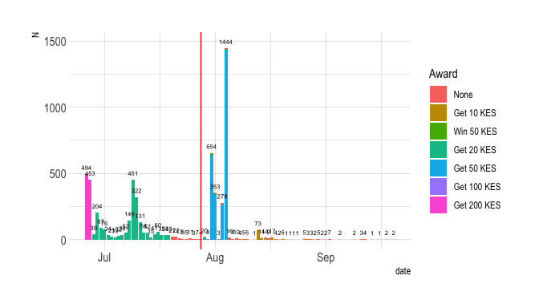

# Number of Responses

```r
data %>%
  group_by(date) %>%
  dplyr::summarise(N = n()) %>%
  ggplot() +
  geom_col(aes(x=date, y=N)) +
  geom_vline(xintercept = as.Date(PILOT_2_DATE),
             color = "red") +
  theme_ipsum()
```

<!-- -->


## R Markdown


```r
summary(cars)
```

```
##      speed           dist       
##  Min.   : 4.0   Min.   :  2.00  
##  1st Qu.:12.0   1st Qu.: 26.00  
##  Median :15.0   Median : 36.00  
##  Mean   :15.4   Mean   : 42.98  
##  3rd Qu.:19.0   3rd Qu.: 56.00  
##  Max.   :25.0   Max.   :120.00
```

## Including Plots

You can also embed plots, for example:

<!-- -->

Note that the `echo = FALSE` parameter was added to the code chunk to prevent printing of the R code that generated the plot.
